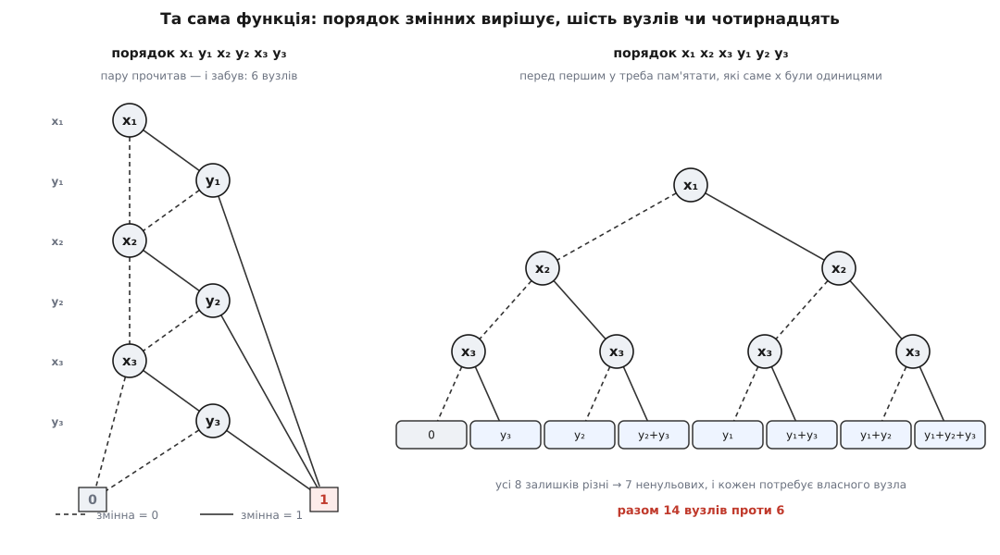
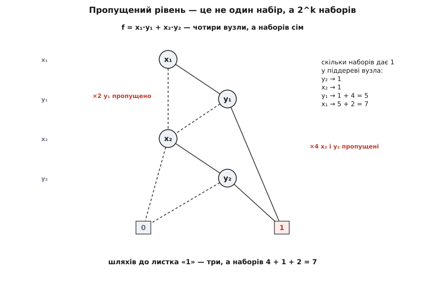
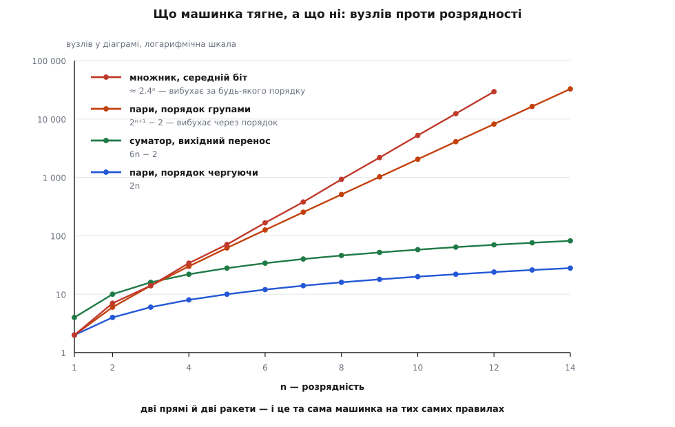

# ⚙️ Рекурсивна машинка розкладань

<preknowlist>
- [Рекурсія](book:algorithms/recursion) — розв'язок, що звертається сам до себе на меншій задачі й спиняється на тривіальному випадку.
- [Хеш-таблиця](book:algorithms/hash-table) — сховище «ключ → значення», у якому пошук коштує в середньому сталий час; ця сталість тримається на якості хеш-функції.
- [Мемоізація](book:algorithms/memoization) — запам'ятати відповідь на вже пораховане й наступного разу віддати її з таблиці, замість рахувати вдруге.
- [Суматор із прискореним переносом](book:electronics/carry-lookahead-adder) — G = A·B («перенос породжується тут»), P = A + B («перенос крізь розряд пропускається»), Cout = G + P·C; наскрізний приклад тут — саме він проти ланцюжкового суматора.
</preknowlist>

Уся таблиця істинності функції шести змінних — це 64 біти, тобто одне машинне слово. Функція живе в регістрі, підстановка значення робиться зсувом і маскою, порівняння двох функцій — це `==` на двох `uint64_t`. Швидше вже не буває, і саме так усередині влаштовані промислові програми синтезу логіки — доки змінних не більше шести.

Сьома змінна вимагає двох слів, десята — сотні байтів, тридцята — понад сотню мегабайтів. А тепер конкретне запитання, яке ставлять щодня: **тридцятидворозрядний суматор**. Два доданки по 32 біти й вхідний перенос — це 65 змінних. Таблиця істинності його вихідного переносу — 2⁶⁵ бітів, тобто чотири з половиною екзабайти на одну функцію. Цієї таблиці не буде ніколи.

А запитання лишається, і воно навіть не хитре:

```
Схема А: ланцюжок — c = G₀ + P₀·cin, потім c = G₁ + P₁·c, і так 32 рази.
Схема Б: прискорений перенос — усі 32 переноси пораховано наперед, паралельно.

Це та сама функція чи ні?
```

Дві схеми, написані різними людьми з різних міркувань: одна проста й повільна, друга заплутана й швидка. Питання інженера — чи можна замінити першу другою. Питання, на яке «переберімо всі набори» відповіді не дає й не дасть.

## Чому сама рекурсія нічого не дає

Спокуса очевидна: якщо тотожність `f = x·f₁ + x̄·f₀` розбиває функцію на дві простіші, то напишімо рекурсію. Розкласти f за x₁ — вийде дві функції. Кожну розкласти за x₂ — вийде чотири. Потім вісім. На дні, коли змінні скінчаться, лишаться константи 0 і 1, а тоді збираймо відповідь назад.

Порахуймо, що ми щойно збудували. Рівнів — n, розгалуження двійкове, отже на дні **2ⁿ листків**. По одному на кожен набір входів.

Це таблиця істинності. Ми не зробили нічого — просто виписали ту саму таблицю, тільки повільніше й через стек. Рекурсія сама собою не економить ані байта: вона чесно ділить задачу навпіл, і чесно робить це 2ⁿ разів.

Ось де ховається вся суть, і вона не в рекурсії. Придивімося до тих 2ⁿ листків уважніше: серед них рівно два **різні** — 0 і 1. Піднімімося на рівень вище: там 2ⁿ⁻¹ вузлів, а різних функцій серед них щонайбільше чотири. Дерево велетенське, але **різного в ньому мало**. Одні й ті самі підфункції трапляються знову і знову, просто на різних гілках, і ми старанно розкладаємо кожну копію окремо, наче вперше її бачимо.

Тож завдання машинки — не ділити задачу навпіл. Ділити навпіл уміє тотожність. Завдання машинки — **жодного разу не порахувати те саме двічі**.

## Одні двері й дві таблиці

Щоб ніколи не рахувати те саме двічі, треба вміти впізнавати те саме. А впізнавати легко, якщо однакове зробити не «рівним», а **тим самим об'єктом**.

Прийом такий. Хай вузол не можна створити абиде — хай усі вузли народжуються в одній-єдиній функції, назвімо її `mk`. Вона приймає змінну й дві гілки, і перш ніж створити вузол, зазирає в таблицю: чи не було вже точно такого? Був — віддає старий. Не було — створює й записує. Тоді два однакові піддерева — це фізично один вузол із одним номером, бо іншого шляху народитися в них не було.

І тут ланцюжок наслідків сипле подарунками. Якщо кожна функція має рівно один номер, то **порівняти дві функції — це порівняти два цілі числа**. Не обійти два графи, не звірити дві таблиці: `f == g`. Питання про рівність функцій від 65 змінних коштує один такт.

Прийом має ім'я — **хеш-консинг** (англ. *hash consing*: `cons` — лісп-комірка, з якої збирали списки, `hash` — таблиця, у якій їх шукали). Ім'я, щоправда, молодше за прийом. Ідею — хешувати підвирази, щоб упізнавати однакові й не рахувати двічі — описав радянський математик Андрій Єршов (*Андрей Ершов*) у статті «On programming of arithmetic operations» (*Communications of the ACM*, 1958), за півтора десятиліття до самої назви й до появи Лісп-машин; назва ж прийшла з лісп-систем 1970-х, зокрема з праці Ейіті Ґото (*Eiichi Goto*, 1974). Статус: **усталено** — Єршова надруковано в самому CACM, тож першість тут перевіряється за друком, а не за переказом.

Ту саму таблицю прийнято звати **реєстром вузлів** (англ. *unique table*). Але сама вона не рятує: вона впізнає готовий вузол, а щоб його зліпити, ми вже спустилися рекурсією донизу. Тому потрібна друга таблиця — **кеш обчисленого** (англ. *computed table*): ключ «яка операція над якими двома функціями», значення — готова відповідь. Не «схожа», а буквально та сама трійка номерів.

Друга таблиця вимикає повторний спуск, перша — повторне зберігання. Разом вони перетворюють дерево на 2ⁿ листків на граф, у якому стільки вузлів, скільки в задачі справді різних підфункцій.

Лишається третє правило, найтихіше й найважливіше. Якщо `mk` дістала вузол, у якого **обидві гілки ведуть в одне й те саме місце**, — такий вузол не потрібен: його змінна ні на що не впливає, і `mk` віддає гілку замість вузла. Без цього правила «однакове має один номер» розсипається: та сама функція, зібрана двома різними шляхами, дістане два різні номери, і вся конструкція втратить сенс. Правило варте того, щоб прибрати його навмисно й подивитися на видовище — воно нижче, серед пасток.

> 🔧 **Навіщо це.** Верифікатор, що звіряє перероблену схему зі старою, не має інших інструментів, крім цього. Він будує обидві функції в одному реєстрі й дивиться на два цілі числа. Збіглися — схеми тотожні, і це доведення, а не вибіркова перевірка: жодного набору не пропущено, бо жодного набору й не перебирали. Не збіглися — різниця сама є функцією, і машинка тут-таки скаже, на скількох наборах схеми розходяться й на якому саме.

## Формулу можна розкладати, не знаючи функції

Одне лишилося пояснити: звідки взяти кофактори, якщо таблиці немає. Відповідь у тому, що підстановка проходить крізь операції наскрізь — `(f·g)|ₓ₌₁ = f|ₓ₌₁ · g|ₓ₌₁`, і так само для «або» та «не». Підстановці байдуже, як побудований вираз.

Отже, розкладати можна не функцію, а **дію над двома функціями**:

```
f op g  =  x·(f₁ op g₁)  +  x̄·(f₀ op g₀)        x — верхня зі змінних, що є у f або g
```

Це та сама тотожність, лише прочитана як рецепт. Щоб застосувати «і» до двох діаграм, візьми верхню змінну, зістав половини з половинами, а результати склей через `mk`. Дно рекурсії — константи, де «і» рахується просто.

І тепер найголовніше: дерева на 2ⁿ листків **не існує ніколи**. Ми не будуємо його й не стискаємо потім. Ми починаємо з окремих змінних — це вузлики на два листки — і зрощуємо їх операціями, а `mk` пильнує, щоб нічого не задвоїлося. Граф росте знизу вгору й одразу зведений.

## Машинка

Дві вкладки — одна програма, дослівно той самий алгоритм і той самий вивід. C++ — бо це той рід коду, де важать байти вузла й влучання в кеш, і бо всі промислові пакети діаграм написані саме так. Python — бо словник із кортежем-ключем і є найкоротший спосіб сказати «реєстр вузлів», а цілі числа тут довільної точності, і підрахунок наборів виходить точним задарма.

:::tabs
```cpp
// ─────────── ЧАСТИНА 1: машинка ───────────
#include <algorithm>
#include <cmath>
#include <cstdint>
#include <cstdio>
#include <optional>
#include <unordered_map>
#include <unordered_set>
#include <vector>

enum class Op { And, Or, Xor };

class Bdd {
public:
    static constexpr int Zero = 0;
    static constexpr int One = 1;

    explicit Bdd(int nvars) : nvars_(nvars), nodes_(2) {}   // 0 і 1 — термінали

    // Єдине місце, де народжується вузол. Обидва правила зведення — тут.
    int mk(int var, int lo, int hi) {
        if (lo == hi) return lo;                       // усунення: змінна ні на що не впливає
        const Node node{var, lo, hi};
        if (const auto it = unique_.find(node); it != unique_.end())
            return it->second;                         // злиття: такий вузол уже є
        const int u = static_cast<int>(nodes_.size());
        nodes_.push_back(node);
        unique_.emplace(node, u);
        return u;
    }

    int variable(int i) { return mk(i, Zero, One); }

    // Розкладання Шеннона, застосоване до пари функцій.
    int apply(Op op, int f, int g) {
        ++calls_;
        if (const int t = terminal(op, f, g); t >= 0) return t;
        if (f > g) std::swap(f, g);                    // усі три операції комутативні
        const CacheKey key{op, f, g};
        if (const auto it = cache_.find(key); it != cache_.end()) { ++hits_; return it->second; }
        const int var = std::min(top(f), top(g));      // верхня зі змінних, що зустрілися
        const auto [f0, f1] = cofactors(f, var);
        const auto [g0, g1] = cofactors(g, var);
        const int r = mk(var, apply(op, f0, g0), apply(op, f1, g1));
        cache_.emplace(key, r);
        return r;
    }

    std::size_t size(int u) const {
        std::unordered_set<int> seen;
        std::vector<int> stack{u};
        while (!stack.empty()) {
            const int x = stack.back();
            stack.pop_back();
            if (x < 2 || !seen.insert(x).second) continue;
            stack.push_back(nodes_[x].lo);
            stack.push_back(nodes_[x].hi);
        }
        return seen.size();
    }

    // Скільки з 2^nvars наборів дають 1. double — бо 2^n переростає будь-яке ціле.
    double count(int u) const {
        std::unordered_map<int, double> memo;
        return std::ldexp(countRec(u, memo), top(u));  // рівні НАД коренем теж пропущені
    }

    // Набір, на якому f = 1. У зведеній діаграмі кожен вузол, крім 0, здійсненний,
    // тому спуск ніколи не заходить у глухий кут — жодного вороття.
    std::optional<std::vector<int>> witness(int u) const {
        if (u == Zero) return std::nullopt;
        std::vector<int> env(nvars_, 0);               // пропущені змінні байдужі — хай 0
        while (u != One) {
            const Node& nd = nodes_[u];
            const bool takeHigh = (nd.lo == Zero);
            env[nd.var] = takeHigh ? 1 : 0;
            u = takeHigh ? nd.hi : nd.lo;
        }
        return env;
    }

    long long calls() const { return calls_; }
    long long hits() const { return hits_; }
    std::size_t tableSize() const { return nodes_.size() - 2; }

private:
    struct Node {
        int var, lo, hi;
        bool operator==(const Node& o) const noexcept {
            return var == o.var && lo == o.lo && hi == o.hi;
        }
    };
    struct CacheKey {
        Op op; int f, g;
        bool operator==(const CacheKey& o) const noexcept {
            return op == o.op && f == o.f && g == o.g;
        }
    };
    struct Hash {
        std::size_t operator()(const Node& k) const noexcept { return mix(k.var, k.lo, k.hi); }
        std::size_t operator()(const CacheKey& k) const noexcept {
            return mix(static_cast<int>(k.op), k.f, k.g);
        }
        static std::size_t mix(int a, int b, int c) noexcept {
            std::uint64_t h = static_cast<std::uint32_t>(a);
            h = h * 0x9E3779B97F4A7C15ull + static_cast<std::uint32_t>(b);
            h = (h ^ (h >> 29)) * 0xBF58476D1CE4E5B9ull + static_cast<std::uint32_t>(c);
            return static_cast<std::size_t>(h ^ (h >> 32));
        }
    };

    // Термінал не має змінної: віддаємо «рівень нижче всіх» — так min() працює сам собою.
    int top(int u) const { return u < 2 ? nvars_ : nodes_[u].var; }

    std::pair<int, int> cofactors(int u, int var) const {
        if (top(u) != var) return {u, u};               // змінної немає — обидві половини ті самі
        return {nodes_[u].lo, nodes_[u].hi};
    }

    static int terminal(Op op, int f, int g) {
        switch (op) {
        case Op::And:
            if (f == Zero || g == Zero) return Zero;
            if (f == One) return g;
            if (g == One) return f;
            if (f == g) return f;
            break;
        case Op::Or:
            if (f == One || g == One) return One;
            if (f == Zero) return g;
            if (g == Zero) return f;
            if (f == g) return f;
            break;
        case Op::Xor:
            if (f == Zero) return g;
            if (g == Zero) return f;
            if (f == g) return Zero;
            break;
        }
        return -1;
    }

    double countRec(int u, std::unordered_map<int, double>& memo) const {
        if (u < 2) return static_cast<double>(u);       // 0 → жодного набору, 1 → один
        if (const auto it = memo.find(u); it != memo.end()) return it->second;
        const Node& nd = nodes_[u];
        const double r = std::ldexp(countRec(nd.lo, memo), top(nd.lo) - nd.var - 1)
                       + std::ldexp(countRec(nd.hi, memo), top(nd.hi) - nd.var - 1);
        memo.emplace(u, r);
        return r;
    }

    int nvars_;
    std::vector<Node> nodes_;
    std::unordered_map<Node, int, Hash> unique_;        // вузол → його єдиний номер
    std::unordered_map<CacheKey, int, Hash> cache_;     // (операція, f, g) → готова відповідь
    long long calls_ = 0, hits_ = 0;
};

// ─────────── ЧАСТИНА 2: два суматори й дослід ───────────
struct Carry { int ripple, lookahead; };

// Змінні: a0 b0 a1 b1 ... a(n-1) b(n-1) cin
static Carry buildAdder(Bdd& b, int n, bool dropCinTerm = false) {
    std::vector<int> A(n), B(n);
    for (int i = 0; i < n; ++i) {
        A[i] = b.variable(2 * i);
        B[i] = b.variable(2 * i + 1);
    }
    const int cin = b.variable(2 * n);

    int c = cin;                                        // ланцюжок: c = G_i + P_i·c
    for (int i = 0; i < n; ++i) {
        const int g = b.apply(Op::And, A[i], B[i]);
        const int p = b.apply(Op::Or, A[i], B[i]);
        c = b.apply(Op::Or, g, b.apply(Op::And, p, c));
    }
    const int ripple = c;

    std::vector<int> G(n), P(n);                        // прискорений: усі переноси наперед
    for (int i = 0; i < n; ++i) {
        G[i] = b.apply(Op::And, A[i], B[i]);
        P[i] = b.apply(Op::Xor, A[i], B[i]);
    }
    int cla = Bdd::Zero;
    for (int i = 0; i < n; ++i) {
        int t = G[i];
        for (int j = i + 1; j < n; ++j) t = b.apply(Op::And, t, P[j]);
        cla = b.apply(Op::Or, cla, t);
    }
    if (!dropCinTerm) {                                 // доданок cin·P0···P(n-1)
        int t = cin;
        for (int j = 0; j < n; ++j) t = b.apply(Op::And, t, P[j]);
        cla = b.apply(Op::Or, cla, t);
    }
    return {ripple, cla};
}

// f = x0·y0 + x1·y1 + ... — щоб побачити ціну порядку змінних
static int buildPairs(Bdd& b, int n, bool interleaved) {
    int f = Bdd::Zero;
    for (int i = 0; i < n; ++i) {
        const int x = b.variable(interleaved ? 2 * i : i);
        const int y = b.variable(interleaved ? 2 * i + 1 : n + i);
        f = b.apply(Op::Or, f, b.apply(Op::And, x, y));
    }
    return f;
}

int main() {
    std::printf("=== той самий перенос, зібраний двома різними схемами ===\n");
    std::printf("  n | вузлів | rc == cla | наборів Cout=1 | усього наборів\n");
    for (const int n : {4, 16, 32}) {
        Bdd b(2 * n + 1);
        const Carry c = buildAdder(b, n);
        std::printf(" %2d | %6zu | %9s | %14.0f | %.0f\n", n, b.size(c.ripple),
                    c.ripple == c.lookahead ? "ТАК" : "НІ", b.count(c.ripple),
                    std::ldexp(1.0, 2 * n + 1));
    }

    std::printf("\n=== а тепер у прискореному забули доданок cin·P0···P(n-1) ===\n");
    {
        const int n = 16;
        Bdd b(2 * n + 1);
        const Carry c = buildAdder(b, n, /*dropCinTerm=*/true);
        const int miter = b.apply(Op::Xor, c.ripple, c.lookahead);  // де схеми РІЗНЯТЬСЯ
        std::printf("  rc == cla: %s | вузлів у різниці: %zu | наборів-контрприкладів: %.0f з %.0f\n",
                    c.ripple == c.lookahead ? "ТАК" : "НІ", b.size(miter),
                    b.count(miter), std::ldexp(1.0, 2 * n + 1));
        const auto env = b.witness(miter);
        long long a = 0, bb = 0;
        for (int i = 0; i < n; ++i) {
            a |= static_cast<long long>((*env)[2 * i]) << i;
            bb |= static_cast<long long>((*env)[2 * i + 1]) << i;
        }
        const int cin = (*env)[2 * n];
        std::printf("  контрприклад: a=%lld, b=%lld, cin=%d\n", a, bb, cin);
        std::printf("  чесна арифметика: (a+b+cin) >> %d = %lld"
                    "   ← ланцюжок каже це, поламаний прискорений каже 0\n",
                    n, (a + bb + cin) >> n);
    }

    std::printf("\n=== ціна порядку змінних: f = x0·y0 + ... + x(n-1)·y(n-1) ===\n");
    std::printf("  n | чергуючи | групами | у скільки разів\n");
    for (int n = 2; n <= 12; ++n) {
        Bdd bi(2 * n), bg(2 * n);
        const std::size_t si = bi.size(buildPairs(bi, n, true));
        const std::size_t sg = bg.size(buildPairs(bg, n, false));
        std::printf(" %2d | %8zu | %7zu | %.0f×\n", n, si, sg, double(sg) / double(si));
    }

    std::printf("\n=== кеш ===\n");
    for (const int n : {8, 32}) {
        Bdd b(2 * n + 1);
        buildAdder(b, n);
        std::printf("  суматор n=%2d: викликів apply=%lld, влучань=%lld (%.0f%%),"
                    " вузлів у таблиці=%zu\n", n, b.calls(), b.hits(),
                    100.0 * double(b.hits()) / double(b.calls()), b.tableSize());
    }
    return 0;
}
```
```python
# ─────────── ЧАСТИНА 1: машинка ───────────
from typing import NamedTuple

ZERO, ONE = 0, 1


class Node(NamedTuple):
    var: int
    lo: int
    hi: int


class Bdd:
    def __init__(self, nvars: int) -> None:
        self.nvars = nvars
        self.nodes: list[Node | None] = [None, None]      # 0 і 1 — термінали
        self.unique: dict[Node, int] = {}                 # вузол → його єдиний номер
        self.cache: dict[tuple[str, int, int], int] = {}  # (операція, f, g) → готова відповідь
        self.calls = self.hits = 0

    # Термінал не має змінної: віддаємо «рівень нижче всіх» — так min() працює сам собою.
    def top(self, u: int) -> int:
        return self.nvars if u < 2 else self.nodes[u].var

    # Єдине місце, де народжується вузол. Обидва правила зведення — тут.
    def mk(self, var: int, lo: int, hi: int) -> int:
        if lo == hi:
            return lo                                     # усунення: змінна ні на що не впливає
        node = Node(var, lo, hi)
        if (u := self.unique.get(node)) is not None:
            return u                                      # злиття: такий вузол уже є
        u = len(self.nodes)
        self.nodes.append(node)
        self.unique[node] = u
        return u

    def variable(self, i: int) -> int:
        return self.mk(i, ZERO, ONE)

    def cofactors(self, u: int, var: int) -> tuple[int, int]:
        if self.top(u) != var:
            return u, u                                   # змінної немає — обидві половини ті самі
        return self.nodes[u].lo, self.nodes[u].hi

    @staticmethod
    def _terminal(op: str, f: int, g: int) -> int | None:
        if op == "and":
            if ZERO in (f, g): return ZERO
            if f == ONE: return g
            if g == ONE: return f
            if f == g: return f
        elif op == "or":
            if ONE in (f, g): return ONE
            if f == ZERO: return g
            if g == ZERO: return f
            if f == g: return f
        elif op == "xor":
            if f == ZERO: return g
            if g == ZERO: return f
            if f == g: return ZERO
        return None

    # Розкладання Шеннона, застосоване до пари функцій.
    def apply(self, op: str, f: int, g: int) -> int:
        self.calls += 1
        if (t := self._terminal(op, f, g)) is not None:
            return t
        key = (op, f, g) if f <= g else (op, g, f)        # усі три операції комутативні
        if (r := self.cache.get(key)) is not None:
            self.hits += 1
            return r
        var = min(self.top(f), self.top(g))               # верхня зі змінних, що зустрілися
        f0, f1 = self.cofactors(f, var)
        g0, g1 = self.cofactors(g, var)
        r = self.mk(var, self.apply(op, f0, g0), self.apply(op, f1, g1))
        self.cache[key] = r
        return r

    def size(self, u: int) -> int:
        seen: set[int] = set()
        stack = [u]
        while stack:
            x = stack.pop()
            if x < 2 or x in seen:
                continue
            seen.add(x)
            stack.extend((self.nodes[x].lo, self.nodes[x].hi))
        return len(seen)

    # Скільки з 2^nvars наборів дають 1. int — точно, без округлень.
    def count(self, u: int) -> int:
        memo: dict[int, int] = {}

        def rec(x: int) -> int:
            if x < 2:
                return x                                  # 0 → жодного набору, 1 → один
            if (r := memo.get(x)) is not None:
                return r
            var, lo, hi = self.nodes[x]
            r = (rec(lo) << (self.top(lo) - var - 1)) + (rec(hi) << (self.top(hi) - var - 1))
            memo[x] = r
            return r

        return rec(u) << self.top(u)                      # рівні НАД коренем теж пропущені

    # Набір, на якому f = 1. У зведеній діаграмі кожен вузол, крім 0, здійсненний,
    # тому спуск ніколи не заходить у глухий кут — жодного вороття.
    def witness(self, u: int) -> dict[int, int] | None:
        if u == ZERO:
            return None
        env = dict.fromkeys(range(self.nvars), 0)         # пропущені змінні байдужі — хай 0
        while u != ONE:
            var, lo, hi = self.nodes[u]
            take_high = lo == ZERO
            env[var] = int(take_high)
            u = hi if take_high else lo
        return env


# ─────────── ЧАСТИНА 2: два суматори й дослід ───────────
def build_adder(b: Bdd, n: int, drop_cin_term: bool = False) -> tuple[int, int]:
    """Змінні: a0 b0 a1 b1 ... a(n-1) b(n-1) cin. Повертає (ланцюжок, прискорений)."""
    A = [b.variable(2 * i) for i in range(n)]
    B = [b.variable(2 * i + 1) for i in range(n)]
    cin = b.variable(2 * n)

    c = cin                                               # ланцюжок: c = G_i + P_i·c
    for i in range(n):
        g = b.apply("and", A[i], B[i])
        p = b.apply("or", A[i], B[i])
        c = b.apply("or", g, b.apply("and", p, c))
    ripple = c

    G = [b.apply("and", A[i], B[i]) for i in range(n)]    # прискорений: усі переноси наперед
    P = [b.apply("xor", A[i], B[i]) for i in range(n)]
    cla = ZERO
    for i in range(n):
        t = G[i]
        for j in range(i + 1, n):
            t = b.apply("and", t, P[j])
        cla = b.apply("or", cla, t)
    if not drop_cin_term:                                 # доданок cin·P0···P(n-1)
        t = cin
        for j in range(n):
            t = b.apply("and", t, P[j])
        cla = b.apply("or", cla, t)

    return ripple, cla


def build_pairs(b: Bdd, n: int, interleaved: bool) -> int:
    """f = x0·y0 + x1·y1 + ... — щоб побачити ціну порядку змінних."""
    f = ZERO
    for i in range(n):
        x = b.variable(2 * i if interleaved else i)
        y = b.variable(2 * i + 1 if interleaved else n + i)
        f = b.apply("or", f, b.apply("and", x, y))
    return f


if __name__ == "__main__":
    print("=== той самий перенос, зібраний двома різними схемами ===")
    print("  n | вузлів | rc == cla | наборів Cout=1 | усього наборів")
    for n in (4, 16, 32):
        b = Bdd(2 * n + 1)
        rc, cla = build_adder(b, n)
        print(f" {n:2d} | {b.size(rc):6d} | {'ТАК' if rc == cla else 'НІ':>9} |"
              f" {b.count(rc):14d} | {2 ** (2 * n + 1)}")

    print("\n=== а тепер у прискореному забули доданок cin·P0···P(n-1) ===")
    n = 16
    b = Bdd(2 * n + 1)
    rc, bad = build_adder(b, n, drop_cin_term=True)
    miter = b.apply("xor", rc, bad)                       # рівно ті набори, де схеми РІЗНЯТЬСЯ
    print(f"  rc == cla: {'ТАК' if rc == bad else 'НІ'} | вузлів у різниці: {b.size(miter)}"
          f" | наборів-контрприкладів: {b.count(miter)} з {2 ** (2 * n + 1)}")
    env = b.witness(miter)
    a_val = sum(env[2 * i] << i for i in range(n))
    b_val = sum(env[2 * i + 1] << i for i in range(n))
    cin_val = env[2 * n]
    print(f"  контрприклад: a={a_val}, b={b_val}, cin={cin_val}")
    print(f"  чесна арифметика: (a+b+cin) >> {n} = {(a_val + b_val + cin_val) >> n}"
          f"   ← ланцюжок каже це, поламаний прискорений каже 0")

    print("\n=== ціна порядку змінних: f = x0·y0 + ... + x(n-1)·y(n-1) ===")
    print("  n | чергуючи | групами | у скільки разів")
    for n in range(2, 13):
        bi, bg = Bdd(2 * n), Bdd(2 * n)
        si = bi.size(build_pairs(bi, n, True))
        sg = bg.size(build_pairs(bg, n, False))
        print(f" {n:2d} | {si:8d} | {sg:7d} | {sg / si:.0f}×")

    print("\n=== кеш ===")
    for n in (8, 32):
        b = Bdd(2 * n + 1)
        build_adder(b, n)
        print(f"  суматор n={n:2d}: викликів apply={b.calls}, влучань={b.hits}"
              f" ({100 * b.hits / b.calls:.0f}%), вузлів у таблиці={len(b.nodes) - 2}")
```
:::

Те, що вийшло, називається [двійкова діаграма рішень](book:algorithms/binary-decision-diagram) — і, як бачимо, вона не «структура даних, яку треба вивчити», а просто те, що лишається від дерева розкладань, коли не тримати однакового двічі.

## Що вона каже про суматор

```
=== той самий перенос, зібраний двома різними схемами ===
  n | вузлів | rc == cla | наборів Cout=1 | усього наборів
  4 |     22 |       ТАК |            256 | 512
 16 |     94 |       ТАК |     4294967296 | 8589934592
 32 |    190 |       ТАК | 18446744073709551616 | 36893488147419103232
```

Тридцятидворозрядний суматор: чотири з половиною екзабайти таблиці вмістилися в **190 вузлів**, а обидві схеми — ланцюжкова й прискорена — дістали один і той самий номер. Це не «збіглося на випробуваних наборах». Це доведення, що вони тотожні на всіх 2⁶⁵ наборах, здобуте за мілісекунди й без жодного перебору.

Кількість вузлів росте як 6n−2 — лінійно. Від чотирьох розрядів до тридцяти двох таблиця істинності роздулася в 2⁵⁶ разів — це сімдесят два квадрильйони, — а діаграма виросла з 22 вузлів до 190, тобто менш ніж удев'ятеро.

Правий стовпчик — теж не дрібниця. Машинка порахувала, на скількох із 2⁶⁵ наборів перенос дорівнює одиниці: 18 446 744 073 709 551 616, тобто рівно 2⁶⁴. Рівно половина. Це легко перевірити головою, і варто — коли машинка видає число завбільшки з усесвіт, добре мати чим його спіймати. Замінімо кожен вхідний біт на протилежний: a стає (2ⁿ−1−a), b теж, cin стає (1−cin). Сума двох наборів — вихідного й перевернутого — завжди дорівнює 2ⁿ⁺¹−1, а отже, рівно один із них дотягує до 2ⁿ, тобто дає перенос. Набори розбилися на пари, у кожній парі рівно одна одиниця — половина. Машинка не помилилася.

## Коли схема таки поламана

Правильна відповідь «так» — найменш цікава з можливих. Заберімо з прискореного суматора один доданок — `cin·P₀···P₁₅`, той, що пропускає вхідний перенос наскрізь через усі розряди. Помилка правдоподібна: цей доданок стоїть окремо від інших і його легко проґавити.

Різниця двох функцій — це `xor` між ними: функція, що дорівнює одиниці рівно там, де схеми розходяться. Її й будуємо тією самою машинкою.

```
=== а тепер у прискореному забули доданок cin·P0···P(n-1) ===
  rc == cla: НІ | вузлів у різниці: 49 | наборів-контрприкладів: 65536 з 8589934592
  контрприклад: a=0, b=65535, cin=1
  чесна арифметика: (a+b+cin) >> 16 = 1   ← ланцюжок каже це, поламаний прискорений каже 0
```

Машинка не просто сказала «різні». Вона сказала, що схеми розходяться рівно на 65 536 наборах із 8.6 мільярда — тобто помилка спрацьовує раз на 131 тисячу входів і жодне розумне випадкове тестування її не спіймає. І вона видала конкретний набір: `a = 0`, `b = 65535`, `cin = 1`. Складімо: 0 + 65535 + 1 = 65536 = 2¹⁶ — перенос є. Поламана схема каже, що його немає.

Погляньмо, чому саме цей набір. Усі шістнадцять розрядів мають aᵢ = 0, bᵢ = 1 — отже, жоден Gᵢ = aᵢ·bᵢ не спрацював, зате всі Pᵢ = aᵢ ⊕ bᵢ дорівнюють одиниці. Перенос не породжується ніде — він **пропускається наскрізь** від cin. Це рівно той випадок, за який відповідав викинутий доданок, і єдиний, за який він відповідав. Машинка знайшла не просто контрприклад, а найчистіше можливе свідчення про пропущену гілку — хоч про схему вона нічого не знала.

Спуск за контрприкладом дешевий саме завдяки правилу усунення. У зведеній діаграмі кожен вузол, окрім термінального 0, здійсненний — інакше `mk` замінила б його на 0. Тому спуск бере будь-яку гілку, що не веде в 0, і жодного разу не вертається. [Задача здійсненності](book:math/boolean-satisfiability), над якою розв'язувачі б'ються десятиліттями, тут вироджується в порівняння з нулем: `f != ZERO`. Не тому, що ми її розв'язали, — а тому, що всю ціну вже сплачено під час побудови діаграми.

## Ширина — це те, що доводиться пам'ятати

Лишається головне питання: чому 190 вузлів, а не 2⁶⁵? Що саме відрізняє функцію, яку машинка тягне, від тієї, на якій вона захлинеться?

Відповідь одна на всі випадки, і вона про пам'ять. Порахуймо вузли на одному рівні — скажімо, на рівні змінної xᵢ. Кожен такий вузол — це окрема функція, що лишається від f, коли змінні над xᵢ уже зафіксовано. Два різні набори верхніх змінних приводять в один і той самий вузол тоді й лише тоді, коли **все подальше поводження f після них однакове** — тобто розрізняти їх нема потреби. Отже:

```
ширина рівня xᵢ  =  скільки РІЗНИХ станів треба пам'ятати про змінні,
                    прочитані до xᵢ, щоб дочитати функцію до кінця
```

Це та сама лічба, що й у [скінченних автоматів](book:math/finite-automata): станів рівно стільки, скільки є справді різних «залишків майбутнього», а входи, після яких автомат поводиться однаково, зливаються в один стан. Діаграма — автомат, що читає змінні в сталому порядку.

Тепер усе стає видно. Виміряймо ширину по рівнях:

```
суматор, 8 розрядів  (a0 b0 a1 b1 … cin):
  вузлів на рівні:  1  2  3  3  3  3  3  3  3  3  3  3  3  3  3  3  1
```

Три. Хоч вісім розрядів, хоч тридцять два, хоч шістдесят чотири — ширина не росте, тільки драбина довшає. Бо все, що одній половині розрядів треба знати про другу, — це **один біт переносу**. Не самі доданки, не їхня сума — один біт. Мільярди різних половин зливаються в жменьку станів, і рівно тому підсумок лінійний.

А тепер функція, на якій та сама машинка ламається — причому не через саму функцію, а через порядок:


*Та сама функція f = x₁·y₁ + x₂·y₂ + x₃·y₃, два порядки змінних. Ліворуч пара читається й одразу забувається: щойно xᵢ·yᵢ дало одиницю — відповідь готова, інакше пам'ятати про пару нема чого. Праворуч усі x прочитано перед першим y, і кожна з восьми комбінацій лишає свій, ні на що не схожий залишок — усі вісім виписано під деревом. Шість вузлів проти чотирнадцяти; функція та сама, змінився лише порядок запитань.*

Читаючи пару за парою, пам'ятати не треба нічого: щойно якась пара дала одиницю — відповідь готова назавжди, і спуск іде просто в листок. Живий стан лишається один — «одиниці ще не було», — тому й ширина рівно один. Читаючи спершу всі x, машинка мусить донести до першого y, **які саме** x були одиницями, — а це 2ⁿ різних станів. Виміряно:

```
пари, n=6, порядок групами (x0…x5 y0…y5):
  вузлів на рівні:  1  2  4  8  16  32  32  16  8  4  2  1     ← пік 2ⁿ

пари, n=6, порядок чергуючи:
  вузлів на рівні:  1  1  1  1   1   1   1   1  1  1  1  1     ← пік 1
```

Стовпчик подвоюється на кожному прочитаному x — це буквально видно. І звідси береться та розбіжність, яку друкує програма:

```
=== ціна порядку змінних: f = x0·y0 + ... + x(n-1)·y(n-1) ===
  n | чергуючи | групами | у скільки разів
  4 |        8 |      30 | 4×
  8 |       16 |     510 | 32×
 12 |       24 |    8190 | 341×
```

Точні формули — 2n проти 2ⁿ⁺¹−2 (справджуються на всіх перевірених n). Лінійно проти експоненційно. **Той самий код, та сама функція, та сама машинка — різниця тільки в тому, у якому порядку ставити запитання.** Тому в справжніх пакетах діаграм добра половина складності — це переставляння змінних на льоту; порядок тут не оздоба, а різниця між «є відповідь» і «немає».

## Підрахунок і пастка пропущеного рівня

Підрахувати набори, на яких f = 1, здається просто: спустися діаграмою й додай. Це найчастіша й найпідступніша помилка в усій конструкції — і завдячує вона правилу усунення.

Правило викидає вузол, змінна якого ні на що не впливає. Через це ребро може перестрибнути через рівні: вузол x₁ веде просто до x₂, минаючи y₁. І тепер один шлях у діаграмі — це вже **не один набір**. Пропущена змінна вільна: вона може бути і нулем, і одиницею, обидва варіанти дають ту саму відповідь. Пропущено k рівнів — шлях коштує 2ᵏ наборів.


*f = x₁·y₁ + x₂·y₂ — чотири вузли, три шляхи до листка «1», а наборів сім. Ребро x₁ = 0 перестрибує через y₁: змінна y₁ вільна, тож шлях важить ×2. Ребро y₁ = 1 веде просто в «1», минаючи x₂ і y₂ — обидві вільні, вага ×4. Підрахунок іде знизу вгору: кожен вузол додає обидві гілки, помноживши кожну на 2 у степені пропущених під нею рівнів.*

Тому в коді й стоїть зсув `rec(lo) << (top(lo) - var - 1)` — це і є множення на 2ᵏ. Забути його — не «трохи неточно», а зовсім інша величина: замість наборів рахуються шляхи.

```
n | вузлів | шляхів до «1» | наборів (правильно)
 4 |      8 |            15 |                 175
 8 |     16 |           255 |               58975
16 |     32 |         65535 |          4251920575
```

Шляхів 2ⁿ−1, наборів 4ⁿ−3ⁿ. На шістнадцяти парах помилка — у 65 тисяч разів, і обидва числа виглядають однаково правдоподібно. Ніщо не впаде, ніщо не попередить: функція просто поверне не те, що обіцяє її назва.

## Де вона вибухає

Тепер чесно про межі — бо машинка їх має, і вони не там, де хотілося б.


*Кількість вузлів проти розрядності, логарифмічна шкала. Дві нижні криві — те, що машинка тягне: перенос суматора (6n−2) і пари в чергованому порядку (2n). Дві верхні — те, чого не тягне: ті самі пари в невдалому порядку (2ⁿ⁺¹−2) і середній біт множника, який вибухає за будь-якого порядку. Усі чотири виміряно тим самим кодом на тих самих правилах — різниця не в машинці, а в тому, скільки насправді доводиться пам'ятати.*

Груповий порядок ще можна виправити — переставити змінні. А от нижній рядок таблиці нижче виправити не можна нічим:

```
=== множник: біт добутку двох n-бітових чисел ===
   n | вузлів середнього біта | вузлів біта 0
   4 |                     34 |             2
   6 |                    167 |             2
   8 |                    926 |             2
  10 |                   5246 |             2
  12 |                  29398 |             2
```

Молодший біт добутку — це просто a₀·b₀, два вузли назавжди. А середній біт множиться приблизно в 2.4 разу на кожен доданий розряд. Причина та сама, що й скрізь: щоб дорахувати середній біт, доводиться пам'ятати накопичену суму часткових добутків — а різних таких сум експоненційно багато, і жоден порядок змінних цього не рятує. Для середнього біта множника доведено нижню оцінку 2^(n/8) вузлів **за будь-якого порядку змінних** (Рендел Браянт, 1991; усталений результат). Тридцятидворозрядний множник у такий спосіб не звірити — ні сьогодні, ні за тисячу років.

Ось воно, чесне місце цієї машинки. Суматор — 190 вузлів, множник тієї самої розрядності — недосяжний. Розкладання не скасовує експоненти: воно переносить її з часу перебору в **розмір графа**. Де функція справді потребує багато пам'ятати — граф і буде завбільшки з те, що треба пам'ятати. Дива не сталося; сталося те, що для величезного класу справжніх схем пам'ятати треба мало, і машинка це вміє помітити.

## Складність і пастки

**Скільки коштує `apply`.** Пара `(f, g)` кладеться в кеш один раз, тож різних викликів не більше, ніж пар вузлів: **O(|f|·|g|)**. Оцінка з праці Рендела Браянта 1986 року, де цей алгоритм і описано; сам автор згодом уточнив, що в тій таблиці бракувало множника (log|f| + log|g|) на зведення графа, але після роботи Веґенера й Зілінга (1993) про зведення за лінійний час логарифми з оцінки прибрано, а на практиці всі реалізації беруть хеш-таблиці. Головне тут інше: оцінка **поліноміальна від розмірів графів** — а самі графи бувають експоненційні. Машинка швидка рівно доти, доки відповідь мала.

Виміряти це можна просто — програма й друкує:

```
=== кеш ===
  суматор n= 8: викликів apply=1447, влучань=380 (26%), вузлів у таблиці=638
  суматор n=32: викликів apply=23035, влучань=8348 (36%), вузлів у таблиці=10958
```

Тридцять шість відсотків викликів для 32-розрядного суматора не пішли вниз узагалі. Без кеша ці гілки довелося б розкласти повторно — і рекурсія знову стала б деревом.

**Пастка перша: `mk` без правила усунення.** Найтихіша й найгірша. Приберімо перевірку `lo == hi` й попросімо машинку спростити `x·y + x̄·y` — функцію, що очевидно дорівнює `y`:

```
з правилом low==high   → f(x·y + x̄·y) id=3, y id=3, f==y: True  | вузлів: 1
БЕЗ правила low==high  → f(x·y + x̄·y) id=7, y id=3, f==y: False | вузлів: 2

суматор n=4, з правилом   → rc=88 cla=88,  rc==cla: True
суматор n=4, БЕЗ правила  → rc=88 cla=172, rc==cla: False
```

Вузол зі змінною x, обидві гілки якого ведуть у `y`, лишився жити — і функція дістала другий номер. Наслідок: верифікатор заявляє, що два **тотожні** суматори різні. Нічого не впало, нічого не попередило; просто відповідь стала брехнею. Єдиність номера — це не оптимізація, а умова, за якої вся конструкція взагалі щось означає.

**Пастка друга: ключ кеша без операції.** Спокуса зекономити й класти в кеш пару `(f, g)`. Тоді `and(f, g)` радо забирає відповідь, яку залишив по собі `or(f, g)`:

```
з op у ключі     → вузлів: 4, наборів: 4  (правильно)
БЕЗ op у ключі   → вузлів: 2, наборів: 6  ← мовчазна дурниця
```

Ключ кеша мусить нести все, від чого залежить відповідь. Це нудна істина, і саме тому на ній ловляться.

**Пастка третя: підрахунок без ваги 2ᵏ.** Розібрана вище: рахуються шляхи замість наборів, помилка тихо росте з розміром.

**Пастка четверта: порядок змінних.** Розібрана вище: 341-кратна різниця на дванадцяти парах — і це на іграшці.

**Пастка п'ята: чим рахувати набори.** Тут вкладки розходяться по-справжньому, і не випадково. Кількість наборів для функції 65 змінних сягає 2⁶⁵ — це не влазить у `uint64_t`. Python із цілими довільної точності дає точну відповідь задарма; C++ мусить обирати, і в коді вище обрано `double`, як роблять справжні пакети: у CUDD функція `Cudd_CountMinterm` теж повертає `double` — саме щоб узяти більше змінних. Ціна відома: понад 2⁵³ рахунок стає наближеним, а понад ~1023 змінні `double` віддає нескінченність; для точності в CUDD є окремі `Cudd_ApaCountMinterm` (довільна точність) і `Cudd_EpdCountMinterm` (розширена). У нашому суматорі пощастило — 4ⁿ є степенем двійки й лягає в `double` точно, — але покладатися на таку удачу не варто.

**Пастка шоста: сміття.** Наша машинка не звільняє нічого: реєстр росте, доки живе об'єкт. Для досліду це чесно, для роботи — ні. Проміжні функції, на які вже ніхто не посилається, лишаються в пам'яті назавжди, а вузол коштує щонайменше три цілі плюс місце в двох хеш-таблицях. Промислові пакети тому й ведуть підрахунок посилань і збирання сміття — і саме там, а не в `apply`, у них найбільше коду.

**Пастка сьома: кеш і реєстр — різні за природою.** Реєстр вузлів мусить бути **точним**: загубив запис — загубив єдиність номера, і все розвалилося (пастка перша). Кеш обчисленого — навпаки, **лише кеш**: викинь із нього хоч усе, і машинка залишиться правильною, просто повільнішою. Тому справжні реалізації роблять кеш обчисленого таблицею фіксованого розміру, що затирає старе без жодного жалю, — а реєстр не чіпають ніколи. Знати, який із двох можна втрачати, — і є та різниця, з якої починається робочий пакет.
