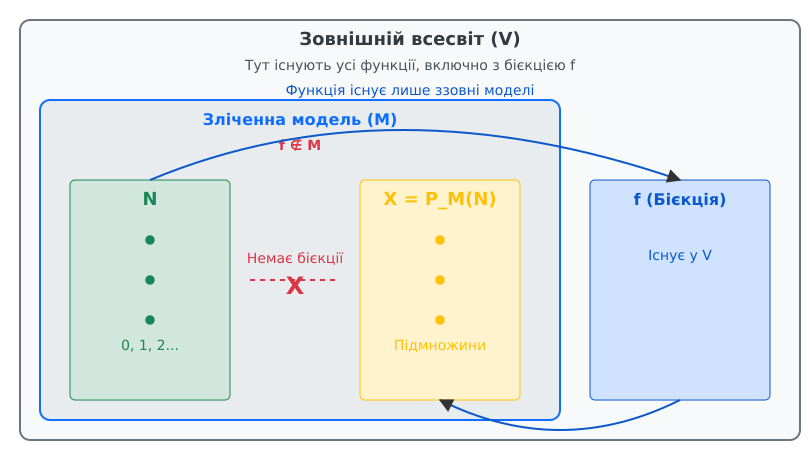

<preknowlist>
- [Основи теорії множин ZFC](/math/logic-foundations/zfc-set-theory/)
- [Зліченні та незліченні множини](/math/logic-foundations/countable-sets/)
- [Теорема Левенгейма — Сколема](/math/logic-foundations/model-theory-basics/)
</preknowlist>

> 🔧 **Навіщо це.**
> Парадокс Сколема ілюструє глибоку відносність математичних понять у формальних теоріях. Він показує, що такі інтуїтивно абсолютні речі, як «незліченність», насправді залежать від обраної моделі, в якій ми працюємо. Розуміння цього парадоксу дозволяє уникнути багатьох помилок при інтерпретації формальних систем, вчить розрізняти об'єкти всередині моделі та погляд на них «ззовні», а також демонструє дивовижні межі того, що саме можна виразити мовою логіки першого порядку. Це необхідний фундамент для глибшого розуміння теорії моделей та основ математики.

Коли ми вперше стикаємося з нескінченністю в математиці, все здається досить простим. Є натуральні числа 0, 1, 2, ..., яких нескінченно багато. Потім ми дізнаємося від Георга Кантора, що не всі нескінченності однакові. Існує незліченна нескінченність, наприклад, кількість усіх підмножин натуральних чисел або кількість дійсних чисел. 

Але в 1922 році норвезький математик Торальф Сколем звернув увагу на дивовижний наслідок, який випливає з однієї з базових теорем математичної логіки. Цей наслідок, на перший погляд, повністю суперечив теоремі Кантора про незліченність. Здавалося, що логіка сама собі суперечить. Цю ситуацію і назвали «Парадоксом Сколема».

Щоб розібратися в ньому, нам доведеться крок за кроком зануритися у світ теорії моделей, навчитися розрізняти те, що відбувається *всередині* системи, від того, як це виглядає *ззовні*, і зрозуміти, чому математичні поняття можуть бути відносними. 

## Фундамент: Теорема Кантора та ZFC

Давайте почнемо з бази. У теорії множин, яка формалізована в системі аксіом ZFC (Цермело — Френкеля з аксіомою вибору), існує множина всіх натуральних чисел. Позначимо її N. 

Кардинальне число (або потужність) множини N позначається як ℵ₀ (алеф-нуль). Це «найменша» нескінченність. Будь-яка множина, елементи якої можна занумерувати натуральними числами 0, 1, 2, ..., тобто встановити між ними бієкцію, називається **зліченною**. 

Георг Кантор довів фундаментальну теорему (через свій знаменитий діагональний аргумент): множина всіх підмножин N, яку ми позначимо P(N), має строго більшу потужність, ніж саме N. 

P(N) не є зліченною. Її потужність (часто позначається як континуум або 2^ℵ₀) більша за ℵ₀. Це означає, що **не існує** жодної функції (бієкції), яка б кожному натуральному числу ставила у відповідність унікальну підмножину натуральних чисел так, щоб усі підмножини були перераховані.

Отже, ZFC доводить твердження: «Існують незліченні множини» або формальніше «Множина P(N) незліченна». Це аксіоматична, доведена всередині теорії істина. Цей факт можна записати формулою:
∃X (N ⊆ X ∧ ¬∃f (f: N → P(N) є сур'єкцією))

Логіка першого порядку дозволяє формалізувати це твердження, спираючись на базовий предикат належності (∈). Аксіома вибору та аксіома степеня множини забезпечують існування об'єкта P(N), а теорема Кантора гарантує, що P(N) має кардинальність, строго більшу за ℵ₀. 

## Теорема Левенгейма — Сколема (вниз)

Тепер подивимося на ZFC не як на абсолютну істину, а просто як на набір правил, записаних мовою логіки першого порядку. ZFC — це просто список аксіом, в яких використовуються змінні x, y, z, логічні зв'язки ∧, ∨, ¬, →, квантори ∀, ∃ та символ належності ∈.

У логіці першого порядку існує потужна теорема, яка була спочатку доведена Леопольдом Левенгеймом (1915), а потім уточнена і розширена Торальфом Сколемом (1920). Це теорема Левенгейма — Сколема «вниз» (Downward Löwenheim-Skolem theorem).

Вона стверджує наступне: 
**Якщо будь-яка теорія першого порядку в зліченній мові має хоча б одну нескінченну модель, то вона обов'язково має зліченну модель.**

Мова ZFC є зліченною (вона має скінченний алфавіт логічних символів і один специфічний предикат ∈). Якщо ми віримо, що ZFC є несуперечливою (а ми зазвичай у це віримо), то, згідно з теоремою про повноту Геделя, ZFC повинна мати модель. Оскільки ZFC вимагає існування нескінченних множин (наприклад, N), будь-яка її модель буде нескінченною. 

Як Сколем доводив цю теорему? За допомогою методу, який сьогодні називається «побудовою скулемівської оболонки» (Skolem hull). 

### Механіка скулемівської оболонки

Припустимо, ми маємо велику, потенційно незліченну модель W, яка задовольняє аксіоми ZFC. Ми хочемо вирізати з неї маленьку, зліченну частину, яка все ще буде задовольняти всі ті самі аксіоми. 

Для кожної формули ∃x φ(x, y1, y2, ...), яка є істинною в W для якихось y1, y2, ..., Сколем ввів так звані скулемівські функції. Якщо ∃x існує, скулемівська функція бере параметри y1, y2, ... і вибирає конкретний x (так званий «свідок»), який робить формулу φ істинною. 

Оскільки формул у логіці першого порядку (зі зліченним алфавітом) лише зліченна кількість, ми маємо лише зліченну кількість таких скулемівських функцій. 

Ми починаємо з порожньої множини (або будь-якої зліченної множини A0) і на кожному кроці додаємо результати застосування всіх скулемівських функцій до елементів нашого поточного набору:
A_{n+1} = A_n ∪ {f(a_1, ..., a_k) | f - скулемівська функція, a_i ∈ A_n}

Оскільки на кожному кроці ми застосовуємо зліченну кількість функцій до зліченної кількості елементів, об'єднання зліченної кількості зліченних множин залишається зліченним. Коли ми зробимо так нескінченну (але зліченну ℵ₀) кількість разів і об'єднаємо всі отримані кроки M = ∪ A_n, ми отримаємо модель M.

Завдяки конструкції (критерій Тарського-Вота), ця зліченна підмножина M задовольняє рівно ті ж самі формули першого порядку, що й гігантська оригінальна модель W! Модель M є зліченною, але M ⊨ ZFC.

Застосовуючи теорему Левенгейма — Сколема до ZFC, ми отримуємо приголомшливий висновок:
**Якщо ZFC несуперечлива, то існує модель ZFC, яка містить лише зліченну кількість елементів.**

## Зіткнення: формулювання парадоксу

Ось тут і виникає парадокс. Давайте позначимо цю зліченну модель як M. 
Оскільки M — це модель для ZFC, це означає, що в ній виконуються **всі** аксіоми та теореми ZFC. З точки зору логіки, M ⊨ ZFC.

1. Оскільки M є моделлю ZFC, вона повинна «вірити» в існування незліченних множин. Зокрема, всередині M повинна існувати деяка множина, яка відіграє роль P(N) — множини всіх підмножин натуральних чисел. Назвемо цей об'єкт X. У логічних термінах, M ⊨ «X є P(N)».
2. Отже, всередині моделі M об'єкт X є незліченним. ZFC доводить, що бієкції між N та X не існує, і оскільки M ⊨ ZFC, то в M також істинно, що бієкції між N та X не існує. Іншими словами, M ⊨ ¬∃f (f: N → X є бієкцією).
3. З іншого боку, якщо ми подивимося на модель M *ззовні*, тобто з позиції нашого метаматематичного світу (де ми будували M), то сама модель M містить лише зліченну кількість елементів! Її домен (universe of discourse) зліченний.
4. Оскільки X є частиною моделі M (об'єкт X знаходиться всередині M), X не може містити більше елементів, ніж є у всій моделі M. 
5. Висновок: з нашої зовнішньої точки зору, X є лише зліченним набором якихось елементів з M. Значить, справжня кардинальність X (як множини у нашому мета-світі) дорівнює ℵ₀.

**Парадокс:** Як один і той самий об'єкт X може бути *незліченним* всередині моделі M і одночасно *зліченним* ззовні цієї моделі? Як модель M може задовольняти ZFC (яка вимагає існування незліченних множин), якщо сама модель M цілком зліченна і просто не має в собі достатньої кількості елементів («будівельного матеріалу») для створення справді незліченних об'єктів? 

Ще гостріше це виглядає, якщо згадати, що множина дійсних чисел R теж повинна існувати в M. Модель M вірить, що в неї є незліченна кількість дійсних чисел. Проте ззовні ми можемо просто перерахувати всі "дійсні числа", що належать моделі M.

## Розв'язання парадоксу: відносність бієкцій

Парадокс Сколема насправді не є логічною суперечністю або помилкою в математиці. Це ілюзія, яка виникає через змішування двох різних перспектив: погляду *всередині* моделі (внутрішньої перспективи) і погляду *ззовні* моделі (зовнішньої перспективи). 

Ключ до розгадки лежить у самому визначенні поняття «незліченність». 
Що означає, що множина X є незліченною? Це означає, що **не існує** бієкції (взаємно однозначної відповідності) між множиною натуральних чисел N та цією множиною X.

Але що таке бієкція в рамках формальної теорії множин? Це теж множина! Функція в ZFC визначається як множина впорядкованих пар. Отже, щоб бієкція існувала всередині моделі M, ця бієкція (як множина пар) повинна належати домену моделі M. 

Коли ми кажемо, що модель M «знає», що X є незліченним, це просто означає, що **всередині M не існує елемента, який є бієкцією між N та X**. 

З точки зору зовнішнього спостерігача (ззовні моделі M), множина X дійсно має лише зліченну кількість елементів, оскільки M загалом зліченна. Тому ззовні *можна* побудувати бієкцію (яку ми позначимо f) між справжнім зовнішнім N та елементами X. 

Однак, фокус у тому, що ця функція f просто **не належить до моделі M**. Її там немає. Модель M — це лише певний зліченний набір множин, який ми виокремили з усього математичного всесвіту (як ми бачили у конструкції скулемівської оболонки). І ми виокремили його таким чином, щоб задовольнити всі аксіоми ZFC. Виявляється, ми можемо зробити це, зібравши зліченну кількість правильних множин, але при цьому *залишивши ззовні* ту саму функцію f, яка б могла показати, що X зліченна.

Модель M схожа на кімнату з людьми (елементами N) і стільцями (елементами X). Люди в кімнаті не можуть знайти спосіб кожному сісти на окремий стілець так, щоб усі стільці були зайняті і всім вистачило місця. З їхньої точки зору (всередині кімнати), стільців «незліченно багато». Але ми, спостерігаючи ззовні, маємо інструкцію (функцію f), як їх розсадити. Просто ми не передали цю інструкцію в кімнату. Для мешканців кімнати інструкції f не існує. 

Тому M цілком коректно вважає, що X — незліченна, адже у її власному «всесвіті» дійсно немає жодної бієкції. Але для нас, зовнішніх спостерігачів, X зліченна, бо ми маємо доступ до функцій, яких немає в M.

### Відносність P(N) та інших понять

Цей принцип застосовується і до поняття «множина всіх підмножин» — P(N). 
Коли модель M будує P(N), вона збирає *всі* підмножини N, *які існують всередині неї самої*. Назвемо цю множину P_M(N).

Оскільки M є зліченною, вона містить лише зліченну кількість різних множин взагалі. Отже, P_M(N) містить лише зліченну кількість підмножин N. Але, знову ж таки, в M немає бієкції між N та P_M(N), тому M вважає P_M(N) незліченною. 

Ззовні ми бачимо, що P_M(N) є лише дуже бідною копією справжньої (абсолютної) множини P(N). Модель M просто «пропустила» величезну кількість підмножин натуральних чисел. Вона їх не містить. Тобто, M "думає", що вона містить усі підмножини N, але насправді вона містить лише малесеньку, зліченну частку від справжнього континууму.

Це приводить до дуже важливого поділу на **абсолютні** та **відносні** поняття в теорії множин.
- Поняття є абсолютним, якщо воно не змінюється при переході від моделі до її підмоделі (або розширення). Наприклад, поняття «бути порожньою множиною», «бути підмножиною», «бути функцією» є абсолютними. Якщо f є функцією в M, то вона залишається функцією і ззовні. 
- Поняття є відносним, якщо воно залежить від навколишнього всесвіту (моделі). Поняття «бути всіма підмножинами N» (P(N)) і «бути незліченним» — це типові відносні поняття. Оскільки вони базуються на кванторі загальності («для всіх можливих підмножин» або «не існує жодної бієкції»), звуження всесвіту може кардинально змінити істинність цих тверджень.

## Філософські наслідки та аргумент Патнема

Парадокс Сколема вийшов далеко за межі чистої математики і став предметом гострих філософських дискусій, зокрема завдяки американському філософу Гіларі Патнему. У 1980 році Патнем опублікував знамениту статтю "Models and Reality", в якій використав парадокс Сколема для обґрунтування своєї концепції «внутрішнього реалізму».

Патнем аргументував наступним чином: припустимо, що ми хочемо зафіксувати точне значення наших математичних понять (або навіть понять природної мови), таких як «незліченна множина» чи «дійсне число». Як ми це робимо? Ми записуємо аксіоми (наприклад, ZFC). Але, як довів Сколем, будь-який набір аксіом першого порядку допускає зліченні моделі. 

Тому, згідно з Патнемом, наші слова і символи не мають єдиної, абсолютної інтерпретації (референції), яка б однозначно вказувала на абстрактний, платоністичний світ справжніх незліченних континуумів. Оскільки будь-яка формальна теорія, яку ми можемо побудувати, виконується як у «правильній» незліченній моделі, так і у «неправильній» зліченній, ми не можемо, залишаючись в рамках мови та логіки, виділити одну унікальну реальність. 

Якщо ми додамо ще більше аксіом, щоб спробувати відкинути зліченні моделі, теорема Левенгейма — Сколема просто застосується до цієї розширеної теорії, і ми знову отримаємо зліченну модель, яка задовольняє всі наші нові уточнення. Цей ефект називають "Skolemite skepticism". Відповісти на нього можна по-різному (наприклад, апелюючи до логіки другого порядку або неформалізованої інтуїції), але парадокс Сколема залишається потужним аргументом проти наївної віри в те, що формальні системи можуть повністю ізолювати і визначити свої власні об'єкти.

## Висновки з парадоксу

Парадокс Сколема мав глибокий вплив на розвиток логіки та філософії математики. Його можна підсумувати наступними тезами:

1. **Немає абсолютної незліченності в ZFC.** Поняття «зліченності» та «незліченності» є **відносними**. Множина може бути незліченною в одній моделі і зліченною в іншій, більш широкій моделі, яка містить більше функцій (бієкцій).
2. **Обмеженість логіки першого порядку.** Ми не можемо описати поняття незліченності однозначно за допомогою логіки першого порядку. Будь-який набір аксіом першого порядку (навіть такий потужний як ZFC) не здатний змусити модель бути обов'язково незліченною. Якщо існує хоч одна нескінченна модель, завжди знайдеться зліченна. Логіка першого порядку «не бачить» різниці між зліченним і незліченним ззовні.
3. **Метаматематична обережність.** Парадокс навчив математиків дуже ретельно розрізняти об'єкти всередині моделі і мета-поняття ззовні. Те, що стверджується в системі, має оцінюватися виключно ресурсами цієї системи. Зовнішній спостерігач має більше інструментів, але його інструменти не впливають на істинність висловлювань всередині обмеженого всесвіту моделі.
4. **Багатство моделей.** Розуміння того, що аксіоми не фіксують модель жорстко, дозволило логікам створювати найрізноманітніші моделі (наприклад, моделі без аксіоми вибору, або зліченні моделі ZFC). Це стало основою методу форсингу Пола Коена, за допомогою якого була доведена незалежність континуум-гіпотези.

Сколем використовував цей парадокс, щоб стверджувати про принципову обмеженість формальних аксіоматичних систем. Він вважав, що теорія множин ZFC не може бути єдиним і абсолютним фундаментом для всієї математики, оскільки її базові поняття (такі як незліченність) виявляються залежними від обраної моделі, а не універсальними. 

Тим не менш, сьогодні парадокс Сколема вважається не перешкодою, а важливою і глибокою властивістю систем першого порядку, яка дала поштовх до створення багатої теорії моделей і допомогла краще зрозуміти межі нашої здатності формалізувати математичну інтуїцію.
