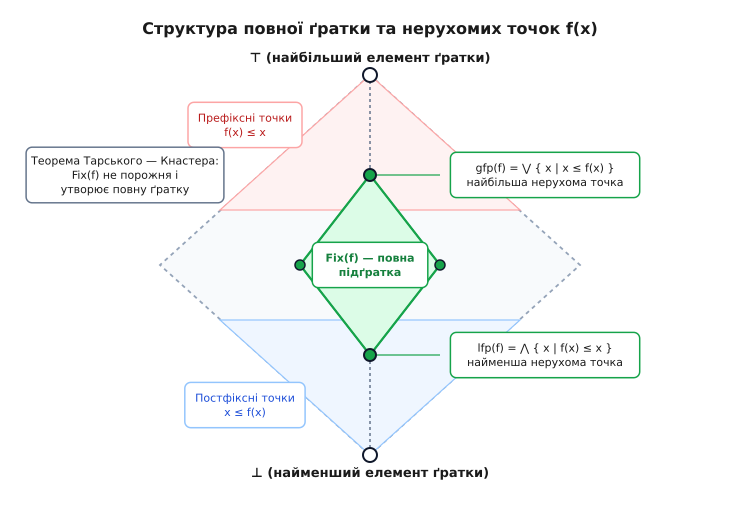
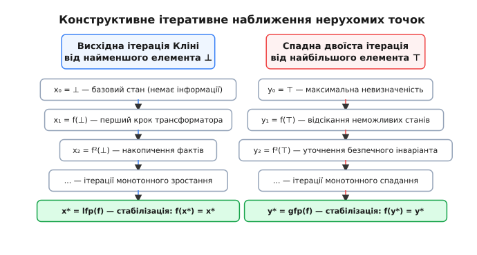
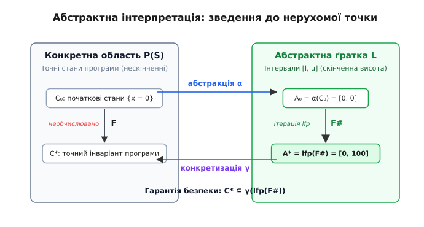

# Теорема Тарського — Кнастера про нерухому точку

<preknowlist>
- [Теорія множин](book:math/set-theory) — базові операції над множинами, підмножини та включення.
- [Булева алгебра](book:math/boolean-algebra) — операції об'єднання, перетину, порядок та ґратки.
- [Математичне доведення](book:math/mathematical-proof) — методи формальних доведень, від супротивного та індукція.
</preknowlist>

Коли оптимізувальний компілятор або статичний аналізатор перевіряє цикл `while (i < 100) { a[i] = 0; i++; }`, він повинен гарантувати, що індекс `i` ніколи не спричинить аварійного виходу за межі масиву `a` розміром 100 елементів. Запустити програму для всіх можливих початкових станів неможливо: вхідні дані можуть бути нескінченними, а програма взагалі може зависнути. Аналізатор опиняється перед викликом: як строго обчислити властивості змінних у кожній точці програми, не виконуючи її крок за кроком нескінченну кількість разів?

Розв'язок полягає в тому, щоб розглядати виконання інструкцій як математичний оператор перетворення станів. Кожен прохід тіла циклу бере поточну множину можливих значень змінних і повертає оновлену множину. Нас цікавить такий стан, який після чергового проходу циклу більше не розширюється і не змінюється — тобто стан `X`, для якого перетворення `F` задовольняє рівність `F(X) = X`. Такий стан називається **нерухомою точкою** (fixed point) оператора.

Але що гарантує, що така точка взагалі існує? За яких умов вона єдина або серед багатьох нерухомих точок існує найбільш точна? Відповідь на це фундаментальне питання дає **теорема Тарського — Кнастера** — наріжний камінь сучасної математичної логіки, денотаційної семантики та статичного аналізу програм.

## Від часткового порядку до повної ґратки

Щоб сформулювати теорему, необхідно описати простір, у якому живе наш оператор. У повсякденному житті числа впорядковані лінійно: для будь-яких двох чисел `a` і `b` або `a ≤ b`, або `b ≤ a`. Проте в комп'ютерних науках та математичній логіці стани системи часто не можна порівняти напряму.

Розглянемо множину знань про змінну. Якщо один аналізатор стверджує, що `x ∈ {1, 2}`, а інший — що `x ∈ {2, 3}`, жодне з цих тверджень не містить у собі інше. Тут діє **частковий порядок** (partial order).

Нехай задано множину `L`. Бінарне відношення `≤` на множині `L` називається частковим порядком, якщо для будь-яких елементів `a`, `b`, `c ∈ L` виконуються три закони:
1. `a ≤ a` (рефлексивність: кожен стан передує сам собі).
2. Якщо `a ≤ b` і `b ≤ a`, то `a = b` (антисиметричність: якщо два стани взаємно покривають один одного, вони тотожні).
3. Якщо `a ≤ b` і `b ≤ c`, то `a ≤ c` (транзитивність: зв'язок передається за ланцюжком).

Пара `(L, ≤)` утворює частково впорядковану множину (посет).

Візьмемо довільну підмножину станів `S ⊆ L`.
- Елемент `u ∈ L` називається **верхньою межею** (upper bound) множини `S`, якщо для кожного `s ∈ S` виконується `s ≤ u`.
- Якщо серед усіх верхніх меж існує найменша (найточніша), вона називається **точною верхньою гранню**, або **супремумом** (supremum, join) і позначається як `⋁ S` або `sup(S)`. В аналізі програм супремум двох станів `a ∨ b` відповідає безпечному об'єднанню знань у точці злиття двох гілок виконання (наприклад, після блоку `if-else`).
- Елемент `l ∈ L` називається **нижньою межею** (lower bound) множини `S`, якщо для кожного `s ∈ S` виконується `l ≤ s`.
- Найбільша серед усіх нижніх меж називається **точною нижньою гранню**, або **інфімумом** (infimum, meet) і позначається як `⋀ S` або `inf(S)`. Інфімум двох станів `a ∧ b` відповідає їхньому перетину (уточненню знань після перевірки умови).

Структура `(L, ≤)` називається **повною ґраткою** (complete lattice), якщо для **будь-якої** її підмножини `S ⊆ L` (зокрема для нескінченних підмножин, для всієї множини `L` та для порожньої множини `∅`) гарантовано існують як точна верхня грань `⋁ S`, так і точна нижня грань `⋀ S`.

У будь-якій повній ґратці автоматично існують два граничні полюси:
- **Найменший елемент (ботом, `⊥`)**:
```
⊥ = ⋀ L = ⋁ ∅      [інфімум усієї ґратки або супремум порожньої множини]
```
У статичному аналізі `⊥` позначає недосяжний код або відсутність будь-якої інформації.
- **Найбільший елемент (топ, `⊤`)**:
```
⊤ = ⋁ L = ⋀ ∅      [супремум усієї ґратки або інфімум порожньої множини]
```
В аналізі `⊤` позначає повну невизначеність: змінна може приймати будь-яке значення, жодних гарантій немає.

Класичним прикладом повної ґратки є булеан довільної множини `X` — множина всіх її підмножин `P(X)` з відношенням теоретико-множинного включення `⊆`. Тут `⊥ = ∅`, `⊤ = X`, супремум `⋁` є операцією об'єднання множин `⋃`, а інфімум `⋀` — операцією перетину `⋂`.

Іншим життєвим прикладом є ґратка інтервалів `[a, b]`, де числа доповнені символами `-∞` та `+∞`. Будь-яка множина інтервалів має супремум (найменший інтервал, що містить усі задані) та інфімум (перетин інтервалів або `⊥`, якщо вони не перетинаються).


*Структура повної ґратки з найменшим елементом ⊥, найбільшим елементом ⊤, зонами префіксних і постфіксних точок та виділеною підґраткою нерухомих точок Fix(f).*

## Монотонність відображення: збереження знань

Маючи повну ґратку `L`, розглянемо функцію `f: L → L`, яка моделює трансформацію стану програми.

Функція `f` називається **монотонною** (monotone, order-preserving), якщо вона зберігає відношення порядку:
```
∀ x, y ∈ L:  x ≤ y  ⇒  f(x) ≤ f(y)
```

Що означає монотонність на практиці? Вона означає відсутність руйнівних аномалій: якщо ми розширюємо початкові припущення про змінні на вході (даємо системі більше можливих значень), на виході ми отримаємо ширшу або таку саму множину результатів, але ніколи не звужену. Монотонність зберігає відношення включення знань.

Важливо розуміти принципову відмінність між монотонністю на ґратках і неперервністю в математичному аналізі:
- Класична теорема Брауера про нерухому точку вимагає топологічної неперервності функції, евклідової метрики, опуклості та компактності простору.
- Теорема Тарського — Кнастера не потребує ані топології, ані метрики, ані дійсних чисел. Їй достатньо лише часткового порядку, повноти ґратки та простої алгебраїчної монотонності.

## Формулювання теореми Тарського — Кнастера

Сформулюємо головний результат, відкритий Броніславом Кнастером у 1928 році для множин та узагальнений Альфредом Тарським у 1939–1955 роках для довільних ґраток.

> **Теорема Тарського — Кнастера:**
> Нехай `(L, ≤)` — повна ґратка, а `f: L → L` — монотонна функція.
> Тоді:
> 1. Множина всіх нерухомих точок `Fix(f) = { x ∈ L | f(x) = x }` не є порожньою (`Fix(f) ≠ ∅`).
> 2. Множина `Fix(f)` відносно того самого порядку `≤` сама утворює **повну ґратку**.
> 3. Функція `f` має гарантовано **найменшу нерухову точку** `lfp(f)` (least fixed point) та **найбільшу нерухову точку** `gfp(f)` (greatest fixed point), які виражаються явними формулами:
> ```
> lfp(f) = ⋀ { x ∈ L | f(x) ≤ x }
> gfp(f) = ⋁ { x ∈ L | x ≤ f(x) }
> ```

Звернімо увагу на дивовижну красу цих формул:
- Множина `{ x ∈ L | f(x) ≤ x }` складається з елементів, які функція зміщує вниз (або залишає на місці). Вони називаються **префіксними точками** (prefixpoints). Найменша нерухова точка виникає як точна нижня грань (інфімум) усіх префіксних точок.
- Множина `{ x ∈ L | x ≤ f(x) }` складається з елементів, які функція зміщує вгору. Вони називаються **постфіксними точками** (postfixpoints). Найбільша нерухова точка виникає як точна верхня грань (супремум) усіх постфіксних точок.

Детальне математичне виведення цих співвідношень та строге доведення того, що `Fix(f)` утворює повну ґратку, винесено в окремий матеріал — дивіться [детальне математичне доведення обох теорем та аналіз неперервності за Кліні](book:math/tarski-knaster-theorem/math-fixed-point-proof.md).

## Чому це працює: механізм неконструктивного стиснення

Щоб побачити, чому теорема бездоганно працює, простежимо логічний ланцюг міркувань для найменшої нерухомої точки.

Позначимо множину всіх префіксних точок як `P = { x ∈ L | f(x) ≤ x }`.
Ця множина гарантовано не порожня, бо найбільший елемент ґратки `⊤` завжди задовольняє нерівність `f(⊤) ≤ ⊤`.

Оскільки ґратка `L` повна, у множини `P` існує точна нижня грань:
```
m = ⋀ P
```

Доведемо, що елемент `m` є нерухомою точкою, за шість простих кроків:

1. **Нижня межа:** Оскільки `m` є інфімумом множини `P`, для будь-якого елемента `p ∈ P` виконується `m ≤ p`.
2. **Монотонний крок:** Застосуємо монотонну функцію `f` до нерівності `m ≤ p`. Отримуємо `f(m) ≤ f(p)`.
3. **Властивість префіксу:** Оскільки `p ∈ P`, за означенням маємо `f(p) ≤ p`. За транзитивністю порядку:
```
f(m) ≤ p           [оскільки f(m) ≤ f(p) та f(p) ≤ p]
```
4. **Ключовий висновок:** Нерівність `f(m) ≤ p` виконується для **всіх** елементів `p ∈ P`. Отже, `f(m)` є нижньою межею для множини `P`. Але `m` — це **найбільша** серед усіх нижніх меж! Тому:
```
f(m) ≤ m           [оскільки m = ⋀ P]
```
Це означає, що сам елемент `m` належить множині `P` (`m ∈ P`)!
5. **Зворотна нерівність:** Застосуємо монотонність `f` до щойно отриманого факту `f(m) ≤ m`:
```
f(f(m)) ≤ f(m)     [монотонність f]
```
Це означає, що елемент `f(m)` також задовольняє умову належності до множини `P`. А оскільки `m` передує всім елементам із `P`, маємо:
```
m ≤ f(m)           [оскільки m — нижня межа P, а f(m) ∈ P]
```
6. **Стиснення в точку:** Ми одночасно маємо `f(m) ≤ m` та `m ≤ f(m)`. За аксіомою антисиметричності часткового порядку отримуємо абсолютну рівність:
```
f(m) = m
```

Елемент `m` є нерухомою точкою. А оскільки будь-яка інша нерухова точка `k` задовольняє `f(k) = k ≤ k`, вона обов'язково належить `P`, а отже `m ≤ k`. Таким чином, `m` є строго **найменшою нерухомою точкою** `lfp(f)`.

Двоїстий ланцюг міркувань над супремумом постфіксних точок аналогічно дає найбільшу нерухову точку `gfp(f)`.

## Конструктивна збіжність: ітерації Кліні та трансфінітний перехід

Доведення Тарського є неконструктивним: воно доводить існування `lfp(f)` через інфімум множини `P`, але не вказує комп'ютеру, як знайти цей інфімум за скінченну кількість дій.

Як обчислити нерухому точку на практиці? Відповідь дає конструктивна теорія ітерацій.

Почнемо з найменшого елемента ґратки `⊥` (де немає жодних початкових знань) і почнемо послідовно застосовувати функцію `f`:
```
x₀ = ⊥
x₁ = f(⊥)
x₂ = f(f(⊥)) = f²(⊥)
x₃ = f³(⊥)
...
x_{n+1} = f(x_n)
```

Оскільки `⊥ ≤ f(⊥)`, за монотонністю отримуємо нескінченний зростаючий ланцюг станів:
```
⊥ ≤ f(⊥) ≤ f²(⊥) ≤ f³(⊥) ≤ ... ≤ fⁿ(⊥) ≤ ...
```


*Висхідна ітерація Кліні від ⊥ до найменшої нерухомої точки lfp(f) та двоїста спадна ітерація від ⊤ до найбільшої нерухомої точки gfp(f).*

### Коли ітерація зупиняється

Тут можливі три сценарії залежно від природи ґратки та функції:

1. **Скінченна ґратка або умова обриву ланцюгів (ACC):**
   Якщо ґратка має скінченну висоту (наприклад, множина змінних скінченна і кожна змінна приймає значення зі скінченної множини станів), ланцюг не може зростати нескінченно. На деякому скінченному кроці `k` станеться `f(x_k) = x_k`. Цей елемент `x_k` і є точною найменшою нерухомою точкою `lfp(f)`.
2. **Неперервність за Кліні (Scott Continuity):**
   Якщо функція `f` комутує з супремумами зліченних ланцюгів (`f(⋁ x_n) = ⋁ f(x_n)`), то за теоремою Кліні:
```
lfp(f) = ⋁_{n=0}^{∞} fⁿ(⊥)
```
   Нерухова точка досягається на границі за зліченну кількість кроків (граничний ординал `ω`).
3. **Трансфінітна ітерація для розривних монотонних функцій:**
   Якщо функція монотонна, але не є неперервною за Скоттом, ітерації продовжуються за межі зліченного ряду за допомогою трансфінітної індукції над порядковими числами (ординалами):
```
x_{α+1} = f(x_α)
x_λ = ⋁_{β < λ} x_β    [для граничного ординала λ]
```
   За теоремою Кузо (1979) цей процес гарантовано стабілізується на деякому ординалі, потужність якого не перевищує потужності самої ґратки.

## Покроковий числовий розбір: досяжність у графі станів

Щоб відчути роботу теореми на конкретній системі, розглянемо задачу аналізу досяжності станів (Reachability Analysis) для скінченної системи з чотирма станами:
```
Вузли графа: V = { 1, 2, 3, 4 }
Орієнтовані переходи: E = { (1, 2), (2, 3), (3, 2), (4, 4) }
Початковий стан: Init = { 1 }
```

Простір станів моделюється булеаном `L = P(V)` — множиною всіх підмножин `{1, 2, 3, 4}`. Кількість елементів у ґратці дорівнює `2⁴ = 16`.
Порядок — включення підмножин `⊆`. Найменший елемент `⊥ = ∅`, найбільший `⊤ = { 1, 2, 3, 4 }`.

Визначимо оператор одного кроку аналізу `F: P(V) → P(V)`:
```
F(X) = Init ∪ { v ∈ V | ∃ u ∈ X: (u, v) ∈ E }
```
Оператор додає початковий стан `Init` та всі вузли, в які можна перейти з поточного набору станів `X` за одне ребро.

Оператор `F` є монотонним: якщо `X ⊆ Y`, то множина прямих наступників також задовольняє `{ v | ∃ u ∈ X: (u, v) ∈ E } ⊆ { v | ∃ u ∈ Y: (u, v) ∈ E }`, а отже `F(X) ⊆ F(Y)`.

Обчислимо найменшу нерухову точку конструктивною ітерацією від `⊥ = ∅`:
```
X₀ = ∅
X₁ = F(X₀) = { 1 } ∪ ∅ = { 1 }
X₂ = F(X₁) = { 1 } ∪ { 2 } = { 1, 2 }
X₃ = F(X₂) = { 1 } ∪ { 2, 3 } = { 1, 2, 3 }
X₄ = F(X₃) = { 1 } ∪ { 2, 3 } = { 1, 2, 3 }
```

На четвертому кроці отримано `X₄ = X₃ = { 1, 2, 3 }`. Збіжність досягнута!
Найменша нерухова точка:
```
lfp(F) = { 1, 2, 3 }
```
Це означає: зі стану 1 можна потрапити лише у стани 1, 2 та 3. Стан 4 є недосяжним.

### Чому важлива саме найменша нерухова точка

Поглянемо, що станеться, якщо перевірити стан `Y = { 1, 2, 3, 4 }`:
```
F({ 1, 2, 3, 4 }) = { 1 } ∪ { 2, 3, 4 } = { 1, 2, 3, 4 }
```
Множина `Y = { 1, 2, 3, 4 }` також є нерухомою точкою! Ба більше, вона є **найбільшою нерухомою точкою** `gfp(F) = { 1, 2, 3, 4 }`.

Чому стан 4 потрапив до найбільшої нерухомої точки? Тому що стан 4 має петлю переходу в себе: `(4, 4) ∈ E`. Якщо ми *вже припустили*, що стан 4 досяжний, оператор `F` підтверджує його досяжність. Але з початкового стану `{ 1 }` дістатися до 4 неможливо.

Саме `lfp(F)` відсікає такі самовиправдні «фантомні стани» і знаходить точну істинну множину реальних досяжних вузлів.

## Аналіз потоку даних у компіляторах (Фреймворк Кілдалла)

У 1973 році Гері Кілдалл (Gary Kildall) запропонував універсальний алгебраїчний фреймворк для оптимізації програм у компіляторах, який зводить класичні оптимізації до обчислення нерухомих точок на напівґратках.

Розглянемо три класичні оптимізації компілятора та їхній зв'язок із нерухомими точками:

### 1. Аналіз доступних виразів (Available Expressions)
Компілятор намагається усунути повторні однакові обчислення (Common Subexpression Elimination). Вираз `a + b` є доступним у точці `p`, якщо на **кожному** шляху від входу програми до `p` вираз `a + b` вже було обчислено, і жодна зі змінних `a` або `b` не змінювалася після цього.

Оскільки властивість повинна виконуватися на **всіх** шляхах (а не хоча б на одному), в точках злиття використовується операція перетину знань `⋂`.
Рівняння для базового блоку `B`:
```
In[B] = ⋂_{P ∈ Pred(B)} Out[P]
Out[B] = Gen[B] ∪ (In[B] \ Kill[B])
```
Тут початковим станом для всіх блоків є найбільший елемент ґратки `⊤` (всі можливі вирази вважаються доступними), а аналізатор спускається вниз до **найбільшої нерухомої точки** `gfp`.

### 2. Аналіз досяжних визначень (Reaching Definitions)
Визначення змінної `d: x = ...` досягає точки `p`, якщо існує **хоча б один** шлях від `d` до `p`, на якому змінна `x` не переприсвоювалася. Це необхідно для розповсюдження констант (Constant Propagation).

Оскільки достатньо існування **хоча б одного** шляху, у точках злиття використовується операція об'єднання знань `⋃`.
Рівняння для блоку `B`:
```
In[B] = ⋃_{P ∈ Pred(B)} Out[P]
Out[B] = Gen[B] ∪ (In[B] \ Kill[B])
```
Аналіз починається з найменшого елемента `⊥ = ∅` і піднімається вгору до **найменшої нерухомої точки** `lfp`.

### 3. Аналіз живих змінних (Live Variables)
Змінна `x` вважається живою в точці `p`, якщо її поточне значення може бути прочитане в майбутньому до наступного присвоєння. Якщо змінна мертва, компілятор може звільнити її регістр або видалити запис у пам'ять (Dead Code Elimination).

Цей аналіз є **зворотним** (backward analysis): інформація рухається від виходу програми до її входу:
```
Out[B] = ⋃_{S ∈ Succ(B)} In[S]
In[B] = Use[B] ∪ (Out[B] \ Def[B])
```
Розв'язок цієї системи є найменшою нерухомою точкою `lfp` зворотного монотонного трансформатора.

Теорема Тарського — Кнастера гарантує, що ітеративний алгоритм Кілдалла завжди знаходить єдиний оптимальний розв'язок для довільного графа потоку керування.

## Формальні граматики як нерухомі точки над мовами

Зв'язок між теоремою Тарського — Кнастера та теоретичною інформатикою виявляється і в теорії формальних мов.

Розглянемо контекстно-вільну граматику для правильних дужкових послідовностей:
```
S → a S b | ε
```
де `a` відповідає відкриваючій дужці `(`, `b` — закриваючій дужці `)`, а `ε` — порожньому слову.

Цю граматику можна розглядати як рівняння над мовами (підмножинами слів `L ⊆ Σ*`):
```
L = F(L)
```
де монотонний оператор `F: P(Σ*) → P(Σ*)` задається правилом:
```
F(X) = { ε } ∪ { a · w · b | w ∈ X }
```

Ґратка мов `(P(Σ*), ⊆)` є повною: `⊥ = ∅`, `⊤ = Σ*`.
Обчислимо найменшу нерухову точку за теоремою Тарського — Кнастера через висхідну ітерацію:
- `X₀ = ∅`.
- `X₁ = F(X₀) = { ε }`.
- `X₂ = F(X₁) = { ε, "ab" }`.
- `X₃ = F(X₂) = { ε, "ab", "aabb" }`.
- На кроці `n`: `X_n = { a^k b^k | 0 ≤ k < n }`.

Супремум цього ланцюга:
```
lfp(F) = ⋁_{n=0}^{∞} X_n = { aⁿ bⁿ | n ≥ 0 }
```
дає точно мову, породжену граматикою.

Будь-яка контекстно-вільна граматика є ні чим іншим, як системою взаємно-рекурсивних рівнянь над повною ґраткою мов, а мова граматики строго визначається як її найменша нерухова точка.

## Логічні розв'язувачі та клаузи Хорна (SMT та CHC)

У сучасних автоматичних верифікаторах програмного забезпечення (таких як Z3 Spacer або Eldarica) перевірка інваріантів програм записується мовою логіки першого порядку у вигляді обмежених клауз Хорна (Constrained Horn Clauses, CHC).

Невідомий інваріант програми `Inv(x)` розглядається як предикат, який повинен задовольняти три логічні умови:
1. `Init(x) ⇒ Inv(x)` (початкові стани задовольняють інваріант).
2. `Inv(x) ∧ Step(x, x') ⇒ Inv(x')` (інваріант зберігається при кожному переході програми).
3. `Inv(x) ∧ Bad(x) ⇒ false` (інваріант виключає аварійні стани).

Перші дві умови формують монотонний предикатний трансформатор `T(P) = Init ∨ ∃ x. (P(x) ∧ Step(x, x'))`. Пошук розв'язку для `Inv` є ні чим іншим, як обчисленням нерухомої точки оператора `T` над повною ґраткою предикатів першого порядку.

Якщо знайдена найменша нерухова точка `lfp(T)` задовольняє третю умову `lfp(T) ∧ Bad ⇒ false`, верифікатор генерує математичний сертифікат безпеки програми.

## Денотаційна семантика: математичний сенс рекурсивних функцій

У 1970-х роках Дана Скотт та Крістофер Стрейчі використали теорему Тарського — Кнастера для розв'язання фундаментальної проблеми комп'ютерних наук: що є математичним значенням рекурсивної функції?

Розглянемо класичну рекурсивну функцію факторіала:
```
fact(n) = if (n == 0) then 1 else n * fact(n - 1)
```
Це не явне визначення функції, а рівняння, де шукана функція `fact` стоїть як у лівій, так і в правій частині. Запишемо його у вигляді оператора вищого порядку:
```
fact = F(fact)
```
де функціонал `F` приймає деяку часткову функцію `g: ℕ ⇀ ℕ` і повертає нову функцію:
```
F(g)(n) = if (n == 0) then 1 else n * g(n - 1)
```

Простір усіх часткових функцій `[ℕ ⇀ ℕ]` утворює частковий порядок за включенням графіків: `g₁ ⊑ g₂`, якщо скрізь, де `g₁` визначена, `g₂` також визначена і дає те саме значення.
Найменшим елементом є всюди невизначена функція `⊥` (яка моделює аварійне зависання або нескінченний цикл).

Застосуємо ітерацію від `⊥`:
- `g₀ = ⊥` (функція не визначена для жодного числа).
- `g₁ = F(g₀)`:
```
g₁(0) = 1
g₁(n) = n * ⊥(n - 1) = невизначено (при n > 0)
```
  Функція `g₁` визначена лише в точці 0 і дає `g₁ = { (0, 1) }`.
- `g₂ = F(g₁)`:
```
g₂(0) = 1
g₂(1) = 1 * g₁(0) = 1 * 1 = 1
g₂(n) = невизначено (при n > 1)
```
  Функція `g₂` визначена для `{0, 1}`: `g₂ = { (0, 1), (1, 1) }`.
- `g₃ = F(g₂)`: визначена для `{0, 1, 2}` і дає `{ (0, 1), (1, 1), (2, 2) }`.
- На кроці `k`: `g_k` обчислює факторіал для всіх чисел від `0` до `k - 1`.

Супремум цього зростаючого ланцюга за теоремою Тарського — Кнастера та теоремою Кліні:
```
lfp(F) = ⋁_{n=0}^{∞} g_n
```
дає повну математичну функцію факторіала, визначену на всій множині натуральних чисел `ℕ`.

Якщо функція містить помилку і зависає при певних аргументах, її `lfp` природно повертає `⊥` на цих входах. Теорема гарантує, що кожна синтаксично коректна рекурсивна програма має строго визначений, єдиний денотат.

## Модальне μ-числення та верифікація складних систем

У математичній логіці та верифікації апаратних систем (Model Checking) для опису часових властивостей використовують **модальне μ-числення** (Modal μ-calculus), розроблене Декстером Козеном у 1983 році.

У цій логіці формули містять явні оператори нерухомих точок:
- Оператор `μX. φ(X)` позначає **найменшу нерухову точку** предикатного трансформатора `φ`.
- Оператор `νY. ψ(Y)` позначає **найбільшу нерухову точку** предикатного трансформатора `ψ`.

З їхньою допомогою формулюються ключові властивості надійності систем:

1. **Властивість досяжності мети (Reachability / Liveness):**
   «Чи обов'язково система колись перейде у стан завершення `End`?»
```
μX. (End ∨ ⟨step⟩X)
```
   Ця формула шукає найменшу множину станів, з яких можна за скінченну кількість кроків досягти `End`.
2. **Властивість інваріанта безпеки (Safety / Invariance):**
   «Чи гарантовано система завжди залишатиметься в безпечному стані `Safe` (наприклад, тиск у реакторі не перевищить критичну межу)?»
```
νY. (Safe ∧ [step]Y)
```
   Ця формула шукає найбільшу множину станів, з яких будь-які подальші переходи ніколи не виведуть за межі `Safe`.
3. **Властивість справедливості (Fairness):**
   «Чи правда, що процес `P` отримуватиме доступ до ресурсу нескінченно часто?»
   Ця властивість виражається вкладеними чергуваннями нерухомих точок:
```
νX. μY. ((P ∧ ⟨step⟩X) ∨ ⟨step⟩Y)
```

Обчислення істинності таких формул на скінченних автоматах зводиться безпосередньо до алгоритмів пошуку нерухомої точки Тарського — Кнастера та пошуку виграшних стратегій у нескінченних іграх парності (parity games).

## Класичний тріумф: теорема Кантора — Бернштейна через нерухому точку

Щоб побачити, як теорема Тарського — Кнастера елегантно розв'язує фундаментальні проблеми математики без довгих перерахунків, розглянемо її застосування до класичної теореми Кантора — Бернштейна — Шредера.

**Задача:** Нехай задано дві множини `A` та `B`, і існують дві ін'єкції (взаємно однозначні занурення): `f: A → B` та `g: B → A`. Потрібно довести, що між `A` та `B` існує бієкція (взаємно однозначна відповідність), тобто потужності множин однакові: `|A| = |B|`.

Традиційне доведення вимагає розбиття елементів на нескінченні ланцюжки праобразів. Теорема Тарського — Кнастера розв'язує цю задачу в кілька рядків.

Побудуємо розбиття множини `A` на дві частини `X` та `A \ X`, а множини `B` — на `f(X)` та `B \ f(X)`.
Ми хочемо, щоб відображення `f` діяло як бієкція з `X` на `f(X)`, а відображення `g` — як бієкція з `B \ f(X)` на залишок `A \ X`.
Для цього необхідно, щоб залишок у множині `A` точно дорівнював образу залишку з `B`:
```
A \ X = g(B \ f(X))
```
Виразимо `X`:
```
X = A \ g(B \ f(X))
```

Ми отримали рівняння нерухомої точки `X = Φ(X)` для оператора:
```
Φ(X) = A \ g(B \ f(X))
```
який діє на булеані `L = P(A)` (повній ґратці підмножин множини `A`).

Перевіримо, чи є оператор `Φ` монотонним:
1. Нехай `X₁ ⊆ X₂`.
2. Оскільки `f` — функція, `f(X₁) ⊆ f(X₂)`.
3. Доповнення обертає порядок: `B \ f(X₂) ⊆ B \ f(X₁)`.
4. Застосування `g`: `g(B \ f(X₂)) ⊆ g(B \ f(X₁)`.
5. Повторне доповнення в `A` знову обертає порядок:
```
A \ g(B \ f(X₁)) ⊆ A \ g(B \ f(X₂))
```
Тобто `Φ(X₁) ⊆ Φ(X₂)`. Подвійне взяття доповнення двічі змінило напрямок включення, тому оператор `Φ` є строго монотонним!

За теоремою Тарського — Кнастера оператор `Φ` гарантовано має нерухову точку `X* ⊆ A`, для якої:
```
X* = A \ g(B \ f(X*))
```

Маючи таку множину `X*`, шукана бієкція `h: A → B` конструюється миттєво:
```
h(a) = { f(a),         якщо a ∈ X*
       { g⁻¹(a),       якщо a ∈ A \ X*
```
Оскільки `g` ін'єктивна і відображає `B \ f(X*)` на `A \ X*`, обернене відображення `g⁻¹` визначене коректно і є бієктивним. Теорему повністю доведено!

Цей витончений історичний прорив став першим свідченням потужності методу нерухомих точок. Детальніше про атмосферу відкриття та наукові дискусії у «Шотландській кав'ярні» читайте в нарисі [історію відкриття теореми у Львівській та Варшавській математичних школах](book:math/tarski-knaster-theorem/hist-tarski-knaster.md).

## Найменші проти найбільших нерухомих точок: індукція та коіндукція

Наявність у ґратці `Fix(f)` двох екстремальних точок — `lfp` та `gfp` — відповідає двом фундаментальним принципам побудови математичних об'єктів: індукції та коіндукції.

### 1. Найменша нерухома точка (`lfp`) — світ скінченного та індуктивного
`lfp(f)` будується «знизу вгору», починаючи від порожнього стану `⊥`. Вона містить **тільки те, що абсолютно необхідно**, і нічого зайвого:
- **Синтаксичні дерева та граматики:** мова, породжена граматикою, є найменшою нерухомою точкою правил виводу.
- **Досяжні стани:** множина станів, досяжних із початкового, є найменшою нерухомою точкою оператора кроку переходів.
- **Семантика рекурсії:** значення рекурсивної функції є `lfp` функціоналу обчислення. Якщо функція зациклюється, вона дає `⊥` (невизначеність).

### 2. Найбільша нерухома точка (`gfp`) — світ нескінченного та безпеки
`gfp(f)` будується «зверху вниз», починаючи від максимального стану `⊤`. Вона містить **все, що не було явно спростовано чи відкинуто**:
- **Нескінченні потоки даних (Streams):** коіндуктивні типи даних, які генерують нескінченні послідовності (наприклад, аудіопотоки або сигнали датчиків).
- **Бісимуляція процесів:** дві паралельні програми або автоматні системи вважаються еквівалентними (біподібними), якщо вони перебувають у найбільшій нерухомій точці оператора спостережуваної еквівалентності.
- **Інваріанти безпеки (Safety Properties):** твердження «програма ніколи не потрапить в аварійний стан» формалізується як належність початкового стану до `gfp` оператора зворотного відсікання небезпечних переходів.

## Порівняльна панорама теорем про нерухому точку

У математиці існує кілька фундаментальних теорем про нерухому точку. Кожна з них працює у своєму математичному просторі й вимагає свого набору аксіом:

| Теорема | Простір | Вимоги до функції | Механізм збіжності | Результат |
| :--- | :--- | :--- | :--- | :--- |
| **Банаха** (1922) | Повний метричний простір | Стискаюче відображення (`d(f(x),f(y)) ≤ k·d(x,y)`, `k < 1`) | Ітерації Коші: `x_{n+1} = f(x_n)` | Єдина нерухома точка |
| **Брауера** (1911) | Компактна опукла підмножина `ℝⁿ` | Топологічна неперервність | Неконструктивне (гомології / лема Шпернера) | Існує хоча б одна точка |
| **Кліні** (1952) | Частковий порядок із супремумами ланцюгів (CPO) | ω-неперервність за Скоттом | Зліченний супремум: `⋁ fⁿ(⊥)` | Найменша нерухома точка `lfp` |
| **Тарського — Кнастера** (1928/1955) | **Повна ґратка** | **Монотонність** (`x ≤ y ⇒ f(x) ≤ f(y)`) | **Інфімум/супремум або трансфінітна ітерація** | **Повна ґратка нерухомих точок Fix(f), lfp та gfp** |

Теорема Тарського — Кнастера вирізняється тим, що вимагає найменше аналітичних припущень (жодних метрик і відстаней), гарантуючи водночас найбагатшу алгебраїчну структуру розв'язків.

## Практичне застосування: абстрактна інтерпретація та верифікація програм

Найпотужнішим інженерним втіленням теореми Тарського — Кнастера стала теорія **абстрактної інтерпретації** Патріка та Радії Кузо (1977).

Реальні програми оперують нескінченною множиною станів `P(S)`. Пряме обчислення їхньої поведінки неможливе. Абстрактна інтерпретація будує спрощену повну ґратку `L` (наприклад, ґратку інтервалів `[min, max]`, ґратку знаків `{ -, 0, +, ⊤, ⊥ }` або ґратку поліедрів).


*Зв'язок Галуа між простором конкретних станів програми P(S) та абстрактною ґраткою L, де знаходження інваріанта зводиться до обчислення lfp(F#).*

Зв'язок між реальним світом та абстрактною ґраткою забезпечує пара відображень Галуа:
- **Абстракція `α: P(S) → L`**: перетворює множину конкретних значень на абстрактний елемент ґратки (наприклад, `α({2, 5, 9}) = [2, 9]`).
- **Конкретизація `γ: L → P(S)`**: розгортає абстрактний елемент назад у множину чисел (`γ([2, 9]) = {2, 3, 4, 5, 6, 7, 8, 9}`).

Якщо абстрактний трансформатор `F#: L → L` монотонний і моделює команди програми, то теорема Тарського — Кнастера гарантує, що його найменша нерухова точка `lfp(F#)` є надійним інваріантом усієї програми:
```
ConcreteStates ⊆ γ(lfp(F#))
```

Якщо ґратка містить нескінченні ланцюги (як-от ґратка інтервалів), для прискорення збіжності застосовують **оператор розширення** (Widening, `∇`), який відкидає нестабільні межі до нескінченності, та **оператор звуження** (Narrowing, `Δ`), що повертає точність.

Як саме створюється числовий аналізатор, як влаштовані алгоритми `Join`, `Meet`, `Widen` та `Narrow` мовами C і C++, детально показано у проектному розборі — відкрийте [практичну реалізацію інтервального абстрактного інтерпретатора](book:math/tarski-knaster-theorem/proj-abstract-interpretation.md).

> 🔧 **Навіщо це:**
> Теорема Тарського — Кнастера перетворює проблему нескінченного аналізу програм на строго гарантовану задачу пошуку нерухомої точки над повною ґраткою. Завдяки їй сучасні оптимізувальні компілятори (LLVM, GCC), верифікатори критичного бортового софту літаків (Astrée) та аналізатори безпеки смартконтрактів можуть математично доводити відсутність помилок переповнення буфера та ділення на нуль, не виконуючи жодної небезпечної інструкції в реальному часі.
