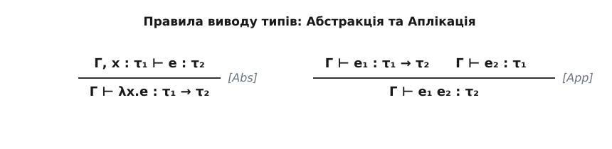

# Просто типізоване лямбда-числення та теорія типів

<preknowlist>
- [Основи нетипізованого лямбда-числення](/book/math/logic-foundations/lambda-calculus/lambda-calculus-d.html)
- [Пропозиційна логіка та логічне виведення](/book/math/logic-foundations/propositional-logic/propositional-logic-d.html)
</preknowlist>

> 🔧 **Навіщо це.**
> Уявіть, що ви написали програму, яка запускається і працює вічно, або раптово намагається додати число до тексту і «падає». Як математично гарантувати, що програма ніколи не зробить такої помилки й обов'язково завершить свою роботу? Відповіддю є введення *типів*. Просто типізоване лямбда-числення (STLC) — це найпростіша математична модель мови програмування з типами. Воно показує, як типи запобігають помилкам, а також розкриває один із найглибших зв'язків у математиці: [Ізоморфізм Каррі — Говарда](book:math/curry-howard-isomorphism), згідно з яким комп'ютерні програми — це буквально математичні доведення, а типи — це теореми. Це фундамент, на якому стоять сучасні безпечні мови програмування (Haskell, Rust, OCaml) та системи перевірки доведень (Coq, Agda, Lean).

Коли Алонзо Черч у 1930-х роках винайшов лямбда-числення (λ-числення), воно було «нетипізованим». Це означало, що будь-яка функція могла приймати будь-що як аргумент, включаючи саму себе. Це давало неймовірну гнучкість — лямбда-числення було повним за Тюрінгом, тобто могло обчислити будь-що, що взагалі можна обчислити. Але ця сила мала свою ціну.

## 1. Проблема нетипізованого світу

У нетипізованому лямбда-численні ми можемо написати комбінатор `Ω` (омега):

```text
Ω = (λx. x x) (λx. x x)
```

Якщо ми спробуємо його обчислити (виконати β-редукцію), ми отримаємо:

```text
(λx. x x) (λx. x x)  →  (λx. x x) (λx. x x)  →  ...
```

Процес обчислення ніколи не завершується. Програма «зависає» у нескінченному циклі. 

Крім того, в оригінальній логічній системі Черча можливість застосовувати функцію до самої себе призводила до логічних парадоксів, схожих на парадокс Рассела («множина всіх множин, які не містять себе»). Щоб врятувати систему, Черч пізніше ввів **типи**. Ідея полягає в тому, щоб накласти обмеження: функція не може приймати будь-що. Вона повинна заздалегідь вказати «тип» аргументу, який вона очікує.

Так народилося **просто типізоване лямбда-числення** (Simply Typed Lambda Calculus, або STLC).

## 2. Анатомія типів: Що таке тип?

У STLC ми розділяємо світ на дві частини: програми (терми) та їхні описи (типи).

Типи зазвичай позначають грецькими літерами `τ` (тау) та `σ` (сигма). Синтаксис типів дуже простий і складається з двох речей:

1. **Базові типи (Base types)**: 
   Позначимо базовий тип як `B`. У реальних мовах це були б типи на кшталт цілих чисел (`Int`), булевих значень (`Bool`) тощо. Але для загальної теорії нам достатньо абстрактних базових типів (або навіть одного).

2. **Функціональні типи (Arrow types)**:
   Якщо ми маємо тип `σ` (тип аргументу) і тип `τ` (тип результату), ми можемо створити новий тип:
   `σ → τ`
   Це тип функції, яка приймає аргумент типу `σ` і повертає значення типу `τ`.

**Приклади типів:**
- `B → B` : функція, яка приймає базовий тип і повертає базовий тип.
- `B → (B → B)` : функція, яка приймає базовий тип і повертає іншу функцію (яка, в свою чергу, приймає `B` і повертає `B`). Завдяки каррінгу (currying) стрілка `→` асоціюється праворуч, тому ми можемо писати це просто як `B → B → B`.
- `(B → B) → B` : функція «вищого порядку». Вона очікує як аргумент *іншу функцію* типу `B → B`, і повертає базовий тип `B`. Зверніть увагу: дужки тут обов'язкові, це зовсім інший тип!

Тепер кожен вираз (терм) `e` у нашій мові повинен мати певний тип `τ`. Ми записуємо це так:
`e : τ`
(читається: «e має тип τ»).

## 3. Контекст: Пам'ять про змінні

Уявіть функцію `λx. x`. Який у неї тип?
Вона повертає те, що їй дали. Якщо їй дати `B`, вона поверне `B`. Якщо їй дати `B → B`, вона поверне `B → B`. 
У просто типізованому численні ми вимагаємо **явного вказування** типу аргументу безпосередньо в коді:
`λx:B. x` (Ця функція має тип `B → B`).
`λx:(B→B). x` (Ця функція має тип `(B→B) → (B→B)`).

Але як ми знаємо тип змінної `x` всередині тіла функції?
Для цього вводиться поняття **контексту типізації** (або середовища). Його позначають великою грецькою літерою `Γ` (Гамма).
Контекст `Γ` — це просто список (словник) змінних та їхніх типів. Наприклад:
`Γ = x:B, y:(B→B)`

Коли ми перевіряємо програму на правильність типів, ми робимо це *у певному контексті*. 
Математично це записується як **судження типізації** (typing judgment):

`Γ ⊢ e : τ`

Цей запис складається з трьох частин, об'єднаних символом `⊢` (турнікет, читається як «виводиться» або «доводить»):
1. `Γ` — те, що ми знаємо (наші припущення про змінні).
2. `⊢` — символ логічного виведення.
3. `e : τ` — висновок (вираз `e` має тип `τ`).

Повністю це читається так: **«У контексті Γ вираз e має тип τ»**.
Якщо вираз `e` не містить жодних вільних змінних (наприклад, константа або функція без зовнішніх залежностей), ми пишемо просто `⊢ e : τ` (контекст порожній).

## 4. Правила гри: Система типізації

Як компілятор (чи математик) перевіряє, чи правильні типи в програмі? Він використовує набір **правил виведення** (inference rules). Правило записується у вигляді дробу: над рискою — передумови (те, що має бути істиною), під рискою — висновок.

Для STLC нам потрібно лише три основних правила: для змінних, для створення функцій (абстракцій) і для виклику функцій (застосування).

### 4.1. Правило для змінних (Variable)

Якщо ми хочемо дізнатися тип змінної `x`, ми просто дивимось у наш словник `Γ`.

```text
       x : τ  знаходиться в Γ
------------------------------------ (Var)
            Γ ⊢ x : τ
```
*Переклад:* Якщо контекст `Γ` каже, що змінна `x` має тип `τ`, то ми можемо зробити висновок, що вираз `x` має тип `τ` в цьому контексті.

### 4.2. Правило для функцій (Abstraction / Абстракція)

Як створити функцію `λx:σ. e`? Нам треба впевнитися, що тіло функції `e` має сенс.

```text
          Γ, x:σ ⊢ e : τ
------------------------------------ (Abs)
      Γ ⊢ (λx:σ. e) : σ → τ
```
*Переклад:* Якщо ми припустимо, що змінна `x` має тип `σ` (додамо це припущення в контекст `Γ`), і з цим новим знанням зможемо довести, що тіло `e` має тип `τ`, ТОДІ сама функція `λx:σ. e` має тип «з `σ` в `τ`» (`σ → τ`) у початковому контексті `Γ`.

### 4.3. Правило для виклику функцій (Application / Застосування)

Коли ми передаємо аргумент у функцію, їхні типи повинні збігатися.

```text
  Γ ⊢ e1 : σ → τ       Γ ⊢ e2 : σ
------------------------------------ (App)
          Γ ⊢ (e1 e2) : τ
```
*Переклад:* Якщо в контексті `Γ` вираз `e1` є функцією, яка приймає `σ` і повертає `τ`, А вираз `e2` має саме тип `σ`, ТОДІ їхнє об'єднання `(e1 e2)` (виклик функції `e1` з аргументом `e2`) є правильним і результатом буде значення типу `τ`.

Ці три правила — це все, що потрібно для створення системи типів базового лямбда-числення. Вони діють як конструктор Лего: ми можемо збирати складні доведення правильності програми, з'єднуючи ці правила в дерева.


*Рис. 1. Приклад дерева виводу типів. Процес типізації починається знизу (від складної програми) і розгалужується вгору до найпростіших елементів (змінних), перевіряючи кожне застосування правила.*

## 5. Чому STLC — це круто: Магічні властивості

Коли ми обмежуємо програми правилами типізації, ми втрачаємо можливість писати *будь-які* програми. Але натомість ми отримуємо неймовірні гарантії безпеки. Дослідники довели про STLC кілька фундаментальних теорем, які стали золотим стандартом для будь-якої сучасної мови програмування.

### 5.1. Збереження типу (Subject Reduction / Preservation)

*Теорема:* Якщо програма `e` має тип `τ` (тобто `⊢ e : τ`), і вона робить крок обчислення, перетворюючись на `e'`, то `e'` також гарантовано матиме тип `τ` (`⊢ e' : τ`).

Простими словами: **Типи не змінюються під час виконання програми.** Якщо ви скомпілювали програму, яка обіцяє повернути число, вона ніколи в процесі обчислення раптово не перетвориться на функцію чи рядок. Її тип — це інваріант обчислення.

### 5.2. Прогрес (Progress)

*Теорема:* Якщо програма `e` правильно типізована і має тип `τ`, то одне з двох:
1. Або `e` вже є кінцевим результатом (значенням, наприклад, готовою лямбда-функцією).
2. Або `e` може зробити ще один крок обчислення.

Простими словами: **Типізована програма ніколи не застрягне у стані помилки.** У нетипізованому світі ми могли б спробувати застосувати число як функцію: `(5 "hello")` — програма б не знала, що робити (runtime error). В STLC, якщо типи зійшлися, таких абсурдних ситуацій просто не виникне під час виконання.

Разом властивості «Збереження» і «Прогрес» формують гасло сучасної теорії типів:
**"Well-typed programs cannot go wrong" (Добре типізовані програми не можуть піти не так)** — знаменита фраза Робіна Мілнера, творця мови ML.

### 5.3. Сильна нормалізація (Strong Normalization)

Це найдивовижніша властивість саме *просто типізованого* лямбда-числення.

*Теорема:* Будь-яка правильно типізована програма в STLC **завжди завершує обчислення (зупиняється)** за скінченну кількість кроків. Нескінченні цикли неможливі!

Згадайте наш комбінатор `Ω = (λx. x x) (λx. x x)`. Спробуємо дати йому типи. 
В частині `x x` функція `x` застосовується до себе самої. Щоб це працювало, `x` повинен мати тип функції, наприклад `σ → τ`.
Але аргументом є теж `x`, отже тип аргументу `σ` має дорівнювати типу самого `x`, тобто `σ = σ → τ`.
У простій теорії типів таке рівняння не має розв'язку (тип не може бути нескінченно вкладеним у самого себе). Відповідно, комбінатор `Ω` неможливо типізувати в STLC! Компілятор просто відхилить цей код ще до виконання.

**Наслідок:** STLC **не є** повним за Тюрінгом. Ви не можете написати в ньому оператор `while (true)` або будь-яку програму, що працює нескінченно. Це здається обмеженням для загального програмування, але це ідеальна властивість для певних сфер. Наприклад, якщо ми пишемо смарт-контракт для блокчейну або конфігурацію системи, ми *хочемо* математичної гарантії, що код виконається і зупиниться, не «завісивши» систему.

## 6. [Ізоморфізм Каррі — Говарда](book:math/curry-howard-isomorphism): Найвеличніший збіг у математиці

В 1958 році математик Хаскелл Каррі помітив щось дивне. А в 1969 році логік Вільям Говард формалізував це спостереження. Вони побачили ідеальний, 100-відсотковий збіг між двома абсолютно різними сферами математики, які розвивалися незалежно.

Погляньмо на типи в STLC. Якщо прибрати всі змінні та лямбди, і залишити лише типи, як виглядає функція `A → (B → A)`?
Вона напрочуд схожа на логічне висловлювання: «З A випливає, що з B випливає A».

Подивіться на правило для виклику функції (App):
Якщо ми маємо `σ → τ` (функцію) і маємо `σ` (аргумент), ми отримуємо `τ`.
В логіці це найвідоміше правило дедукції — **Modus Ponens**! (Якщо з σ випливає τ, і ми знаємо, що σ є істинним, отже τ — істинне).

[Ізоморфізм Каррі — Говарда](book:math/curry-howard-isomorphism) стверджує, що:
- **Типи** в програмуванні = **Теореми** в логіці.
- **Програми** (тіла функцій) = **Доведення** цих теорем.
- **Виконання програми** (обчислення) = **Спрощення доведення**.

Наприклад, чи є логічне твердження `A → A` (з істинного випливає істинне) теоремою? Так. 
Як це довести конструктивно? Написати програму типу `A → A`.
І ми маємо таку програму! Це тотожна функція: `λx:A. x`.
Сама наявність працюючої програми `λx:A. x` є формальним математичним доведенням того, що твердження `A → A` істинне!

А як щодо твердження `A → B`? (З будь-чого випливає що завгодно). Це не є теоремою (це хибно).
І справді, ви не зможете написати працюючу програму в STLC типу `A → B` (без використання зовнішніх констант).

Цей глибокий зв'язок змінив інформатику. Він означає, що коли ви пишете правильно типізовану програму на мовах на кшталт Haskell або Rust, ви буквально доводите математичні теореми про поведінку вашого коду, а компілятор діє як перевіряльник ваших доведень. Сучасні системи доведення теорем, такі як Coq (яким було перевірено доведення Великої теореми Ферма та теореми про чотири фарби), — це по суті просто дуже потужні мови програмування зі складною системою типів, побудованою поверх ідей просто типізованого лямбда-числення.

## Висновки

Просто типізоване лямбда-числення — це перехід від хаосу нетипізованих обчислень до впорядкованого світу гарантій. Ввівши прості правила типізації (`Γ ⊢ e : τ`), ми позбулися нескінченних циклів та помилок часу виконання (runtime errors). Хоча STLC є занадто обмеженим (не повним за Тюрінгом), воно служить базою для всіх сучасних типізованих мов. Додаючи до STLC нові можливості — рекурсію, поліморфізм (узагальнені типи), залежні типи — вчені розширюють можливості програмування, балансуючи на межі між виразністю мови та її математичною безпекою, і все це керується дивовижним компасом ізоморфізму Каррі-Говарда.
