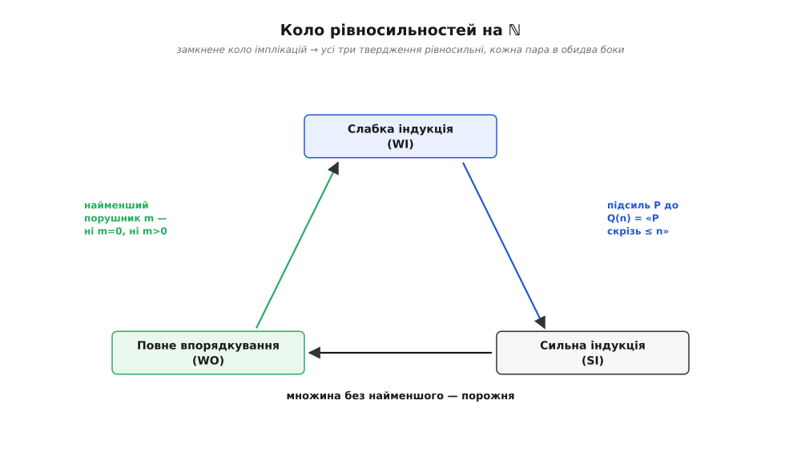
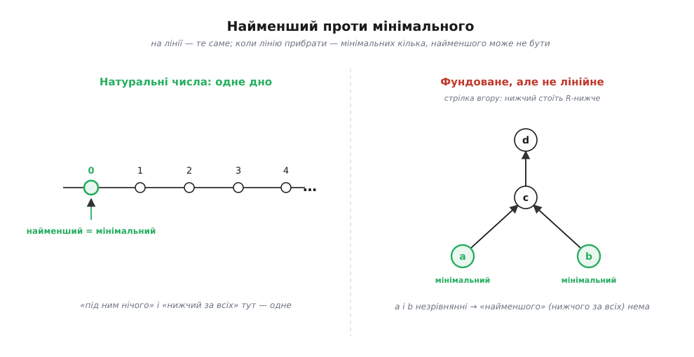
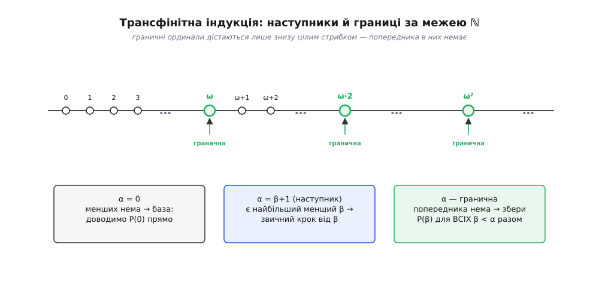

# 🧮 Одне твердження під трьома масками: індукція, найменший елемент, фундованість

Три речення про натуральні числа звучать по-різному, а виявляються тим самим реченням. Перше — **слабка індукція**: властивість, що є в нуля й переходить з кожного числа на наступне, накриває всі числа. Друге — **принцип повного впорядкування**: у кожній непорожній множині натуральних чисел є найменший елемент. Третє — **сильна індукція**: властивість, що справджується для *n*, коли вже справдилася для всіх менших чисел, теж накриває всі. Тут ми доведемо строго, що ці троє рівносильні — з будь-якого випливають два інші, і то в обидва боки, — а тоді докопаємося до **спільного кореня**, з якого всі троє ростуть: у натуральних числах **не можна спускатися вічно**. Щойно цей корінь назвемо, він відірветься від чисел зовсім — і та сама машинерія запрацює на деревах, на парах, на впорядкуваннях, довших за нескінченність.

### Три твердження, покладені поруч

Домовмося про позначки. Беремо ℕ = {0, 1, 2, …} (почати з одиниці нічого не змінить), звичайний порядок `<`, і **P(n)** — довільну властивість числа *n*, про яку є сенс питати «правда чи ні». Ось троє тверджень у точному вигляді:

```
Слабка індукція (WI):
    якщо  P(0)  і  ∀n [ P(n) → P(n+1) ],
    то    ∀n P(n).

Повне впорядкування (WO):
    кожна непорожня  S ⊆ ℕ  має найменший елемент —
    таке m ∈ S, що  m ≤ x  для всіх  x ∈ S.

Сильна індукція (SI):
    якщо  ∀n [ (∀k<n P(k)) → P(n) ],
    то    ∀n P(n).
```

Слово «рівносильні» варто одразу вжити чесно. Ми не добуваємо ці твердження з порожнечі. Ми фіксуємо **елементарне обладнання** ℕ — що 0 найменший, що в кожного *n* > 0 є попередник *n*−1, що `<` — звичайний порядок, — і питаємо: тримаючи це обладнання, чи можна кожне з трьох вивести з будь-якого іншого? Виявляється, так. Оце «так» і є зміст рівносильності. Саме обладнання живе в означенні натуральних чисел через [аксіоми Пеано](topic:math/natural-numbers): існування попередника й відсутність бічних ниток — не додаткові дари, а частина того, чим ℕ є.

Зверніть увагу на одну дрібницю, що озветься далі. У сильної індукції **немає окремої бази**. Її база захована в тому ж рядку, при *n* = 0: тоді умова «∀k<0 P(k)» порожня (менших за нуль немає), тож справдитися вона мусить сама собою, і передумова зобов'язує довести P(0) прямо. База не зникла — вона згорнулась усередину кроку.

### Найменший порушник: WO ⟹ WI

Почнімо з найзнайомішого напряму — з того, як [слабка індукція](topic:math/mathematical-induction) виводиться з найменшого елемента. Припустімо WO і дано передумови WI: P(0) правдиве, і з кожного P(n) випливає P(n+1). Хочемо ∀n P(n). Доводимо [через заперечення](topic:math/mathematical-proof): зберімо всіх **порушників**

```
C = { n ∈ ℕ : P(n) хибне }
```

і покажемо, що ця множина порожня. Якби C був непорожній, то за WO мав би **найменший** елемент — назвімо його *m*. Тепер затиснемо *m* з двох боків. По-перше, *m* ≠ 0: адже P(0) правдиве, тобто 0 ∉ C, а найменший елемент C сам лежить у C. Отже *m* > 0, і в *m* є попередник *m*−1. По-друге, *m*−1 < *m*, а *m* — найменший у C, тож *m*−1 у C бути не може: *m*−1 ∉ C, тобто P(*m*−1) правдиве. Але крок WI із P(*m*−1) видає P(*m*) — тобто *m* ∉ C. Суперечність: *m* водночас і в C (як найменший елемент), і поза C. Отже, C порожній, і P(n) справджується скрізь.

Придивіться до форми доказу. WO **безкоштовно** вручив нам найменшого порушника, а нам лишилося тільки спростувати, що він узагалі існує — затиснувши його базою з одного боку й кроком з іншого. Це весь фокус, і він повернеться в кожному наступному доведенні цієї статті, лише під іншими іменами.

### Підсилення до сильної індукції: WI ⟹ SI

Тепер зворотний рух вгору по силі: із слабкої індукції добудемо сильну. Дано передумову SI: для кожного *n* із «P справджується для всіх *k* < *n*» випливає P(*n*). Хочемо ∀n P(n), маючи в руках **лише** слабку індукцію.

Пряма спроба тут застрягає. Щоб слабкою індукцією зробити крок до P(*n*+1), треба спертися на P(*n*) — а передумова SI дає P(*n*) не з самого P(*n*), а з **усіх** попередніх P(0), …, P(*n*−1) разом. Слабка індукція носить у руці лише одного сусіда, а нам потрібна вся історія. Вихід — **підсилити властивість** так, щоб вона сама несла цю історію. Уведімо

```
Q(n):  P(k) правдиве для всіх k ≤ n
```

Q(n) означає «P справдилося скрізь аж до *n* включно». Доведімо тепер Q слабкою індукцією.

**База Q(0).** Треба P(0). Візьмімо передумову SI при *n* = 0: умова «∀k<0 P(k)» порожня, тож автоматично правдива, і передумова віддає P(0). Отже Q(0).

**Крок Q(n) → Q(n+1).** Нехай Q(n): P(*k*) для всіх *k* ≤ *n*. Тоді P(*k*) справджується для всіх *k* < *n*+1 — адже «*k* < *n*+1» і «*k* ≤ *n*» — те саме. Передумова SI при *n*+1 із цього видає P(*n*+1). Долучивши P(*n*+1) до вже наявних P(*k*), *k* ≤ *n*, дістаємо P(*k*) для всіх *k* ≤ *n*+1 — тобто Q(*n*+1).

Слабка індукція віддає ∀n Q(n). А з Q(n) випливає, зокрема, P(n). Отже ∀n P(n) — це і є сильна індукція.

Мораль варта того, щоб її вимовити: сильна індукція — **не могутніша аксіома**, а слабка індукція, застосована до накопиченої властивості «P скрізь нижче». Уся її зайва сила — це бухгалтерія, спосіб волочити за собою всю пройдену історію в одному твердженні.

### Порожнеча множини без дна: SI ⟹ WO

Лишилося замкнути коло — із сильної індукції добути повне впорядкування. Знову йдемо через заперечення, але тепер спростовуємо множину **без** найменшого. Нехай S ⊆ ℕ, і в S найменшого елемента немає; покажемо, що тоді S порожня. Візьмімо властивість

```
P(n):  n ∉ S
```

і доведімо її сильною індукцією. Передумова SI вимагає: для довільного *n*, припустивши P(*k*) для всіх *k* < *n* (тобто жодне число, менше за *n*, не лежить у S), вивести P(*n*) (тобто *n* ∉ S). Припустімо навпаки, *n* ∈ S. Але всі менші за *n* числа — поза S. Виходить, кожен елемент S не менший за *n*, а сам *n* у S лежить — тобто *n* і є **найменший** елемент S. А ми умовились, що найменшого в S немає. Суперечність; отже *n* ∉ S. Передумову SI виконано, і вона віддає ∀n (n ∉ S) — **жодне** число не в S, S порожня.

Прочитаймо це навпаки (за контрапозицією): якщо S непорожня, то найменший елемент у ній є. Це і є WO.

### Коло замкнулося

Ми провели три стрілки: **WO ⟹ WI ⟹ SI ⟹ WO**. Вони замикають коло, а замкнене коло імплікацій дає найсильніше: **з будь-якого з трьох тверджень випливає будь-яке інше** — обійти колом можна, стартувавши з якої завгодно вершини. Зокрема, WI ⟺ WO, WO ⟺ SI, WI ⟺ SI — кожна пара в обидва боки, як і обіцяли. Один із боків навіть очевидний сам по собі: сильна індукція одразу тягне слабку (маючи P(0) і крок P(n)→P(n+1), передумову SI перевірити легко), тож слабка — це просто зручніший окремий випадок сильної. Уся робота ховалась у зворотних стрілках, і саме їх ми пройшли.



*Замкнене коло імплікацій означає рівносильність усіх трьох тверджень — з будь-якого можна дійти до будь-якого. Кожна стрілка підписана прийомом, яким її доводять: найменший порушник, підсилення властивості, порожнеча множини без дна.*

### Що крутить усі три: заборона нескінченного спуску

Придивімося, що́ спільного в трьох доведеннях. У кожному вирішальний хід — це **найменший елемент, якого не може бути**: найменший порушник у C, найменший елемент у S. А чому в ℕ найменший узагалі мусить знайтися? Бо спускатися донизу цілими кроками вічно не можна — рано чи пізно впираєшся в дно. Виокремимо це начисто.

```
Нескінченний строго спадний ланцюг у ℕ — це послідовність
    n₀ > n₁ > n₂ > n₃ > …
у якій кожен наступний член строго менший за попередній.
```

Твердження: **WO рівносильне тому, що такого ланцюга в ℕ не існує.** Доведімо обидва боки — бо саме ця рівносильність і є той корінь, що переживе відрив від чисел.

**WO ⟹ спуску немає.** Нехай усупереч ланцюг *n*₀ > *n*₁ > *n*₂ > … є. Зберімо його члени в множину D = {*n*₀, *n*₁, *n*₂, …}. Вона непорожня, тож за WO має найменший елемент — якийсь *nⱼ*. Але в ланцюзі за ним стоїть *n₍ⱼ₊₁₎* < *nⱼ*, і він теж належить D. Виходить, *nⱼ* не найменший. Суперечність; ланцюга немає.

**Спуску немає ⟹ WO.** Через заперечення. Нехай S ⊆ ℕ непорожня і **без** найменшого елемента; збудуймо з неї спуск. Візьмімо якийсь *x*₀ ∈ S. Він не найменший (найменшого нема), тож у S знайдеться *x*₁ < *x*₀. Той теж не найменший — знайдеться *x*₂ < *x*₁. І так без упину: поточний елемент щоразу не найменший, отже в S є строго менший. Виходить нескінченний спуск *x*₀ > *x*₁ > *x*₂ > … — а його бути не може. Значить, множини S із таким описом не існує: кожна непорожня S має найменший елемент.

Ось вона, гола суть. WO — це буквально «ℕ забороняє нескінченний спуск». А славнозвісний [метод нескінченного спуску Ферма](topic:math/infinite-descent) — та сама рівність, прочитана навпаки: з будь-якого розв'язку зумій зробити менший, дістань заборонений спуск — і зроби висновок, що розв'язку не було зовсім.

Тепер найважливіше спостереження всієї статті. Цей корінь **нічого не знає про арифметику**. Йому потрібні лише дві речі: якийсь порядок і обіцянка «падати вічно не можна». Ні додавання, ні множення, ні навіть того, що елементи — числа. Відірвімо його від ℕ.

### Коли прибирають лінію: фундовані відношення

Замінімо порядок `<` на будь-яке **відношення**. Відношення *R* на множині *A* — це просто правило, що для кожних двох елементів *a*, *b* каже «так» або «ні» на питання «*a* *R* *b*?». Читаймо «*a* *R* *b*» як «*a* стоїть *R*-нижче за *b*», «*a* — *R*-попередник *b*». Прикладів безліч поза числами: «бути власним піддеревом» на виразах; «бути власним дільником» на цілих; «мати менший компонент по кожній координаті» на парах.

Найтонший момент — що означає «найменший», коли лінії немає. На лінії найменший елемент один: він ≤ за всіх. Прибравши лінію, ми втрачаємо право порівнювати кожні двоє; тепер природне поняття — не «найменший» (нижчий за всіх), а **мінімальний**: такий, що **під ним немає нічого**. Різниця не косметична. У розгалуженому порядку мінімальних елементів може бути кілька, і жоден із них не «найменший», бо вони між собою незрівнянні.



*На лінії «нижчий за всіх» і «під ним нічого» — те саме, тож найменший елемент один. Коли лінію прибрати, лишається слабше, але правильне поняття — мінімальний: під ним нічого немає. Таких може бути кілька, а «найменшого» (нижчого за всіх) може не бути зовсім.*

Тепер означення, що узагальнює WO:

```
Відношення R на A — фундоване (англ. well-founded, «з надійним
дном»), якщо КОЖНА непорожня X ⊆ A має R-мінімальний елемент:
таке m ∈ X, що жоден x ∈ X не стоїть R-нижче за m.
```

Це дослівно WO, у якому «найменший» пом'якшено до «мінімальний», а вимогу лінійності знято. І характеристика через спуск теж переживає узагальнення — майже дослівно:

```
R фундоване  ⟺  немає нескінченного спаду  … R a₂ R a₁ R a₀
             (елементів a₀, a₁, a₂, …, де aᵢ₊₁ R aᵢ для кожного i).
```

Один бік — той самий, що на ℕ: члени спаду утворюють непорожню множину без мінімального елемента, чого фундованість не терпить. А от зворотний бік ховає підводний камінь. Будуючи спад, ми на кожному кроці **вибираємо** менший елемент — і робимо це нескінченно багато разів, у множині, яку не конче вміємо перелічити. Ось де тихо працює [аксіома залежного вибору](topic:math/axiom-of-choice) (DC — послаблена форма аксіоми вибору). На ℕ вибирати не треба: серед менших завжди можна взяти найменшого, канонічно. Але в довільному *R* канонічного вибору може й не бути, тож рівносильність двох означень фундованості коштує рівно стільки вибору. Через це **первинним** беруть означення через мінімальний елемент — воно ні від чого не залежить і саме воно живить індукцію.

> 🔧 **Навіщо це.** «Мінімальний елемент», а не «найменший», — правильна цеглина, бо доведенням індукцією ніколи не потрібне «нижче за все», їм потрібне лише «під контрприкладом нічого немає». Уся сила аргументу — в тому, що під мінімальним порушником порожньо, тож крок індукції нема на що спертися, крім самого твердження. Лінійність тут зайва, і відкинувши її, ми не втрачаємо ані краплі доказової потуги — лише перестаємо вимагати від світу того, чого він не мусить давати.

Фундовані відношення — не екзотика, вони всюди: `<` на ℕ (взірець); «власне піддерево» на скінченних деревах (частин у терма скінченно, і кожна структурно менша); «власний дільник» на числах від 2 (ланцюг дільників щоразу коротшає, а прості — мінімальні); покомпонентний порядок на парах ℕ² (пару натуральних не можна зменшувати по координатах вічно). Скрізь одна риса — **дно, у яке впираєшся**.

### Індукція, що додається безкоштовно: структурна й нетерова

Ось нагорода за всю роботу. **Кожне** фундоване відношення дарує власний принцип індукції — задарма, самим фактом фундованості:

```
Індукція за фундованим R:
    якщо  ∀a [ (∀b (b R a → P(b)))  →  P(a) ],
    то    ∀a P(a).
```

Читається так: щоб довести P скрізь, доведи P(*a*), припустивши P для всіх *R*-попередників *a*. І — зверніть увагу — **окремої бази тут немає**. Мінімальні елементи *є* базою: для мінімального *a* немає жодного *b* *R* *a*, тож умова «∀b (b R a → P(b))» порожня й правдива сама собою, а отже крок мусить дати P(*a*) прямо. Це та сама згорнута база, що ховалась при *n* = 0 у сильної індукції, лише тепер вона розсипана по всіх мінімальних елементах.

Доведення — рівно той самий жест, що відкривав статтю. Якби контрприклади C = {*a* : ¬P(*a*)} були непорожні, фундованість дала б *R*-мінімальний *a* ∈ C. Усі *R*-попередники *b* цього *a* лежать поза C (бо *a* мінімальний у C), тобто P(*b*) правдиве для кожного *b* *R* *a*. Тоді крок змушує P(*a*) — суперечність із *a* ∈ C. Той самий двигун «найменшого порушника», лише «найменший» замінено на «мінімальний».

**Структурна індукція** — це воно з *R* = «безпосередня складова». Щоб довести властивість усіх списків: доведи її для порожнього списку (він мінімальний) і для `x :: xs`, припустивши для `xs`. Для всіх дерев: листки (мінімальні) — прямо, вузли — з їхніх піддерев. Відношення «бути піддеревом» фундоване, тож принцип застосовний. А **фундована рекурсія** — його близнюк для означень: значення f(*a*) вільно означати через f(*b*) для *b* *R* *a*, і таке означення завершується саме тому, що *R* забороняє нескінченний спуск (звідси й [завершуваність рекурсії](topic:algorithms/recursion) взагалі). Той самий принцип в алгебрі й теорії ідеалів звуть **нетеровою індукцією** — на честь Еммі Нетер (нім. математикиня, 1882–1935): її теорія ланцюгових умов у кільцях («Idealtheorie in Ringbereichen», 1921) стоїть за назвою, і «нетерів» об'єкт — саме той, де відповідні ланцюги обриваються.

Найкраще видно на коді. Обчислімо значення арифметичного виразу, поданого деревом. Кожен виклик іде на **власне піддерево** — строго менше в фундованому відношенні «бути частиною», — тож рекурсія не має де зациклитися, і лічильник глибини їй не потрібен:

:::tabs
```python
from dataclasses import dataclass

@dataclass
class Num: v: int
@dataclass
class Add: l: object; r: object
@dataclass
class Mul: l: object; r: object

def ev(e):
    match e:
        case Num(v):    return v             # лист — мінімальний елемент: відповідь одразу
        case Add(l, r): return ev(l) + ev(r)  # виклики на СТРОГО менших піддеревах
        case Mul(l, r): return ev(l) * ev(r)
    raise TypeError(e)
```
```rust
enum Expr {
    Num(i64),
    Add(Box<Expr>, Box<Expr>),
    Mul(Box<Expr>, Box<Expr>),
}

fn ev(e: &Expr) -> i64 {
    match e {
        Expr::Num(v)    => *v,               // лист — база згортається сюди
        Expr::Add(l, r) => ev(l) + ev(r),    // рекурсія на власних піддеревах
        Expr::Mul(l, r) => ev(l) * ev(r),
    }
}
```
:::

Три гілки `match` — це три випадки структурної індукції, покладені на код один в один. `Num` — мінімальний елемент, лист: відповідь без жодного виклику, згорнута база. `Add` і `Mul` спираються на значення власних піддерев — крок індукції. А завершується це не завдяки якомусь лічильнику, а тому, що відношення «бути піддеревом» фундоване: спускатися по піддеревах вічно не можна, дно (листок) неминуче. Структурна індукція, вбрана в код.

### Цілком упорядковані множини й порядкові типи

Тепер друга гілка узагальнення. Лінію ми щойно прибирали; повернімо її — але просунемося за ℕ. **Лінійний порядок** на множині — це коли для кожних двох різних елементів видно, котрий раніше (незрівнянних пар немає). **Цілком упорядкована множина** (well-order) — лінійний порядок, у якому **кожна непорожня частина має найменший елемент**. За розкладом вище це те саме, що «лінійний плюс фундований»: лінія без нескінченного спаду. ℕ — найменша нескінченна цілком упорядкована множина.

Питання, що відкриває цілий світ: яких різних **форм** буває цілком упорядкована множина? Дві з них мають однаковий **порядковий тип**, якщо між ними є взаємно однозначна відповідність, що зберігає порядок, — одну можна переназвати в іншу, не переплутавши, хто за ким. Порядковий тип ℕ позначають **ω** (омега). А тепер надбудуймо форми над ω:

```
ω        :  0 < 1 < 2 < 3 < …                     (натуральні)
ω+1      :  0 < 1 < 2 < … < ∞                       (усі ℕ, а зверху ще один)
ω+ω = ω·2:  0 < 1 < … < 0′ < 1′ < 2′ < …           (дві копії ℕ підряд)
ω²       :  ω копій ω, поставлених одна за одною
```

Кожна — цілком упорядкована: у будь-якій непорожній частині найменший елемент є. І тут вигулькує геть нове явище. У ω+1 елемент ∞ **не має безпосереднього попередника**: до нього не дійти кроком «+1» знизу, він сидить над усім нескінченним хвостом одразу. Такі «дістатися-лиш-знизу-цілим» точки звуть **граничними** (лат. *limes* — «межа»), і вони — та справжня новина, якої в ℕ не було. Канонічні представники всіх форм цілком упорядкованих множин — **[порядкові числа (ординали)](topic:math/ordinal-numbers)**: кожна цілком упорядкована множина ізоморфна рівно одному ординалу за порядком, тож ординали — мірні лінійки повного впорядкування, як ℕ — лінійка скінченної лічби.

### Трансфінітна індукція: за межу ℕ

Тепер перенесімо індукцію на ординали. Оскільки `<` на ординалах — цілком упорядкування (а отже, фундоване відношення), принцип фундованої індукції застосовний до них дослівно. Але його форму варто розписати, бо граничний випадок — по-справжньому новий:

```
Трансфінітна індукція (по ординалах):
    щоб довести P(α) для всіх ординалів α,
    досить для кожного α вивести P(α) з припущення
    «P(β) правдиве для всіх β < α».
```

Із «для всіх β < α» самі собою випадають **три** випадки, і третій — чужий для ℕ:

- **α = 0** (найменший ординал): менших немає, припущення порожнє → доводимо P(0) прямо. Це база.
- **α = β+1** (наступник): серед менших є найбільший, *β*; маємо звичний крок «від *β* до *β*+1».
- **α — гранична** (ω, ω·2, ω², … — без безпосереднього попередника): попередника, з якого «крокнути», немає **зовсім**. P(α) доводиться не з одного сусіда, а з **усього** зібрання P(β), β < α, разом.

Оцей третій випадок і пояснює, чому індукції по ℕ бракує сил дістати ординали власноруч: у ℕ границь немає (кожне *n* > 0 — наступник), тож третій випадок там просто не трапляється, і про нього легко забути. Трансфінітна рекурсія — знову близнюк для означень: нею будують об'єкти вздовж ординалів (саму ординальну арифметику, накопичувальну ієрархію теорії множин), задаючи значення в α через значення нижче, з окремим правилом на границях.

> 🔧 **Навіщо це.** Крок-наступник — **локальний**: йому досить одного сусіда, *β*. Граничний крок — **глобальний**: йому потрібен увесь початковий відрізок під α заразом. Плутанина між ними — класична помилка трансфінітних доведень: властивість буває правдива в кожному наступнику й **зривається** на ω, бо перехід через границю ніхто не перевірив. Знати, що границя — окремий випадок, а не «ще один +1», — і є та обачність, якою трансфінітна індукція відрізняється від звичайної.



*За ω лінія триває далі: наступники йдуть «+1», а граничні ординали (ω, ω·2, ω²) дістаються лише знизу цілим стрибком — попередника в них немає. Тому трансфінітна індукція розпадається на три випадки: порожня база в нулі, звичний крок у наступника й окремий, глобальний крок на границі.*

### Один корінь

Зведімо все докупи. Слабка й сильна індукція, найменший елемент, завершення спуску, структурна індукція, трансфінітна індукція — це одне твердження в різних костюмах: **фундоване відношення не має нескінченного спуску, тож мінімальному контрприкладу немає де сховатися, а отже індукція проходить.** ℕ із `<` — найменший нескінченний зразок цього; прибери лінію — дістанеш структурну й нетерову індукцію по деревах, парах, термах; лиши лінію, але піднімися за ω — дістанеш трансфінітну індукцію по ординалах. А доведення завжди той самий жест: припусти контрприклад, візьми мінімальний — і покажи, що він вимагає меншого, якого вже нема куди взяти.
