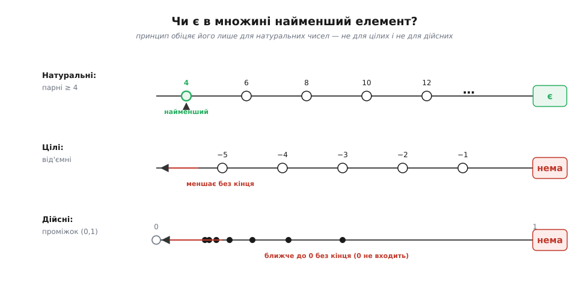
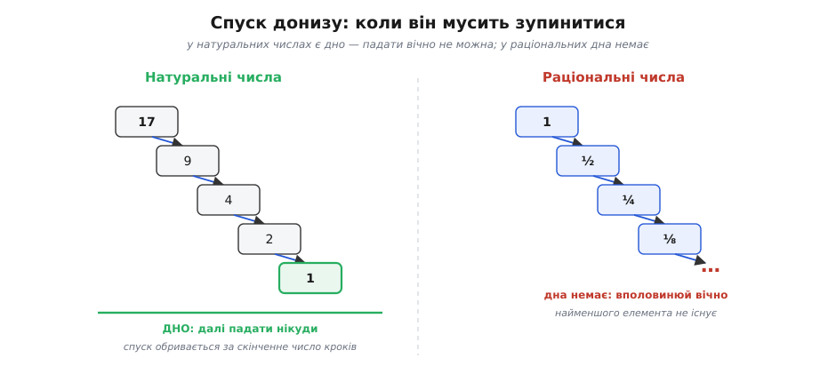
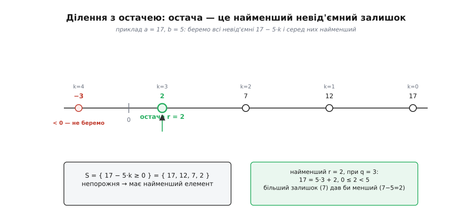

# Принцип повного впорядкування

<preknowlist>
- [Натуральні числа](book:math/natural-numbers) — числа 1, 2, 3, …: є найменше, за кожним стоїть рівно один наступний, і жодне не «висить збоку».
- [Математичне доведення](book:math/mathematical-proof) — що означає «довести» твердження, і зокрема як працює доказ від супротивного.
</preknowlist>

Висипте на стіл жменю монет і спитайте себе: чи завжди серед них є **найлегша**? Певно, що так — монет скінченна кількість, переберіть їх і знайдете найменшу. А якщо монет нескінченно багато? Тут інтуїція починає буксувати. Візьміть усі дроби, більші за нуль: 1, ½, ¼, ⅛, … — вони меншають і меншають без кінця, і **найменшого немає взагалі**. Хоч би який крихітний додатний дріб ви назвали, я вполовиню його й дам менший. Виходить, «найменший елемент» — не самоочевидна річ: у деяких нескінченних наборів він є, у деяких його нема.

Питання, у яких саме множин він **гарантовано** є, виявляється одним із наріжних у всій математиці. І найважливіша відповідь звучить просто: **у будь-якій непорожній множині натуральних чисел завжди є найменший елемент**. Це твердження й називають **принципом повного впорядкування** (англ. *well-ordering*, від нім. *wohlgeordnet* — «добре впорядкований», термін увів Ґеорґ Кантор; *принцип* — лат. *principium*, «начало, основа»).

### Що саме стверджується

Розберімо слова точно. Візьміть **яку завгодно** множину натуральних чисел — аби вона була **непорожня** (містила хоч одне число). Не обов'язково скінченну, не обов'язково задану списком; хай це буде «всі числа, що діляться на 7», або «всі *n*, для яких *n*² > 1000», або якийсь дикий набір, що ви його й описати до пуття не можете. Принцип обіцяє: у ній **є елемент, менший або рівний за кожен інший її елемент**. Один-єдиний найменший.

Порожню множину доводиться виключити з очевидної причини — у ній узагалі немає елементів, тож і найменшого нема чому бути. Це не виняток-примха, а межа здорового глузду: «найменший з нічого» — беззмістовний вислів.

Чому це не банальність, добре видно з контрасту. Для **скінченної** множини найменший елемент є завжди й деінде — переберіть усі, та й по всьому; тут ніякого принципу не треба. Уся сила твердження — саме в **нескінченних** множинах, де перебрати все неможливо. І ось там більшість звичних числових світів принципу **не** підкоряються.



*Найменший елемент гарантовано є лише в натуральних числах. Серед від'ємних цілих завжди знайдеться ще менше, а у відкритому проміжку дійсних — ще ближче до краю; там принцип не діє.*

### Чому саме натуральні, а не цілі чи дійсні

Візьміть **цілі** числа ℤ і в них множину всіх від'ємних: −1, −2, −3, … Найменшого немає — за кожним від'ємним стоїть іще менше. Візьміть **дійсні** числа й відкритий проміжок (0, 1) — усі числа строго між нулем та одиницею. Найменшого знову немає: до нуля можна підходити як завгодно близько, ніколи його не досягаючи, а сам нуль до проміжку не належить. Ті самі **раціональні** дроби з початку — 1, ½, ¼, … — валяться з тієї ж причини.

Що ж є в натуральних числах, чого бракує решті? **Дно.** Натуральні числа починаються з найменшого — з одиниці (або нуля, залежно від домовленості), — і, спускаючись від будь-якого числа донизу цілими кроками, ви **неминуче в це дно впираєтеся**. Не можна відняти одиницю, відняти ще, і ще, і робити так вічно, лишаючись у натуральних: рано чи пізно дійдете до найменшого й далі падати нікуди. Саме цю рису — **неможливість нескінченного спуску** — і схоплює принцип повного впорядкування.

У цілих дна немає (спускайся в мінус хоч довіку), у дійсних між будь-якими двома числами втискається ще нескінченно багато інших (спускайся, вполовинюючи відстань), — тому ні там, ні там гарантії найменшого немає. Натуральні числа влаштовані інакше: вони **дискретні** (між сусідами нічого немає) і **обмежені знизу** (є початок). Обидві риси разом і роблять їх повністю впорядкованими.



*Ланцюг, що спадає, у натуральних числах мусить обірватися — нескінченного спуску немає. У раціональних той самий спуск триває без кінця, тож там гарантії найменшого немає.*

### Близнюк математичної індукції

Той, хто вже стрічав [математичну індукцію](book:math/mathematical-induction), відчує тут щось знайоме — і недарма. Принцип повного впорядкування й індукція — це, по суті, **одне й те саме твердження про натуральні числа, вимовлене з двох боків**. Індукція каже: якщо властивість справджується для 1 і разом із кожним *k* переходить на *k*+1, то вона справджується для всіх чисел. Повне впорядкування каже: непорожня множина натуральних чисел має найменший елемент. З першого легко вивести друге, а з другого — перше; вони рівносильні.

Місток між ними — **доказ від супротивного**. Припустімо, властивість P справджується не для всіх *n*. Зберіть усіх «порушників» — числа, де P хибне, — у множину. Вона непорожня (за припущенням), а отже, за принципом повного впорядкування має **найменшого** порушника *m*. Далі показуємо, що такого *m* бути не може: якщо база й крок індукції виконані, то ані *m* = 1 (бо P(1) правда), ані *m* > 1 (бо тоді P(*m*−1) правда, а крок тягне з неї P(*m*)) — суперечність з обох боків. Порушників немає, P справджується всюди. Ось як «найменший елемент» перетворюється на індукційний стрибок. Ту саму рівносильність, разом із сильною індукцією, докладно розібрано в [окремому виведенні](book:math/well-ordering-principle/math-well-founded.md).

> 🔧 **Навіщо це.** Мати два рівносильні формулювання — не розкіш, а зручність. Одні твердження природніше доводити «висхідним» кроком індукції (формули для сум, правильність рекурсії), інші — «низхідним» пошуком найменшого контрприкладу (існування розкладів, неможливість певних рівностей). Вибираєте те знаряддя, яким конкретний доказ виходить коротшим, знаючи, що обидва спираються на ту саму властивість натуральних чисел.

### Як цим користуються: ділення з остачею

Найкраще принцип показує себе не в абстрактних заявах, а в роботі — коли з нього **добувають існування** чогось конкретного. Класичний приклад: для будь-яких натуральних *a* і *b* > 0 існують **єдині** частка *q* та остача *r*, такі що

```
a = b·q + r,   де  0 ≤ r < b
```

Ми користуємося цим щодня, ділячи з остачею, але звідки взагалі відомо, що така остача **завжди знайдеться**? Принцип дає доказ буквально з повітря. Розгляньмо всі числа виду *a* − *b*·*k*, що невід'ємні:

```
S = { a − b·k : k = 0, 1, 2, …  і  a − b·k ≥ 0 }
```

Ця множина непорожня — уже при *k* = 0 маємо *a* ≥ 0. Вона складається з натуральних чисел (з нулем). Отже, за принципом повного впорядкування в ній є **найменший** елемент; назвімо його *r*, а те *k*, що його дає, — часткою *q*, тож *r* = *a* − *b*·*q*. Лишилося показати, що *r* < *b*. Припустімо навпаки, *r* ≥ *b*. Тоді *r* − *b* = *a* − *b*·(*q*+1) теж невід'ємне й теж лежить у S — але воно **менше** за *r*. Суперечність: *r* мав бути найменшим. Значить, *r* < *b*, що й треба.

Придивіться до прийому: ми **вигадали множину**, довели, що вона непорожня, — і принцип **безкоштовно** видав нам елемент із потрібною властивістю. Не побудували остачу явно, не показали алгоритму — просто послалися на існування найменшого. Це типовий візерунок усіх доказів через повне впорядкування: щоб довести, що дещо існує, збери всіх кандидатів у множину й візьми найменшого.



*Остача — це найменший невід'ємний залишок, який дає принцип повного впорядкування. Якби вона була ≥ b, від неї можна було б відняти ще одне b і дістати менший елемент — суперечність.*

### Спуск, який мусить обірватися

Той самий двигун крутить і **доказ від супротивного через нескінченний спуск**. Хочете показати, що рівняння не має розв'язків у натуральних числах? Припустіть, що розв'язок є, і зумійте з будь-якого розв'язку сконструювати **менший** розв'язок того ж рівняння. Тоді ви в халепі — точніше, у халепі ваше припущення: з меншого можна знову дістати ще менший, і так без кінця, а нескінченного спадного ланцюга натуральних чисел **не буває**. Отже, розв'язку не існувало від початку.

Саме на цьому стоїть [метод нескінченного спуску Ферма](book:math/infinite-descent) — його улюблене знаряддя, яким він, зокрема, довів, що площа прямокутного трикутника зі сторонами-цілими не буває точним квадратом. Тим самим спуском доводять і що √2 **ірраціональний**: якби √2 = *p*/*q* у натуральних числах, знайшовся б дріб із **найменшим** знаменником, що дорівнює √2, — а невеликою алгеброю з нього виводиться дріб зі **ще меншим** знаменником, рівний тому самому √2. Суперечність із «найменшим»; значить, такого дробу немає й √2 не записується відношенням цілих. І тут принцип працює одним і тим самим важелем: **найменшого порушника, а отже, і жодного, бути не може**.

### Поза натуральними числами: цілком упорядковані множини

Досі йшлося про натуральні числа. Але саму ідею «повного впорядкування» можна відірвати від них і зробити властивістю **будь-якої** впорядкованої множини. Множину називають **цілком упорядкованою**, якщо її елементи розставлені в лінію (для кожних двох видно, котрий раніше) і при цьому **кожна непорожня її частина має найменший елемент**. Натуральні числа — взірцевий приклад; скінченні набори — теж; а от ℤ, ℚ, ℝ у своєму звичному порядку цілком упорядкованими **не є** — найменшого в них не гарантовано.

Цікаво, що ту саму множину іноді можна впорядкувати **по-новому** так, щоб вона стала цілком упорядкованою. Цілі числа у звичному порядку дна не мають — але переставте їх у послідовність 0, −1, 1, −2, 2, −3, 3, … і кожна непорожня підмножина вже матиме найменший (за новим порядком) елемент. Порядок — це не властивість самих чисел, а спосіб їх вишикувати; той самий набір можна вишикувати добре або погано.

Канонічні цілком упорядковані множини, що продовжують натуральний ряд «за нескінченність», називають [порядковими числами (ординалами)](book:math/ordinal-numbers) — це кістяк, на якому теорія множин будує рахунок і індукцію по трансфінітних (лат. *trans* — «за», *finis* — «межа»: за межею скінченного) кроках. Але вже й на рівні натуральних чисел головне видно: повне впорядкування — це властивість **порядку**, а не арифметики.

### Приголомшливий стрибок: чи можна впорядкувати геть усе

Тепер найгостріше питання, яке й вивело принцип у центр підвалин математики. Цілі й раціональні ми переставляти вміємо. А **дійсні** числа — увесь континуум, усю пряму — чи можна їх якось переставити так, щоб кожна непорожня множина дійсних мала найменший елемент? Не в звичному порядку (там ні), а в **якомусь** хитро вигаданому?

Ґеорґ Кантор ще 1883 року оголосив, що **так** — що всяку множину можна цілком упорядкувати, — але назвав це радше «законом мислення», ніж довів. Давід Гільберт 1900 року поставив це питання поряд із гіпотезою континууму першим у своєму знаменитому списку проблем. І 1904 року Ернст Цермело подав **доведення** — коротке, на три сторінки, у листі до Гільберта. Ціна доведення виявилася бентежною: воно спиралося на нове припущення, яке Цермело виокремив і назвав **[аксіомою вибору](book:math/axiom-of-choice)** — на позір невинне твердження, що з будь-якого зібрання непорожніх множин можна одночасно вибрати по одному елементу з кожної.

Реакція була бурхлива. Провідні математики — Борель, Бер, Лебеґ у Франції, Пеано в Італії, Пуанкаре — обурилися: доведення **не будує** жодного порядку на дійсних, воно лише **стверджує**, що такий існує, спираючись на вибір, який годі виконати явно. Ніхто досі так і не пред'явив конкретного повного впорядкування дійсних чисел — і, як з'ясувалося згодом, без аксіоми вибору його й не буде. Виявилося, що теорема Цермело про повне впорядкування **рівносильна** самій аксіомі вибору: прийняти одне — це прийняти й друге. Ця історія — про те, як тристорінкове доведення розкололо математику й змусило її вперше чітко виписати аксіоми теорії множин, — розказана окремо: [народження теореми про повне впорядкування](book:math/well-ordering-principle/hist-zermelo.md).

Тут проходить важлива межа. Для **натуральних** чисел принцип повного впорядкування — скромна, надійна, конструктивна річ: найменший елемент справді є, і його можна шукати. Для **довільних** множин «повне впорядкування існує» — твердження зовсім іншого сорту, неконструктивне, куплене за аксіому вибору. Одне слово, дві дуже різні сили ховаються під тією самою назвою.

> 🔧 **Навіщо це.** Аксіома вибору й повне впорядкування довільних множин — не схоластика: на них тримаються базові теореми функціонального аналізу (існування базису в будь-якому векторному просторі, теорема Гана — Банаха) і алгебри (у кожному кільці є максимальний ідеал). Водночас та сама аксіома породжує «монстрів» — множини, які неможливо виміряти, і парадоксальні розбиття кулі. Тому знати, **де** ваш доказ мовчки скористався вибором, — частина математичної гігієни: висновок, здобутий вибором, слабший за здобутий явною побудовою.

### Де це працює в інженерії: доведення завершуваності

Найпрактичніший спадок принципу — доводити, що **процеси зупиняються**. Хочете показати, що цикл чи рекурсія не крутитимуться вічно? Зіставте кожному кроку **натуральне число** — «міру», що строго **спадає** з кожним обертом. Оскільки нескінченного спадного ланцюга натуральних чисел не буває, спадати без кінця міра не може: рано чи пізно вона впреться в дно, і процес мусить завершитися. Той-таки «немає нескінченного спуску», лише вбраний в інженерну одежу.

```py
def euclid(a, b):
    while b != 0:          # міра — це b: натуральне число, що строго спадає
        a, b = b, a % b    # a % b < b, тож b на кожному кроці зменшується
    return a               # спуск не вічний → цикл завершиться
```

Тут остача `a % b` завжди менша за `b`, тож значення `b` утворює строго спадний ланцюг натуральних чисел — а такий ланцюг за принципом повного впорядкування скінченний, отже, цикл неодмінно доходить до `b == 0`. Це не «схоже на правду», а **доказ**: [алгоритм Евкліда](book:math/gcd-euclidean) завершується на будь-якому вході. Той самий прийом обґрунтовує [завершення рекурсії](book:algorithms/recursion) (кожен виклик — на меншому аргументі) і разом з [інваріантами циклу](book:programming/loop-invariants) складає доказ правильності програм. Як будувати такі міри для нетривіальних алгоритмів — покроково в [розборі: доводимо завершуваність через повне впорядкування](book:math/well-ordering-principle/proj-termination.md).

Тут таїться й межа можливого. Довести завершуваність, знайшовши спадну міру, вдається не завжди — і не тому, що ми недотепні: питання «чи спиниться ця програма?» у загальному випадку нерозв'язне ([проблема зупинки](book:algorithms/halting-problem)). Принцип повного впорядкування дає надійний **спосіб довести** завершення, коли міра знаходиться, але не обіцяє, що вона знайдеться завжди.

### Підсумок

Принцип повного впорядкування схоплює одну глибоку рису натуральних чисел: **у будь-якій непорожній їх множині є найменший елемент**, бо спускатися ними донизу вічно не можна — є дно. Ця скромна на вигляд властивість виявляється рівносильною математичній індукції й стає універсальним важелем: щоб довести, що дещо існує, збирають кандидатів у множину й беруть найменшого; щоб довести, що дечого не буває, показують, що з будь-якого прикладу вийшов би менший, — а нескінченного спуску немає. Ним доводять існування остачі при діленні, ірраціональність √2, завершуваність алгоритмів. А коли ту саму ідею намагаються поширити з натуральних чисел на **геть усі** множини, вона перетворюється на теорему Цермело, рівносильну аксіомі вибору, — і з надійного робочого інструмента стає одним із найспірніших тверджень в основах математики.
