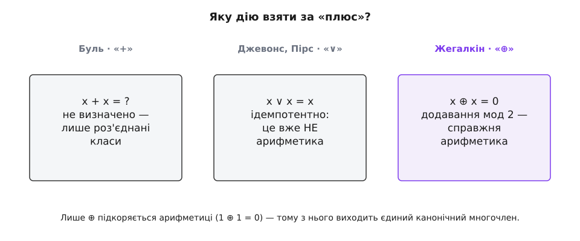

# 📜 Як логіку зробили арифметикою

Був момент у середині XIX століття, коли логіка мало не стала звичайною алгеброю — а тоді одна-єдина дія відмовилася грати за правилами, і мрія про «логіку з плюсом і множенням» застрягла на сімдесят років. Уся історія полінома Жегалкіна — це історія про один упертий «плюс»: який саме додаток обрати, щоб логіка корилася шкільній арифметиці. Найдивовижніше, що правильну відповідь знайшли **двічі** — з різницею в чверть століття, на різних континентах, у зовсім різних ремеслах, — і жоден із двох про іншого не знав.

## Плюс, що майже спрацював

Джордж Буль (George Boole) у праці «Дослідження законів мислення» (*An Investigation of the Laws of Thought*, 1854) зробив зухвале: почав писати судження буквами, а дії над класами позначати знаками «+» і «×», сподіваючись, що з ними можна поводитися майже як із числами. Половина задуму вдалася блискуче. [Множення лягло на «і»](book:math/boolean-algebra): перетин класу самого з собою дає той самий клас, тобто x·x = x — і це арифметиці не суперечить, просто зайвий випадок, коли квадрат дорівнює основі.

А от «плюс» повівся підступно. Булів «+» означав складання класів — але лише **роз'єднаних**, тих, що не перетинаються. Там, де класи не мали спільного, x + y було чистим класом і поводилося точно як числова сума. Але спитайте Буля, чому дорівнює x + x, — і він відмовиться відповідати. Клас, накладений сам на себе, перетинається з собою повністю; умова роз'єднаності порушена, і вираз повисає в порожнечі. Буль свідомо лишав x + x без значення: він відкидав відповідь 0 (бо тоді, за звичайною алгеброю, вийшло б x = 0 — безглуздя) і не приймав відповіді x. Його система була арифметикою рівно доти, доки ти лишався на роз'єднаних шматках; варто було їм перекритися — і числова аналогія падала.

## Плюс, що зламав арифметику

1863 року молодий Вільям Стенлі Джевонс (William Stanley Jevons), учень Оґастеса де Морґана, написав Булеві листа з простою, як здавалося, поправкою: хай «+» означає природне, **інклюзивне** «або» — об'єднання класів, що діє й тоді, коли вони перетинаються. Тоді x + x = x, бо об'єднання класу із собою — це він сам.

Буль поправку відкинув навідріз — і обірвав листування. Причина глибша за впертість: рівність x + x = x, прочитана за правилами звичайної алгебри, дає x = 0, а це рвало весь Булів місток до чисел. Він радше лишав дію частковою, ніж жертвував арифметикою. Того ж 1864 року Буль помер, а Джевонс видав «Чисту логіку» (*Pure Logic*, 1864), де відкрито відмовився від опертя на «алгебру чисел»: його дії тепер виводилися із самої логіки, а не позичалися в арифметики. Незалежно від Джевонса до того самого дійшов і Чарлз Сандерс Пірс (Charles Sanders Peirce): у статті «Удосконалення Булевого числення логіки» (*On an Improvement in Boole's Calculus of Logic*, 1867) він зробив логічне додавання інклюзивним навіть для класів, що перетинаються.

Це був величезний виграш у загальності — і водночас тиха катастрофа для арифметичної мрії. Бо закон ідемпотентності x ∨ x = x — це рівно те, чого не робить **жодне** число: жодне не дорівнює власному подвоєнню (крім нуля). Тієї миті, коли «плюс» став інклюзивним, логіка перестала бути арифметикою. Букви лишилися, знаки лишилися, а правила під ними стали інші. Ось чому в панівній алгебрі логіки — від Джевонса й Пірса до Ернста Шрёдера (Ernst Schröder) — канонічного многочлена не було й на видноколі: у мові з ідемпотентним «або» многочлен просто не виходить.


*Уся розвилка — в одному рядку: чому дорівнює x, додане саме до себе. Булів плюс мовчить, інклюзивне «або» дає x і тим ламає числову аналогію, і лише «виключне або» дає 0 — тобто підкоряється арифметиці за модулем 2. Вибір «плюса» вирішує, буде канонічний многочлен чи ні.*

## Іван Жегалкін і повернення плюса

Розв'язок прийшов з Москви. Іван Іванович Жегалкін (1869, Мценськ — 1947, Москва) — російський математик, професор Московського університету, вихованець тамтешньої математичної школи Дмитра Єґорова (Dmitri Egorov) й Миколи Лузіна (Nikolai Luzin). До логіки він прийшов з протилежного, найабстрактнішого краю математики: його праця «Трансфінітні числа» (1907; від лат. *trans-* — за, поза + *fīnītus* — скінченний) усталено вважається першою російськомовною монографією з теорії множин, і того самого кола ідей — нескінченні множини Ґеорґа Кантора (Georg Cantor) — він тримався роками.

1927 року Жегалкін друкує в «Математичному збірнику» (том 34, вип. 1, с. 9–28) статтю «Про техніку обчислення суджень у символічній логіці», а наступного, 1928-го, там-таки (том 35, вип. 3–4, с. 311–377) — статтю з промовистою назвою «Арифметизація символічної логіки». Назва і є вся програма: звести булеву логіку до арифметики — конкретно, до арифметики [кільця цілих чисел за модулем 2](book:math/rings), яке позначають ℤ₂ (воно ж поле GF(2), найменша арена, де водночас живуть додавання й множення).

Хід Жегалкіна — це відмова від хибного вибору попередників. Не бери інклюзивне «∨» за плюс: воно ідемпотентне й нечислове. Візьми за плюс **«виключне або»** ⊕ — і придивись, як воно рахує: 1 ⊕ 1 = 0. Це не примха, це буквально додавання за модулем 2, де двійка обертається на нуль. А множення лиши тим самим «і». Тоді обидва наріжні правила стають чесною арифметикою:

```
x · x = x       (булевість: біт у квадраті — той самий біт)
x ⊕ x = 0       (додавання мод 2: однакові доданки гинуть парою)
```

І все стає на місце. Логіка знову тримається на плюсі й множенні — тільки плюс тепер правильний, той, що справді додає. Кожна булева функція згортається до одного-єдиного многочлена з коефіцієнтами лише 0 і 1 — тієї канонічної форми, якої панівна алгебра логіки не мала ніколи. Те, що Джевонс і Пірс мимоволі відібрали, зробивши «або» інклюзивним, Жегалкін повернув, обравши дію, яка додає по-справжньому. Цей причинний ланцюжок — Буль мав арифметику → інклюзивне «або» її забрало → Жегалкін повернув через ⊕ — реконструкція логіки подій; сам Жегалкін формулював мету прямо, самою назвою статті: звести числення суджень до лишків за модулем 2.

> 🔧 **Навіщо це.** Історія тут не просто цікава — вона пояснює, чому та сама форма двічі знадобилася на практиці. Обравши за «плюс» саме ⊕, Жегалкін дав булевій функції запис, у якому апаратно **дешеві** дії (XOR — це лінійна, «легка» логіка) відокремлені від **дорогих** (добуток — нелінійність). Саме тому інженери-кодувальники набрели на цю форму незалежно: паритет, контрольні суми й коди виправлення помилок — це майже все XOR, тобто лінійна частина полінома, і міряти в них треба рівно те, «скільки нелінійності» додає схема. Той самий поділ на лінійне й нелінійне за модулем 2 згодом ліг в основу оцінювання стійкості шифрів. Вибір «якого плюса», що постав у XIX столітті, виявився не смаком, а інженерним рішенням із наслідками на сторіччя вперед.

Цінність канонічної форми годі переоцінити: щойно функція має єдиний запис, питання «чи ці дві формули задають одну функцію?» вирішується поглядом — звів обидві до многочлена й порівняв доданки. Саме заради цього все затівалося.

## Ідея носилася в повітрі

Історія рідко тримає велику ідею за однією людиною, і арифметизація логіки — не виняток. Того самого 1927 року, коли вийшла перша стаття Жегалкіна, американський математик Ерік Темпл Белл (Eric Temple Bell, родом зі Шотландії) надрукував у «Transactions of the American Mathematical Society» (том 29, вип. 3, с. 597–611) працю «Arithmetic of Logic» — теж арифметизацію булевої алгебри. Але дорога Белла була зовсім інша: він будував її на теорії ідеалів Ріхарда Дедекінда (Richard Dedekind), а не на кільці за модулем 2, і чистого многочлена звідти не виходило. Це добрий доказ, що «зробити логіку арифметикою» витало в повітрі епохи, — та лише мод-2-форма Жегалкіна виявилася тією, що лягла точно й лишилася, тому ім'я на поліномі — його.

## Друга дорога: Маллер і Рід, 1954

А тепер — найдивовижніше. Через чверть століття до тієї самої форми прийшли люди, які про Жегалкіна не чули й не мали чути, бо йшли зовсім іншим ремеслом — будували коди виправлення помилок.

1954 року Девід Юджин Маллер (David Eugene Muller) друкує в «IRE Transactions on Electronic Computers» (том EC-3, с. 6–12) статтю «Застосування булевої алгебри до проєктування комутаційних схем і до виявлення похибок». Йому, інженерові, знадобилося впорядкувати булеві функції за складністю — і природною міркою складності виявився саме **степінь** їхнього алгебричного запису через ⊕ і добутки, тобто той-таки поліном. Того ж 1954-го Ірвінг Стой Рід (Irving Stoy Reed) у «IRE Transactions on Information Theory» (вип. 4, с. 38–49) додає до конструкції Маллера схему декодування — елегантне мажоритарне голосування, що виправляє кілька похибок відразу. Так народилися **[коди Ріда–Маллера](book:communications/reed-muller-code)** — сімейство лінійних кодів, де кодове слово будують саме як значення булевого многочлена обмеженого степеня, а декодують голосуванням більшості.

І ось збіг, який збігом не є: «додатно-полярне розкладання Ріда–Маллера» (positive-polarity Reed–Muller, PPRM) булевої функції — це буквально поліном Жегалкіна. Той самий ⊕ добутків, ті самі коефіцієнти 0/1, та сама єдина форма. Виходить, в одного об'єкта три імені, залежно від того, хто його першим зустрів:

- **поліном Жегалкіна** — у математиків і логіків;
- **алгебрична нормальна форма** (algebraic normal form, ANF) — у криптографів та інформатиків;
- **додатно-полярне Рід–Маллер** (PPRM) — у теорії кодування.

Ця друга дорога вивела форму далеко за межі паперу. Коди Ріда–Маллера виявилися напрочуд надійними на слабкому, зашумленому каналі — і 1971 року саме код Ріда–Маллера віз на Землю знімки Марса з апарата «Марінер-9» (Mariner 9), що першим в історії вийшов на орбіту іншої планети. Многочлен, який Жегалкін вивів, аби порівнювати судження, за півстоліття перетворився на щит, що проніс марсіанські фотографії крізь десятки мільйонів кілометрів шуму.


*Дві спільноти, розділені чвертю століття, континентом і фахом, приходять до буквально однакової форми. Ліва гілка шукала канонічний запис логіки; права — надійний спосіб передати біти крізь шум. Зустрілися вони в тому самому многочлені над модулем 2 — під трьома різними іменами.*

## Коли одну річ відкривають двічі

Коли дві не пов'язані спільноти — московські логіки 1920-х і американські інженери-зв'язківці 1950-х — з різницею в покоління й на різних континентах приходять до буквально однакової форми, це не збіг і не мода. Це підпис справжнього, природного об'єкта. Єдиний многочлен над ℤ₂ ніхто не вигадав зі смаку: він — єдиний спосіб канонічно записати булеву функцію, щойно ти вимагаєш, аби логіка корилася арифметиці. Жегалкін знайшов його першим (1927–28), поставивши питання математика: як звести числення до чисел. Маллер і Рід знайшли його вдруге (1954), поставивши питання інженера: як надійно передати біти крізь шум. Форма чекала на обох — вона була там весь час, від того дня, коли Буль відмовився сказати, чому дорівнює x + x.
