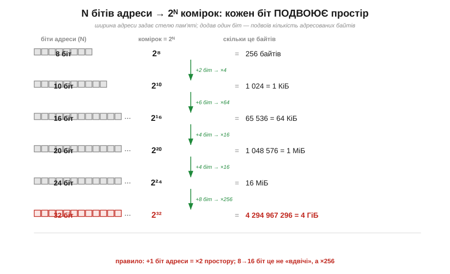
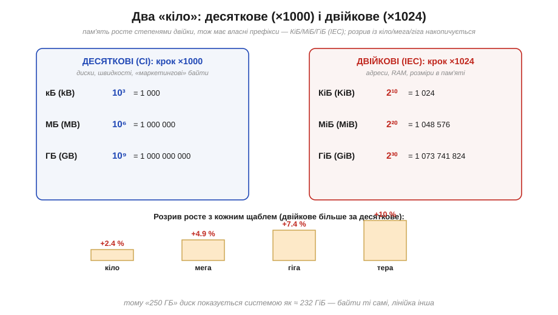
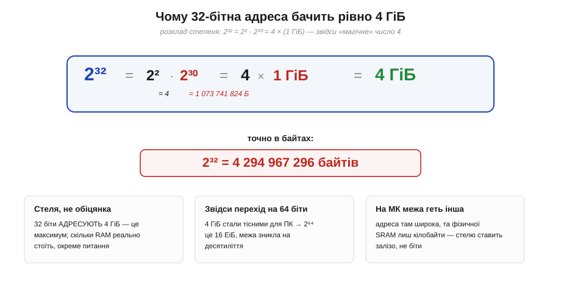

# 🧮 Розрядність адреси: 2ᴺ комірок і чому 32 біти бачать рівно 4 ГіБ

> Коли [пам'ять — це масив комірок з адресами](book:programming/memory-as-array), діє коротке правило: **N бітів адреси → 2ᴺ комірок**, і звідси випливає, що 32-бітна адреса бачить «близько 4 ГБ». Доведімо це точно. Бо за цим «близько» ховається пара речей, від яких потім болить голова: чому 32 біти дають не «приблизно чотири», а **рівно** 4 294 967 296 байтів; чому в пам'яті «кіло» — це 1024, а не 1000; і звідки взялися дивні на вигляд **КіБ, МіБ, ГіБ** проти звичних КБ, МБ, ГБ. Розрахунок простий — уся складність у двох системах префіксів, що відрізняються на лічені відсотки, а плутанина між ними коштує реальних багів і суперечок про «зниклі гігабайти». Розберімо все до останнього байта.

### Означення: ширина адреси задає її стелю

Сформулюймо точно. Адреса комірки — це двійкове число фіксованої ширини; нехай у ньому **N** бітів. Скільки різних номерів можна цими N бітами записати? Рівно стільки, скільки різних комбінацій нулів і одиниць, — а це та сама причина, з якої [двійкова система](book:math/why-binary) кодує рівно 2ᴺ значень на N розрядах:

```
кількість адрес = 2ᴺ
```

І ця ж величина — **стеля** пам'яті: більше комірок, ніж є адрес, машина просто не може назвати, скільки б мікросхем ви не приставили. Тому ширина адреси (а її задає [адресна шина процесора](book:programming/processor-parts)) — це не дрібна деталь, а жорстка межа: вона каже, **скільки** пам'яті архітектура взагалі здатна охопити. Звідси й уся подальша арифметика — треба тільки навчитися швидко рахувати 2ᴺ для великих N.

### Інтуїція: кожен біт подвоює простір

Чому степінь двійки росте так страшно швидко? Через одне просте спостереження: **кожен доданий біт подвоює** кількість адрес. Додали біт — у нього два значення, 0 і 1, і кожне з них «розмножує» всі попередні комбінації надвоє. Один біт — 2 адреси, два — 4, три — 8, і так далі; це не лінійне зростання, а вибух.


*Рис. Скільки комірок бачить адреса завширшки N бітів. 8 біт → 256 байтів; 10 → 1024 (1 КіБ); 16 → 65 536 (64 КіБ); 20 → 1 048 576 (1 МіБ); 24 → 16 МіБ; 32 → 4 294 967 296 (4 ГіБ). Кожен щабель — це **+біти → ×2 за кожен біт**: тому 8→16 біт це не «вдвічі більше», а ×256. Та сама вибухова формула 2ᴺ, що задає кількість двійкових комбінацій, тепер міряє місткість адресного простору.*

Це подвоєння й робить «розрядність» такою важливою. Перейти з 8-бітної адреси на 16-бітну — це не «вдвічі більше пам'яті», як підказує побутова інтуїція, а в **256 разів** більше (2⁸ = 256). А з 16 на 32 біти — ще в 65 536 разів. Саме тому колись 8-бітні машини задихалися від тісноти, а перехід на ширшу адресу щоразу відмикав цілий новий клас програм. Тепер, коли видно сам механізм, лишається навчитися рахувати ці степені, не виписуючи добуток із тридцяти двійок.

### Апарат: степені двійки рахують через 2¹⁰ ≈ 1000

Запам'ятовувати 2³² напам'ять не треба — досить **однієї** опорної точки й правила складання показників (при множенні степенів з однаковою основою показники додаються). Опорна точка така:

```
2¹⁰ = 1024 ≈ 1000  (≈ «тисяча», але трохи більша)
```

Це і є місток між двійковим світом і звичними «тисячами». Кожні **десять** бітів адреси множать обсяг приблизно на тисячу — точніше, на 1024. Звідси вся драбина будується усно, групуванням показника по десятках:

```
2¹⁰ = 1 024            ≈ 10³   → «кіло» пам'яті (Кі)
2²⁰ = 1 048 576        ≈ 10⁶   → «мега» пам'яті (Мі)
2³⁰ = 1 073 741 824    ≈ 10⁹   → «гіга» пам'яті (Гі)
2⁴⁰ ≈ 1.1 × 10¹²       ≈ 10¹²  → «тера» пам'яті (Ті)
```

Тобто будь-який 2ᴺ розкладається як `2^(10·k) × 2^залишок`. Для 32 це особливо зручно: `32 = 30 + 2`, тож

```
2³² = 2³⁰ × 2² = (1 073 741 824) × 4 = 4 294 967 296
```

Ось звідки береться 4: не «приблизно чотири мільярди», а рівно чотири, помножені на «гіга» пам'яті (2³⁰). Це загальний прийом: дивишся, скільки повних десяток у показнику (це дає Кі/Мі/Гі), а залишок 0–9 дає множник 1, 2, 4, 8, 16… попереду. `2²⁴ = 2²⁰ × 2⁴ = 16 МіБ`; `2¹⁶ = 2¹⁰ × 2⁶ = 64 КіБ`. Жодного калькулятора.

### Дві системи префіксів: 1000 проти 1024

Тут і зарито головне непорозуміння всієї теми, тож зупинімося на ньому уважно. Префікс «кіло» у фізиці означає рівно **1000** (×10³ — стандартний десятковий множник СІ). Але пам'ять росте **степенями двійки**, і там «кругле» число — це 1024, а не 1000. Два світи майже збігаються (1024 ≈ 1000), і з цього збігу й виросла багаторічна плутанина: одним словом «кілобайт» називали то 1000, то 1024 байтів.


*Рис. Два «кіло». Ліворуч — десяткові префікси СІ (×1000): кБ, МБ, ГБ — у них рахують диски й швидкості. Праворуч — двійкові префікси IEC (×1024): КіБ, МіБ, ГіБ — ними міряють адреси, RAM і будь-що, прив'язане до 2ᴺ. Що вищий щабель, то більший розрив: на «кіло» це лише +2.4 %, а на «тера» — вже +10 %. Байти ті самі, лінійки різні.*

Щоб покінчити з двозначністю, 1998 року IEC увів окремі **двійкові префікси**: kibi/mebi/gibi (українською — кібі/мебі/гібі), позначення **КіБ, МіБ, ГіБ** (англ. KiB, MiB, GiB). Відтоді домовленість чітка:

```
1 КіБ (KiB) = 2¹⁰ = 1 024 байтів        |   1 кБ (kB) = 10³ = 1 000
1 МіБ (MiB) = 2²⁰ = 1 048 576           |   1 МБ (MB) = 10⁶ = 1 000 000
1 ГіБ (GiB) = 2³⁰ = 1 073 741 824       |   1 ГБ (GB) = 10⁹ = 1 000 000 000
```

Ліва колонка (двійкова) — це мова **адрес і пам'яті**: щоразу, коли величина походить від 2ᴺ, вона рахується по 1024. Права (десяткова) — мова дисків, мережевих швидкостей і «маркетингових» місткостей, де 1000 зручніша й вигідніша продавцеві. Розрив між ними **накопичується**: на кіло це дрібні 2.4 %, на гіга — вже 7.4 %, а на тера — цілих 10 %. Саме тому диск, на якому написано «250 ГБ», система показує як ≈ 232 ГіБ: байти ті самі, просто лічені різними лінійками. Знаючи цей поділ, ви більше ніколи не сплутаєте «зниклі» гігабайти з несправністю.

### Звідси — точна відповідь на «4 ГіБ»

Тепер зведімо все докупи й дамо точну, а не наближену відповідь на питання із заголовка. 32-бітна адреса розкладається без жодного округлення:


*Рис. Чому 32 біти бачать рівно 4 ГіБ. Розклад степеня: 2³² = 2² · 2³⁰ = 4 × (1 ГіБ) = 4 ГіБ, або точно в байтах — 4 294 967 296. «Магічне» число 4 — це просто 2², залишок від 32 над повними тридцятьма бітами «гіга». Праворуч — три тверезі ремарки: це стеля (а не обіцяна RAM), звідси й перехід ПК на 64 біти, а на МК межу ставить геть не ширина адреси.*

```
2³² = 2² × 2³⁰
    = 4 × 1 073 741 824
    = 4 294 967 296 байтів
    = 4 ГіБ  (саме гібібайти, бо 1 ГіБ = 2³⁰)
```

Ось чому правильно казати «32 біти бачать **4 ГіБ**», а не «4 ГБ»: у десяткових гігабайтах це число було б 4.29 ГБ (4 294 967 296 / 10⁹), а круглі «4» виходять лише в двійкових ГіБ. Та сама причина дає й «магічне» число 4: воно не з повітря, а просто 2² — залишок `32 − 30 = 2` над повними тридцятьма бітами «гіга». Якби адреса була 31-бітна, стеля впала б до 2 ГіБ; 33-бітна підняла б до 8 ГіБ — щораз рівно вдвічі, бо це знову один біт.

Варто одразу відокремити, чим ця межа **є** і чим **не є**, бо плутанина тут породжує хибні висновки. 2³² — це стеля **адресування**: максимум комірок, які 32-бітна адреса здатна назвати. Скільки RAM реально стоїть у машині — окреме питання; пам'яті може бути й менше, а частину адресного простору ще й заберуть під інше, не під неї. Тож 2³² — це межа того, що можна **назвати**, а не гарантія того, що там щось є. Саме впирання настільних комп'ютерів у цю 4-гібібайтну стелю й підштовхнуло перехід на 64 біти: 2⁶⁴ — це вже 16 ЕіБ (ексбібайтів), межа, якої не буде видно ще десятиліттями.

### Зворотна задача: скільки бітів треба на M комірок

Корисно вміти й обернути формулу. Якщо потрібно адресувати **M** комірок, скільки бітів адреси мінімально треба? Це обернення 2ᴺ — двійковий логарифм, заокруглений **угору**:

```
N = ⌈log₂ M⌉     (стеля: дробову частину завжди вгору)
```

«Угору» — принципово: 1000 комірок 9-ма бітами не адресуєш (2⁹ = 512 замало), потрібні 10 (2¹⁰ = 1024, з запасом). На практиці логарифм рахують тим самим прийомом навпаки: скільки разів подвоїти 1, щоб дотягтися до M. Кілька опорних точок варто тримати в голові — вони покривають майже всі практичні випадки:

```
256 значень   → 8 біт   (один байт)
1 024         → 10 біт
65 536        → 16 біт   (64 КіБ — стеля 16-бітної адреси)
16 млн (16Мі) → 24 біт
4 млрд (4Гі)  → 32 біт
```

Це той самий зв'язок «біти ↔ кількість значень», що й для [діапазону чисел у двійковій системі](book:math/why-binary), — лише тепер по той бік стоять не значення числа, а **адреси** комірок. Одна формула обслуговує обидва питання: «скільки значень уміщує N бітів» (це 2ᴺ) і «скільки бітів треба на M значень» (це ⌈log₂ M⌉).

> 🔧 **Навіщо це.** Це не абстрактна арифметика, а щоденний інструмент роботи з пам'яттю. Перше: **N бітів → 2ᴺ комірок** одразу дає стелю пам'яті архітектури — корисно, коли прикидаєте, чи влізуть дані й чому певна машина «не бачить» більше. Друге, чисто практичне: у пам'яті **рахують по 1024**, тож КіБ/МіБ/ГіБ (двійкові, IEC) — це не те саме, що КБ/МБ/ГБ (десяткові, СІ); саме звідси «диск на 250 ГБ показує 232 ГіБ» — не баг, а різні лінійки. Третє: тримайте опорну точку **2¹⁰ ≈ 1000** і прийом «десятки показника → Кі/Мі/Гі, залишок → множник 1/2/4/8» — і будь-який 2ᴺ порахуєте усно, від 64 КіБ до 4 ГіБ. Четверте: пам'ятайте, що 2³² — це **стеля адресування**, а не обіцяна RAM; реальної пам'яті буває менше, а на МК фізичну межу ставить узагалі залізо (кілобайти SRAM), а не ширина адреси. Засвоївши цей рахунок, ви читатимете будь-які розміри пам'яті без подиву — і не сплутаєте гіга з гібі там, де різниця в 7 %.

### Де цей рахунок працює

Цей рахунок — фоновий навик усієї роботи з пам'яттю. Формула 2ᴺ задає розмір адресного простору, коли [пам'ять постає масивом комірок з адресами](book:programming/memory-as-array), — і тепер цей простір можна назвати **точно** в КіБ/МіБ/ГіБ, а не «приблизно». Той самий степінь двійки стоїть за тим, [скільки значень кодує байт](book:math/why-binary), і за межами [доповняльного коду](book:math/twos-complement) для знакових чисел: пам'ять і числа міряє одна й та сама лінійка 2ᴺ. А двомовність префіксів (КіБ проти КБ) спрацьовує щоразу в даташиті чи у звіті компонувальника, де вказано, скільки в системі Flash і SRAM: там цифри майже завжди двійкові, по 1024. Хто вміє розкласти 2ᴺ на «гіга плюс залишок», той не боїться великих степенів двійки — за кожним із них стоїть лиш кілька подвоєнь однієї комірки.
