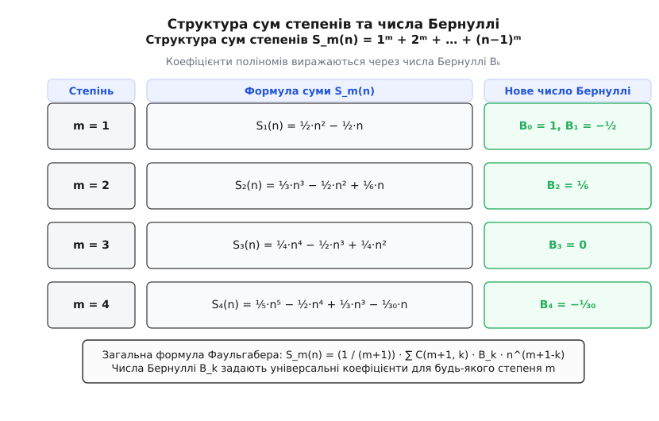
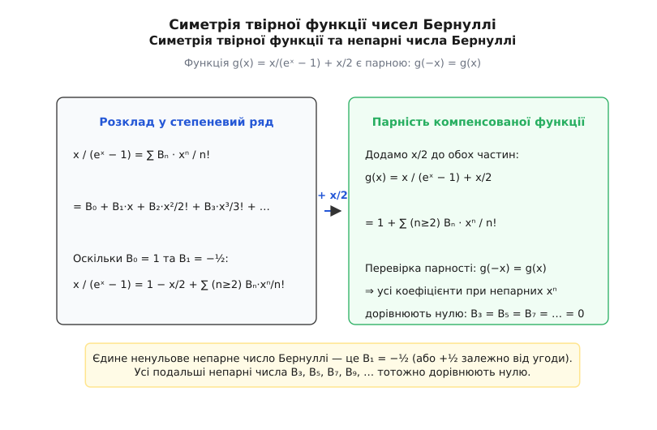
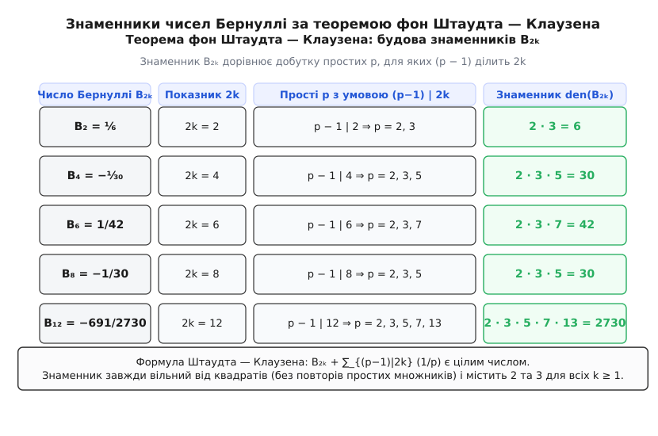
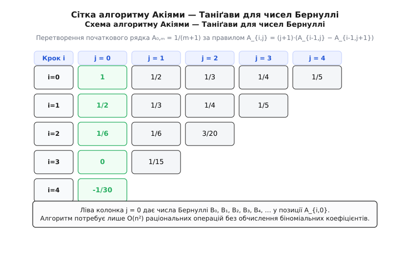

# Числа Бернуллі

<preknowlist>
- [Модульна арифметика](topic:math/modular-arithmetic) — остачі від ділення, порівняння a ≡ b (mod m) та операції у кільці Z/mZ.
- [Прості числа](topic:math/prime-numbers) — подільність у Z, канонічний розклад на множники та основна теорема арифметики.
- [Мала теорема Ферма](topic:math/fermat-little-theorem) — порівняння aᵖ⁻¹ ≡ 1 (mod p) для простого p і взаємно простого a.
- [Твірні функції](topic:math/generating-functions) — подання послідовностей через степеневі ряди та їхні формальні алгебраїчні властивості.
- [Ряди Тейлора](topic:math/taylor-series) — розклад аналітичних функцій у степеневі ряди в околі нуля.
</preknowlist>

**Якщо спробувати вручну обчислити суму десятих степенів перших тисячі натуральних чисел `1¹⁰ + 2¹⁰ + 3¹⁰ + … + 1000¹⁰`, звичайна арифметика вимагатиме багатьох днів виснажливого додавання тисячі гігантських 30-значних чисел.** Проте у 1713 році швейцарський математик Якоб Бернуллі (Jakob Bernoulli, лат. *numeri Bernoulli*) вивів єдиний многочлен степеня 11, який дає точну відповідь за лічені хвилини. Ключем до цього алгебраїчного дива виявилася універсальна послідовність раціональних чисел: `1`, `−½`, `⅙`, `0`, `−⅓₀`, `0`, `1/42`, `0`, `−⅓₀`, `0`, `5/66`, `0`, `−691/2730`, … Ці числа, що виникли з суто комбінаторного завдання додавання степенів, виявилися фундаментальними константами всієї теорії чисел, які пов'язують між собою прості числа, дзета-функцію Рімана, порівняння за модулем та Велику теорему Ферма.

## 1. Суми степенів та формула Фаульгабера

Пошук загальних формул для суми однаково парних і непарних степенів послідовних цілих чисел `S_m(n) = 1ᵐ + 2ᵐ + … + (n−1)ᵐ` тривав від античності. Якщо формулу для першого степеня `S₁(n) = n·(n−1)/2` знав ще Архімед, а суму квадратів `S₂(n) = (n−1)·n·(2n−1)/6` та кубів `S₃(n) = [n·(n−1)/2]²` досліджували математики Індії та арабського Сходу, то для кожного вищого `m` формули ставали дедалі розлогішими та важчими для осягнення.

У першій половині XVII століття німецький математик Йоганн Фаульгабер обчислив суми степенів аж до `m = 17`, але не зміг сформулювати загального правила побудови їхніх коефіцієнтів. 

Глибинну структуру цих формул відкрив Якоб Бернуллі. Він помітив, що сума `S_m(n)` для будь-якого натурального степеня `m ≥ 1` завжди виражається многочленом від `n` степеня строго `m + 1`, причому всі коефіцієнти цього многочлена вибудовуються за єдиною універсальною закономірністю.

Ця фундаментальна залежність отримала назву **формули Фаульгабера**:

```
S_m(n) = (1 / (m + 1)) · ∑ (від k=0 до m) C(m + 1, k) · B_k · nᵐ⁺¹⁻ᵏ
```

де `C(m + 1, k)` — це звичайні біноміальні коефіцієнти із трикутника Паскаля, а `B_k` — коефіцієнти Бернуллі.


*Структура сум степенів S_m(n): числа Бернуллі B_k виступають єдиним набором коефіцієнтів для будь-якого степеня m.*

Розгорнемо формулу Фаульгабера для перших кількох степенів `m`:

- **Для m = 1 (перший степінь):**
  `S₁(n) = (1/2) · [ C(2,0)·B₀·n² + C(2,1)·B₁·n¹ ] = (1/2)·n² − (1/2)·n = n·(n−1)/2`.
- **Для m = 2 (сума квадратів):**
  `S₂(n) = (1/3) · [ C(3,0)·B₀·n³ + C(3,1)·B₁·n² + C(3,2)·B₂·n¹ ] = (1/3)·n³ − (1/2)·n² + (1/6)·n`.
- **Для m = 3 (сума кубів):**
  `S₃(n) = (1/4) · [ C(4,0)·B₀·n⁴ + C(4,1)·B₁·n³ + C(4,2)·B₂·n² + C(4,3)·B₃·n¹ ] = (1/4)·n⁴ − (1/2)·n³ + (1/4)·n²`.
- **Для m = 4 (сума четвертих степенів):**
  `S₄(n) = (1/5) · [ C(5,0)·B₀·n⁵ + C(5,1)·B₁·n⁴ + C(5,2)·B₂·n³ + C(5,3)·B₃·n² + C(5,4)·B₄·n¹ ] = (1/5)·n⁵ − (1/2)·n⁴ + (1/3)·n³ − (1/30)·n`.
- **Для m = 5 (сума п'ятих степенів):**
  `S₅(n) = (1/6) · [ C(6,0)·B₀·n⁶ + C(6,1)·B₁·n⁵ + C(6,2)·B₂·n⁴ + C(6,4)·B₄·n² ] = (1/6)·n⁶ − (1/2)·n⁵ + (5/12)·n⁴ − (1/12)·n²`.
- **Для m = 10 (знаменита формула Якоба Бернуллі):**
  `S₁₀(n) = (1/11)·n¹¹ − (1/2)·n¹⁰ + (5/6)·n⁹ − (1)·n⁷ + (1)·n⁵ − (1/2)·n³ + (5/66)·n`.

Дивовижний факт полягає у тому, що числа `B_k` є повністю незалежними від степеня `m`. Набір чисел `B₀ = 1`, `B₁ = −½`, `B₂ = ⅙`, `B₃ = 0`, `B₄ = −⅓₀` підходить для обчислення суми абсолютно будь-якого степеня — від першого до мільйонного.

### Пряма обчислювальна перевірка формули Фаульгабера

Перевіримо роботу формули Фаульгабера для `m = 4` та `n = 5` (сума четвертих степенів чисел від 1 до 4):

Пряме додавання:

```
1⁴ + 2⁴ + 3⁴ + 4⁴
= 1 + 16 + 81 + 256      [піднесення доданків до степеня 4]
= 354                    [сумування всіх чисел]
```

Обчислення за формулою Фаульгабера для `S₄(5)`:

```
S₄(5)
= (1/5)·5⁵ − (1/2)·5⁴ + (1/3)·5³ − (1/30)·5   [підстановка m=4, n=5 у формулу Фаульгабера]
= (1/5)·3125 − (1/2)·625 + (1/3)·125 − 5/30   [піднесення 5 до степенів 5, 4, 3, 1]
= 625 − 312.5 + 41.666... − 0.1666...         [множення на раціональні коефіцієнти]
= 625 − 312.5 + 41.5                          [спрощення дробових частин]
= 354                                         [остаточний віднімальний розрахунок]
```

Результати повністю ідентичні. Формула Фаульгабера перетворює складне підсумовування на підстановку значення `n` у многочлен.

### Історичний підрахунок Якоба Бернуллі для m = 10, n = 1001

У своїй праці *Ars Conjectandi* (1713) Якоб Бернуллі записав:
«За допомогою цієї таблиці я у чверть години знайшов, що сума десятих степенів перших 1000 чисел дорівнює:
`91 409 924 241 424 243 424 241 924 242 500`.»

Обчислимо це за формулою `S₁₀(1001)`:

```
S₁₀(1001)
= (1/11)·(1001)¹¹ − (1/2)·(1001)¹⁰ + (5/6)·(1001)⁹ − (1)·(1001)⁷ + (1)·(1001)⁵ − (1/2)·(1001)³ + (5/66)·(1001)
```

Бернуллі підставив `n = 1001` у виведений ним многочлен степеня 11 та отримав точний результат усього за 15 хвилин ручних розрахунків! Докладніше про історію цього відкриття та створення Адою Лавлейс першої комп'ютерної програми можна прочитати у вставці [📜 Історія відкриття чисел Бернуллі](topic:math/bernoulli-numbers/hist-faulhaber-bernoulli.md).

## 2. Експоненціальна твірна функція та рекурентні тотожності

Сучасну вищу математику та аналітичну теорію чисел будують на визначенні чисел Бернуллі через їхню **експоненціальну твірну функцію** (лат. *generatrix*).

Розглянемо аналітичну функцію `f(x) = x / (eˣ − 1)`. У точці `x = 0` функція має усувну особливість, оскільки граничне значення за правилом Лопіталя дорівнює `lim (x → 0) x / (eˣ − 1) = 1`. 

Розкладемо функцію `f(x)` у ряд Тейлора в околі нуля:

```
x / (eˣ − 1) = ∑ (від n=0 до ∞) B_n · (xⁿ / n!)
```

Коефіцієнти `B_n` цього степеневого ряду і є **числами Бернуллі**.

Використовуючи тотожність `(eˣ − 1) · [ x / (eˣ − 1) ] = x`, розкриємо ліву частину через перемножування двох степеневих рядів:

```
( ∑ (m=1..∞) xᵐ / m! ) · ( ∑ (n=0..∞) B_n · xⁿ / n! ) = x
```

Прирівнюючи коефіцієнти при однакових степенях `xᵏ` ліворуч і праворуч, дістаємо систему алгебраїчних рівнянь:

- При `x¹`: `1 · B₀ = 1  ⇒  B₀ = 1`.
- При `x²`: `(1/2!)·B₀ + (1/1!)·B₁ = 0  ⇒  1/2 + B₁ = 0  ⇒  B₁ = −½`.
- При `x³`: `(1/3!)·B₀ + (1/2!)·B₁ + (1/1!)·(B₂ / 2!) = 0  ⇒  1/6 − 1/4 + B₂/2 = 0  ⇒  B₂ = ⅙`.
- При `x⁴`: `(1/4!)·B₀ + (1/3!)·B₁ + (1/2!)·(B₂/2!) + (1/1!)·(B₃/3!) = 0  ⇒  1/24 − 1/12 + 1/24 + B₃/6 = 0  ⇒  B₃ = 0`.
- При `x⁵`: `(1/5!)·B₀ + (1/4!)·B₁ + (1/3!)·(B₂/2!) + (1/2!)·(B₃/3!) + (1/1!)·(B₄/4!) = 0  ⇒  1/120 − 1/48 + 1/72 + 0 + B₄/24 = 0  ⇒  B₄ = −⅓₀`.

У загальному вигляді для будь-якого `n ≥ 1` оприлюднюється **фундаментальне рекурентне співвідношення**:

```
∑ (від k=0 до n) C(n + 1, k) · B_k = 0,   при n ≥ 1
```

Це співвідношення дозволяє послідовно обчислити будь-яке число Бернуллі, знаючи всі попередні значення:

```
B_n = − (1 / (n + 1)) · ∑ (від k=0 до n−1) C(n + 1, k) · B_k
```

Таблиця перших чотирнадцяти чисел Бернуллі має вигляд:

```
B₀  = 1
B₁  = −1/2
B₂  = 1/6
B₃  = 0
B₄  = −1/30
B₅  = 0
B₆  = 1/42
B₇  = 0
B₈  = −1/30
B₉  = 0
B₁₀ = 5/66
B₁₁ = 0
B₁₂ = −691/2730
B₁₃ = 0
B₁₄ = 7/6
```

## 3. Парність та тотожне нулювання непарних чисел Бернуллі

Поглянувши на виписану таблицю, неможливо не помітити вражаючу закономірність: починаючи з `B₃`, усі непарні числа Бернуллі `B₃ = B₅ = B₇ = B₉ = B₁₁ = … = 0` тотожно дорівнюють нулю!

Єдиним ненульовим непарним числом Бернуллі є `B₁ = −½`.

Цей факт є не випадковим збігом, а безпосереднім наслідком симетрії відносно нуля твірної функції.

### Доведення за допомогою симетрії

Розглянемо компенсовану функцію `g(x)`, яку дістанемо додаванням до твірної функції додатка `x / 2`:

```
g(x) = (x / (eˣ − 1)) + x/2
```

Застосуємо алгебраїчні перетворення, звівши до спільного знаменника:

```
g(x)
= (2x + x·eˣ − x) / (2·(eˣ − 1))      [зведення до спільного знаменника 2·(eˣ−1)]
= (x·(eˣ + 1)) / (2·(eˣ − 1))         [групування доданків у чисельнику]
= (x/2) · ((eˣ/² + e⁻ˣ/²) / (eˣ/² − e⁻ˣ/²))  [ділення чисельника і знаменника на eˣ/²]
= (x/2) · coth(x/2)                   [за означенням гіперболічного котангенса]
```

Перевіримо парність функції `g(x)`, підставивши `−x` замість `x`:

```
g(−x)
= (−x/2) · coth(−x/2)                 [підстановка −x]
= (−x/2) · (−coth(x/2))               [бо гіперболічний котангенс є непарним: coth(−t) = −coth(t)]
= (x/2) · coth(x/2)                   [мінус на мінус дає плюс]
= g(x)
```

Отже, компенсована функція `g(x) = (x/2) · coth(x/2)` є **строго парною функцією**: `g(−x) = g(x)`.


*Симетрія твірної функції: компенсація додаванням x/2 перетворює функцію g(x) на парну, що змушує всі коефіцієнти B_3, B_5, B_7, … зникати.*

Оскільки ряд Тейлора для будь-якої парної функції містить виключно парні степені `x²ᵏ`, у розкладі `g(x) = 1 + ∑ (n=2..∞) B_n · xⁿ / n!` абсолютно всі коефіцієнти при непарних степенях `x³`, `x⁵`, `x⁷`, … тотожно дорівнюють нулю.

Звідси випливає, що `B_n = 0` для всіх непарних `n ≥ 3`.

### Тригонометричні ряди Тейлора через числа Бернуллі

Парність твірної функції виявилася тісно пов'язаною з розкладами класичних тригонометричних функцій. Замінивши дійсний аргумент `x` на уявний `i·x`, математики отримали розклади Тейлора для котангенса, тангенса та секанса через числа Бернуллі:

```
cot(x) = ∑ (k=0..∞) (-1)ᵏ · 2²ᵏ · B₂ₖ · x²ᵏ⁻¹ / (2k)!
tan(x) = ∑ (k=1..∞) (-1)ᵏ⁻¹ · 2²ᵏ · (2²ᵏ − 1) · B₂ₖ · x²ᵏ⁻¹ / (2k)!
```

Ці розклади показують, що числа Бернуллі природно контролюють поведінку тригонометричних функцій у комплексному аналізі.

> ⚠️ **Зауваження щодо угоди про знак `B₁`:**
> В математиці зрідка використовують застарілу угоду `B_n⁺`, де `B₁ = +1/2`. У такому разі твірна функція задається як `x eˣ / (eˣ − 1) = x / (1 − e⁻ˣ)`. Усі інші числа `B₀, B₂, B₄, …` у двох системах повністю збігаються. Сучасна міжнародна фундаментальна математика використовує стандартну угоду `B_n⁻`, де `B₁ = −1/2`.

## 4. Теорема фон Штаудта — Клаузена та будова знаменників

Знаменники чисел Бернуллі `den(B₂ₖ)` на перший погляд здаються хаотичними: 6, 30, 42, 30, 66, 2730, 6, 510, … Проте у 1840 році німецькі математики Карл фон Штаудт та Томас Клаузен незалежно один від одного відкрили дивовижно красивий арифметичний закон, який повністю визначає будову знаменника для будь-якого `B₂ₖ`.

**Теорема (фон Штаудт — Клаузен).** Для будь-якого цілого парного індексу `2k ≥ 2` різниця

```
B₂ₖ + ∑ (з умовою (p−1)|2k) (1 / p)
```

є цілим числом, де сумування проводиться по всіх простих числах `p`, для яких `(p − 1)` є дільником індексу `2k`.


*Будова знаменників B_2k за теоремою фон Штаудта — Клаузена: знаменник формується добутком усіх простих p, для яких (p−1) ділить 2k.*

Розглянемо розрахунок знаменників на конкретних прикладах:

1. **Для k = 1 (число B₂):**
   Шукаємо прості числа `p`, такі що `(p − 1)` ділить `2k = 2`.
   - `p = 2`: `2 − 1 = 1`, ділить 2.
   - `p = 3`: `3 − 1 = 2`, ділить 2.
   - `p = 5`: `5 − 1 = 4`, не ділить 2.
   Отже, знаменник `den(B₂) = 2 · 3 = 6`. Дійсно, `B₂ = ⅙`.
   Перевірка теореми: `B₂ + 1/2 + 1/3 = 1/6 + 5/6 = 1` (ціле число).

2. **Для k = 2 (число B₄):**
   Шукаємо прості числа `p`, для яких `(p − 1)` ділить `2k = 4`.
   - `p = 2` (`1 | 4`), `p = 3` (`2 | 4`), `p = 5` (`4 | 4`).
   Знаменник: `den(B₄) = 2 · 3 · 5 = 30`. Дійсно, `B₄ = −⅓₀`.
   Перевірка: `B₄ + 1/2 + 1/3 + 1/5 = −1/30 + 31/30 = 1` (ціле число).

3. **Для k = 3 (число B₆):**
   Шукаємо прості `p`, для яких `(p − 1)` ділить `2k = 6`.
   - `p = 2` (`1|6`), `p = 3` (`2|6`), `p = 7` (`6|6`).
   Знаменник: `den(B₆) = 2 · 3 · 7 = 42`. Дійсно, `B₆ = 1/42`.

4. **Для k = 4 (число B₈):**
   Шукаємо прості `p`, для яких `(p − 1)` ділить `2k = 8`.
   - `p = 2` (`1|8`), `p = 3` (`2|8`), `p = 5` (`4|8`).
   Знаменник: `den(B₈) = 2 · 3 · 5 = 30`. Дійсно, `B₈ = −1/30`.

5. **Для k = 6 (число B₁₂):**
   Шукаємо прості числа `p`, для яких `(p − 1)` ділить `2k = 12`.
   - `p = 2` (`1|12`), `p = 3` (`2|12`), `p = 5` (`4|12`), `p = 7` (`6|12`), `p = 13` (`12|12`).
   Знаменник: `den(B₁₂) = 2 · 3 · 5 · 7 · 13 = 2730`. Дійсно, `B₁₂ = −691 / 2730`.

### Два фундаментальні наслідки теореми Штаудта — Клаузена

- **Усі знаменники чисел Бернуллі вільні від квадратів (square-free):**
  Знаменник `den(B₂ₖ)` не може містити квадратів простих чисел (наприклад, 4, 9, 25). Кожне просте число входить до знаменника строго у першому степені.
- **Універсальні множники 2 та 3:**
  Оскільки `(2 − 1) = 1` ділить будь-який індекс `2k`, а `(3 − 1) = 2` ділить будь-яке парне `2k`, прості числа **2 та 3 входять до знаменника кожного числа Бернуллі `B₂ₖ`**. Знаменник `den(B₂ₖ)` завжди кратний 6.

Строге математичне доведення теореми Штаудта — Клаузена за допомогою p-адичних чисел наведено у вставці [🧮 Доведення теореми Штаудта — Клаузена](topic:math/bernoulli-numbers/math-staudt-clausen-proof.md).

## 5. Порівняння Куммера та регулярні прості числа

Якщо знаменники чисел Бернуллі підкоряються чіткій теоремі Штаудта — Клаузена, то чисельники `num(B₂ₖ)` приховують куди складніші p-адичні співвідношення.

Німецький математик Ернст Куммер (Ernst Kummer), досліджуючи арифметику кругових полів для розв'язання Великої теореми Ферма, відкрив фундаментальну p-адичну неперервність чисельників чисел Бернуллі.

**Теорема (Порівняння Куммера).** Якщо `p` — просте число, а `2k` та `2m` — парні індекси, не кратні `(p − 1)`, такі що `2k ≡ 2m (mod p − 1)`, то має місце p-адичне порівняння:

```
(B₂ₖ / 2k) ≡ (B₂☤ / 2m) (mod p)
```

Це співвідношення показує, що нормовані числа Бернуллі `B₂ₖ / 2k` поводяться як неперервна функція в p-адичній метриці, що дозволило згодом побудувати p-адичні L-функції Куботи — Леопольдта.

### Ручне покрокове трасування порівняння Куммера

Перевіримо порівняння Куммера для простого числа `p = 7` та індексів `2k = 16` і `2m = 4`.

1. Перевіряємо умову модульності за `p − 1 = 6`:
   `16 mod 6 = 4` та `4 mod 6 = 4`. Отже, `16 ≡ 4 (mod 6)`. Умову виконано.

2. Обчисляємо ліву частину `B₄ / 4`:
   `B₄ = −1/30`.
   `B₄ / 4 = −1 / 120`.
   У кільці остач за модулем 7: `120 mod 7 = 1`.
   Отже, `−1 / 120 ≡ −1 / 1 ≡ −1 ≡ 6 (mod 7)`.

3. Обчисляємо праву частину `B₁₆ / 16`:
   Значення `B₁₆ = −3617 / 510`.
   `B₁₆ / 16 = −3617 / 8160`.
   Знаходимо остачі чисельника та знаменника за модулем 7:
   - `-3617 mod 7 = -5 ≡ 2 (mod 7)`.
   - `8160 mod 7 = 5 (mod 7)`.
   Отже, `(B₁₆ / 16) mod 7 = 2 / 5 (mod 7)`.
   Оскільки `5 · 3 = 15 ≡ 1 (mod 7)`, оберненим елементом до `5` є `3`.
   Тоді `2 / 5 ≡ 2 · 3 = 6 (mod 7)`.

Обидві частини порівняння Куммера дають точну остачу `6 (mod 7)`. Порівняння виконується строго.

### Регулярні прості числа та Велика теорема Ферма

Куммер ввів вирішальне для теорії чисел означення:

> Просте число `p` називається **регулярним простим числом**, якщо `p` не ділить чисельник жодного з чисел Бернуллі `B₂, B₄, B₆, …, Bₚ₋₃`.

Якщо `p` ділить чисельник хоча б одного із цих чисел Бернуллі, число `p` називається **нерегулярним простим числом**.

Перші нерегулярні прості числа — це `37`, `59`, `67`, `101`, `131`, `149`, `157`, `691`. 
Наприклад:
- `37` ділить чисельник `B₃₂`
- `59` ділить чисельник `B₄₄`
- `691` ділить чисельник `B₁₂ = −691 / 2730`

**Грандіозна теорема Куммера (1850):** Велика теорема Ферма (`xᵖ + yᵖ = zᵖ` не має розв'язків у цілих ненульових числах) є **істинною для всіх регулярних простих чисел `p`**.

Завдяки числам Бернуллі Куммер в один крок довів Велику теорему Ферма для нескінченної множини простих чисел (зокрема для всіх простих `p < 100`, крім 37, 59 та 67).

## 6. Зв'язок із дзета-функцією Рімана та значеннями у парних точках

Один із найвеличніших проривів математики XVIII століття здійснив Леонард Ейлер, коли розв'язав знамениту Базельську задачу про суму зворотних квадратів `1 + 1/4 + 1/9 + 1/16 + … = π²/6`.

Ейлер узагальнив цей результат для всіх парних степенів дзета-функції Рімана `ζ(s) = ∑ (n=1..∞) 1 / nˢ`, знайшовши її прямий зв'язок із числами Бернуллі:

```
ζ(2k) = ∑ (n=1..∞) 1 / n²ᵏ = (-1)ᵏ⁺¹ · (2π)²ᵏ · B₂ₖ / (2 · (2k)!)
```

Підставимо у формулу Ейлера перші значення:

- **Для k = 1:** `ζ(2) = 1 + 1/4 + 1/9 + … = (-1)² · (2π)² · B₂ / (2 · 2!) = 4π² · (1/6) / 4 = π² / 6`.
- **Для k = 2:** `ζ(4) = 1 + 1/16 + 1/81 + … = (-1)³ · (2π)⁴ · B₄ / (2 · 4!) = 16π⁴ · (1/30) / 48 = π⁴ / 90`.
- **Для k = 3:** `ζ(6) = 1 + 1/64 + 1/729 + … = (-1)⁴ · (2π)⁶ · B₆ / (2 · 6!) = 64π⁶ · (1/42) / 1440 = π⁶ / 945`.
- **Для k = 4:** `ζ(8) = 1 + 1/256 + 1/6561 + … = (-1)⁵ · (2π)⁸ · B₈ / (2 · 8!) = 256π⁸ · (1/30) / 80640 = π⁸ / 9450`.

### Виведення Базельської суми через нескінченний добуток Ейлера

Для обґрунтування цієї формули Ейлер розглянув розклад синуса у нескінченний добуток за його коренями `x = ± n π`:

```
sin(x) / x = ∏ (n=1..∞) (1 − x² / (n² · π²))
```

Розкривши цей нескінченний добуток та зіставивши коефіцієнт при `x²` із ряду Тейлора `sin(x)/x = 1 − x²/6 + x⁴/120 − …`, Ейлер отримав:

```
−1 / 6 = − (1 / π²) · ∑ (n=1..∞) 1 / n²  ⇒  ζ(2) = π² / 6
```

Порівняння коефіцієнтів при вищих степенях `x²ᵏ` виражає всі підсумкові суми `ζ(2k)` через точні значення чисел Бернуллі `B₂ₖ`.

### Зв'язок із значеннями дзета-функції у від'ємних точках

Використовуючи функціональне рівняння Рімана для дзета-функції, Ейлер вивів, що у від'ємних цілих точках значення `ζ(s)` виражаються безпосередньо через числа Бернуллі без жодних степенів `π`:

```
ζ(1 − 2k) = − B₂ₖ / (2k)
```

Зокрема:
- `ζ(0) = − B₁ = 1/2`
- `ζ(−1) = − B₂ / 2 = −1/12` (знаменита формула Рамануджана для регуляризованої суми `1 + 2 + 3 + 4 + …`)
- `ζ(−3) = − B₄ / 4 = 1/120`
- `ζ(−5) = − B₆ / 6 = −1/252`
- `ζ(−7) = − B₈ / 8 = 1/240`
- `ζ(−9) = − B₁₀ / 10 = −1/132`
- `ζ(−11) = − B₁₂ / 12 = 691 / 32760`

Тривіальні нулі дзета-функції Рімана у додатних парних від'ємних точках `ζ(−2k) = 0` виникають безпосередньо через факт, що `B₂ₖ₊₁ = 0` для всіх `k ≥ 1`.

### Фізичні застосування: Ефект Казимира та теорія струн

Значення `ζ(−1) = −1/12` та `ζ(−3) = 1/120` відіграють вирішальну роль у квантовій теоретичній фізиці:
- **Ефект Казимира (Casimir Effect):** У квантовій електродинаміці притягання двох паралельних незаряджених провідних пластин у вакуумі виникає через зміну енергії нульових коливань електромагнітного поля. Сумування вакуумних мод завширшки `d` вимагає регуляризації нескінченної суми `1 + 2 + 3 + 4 + …`, яка за формулою Ейлера — Рамануджана дає `ζ(−1) = −1/12`. Це дає точну фізичну силу притягання `F = −(π² ℏ c) / (240 d⁴)`.
- **Криметричний вимір у теорії бозонних струн:** У теорії бозонних струн умова скасування конформних аномалій та підтримка лоренц-інваріантності вимагає, щоб вимірність простору-часу `D` задовольняла рівняння `(D − 2) · ζ(−1) + 1 = 0`, звідки `(D − 2) · (−1/12) + 1 = 0 ⇒ D = 26`.

### Швидкість зростання та чергування знаків

Оскільки при `k → ∞` значення `ζ(2k) = 1 + 1/2²ᵏ + 1/3²ᵏ + …` дуже швидко прямує до `1`, з формули Ейлера випливає асимптотична оцінка модуля чисел Бернуллі:

```
|B₂ₖ| ≈ 2 · (2k)! / (2π)²ᵏ
```

Оскільки факторіал `(2k)!` за формулою Стірлінга зростає значно швидше за експоненту `(2π)²ᵏ`, модуль чисел Бернуллі починає стрімко зростати: `|B₂₀| ≈ 1.86 × 10⁴`, `|B₅₀| ≈ 4.95 × 10¹¹`, `|B₁₀₀| ≈ 1.90 × 10³⁰`.

При цьому знаки парних чисел Бернуллі строго чергуються:

```
sign(B₂ₖ) = (-1)ᵏ⁻¹
```

тобто `B₂ > 0`, `B₄ < 0`, `B₆ > 0`, `B∸ < 0`, `B₁₀ > 0`, `B₁₂ < 0`, …

## 7. Формула підсумовування Ейлера — Маклорена та многочлени Бернуллі

Числа Бернуллі природним чином узагальнюються до **многочленів Бернуллі** `B_n(x)`, які визначаються за допомогою експоненціальної твірної функції:

```
(t · eˣᵗ) / (eᵗ − 1) = ∑ (від n=0 до ∞) B_n(x) · tⁿ / n!
```

Явний вигляд многочлена Бернуллі дається формулою: `B_n(x) = ∑ (k=0..n) C(n, k) · B_k · xⁿ⁻ᵏ`.

Перші многочлени Бернуллі:
- `B₀(x) = 1`
- `B₁(x) = x − 1/2`
- `B₂(x) = x² − x + 1/6`
- `B₃(x) = x³ − (3/2)x² + (1/2)x`
- `B₄(x) = x⁴ − 2x³ + x² − 1/30`
- `B₅(x) = x⁵ − (5/2)x⁴ + (5/3)x³ − (1/6)x`

### Фундаментальні алгебраїчні властивості многочленів Бернуллі

Многочлени Бернуллі задовольняють три класичні тотожності, які роблять їх ідеальним базисом для інтегрування та скінченної різницевої арифметики:

1. **Правило диференціювання (подібність до степенів):**
   ```
   B_n'(x) = n · B_{n-1}(x)
   ```
   Похідна многочлена Бернуллі степеня `n` дорівнює помноженому на `n` многочлену Бернуллі степеня `n − 1`.

2. **Різницеве співвідношення (зв'язок із сумами степенів):**
   ```
   B_n(x + 1) − B_n(x) = n · xⁿ⁻¹
   ```
   Це означає, що скінченна різниця многочлена Бернуллі дає звичайний мономи `n · xⁿ⁻¹`. Саме ця властивість забезпечує точне підсумовування степенів у формулі Фаульгабера.

3. **Симетрія відносно точки 1/2:**
   ```
   B_n(1 − x) = (-1)ⁿ · B_n(x)
   ```
   Зокрема, для парних `n = 2k` многочлен `B₂ₖ(x)` є симетричним відносно точки `x = 1/2`, а для непарних `n = 2k + 1` — антисиметричним.

### Формула Ейлера — Маклорена

Многочлени та числа Бернуллі лежать в основі знаменитої **формули підсумовування Ейлера — Маклорена**, яка пов'язує дискретне підсумовування гладкої функції `f(x)` із її інтегралом та похідними:

```
∑ (від k=a до b) f(k)
= ∫ (від a до b) f(x) dx + (f(a) + f(b)) / 2
  + ∑ (від k=1 до m) (B₂ₖ / (2k)!) · (f²ᵏ⁻¹(b) − f²ᵏ⁻¹(a)) + R_m
```

Ця формула є основним інструментом асимптотичного аналізу. Вона дає змогу обчислювати дискретні суми з довільною заданою точністю.

### Крок-за-кроком виведення асимптотики Стірлінга

Застосуємо формулу Ейлера — Маклорена до функції `f(x) = ln(x)` на інтервалі `[1, n]`:

1. **Головний інтегральний член:**
   ```
   ∫ (від 1 до n) ln(x) dx = [x·ln(x) − x] (від 1 до n) = n·ln(n) − n + 1
   ```

2. **Граничні доданки:**
   ```
   (f(1) + f(n))/2 = (ln(1) + ln(n))/2 = (1/2)·ln(n)
   ```

3. **Перша поправка через B₂ = 1/6:**
   Похідна `f'(x) = 1/x`.
   Поправка: `(B₂ / 2!) · (f'(n) − f'(1)) = (1/12) · (1/n − 1) = 1/(12n) − 1/12`.

4. **Друга поправка через B₄ = −1/30:**
   Третя похідна `f'''(x) = 2/x³`.
   Поправка: `(B₄ / 4!) · (f'''(n) − f'''(1)) = (−1/720) · (2/n³ − 2) = −1/(360n³) + 1/360`.

Сумуючи всі члени та визначаючи константу інтегрування через формулу Валліса, дістаємо знамениту формулу Стірлінга для логарифма факторіала:

```
ln(n!) = n·ln(n) − n + (1/2)·ln(2πn) + 1/(12n) − 1/(360n³) + 1/(1260n⁵) − …
```

де кожна наступна поправка будується строго на коефіцієнтах Бернуллі `B₂ₖ / (2k · (2k − 1) · n²ᵏ⁻¹)`.

### Асимптотичний розклад гармонічних чисел H_n

Іншим важливим застосуванням формули Ейлера — Маклорена є розклад гармонічних чисел `H_n = 1 + 1/2 + 1/3 + … + 1/n`.

Застосувавши формулу до `f(x) = 1/x` на інтервалі `[1, n]`, отримуємо:

1. **Інтегральний член:** `∫ (від 1 до n) (1/x) dx = ln(n)`.
2. **Граничний член:** `(1/1 + 1/n) / 2 = 1/2 + 1/(2n)`.
3. **Поправки через похідні:**
   - Перша похідна `f'(x) = −1/x²`. Поправка: `(B₂ / 2!) · (f'(n) − f'(1)) = (1/12) · (−1/n² + 1) = 1/12 − 1/(12n²)`.
   - Третя похідна `f'''(x) = −6/x⁴`. Поправка: `(B₄ / 4!) · (f'''(n) − f'''(1)) = (−1/720) · (−6/n⁴ + 6) = 1/(120n⁴) − 1/120`.

Об'єднуючи всі постійні константи `1 + 1/2 − 1 + 1/12 − 1/120 + …` у сталу Ейлера — Маскероні `γ ≈ 0.5772156649`, дістаємо точну асимптотичну формулу для `H_n`:

```
H_n = ln(n) + γ + 1/(2n) − 1/(12n²) + 1/(120n⁴) − 1/(252n⁶) + …
```

де коефіцієнти при `1/n²ᵏ` дорівнюють `B₂ₖ / (2k)`. Ця формула дозволяє миттєво обчислити суму мільйона обернених натуральних чисел із точністю до 15 знаків.

## 8. Комбінаторні вирази через числа Стірлінга та Ейлера

Окрім аналітичного означення через твірні функції, числа Бернуллі мають глибокі комбінаторні зв'язки з **числами Стірлінга второго роду** `S(n, k)` (які рахують кількість способів розбити множину з `n` елементів на `k` порожніх підмножин).

Повідомляється явна комбінаторна формула вираження чисел Бернуллі без використання рекурентності:

```
B_n = ∑ (від k=0 до n) (-1)ᵏ · (k! / (k + 1)) · S(n, k)
```

Перевіримо цю формулу для `n = 4`:
Числа Стірлінга другого роду для `n = 4` дорівнюють `S(4,0) = 0`, `S(4,1) = 1`, `S(4,2) = 7`, `S(4,3) = 6`, `S(4,4) = 1`.

Підставимо ці значення у суму:

```
B₄
= (-1)⁰·(0!/1)·0 + (-1)¹·(1!/2)·1 + (-1)²·(2!/3)·7 + (-1)³·(3!/4)·6 + (-1)⁴·(4!/5)·1   [підстановка чисел Стірлінга S(4,k)]
= 0 − 1/2 + 14/3 − 9 + 24/5                                                           [спрощення факторіалів та знаків]
= −1/2 + 14/3 − 9 + 24/5                                                              [вилучення нульового доданка]
```

Зведемо до спільного знаменника 30:

```
B₄
= (−15 + 140 − 270 + 144) / 30   [зведення до спільного знаменника 30]
= −1 / 30                        [обчислення суми чисельника]
```

Це дає точне значення `B₄ = −⅓₀` виключно за допомогою комбінаторних чисел Стірлінга.

### Числа Ейлера E_n та їхній зв'язок із числами Бернуллі

Поруч із числами Бернуллі в комбінаториці та комплексному аналізі розглядають **числа Ейлера** `E_n`, які виникають як коефіцієнти у розкладі секанса `sec(x) = 1 / cos(x)` у ряд Тейлора:

```
sec(x) = ∑ (n=0..∞) (-1)ⁿ · E₂♁ · x²ⁿ / (2n)!
```

Перші значення чисел Ейлера: `E₀ = 1`, `E₂ = −1`, `E₄ = 5`, `E₆ = −61`, `E₈ = 1385`, `E₁₀ = −50521`.

Числа Ейлера виражаються через числа Бернуллі за допомогою раціональних співвідношень:

```
E₂♁ = ∑ (k=1..2n) (-1)ᵏ · C(2n, k) · (2ᵏ − 2²ᵏ) · (B₂ₖ / k)
```

В той же час непарні тангенсові числа (які рахують кількість альтернованих перестановок `a₁ < a₂ > a₃ < a₄ > …`) задаються через числа Бернуллі як:

```
T₂♁₋₁ = (2²ⁿ · (2²ⁿ − 1) / 2n) · |B₂♁|
```

## 9. Диференціальна топологія та екзотичні сфери Мілнора

У 1956 році американський математик Джон Мілнор відкрив існування **екзотичних сфер** — гладких многовидів, які є гомеоморфними звичайній 7-вимірній сфері `S⁷`, але не є диффеоморфними їй. 

Кількість можливих гладких структур на 7-вимірній сфері виявилася строго обмеженою величиною, яка обчислюється через чисельники чисел Бернуллі.

Зокрема, за теоремою Кервера — Мілнора (Kervaire — Milnor), кількість гладких структур на сфері `S⁴ᵏ⁻¹` виражається через числа Бернуллі `B₂ₖ`:

```
N(S⁴ᵏ⁻¹) = 2²ᵏ⁻² · (2²ᵏ⁻¹ − 1) · num(B₂ₖ / 4k) · a_k
```

де `a_k = 1` для непарних `k` та `a_k = 2` для парних `k`.

Для 7-вимірної сфери (`k = 2`):

Індекс `2k = 4`. Значення `B₄ = −1/30`.
Многовид має строго **28 різних гладких структур**, причому число 28 виводиться безпосередньо зі значень чисел Бернуллі `B₄` та `B₈`.

Це відкриття показало, що числа Бернуллі є не лише аналітичними або арифметичними об'єктами, але й фундаментальними інваріантами глобальної топології багатовимірних просторів.

## 10. Модулярні форми та ряди Ейзенштейна

Числа Бернуллі виникають як фундаментальні коефіцієнти у теорії **модулярних форм** та рядів Ейзенштейна `E₂ₖ(τ)`, які є центральними об'єктами сучасної арифметичної геометрії та комплексної аналітичної теорії чисел.

Ряди Ейзенштейна ваги `2k ≥ 4` задаються розкладом Фурьє:

```
E₂ₖ(τ) = 1 − (4k / B₂ₖ) · ∑ (від n=1 до ∞) σ₂ₖ₋₁(n) · qⁿ
```

де `q = e²ᵖⁱ ⁱ ᵗᵃᵘ`, а `σ₂ₖ₋₁(n) = ∑_(d|n) d²ᵏ⁻¹` — сума `(2k−1)`-х степенів дільників числа `n`.

Зокрема, для перших двох класичних рядів Ейзенштейна `E₄(τ)` та `E₆(τ)`:

- **Для 2k = 4 (вага 4):**
  Коефіцієнт: `−4k / B₄ = −8 / (−1/30) = 240`.
  Отже, `E₄(τ) = 1 + 240 · ∑ σ₃(n) · qⁿ`.
- **Для 2k = 6 (вага 6):**
  Коефіцієнт: `−4k / B₆ = −12 / (1/42) = −504`.
  Отже, `E₆(τ) = 1 − 504 · ∑ σ₅(n) · qⁿ`.
- **Для 2k = 12 (вага 12):**
  Коефіцієнт: `−4k / B₁₂ = −24 / (−691/2730) = 65520 / 691`.
  Отже, `E₁₂(τ) = 1 + (65520 / 691) · ∑ σ₁₁(n) · qⁿ`.

Поява знаменитого нерегулярного простого числа `691` у знаменнику коефіцієнта `E₁₂` призвела Срінівасу Рамануджана до відкриття тотожності між рядами Ейзенштейна та його параболічною формою — параболічним пакувальним дискримінантом Рамануджана `Δ(τ) = q ∏ (1 − qⁿ)²⁴ = ∑ τ(n) qⁿ`. 

Рамануджан довів фундаментальне p-адичне порівняння для функції `τ(n)`:

```
τ(n) ≡ σ₁₁(n) (mod 691)
```

Це дивовижне порівняння за модулем 691 показало, що чисельник числа Бернуллі `B₁₂ = −691 / 2730` діє як глобальний алгебраїчний інваріант, що контролює арифметику арифметичних функцій та зображень Ґалуа для модулярних форм вищих ваг.

Ці коефіцієнти 240, 504 та 65520/691, виражені через числа Бернуллі, визначають також кількість точок на 8-вимірних та 24-вимірних решітках (включаючи решітку Ліча та сферичні пакування Кеплера).

## 11. Узагальнені числа Бернуллі та p-адичні L-функції

Для будь-якого числового характеру Діріхле `χ (mod f)` визначають **узагальнені числа Бернуллі** `B_{n, χ}` за допомогою твірної функції:

```
∑ (від a=1 до f) χ(a) · (t · eᵃᵗ) / (eᵍᵗ − 1) = ∑ (від n=0 до ∞) B_{n, χ} · tⁿ / n!
```

Узагальнені числа Бернуллі дозволяють обчисляти точні значення L-функцій Діріхле `L(s, χ)` у від'ємних цілих точках:

```
L(1 − n, χ) = − B_{n, χ} / n
```

Обчислимо для прикладу узагальнене число Бернуллі `B_{1, χ₄}` для єдиного нетривіального характеру Діріхле за модулем 4 (`χ₄(1) = 1, χ₄(3) = −1, χ₄(0) = χ₄(2) = 0`):

```
B₁,χ₄ = (1/4) · (1·χ₄(1) + 3·χ₄(3)) = (1/4) · (1 − 3) = −1/2
```

Тоді значення `L`-функції у точці `s = 0` становить: `L(0, χ₄) = −B_{1, χ₄} / 1 = 1/2`.
Через функціональне рівняння це дає знаменитий ряд Лейбніца для числа `π`:

```
L(1, χ₄) = 1 − 1/3 + 1/5 − 1/7 + 1/9 − … = π / 4
```

У 1964 році японські математики Томіо Кубота та Генріх-Вольфганг Леопольдт використали ці значення та порівняння Куммера для побудови **p-адичних L-функцій** `L_p(s, χ)`, які неперервно інтерполюють значення `L(1−n, χ)·(1 − χ(n)·pⁿ⁻¹)` у p-адичному полі `ℚ_p`. 

Це відкриття стало основою **теорії Івасави**, за допомогою якої у 1984 році Баррі Мазур та Ендрю Уайлс довели Головну гіпотезу теорії Івасави, що згодом відкрило шлях до повного доведення Великої теореми Ферма у 1995 році.

## 12. P-адичне нормування та кільце цілих p-адичних чисел

Для будь-якого простого числа `p` раціональне число `x = (a/b) · pᵛ` має **p-адичне нормування** `v_p(x) = v`. 

Якщо `v_p(x) ≥ 0`, число `x` називається `p`-адично цілим числовим елементом кільця `ℤ_(p)`.

Теорема фон Штаудта — Клаузена виражається мовою p-адичних нормувань дуже лаконічно:

- Якщо `(p − 1)` ділить `2k`, то `v_p(B₂ₖ) = −1`. (Знаменник містить `p` у першому степені).
- Якщо `(p − 1)` не ділить `2k`, то `v_p(B₂ₖ) ≥ 0`. (Число `B₂ₖ` є `p`-адично цілим!).

Це означає, що при `(p − 1) ∤ 2k` добуток `p · B₂ₖ` є `p`-адично цілим числовим елементом, а порівняння Куммера є твердженням про неперервність цієї `p`-адичної норми у топологічному просторі `ℤ_p`.

## 13. Практичні алгоритми обчислення та точна арифметика

Оскільки чисельники чисел Бернуллі зростають із високою швидкістю, обчислення їхніх значень на комп'ютері вимагає використання точної раціональної арифметики без використання типів із плаваючою крапкою.

Найзручнішим для практичної програмної реалізації є **алгоритм Акіями — Таніґави (Akiyama-Tanigawa)**, опублікований у 1999 році. Всі деталі його реалізації та код мовами C та C++ наведено у вставці [⚙️ Практичні алгоритми обчислення чисел Бернуллі](topic:math/bernoulli-numbers/proj-akiyama-tanigawa.md).


*Схема алгоритму Акіями — Таніґави: швидке перетворення початкового рядка A_0,m = 1/(m+1) у точні числа Бернуллі з часовою складністю O(N^2).*

Коротко суть алгоритму полягає у наступному:
1. Ініціалізуємо рядок `A[j] = 1 / (j + 1)` для `j = 0, 1, …, N`.
2. На кожному кроці `i = 1..N` оновлюємо елементи за правилом `A[j] = (j + 1) · (A[j] − A[j + 1])`.
3. Значення `A[0]` на кроці `i` дає число Бернуллі `B_i`.

Цей алгоритм не вимагає обчислення біноміальних коефіцієнтів, працює «на місці» в єдиному масиві та вимагає лише `O(N²)` раціональних операцій.

### Рекурентні тотожності Рамануджана з кроком 6

Для обчислення дужих індексів чисел Бернуллі індійський математик Срініваса Рамануджан запропонував оптимізовані рекурентні тотожності з кроком 6:

```
B₂♁ = − (1 / (2n + 1)) · ∑ (від k=1 до ⌊n/3⌋) C(2n + 1, 6k) · B₂♁₋₆ⲕ + R(n)
```

Ці формули зменшують обсяг необхідних раціональних множень утричі порівняно зі стандартним рекурентним співвідношенням.

### Використання Китайської теореми про остачі (CRT)

У сучасних обчислювальних пакетах для надвеликих індексів `N > 10000` обчислення чисельників `num(B₂ₖ)` проводять паралельно у декількох скінченних полях `ℤ/p_iℤ` за модулями великих простих чисел `p_i`, після чого точне значення чисельника відновлюється за Китайською теоремою про остачі (CRT). Знаменники при цьому визначаються миттєво за теоремою фон Штаудта — Клаузена.

### Асимптотично швидкі методи O(N log² N) через швидке множення поліномів

Для наукових задач, де вимагається обчислити тисячі чисел Бернуллі одночасно, рекурентні квадратні алгоритми замінюють методи обернення формальних степеневих рядів. Оскільки `x / (eˣ − 1)` є оберненим степеневим рядом до `(eˣ − 1) / x = ∑ xⁿ / (n+1)!`, застосування методу Ньютона та Швидкого перетворення Фур'є (FFT) для множення поліномів дозволяє знайти перші `N` чисел Бернуллі за асимптотичний час `O(N log² N)`.

Означені вище алгоритми дозволяють сучасним комп'ютерним алгебраїчним системам обчисляти точні значення `B₁₀₀₀₀₀` з чисельником, що містить понад 400 000 десяткових знаків, усього за кілька секунд комп'ютерного часу. При цьому обчислення завжди виконується у точній раціональній арифметиці довільної точності (BigInt / mpq_t), оскільки стандартні машинні типи двійкової плаваючої крапки IEEE 754 втрачають точність уже на `B₁₄` через накопичення помилок заокруглення при відніманні близьких за величиною чисел.

> 🔧 **Навіщо це.**
> Числа Бернуллі є фундаментальним інструментом у математичному моделюванні та чисельних методах:
> 1. **Формула підсумовування Ейлера — Маклорена:** дозволяє замінювати складні диференціальні суми інтегралами з поправковими членами, що використовуються у високоточних алгоритмах чисельного інтегрування.
> 2. **Теорія модульних форм:** коефіцієнти Фурьє ряду Ейзенштейна `E₂ₖ(τ)` виражаються безпосередньо через числа Бернуллі `B₂ₖ`.
> 3. **Ряди для тригонометричних функцій:** розклади `tan(x)`, `cot(x)`, `ln(sin x)` та `csc(x)` у ряди Тейлора містять числа Бернуллі у своїх коефіцієнтах.
> 4. **Квантова фізика та теорія струн:** вирази аномалій та регулярна евклідова сума нескінченно вимірних просторів спираються на значення дзета-функції у від'ємних точках `ζ(−1) = −1/12`.
