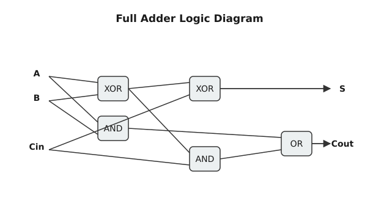

<preknowlist>
  <preknow m="number-theory" t="positional-systems">Позиційні системи числення</preknow>
  <preknow m="number-theory" t="twos-complement">Доповняльний код</preknow>
  <preknow m="logic-foundations" t="truth-tables">Таблиці істинності та логічні зв'язки</preknow>
</preknowlist>

# Арифметика в двійковій системі

> 🔧 **Навіщо це.** Усе, що робить ваш потужний багатоядерний процесор із мільярдами транзисторів — від рендерингу 3D-графіки до навчання нейромереж, — під капотом зводиться до елементарних операцій з нулями та одиницями. Розуміння того, як саме процесор додає, віднімає та множить ці біти на рівні логічних вентилів, знімає магію з роботи комп'ютера і показує його справжню, суворо логічну сутність.

Ми звикли додавати числа у десятковій системі, навіть не замислюючись про те, який саме алгоритм ми використовуємо. Ще в початковій школі нас навчили додавати «у стовпчик»: беремо крайні праві цифри, додаємо їх, і якщо сума стає більшою за 9, ми записуємо останню цифру результату, а десяток «переносимо» у наступний розряд. Комп'ютер не має уявлення про десятки. Його світ обмежений лише двома станами: є напруга (1) і немає напруги (0). Проте, сама математична суть позиційної системи дозволяє застосовувати абсолютно той самий алгоритм «у стовпчик», але з набагато простішими правилами. У цій статті ми розберемо алгоритми двійкової арифметики і подивимося, як саме вони перетворюються на реальні електронні схеми — суматори.

## Двійкове додавання: від таблиці множення до вентилів

У десятковій системі, щоб вміти додавати будь-які числа, ви мусите вивчити таблицю додавання від 0+0 до 9+9 (загалом 100 комбінацій). У двійковій системі таблиця додавання містить лише 4 рядки:

0 + 0 = 0
0 + 1 = 1
1 + 0 = 1
1 + 1 = 10 (двійкова двійка, тобто 0 записуємо, а 1 переносимо в наступний розряд)

Спробуймо додати два числа «у стовпчик». Візьмемо 13₁₀ (у двійковій 1101₂) та 11₁₀ (у двійковій 1011₂):

  1101
+ 1011
  ----

Починаємо з молодшого розряду (правого): 1 + 1 = 10. Записуємо 0, переносимо 1.
Наступний розряд: 0 + 1 + 1 (з переносу) = 10. Записуємо 0, переносимо 1.
Наступний: 1 + 0 + 1 (з переносу) = 10. Записуємо 0, переносимо 1.
Останній: 1 + 1 + 1 (з переносу) = 11. Записуємо 1, і переносимо 1 у новий розряд, створюючи п'ятий біт.
Отримуємо 11000₂. Якщо перевести це назад у десяткову систему: 16 + 8 = 24. А 13 + 11 справді дорівнює 24. Алгоритм працює бездоганно.

Але як навчити цьому комп'ютер? Комп'ютер не має очей, щоб дивитися на стовпчики. Він має лише логічні вентилі (логічні елементи), які приймають сигнали 0 та 1 на вході і видають результат на виході. 

### Напівсуматор (Half Adder)

Розглянемо найпростішу задачу: додавання двох однобітних чисел A та B. Результат такого додавання складається з двох частин: самої суми (S) та можливого переносу в наступний розряд (C_out, від англійського Carry).
Побудуємо таблицю істинності:

A | B | C_out | S
--|---|-------|---
0 | 0 |   0   | 0
0 | 1 |   0   | 1
1 | 0 |   0   | 1
1 | 1 |   1   | 0

Подивіться уважно на колонку S (сума). Вона дорівнює 1 лише тоді, коли A та B різні. Це в точності відповідає логічній операції виключне АБО (XOR, позначення ⊕). Отже, S = A XOR B.
Тепер погляньте на колонку C_out (перенос). Вона дорівнює 1 лише тоді, коли і A, і B дорівнюють 1. Це класична операція логічне І (AND, позначення ∧). Отже, C_out = A AND B.

Ось і все! Ми щойно спроектували електронну схему для додавання двох бітів. Нам потрібні лише два логічні вентилі: XOR та AND. Ця схема називається **напівсуматором** (Half Adder). Її називають «напів», оскільки вона вміє генерувати перенос, але не вміє *приймати* перенос із попереднього розряду (у неї лише два входи A і B, а входу для переносу немає). Для молодшого розряду (крайнього правого) напівсуматора достатньо, адже туди переносити нічого. Але для всіх інших розрядів нам потрібен повноцінний механізм.

### Повний суматор (Full Adder)

Для будь-якого розряду, окрім першого, ми повинні додавати вже три біти: біт A, біт B та біт вхідного переносу C_in. Результатом знову будуть сума S та вихідний перенос C_out.

Побудувати повний суматор дуже легко, якщо з'єднати разом два напівсуматори. Перший напівсуматор додає A та B, видаючи проміжну суму (S1) та проміжний перенос (C1). Другий напівсуматор додає цю проміжну суму S1 та вхідний перенос C_in, видаючи фінальну суму S та ще один проміжний перенос C2. Фінальний перенос C_out виникає, якщо хоча б один із напівсуматорів згенерував перенос (тобто C1 OR C2).

Математично це виглядає так:
S = A XOR B XOR C_in
C_out = (A AND B) OR (C_in AND (A XOR B))

Ось як ця схема виглядає графічно:

Маючи повний суматор, ми отримали універсальний будівельний блок. У ньому є три входи (A, B, C_in) і два виходи (S, C_out).

## Каскадування суматорів: Ripple-Carry Adder

Як тепер додати два 8-бітні числа? Найпростіше інженерне рішення — взяти вісім повних суматорів і з'єднати їх у ланцюжок. Вихід C_out нульового розряду підключається до входу C_in першого розряду, вихід C_out першого — до входу C_in другого, і так далі аж до старшого сьомого розряду. Вхід C_in найпершого (нульового) суматора просто підключається до нуля. 

Така схема називається **Ripple-Carry Adder** (суматор із наскрізним переносом). Слово «ripple» (хвиля, брижі) чудово описує фізичний процес у цій схемі. Коли ми подаємо напругу на входи 8-бітних чисел A та B, логічні вентилі не спрацьовують миттєво. Кожен транзистор має мікроскопічну, але реальну фізичну затримку перемикання. 

Молодший суматор обчислює свою суму і перенос відносно швидко. Але перший суматор не може видати правильний результат, поки не отримає достовірний сигнал C_in від нульового. Другий суматор чекає на перший, третій на другий, і так далі. Перенос немов хвиля прокочується від молодшого розряду до старшого. У 32-розрядному або 64-розрядному процесорі така затримка є критичною і обмежує максимальну тактову частоту процесора.

Для вирішення цієї проблеми інженери розробили **[Прискорені суматори](book:math/parallel-prefix-addition) Adder** (суматор із прискореним переносом). У ньому використовується складна комбінаторна логіка, яка на основі всіх вхідних бітів A і B паралельно передбачає, яким буде перенос для кожного розряду, не чекаючи, поки хвиля дійде фізично. Це вимагає значно більше транзисторів, але робить обчислення блискавичними.

## Віднімання: Магія доповняльного коду

Ми розібралися з додаванням. А як комп'ютер віднімає числа? Відповідь вражає своєю інженерною простотою: процесор взагалі не має окремої електронної схеми для віднімання. Віднімання A − B реалізується як додавання A + (−B). 

І тут на сцену виходить доповняльний код (Two's Complement). Щоб отримати від'ємне число −B у доповняльному коді, потрібно інвертувати всі біти числа B (замінити 1 на 0 і 0 на 1) та додати до результату одиницю.

Подивіться, як геніально процесор робить це, використовуючи той самий Ripple-Carry Adder!
Щоб виконати інструкцію віднімання (SUB), процесор пропускає операнд B через логічні вентилі NOT, які інвертують кожен біт. А як додати ту саму обов'язкову одиницю з алгоритму доповняльного коду? Згадайте вхід C_in самого першого (молодшого) суматора, який ми раніше підключали до нуля. Процесор просто подає туди логічну 1! 

Один і той самий ланцюжок суматорів працює і для інструкції ADD (де B проходить без змін, а на C_in нульового розряду подається 0), і для інструкції SUB (де B інвертується, а на C_in подається 1). Це тріумф мінімалізму та оптимізації.

## Прапорці стану: Carry, Zero, Negative, Overflow

Апаратний суматор, крім самого результату (суми), завжди генерує набір метаданих про цю операцію. Ці метадані зберігаються у спеціальному регістрі процесора, який називається регістром прапорців (Flags Register). Найважливіші з них — це чотири прапорці: C (Carry), Z (Zero), N (Negative) та V (Overflow). 

Вони є основою для інструкцій умовного переходу (if-else) у програмуванні. Наприклад, щоб порівняти два числа (чи A дорівнює B), процесор виконує невидиме віднімання A − B, результат ігнорує, але дивиться на прапорець Zero. Якщо Z = 1 (результат віднімання нуль), значить числа рівні, і програма стрибає на відповідну гілку.

Давайте розберемо прапорці детальніше.

**1. Zero (Z) — Нуль.** Встановлюється в 1, якщо всі біти результату дорівнюють 0. Реалізується схемотехнічно гігантським вентилем NOR, до якого підключені всі лінії результату.

**2. Negative (N) — Від'ємне число.** Встановлюється в 1, якщо старший біт результату дорівнює 1. Оскільки в знаковому форматі старший біт завжди позначає знак, цей прапорець показує, що результат менший за нуль.

**3. Carry (C) — Перенос.** Встановлюється в 1, якщо відбувся перенос із найстаршого розряду суматора. Для 8-бітного числа це означає, що при додаванні утворився 9-й біт. Прапорець C вказує на беззнакове переповнення. Якщо ви додаєте беззнакові змінні 255 + 2, результат не влізе у 8 біт. Суматор видасть 1, але встановить C = 1, сигналізуючи, що ви втратили дані. При відніманні C діє як прапорець «позики» (Borrow) — він вказує, що ви намагалися відняти більше беззнакове число від меншого.

**4. Overflow (V) — Переповнення.** Це найхитріший прапорець. На відміну від Carry, який обслуговує беззнакову арифметику, Overflow вказує на переповнення знакового діапазону. 
Уявіть, що ви працюєте зі знаковими 8-бітними числами, діапазон яких від −128 до 127. 
Ви додаєте 127 + 1. У двійковій системі це 01111111₂ + 00000001₂ = 10000000₂.
Процесор виконав чесне додавання, ніякого виносу 9-го біту не відбулося (Carry = 0). Проте, результат 10000000₂ у знаковому форматі інтерпретується як −128. Ви додали два додатні числа і отримали від'ємне! Це логічна катастрофа знакового переповнення.
Щоб зловити це, логіка процесора порівнює знаки операндів. Overflow встановлюється в 1, якщо ми додаємо два числа з однаковим знаком, а результат отримує протилежний знак.

Важливо усвідомити: процесор не знає, які числа ви використовуєте — знакові (int) чи беззнакові (unsigned). Він просто виконує додавання і завжди чесно виставляє обидва прапорці C та V. Це справа компілятора — обрати, на який прапорець дивитися. Якщо ви написали `if (a > b)` для `unsigned int`, компілятор згенерує асемблерний код, що перевіряє прапорець C. Якщо для звичайного `int` — код перевірятиме прапорець V (точніше, комбінацію V та N).

## Множення та ділення

Додавання та віднімання робляться за один такт. З множенням усе складніше. Алгоритм двійкового множення «у стовпчик» виглядає точно так само, як і десятковий, але він набагато простіший, бо ми множимо лише на 0 або 1. Множення на 0 дає нуль. Множення на 1 дає копію першого числа.
Отже, двійкове множення зводиться до двох базових операцій:
1. Зсув першого числа вліво (відповідає переходу до наступного розряду «у стовпчику»).
2. Додавання, якщо поточний біт другого числа є одиницею.

Історично процесори не мали окремих схем (апаратних множників). Коли зустрічалася інструкція множення, мікрокод процесора просто запускав цикл: він перевіряв біти множника і виконував серію зсувів та додавань за допомогою того самого АЛУ. Тому множення займало в десятки разів більше тактів, ніж додавання.

Сьогодні сучасні процесори мають апаратні матричні множники (Array Multipliers або схеми типу Wallace Tree). Це велетенські масиви суматорів, розпаяні на кристалі так, що всі часткові добутки формуються паралельно і складаються у гігантському дереві за лічені такти (часто навіть за один такт для цілих чисел). Це коштує дуже дорого в плані площі кристала та енергоспоживання, але забезпечує неймовірну швидкість.

Ділення досі залишається найповільнішою базовою арифметичною операцією. Воно реалізується алгоритмічно, подібним до ділення «куточком»: послідовним відніманням дільника від діленого зі зсувом вправо. Апаратні дільники існують, але вони громіздкі, і ділення зазвичай вимагає кількох десятків тактів навіть на найсучасніших архітектурах. Тому програмісти-оптимізатори завжди намагаються замінити ділення на константу бітовими зсувами (якщо константа — ступінь двійки) або множенням на обернене значення.

Розуміння того, як ці операції виконуються апаратно, формує фундамент для написання високопродуктивного коду. Знаючи, що додавання та побітові операції є «безкоштовними», множення — швидким, а ділення — повільним, ви можете приймати правильні рішення при оптимізації алгоритмів, спираючись не на сліпу віру в компілятор, а на знання реальної кремнієвої фізики, що лежить в основі вашого комп'ютера.
