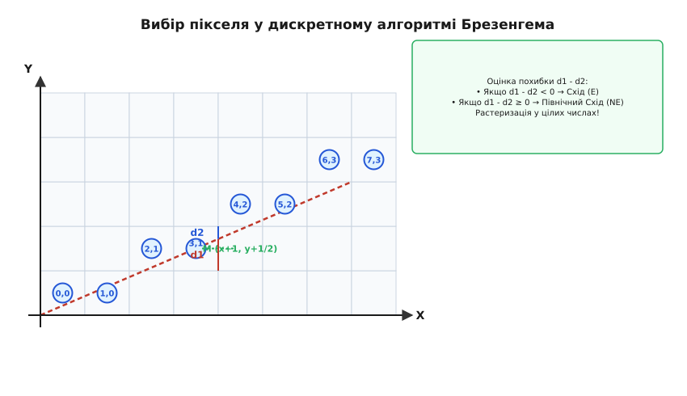
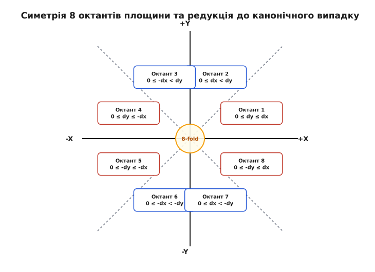
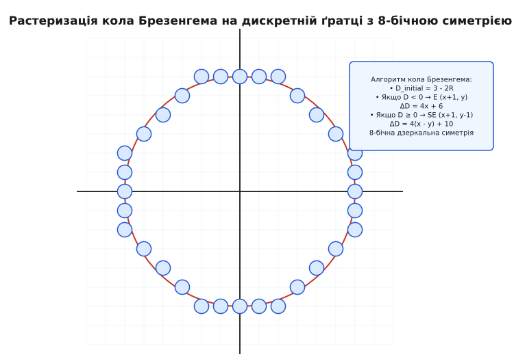

# Алгоритм Брезенгема

<preknowlist>
- [Тотожність Безу](topic:math/bezout-identity) — дискретні лінійні рівняння у цілих числах.
- [Алгоритм Евкліда](topic:math/gcd-euclidean) — характеристика сітки перетинів відрізка.
- [Лінійні діофантові рівняння](topic:math/linear-diophantine) — класичний апарат цілочисельних лінійних залежностей.
</preknowlist>

На графічному контролері з роздільною здатністю 1920×1080 пікселів малювання 1000 відрізків за допомогою класичного аналітичного рівняння прямої вимагає виконання понад двох мільйонів операцій ділення з плаваючою крапкою на кожну секунду кадру. У растрових дисплеях та графічних процесорах виконання дробового ділення для кожного пікселя призводить до затримок обробки та перевитрати енергії, змушуючи конвеєр візуалізації чекати на обчислення арифметичного блоку. Алгоритм Брезенгема усуває цю проблему за допомогою рекурентного параметра похибки, перетворюючи растеризацію на послідовність простих цілочисельних додавань та побітових зсувів.

> 🔧 **Навіщо це.** Алгоритм Брезенгема є фундаментом растрової графіки, дисплейних контролерів, векторних рендерерів (SVG, PDF), а також прошивок верстатів із числовим програмним керуванням (ЧПК / CNC) та 3D-принтерів. Він дає змогу синхронізувати рух кількох крокових двигунів та будувати графічні примітиви на найпростіших цілочисельних процесорах без використання дробової арифметики.

## 1. Проблема дискретизації неперервної прямої

Евклідова пряма є неперервним геометричним об'єктом, що складається з нескінченної множини точок. Екран монітора, графічний фреймбуфер або робочий стіл плотера являють собою дискретну двовимірну ґратку цілих чисел `ℤ²`. Кожен елемент цієї ґратки — піксель — має цілочисельні координати `(x, y)`.

Завдання растеризації полягає у виборі такої скінченної послідовності пікселів ґратки, яка найкращим чином апроксимує неперервний відрізок між початковою точкою `(x₁, y₁)` та кінцевою точкою `(x₂, y₂)`. 

Канонічне аналітичне рівняння прямої, що проходить через дві задані точки, має вигляд:

```
y(x) = y₁ + (dy / dx) · (x - x₁)
```

де `dx = x₂ - x₁` та `dy = y₂ - y₁`. Коефіцієнт нахилу `k = dy / dx` визначає тангенс кута нахилу прямої до осі `X`.

Найпростіший прямолінійний підхід до растеризації (так званий алгоритм цифрового диференціального аналізатора, DDA) полягає у послідовному збільшенні `x` на `1` та обчисленні дробової координати `y` за наведеною формулою з подальшим округленням `y_pixel = round(y)`. Тим не менш, цей підхід має три принципові недоліки:
1. Вимагає використання арифметики з плаваючою крапкою (floating-point) або фіксованою крапкою (fixed-point).
2. На кожному кроці виконує операцію множення на дробовий коефіцієнт `k` та округлення до найближчого цілого.
3. Помилки округлення з часом можуть накопичуватися, призводячи до відхилення кінцевої точки від заданих координат на межі відрізка.

Навіть якщо реалізувати DDA з використанням чисел із фіксованою крапкою (fixed-point arithmetic, наприклад, 16 біт на цілу частину та 16 біт на дробову), на кожній ітерації циклу виконується додавання дробового кроку та операція побітового зсуву для виділення цілої частини. У 1960-х роках, коли обчислювальна техніка не мала швидких арифметичних блоків, це створювало значне навантаження на процесор.

Алгоритм Брезенгема розв'язує задачу растеризації строго цілочисельним способом, переносячи аналіз відхилення у область лінійних діофантових співвідношень. Він усуває операцію ділення з внутрішнього циклу, залишаючи лише додавання та порівняння знака з нулем. Детальніше про історичні обставини розробки цього методу у компанії IBM ви можете прочитати у матеріалі [📜 Історія створення алгоритму Брезенгема](topic:math/bresenham-algorithm/hist-bresenham.md).

## 2. Математичний механізм та параметр похибки

Розглянемо канонічний випадок, коли відрізок лежить у першому октанті площини. Це означає, що кут нахилу прямої перебуває в межах від 0° до 45°:

```
0 ≤ dy ≤ dx
```

У цьому октанті при русі від початкової точки `(x₁, y₁)` до кінцевої `(x₂, y₂)` координата `x` збільшується на `1` на кожному кроці. Оскільки нахил `k ∈ [0, 1]`, координата `y` на кожному кроці може або залишитися незмінною, або збільшитися на `1`.

Нехай на кроці `k` ми вибрали піксель із координатами `(x_k, y_k)`. На наступному кроці `x_{k+1} = x_k + 1` алгоритм має вибрати один із двох сусідніх пікселів-кандидатів:
- Східний піксель **E** (East): `(x_k + 1, y_k)`
- Північно-Східний піксель **NE** (North-East): `(x_k + 1, y_k + 1)`


*Оцінка вертикального відхилення від ідеальної неперервної прямої та дискретний вибір між двома сусідніми пікселями ґратки.*

Щоб визначити, який із двох пікселів лежить ближче до ідеальної прямої, оцінимо вертикальні відстані `d₁` та `d₂`:
- `d₁` — відстань від нижнього кандидату `y_k` до точної прямої `y(x_k + 1)`.
- `d₂` — відстань від точної прямої `y(x_k + 1)` до верхнього кандидату `y_k + 1`.

Точне значення неперервної прямої при `x = x_k + 1` дорівнює:

```
y_exact = (dy / dx) · (x_k + 1 - x₁) + y₁
```

Тоді відстані обчислюються як:

```
d₁ = y_exact - y_k = (dy / dx) · (x_k + 1 - x₁) + y₁ - y_k
d₂ = (y_k + 1) - y_exact = y_k + 1 - (dy / dx) · (x_k + 1 - x₁) - y₁
```

Різниця цих відстаней `d₁ - d₂` показує взаємне розташування прямої та середньої точки `M = (x_k + 1, y_k + 1/2)`:

```
d₁ - d₂ = 2 · (dy / dx) · (x_k + 1 - x₁) - 2 · (y_k - y₁) - 1
```

- Якщо `d₁ - d₂ < 0`, то пряма перетинає вертикаль нижче середньої точки `M`, отже ближчим є піксель **E** (`y_{k+1} = y_k`).
- Якщо `d₁ - d₂ ≥ 0`, то пряма перетинає вертикаль вище або через середню точку `M`, отже ближчим є піксель **NE** (`y_{k+1} = y_k + 1`).

Щоб усунути дробовий знаменник `dx`, помножимо вираз `d₁ - d₂` на `dx > 0`. Отриману величину позначимо як цілочисельний параметр рішення `D_k`:

```
D_k = dx · (d₁ - d₂)
    = 2 · dy · (x_k - x₁) - 2 · dx · (y_k - y₁) + 2 · dy - dx
```

Знак параметра `D_k` строго збігається зі знаком `d₁ - d₂`. 

Обчислимо початкове значення `D₀` у початковій точці `(x₁, y₁)` при `k = 0`:

```
D₀ = 2 · dy - dx
```

Знайдемо зміну параметра `D` при переході від кроку `k` до кроку `k + 1`:

```
D_{k+1} - D_k = 2 · dy - 2 · dx · (y_{k+1} - y_k)
```

Отже, правило покрокового оновлення параметра рішення має вигляд:
1. Якщо `D_k < 0`: обираємо піксель **E** (`y_{k+1} = y_k`). 
   Приріст параметра: `D_{k+1} = D_k + 2 · dy`.
2. Якщо `D_k ≥ 0`: обираємо піксель **NE** (`y_{k+1} = y_k + 1`). 
   Приріст параметра: `D_{k+1} = D_k + 2 · dy - 2 · dx`.

Усі коефіцієнти `2 · dy` та `2 · dy - 2 · dx` є цілочисельними константами, які обчислюються один раз перед початком циклу. Докладний алгебраїчний вивід та доведення оптимальності викладено у вставці [🧮 Математика дискретної апроксимації та рівнянь Брезенгема](topic:math/bresenham-algorithm/math-diophantine-rasterization.md).

## 3. Редукція 8 октантів площини та універсальний алгоритм

Канонічний розрахунок Брезенгема виведений для першого октанта (`0 ≤ dy ≤ dx`). Однак у загальному випадку відрізок на площині може мати довільний напрямок. Двовимірний декартовий простір ділиться на 8 октантів залежно від співвідношення та знаків `dx` і `dy`.


*Розбиття декартової площини на 8 октантів та їх зведення до першого октанта через перестановку координат та відображення знаків.*

Для поширення алгоритму на всі 8 октантів використовуються три базові геометричні трансформації:

1. **Напрямок кроку по осях:** 
   Обчислюються знакові кроки `sx = sign(x₂ - x₁)` та `sy = sign(y₂ - y₁)`, які можуть набувати значень `+1` або `-1`. На кожному кроці координати змінюються додаванням `sx` та `sy`.

2. **Обмін осей для крутих ліній:** 
   Якщо `|dy| > |dx|`, кут нахилу відрізка відносно осі `X` перевищує 45° (лінія є крутою). У цьому випадку координата `y` зростає швидше за `x`. Для редукції до канонічного випадку ролі `dx` та `dy` міняються місцями (`swap(dx, dy)`), а провідною віссю циклу стає `Y`.

3. **Універсальний цілочисельний цикл:** 
   Після редукції початковий параметр рішення дорівнює `D₀ = 2 · dy - dx`. На кожній ітерації алгоритм зміщується уздовж провідної осі на 1 крок, а при `D_k ≥ 0` виконує додатковий крок уздовж веденої осі та віднімає `2 · dx`.

Узагальнена таблиця умов редукції для всіх 8 октантів:

| Октант | Діапазон кутів | Співвідношення `dx, dy` | Знак `sx` | Знак `sy` | Провідна вісь | Обмін осей (`swap`) |
|---|---|---|---|---|---|---|
| **1** | 0° … 45° | `0 ≤ dy ≤ dx` | `+1` | `+1` | X | Ні |
| **2** | 45° … 90° | `0 ≤ dx < dy` | `+1` | `+1` | Y | Так |
| **3** | 90° … 135° | `0 ≤ -dx < dy` | `-1` | `+1` | Y | Так |
| **4** | 135° … 180° | `0 ≤ dy ≤ -dx` | `-1` | `+1` | X | Ні |
| **5** | 180° … 225° | `0 ≤ -dy ≤ -dx` | `-1` | `-1` | X | Ні |
| **6** | 225° … 270° | `0 ≤ -dx < -dy` | `-1` | `-1` | Y | Так |
| **7** | 270° … 315° | `0 ≤ dx < -dy` | `+1` | `-1` | Y | Так |
| **8** | 315° … 360° | `0 ≤ -dy ≤ dx` | `+1` | `-1` | X | Ні |

Усі 8 октантів обробляються єдиним кодом без виклику дробових функцій чи розгалужень усередині основного циклу. Практичну реалізацію цього механізму C та C++ наведено у вставці [⚙️ Реалізація растеризатора відрізків і кіл](topic:math/bresenham-algorithm/proj-bresenham-rasterizer.md).

## 4. Алгоритм Брезенгема для кіл та конічних перетинів

Алгоритм Брезенгема можна застосовувати не лише до лінійних відрізків, але й до кривих другого порядку — кіл, еліпсів та гіпербол.

Розглянемо неявне рівняння кола з радіусом `R` і центром у початку координат `(0, 0)`:

```
F(x, y) = x² + y² - R² = 0
```

Для будь-якої точки площини значення `F(x, y)` визначає її розташування відносно кола:
- `F(x, y) < 0` — точка лежить усередині кола.
- `F(x, y) = 0` — точка лежить строго на колі.
- `F(x, y) > 0` — точка лежить зовні кола.


*Генерація дуги кола в одному октанті за допомогою параметра середньої точки та відображення на всі 8 октантів.*

Завдяки 8-бічній дзеркальній симетрії кола обчислення координат виконуються лише для одного октанта дуги — від `x = 0` до `x = y` (від 90° до 45°).

Починаючи з точки `(0, R)`, на кожному кроці `x` збільшується на `1`. Оскільки дуга кола в цьому октанті опускається вниз, координата `y` може залишитися незмінною (крок **E**) або зменшитися на `1` (крок **SE** / South-East).

Для прийняття рішення оцінюється значення функції `F(x, y)` у середній точці `M = (x_k + 1, y_k - 1/2)`:

```
D_k = F(x_k + 1, y_k - 1/2) = (x_k + 1)² + (y_k - 1/2)² - R²
```

- Якщо `D_k < 0`: середня точка лежить усередині кола, отже дуга проходить вище `M`. Обирається піксель **E** (`y_{k+1} = y_k`).
- Якщо `D_k ≥ 0`: середня точка лежить зовні кола, отже дуга проходить нижче `M`. Обирається піксель **SE** (`y_{k+1} = y_k - 1`).

Початкове значення параметра при `(0, R)` після округлення до цілих чисел дорівнює `D₀ = 3 - 2 · R`. 

Рекурентні прирости параметра рішення обчислюються так:
- При кроці **E**: `D_{k+1} = D_k + 4 · x_k + 6`.
- При кроці **SE**: `D_{k+1} = D_k + 4 · (x_k - y_k) + 10`.

Оскільки `x` збільшується на кожному кроці, прирости `ΔD` самі змінюються за лінійним законом, що робить алгоритм генерації кола надзвичайно швидким.

### Растеризація еліпсів

Для еліпса з напіввісями `a` та `b`, що описується рівнянням `F(x, y) = b² · x² + a² · y² - a² · b² = 0`, дуга першого квадранта ділиться на дві області залежно від абсолютного значення тангенса кута нахилу дотичної:
1. **Область 1 (верхня частина):** Похідна `|dy / dx| < 1`. Провідною віссю є `X`. На кожному кроці `x` збільшується на 1, а `y` може зменшитися на 1.
2. **Область 2 (нижня частина):** Похідна `|dy / dx| ≥ 1`. Провідною віссю стає `Y`. На кожному кроці `y` зменшується на 1, а `x` може збільшитися на 1.

Перехід між областями відбувається у точці, де дотична до еліпса має кут 45°, тобто де умова `2 · b² · x ≥ 2 · a² · y` стає істинною. Обидва етапи обчислюються цілочисельними параметрами похибки без виклику квадратних коренів або тригонометричних функцій.

## 5. Діофантова геометрія та властивості дискретних ліній

З точки зору вищої арифметики та теорії чисел, послідовність кроків алгоритму Брезенгема утворює об'єкт дискретної математики, відомий як слово Штурма (Sturmian word) або послідовність Бітті (Beatty sequence).

Розглянемо пряму з кутовим коефіцієнтом `θ = dy / dx`. Якщо `θ` є раціональним числом `dy / dx` із `gcd(dx, dy) = d`, то пряма перетинає точні цілочисельні вузли ґратки `ℤ²` точно `d + 1` разів. Між цими точними вузлами послідовність вибору напрямків утворює періодичний макро-шаблон.

Найкращі раціональні наближення до нахилу прямої дають підхідні дроби (continued fractions) ланцюгового дробу кутового коефіцієнта:

```
θ = [a₀; a₁, a₂, a₃, ...]
```

Кожна підхідна дріб `p_m / q_m` задає довжину періоду `q_m` дискретного шаблону Брезенгема, у якому виконується точно `p_m` діагональних зсувів.

Дискретна лінія Брезенгема має важливу геометричну властивість збалансованості (balance property): для будь-яких двох підсегментів однаково довжини в растровій лінії кількість діагональних кроків відрізняється щонайбільше на `1`. Це гарантує математично максимальну рівномірність розміщення пікселів та відсутність візуальних зламів (jaggies) на дискретній сітці.

## 6. Застосування в контролерах ЧПК та 3D-принтерах

Одним із найважливіших позаекранних застосувань алгоритму Брезенгема є керування багатоосьовими кроковими двигунами у верстатах із ЧПК (CNC) та 3D-принтерах (у прошивках Marlin, GRBL, Repetier, Klipper).

При переміщенні фрези або друкуючої голівки з точки `(x₁, y₁, z₁)` у точку `(x₂, y₂, z₂)` кожен кроковий двигун керується окремою цифровою лінією STEP. Щоб інструмент рухався строго уздовж прямолінійного відрізка у просторі, імпульси на двигуни різних осей повинні подаватися синхронно.

Вісь із найбільшим числом необхідних кроків `S_max = max(|Δx|, |Δy|, |Δz|)` обирається як провідна (ведома). Вона прив'язується до системного таймера мікроконтролера. Для решти осей створюються незалежні регістри похибки Брезенгема. На кожному такті переривання таймера провідна вісь робить один крок, а регістри похибки ведених осей оновлюються за правилом Брезенгема: при перевищенні порога подається імпульс кроку на відповідний двигун. Це забезпечує строго лінійну просторову інтерполяцію багатоосьового руху в реальному часі без виконання обчислень з плаваючою крапкою на 8-бітових або 32-бітових мікроконтролерах.

## 7. Субпіксельна растеризація та відсікання меж

У сучасних векторних рендерерах (наприклад, у графічних бібліотеках Cairo, Skia або у специфікаціях Direct2D та SVG) відрізки задаються з субпіксельною точністю. Координати точок передаються дробовими числами у форматі з фіксованою крапкою `16.16` або `24.8` (де 1 піксель ділиться на 256 субпіксельних сіток).

Алгоритм Брезенгема природно розширюється на субпіксельні сітки: координати точок помножуються на масштабуючий коефіцієнт `2^N`, а початкове значення похибки `D₀` враховує дробовий зсув початкової точки відносно найближчого цілого вузла піксельної сітки. Це дозволяє зберігати високу обчислювальну швидкість цілочисельного циклу Брезенгема при плавній анімації векторних об'єктів.

Перед запуском циклу Брезенгема відрізок повинен бути обрізаний (clipping) до меж видимої області екрана (видового вікна). Для цього застосовуються алгоритми Коена-Сазерленда або Ліанга-Барські. Виконання обрізання до растеризації запобігає спробам запису за межі масиву фреймбуфера та виключає зайві ітерації циклу для пікселів поза екраном.

## 8. Порівняння алгоритмів растеризації

Для вибору оптимального алгоритму в графічних системах порівняємо основні характеристики Брезенгема з іншими методами дискретизації:

| Алгоритм | Тип арифметики | Операції в циклі | Підтримка Anti-Aliasing | Гарантія точності |
|---|---|---|---|---|
| **DDA (Digital Differential Analyzer)** | Дробова (float / fixed-point) | Додавання, округлення | Ні | Накопичення похибки |
| **Брезенгем (Bresenham)** | Строго цілочисельна (`int`) | Додавання, порівняння знака, побітовий зсув | Ні (бінарна растеризація) | Точна цілочисельна |
| **Алгоритм Ву (Xiaolin Wu)** | Дробова (fixed-point `16.16`) | Додавання, множення інтенсивності | Так (згладжування півтонами) | Висока візуальна якість |
| **Midpoint Conic (Піттуей)** | Цілочисельна (`int`) | Додавання, зсув | Ні | Точна для 2-го порядку |

Алгоритм Брезенгема залишається абсолютним лідером за швидкістю та мінімальними вимогами до апаратних ресурсів там, де потрібне чітке бінарне викреслювання ліній без згладжування напівтонами.
