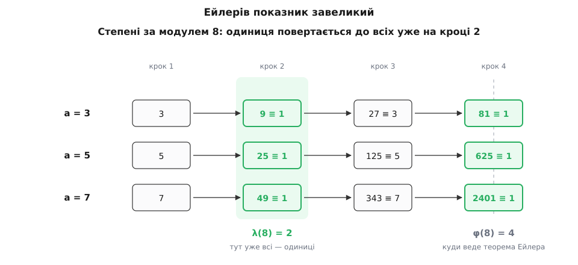
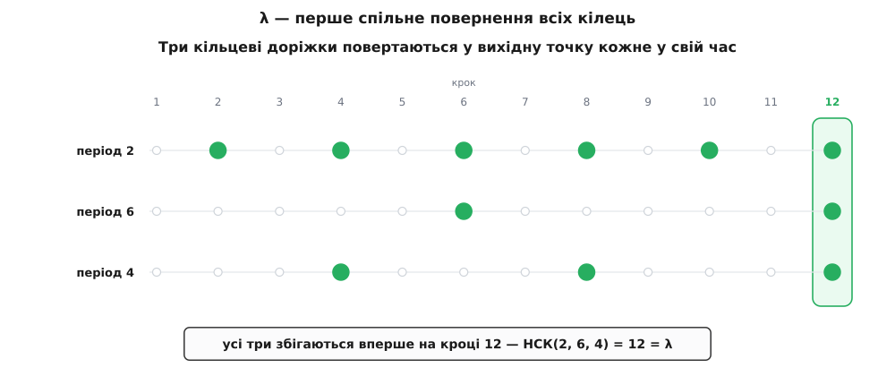
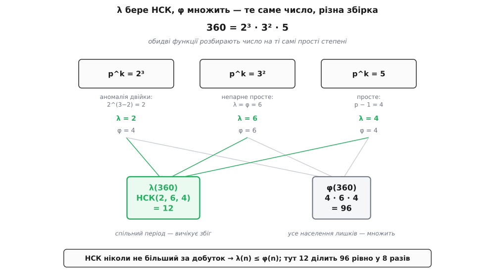

# Функція Кармайкла λ(n)

<preknowlist>
- [Модульна арифметика](topic:math/modular-arithmetic) — запис a ≡ b (mod m), класи лишків, вільне додавання й множення за модулем.
- [НСД і алгоритм Евкліда](topic:math/gcd-euclidean) — найбільший спільний дільник і що таке «взаємно прості» (НСД = 1).
- [Функція Ейлера і теорема Ейлера](topic:math/euler-totient) — φ(n) як кількість взаємно простих лишків і рівність a^φ(n) ≡ 1 (mod n) за взаємної простоти.
- [Мультиплікативний порядок](topic:math/multiplicative-order) — найменший показник, за якого один-єдиний a повертається до одиниці.
- [НСК — найменше спільне кратне](topic:math/lcm) — найменше число, кратне кільком заданим водночас.
- [Прості числа](topic:math/prime-numbers) — розклад числа на прості множники, єдиний для кожного.
</preknowlist>

Теорема Ейлера обіцяє, що a^φ(n) ≡ 1 (mod n) для кожного a, взаємно простого з n. Візьмімо модуль 8. Тут φ(8) = 4, тож Ейлер ручається: 3⁴ ≡ 1 (mod 8). І це правда — але щось тут забагато. Порахуймо коротше:

```
3² = 9   ≡ 1   (mod 8)
5² = 25  ≡ 1   (mod 8)
7² = 49  ≡ 1   (mod 8)
```

Одиниця повертається вже на **квадраті**, і не в одного щасливчика, а в усіх непарних чисел одразу. Ейлерів показник 4 удвічі більший, ніж треба: другого степеня досить, щоб кожне взаємно просте з вісімкою число стало одиницею. Виходить, φ(n) — це показник, який **годиться завжди**, та далеко не завжди **найменший**. А раз він не найменший, напрошується питання: який же найменший? Чи є в кожного модуля своє єдине число — таке, що вже його степінь повертає до одиниці всіх водночас, і меншого такого числа немає? Є. Це найменше універсальне число 1910 року ввів американський математик Роберт Кармайкл, а привело його туди [чисте питання про остачі степенів, без жодного застосування на видноті](topic:math/carmichael-function/hist-carmichael.md).

## Найменший універсальний показник

Спочатку розділімо два різні питання, які легко сплутати.

Перше — про одне-єдине число. Скільки разів треба помножити трійку саму на себе за модулем 8, щоб дістати одиницю? Відповідь — [мультиплікативний порядок](topic:math/multiplicative-order) трійки: найменший показник, за якого саме **ця** основа замикає своє кільце степенів. Для трійки за модулем 8 це 2. Порядок — величина особиста: у кожного a свій.

Друге питання — про всіх разом. Чи є показник m, який повертає до одиниці **кожне** взаємно просте з n число одночасно? Теорема Ейлера каже: так, φ(n) годиться. Але ми щойно бачили, що для восьмірки годиться й менше число — двійка. Отже універсальних показників багато, і серед них є найменший.

**Функція Кармайкла** λ(n) — це найменший додатний показник m, за якого a^m ≡ 1 (mod n) одночасно для всіх a, взаємно простих з n. Її ще звуть зведеною функцією тотієнта або найменшим універсальним показником — і друга назва каже все.

```
λ(8)  = 2      бо a² ≡ 1 для всіх непарних a, а меншого спільного показника немає
φ(8)  = 4      Ейлерів показник — теж годиться, але не найменший
```

Різниця між λ і порядком — у слові «всіх»: порядок обслуговує одну основу, λ мусить догодити всім заразом. Різниця між λ і φ — у слові «найменший»: φ гарантовано працює, λ працює й не має куди зменшитися. І одразу видно перший зв'язок між ними. Кожен універсальний показник у тому числі повертає до одиниці й окрему основу — тож він кратний її порядку. Отже λ(n) кратне порядкові кожного a. А φ(n) — теж універсальний показник, значить теж кратний усім порядкам. Обидва — спільні кратні тих самих порядків, тільки λ найменше з них. Тому **λ(n) завжди ділить φ(n)**. Ейлерів показник — це λ, помножене на щось ціле; іноді на одиницю, а іноді, як для восьмірки, на двійку чи й більше.


*Кожне з трьох непарних чисел 3, 5, 7 за модулем 8 повертається до одиниці вже на другому степені. Спільний момент повернення — двійка, і це λ(8). Ейлерова стрілка дотягується до четвірки: показник, що працює, але вдвічі задовгий. Уся економія λ супроти φ — в оцьому зазорі.*

## λ — це коли всі кільця повертаються водночас

Тепер перетворімо означення на щось, що можна порахувати. Ключ — у зв'язку з порядком, який щойно намітився.

Кожна взаємно проста з n основа a крутиться по своєму кільцю степенів завдовжки ord(a) — свій період, своя довжина. Показник m повертає a до одиниці тоді й лише тоді, коли m кратне ord(a): пройшовши ціле число повних обертів, ми знову опиняємося на старті. Щоб один-єдиний показник m повернув до одиниці **всіх**, він мусить бути кратним порядкові кожного з них воднораз. Найменше число, кратне кільком заданим одночасно, — це [їхнє найменше спільне кратне](topic:math/lcm). Звідси головна формула, ще до всякого розкладу на прості:

```
λ(n) = НСК( ord(a) )   по всіх a, взаємно простих з n
```

Ось інтуїція, за яку варто вхопитися. Уявіть кілька коліщат різного розміру, що обертаються разом: одне робить повний оберт за 2 кроки, друге за 6, третє за 4. Кожне раз у раз повертається у вихідну позначку, але **всі разом** у стартовому положенні опиняться аж тоді, коли мине число кроків, кратне всім трьом періодам одночасно, — тобто НСК(2, 6, 4) = 12. λ(n) — це і є той момент, коли весь набір кілець степенів клацає у вихідне положення заразом. Не окремий період якогось одного коліщата, а перше спільне повернення всіх.


*Три доріжки — періоди 2, 6 і 4. Зелена позначка стоїть там, де це кільце повернулося у вихідну точку: кожні 2 кроки, кожні 6, кожні 4. Усі три позначки збігаються вперше на кроці 12 — раніше бодай одне кільце ще не на місці. Це НСК(2, 6, 4) = 12, і є λ: найменший показник, за якого одиниця повертається до всіх кілець водночас.*

Зі зв'язку λ = НСК(порядків) той самий висновок λ(n) | φ(n) виходить іще прозоріше. Порядок кожного елемента ділить φ(n) — це [теорема Лагранжа для групи взаємно простих лишків](topic:math/group-theory): величина кільця мусить укладатися в повний набір без остачі. А НСК чисел, кожне з яких ділить φ(n), саме ділить φ(n). Отже λ, зібране з подільників φ, лишається подільником φ.

Але формула через НСК порядків має ваду: щоб нею скористатися, треба знати всі порядки, а їх ще перебери. Потрібен спосіб дістати λ(n) прямо з n. І він є — рівно тому, що взаємно прості лишки складаються з незалежних шматків.

## Формула Кармайкла

Розклад n на прості множники, n = p₁^k₁ · p₂^k₂ · … · p_r^k_r, розтинає всю задачу на незалежні куски. Причина — [китайська теорема про залишки](topic:math/chinese-remainder-theorem): за взаємно простих модулів кожне число однозначно задається набором своїх остач за кожним p^k окремо, і арифметика в кожній координаті йде сама по собі, не заважаючи іншим. Тому рівність a^m ≡ 1 (mod n) розпадається на систему незалежних вимог — a^m ≡ 1 за кожним модулем p^k нарізно:

```
a^m ≡ 1 (mod n)   ⟺   a^m ≡ 1 (mod p₁^k₁)  і  …  і  a^m ≡ 1 (mod p_r^k_r)
```

Показник m годиться для всього n тоді й лише тоді, коли годиться для кожного простого степеня зокрема. А найменший показник, що вдовольняє всі умови одразу, — це знову НСК найменших показників для кожної умови. Тобто λ від складеного числа збирається НСК-ом із λ від його простих степенів:

```
λ(n) = НСК( λ(p₁^k₁), λ(p₂^k₂), …, λ(p_r^k_r) )
```

Лишилося з'ясувати λ для одного простого степеня p^k. Тут дві історії — для непарного простого й для двійки, — і друга приховує єдину несподіванку в усій темі.

**Непарне просте.** Коли p непарне, взаємно прості лишки за модулем p^k мають [первісний корінь](topic:math/primitive-root) — одну основу, степені якої пробігають геть усі φ(p^k) взаємно простих лишків, перш ніж замкнутися. Її порядок дорівнює цілому φ(p^k), а НСК набору, у якому вже є число φ(p^k), не може бути меншим за нього. Отже для непарного p універсальний показник збігається з Ейлеровим:

```
λ(p^k) = φ(p^k) = p^(k−1)·(p − 1)

λ(7)   = 6           λ(9) = φ(9) = 6           λ(27) = φ(27) = 18
```

**Аномалія двійки.** А от степені двійки, починаючи з восьмірки, ламають цей лад. За модулем 8 первісного кореня немає: жодне число не породжує своїми степенями всіх чотирьох взаємно простих лишків 1, 3, 5, 7 — бо, як ми вже бачили, кожен із них замикається вже на квадраті. Максимальне кільце тут завдовжки 2, а не 4. Тому:

```
λ(2)   = 1
λ(4)   = 2
λ(2^k) = 2^(k−2)     для k ≥ 3       (а φ(2^k) = 2^(k−1) — удвічі більше)

λ(8)   = 2           λ(16) = 4        λ(32) = 8
```

Звідки береться саме половина? Річ у кількості квадратних коренів з одиниці. У кільці, породженому одним елементом, рівняння x² ≡ 1 має рівно два розв'язки — це ±1, більше нема звідки взятися. А за модулем 2^k при k ≥ 3 таких розв'язків **чотири**: крім ±1, одиницю у квадраті дають ще 2^(k−1) − 1 і 2^(k−1) + 1. За модулем 8 це вся четвірка 1, 7, 3, 5. Чотири квадратні корені з одиниці там, де в циклічному кільці їх лише два, — це доказ, що одним елементом усіх лишків не породити. Група взаємно простих лишків за модулем 2^k розпадається надвоє, і найдовше кільце в ній має довжину 2^(k−2), а не 2^(k−1). Саме тому в формулі для двійки з'являється зайва двійка в знаменнику. Докладне виведення — і чому коренів рівно чотири, і як група розкладається на два незалежні кільця — зібране в [повній математиці λ(n)](topic:math/carmichael-function/math-lambda-derivation.md).


*Те саме число 360 = 2³·3²·5 обидві функції розбирають на однакові шматки, але складають по-різному. φ **множить** внески (4·6·4 = 96), бо рахує, скільки взагалі є взаємно простих лишків. λ бере НСК (НСК(2, 6, 4) = 12), бо шукає спільний період — а спільний період не додає обертів, а вичікує збіг. НСК ніколи не перевищує добутку, тому λ(n) ≤ φ(n), і часто набагато менше.*

Ось тепер видно й обіцяну строгість: λ не просто верхня межа, а показник, який реально досягається одним елементом. Китайська теорема дозволяє скласти число, що в кожній координаті p^k стоїть максимально довгим кільцем — первісним коренем для непарних простих, елементом порядку 2^(k−2) для двійки. Порядок такого складеного числа дорівнює НСК цих максимальних довжин, тобто рівно λ(n). Отже завжди існує основа, кільце якої має довжину точно λ(n): менший показник її вже не поверне до одиниці. Це й робить λ **найменшим** універсальним показником, а не просто одним із придатних.

## Порахувати λ(n)

Формула прямо перекладається на обчислення: розклади n на прості, візьми λ від кожного простого степеня, склади НСК-ом.

**Порахувати λ(360).**

```
360 = 2³ · 3² · 5           розклад на прості

λ(2³) = 2^(3−2) = 2         аномалія двійки: показник, а не 2² = 4
λ(3²) = 3·(3 − 1) = 6       непарне просте: збігається з φ(9)
λ(5)  = 5 − 1 = 4           просте: p − 1

λ(360) = НСК(2, 6, 4) = 12
```

Перевірка з іншого боку: φ(360) = 96, і 12 справді ділить 96 (96 = 12·8). Тобто Ейлерів показник тут увосьмеро довший за потрібний — a^12 ≡ 1 (mod 360) уже для кожного взаємно простого з 360 числа, тоді як теорема Ейлера велить дертися аж до 96-го степеня.

У коді λ читається так само коротко, як і думається:

```py
from math import gcd

def lcm(a: int, b: int) -> int:
    return a // gcd(a, b) * b

def carmichael_lambda(n: int) -> int:
    """λ(n) = НСК по простих степенях p^k у розкладі n; для 2^k при k≥3 — 2^(k-2)."""
    result, m, p = 1, n, 2
    while p * p <= m:
        if m % p == 0:
            k = 0
            while m % p == 0:              # витягуємо весь степінь p^k
                m //= p
                k += 1
            if p == 2 and k >= 3:
                lam = 1 << (k - 2)         # аномалія: 2^(k-2), а не 2^(k-1)
            elif p == 2 and k == 2:
                lam = 2
            elif p == 2:
                lam = 1
            else:
                lam = (p - 1) * p**(k - 1)  # непарне просте: φ(p^k)
            result = lcm(result, lam)
        p += 1
    if m > 1:                             # лишився один великий простий дільник p^1
        result = lcm(result, m - 1)
    return result

assert carmichael_lambda(8)   == 2
assert carmichael_lambda(360) == 12
assert carmichael_lambda(561) == 80       # знадобиться нижче
assert carmichael_lambda(7)   == 6        # для простого збігається з p − 1
```

> 🔧 **Навіщо це.** Коли показник степеня за модулем зводять до меншого — а це роблять у кожному швидкому піднесенні до степеня за модулем, — його законно зводити не за φ(n), а за λ(n): правило a^e ≡ a^(e mod λ(n)) (mod n) тримається за взаємної простоти так само, як з φ, але λ буває в рази менше. Для криптографічних модулів це означає коротший показник і відчутно менше множень. Менший показник — не косметика, а прямий виграш у швидкості кожної операції.

Робочий інструмент — не лише сама λ, а й пошук основи, кільце якої має повну довжину λ(n) (свідка того, що менший показник не годиться), та обчислення на λ замість φ у реальній схемі — зібрано в [коді навколо λ(n)](topic:math/carmichael-function/proj-lambda.md).

## Коли Ейлерів показник таки найточніший

λ(n) ділить φ(n), тож рівність λ(n) = φ(n) — це той щасливий випадок, коли Ейлерів показник уже неможливо вкоротити. З формули видно, коли саме так стається. НСК шматків дорівнює їхньому добутку рівно тоді, коли шматки не мають спільних дільників і коли шматок узагалі один, — а внески λ(p^k) майже завжди парні (у них сидить p − 1 для непарного p), тож двоє й більше непарних простих одразу дадуть спільну двійку, і НСК просяде нижче добутку.

Прискіпливий розбір цієї умови дає точну відповідь: λ(n) = φ(n) тоді й лише тоді, коли за модулем n існує [первісний корінь](topic:math/primitive-root) — одна основа, що породжує всі взаємно прості лишки. А такі модулі відомі поіменно:

```
λ(n) = φ(n)   ⟺   n ∈ { 1, 2, 4, p^k, 2·p^k }      (p — непарне просте)
```

Тобто повне кільце — виняток, а не правило: щойно в числі зустрічаються два різні непарні прості або старший степінь двійки, Ейлерів показник стає завеликим, і різницю між ним і справжнім λ можна забирати задарма. Первісні корені, будова групи взаємно простих лишків і доведення цього переліку — окрема тема; тут досить того, що поза цим коротким списком λ(n) < φ(n) майже завжди.

## RSA живе на λ, а не на φ

Найпомітніше застосування — там, де Ейлерів показник традиційно й малюють. У [RSA](topic:algorithms/rsa) беруть два прості p і q, їхній добуток n = p·q, показник e і таємний показник d, дібраний так, щоб піднесення до d скасовувало піднесення до e. У класичному викладі d шукають як [обернений до e](topic:math/modular-inverse) за модулем φ(n) = (p − 1)(q − 1). Але сучасні реалізації — і стандарт PKCS #1 серед них — беруть d за модулем **λ(n)**, де

```
λ(n) = λ(p·q) = НСК( p − 1, q − 1 )
```

замість добутку (p − 1)(q − 1). Причин дві, і обидві практичні. Перша — швидкість: λ(n) ділить φ(n) і зазвичай помітно менше, тож і d виходить меншим, а коротший таємний показник — це менше множень у кожному розшифруванні й кожному підписі. Друга тонша й гарніша. Класичне доведення коректності через теорему Ейлера кульгає на повідомленнях, що не взаємно прості з n (діляться на p чи q), — до них теорема Ейлера просто не застосовна, і випадок доводиться латати окремо. З λ цієї діри немає взагалі. Для n = p·q рівність m^(1 + t·λ(n)) ≡ m (mod n) справджується для **будь-якого** m, взаємно простого чи ні: за модулем p або m ≡ 0 (і тоді обидва боки нулі), або m^(p−1) ≡ 1, а (p − 1) ділить λ(n), тож зайвий доважок до показника стирається; так само за модулем q; китайська теорема зшиває обидві остачі в рівність за модулем n. Показник, який Кармайкл увів із чистого інтересу до остач степенів, виявився саме тим модулем, за яким RSA працює без винятків.

## Числа Кармайкла: коли λ(n) ділить n − 1

Є ще одне місце, де λ(n) визначає геть усе, — і воно ж джерело плутанини, бо ім'я Кармайкла носять два різні предмети.

[Мала теорема Ферма](topic:math/fermat-little-theorem) дає простий тест на простоту: якщо n просте, то a^(n−1) ≡ 1 (mod n) для кожного a, що не ділиться на n. Візьми навмання основу a, піднеси до (n − 1)-го степеня за модулем n; вийшло не 1 — число напевно складене. Спокуса очевидна: а якщо вийшла 1 для кількох різних a, то, може, число просте? Пастка теж очевидна, щойно згадати про λ. Умова «a^(n−1) ≡ 1 для всіх a, взаємно простих з n» — це рівно вимога, щоб (n − 1) був універсальним показником, тобто щоб **λ(n) ділило n − 1**. А це може статися й для складеного n.

**Числа Кармайкла** — це складені числа n, для яких λ(n) ділить n − 1. Кожне взаємно просте з таким n число проходить Фермів тест на всіх основах одразу, хоча n складене, — тест обдурено остаточно. Найменше таке число — 561:

```
561 = 3 · 11 · 17          складене, але без квадратів у розкладі

λ(561) = НСК(2, 10, 16) = 80
n − 1  = 560 = 80 · 7      λ(561) ділить 560

→ a^560 ≡ 1 (mod 561) для кожного a, взаємно простого з 561
```

Умова λ(n) | (n − 1) для чисел без квадратних множників розгортається в простий критерій (його 1899 року дав Альвін Корзельт, а перший приклад — саме 561 — навів Кармайкл 1910-го): (p − 1) мусить ділити (n − 1) для кожного простого дільника p числа n. Для 561 це видно очима: 2, 10 і 16 усі ділять 560. Повний розбір цих чисел — критерій, чому їх без квадратів, чому їх нескінченно багато й що вони роблять із перевіркою простоти — в окремій темі [числа Кармайкла](topic:math/carmichael-numbers).

Тут важливе застереження щодо назв. Функція Кармайкла λ(n) і числа Кармайкла — не те саме, дарма що названі на честь однієї людини. Перше — функція, що дає найменший універсальний показник будь-якого модуля. Друге — рідкісні складені числа, у яких цей показник ділить n − 1. Зв'язок між ними прямий (число Кармайкла означене саме через λ), але предмети різні: одне питає «який найменший показник?», друге — «коли цей показник ділить n − 1?».

## Справжній показник

Дві функції ходять поряд, і легко сплутати їхні ролі. φ(n) рахує населення — скільки взагалі є взаємно простих із n лишків, — і Ейлер показав, що піднесення до цього числа повертає кожного з них до одиниці. λ(n) міряє темп — за скільки кроків усе населення водночас клацає у вихідне положення, — і це число ніколи не більше за φ, а часто в рази менше. Ейлерів показник завжди годиться, бо повне населення — очевидно кратне спільному періодові; та коли кільця степенів різної довжини й діляться на спільні множники, справжній період просідає нижче, і саме його дає НСК порядків. Одне число каже, скільки мешканців у світі лишків; друге — як швидко цей світ повертається на місце. Кармайклова λ — про друге, і саме тому вона, а не φ, виявляється точним показником усюди, де важить не «скільки», а «коли».
