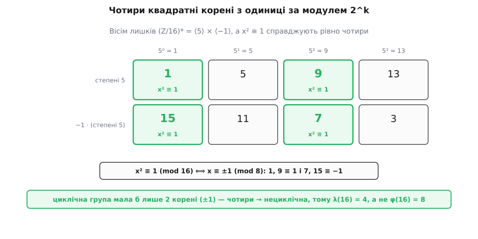

# 🧮 Строге виведення λ(n)

λ(n) — це найменший показник, за якого a^m ≡ 1 (mod n) для всіх взаємно простих з n основ заразом; тут ми доводимо його формулу до кінця й показуємо те, що зазвичай лише проголошують: цей показник не просто існує, а **досягається** одним-єдиним елементом, а для степенів двійки він удвічі коротший, ніж підказує лік населення лишків. Усе тримається на одному погляді: взаємно прості лишки за модулем n — це скінченна абелева група за множенням, і λ(n) — її **експонента**.

## Мова, якою все стає одним рядком

Позначмо через (Z/nZ)* множину лишків, взаємно простих з n, із дією множення за модулем. Це [група](book:math/group-theory): добуток двох взаємно простих із n чисел знову взаємно простий, одиниця на місці, а в кожного a є обернене — саме тому, що НСД(a, n) = 1. Розмір цієї групи — [функція Ейлера φ(n)](book:math/euler-totient).

[Порядок](book:math/multiplicative-order) елемента a — це найменше m > 0 з a^m ≡ 1 (mod n): довжина його кільця степенів. Показник m повертає a до одиниці тоді й лише тоді, коли m кратне ord(a). Щоб один-єдиний m годився **всім** одразу, він мусить бути спільним кратним усіх порядків; найменше таке число — [їхнє найменше спільне кратне](book:math/lcm):

```
λ(n) = найменше m > 0 з  a^m ≡ 1  для всіх a ∈ (Z/nZ)*
     = НСК{ ord(a) : a ∈ (Z/nZ)* }
```

У теорії груп це число зветься **експонентою** групи. Отже λ(n) = exp((Z/nZ)*), і всі подальші питання — це питання про експоненту скінченної абелевої групи. Далі йдемо трьома кроками: спершу з'ясуємо, що експонента реально досягається одним елементом; тоді китайська теорема розітне групу на прості степені; і зостанеться порахувати експоненту для одного p^k.

## Максимальний порядок дорівнює НСК усіх порядків

Означення через НСК приховує пастку. НСК береться по **всіх** елементах — а раптом λ(n) склеєне з кількох коротших кілець, і жодне окреме кільце саме по собі не тягне на λ(n)? Тоді λ була б лише формальним спільним кратним, а не довжиною якогось справжнього кільця. Виявляється, пастка порожня: у скінченній абелевій групі завжди знайдеться елемент, чий порядок дорівнює НСК усіх порядків. Доводиться це конструкцією, і конструкція та сама, що потім збере λ з локальних шматків.

**Лема про склеювання.** Якщо в абелевій групі a має порядок r, а b — порядок s, то існує елемент порядку НСК(r, s).

Спершу взаємно простий випадок: коли НСД(r, s) = 1, добуток ab має порядок рівно rs.

```
(ab)^(rs) = (a^r)^s · (b^s)^r = 1              → ord(ab) ділить rs

нехай (ab)^t = 1, тобто a^t = b^(−t):
  піднесення до s:  a^(ts) = 1  →  r ділить ts,  а НСД(r,s)=1  →  r ділить t
  піднесення до r:  b^(tr) = 1  →  s ділить tr,  а НСД(r,s)=1  →  s ділить t
  отже rs ділить t
```

Порядок ділить rs і кратний rs — значить дорівнює rs, а для взаємно простих rs і є НСК(r, s).

Загальний випадок зводиться до взаємно простого розбором на прості. Для кожного простого q візьмімо той із r, s, у якому q входить у старшому степені. Так зберуться дільники r′ | r та s′ | s з НСД(r′, s′) = 1 і добутком r′·s′ = НСК(r, s). Піднесення a до степеня r/r′ лишає елемент порядку рівно r′ (повний період r поділено на множник r/r′), а b до степеня s/s′ — порядку s′. Порядки r′ і s′ взаємно прості, тож за першим випадком їхній добуток-елемент має порядок r′·s′ = НСК(r, s). Лему доведено.

Тепер головний наслідок. Нехай g — елемент **найбільшого** порядку M у групі. Візьмімо будь-який елемент h порядку d. Лема дає елемент порядку НСК(M, d), і цей порядок ≥ M. Але M — максимум, тож НСК(M, d) не може перевищити M; отже НСК(M, d) = M, а значить d | M. Кожен порядок ділить M — отже M і є НСК усіх порядків:

```
максимальний порядок  =  НСК усіх порядків  =  exp(G)  =  λ(n)
```

Це вирішальний зсув. λ(n) — не абстрактне спільне кратне, а довжина найдовшого реального кільця в групі: існує основа g з ord(g) = λ(n), і меншого показника вона не подарує. Ось обіцяна досяжність.

Заодно безкоштовно падає й подільність λ(n) | φ(n). За теоремою Лагранжа порядок кожного елемента ділить розмір групи |G| = φ(n); а НСК чисел, кожне з яких ділить φ(n), сам ділить φ(n). Отже λ(n) | φ(n) — без жодного обчислення, з самої лише будови групи.

> 🔧 **Навіщо доводити, що λ досягається.** Знати, що показник λ(n) годиться всім, — це півсправи; часто треба ПРЕД'ЯВИТИ основу, кільце якої має повну довжину λ(n) — свідка того, що коротший показник уже не спрацює. Конструкція з леми дає таку основу явно: склеїти максимальні за кожним простим степенем елементи. Без досяжності λ лишалася б тільки верхньою оцінкою; з нею — це точна, реалізована довжина найдовшого кільця.


*Коли порядки множників взаємно прості, їхнє склеювання дає цикл завдовжки в добуток — уся група накрита одним кільцем (циклічна). Коли порядки мають спільний множник, найдовше кільце — лише їхнє НСК, коротше за розмір групи: одним елементом усю групу не обійти. Саме це станеться з двійкою.*

## Китайська теорема розтинає групу

Тепер зведімо λ(n) до простих степенів. Розклад n = p₁^k₁ · p₂^k₂ · … · p_r^k_r дає, за [китайською теоремою про залишки](book:math/chinese-remainder-theorem), не просто відповідність чисел, а ізоморфізм груп — множення йде покоординатно й незалежно:

```
(Z/nZ)*  ≅  (Z/p₁^k₁Z)* × (Z/p₂^k₂Z)* × … × (Z/p_r^k_rZ)*
```

Порядок набору (a₁, …, a_r) — це найменше t, що обнуляє показник у кожній координаті нараз, тобто НСК(ord a₁, …, ord a_r). Щоб дістати максимальний порядок у добутку, виберімо в кожній координаті елемент максимального порядку λ(p_i^k_i) — координати незалежні, вибір вільний. Порядок такого набору — НСК цих максимумів, і більшого в групі немає. А максимальний порядок ми щойно ототожнили з експонентою. Отже:

```
λ(n) = НСК( λ(p₁^k₁), λ(p₂^k₂), …, λ(p_r^k_r) )
```

Уся задача розпалася на незалежні шматки. Лишилося порахувати λ(p^k) для одного простого степеня — і тут дві різні історії: непарне p та двійка.

## Непарне просте: кільце циклічне, λ = φ

Коли p непарне, група (Z/p^kZ)* [циклічна](book:math/primitive-root): існує первісний корінь — одна основа, степені якої пробігають усі φ(p^k) лишків, перш ніж замкнутися. А в циклічній групі порядку N сам генератор має порядок N, тож максимальний порядок дорівнює N. Максимальний порядок — це експонента; отже для непарного p:

```
λ(p^k) = φ(p^k) = p^(k−1)·(p − 1)          (p непарне)

λ(7) = 6        λ(9) = 6        λ(27) = 18
```

Чому саме циклічна — це вже теорема про первісний корінь; коротко, за модулем простого p многочлен x^d − 1 над полем має не більше d коренів, і ця жорсткість поля змушує з'явитися елемент повного порядку p − 1, а той корінь потім підіймається з p на p^k без утрати довжини. Важливе для нас інше: **уся різниця λ проти φ — це міра нециклічності групи лишків.** Поки група циклічна, λ = φ; щойно вона розсипається, максимальний порядок просідає нижче φ. Розсипається ж вона рівно в одному місці.

## Аномалія двійки: чотири квадратні корені з одиниці

Перевірмо циклічність двійки прямо — і найдешевшою пробою. У циклічній групі рівняння x² ≡ 1 має рівно два розв'язки: у циклічній групі порядку N кількість розв'язків x² = 1 дорівнює НСД(2, N), тобто два, коли N парне (це ±1, і більше звідки). Порахуймо ж, скільки квадратних коренів з одиниці має двійка.

```
x² ≡ 1 (mod 2^k)   ⟺   2^k ділить (x − 1)(x + 1)
```

Число x непарне, тож x − 1 і x + 1 — два послідовні парні числа. З двох послідовних парних одне ділиться лише на 2 (дає остачу 2 за модулем 4), а друге — на 4 і вище. Позначмо через v₂ показник двійки в розкладі числа. Тоді всі двійки добутку — це одна двійка від «слабшого» множника плюс усі двійки «сильнішого»:

```
v₂( (x−1)(x+1) ) = 1 + v₂( той із x∓1, що ділиться на 4 )
```

Щоб добуток ділився на 2^k при k ≥ 3, потрібно 1 + v₂(…) ≥ k, тобто сильніший множник ділиться на 2^(k−1). А це означає, що або x − 1, або x + 1 ділиться на 2^(k−1):

```
x ≡ 1 (mod 2^(k−1))     або     x ≡ −1 (mod 2^(k−1))
```

Кожна з двох умов дає рівно **два** лишки за повним модулем 2^k, бо 2^(k−1) вкладається у 2^k двічі: з x ≡ 1 виходять 1 і 1 + 2^(k−1); з x ≡ −1 виходять −1 і 2^(k−1) − 1. (Обидві умови водночас неможливі: тоді 2^(k−1) ділило б їхню різницю 2, а це вимагає k ≤ 2.) Разом — рівно чотири корені:

```
x ∈ { 1,   2^(k−1) − 1,   2^(k−1) + 1,   2^k − 1 (= −1) }
```

Підставмо конкретні модулі:

```
mod 8  (k=3):   2^(k−1) = 4   →   корені { 1, 3, 5, 7 }   — усі непарні лишки
mod 16 (k=4):   2^(k−1) = 8   →   корені { 1, 7, 9, 15 }

перевірка mod 16:   7² = 49 ≡ 1,   9² = 81 ≡ 1,   15² = 225 ≡ 1
```

Чотири — там, де циклічна група терпить лише два. (А при k = 2, за модулем 4, чотири формули збігаються по двоє в { 1, 3 } — тому четвірка ще циклічна, злам починається саме з восьмірки.) Висновок прямий і невблаганний: **(Z/2^kZ)* при k ≥ 3 не циклічна.** А отже її максимальний порядок строго менший за φ(2^k) = 2^(k−1) — саме тут λ відривається від φ.


*Усі вісім лишків, взаємно простих із 16, — це степені п'ятірки (верхня стрічка) та їхні добутки з −1 (нижня): будова ⟨−1⟩ × ⟨5⟩. Зелені клітини — чотири квадратні корені з одиниці. Вони розкладаються за модулем 8: 1 і 9 дають остачу 1, а 7 і 15 — остачу −1. Чотири корені там, де в циклічному кільці їх було б два, — це і є доказ нециклічності, а з нею й того, що λ(16) = 4, а не φ(16) = 8.*

## Будова групи двійки й точне λ(2^k)

Наскільки ж просідає максимальний порядок? Група розпадається на два незалежні кільця — і це видно просто:

```
(Z/2^kZ)*  ≅  {±1} × ⟨5⟩  ≅  Z/2 × Z/2^(k−2)          (k ≥ 3)
```

Перше кільце — це {1, −1} порядку 2. Друге — степені п'ятірки; покажімо, що ord(5) = 2^(k−2). Знову зручний той самий розклад у добуток різниць:

```
5^(2^j) − 1 = (5 − 1)(5 + 1)(5² + 1)(5⁴ + 1) ··· (5^(2^(j−1)) + 1)
```

Порахуймо двійки в кожному множнику. v₂(5 − 1) = v₂(4) = 2, v₂(5 + 1) = v₂(6) = 1. Кожен наступний множник 5^(2^i) + 1 при i ≥ 1 — це квадрат непарного плюс одиниця; квадрат непарного ≡ 1 (mod 8), тож множник ≡ 2 (mod 8), тобто несе рівно одну двійку. На j множників (j ≥ 1) виходить:

```
v₂( 5^(2^j) − 1 ) = 2 + 1 + (j − 1)·1 = j + 2
```

Отже 5^(2^j) ≡ 1 (mod 2^k) тоді й лише тоді, коли j + 2 ≥ k, тобто j ≥ k − 2. Найменший такий показник — j = k − 2, значить ord(5) = 2^(k−2). А −1 не входить у степені п'ятірки взагалі: усі степені 5 дають остачу 1 за модулем 4, тоді як −1 ≡ 3 (mod 4). Два кільця перетинаються лише в одиниці — добуток прямий, і разом вони накривають усі 2 · 2^(k−2) = 2^(k−1) = φ(2^k) лишків. Будову встановлено остаточно.

Тепер λ(2^k) — це експонента, тобто максимальний порядок, тобто НСК довжин двох кілець:

```
λ(2^k) = НСК( 2, 2^(k−2) ) = 2^(k−2)          (k ≥ 3)
```

Двійка «поглинається»: вона ділить 2^(k−2), тож НСК не додає нічого понад довше кільце — а от у φ ту двійку множать окремо, і виходить удвічі більше. Ось звідки зайва двійка в знаменнику:

```
λ(2) = 1     λ(4) = 2     λ(8) = 2     λ(16) = 4     λ(32) = 8     …

λ(2^k) = 2^(k−2)  для k ≥ 3,   тоді як   φ(2^k) = 2^(k−1)  —  рівно вдвічі більше
```

Глибша причина зламу — в одному рядку. Для непарного p множина лишків виду 1 + p·(ціле) під множенням — одне довге кільце, і первісний корінь склеює його з (p − 1)-кільцем у повний цикл. Для двійки та сама множина 1 + 2·(ціле) розсипається на {±1} і ⟨5⟩ саме тому, що −1 «застрягає» окремим кільцем порядку 2; а симптом цього застрягання ми щойно й полічили — зайва пара квадратних коренів з одиниці.

## Збірка й свідок

Тепер видно все виведення від початку до кінця. Зберімо його на прикладі — і одразу пред'явімо основу, чиє кільце має повну довжину λ(n), щоб «досягається» стало відчутним, а не обіцяним.

**λ(48).**

```
48 = 2⁴ · 3

λ(2⁴) = 2^(4−2) = 4          довжина кільця ⟨5⟩ за модулем 16
λ(3)  = 3 − 1  = 2           непарне просте: φ(3)

λ(48) = НСК(4, 2) = 4
```

А тепер свідок — елемент порядку рівно 4. За китайською теоремою складімо основу, що за модулем 16 дорівнює 5 (порядок 4), а за модулем 3 має порядок 2. Найпростіше — узяти саме число 5: воно ж 5 (mod 16) і 2 (mod 3), тож порядок 5 за модулем 48 дорівнює НСК(4, 2) = 4:

```
5² = 25              ≢ 1 (mod 48)
5⁴ = 625 = 13·48 + 1 ≡ 1 (mod 48)          →   ord(5) = 4 = λ(48)
```

Отже λ(48) не тільки годиться всім взаємно простим із 48 основам, а й реально досягається — п'ятіркою: коротший показник її до одиниці не поверне. Це і є те, що загальна лема гарантувала наперед.

Строгість замкнулася. λ(n) — це експонента групи (Z/nZ)*; максимальний порядок елемента дорівнює цій експоненті, тому λ **досягається**; китайська теорема зводить λ(n) до НСК локальних λ(p^k); для непарних простих кільце циклічне й λ(p^k) = φ(p^k); а для двійки чотири квадратні корені з одиниці ламають циклічність і зрізають λ(2^k) до 2^(k−2). Кожна ланка формули Кармайкла тепер спирається не на перевірку прикладів, а на будову самої групи лишків.
