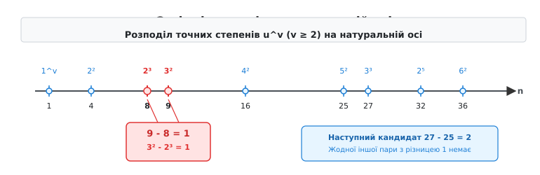
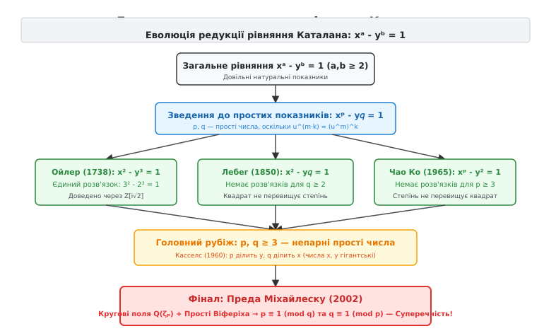
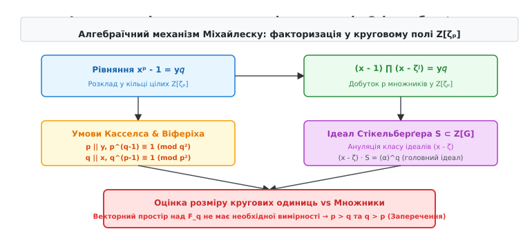

# Гіпотеза Каталана (теорема Міхайлеску)

<preknowlist>
- [Діофантові рівняння](book:math/diophantine-equations) — рівняння у цілих числах та класичні методи їх розв'язання.
- [Модульна арифметика](book:math/modular-arithmetic) — порівняння за модулем, лишкові класи та їхні властивості.
- [Велика теорема Ферма](book:math/fermats-last-theorem) — неможливість цілочисельних розв'язків aⁿ + bⁿ = cⁿ та роль кругових полів.
</preknowlist>

Якщо виписати в один ряд усі точні степені натуральних чисел `u^v` з основою `u ≥ 2` та показником `v ≥ 2` (тобто числа 4, 8, 9, 16, 25, 27, 32, 36, 49, 64, 81, 100, 121, 125, 128, 144, 169, 196, 216, 225, 243, 256...), можна помітити дивну арифметичну аномалію на самому початку числової осі. Числа 8 (`2³`) та 9 (`3²`) стоять упритул одне до одного: їхня різниця дорівнює точно одиниці. Продовжуючи ряд далі — до мільйонів, мільярдів і трильйонів, — ми знаходимо пари, що стоять на відстані двох одиниць (`27 - 25 = 2`), чотирьох одиниць (`125 - 121 = 4`), п'яти одиниць (`32 - 27 = 5`), шести одиниць (`216 - 225` промах), проте жодної іншої пари з різницею 1 більше не трапляється. 

Щоб зрозуміти, чому сусідні точні степені є такою дивовижною рідкістю, розглянемо щільність їхнього розподілу. Кількість точних квадратів, що не перевищують `N`, дорівнює `⌊√N⌋`, кількість кубів — `⌊∛N⌋`, а кількість четвертих степенів — `⌊∜N⌋`. На проміжку від 1 до 100 є лише 12 точних степенів, на проміжку до 1000 — 41 степінь, а до 1 000 000 — лише 1010 степенів. Середня відстань між сусідніми точними степенями зростає пропорційно до `√N`. Чим далі ми рухаємося числовою віссю, тим рідшими стають точні степені і тим більші прірви розділяють їх.

У 1844 році бельгійський математик Ежен Шарль Каталан (Eugène Charles Catalan) висунув припущення, що 8 і 9 є **єдиною** парою послідовних точних степенів у всьому нескінченному натуральному ряді. Мовою алгебри це означає, що діофантове рівняння

```
xᵃ - yᵇ = 1
```

має лише один-єдиний розв'язок у натуральних числах `x, y, a, b > 1`, а саме: `x = 3, a = 2, y = 2, b = 3`.

Сформулювати це твердження може школяр, проте на його доведення знадобилося сто п'ятдесят вісім років. Рівняння Каталана виявилося значно підступнішим за класичне рівняння Пелля `x² - d·y² = 1` чи рівняння Ферма `xⁿ + yⁿ = zⁿ`. У рівнянні Ферма показник `n` є однаковим для всіх доданків і зафіксованим, а у рівнянні Каталана невідомими є не лише основи `x` та `y`, а й обидва показники `a` та `b`. Ця подвійна рухливість змінних робила стандартні геометріко-алгебраїчні методи безсилими.


*Розподіл точних степенів u^v (v ≥ 2) на натуральній осі від 1 до 36. Єдина пара сусідніх степенів із різницею 1 — це 8 (2³) та 9 (3²); далі відстані між степенями швидко зростають.*

## Перша зачистка: зведення до простих показників

Перший крок у дослідженні рівняння `xᵃ - yᵇ = 1` полягає у структурному спрощенні показників. Натуральні числа `a` та `b` можуть бути складеними, проте будь-яке складене число за основною теоремою арифметики має хоча б один простий дільник.

Припустимо, що показник `a` є складеним і розкладається у добуток `a = p · k`, де `p` — просте число, а `k ≥ 1`. Тоді за властивістю степенів ми можемо перегрупувати основу:

```
xᵃ = x^(p·k) = (xᵏ)ᵖ
```

Поклавши `X = xᵏ`, ми перетворюємо степінь `xᵃ` на простий степінь нового натурального числа `Xᵖ`. Аналогічно, якщо `b = q · m` для простого `q`, ми покладаємо `Y = yᵐ` і отримуємо `yᵇ = Y𝑞`.

Розглянемо конкретний приклад. Нехай маємо рівняння зі складеними показниками `x¹² - y¹⁵ = 1`. Оскільки `12 = 3 · 4` та `15 = 3 · 5`, перепишемо рівняння у вигляді:

```
(x⁴)³ - (y⁵)³ = 1
```

Поклавши `X = x⁴` та `Y = y⁵`, ми дістаємо рівняння `X³ - Y³ = 1` з простим показником 3. Якщо доведено, що рівняння з простими показниками `X³ - Y³ = 1` не має цілих розв'язків (окрім тривіальних), то початкове рівняння `x¹² - y¹⁵ = 1` тим більше не може мати розв'язків у натуральних числах.

Звідси випливає фундаментальне правило редукції: якщо діофантове рівняння `xᵃ - yᵇ = 1` має розв'язок для якихось показників `a` та `b`, то рівняння

```
xᵖ - y𝑞 = 1
```

обов'язково має розв'язок у натуральних числах `x, y ≥ 2` для **простих показників** `p` та `q`. Прочитавши це твердження у зворотний бік, маємо: якщо рівняння `xᵖ - y𝑞 = 1` не має розв'язків для жодної пари простих чисел `(p, q)` (окрім винятку `3² - 2³ = 1`), то початкове рівняння Каталана не має жодних інших розв'язків і для складених показників.


*Еволюція редукції рівняння Каталана: від довільних натуральних показників до простих p, q, через ліквідацію парних випадків Ойлером, Лебегом та Чао Ко, до підсумкової суперечності Міхайлеску.*

Найпростіший випадок, коли обидва показники є парними простими числами (`p = 2` та `q = 2`), відсікається миттєво. Рівняння `x² - y² = 1` розкладається на множники різниці квадратів:

```
(x - y)(x + y) = 1
```

Оскільки `x` та `y` є натуральними числами, більшими за 1, сума `x + y` є не меншою за 4, тоді як єдиними цілими дільниками одиниці є `1` та `-1`. Рівняння `(x - y)(x + y) = 1` не має цілих розв'язків, тож два квадрати натуральних чисел ніколи не можуть відрізнятися на одиницю.

Вся подальша боротьба розгортається довкола випадків, коли хоча б один із показників `p` або `q` є непарним простим числом.

## Закриття парних показників: Ойлер, Лебег та Чао Ко

Перед тим як атакувати загальний випадок двох непарних простих показників, математикам знадобилося півтора століття, щоб повністю закрити всі випадки, де бере участь парний показник `p = 2` або `q = 2`.

Першим рубежем стало рівняння `x² - y³ = 1` (або у формі `y³ - x² = 2` чи `y³ - x² = 1`), досліджене Леонардом Ойлером у 1738 році. Для спорідненого рівняння `y³ - x² = 2` Ойлер застосував факторизацію у кільці цілих комплексних чисел `Z[i√2]`:

```
y³ = x² + 2 = (x + i√2)(x - i√2)
```

Оскільки НСД множників `(x + i√2)` та `(x - i√2)` у кільці `Z[i√2]` дорівнює `i√2`, а числа `x` та `y` є взаємно простими, кожен із співмножників мусить бути точним кубом у `Z[i√2]`:

```
x + i√2 = (a + b·i√2)³
```

Розкривши куб за формулою бінома Ньютона, маємо:

```
x + i√2 = a³ + 3a²(b·i√2) + 3a(b·i√2)² + (b·i√2)³
= a³ - 6ab² + i√2 · (3a²b - 2b³)
```

Прирівнявши уявні частини обабіч рівняння, отримуємо:

```
1 = b · (3a² - 2b²)
```

Оскільки `a` та `b` є цілими числами, єдиними дільниками 1 є `b = 1` або `b = -1`.
Якщо `b = 1`, маємо `3a² - 2 = 1 ⇒ 3a² = 3 ⇒ a² = 1 ⇒ a = ±1`.
Підставивши `a = ±1` та `b = 1` у дійсну частину, отримуємо:

```
x = a · (a² - 6b²) = (±1) · (1 - 6) = ∓5
y = a² + 2b² = 1 + 2 = 3
```

Це дає розв'язок `3³ - 5² = 27 - 25 = 2`. Аналогічний вивід для рівняння `x² - y³ = 1` розкладом на множники `(x - 1)(x + 1) = y³` дав єдиний натуральний розв'язок `x = 3, y = 2` (`3² - 2³ = 9 - 8 = 1`).

Другим рубежем стало рівняння `x² - y𝑞 = 1` для довільного простого показника `q ≥ 2` (квадрат перевищує степінь на одиницю). У 1850 році французький математик Віктор-Амеде Лебег (Victor-Amédée Lebesgue) довів, що це рівняння **не має жодного розв'язку** у натуральних числах `x, y ≥ 2`. 

Лебег розклав різницю квадратів над кільцем гаусових цілих чисел `Z[i]`:

```
x² - 1 = (x - 1)(x + 1) = y𝑞
(x - i)(x + i) = y𝑞
```

Оскільки найбільшим спільним дільником дужок `(x - i)` та `(x + i)` у `Z[i]` є елемент `1 + i`, аналіз норми показав, що `(x + i)` з точністю до множників-одиниць мусить бути `q`-м степенем деякого гаусового числа `a + b·i`. Прирівнювання уявних частин дало рівняння для біноміальних коефіцієнтів:

```
1 = ∑_(k=0)^((q-1)/2) ⟨ q над (2k+1) ⟩ · a^(q-2k-1) · b^(2k+1) · (-1)ᵏ
```

Це рівняння вимагає `b = ±1`, що після розкладу за модулем 4 дає непоборну суперечність для будь-якого `q ≥ 2`.

Третім і найважчим рубежем парного фронту було протилежне рівняння `xᵖ - y² = 1` для непарного простого `p ≥ 3` (степінь перевищує квадрат на одиницю). Ліквідувати цей випадок вдалося лише 1965 року китайському математику Чао Ко (Chao Ko). Його складне доведення спиралося на аналіз квадратичних лишків, розклад у квадратичних полях `Q(√p)` та вивчення розв'язків класичного рівняння Пелля `y² - p·z² = 1`.

Поєднання результатів Ойлера, Лебега та Чао Ко підсумовує `[Історія півторастолітнього штурму гіпотези Каталана](book:math/number-theory/catalan-conjecture/hist-catalan-conjecture.md)`:

> **Фундаментальний вислід парного фронту:** Жоден із показників `p` та `q` у рівнянні `xᵖ - y𝑞 = 1` не може дорівнювати 2 (окрім відомого розв'язку `3² - 2³ = 1`). Будь-який новий потенційний розв'язок гіпотези Каталана зобов'язаний складатися виключно з **двох різних непарних простих чисел** `p ≥ 3` та `q ≥ 3`.

## Формули Касселса та вибухове зростання основ

Коли обидва показники `p` та `q` є непарними простими числами, алгебраїчна ситуація різко ускладнюється. У 1960-х роках шотландський математик Джон Касселс (J. W. S. Cassels) відкрив глибокі приховані тотожності подільності, які задовольняють основи `x` та `y`.

Розкладемо вираз `xᵖ - 1` на два співмножники над звичайними цілими числами:

```
xᵖ - 1 = (x - 1) · (xᵖ⁻¹ + xᵖ⁻² + … + x + 1) = y𝑞
```

Позначимо другий співмножник через `Φₚ(x) = (xᵖ - 1)/(x - 1)`. Оскільки `xᵖ - 1 = y𝑞`, добуток `(x - 1) · Φₚ(x)` дорівнює точному `q`-му степеню. Касселс проаналізував найбільший спільний дільник цих двох виразів.

Оскільки `x ≡ 1 (mod x - 1)`, підстановка `x = 1` у многочлен `Φₚ(x)` дає:

```
Φₚ(1) = 1 + 1 + … + 1 = p      [всього p доданків]
```

Отже, єдиним можливим спільним простим дільником чисел `(x - 1)` та `Φₚ(x)` є просте число `p`. 

Проведемо ретельний оціночний розклад `p`-адичних показників. Нехай `v_p(n)` означає степінь простого `p`, що входить у розклад числа `n`. Оскільки `x ≡ 1 (mod p)` (бо `xᵖ ≡ x ≡ y𝑞 + 1 ≡ 1 mod p`), покладемо `x = 1 + k · pʳ` з `gcd(k, p) = 1` та `r ≥ 1`. Тоді:

```
Φₚ(x) = ∑_(j=0)^(p-1) (1 + k · pʳ)ʲ
= p + k · pʳ · (p - 1)·p / 2 + …
≡ p (mod p^(r+1))
```

Отже, `v_p(Φₚ(x)) = 1`. Підставивши це у рівність показників `v_p(x - 1) + v_p(Φₚ(x)) = v_p(y𝑞) = q · v_p(y)`, маємо:

```
v_p(x - 1) + 1 = q · v_p(y)
v_p(x - 1) = q · v_p(y) - 1
```

Звідси випливає, що `v_p(x - 1)` мусить ділитися на `q` з остачею `q - 1`. Найменшим можливим значенням є `v_p(x - 1) = q - 1`.

Це дає дві жорсткі умови подільності Касселса для основ:

```
p ділить y    (p | y)
q ділить x    (q | x)
```

Звідси він вивів точні алгебраїчні формули для структури розкладу основ `x` та `y`:

```
x - 1 = p^(𝑞⁻¹) · a𝑞      [де a — ціле число, не кратне p]
y + 1 = 𝑞^(ᵖ⁻¹) · bᵖ      [де b — ціле число, не кратне q]
```

Ці тотожності мають колосальні наслідки для вираховувальної теорії чисел. Вони означають, що числа `x` та `y` є не просто великими, а зростають як експоненти від показників:

```
x > p^(𝑞⁻¹)   та   y > 𝑞^(ᵖ⁻¹)
```

Наприклад, якщо показники `p` та `q` дорівнюють лише 7 та 11, основа `x` мусить бути більшою за `7¹⁰ ≈ 2.8 × 10⁸`, а `y` — більшим за `11⁶ ≈ 1.77 × 10⁶`. А для показників порядку кількох тисяч числа `x` та `y` стають настільки гігантськими, що їх неможливо навіть записати у пам'яті всіх комп'ютерів світу. Спроба знайти розв'язки прямим перебором `x` та `y` без попереднього обмеження самих простих чисел `p` і `q` була безнадійною.

## Аналітичний рубіж Тійдемана та логарифми Бейкера

Якщо основи `x` та `y` зростають з такою вибуховою швидкістю, виникає принципове питання: чи може пара простих показників `(p, q)` бути нескінченно великою? Відповідь у 1976 році дав нідерландський математик Роберт Тійдеман (Robert Tijdeman).

Тійдеман застосував революційний апарат аналітичної теорії чисел — **метод лінійних форм у логарифмах алгебраїчних чисел**, створений Аланом Бейкером (Alan Baker). Поділивши рівняння `xᵖ - y𝑞 = 1` на `y𝑞`, отримуємо:

```
xᵖ / y𝑞 - 1 = 1 / y𝑞
```

Прологарифмувавши обох членів та скориставшись наближенням `ln(1 + ε) ≈ ε`, маємо оцінку для різниці логарифмів:

```
| p · ln(x) - q · ln(y) | ≈ 1 / y𝑞
```

Вираз `| p · ln(x) - q · ln(y) |` є лінійною формою від логарифмів двох цілих чисел `x` та `y` з цілими коефіцієнтами `p` та `-q`. Монументальна теорема Алана Бейкера стверджувала, що така різниця не може бути як завгодно малою: вона обмежена знизу ефективно обчислюваною величиною, яка залежить від `x`, `y`, `p` та `q`:

```
| p · ln(x) - q · ln(y) | > exp(- C₁ · ln(x) · ln(y) · ln(p) · ln(q))
```

Зіставивши нижню оцінку Бейкера з верхньою оцінкою `1/y𝑞` та підставивши формули подільності Касселса `y > q^(p-1)`, Тійдеман довів існування **абсолютної верхньої межі** `C` для непарних простих показників `p` та `q`:

```
p, q < C      [де C — скінченна обчислювана константа]
```

Це був грандіозний теоретичний прорив. Теорема Тійдемана вперше в історії довела, що кількість потенційних розв'язків рівняння Каталана є **скінченною**.

Однак початкова аналітична межа `C`, отримана методом Бейкера, була гігантською — вежа експонент давала константу `C ≈ 10^(10¹¹)`. Протягом наступних двадцяти років математики Моріс Міньотт (Maurice Mignotte) та Мішель Вальдшмідт провели титанічну роботу зі звуження цієї межі, опустивши її до значення `p, q < 7.15 × 10¹¹`. 

Попри це звуження, перевірити комп'ютером усі прості числа до `7.15 × 10¹¹` було неможливо: для кожного такого простого числа перевірка основ `x` та `y` вимагала б обчислень з числами, що мають понад сто мільярдів десяткових знаків. Аналітичний підхід Бейкера—Тійдемана досяг своєї природної межі. Для остаточної перемоги потрібна була принципово інша, чисто алгебраїчна ідея.

## Алгебраїчний прорив Міхайлеску: кругові поля та ідеал Стікельберґера

Остаточний розв'язок гіпотези Каталана у 2002 році знайшов румунський математик Преда Міхайлеску (Preda Mihăilescu). Він відкинув аналітичні оцінки логарифмів і перевів проблему у площину алгебраїчної теорії полів ділення кола — **кругових полів** (cyclotomic fields, від грецьких слів *kyklos* — коло та *tome* — перетин).

Позначимо через `ζₚ = e^(2πi/p)` первісний корінь степеня `p` з одиниці. Поле `K = Q(ζₚ)` є алгебраїчним розширенням ступеня `p - 1` над полем раціональних чисел `Q`. Кільце цілих чисел цього поля дорівнює `O_K = Z[ζₚ]`.

Міхайлеску розклав лівий бік рівняння `xᵖ - 1 = y𝑞` на `p` лінійних множників у кільці `Z[ζₚ]`:

```
(x - 1) · (x - ζₚ) · (x - ζₚ²) · … · (x - ζₚᵖ⁻¹) = y𝑞
```


*Схема алгебраїчного механізму Міхайлеску: факторизація x - 1 у круговому полі Z[ζₚ], дія ідеалу Стікельберґера, ануляція класів ідеалів та виведення суперечливих нерівностей.*

Усі деталі алгебраїчних перетворень висвітлює `[Алгебраїчний механізм доведення Міхайлеску](book:math/number-theory/catalan-conjecture/math-mihailescu-machinery.md)`. Головні логічні ланки його доведення будуються у наступній послідовності:

### 1. Подвійна умова простих Віферіха

Досліджуючи p-адичні розклади за модулем `q²`, Міхайлеску довів, що якщо непарні прості числа `p` та `q` дають розв'язок рівняння Каталана, основа `x` мусить бути кратною `q²`: `x ≡ 0 (mod q²)`.

Підставивши це значення у тотожність Касселса `x - 1 = p^(q-1) a^q`, отримуємо порівняння за модулем `q²`:

```
0 - 1 ≡ p^(𝑞⁻¹) · (-1) (mod 𝑞²)   ⇒   p^(𝑞⁻¹) ≡ 1 (mod 𝑞²)
```

Це порівняння означає, що `p` є **простим числом Віферіха** за модулем `q²`. Завдяки симетрії початкового рівняння, аналогічний розвиток для другого показника дає дзеркальне порівняння:

```
𝑞^(ᵖ⁻¹) ≡ 1 (mod ᵖ²)
```

Отже, розв'язок рівняння Каталана вимагає, щоб прості числа `(p, q)` утворювали взаємну пару простих Віферіха.

### 2. Ануляція ідеалом Стікельберґера та кругові одиниці

У кільці `Z[ζₚ]` ідеал `(x - ζₚ) · O_K` з точністю до дільників `p` є точним `q`-м степенем деякого ідеалу `𝔞`: `(x - ζₚ) · O_K = 𝔞𝑞`.

Міхайлеску застосував **ідеал Стікельберґера** `S` у груповому кільці `Z[G]`, де `G = Galois(Q(ζₚ)/Q)` — група Ґалуа розширення. За теоремою Стікельберґера, будь-який елемент `θ ∈ S` анулює групу класів ідеалів `Cl(Q(ζₚ))`, тобто перетворює ідеал `𝔞^θ` на головний ідеал `(α) · O_K`.

Це дає фундаментальну тотожність для елементів:

```
(x - ζₚ)^θ = u · α𝑞
```

де `u` належить до групи **кругових одиниць** (cyclotomic units) поля `Q(ζₚ)`.

### 3. Оцінка вимірності та остаточне заперечення

Перевівши цю тотожність на мову векторних просторів над скінченним полем `F_q = Z/qZ` та застосувавши теорему Тейна (Thaine's theorem), Міхайлеску порівняв алгебраїчну вимірність простору кругових одиниць із комплексними нормами елементів `|(x - ζₚ)^θ|`.

Оскільки за формулами Касселса основа `x` є гігантською (`x > p^(q-1)`), значення `|α𝑞| = |α|^q` зростає значно швидше, ніж поліноміальне значення `|(x - ζₚ)^θ|`. Єдиним способом уникнути суперечності між алгебраїчною вимірністю та числовими розмірами є вимога сумісності простих показників за модулем:

```
p ≡ 1 (mod 𝑞)
```

Через повну арифметичну симетрію рівняння для другого поля `Q(ζ_q)` ми отримуємо дзеркальну умову:

```
𝑞 ≡ 1 (mod p)
```

Зібравши обидва порівняння в єдиний ланцюг нерівностей для натуральних простих чисел `p` та `q`:

```
p ≡ 1 (mod 𝑞)   ⇒   p ≥ 𝑞 + 1   ⇒   p > 𝑞
𝑞 ≡ 1 (mod p)   ⇒   𝑞 ≥ p + 1   ⇒   𝑞 > p
```

ми отримуємо абсолютну арифметичну суперечність:

```
p > 𝑞   та одночасно   𝑞 > p
```

Числа `p` та `q` не можуть бути одночасно суворо більшими одне за одне. Ця суперечність доводить, що жодної пари непарних простих чисел `(p, q)`, яка задовольняла б рівняння Каталана, не існує у природі. Гіпотезу Каталана повністю доведено.

## Чисельний аналіз та алгоритми перевірки

Для малих діапазонів числових значень перевірку послідовних степенів можна виконати програмно. Практичні підходи описують `[Алгоритми пошуку степенів та перевірки умов Віферіха](book:math/number-theory/catalan-conjecture/proj-catalan-verifier.md)`.

Обчислювальний перебір спирається на дві головні інженерні ідеї:

1. **Ефективна генерація точних степенів**: Для перевірки всіх точних степенів `u^v ≤ N` основа `u` варіюється у діапазоні `[2, ⌊√N⌋]`. Кількість точних степенів до `N` складає лише `O(√N)`. Отриманий масив сортується за значенням, після чого шукаються суміжні елементи з різницею `val₂ - val₁ = 1`.

2. **Модульне фільтрування остач**: Перш ніж виконувати коштовні обчислення високої точності, застосовують фільтри остач за малими модулями (3, 4, 7, 8, 9, 13, 16). Наприклад, квадрат `x²` за модулем 7 може давати лише остачі `{0, 1, 2, 4}`, а куб `y³` — лише остачі `{0, 1, 6}`. Рівняння `x² - y³ = 1 mod 7` відсіює понад 85% хибних кандидатів на самому початку.

Для перевірки умови Віферіха `p^(q-1) ≡ 1 (mod q²)` застосовують алгоритм бінарного піднесення до степеня за модулем `q²`. У мовах C та C++ для відвернення цілочисельного переповнення 64-бітних значень під час множення `(a · b) mod q²` використовують розширений тип `unsigned __int128`.

## Сучасне значення та узагальнення: гіпотези Пійлаї, Біла та ABC

Доведення гіпотези Каталана стало не просто закриттям півторастолітньої математичної загадки, а й потужним імпульсом для розвитку всієї сучасної теорії діофантових рівнянь.

Природним узагальненням рівняння Каталана є **гіпотеза Пійлаї** (Pillai's conjecture), сформульована індійським математиком Суббайєю Пійлаї у 1931 році. Пійлаї припустив, що для будь-якого фіксованого цілого числа `k ≥ 1` діофантове рівняння

```
xᵃ - yᵇ = k
```

має лише **скінченну кількість** розв'язків у натуральних точних степенях `xᵃ` та `yᵇ` (із `a, b ≥ 2`). Гіпотеза Каталана відповідає окремому випадку `k = 1`, де кількість розв'язків дорівнює точно одиниці. Для `k = 2` відомими розв'язками є `3³ - 5² = 2` та `3 - 1 = 2` (якщо впустити показники 1). Гіпотеза Пійлаї досі залишається недоведеною у загальному вигляді.

Ще ширшим контекстом є знаменита **ABC-гіпотеза** (ABC conjecture), сформульована Джозефом Остерле та Девідом Массером у 1985 році. Вона стверджує, що для трьох взаємно простих натуральних чисел `A + B = C` радикалом добутку `rad(A·B·C)` (добутком усіх різних простих дільників) вираз `C` обмежений зверху:

```
C < c(ε) · (rad(A·B·C))^(1+ε)
```

Застосувавши ABC-гіпотезу до рівняння Каталана `xᵖ - y𝑞 = 1`, де `A = 1`, `B = y𝑞`, `C = xᵖ`, матимемо:

```
rad(1 · y𝑞 · xᵖ) = rad(x · y) ≤ x · y
```

Оскільки за формулами Касселса `x` та `y` обмежені показниками, ABC-гіпотеза прямо дає обмеження на `p` та `q` вищого порядку, у декілька рядків виводячи скінченність кількості розв'язків як для гіпотези Каталана, так і для гіпотези Пійлаї та [Великої теореми Ферма](book:math/fermats-last-theorem).

Доведення Предою Міхайлеску гіпотези Каталана без використання недоведеної ABC-гіпотези продемонструвало колосальну силу алгебраїчної теорії полів ділення кола. Вона показала, що навіть найпростіші питання про сусідні цілі числа приховують у собі глибоку гармонію алгебраїчних структур, кругових одиниць та теорії ідеалів.
