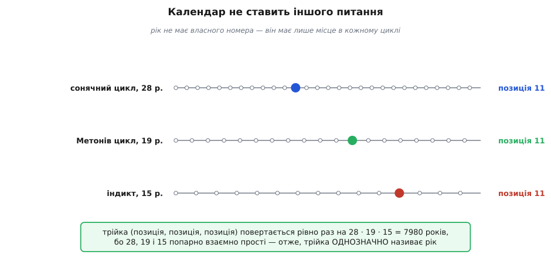
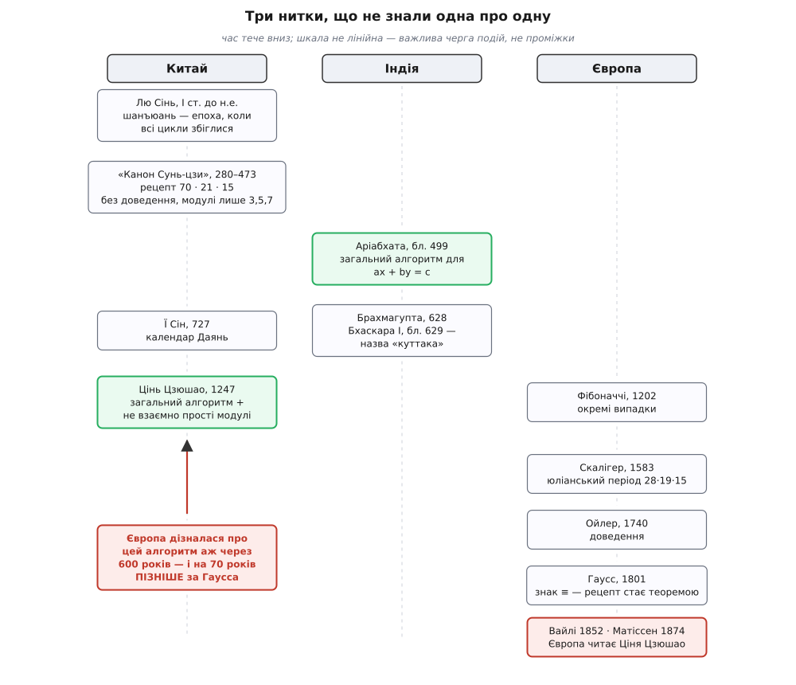

# 📜 Від Сунь-цзи до Гаусса: історія, у якій назва прийшла останньою

Задача про речі, яких лічать по три й по п'ять, має вигляд забавки — щось таке, чим бавлять школярів або чим заповнюють кінець підручника. Саме через цей вигляд її історію переказують неправильно: мовляв, стародавні китайці вигадали кумедну головоломку, а через півтори тисячі років Гаусс побачив у ній теорему.

Насправді забавки там ніколи не було. Варто подивитися, **хто** незалежно натрапляв на цю задачу — у Китаї, в Індії, в Європі, — і впадає в око одна річ: щоразу це були люди однієї професії. Не любителі чисел. Укладачі календарів. Задача про лічбу по три — це календарна задача, перевдягнена в речі на столі. І щойно це видно, уся плутана історія назви вкладається на місце.

### Спершу — хто такий Сунь-цзи, і хто він не такий

«Обчислювальний канон Сунь-цзи» (孫子算經, *Sunzi Suanjing*) підписаний іменем, яке кожен упізнає: Сунь-цзи, «майстер Сунь». Той самий, що написав «Мистецтво війни»?

Ні. І це не дрібниця, бо помилка має власну історію: у XVII столітті автора математичного канону ототожнили із Сунь У — полководцем VI ст. до н.е., автором «Мистецтва війни» (孫子兵法). Ототожнення хибне, і розводить цих двох не жанр, а майже тисяча років. 孫子 — це не прізвище, а шанобливе «майстер Сунь», приблизно як «пан Коваль»; таких «майстрів Сунь» історія знає багатьох. Хто саме написав математичний канон — **невідомо**. Ім'я автора теореми, яку весь світ називає китайською, не знає ніхто.

Датування теж не тверде, і його варто розуміти, бо саме воно вирішує, хто був перший. Прямої дати в тексті немає — її вираховують із того, що текст **згадує мимохідь**. Найпереконливіший доказ належить Ван Ліну: канон згадує податок *мянь* і систему *ху тяо*, а їх запровадили 280 року — отже, текст пізніший. З другого боку, ваги, які він описує, ще не знають реформи 474 року — отже, текст раніший. Лишається проміжок приблизно 280–473, тобто III–V століття, і сучасні дослідники досі розходяться всередині нього.

> 🔧 **Навіщо це.** Зверніть увагу на техніку: дату здобули не з дати, а з податку й ваг. Датування давніх математичних текстів майже завжди таке — непряме, від побутових деталей, які автор згадав, не думаючи про них. Тому «III ст.» і «V ст.» в різних книжках про той самий канон — це не недбалість, а чесна ширина проміжку. Коли наступного разу натрапите на впевнене «китайці знали це у III столітті», варто пам'ятати, що впевненість тут коштує двісті років.

### Що саме написано в каноні — і чого там немає

У задачі 26 третього розділу сформульовано ту саму умову — лічимо по три, лишається дві; по п'ять — три; по сім — дві — і подано відповідь: 23. Але цінне не це. Цінне — правило, яке йде слідом: за лічби по три бери 70, за лічби по п'ять — 21, за лічби по сім — 15; помнож кожне на свій залишок, склади й віднімай 105, поки не стане менше.

Тепер — найважче місце всієї історії, і його зазвичай проминають. Треба точно сказати, **наскільки загальне** це правило, бо саме тут проходить межа між рецептом і теоремою.

Правило Сунь-цзи загальне по **залишках**: візьміть будь-яку іншу трійку залишків — воно спрацює. Але воно не загальне по **модулях**: трійка 3, 5, 7 у ньому зашита намертво, а 70, 21 і 15 подані як готові числа, які просто треба знати. Звідки вони — не сказано. Що робити з модулями 4, 9, 11 — не сказано. Чому воно взагалі працює й чому відповідь одна — не сказано й не запитано.

Через цю подвійність джерела ніби суперечать одне одному: одні пишуть, що Сунь-цзи дав метод для довільних залишків, інші — що він не дав загального методу зовсім. Обидві правди. Правило узагальнюється по одній осі й не узагальнюється по другій — а теоремою його робила б саме друга.

### Навіщо це було потрібно: календар

Рецепт без пояснення живе рівно доти, доки комусь потрібні його відповіді. Рецепт Сунь-цзи прожив майже дев'ятсот років — і тримали його при житті не любителі загадок.

Ще в I ст. до н.е. Лю Сінь, перекроюючи календар (він перейменував тодішній «Тайчу» на «Сань тун», 三統曆), увів поняття **шанъюань** (上元) — «верхня епоха». Це гіпотетична мить у минулому, коли всі небесні цикли стояли в ідеальному ладі водночас: Сонце й Місяць в одній довготі, п'ять планет в одному напрямку, північ, молодик, зимове сонцестояння й початок циклу затемнень — усе разом. Календар будували, відлічуючи від цієї миті.

І тут з'являється задача, від якої нема куди подітися. Циклів кілька, довжини в них різні й неспівмірні. Астроном не має «номера року» — він має лише **позицію року в кожному циклі окремо**: стільки-то днів від зимового сонцестояння, стільки-то від молодика, стільки-то по шістдесятковому рахунку днів. Питання «скільки років минуло від шанъюаня» — це буквально питання «яке число дає ось такі залишки за ось такими модулями».


*Календар не має «номера року» — він має тільки позиції в циклах. Поки довжини циклів попарно взаємно прості, трійка позицій повертається лише через їхній добуток, а отже, називає рік без двозначності. Задача про речі, яких лічать по три й по п'ять, — це та сама задача з маленькими числами замість астрономічних.*

Ось чому рецепт не забули. Він був робочим інструментом бюро астрономії — і в цьому вся річ: **його вживали, не розуміючи**. Так тривало століттями. Календар 727 року, укладений ченцем-астрономом Ї Сіном (683–727), назвали «Даянь» (大衍) — сам Ї Сін до впровадження не дожив, календар прийняли 729-го. Назва прийшла з «Книги змін»: *даянь чжи шу*, «число великого розгортання», — те, з якого починають ворожіння на п'ятдесяти стеблах деревію. Ще Лю Сінь пояснював астрономічні сталі через «Книгу змін», і ця нитка тягнеться далі, ніж здається: за півтисячі років Цінь Цзюшао назве свій метод **даянь** — на честь календаря Ї Сіна. Найточніший алгоритм модульної арифметики свого часу носитиме ім'я, взяте з посібника з ворожіння.

### Індійська нитка: подрібнювач

Поки в Китаї передавали рецепт, в Індії робили інше — і робили це майже водночас.

Близько 499 року Аріабхата в «Аріабхатії», у віршах 32–33 розділу *ганітапада*, виклав спосіб розв'язувати те, що ми звемо [лінійним діофантовим рівнянням](topic:math/linear-diophantine): *ax* + *by* = *c*, де шукають **цілі** розв'язки. Вимога цілості й робить задачу задачею: пряма *ax* + *by* = *c* має нескінченно багато точок, але майже жодна з них не має цілих координат, і питання, чи є на ній хоч одна вузлова точка й як її знайти, — саме те, що розв'язує Аріабхата. Це вже не рецепт для трьох чисел — це **алгоритм**, який працює з будь-якими коефіцієнтами. Ідея — зводити задачу до тієї самої задачі з меншими коефіцієнтами, доки вона не стане очевидною; по суті, це [алгоритм Евкліда](topic:math/gcd-euclidean), докручений до кінця й розкручений назад.

> 🔧 **Навіщо це.** Різниця між тим, що мав Сунь-цзи, і тим, що мав Аріабхата, — це різниця між «знати числа» і «знати, звідки числа». Сунь-цзи виписав 70, 21 і 15. Аріабхата дав спосіб дістати такі числа **для будь-яких модулів**, бо саме цим і є розв'язування *ax* + *by* = *c*: пошук множника, який на потрібному модулі дає одиницю. Одне з цих двох можна застосувати до нової задачі, друге — тільки згадати.

Назви «куттака» Аріабхата не вживав — і це варто розрізняти, бо в переказах ці двоє злипаються в одного. Ім'я методові дав **Бхаскара I** (бл. 600 — бл. 680) у коментарі «Аріабхатіябхашья» близько 629 року, докладно розписавши алгоритм і давши приклади з астрономії: *куттака*, санскритом — «подрібнювач», «те, що товче на порох». Назва точна до зухвалості: метод справді розтирає велике рівняння на дедалі дрібніші, доки не лишиться пил, з якого відповідь збирається назад. Роком раніше, 628-го, Брахмагупта в «Брахмаспхутасіддханті» відвів цьому цілий розділ — вісімнадцятий, який так і зветься «Куттака».

І знову — придивімося, **навіщо**. Бхаскара I ілюструє метод астрономією. Індійським астрономам куттака була потрібна для *ахаргани* — рахунку днів від епохи Калі-юґи, для середніх довгот планет, для вставних місяців. Тобто для календаря. Дві традиції, що нічого не знали одна про одну, прийшли до однієї математики з однієї потреби.

### Цінь Цзюшао: рецепт нарешті стає алгоритмом

1247 року з'являється книжка, яка закриває питання — «Математичний трактат у дев'яти розділах» (數書九章, *Шушу цзючжан*) Цінь Цзюшао (1202–1261). Написав він її в роки жалоби, відійшовши від служби.

Там подано **дайянь цзуншу шу** (大衍總數術) — загальний спосіб для системи конгруенцій, і **дайянь цюї шу** (大衍求一術), «даянь: добування одиниці», — процедура, яка знаходить множник, що дає одиницю за модулем. Це, без жодних застережень, обернений за модулем. І це та сама серцевина, до якої з другого боку прийшов Аріабхата.

Але Цінь пішов далі за всіх, хто був до нього, — і далі, ніж піде Гаусс. Він розв'язав випадок, коли модулі **не взаємно прості**: його процедура зводить такі модулі до попарно взаємно простих — на нові модулі є навіть окремий термін, *діншу* (定數), «встановлені числа», — так, що розв'язок системи зберігається. Тобто повний загальний випадок, 1247 року.

Найкрасномовніше в цій історії — визнання самого Ціня. Він пише, що навчився методу від календарних фахівців, коли служив при бюро астрономії в Ханчжоу, — і додає, що **ті фахівці вживали правило, не розуміючи його**. Ось де замикається дев'ятсотлітня дуга: рецепт із канону Сунь-цзи дійшов до XIII століття живим саме тому, що працював, і мертвим саме тому, що ніхто не питав чому. Знадобилася людина, яка спитала.

Особа Ціня, до речі, з тих, що псують гарну оповідь. Сучасники-недоброзичливці малювали його жахливо — «лютий, мов тигр чи вовк», отруйник, шахрай, торгівець контрабандною сіллю. Наскільки це правда, сказати важко: майже все, що ми знаємо про його вдачу, походить від людей, які його ненавиділи, — тож свідчення упереджені й неперевірені. Зате в математиці, за тим самим переказом, він тримався скромно. Хай там як, найповніший результат тисячоліття лишив по собі саме він.

### Європа знаходить те саме, не знаючи нічого

Тепер — третя нитка, і в ній важлива не так хронологія, як **сліпота**.

У «Книзі абака» Леонардо Пізанського (Фібоначчі) 1202 року — того самого, коли народився Цінь Цзюшао, — трапляються окремі випадки задачі про залишки. Окремі: без загального способу.

1734 року Леонард Ойлер подає до Петербурзької академії працю з назвою, що є переказом самої задачі: «Розв'язання арифметичної задачі про знаходження числа, яке, поділене на дані числа, лишає дані остачі» (*Solutio problematis arithmetici…*, E36; надрукована 1740-го в сьомому томі «Commentarii», с. 46–66). Ойлер починає з випадку двох взаємно простих дільників і повторює крок для решти. Це вже доведення, а не рецепт.

А 1801 року виходить «Disquisitiones Arithmeticae», і Гаусс робить те, чого не зробив ніхто за півтори тисячі років до нього, — не знаходить метод, а **дає мову**. Уже на перших сторінках з'являється знак ≡ і поняття [конгруенції](topic:math/modular-arithmetic). Ось де рецепт стає теоремою: доки немає способу **записати** твердження «для будь-яких попарно взаємно простих модулів існує єдиний розв'язок», його неможливо ні сформулювати, ні довести — можна лише показувати приклади. Сунь-цзи мав числа. Цінь мав алгоритм. Гаусс дав речення.

Ані Ойлер, ані Гаусс про китайців нічого не знали. Спосіб, який Гаусс наводить, до нього вже вживав Ойлер — і обидва прийшли до нього самотужки.

І тут — деталь, від якої історія робиться майже неправдоподібною. Чим Гаусс **ілюструє** теорему в «Disquisitiones»? Календарною задачею: знайти роки з даним номером щодо сонячного циклу, місячного циклу й римського індикту.

### Юліанський період: Сунь-цзи в Європі, якого ніхто не впізнав

Ця Гауссова ілюстрація — не випадкова вигадка. Це юліанський період, який 1583 року запропонував Йосип Скалігер: добуток трьох календарних циклів — 28 (сонячний) × 19 (місячний, Метонів) × 15 (індикт) = 7980 років. Кожному року Скалігер приписував «характер» — трійку його позицій у цих трьох циклах.

Європейські хронологи мали й зворотну формулу: щоб від трійки (*i*, *m*, *s*) дійти до року, брали 6916*i* + 4200*m* + 4845*s* і ділили з остачею на 7980, а з остачі вже зсувом на епоху діставали сам рік.

Погляньмо на ці три числа уважно.

**Умова: перевірити, чим є 6916, 4200 і 4845 для модулів 15, 19, 28.**

```
модулі попарно взаємно прості:  НСД(28,19) = НСД(28,15) = НСД(19,15) = 1   ✓
добуток:  28 · 19 · 15 = 7980

6916 = 19 · 364        →  6916 ≡ 0 (mod 19)
6916 = 28 · 247        →  6916 ≡ 0 (mod 28)
6916 = 15 · 461 + 1    →  6916 ≡ 1 (mod 15)
                          (6916 mod 15, mod 19, mod 28) = (1, 0, 0)

4200 = 15 · 280        →  4200 ≡ 0 (mod 15)
4200 = 28 · 150        →  4200 ≡ 0 (mod 28)
4200 = 19 · 221 + 1    →  4200 ≡ 1 (mod 19)
                          (4200 mod 15, mod 19, mod 28) = (0, 1, 0)

4845 = 15 · 323        →  4845 ≡ 0 (mod 15)
4845 = 19 · 255        →  4845 ≡ 0 (mod 19)
4845 = 28 · 173 + 1    →  4845 ≡ 1 (mod 28)
                          (4845 mod 15, mod 19, mod 28) = (0, 0, 1)
```

Для порівняння — числа з канону Сунь-цзи, за модулями 3, 5, 7:

```
70 → (70 mod 3, 70 mod 5, 70 mod 7) = (1, 0, 0)
21 → (21 mod 3, 21 mod 5, 21 mod 7) = (0, 1, 0)
15 → (15 mod 3, 15 mod 5, 15 mod 7) = (0, 0, 1)
```

Це те саме. Не схоже, не споріднене — **те саме**, з точністю до заміни модулів: три числа, кожне з яких дорівнює одиниці за своїм модулем і нулю за двома чужими, а відповідь складається з них із вагами-залишками. 6916, 4200 і 4845 — це 70, 21 і 15 юліанського періоду.

Отже, від 1583 року європейські хронологи щоденно рахували за конструкцією Сунь-цзи. Понад двісті років. Не підозрюючи ні про Сунь-цзи, ні про Ціня, ні про те, що це взагалі чиясь конструкція, — і не маючи слів, щоб сказати, що вони роблять. Числа 6916, 4200, 4845 передавали як магічні сталі рівно так само, як китайські календарники передавали 70, 21, 15. Дві цивілізації, розділені континентом і тисячоліттям, однаково користувалися тим, чого не вміли пояснити.

### Як Європа дізналася — і звідки взялася назва

Тепер найголовніше для назви: **коли** ці нитки нарешті зустрілися.

1852 року шотландський місіонер і синолог Александер Вайлі друкує в шанхайській газеті «North China Herald» серію нарисів про китайську математику («Jottings on the Science of the Chinese: Arithmetic») — дев'ять випусків, починаючи із серпня. Саме він уперше показує Заходові трактат Ціня Цзюшао. 1856 року К. Л. Бірнацький перекладає ці нариси німецькою й друкує в Крелєвому «Journal für die reine und angewandte Mathematik» (т. 52, с. 59–94) — і тепер їх читають математики, а не читачі шанхайської газети.

1874 року німець Людвіг Матіссен (1830–1906) робить висновок, у який доти важко було повірити: китайський «даянь» **тотожний** методові Гаусса. Він відновив правило для довільних модулів, розібрав умови розв'язності — і підкреслив, що для взаємно простих модулів китайці мали «точнісінько той самий» метод, а для не взаємно простих мали ще й такий, якого **Гаусс не мав**. Тобто німецький дослідник у 1874 році засвідчив, що Цінь Цзюшао 1247-го перевершив Гаусса 1801-го.


*Уся суперечка про назву читається з форми цієї картинки. Європейська нитка дійшла до теореми самотужки й закінчила Гауссом 1801 року — тобто на той момент, коли теорема стала теоремою, про Китай тут не знали нічого. Знайомство сталося на пів століття пізніше за неї, а індійська нитка, найдавніша з тих, що дали справжній алгоритм, лишилася збоку від назви взагалі.*

Ось звідки береться слово «китайська». Не з Китаю — з європейського здивування 1850–1870-х. Спершу Європа здобула теорему, і аж потім дізналася, що її давно мали інші. Сама ж назва «китайська теорема про залишки» устоялася в англомовній літературі вже у XX столітті; найранішим ужитком часто називають Діксона у 1920-х, але надійного підтвердження цьому першовжитку немає — статус твердження: правдоподібне, недоведене. Твердо тут інше: **назви не було, поки не було Вайлі**.

### То чи заслужена назва

Спокуса — відповісти одним словом. Чесна відповідь — двома половинами, і обидві важать.

**Заслужена.** Найдавніше вціліле формулювання задачі — справді китайське. Перший повний загальний алгоритм — теж, і то з відривом: 1247 рік проти 1740-го в Ойлера й 1801-го в Гаусса, тобто на пів тисячоліття раніше. Мало того, випадок не взаємно простих модулів у Ціня є, а в Гаусса немає, — і про це сказав не китайський патріот, а німецький дослідник, який перевіряв.

**Затуляє.** Індійська нитка в назві не звучить узагалі — а вона незалежна, майже ровесниця канону Сунь-цзи й уже дає загальний алгоритм: Аріабхата, бл. 499. Куттака старша за Ціня на сім із половиною століть. Ойлер і Гаусс дійшли до всього своїм шляхом і на китайців не спиралися — тож у назві згадано традицію, яка на цю конкретну європейську роботу не вплинула ніяк. І найтонше: «китайська» звучить як «давня народна мудрість Сходу» й тим краде заслугу в конкретної людини — Ціня Цзюшао, чиє прізвище в назві теореми не з'являється, хоча загальний випадок належить особисто йому.

Так виходить назва, яка водночас каже правду й збиває з пантелику. Але дивуватися тут нема чому, якщо зрозуміти, **що саме** іменують математичні назви. Вони майже ніколи не позначають того, хто відкрив. Вони позначають того, **через кого це дійшло** до тих, хто дає назви. «Китайська теорема про залишки» — це чесний і точний запис однієї події: миті, коли Європа помітила Китай. Тільки подія ця сталася 1852–1874 років, а не в III столітті й не в 1247-му.

> 🔧 **Навіщо це.** Уся ця історія тримається на одній відмінності, вартій того, щоб винести її окремо: **мати числа, мати алгоритм і мати мову — це три різні речі, і між ними століття.** Сунь-цзи мав числа 70, 21, 15 — і рецепт застряг на дев'ятсот років, бо число не пояснює себе. Календарники Ханчжоу мали робочу процедуру, якої, за свідченням Ціня, не розуміли, — і теж не зрушили нічого, бо процедура без «чому» не узагальнюється. Цінь спитав «чому» — і дістав загальний алгоритм, найповніший у світі на той час. І все одно теорема не народилася, поки Гаусс не дав знака ≡: доки твердження нема чим **сказати**, його нема чим ні узагальнити, ні довести — можна лише показувати приклади й сподіватися, що співрозмовник побачить закономірність. Тому коли натрапляєте на «хто перший придумав» — питання майже завжди погано поставлене. Правильне питання — перший **що**: помітив, порахував, узагальнив, довів чи назвав. Це п'ять різних перемог, і в цій історії вони дісталися різним людям на трьох континентах.
