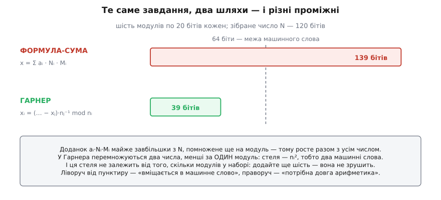
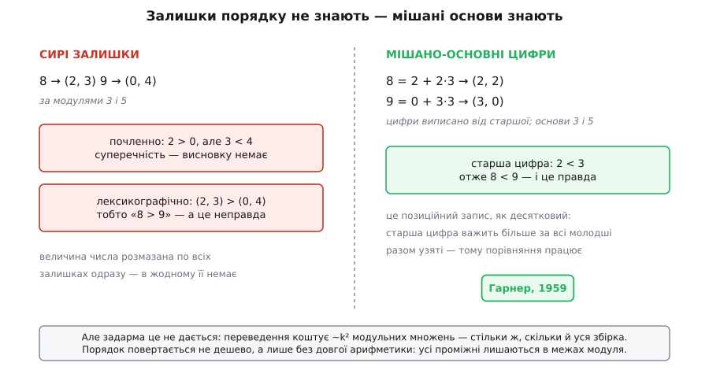
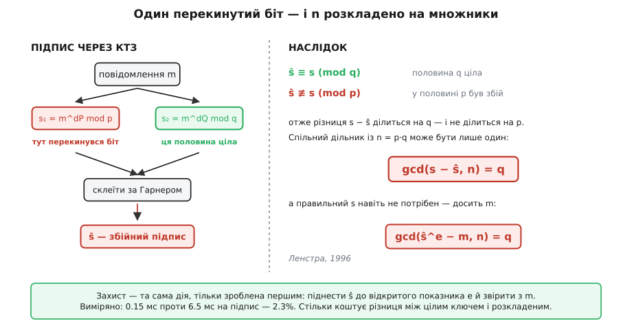

# ⚙️ Розв'язувач: склеїти, не роздути й не віддати ключ

Формула *x* = Σ *a*ᵢ·*N*ᵢ·*M*ᵢ (mod *N*) — це доведення, переписане в рядок коду. Воно чесне, вичерпне й на трьох малих модулях працює бездоганно. Але писалося воно, щоб **переконувати**, а не щоб рахувати, — і щойно його просять попрацювати з реальними даними, стає видно, скільки воно мовчки припускає.

Припущень рівно три, і в кожного своя ціна.

**Модулі мусять бути попарно взаємно прості.** Дані про це не знали. Період опитування датчика 12 і період кадру 18 не питали дозволу мати спільну шістку — а формула на них не зупиниться з помилкою. Вона обчислить обернений там, де його немає, і поверне число, що не задовольняє жодного з двох рівнянь.

**Проміжним потрібно більше місця, ніж самій відповіді.** Кожен доданок *a*ᵢ·*N*ᵢ·*M*ᵢ — це майже все *N*, помножене ще й на модуль. Щоб зібрати число, яке саме́ спокійно лягає в машинне слово, формула вимагає арифметики, що в це слово вже не лягає.

**А там, де теорема справді заробляє свій хліб, вона ж робить ключ крихким.** RSA-CRT — не вправа: це чотириразове прискорення в кожному рукостисканні TLS на планеті. І воно ж перетворює один перекинутий біт на повний розклад модуля на множники.

Три вимоги — три відповіді: склеювання парами, мішано-основні цифри Гарнера й перевірка ціною 2.3%. Нижче — робочий код на кожну.

## Склеювання, що не питає про взаємну простоту

Формула-сума будує всі «чисті одиниці» **разом**, одним махом, і саме тому вимагає, щоб усі модулі одразу були взаємно прості: кожне *N*ᵢ мусить мати обернений за своїм *n*ᵢ. Обійти вимогу можна, відмовившись від «одним махом». Беремо два рівняння, зводимо їх в одне — і повторюємо, поки рівняння не лишиться одне. Два рівняння за раз — задача, у якій усе видно.

Нехай *x* ≡ *a*₁ (mod *n*₁) та *x* ≡ *a*₂ (mod *n*₂), і *g* = НСД(*n*₁, *n*₂) цього разу не обов'язково одиниця. Перше рівняння каже, що *x* = *a*₁ + *n*₁·*t* для якогось цілого *t*, — воно вичерпне, бо описує геть усі числа з таким залишком. Підставмо його в друге й подивімося, що воно вимагає від *t*:

```
a₁ + n₁·t ≡ a₂        (mod n₂)
      n₁·t ≡ a₂ − a₁   (mod n₂)
```

Це лінійна конгруенція, і питання про неї давнє: коли кратні *n*₁ дають за модулем *n*₂ саме те, що треба? Кратні *n*₁ за модулем *n*₂ пробігають не всі лишки, а рівно кратні *g* — бо *g* ділить і *n*₁, і *n*₂, тож ділить і будь-яке *n*₁·*t* − *k*·*n*₂. Отже, коли *a*₂ − *a*₁ не кратне *g*, розв'язку немає взагалі. Це й є **умова сумісності**: на спільному дільнику обидва модулі мусять розповідати одне й те саме.

А коли кратне — ділимо всю конгруенцію на *g*:

```
(n₁/g)·t ≡ (a₂ − a₁)/g   (mod n₂/g)
```

і ось тут стається головне. Числа *n*₁/*g* та *n*₂/*g* взаємно прості **завжди** — ділення на найбільший спільний дільник забирає з них усе спільне до останку. Тому обернений існує, і його існування ми не випрошуємо у вхідних даних, а виготовляємо самі:

```
t ≡ ((a₂ − a₁)/g) · (n₁/g)⁻¹   (mod n₂/g)
x = a₁ + n₁·t                    (mod n₁·(n₂/g) = НСК(n₁, n₂))
```

Модулем відповіді виходить не добуток, а [найменше спільне кратне](topic:math/lcm) — рівно те, чого й слід чекати: спільну частину два модулі бачать удвох, і платити за неї двічі нема сенсу.

Ця дрібна алгебра дала більше, ніж просили. По-перше, взаємна простота перестала бути передумовою й стала окремим випадком (*g* = 1 → НСК = добуток → та сама класична відповідь). По-друге — і це вийшло задарма — **проміжні тут нікуди не роздуваються**: *t* менше за *n*₂/*g*, тому добуток *n*₁·*t* менший за НСК, тобто за саму відповідь. Формула-сума виходила за *N*, щоб туди повернутися; склеювання парами за *N* просто не виходить.

:::tabs
```py
from math import gcd

def crt_pair(a1, n1, a2, n2):
    """Звести x ≡ a1 (mod n1) та x ≡ a2 (mod n2) в одне рівняння.
    Повертає (a, НСК) або None, якщо система суперечлива."""
    g = gcd(n1, n2)
    if (a2 - a1) % g:
        return None                                  # умова сумісності не виконана
    lcm = n1 // g * n2                               # ділимо ДО множення — щоб не роздути
    t = (a2 - a1) // g * pow(n1 // g, -1, n2 // g) % (n2 // g)
    return (a1 + n1 * t) % lcm, lcm

def crt(residues, moduli):
    """Склеїти всю систему драбинкою: пара за парою."""
    a, n = 0, 1                                      # x ≡ 0 (mod 1) — істинне для всіх x
    for ai, ni in zip(residues, moduli):
        merged = crt_pair(a, n, ai % ni, ni)
        if merged is None:
            return None
        a, n = merged
    return a, n

print(crt([2, 3, 2], [3, 5, 7]))      # (23, 105)  — задача Сунь-цзи
print(crt_pair(3, 4, 5, 6))           # (11, 12)   — модулі НЕ взаємно прості, та це не завада
print(crt_pair(0, 4, 1, 6))           # None       — парне й непарне водночас
```
```cpp
#include <cstdint>
#include <numeric>      // std::gcd
#include <optional>
#include <vector>

struct Cong { int64_t a, n; };        // x ≡ a (mod n)

// розширений Евклід: НСД(a, b) плюс x, y такі, що a·x + b·y = НСД(a, b)
static int64_t egcd(int64_t a, int64_t b, int64_t &x, int64_t &y) {
    if (b == 0) { x = 1; y = 0; return a; }
    int64_t x1, y1;
    int64_t g = egcd(b, a % b, x1, y1);
    x = y1;
    y = x1 - (a / b) * y1;
    return g;
}

static int64_t inv_mod(int64_t a, int64_t m) {
    int64_t x, y;
    egcd((a % m + m) % m, m, x, y);
    return (x % m + m) % m;            // egcd може дати від'ємний x — нормалізуємо
}

std::optional<Cong> crt_pair(Cong u, Cong v) {
    int64_t g = std::gcd(u.n, v.n);
    int64_t diff = v.a - u.a;
    if (diff % g != 0) return std::nullopt;          // умова сумісності не виконана
    int64_t m = v.n / g;                             // модуль, за яким шукаємо t
    int64_t lcm = u.n * m;                           // ділили ДО множення: це НСК, не добуток
    // (diff/g mod m) · inv — обидва множники менші за m, добуток менший за m²
    int64_t t = (int64_t)((__int128)(diff / g) % m * inv_mod(u.n / g, m) % m);
    if (t < 0) t += m;
    __int128 x = (__int128)u.n * t + u.a;            // < НСК + n₁ — тільки тут потрібні 128 біт
    return Cong{ (int64_t)((x % lcm + lcm) % lcm), lcm };
}

std::optional<Cong> crt(const std::vector<int64_t> &res, const std::vector<int64_t> &mod) {
    Cong acc{0, 1};                                  // x ≡ 0 (mod 1) — істинне для всіх x
    for (size_t i = 0; i < mod.size(); ++i) {
        auto merged = crt_pair(acc, Cong{res[i] % mod[i], mod[i]});
        if (!merged) return std::nullopt;
        acc = *merged;
    }
    return acc;
}
```
:::

Драбинка стартує з *x* ≡ 0 (mod 1) — рівняння, істинного для кожного цілого. Це не хитрощі, а нейтральний елемент склеювання: воно нічого не стверджує, тому додати його безпечно, а з ним цикл не потребує окремого випадку для першого кроку.

Обидві вкладки роблять одне, але розходяться в тому, що́ кожна мова бере на себе. Python зі своєю довгою арифметикою дозволяє написати `(a1 + n1 * t) % lcm` і більше про це не думати. У C++ кожне з трьох множень доводиться проводити очима: `u.n * m` дає НСК і мусить уміститися в `int64_t` (перевірити це — обов'язок того, хто добирає модулі); `(diff/g) · inv` менше за *m*², тому просить 128 бітів; `u.n · t` менше за НСК і просить їх теж, бо межу перевіряють **до** зведення, а не після.

Порядок `n1 // g * n2` замість `n1 * n2 // g` — не косметика. Обидва дають те саме НСК, але другий спершу будує добуток, який може й не вміститися, і аж тоді ділить. Ділити треба **до** множення, поки є що ділити.

Правильність такого склеювання легко перевірити не на око: обійти всі модулі *n*₁, *n*₂ до 24 і всі залишки при них, для кожної пари знайти розв'язки повним перебором і звірити. Код вище проходить цю звірку без жодної розбіжності: там, де перебір знаходить розв'язок, знаходить і `crt_pair`, а модулем відповіді щоразу виявляється саме НСК.

## Гарнер: цифри замість доданків

Друга вимога — про розмір проміжних — знялася в склеюванні парами випадково, побічним наслідком того, як лягла алгебра. Покладатися на випадок не хочеться, тож поставмо питання прямо: чи можна зібрати число з залишків так, щоб **жодне** проміжне не переросло модуля?

Відповідь ствердна, і ідея в неї стара, як позиційний запис. Формула-сума складає *x* із доданків, кожен з яких завбільшки з усю відповідь: аби дістати 23 за модулями 3, 5, 7, вона рахує 2·70 + 3·21 + 2·15 = 233 і аж тоді зводить. Кожен доданок тягне повну вагу числа. А позиційний запис робить навпаки: 23 — це «двійка й трійка», дві цифри, кожна крихітна, і вага живе не в цифрах, а в **розрядах**.

Перенесімо цю думку на залишки. Шукаймо *x* не як суму великих доданків, а як число, записане в системі, де розряди мають ваги 1, *n*₀, *n*₀*n*₁, …:

```
x = d₀ + d₁·n₀ + d₂·n₀n₁ + … + d_{k−1}·n₀n₁…n_{k−2}      де 0 ≤ dᵢ < nᵢ
```

Це **мішано-основне подання** (mixed-radix): позиційний запис, у якого основа своя на кожному розряді. Годинник — рівно він: «2 доби 7 годин 45 хвилин» — це цифри 45, 7, 2 при основах 60 і 24, а число за ними — 45 + 7·60 + 2·60·24 = 3345 хвилин.

Тепер цифри треба знайти, і вони знаходяться самі, одна по одній. Візьмімо запис за модулем *n*₀: усі доданки, крім першого, кратні *n*₀ і зникають, лишається *d*₀ = *a*₀. Перша цифра дісталася задарма. Візьмімо його ж за модулем *n*₁: зникають усі доданки, крім двох перших, і лишається *a*₁ = *d*₀ + *d*₁·*n*₀ (mod *n*₁), звідки *d*₁ = (*a*₁ − *d*₀)·*n*₀⁻¹ (mod *n*₁). За модулем *n*₂ виживають три доданки — і так далі. Кожна наступна цифра вимагає лише вже знайдених:

```
d₀ = a₀                                                  (mod n₀)
d₁ = (a₁ − d₀) · n₀⁻¹                                    (mod n₁)
d₂ = ((a₂ − d₀) · n₀⁻¹ − d₁) · n₁⁻¹                      (mod n₂)
…
```

Придивіться до правих частин. Кожна дія — це віднімання двох чисел, менших за *n*ᵢ, і множення на обернений, теж менший за *n*ᵢ. **Стеля проміжного — *n*ᵢ², квадрат ОДНОГО модуля.** Не *N*, не *k*·*N*, а квадрат найменшої деталі в усій задачі. Скільки б модулів не було в наборі — шість, шістдесят — ця стеля не зрушить ні на біт.


*Виміряно на шести двадцятибітових модулях. Формула-сума будує проміжні на 139 бітів, щоб зібрати 120-бітову відповідь: вона мусить піднятися вище за ціль, аби потім спуститися. Гарнер лишається на 39 бітах — це рівно 2·20 з копійкою, квадрат одного модуля. Пунктир — межа машинного слова: усе, що ліворуч, множиться однією командою процесора, усе, що праворуч, потребує довгої арифметики.*

Алгоритм цей носить ім'я Гарві Ґарнера, який описав його 1959 року в статті «The Residue Number System» (IRE Transactions on Electronic Computers, EC-8, № 2, с. 140–147) — і описав не як окрему знахідку, а як частину відповіді на питання, що йому справді муляло. Питання те виявиться цікавішим за саму економію бітів.

:::tabs
```py
def garner_digits(residues, moduli):
    """Мішано-основні цифри: x = d[0] + d[1]·n[0] + d[2]·n[0]n[1] + …"""
    k = len(moduli)
    inv = [[0] * k for _ in range(k)]                # inv[i][j] = n[j]⁻¹ mod n[i]
    for i in range(k):                               # модулі сталі → таблиця рахується РАЗ
        for j in range(i):
            inv[i][j] = pow(moduli[j], -1, moduli[i])
    d = [0] * k
    for i in range(k):
        di = residues[i] % moduli[i]
        for j in range(i):
            di = (di - d[j]) * inv[i][j] % moduli[i]  # обидва множники < n[i]: стеля n[i]²
        d[i] = di
    return d

def garner(residues, moduli):
    d = garner_digits(residues, moduli)
    x, weight = 0, 1
    for di, ni in zip(d, moduli):                    # ЛИШЕ тут число доростає до N
        x += di * weight
        weight *= ni
    return x

print(garner_digits([2, 3, 2], [3, 5, 7]))   # [2, 2, 1]
print(garner([2, 3, 2], [3, 5, 7]))          # 23 = 2 + 2·3 + 1·15
```
```cpp
#include <cstdint>
#include <vector>

// Мішано-основні цифри: x = d[0] + d[1]·n[0] + d[2]·n[0]n[1] + …
std::vector<int64_t> garner_digits(const std::vector<int64_t> &a,
                                   const std::vector<int64_t> &n) {
    size_t k = n.size();
    // модулі сталі → таблицю обернених рахують РАЗ і тримають поруч із ними
    std::vector<std::vector<int64_t>> inv(k, std::vector<int64_t>(k, 0));
    for (size_t i = 0; i < k; ++i)
        for (size_t j = 0; j < i; ++j)
            inv[i][j] = inv_mod(n[j], n[i]);

    std::vector<int64_t> d(k);
    for (size_t i = 0; i < k; ++i) {
        int64_t di = a[i] % n[i];
        for (size_t j = 0; j < i; ++j) {
            int64_t t = (di - d[j]) % n[i];
            if (t < 0) t += n[i];
            // t < n[i] та inv < n[i] → добуток < n[i]²: стеля у два машинні слова
            di = (int64_t)((__int128)t * inv[i][j] % n[i]);
        }
        d[i] = di;
    }
    return d;                          // жодне число тут не переросло n[i]²
}
```
:::

C++-вкладка обриває розповідь там, де вона й мусить обірватися. Цифри пораховано — і кожне число, що брало участь у їхньому обчисленні, лишилося в межах двох машинних слів. **Збірка `x` = Σ *d*ᵢ·*w*ᵢ у неї не входить навмисно**: саме на цьому кроці число доростає до *N*, а отже, потребує довгої арифметики. Тож поки задача цього не вимагає, цей крок просто не роблять — і в цьому вся економія. Питання «а чи не завелике *x*?» ставлять цифрам, а не числу.

> 🔧 **Навіщо це.** Різниця між 139 і 39 бітами — це не «швидше на скільки-то відсотків», а різниця в **тому, що взагалі потрібно від машини**. 39 бітів множаться однією командою процесора; 139 вимагають бібліотеки довгої арифметики, купи, розподілу пам'яті. У мікроконтролері з `int64_t` й без `malloc` перший шлях просто працює, а другий не існує. І тут же — тиха пастка формули-суми: вона не падає й не сигналить. Вона мовчки переповнюється, тихо псує відповідь і лишає її схожою на правду.

## Порядок, повернутий мішаними основами

Формула-сума й Гарнер видають те саме число — я звірив обидва шляхи проти істини на трьохстах випадкових системах із двома-шістьма двадцятибітовими модулями, розбіжностей нема. Але Гарнер видає **дорогою** дещо, чого у формули-суми немає взагалі, і це дещо цінніше за економію бітів.

Річ у тім, що набір залишків нічого не знає про **величину** числа. Візьмімо модулі 3 і 5: число 8 має залишки (2, 3), число 9 — (0, 4). Хто більший? Почленно виходить суперечність: 2 > 0, але 3 < 4. Лексикографічно (2, 3) > (0, 4) — тобто «8 > 9», відверта неправда. І це не невдалий добір: величина числа розмазана по всіх залишках одразу, і в жодному окремому її немає. Із самих залишків, хоч як їх крути, порядку не видобути.

А тепер ті самі числа мішаними основами. 8 = 2 + 2·3 — цифри від старшої (2, 2). 9 = 0 + 3·3 — цифри від старшої (3, 0). Порівнюємо, як десяткові: старша 2 проти старшої 3, отже 8 < 9. І це правда, видна з першого ж розряду.


*Мішано-основне подання позиційне — а в позиційному записі старший розряд важить більше за всі молодші разом узяті. Саме тому цифри порівнюються, а залишки — ні. Перевірено вичерпно: упорядкувати всі числа 0…14 за їхніми мішано-основними цифрами при основах 3 і 5 — і вони стають рівно в ряд 0, 1, 2, …, 14; те саме на основах 3, 5, 7 для всіх 0…104.*

Ось що Ґарнерові муляло. Його стаття 1959 року прямо називає визначення відносної величини двох чисел головною бідою залишкового кодування — і мішані основи були його відповіддю на цю біду, а не оптимізацією збірки. Обернені перетворювачі в апаратурі залишкових класів досі будують на mixed-radix conversion саме з цієї причини.

Але тут потрібна чесність, бо спокуса зробити з цього більший висновок, ніж є, велика. Мішані основи **не роблять порівняння дешевим**. Дістати цифри коштує ~*k*²/2 модульних множень — приблизно стільки ж, скільки й уся збірка; проти одного покоординатного множення це ціла вічність. Вони роблять порівняння **можливим у скінченній ширині** — без довгої арифметики, без купи, у регістрах. Це багато, але це інша річ. Економічний присуд лишається незрушним: залишкові класи виграють там, де множень багато, а порівнянь мало, і програють скрізь інде — Гарнер полагодив ширину, а не ціну.

## Канали, що не розмовляють між собою

Тепер видно, з чого складається система залишкових класів (RNS) як робочий інструмент: набір сталих модулів, покоординатна арифметика й Гарнер на виході.

Назву їй дала Ґарнерова стаття 1959 року — але назвати не означає відкрити першим. Мирослав Валах описав кодування класами лишків ще 1955-го в Чехословаччині («Vznik kódu a číselné soustavy zbytkových tříd», збірник «Stroje na zpracování informací», III); того ж року й там-таки вийшла його спільна з Антоніном Свободою праця про операторні схеми, а вдвох вони збудували експериментальну машину на залишковій арифметиці. Ґарнер працював у США незалежно й майже одночасно — це подвійне відкриття, а не запозичення. Просто чехословацька нитка вийшла друком на чотири роки раніше, а американська дала системі ім'я, під яким її тепер знають.

Добирати модулі можна не як заманеться — від них залежить, скільки коштує зведення. Канонічний «дешевий» набір такий:

```
{ 2ⁿ − 1,  2ⁿ,  2ⁿ + 1 }
```

Взаємна простота тут дається майже задарма: 2ⁿ−1 і 2ⁿ — сусіди, 2ⁿ і 2ⁿ+1 — сусіди, а НСД(2ⁿ−1, 2ⁿ+1) = НСД(2ⁿ−1, 2) = 1, бо 2ⁿ−1 непарне. Але цінні вони іншим: зведення за 2ⁿ — це маскування бітів, за 2ⁿ−1 — додавання з круговим переносом. Жодного ділення. Саме тому такі модулі в літературі й звуть **дешевими** (low-cost moduli), і саме цей набір десятиліттями стоїть в основі апаратури залишкових класів.

Візьмімо *n* = 16 — набір {65535, 65536, 65537}:

```cpp
#include <array>
#include <cstdint>

// Три канали по 16–17 бітів дають динамічний діапазон 48 бітів:
// 65535 · 65536 · 65537 = 281474976645120 ≈ 2⁴⁸
constexpr std::array<uint32_t, 3> M{65535u, 65536u, 65537u};

struct Rns { std::array<uint32_t, 3> c; };

Rns to_rns(uint64_t x) {
    return {{ uint32_t(x % M[0]), uint32_t(x % M[1]), uint32_t(x % M[2]) }};
}

Rns add(const Rns &a, const Rns &b) {
    Rns r{};
    for (int i = 0; i < 3; ++i) {
        uint32_t s = a.c[i] + b.c[i];            // < 2·65537 — уміщається легко
        r.c[i] = (s >= M[i]) ? s - M[i] : s;     // жодного переносу до сусіднього каналу
    }
    return r;
}

Rns mul(const Rns &a, const Rns &b) {
    Rns r{};
    for (int i = 0; i < 3; ++i)
        r.c[i] = uint32_t((uint64_t)a.c[i] * b.c[i] % M[i]);   // ⚠️ зняти uint64_t — і див. нижче
    return r;
}
```

Погляньте на цикли. У них немає ані рядка, що зв'язує канал *i* з каналом *j*. Ані переносу, ані прапорця, ані порядку — три ітерації незалежні настільки, що їх можна розкласти по трьох окремих АЛП, по трьох смугах SIMD-регістра або по трьох ділянках кристала, і вони не перемовляться жодним бітом. Ось і вся причина, чому залишкові класи взагалі існують: у звичайному додаванні старший біт мусить дочекатися молодшого, а тут чекати нема на кого й нема чого.

Але в `mul` схована пастка, і вона гарна тим, наскільки тихо влаштована. Здається природним, що добуток двох 16-бітових залишків уміститься в `uint32_t`, — і в двох каналах із трьох це правда. У каналі за модулем 65537 залишок пробігає 0…65536, тобто 17 бітів, і найбільший добуток дорівнює:

```
65536 · 65536 = 4294967296
UINT32_MAX    = 4294967295
різниця       = 1
```

Переповнення рівно на одиницю — і лише тоді, коли **обидва** залишки дорівнюють точно 65536. Імовірність на випадкову пару — 1/65537² ≈ 2.3·10⁻¹⁰, тобто раз на 4.3 мільярда множень. Такий код пройде всі тести, весь бета-етап і перші роки в полі, а тоді один раз віддасть тихо неправильне число. Це загальне правило добору модулів: важить не те, скільки бітів у модуля, а те, скільки їх у **квадраті** максимального залишку.

Зворотний перетворювач — той самий `garner_digits` із таблицею обернених, порахованою один раз при старті (модулі ж сталі), плюс збірка `d[0] + d[1]·M[0] + d[2]·M[0]·M[1]` у `uint64_t`. Я прогнав додавання, множення й збірку на 20 тисячах випадкових пар із діапазону: жодного переповнення, жодної розбіжності з прямою арифметикою за модулем *N*. Найбільше проміжне за весь прогін — 32 біти, при тому, що саме число має 48.

## RSA-CRT: виміряне прискорення

Найгучніше застосування теореми записане в стандарті, і записане дуже конкретно. RFC 8017 (PKCS #1 v2.2) дозволяє зберігати приватний ключ [RSA](topic:algorithms/rsa) не парою (*n*, *d*), а квінтетом:

```
(p, q, dP, dQ, qInv)      де   e·dP  ≡ 1  (mod p−1)
                                e·dQ  ≡ 1  (mod q−1)
                                q·qInv ≡ 1  (mod p)
```

Три останні величини залежать лише від самого ключа — ні від повідомлення, ні від чого іншого. Тож їх рахують один раз, при породженні ключа, і відтоді просто носять у його файлі.

А тепер найцікавіше: як саме стандарт велить із них рахувати. Ось його рецепт дослівно:

```
m₁ = c^dP mod p
m₂ = c^dQ mod q
h  = (m₁ − m₂) · qInv mod p
m  = m₂ + q · h
```

Це не формула-сума. Це **Гарнер на двох модулях** — і RFC 8017 називає його на ім'я у примітці. Розпишіть *m*₂ + *q*·*h* — і побачите мішано-основний запис із розрядами вагою 1 та *q*: молодша цифра *m*₂, старша *h*. Найбільше проміжне тут *q*·*h* < *q*·*p* = *n*, тобто рівно завбільшки з відповідь, ні бітом більше. Формула-сума на цьому ж місці вимагала б числа, більшого за *n*, — тобто зайвого слова пам'яті на кожному підписі кожного сервера світу.

Заразом видно, як воно узагальнюється на більш ніж дві прості: RFC 8017 описує й багатопростий RSA, де до квінтета додаються трійки (*r*ᵢ, *d*ᵢ, *t*ᵢ), а рецепт стає точнісінько драбинкою Гарнера — `h = (mᵢ − m)·tᵢ mod rᵢ`, `m = m + R·h`, з накопиченням ваги `R`.

Порахуймо, скільки це справді дає. Ключ на 2048 бітів, прості на 1024, [піднесення до степеня за модулем](topic:math/modular-exponentiation) — вбудоване:

```py
def sign_plain(m):
    return pow(m, d, n)                    # один степінь за 2048-бітовим модулем

def sign_crt(m):
    m1 = pow(m, dP, p)                     # два степені за 1024-бітовими модулями
    m2 = pow(m, dQ, q)
    h = (m1 - m2) * qInv % p               # Гарнер на двох модулях
    return m2 + q * h

assert sign_plain(msg) == sign_crt(msg)    # те саме число, іншим шляхом
```

Виміряно, три прогони по сто підписів:

```
напряму:      22.0 мс на підпис
через КТЗ:     6.5 мс на підпис
прискорення:   3.3×
```

Теорія обіцяла вчетверо, вийшло втричі з третиною — і розходження варте того, щоб його не замітати. Обіцянка ×4 виходить із чистого куба: піднесення до степеня коштує ~*m* множень по ~*m*² кожне, тож удвічі коротший модуль дешевший увосьмеро, а таких обчислень два. Але в реальному підписі, крім двох степенів, є ще робота, якої в моделі нема: два зведення *m* за *p* і за *q*, склеювання Гарнера, множення *q*·*h* за повною довжиною. Кожен доданок дрібний, разом вони з'їдають десь шосту частину виграшу. Модель кубічної вартості не збрехала — вона просто рахувала лише те, що обіцяла рахувати. Це звична доля асимптотик: вони кажуть правду про **форму** кривої й мовчать про сталі, а на скромних розмірах сталі ще видно.

## Один біт — і ключа немає

І ось за це прискорення надходить рахунок.

Придивімося до `sign_crt` очима не власника ключа, а того, хто на нього дивиться збоку. Підпис збирають із двох половин. Половина *p* нічого не знає про *q*, половина *q* нічого не знає про *p*. А тепер уявіть, що в одній із них — байдуже, від скачка живлення, лазера по кристалу, перегрітої пам'яті чи просто бракованого модуля — перекинувся **один біт**.

Будова склеювання робить збійний підпис ŝ дивовижно асиметричним. Половина *q* ціла, тому ŝ ≡ *s* (mod *q*). Половина *p* зіпсована, тому ŝ ≢ *s* (mod *p*). Отже, різниця *s* − ŝ ділиться на *q* і не ділиться на *p*. А *n* = *p*·*q* інших дільників не має:

```
НСД(s − ŝ, n) = q
```

Той самий НСД, той самий алгоритм Евкліда, мілісекунди — і модуль розкладено на множники. Ключ, чия стійкість тримається на неможливості розкласти 2048-бітове число, віддає свої прості з різниці двох підписів.


*Уся сила теореми тут обертається проти власника ключа. Незалежність половин — те, заради чого все й будувалося, — означає, що збій в одній не псує другої. А одна ціла половина з двох — це рівно стільки інформації, скільки треба, щоб відділити p від q.*

Історія цього відкриття варта точності, бо переказують її часто нашвидкуруч. 1996 року троє співробітників Bellcore (Bell Communications Research) — Ден Боне, Річард ДеМілло й Річард Ліптон — показали, що обчислювальний збій у криптографічному протоколі видає секрет; повна праця «On the Importance of Checking Cryptographic Protocols for Faults» вийшла на EUROCRYPT'97. Звідси й назва «атака Bellcore». Але формула вище — не зовсім їхня. Прочитавши **газетні** повідомлення про ту атаку на смарт-карти, Ар'єн Ленстра 28 вересня 1996 року, працюючи тоді в Citibank, розіслав службову записку «Memo on RSA signature generation in the presence of faults», де показав дещо гірше. Варіант Bellcore вимагає **правильного й збійного** підписів того самого повідомлення. Ленстрі досить самого повідомлення й **одного** збійного підпису — правильний не потрібен взагалі:

```
НСД(ŝ^e − m, n) = q
```

Бо ŝ^*e* ≡ *m* (mod *q*), де половина ціла, і ŝ^*e* ≢ *m* (mod *p*), де був збій. А *e* — відкритий показник; його знає кожен, хто має сертифікат.

Перевірмо на живому ключі. Один випадковий біт у половині *p*:

```py
from math import gcd

def sign_crt_faulty(m, rng):
    m1 = pow(m, dP, p)
    m2 = pow(m, dQ, q)
    m1 ^= 1 << rng.randrange(m1.bit_length())      # один перекинутий біт
    h = (m1 - m2) * qInv % p
    return m2 + q * h

s_bad = sign_crt_faulty(msg, rng)
print(gcd(pow(s_bad, e, n) - msg, n) == q)         # True — за 0.15 мс
```

Двісті випадкових однобітових збоїв у половині *p* — двісті влучань із двохсот, щоразу рівно *q*. Двісті збоїв у половині *q* — двісті влучань, щоразу рівно *p*. Це не імовірнісна атака з відсотком успіху, який можна перетерпіти; це арифметична тотожність, що спрацьовує щоразу. Вартість — 0.15 мс.

А тепер найкраще в усій цій історії. Ось захист:

```py
def sign_crt_checked(m):
    m1 = pow(m, dP, p)
    m2 = pow(m, dQ, q)
    h = (m1 - m2) * qInv % p
    s = m2 + q * h
    if pow(s, e, n) != m % n:                      # звірити ВЛАСНИЙ підпис перед віддачею
        raise ValueError("збій виявлено — підпис не віддаємо")
    return s
```

Придивіться, що тут відбувається. `pow(s, e, n)` — це **та сама дія, що й атака**. Ленстра рахує ŝ^*e* mod *n*, і захист рахує *s*^*e* mod *n*; одне піднесення до відкритого показника. Різниця лише в тому, **хто встиг першим**. Хто зробив це до віддачі підпису — побачив розбіжність і промовчав. Хто не зробив — віддав підпис, і тоді цю саму дію робить хтось інший, уже після.

Коштує вона копійки — і саме тому, що *e* = 65537 має всього 17 бітів: сімнадцять піднесень до квадрата проти тисячі з гаком у секретного показника.

```
підпис через КТЗ:   6.5   мс
перевірка (e):      0.15  мс   →   2.3%
```

**2.3%** — стільки коштує різниця між цілим ключем і розкладеним. Аді Шамір запропонував свій, витонченіший захист: рахувати обидві половини за розширеними модулями *p*·*r* та *q*·*r* з малим випадковим *r*, а тоді звірити їх між собою вже за *r* (представлено на rump-сесії EUROCRYPT'97, патент US 5,991,415, подано 12 травня 1997, видано 23 листопада 1999). Але він вимагає секретного показника *d* — а в апаратурі, що заради місця тримає самий лише квінтет КТЗ, того *d* може просто не бути під рукою. Для найпоширенішого ж випадку — RSA з малим *e* — просте піднесення до *e* б'є будь-яку елегантнішу схему: воно нічого не потребує понад те, що вже є, і перевіряє саме те, що піде назовні.

І остання деталь, після якої це перестає бути гарною теорією. Ці 2.3% економили. У вересні 2015 року Флоріан Ваймер із Red Hat опублікував працю «Factoring RSA Keys With TLS Perfect Forward Secrecy»: він просто **під'єднувався** до TLS-серверів у мережі й збирав підписи. Жодного лазера, жодного скачка живлення — самих природних апаратних збоїв вистачило, щоб розкласти ключі бойових пристроїв: балансувальника навантаження Citrix, обладнання Hillstone Networks, Nortel, Viprinet. Іронія в тому, чому це стало можливим саме тоді: доти більшість TLS-з'єднань підписів RSA просто не робила, а коли світ, дбаючи про безпеку, перейшов на forward secrecy, кожне рукостискання почало підписувати — і дев'ятнадцятирічна вразливість дочекалася свого. Латали довго й нарізно: OpenSSL і NSS мали захист давно, OpenJDK полагодили у квітні 2015-го (CVE-2015-0478), libgcrypt — уже після публікації.

## Складність і пастки

Уся арифметика вище — на *k* модулях по *b* бітів, при *N* = ∏*n*ᵢ:

```
склеювання парами        k · (Евклід + 2 множення)      проміжні: < НСК, ніколи більше
цифри Гарнера            ~k²/2 модульних множень        проміжні: < nᵢ², стеля — два слова
збірка з цифр            k множень наростаючої ваги     проміжні: доростають до N
формула-сума             k · (Евклід + 2 множення)      проміжні: ~N·nᵢ, тобто ширші за N
RNS: +, −, ·             k незалежних дій по b бітів    переносів немає взагалі
RNS: <, знак, переповнення   через Гарнера, ~k²/2 множень   тобто ціною всієї збірки
RSA-CRT                  2 степені по півдовжини модуля  виміряно 3.3× проти 4× у моделі
```

Пастки, кожна з яких тут коштувала окремої перевірки:

**Модулі, що на око різні.** 12 і 18 не взаємно прості. Класична формула на них не впаде — обчислить обернений, якого немає, і поверне неправду. `crt_pair` вище на них працює чесно, бо будує обернений там, де той гарантовано існує, — після ділення на НСД.

**`n1 * n2 // g` замість `n1 // g * n2`.** Те саме НСК, але перший спершу зводить добуток, який може й не вміститися. Ділити треба до множення.

**Квадрат залишку, а не сам залишок.** Модуль 65537 — це 17 бітів, добуток двох залишків — 33, і `uint32_t` переповнюється рівно на одиницю, раз на 4.3 мільярда множень. Ширину типу диктує найбільше **проміжне**, а не найбільша величина.

**Формула-сума в скінченній ширині.** Проміжні ширші за відповідь. Не падає, не сигналить — псує тихо. Це найгірший вид помилки: результат схожий на правду.

**RSA-CRT без перевірки.** Один біт — і ключа немає. 2.3%.

> 🔧 **Навіщо це.** Крізь усі сюжети вище проходить одна думка, і вона не про залишки. **Формула, що доводить існування відповіді, майже ніколи не є найкращим способом ту відповідь дістати** — бо доведення оптимізують під переконливість, а не під машину. Σ *a*ᵢ·*N*ᵢ·*M*ᵢ прекрасна на дошці й марнотратна в регістрі: вона будує проміжні, ширші за власну ціль, тільки щоб потім із них спуститися. Гарнер рахує те саме число, не піднімаючись вище за квадрат одного модуля, — і дорогою віддає порядок, якого в залишках не було зовсім. RFC 8017 обрав саме його не з любові до історії, а тому що інакше кожен підпис у світі коштував би зайвого слова. І та ж мораль із другого боку: RSA-CRT показує, що виграш у швидкодії — це завжди обмін, а не подарунок. Розібравши задачу на дві незалежні половини, ви дістали вчетверо (насправді втричі з третиною) і водночас створили нову поверхню, якої в цілісного обчислення не було, — бо збій в одній половині тепер не псує другої, а **свідчить** проти неї. Питати «що ще, крім швидкості, змінила ця оптимізація» треба тієї ж миті, коли її роблять. Тут відповідь коштувала 2.3% — і дев'ятнадцять років по світу ходили пристрої, що їх не заплатили.
