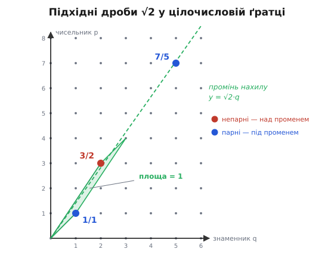

# Рекурентна формула підхідних дробів і тотожність ±1

Підхідний дріб — це ланцюговий дріб, обірваний на кількох перших неповних частках і згорнутий назад у звичайне *pₙ/qₙ*. Тут ми виведемо коротке правило, яким чисельник і знаменник кожного наступного підхідного дробу народжуються з двох попередніх самим лише додаванням і множенням; доведемо тотожність, що зшиває сусідні підхідні дроби в жорстку пару з різницею рівно ±1; і з неї дістанемо **точну** похибку кожного наближення. Усе це — наслідки однієї думки: ланцюговий дріб є добутком крихітних матриць 2×2.

## Башта — це композиція однієї-єдиної дії

Згортати щоразу всю багатоповерхову башту згори наче й можна, але це марудно й дедалі довше. Придивімося натомість, з чого башта складена:

```
              1
Cₙ = a₀ + ─────────────────
                   1
          a₁ + ───────────
                     1
             ⋱ + ─────────
                     aₙ
```

Кожен поверх робить із тим, що сидить під ним, ту саму дію: бере його значення, перевертає й додає чергове ціле. Якщо все нижче поверха має значення *t*, то поверх обертає його на *a + 1/t*. Одна операція, повторена *n* разів:

```
φₐ(t) = a + 1/t
```

Уся підхідна дріб — це стос таких операцій, вкладених одна в одну:

```
Cₙ = φₐ₀( φₐ₁( … φₐₙ(∞) … ) )
```

Чому в самому низу стоїть ∞? Найглибший поверх — це просто *aₙ*, під ним нічого немає. Але *aₙ = aₙ + 1/∞*, бо ділення на нескінченність дає нуль; отже, «нічого під поверхом» — це і є φₐₙ(∞). Так уся башта стає чистою композицією копій одного відображення φₐ, які різняться лише цілим числом *a*.

І ось факт, що обертає цю композицію на арифметику. Відображення φₐ — дробово-лінійне: лінійне зверху, лінійне знизу.

```
φₐ(t) = a + 1/t = (a·t + 1)/(1·t + 0)
```

Припишімо кожному такому відображенню табличку з його чотирьох коефіцієнтів — матрицю 2×2:

```
φₐ  ↔  ⎡ a  1 ⎤
       ⎣ 1  0 ⎦
```

Тепер складімо два відображення поспіль і розкриймо алгебру. Спершу φₐ₁(t) = (a₁t + 1)/t, потім у нього ще раз:

```
φₐ₀( φₐ₁(t) ) = a₀ + t/(a₁t + 1) = ((a₀a₁ + 1)·t + a₀) / (a₁·t + 1)
```

А тепер перемножмо їхні матриці за звичайним правилом «рядок на стовпчик»:

```
⎡ a₀ 1 ⎤ ⎡ a₁ 1 ⎤   ⎡ a₀a₁+1   a₀ ⎤
⎣ 1  0 ⎦ ⎣ 1  0 ⎦ = ⎣  a₁      1  ⎦
```

Ті самі чотири числа. **Композиція відображень — це множення їхніх матриць.** У цьому весь фокус: складна вкладена дробина стає добутком, а добуток матриць машина рахує механічно.

Отже, підхідний дріб *Cₙ*, бувши стосом *n+1* відображень, несе матрицю, що є добутком *n+1* крихітних матриць:

```
⎡ a₀ 1 ⎤⎡ a₁ 1 ⎤   ⎡ aₙ 1 ⎤   ⎡ pₙ  •  ⎤
⎣ 1  0 ⎦⎣ 1  0 ⎦ … ⎣ 1  0 ⎦ = ⎣ qₙ  •  ⎦
```

Значення *Cₙ* — це та матриця, прикладена до ∞: у дробі (pₙ·t + •)/(qₙ·t + •) при *t → ∞* хвости меркнуть і лишається *pₙ/qₙ*. Тому **верхній лівий елемент добутку — це чисельник pₙ, нижній лівий — знаменник qₙ**.

### Правило падає з добутку саме собою

Добуток до кроку *n* — це добуток до кроку *n−1*, помножений ще на одну матрицю:

```
⎡ pₙ   ⋯ ⎤   ⎡ pₙ₋₁  ⋯ ⎤ ⎡ aₙ 1 ⎤
⎣ qₙ   ⋯ ⎦ = ⎣ qₙ₋₁  ⋯ ⎦ ⎣ 1  0 ⎦
```

Розкриймо лівий стовпчик добутку:

```
pₙ = pₙ₋₁·aₙ + (правий верхній елемент попередньої)·1
qₙ = qₙ₋₁·aₙ + (правий нижній елемент попередньої)·1
```

Лишилося з'ясувати, що ж стоїть у правому стовпчику попередньої матриці. Розкриймо й правий стовпчик:

```
правий верхній  = pₙ₋₁·1 + (…)·0 = pₙ₋₁
правий нижній    = qₙ₋₁·1 + (…)·0 = qₙ₋₁
```

Ось несподіванка: правий стовпчик *n*-ї матриці — це лівий стовпчик *(n−1)*-ї, тобто **попередній підхідний дріб**. Матриця везе задарма два сусідні підхідні дроби пліч-о-пліч:

```
Mₙ = ⎡ pₙ  pₙ₋₁ ⎤
     ⎣ qₙ  qₙ₋₁ ⎦
```

А тому правий стовпчик попередньої матриці — це *pₙ₋₂, qₙ₋₂*. Підставмо його назад у ліві рядки — і правило стоїть:

```
pₙ = aₙ·pₙ₋₁ + pₙ₋₂
qₙ = aₙ·qₙ₋₁ + qₙ₋₂
```

Щоб машину запустити, потрібні два «затравкові» стовпчики — вони приходять з одиничної матриці, з якої добуток починається:

```
p₋₁ = 1,  p₋₂ = 0
q₋₁ = 0,  q₋₂ = 1
```

Перевірмо перший оберт: *p₀ = a₀·1 + 0 = a₀*, *q₀ = a₀·0 + 1 = 1*, тобто *C₀ = a₀/1 = a₀* — рівно ціла частина, як і має бути.

> 🔧 **Навіщо це.** Коли неповні частки цілі, *pₙ* і *qₙ* лишаються цілими на кожному кроці: увесь підхідний дріб рахується цілочисловим «помножити-додати», без ділення, без коренів, без жодного округлення. Саме тому 355/113 для π виходить за чотири дешеві кроки — байдуже, чи то кишеньковий калькулятор, чи таблиця для нарізання зубців шестерні, чи процедура пошуку оберненого за модулем. Ланцюговий дріб перекладає задачу про наближення на арифметику цілих, а її машина любить понад усе.

## Тотожність ±1: один рядок з визначників, один — з індукції

Візьмімо добуток елементів матриці *Mₙ* по головній діагоналі мінус по побічній — це її [визначник](book:math/matrix-determinant), *det* ⎡a b; c d⎤ = *ad − bc*:

```
det Mₙ = pₙ·qₙ₋₁ − pₙ₋₁·qₙ
```

Оце число нас і цікавить. До нього два шляхи.

**Через визначники — миттєво.** Визначник добутку матриць дорівнює добуткові їхніх визначників. У кожної крихітної матриці

```
det ⎡ aₖ 1 ⎤ = aₖ·0 − 1·1 = −1,
    ⎣ 1  0 ⎦
```

а всього їх *n+1* штук (від *k=0* до *n*), тому

```
det Mₙ = (−1)ⁿ⁺¹ = (−1)ⁿ⁻¹
```

(степені *n+1* і *n−1* різняться на (−1)² = 1, тож дають те саме). Звідси

```
pₙ·qₙ₋₁ − pₙ₋₁·qₙ = (−1)ⁿ⁻¹.
```

Усе доведення — це «визначник добутку є добуток визначників», а кожен множник дорівнює −1.

**Через [індукцію](book:math/mathematical-induction) — з самого правила.** Якщо матриці здаються фокусом, у який не хочеться вірити на слово, той самий результат випадає з рекурентного правила. Позначмо *Dₙ = pₙqₙ₋₁ − pₙ₋₁qₙ*.

*База.* Порахуймо *D₁* напряму. З правила *p₁ = a₁a₀ + 1*, *q₁ = a₁*, а *p₀ = a₀*, *q₀ = 1*:

```
D₁ = p₁·q₀ − p₀·q₁ = (a₁a₀ + 1)·1 − a₀·a₁ = 1 = (−1)⁰ = (−1)¹⁻¹.  ✓
```

*Крок.* Припустимо, що *Dₙ₋₁* уже відоме. Підставмо *pₙ = aₙpₙ₋₁ + pₙ₋₂* і *qₙ = aₙqₙ₋₁ + qₙ₋₂*:

```
Dₙ = (aₙpₙ₋₁ + pₙ₋₂)·qₙ₋₁ − pₙ₋₁·(aₙqₙ₋₁ + qₙ₋₂)
   = aₙpₙ₋₁qₙ₋₁ + pₙ₋₂qₙ₋₁ − aₙpₙ₋₁qₙ₋₁ − pₙ₋₁qₙ₋₂
   = pₙ₋₂qₙ₋₁ − pₙ₋₁qₙ₋₂
   = −(pₙ₋₁qₙ₋₂ − pₙ₋₂qₙ₋₁)
   = −Dₙ₋₁.
```

Члени з *aₙ* скорочуються дощенту — оце скорочення і є серце тотожності. Кожен крок перекидає знак, тож *Dₙ = −Dₙ₋₁* при *D₁ = 1* дає *Dₙ = (−1)ⁿ⁻¹* — та сама відповідь, що й з визначників.

**Що з цього маємо.** Рівність *pₙqₙ₋₁ − pₙ₋₁qₙ = ±1* означає, що будь-який спільний дільник *pₙ* і *qₙ* мусив би ділити ±1 — отже, НСД(pₙ, qₙ) = 1: **кожен підхідний дріб уже нескоротний**, сам собою, без жодного скорочення. А чергування знака, як зараз побачимо, — це причина, з якої підхідні дроби женуться до числа поперемінно з двох боків.

## Підхідні дроби змикаються з двох боків

Різницю двох сусідніх підхідних дробів ми тепер можемо записати точно. Зведімо їх до спільного знаменника:

```
Cₙ − Cₙ₋₁ = pₙ/qₙ − pₙ₋₁/qₙ₋₁ = (pₙqₙ₋₁ − pₙ₋₁qₙ)/(qₙqₙ₋₁) = (−1)ⁿ⁻¹/(qₙ·qₙ₋₁)
```

Чисельник — це наша ±1. Отже, проміжок між сусідами має розмір *1/(qₙqₙ₋₁)* і знак *(−1)ⁿ⁻¹*: *C₁* вище за *C₀*, *C₂* нижче за *C₁*, *C₃* знову вище — кожен новий підхідний дріб перестрибує через число на протилежний бік, і стрибок коротшає, бо знаменники ростуть.

Погляньмо через один — на підхідні дроби, розділені двома індексами; вони лежать з **одного** боку:

```
Cₙ − Cₙ₋₂ = (pₙqₙ₋₂ − pₙ₋₂qₙ)/(qₙ·qₙ₋₂)
```

Чисельник тут розкривається через те саме правило (підставмо *pₙ, qₙ* і згорнімо через *Dₙ₋₁*):

```
pₙqₙ₋₂ − pₙ₋₂qₙ = (aₙpₙ₋₁ + pₙ₋₂)qₙ₋₂ − pₙ₋₂(aₙqₙ₋₁ + qₙ₋₂)
                = aₙ·(pₙ₋₁qₙ₋₂ − pₙ₋₂qₙ₋₁) = aₙ·Dₙ₋₁ = aₙ·(−1)ⁿ
```

Оскільки *aₙ ≥ 1 > 0*, знак цієї різниці — рівно *(−1)ⁿ*. Тому парні підхідні дроби утворюють зростаючу вервечку, непарні — спадну, а число *x* затиснуте у щораз вужчому гнізді між ними:

```
C₀ < C₂ < C₄ < …  <  x  < …  < C₅ < C₃ < C₁
```

Не наближення з одного боку, як десяткові обрубки, а лещата, що стуляються з обох.

## Наскільки близький кожен підхідний дріб — точно

Проміжок до **наступного** підхідного дробу вже дає межу похибки, бо *x* живе всередині кожного сусідського проміжку: *|x − Cₙ| < |Cₙ₊₁ − Cₙ| = 1/(qₙqₙ₊₁)*. Але можна більше за межу — можна виписати похибку **точно** й побачити, звідки та межа береться.

Хитрість — згодувати правилу справжній, недорізаний хвіст. Обріжмо ланцюг на *aₙ* і назвімо все від *aₙ₊₁* далі **повною часткою** *β*:

```
β = [aₙ₊₁; aₙ₊₂, aₙ₊₃, …]  — справжнє дійсне число, причому β > 1
```

(бо його ціла частина *aₙ₊₁ ≥ 1*, та ще й додатний хвіст зверху). Тоді *x* — це рівно той самий ланцюговий дріб, у якого остання «цифра» не ціле *aₙ₊₁*, а дійсне *β*:

```
x = [a₀; a₁, …, aₙ, β]
```

А правилу байдуже, чи були частки цілі, — воно чиста арифметика. Прокрутивши його ще на крок з *β* замість *aₙ₊₁*, дістаємо *x* як відношення, зібране з двох останніх підхідних дробів:

```
x = (β·pₙ + pₙ₋₁) / (β·qₙ + qₙ₋₁)
```

Тепер віднімімо *pₙ/qₙ* і зведімо до спільного знаменника:

```
x − pₙ/qₙ = (β·pₙ + pₙ₋₁)/(β·qₙ + qₙ₋₁) − pₙ/qₙ
          = [ qₙ(β·pₙ + pₙ₋₁) − pₙ(β·qₙ + qₙ₋₁) ] / [ qₙ(β·qₙ + qₙ₋₁) ]
          = ( pₙ₋₁qₙ − pₙqₙ₋₁ ) / [ qₙ(β·qₙ + qₙ₋₁) ]
          = −(pₙqₙ₋₁ − pₙ₋₁qₙ) / [ qₙ(β·qₙ + qₙ₋₁) ]
          = (−1)ⁿ / [ qₙ·(β·qₙ + qₙ₋₁) ]
```

Ось воно: похибка не просто обмежена — вона задана чистою формулою. Знак *(−1)ⁿ* востаннє підтверджує чергування (парне *n* — під числом, непарне — над), а розмір дорівнює *1/[qₙ(βqₙ + qₙ₋₁)]*. Межа тепер випливає одним рядком. Оскільки *β > aₙ₊₁* (β — це *aₙ₊₁* плюс додатна решта), маємо *βqₙ + qₙ₋₁ > aₙ₊₁qₙ + qₙ₋₁ = qₙ₊₁*, а звідси

```
│x − pₙ/qₙ│ = 1/[qₙ(βqₙ + qₙ₋₁)] < 1/(qₙ·qₙ₊₁).
```

Та сама формула пояснює, чому декотрі підхідні дроби неправдоподібно добрі. Наступний знаменник *qₙ₊₁ = aₙ₊₁qₙ + qₙ₋₁* великий саме тоді, коли велика наступна неповна частка *aₙ₊₁* — тож велике число одразу за підхідним дробом валить похибку в підлогу. (Є й дзеркальна нижня оцінка: *β < aₙ₊₁ + 1* дає *|x − pₙ/qₙ| > 1/[qₙ(qₙ₊₁ + qₙ)]*, тобто похибка й не набагато менша за *1/(qₙqₙ₊₁)* — оцінка тісна з обох кінців.)

## Геометрія: одинична клітинка цілочислової ґратки

Покладімо кожен підхідний дріб на площину точкою *(qₙ, pₙ)* — знаменник по горизонталі, чисельник угору. Промінь із початку координат із нахилом *x* (тобто *y = x·q*) — це ціль: точка *(q, p)* лежить на ньому рівно тоді, коли *p/q = x*. Точки-підхідні дроби на промінь не потрапляють (для ірраціонального *x* на ньому цілих вузлів немає) — вони сідають упритул до нього, і за чергуванням боків: парні трохи нижче, непарні трохи вище.


*Підхідні дроби √2 = [1; 2, 2, 2, …] як вузли ґратки. Промінь має нахил √2; точки (qₙ, pₙ) = (1, 1), (2, 3), (5, 7) тиснуться до нього знизу-згори-знизу. Паралелограм на двох сусідніх векторах має площу рівно 1 — це і є геометричний зміст тотожності ±1.*

Тепер тотожність ±1 набуває образу. Орієнтована площа паралелограма, натягнутого на два сусідні вектори-підхідні *(qₙ₋₁, pₙ₋₁)* і *(qₙ, pₙ)*, — це якраз їхній векторний добуток *qₙ₋₁pₙ − pₙ₋₁qₙ = pₙqₙ₋₁ − pₙ₋₁qₙ = ±1*. Площа одиниця — найменша можлива для паралелограма на вузлах ґратки: вона означає, що два вектори утворюють **базис** цілочислової ґратки, і всередині клітинки чи на її краях жодного іншого вузла немає. Тобто сусідні підхідні дроби настільки «поруч» у ґратці, наскільки два вектори взагалі можуть бути; між них не протиснути жоднішого простого дробу. Оце й є геометричний корінь того, що підхідний дріб — найкраще наближення: вузол *(qₙ, pₙ)* — найближчий до променя нахилу *x* серед усіх вузлів зі знаменником не більшим за *qₙ*.

**Фелікс Клейн** намалював це 1895 року, і то якнайфізичніше: забиваємо кілочок у кожен цілий вузол, а тоді натягуємо дві нитки — знизу й згори від променя. Нитки, напнувшись, огинають рівно точки-підхідні дроби: нижня йде по парних, верхня по непарних, і напнутий многокутник стає справжньою геометричною тінню числа.

## Виведення в ділі: π через правило

Візьмімо π = [3; 7, 15, 1, 292, …] і покрутімо машину. Затравка *(p₋₁, q₋₁) = (1, 0)*, *(p₋₂, q₋₂) = (0, 1)*; далі кожен стовпчик — це *aₙ* разів попередній плюс той, що перед ним:

```
 n :   −2    −1     0      1       2        3
aₙ :    ·     ·     3      7      15        1
pₙ :    0     1     3     22     333      355
qₙ :    1     0     1      7     106      113

p₂ = 15·22 + 3   = 333,   q₂ = 15·7 + 1 = 106
p₃ =  1·333 + 22 = 355,   q₃ =  1·106 + 7 = 113
```

Звірмо тотожність на кожному кроці — хрест-навхрест марширує ±1 зі стрибучим знаком:

```
p₁q₀ − p₀q₁ = 22·1  − 3·7    = 22   − 21   = +1 = (−1)⁰
p₂q₁ − p₁q₂ = 333·7 − 22·106 = 2331 − 2332 = −1 = (−1)¹
p₃q₂ − p₂q₃ = 355·106 − 333·113 = 37630 − 37629 = +1 = (−1)²
```

**Точна похибка 355/113.** Тут *n = 3*, наступна неповна частка *a₄ = 292*, а повна частка *β = [292; 1, 1, 1, 2, …] ≈ 292.634*:

```
q₄       = 292·113 + 106     = 33 102
βq₃ + q₂ = 292.634·113 + 106 ≈ 33 174

точна:   x − 355/113 = (−1)³ / (113 · 33 174) ≈ −2.668·10⁻⁷
межа:    │x − 355/113│      < 1 / (113 · 33 102) ≈  2.674·10⁻⁷
звірка:  π − 355/113 = 3.14159265… − 3.14159292… = −2.668·10⁻⁷   ✓
```

Знак мінус каже, що 355/113 сидить трохи **над** π (непарний підхідний дріб, *C₃*), перевищуючи на 2.668·10⁻⁷. Заміни *β* на голе *a₄ = 292* — і дістанеш грубу межу 2.674·10⁻⁷, майже той самий розмір, бо *β* дуже близьке до 292. Один-єдиний велетень 292 у ланцюзі — от і вся причина, чому знаменник із трьох цифр притискає π до сьомого знака.

## Золотий перетин, і чому ця тотожність — Кассіні

Правило й тотожність найпрозоріші там, де кожна неповна частка дорівнює одиниці — у числа [золотого перетину](book:math/golden-ratio) φ = (1 + √5)/2 = [1; 1, 1, 1, …], найповільнішого, найупертішого ланцюгового дробу з усіх можливих. При *aₙ = 1* правило вироджується в *qₙ = qₙ₋₁ + qₙ₋₂* і *pₙ = pₙ₋₁ + pₙ₋₂* — кожен член є сумою двох попередніх, а це достеменно закон [чисел Фібоначчі](book:math/fibonacci-numbers). Підхідні дроби виходять відношеннями сусідніх чисел Фібоначчі:

```
1/1, 2/1, 3/2, 5/3, 8/5, 13/8, 21/13, …  →  φ
```

де *pₙ = Fₙ₊₂*, *qₙ = Fₙ₊₁*. Вкладімо це у нашу тотожність *pₙqₙ₋₁ − pₙ₋₁qₙ = (−1)ⁿ⁻¹*:

```
Fₙ₊₂·Fₙ − Fₙ₊₁·Fₙ₊₁ = (−1)ⁿ⁻¹    тобто    Fₙ·Fₙ₊₂ − Fₙ₊₁² = (−1)ⁿ⁻¹
```

Це слово в слово **тотожність Кассіні** для чисел Фібоначчі. Її знайшов Джованні Доменіко (Жан-Домінік) Кассіні, директор Паризької обсерваторії, 1680 року; Кеплер, найпевніше, помітив її ще близько 1608-го, а Роберт Сімсон незалежно передовів 1753-го. Правило хрест-навхрест для підхідних дробів і столітня тотожність Кассіні для Фібоначчі — це один і той самий факт у двох костюмах.

А впертість золотого перетину має точну ціну. Коли всі неповні частки — одиниці, знаменники ростуть найповільніше з можливих: жоден розв'язок *qₙ = aₙqₙ₋₁ + qₙ₋₂* з цілими частками *aₙ ≥ 1* не росте повільніше за числа Фібоначчі, бо кожен множник *aₙ* тут якнайменший. А коли знаменники ростуть найповільніше, то й похибка *1/[qₙ(βqₙ + qₙ₋₁)]* стискається найповільніше. Ось звідки береться слава φ як найважчого для наближення простими дробами числа на світі: кожна неповна частка, що дорівнює мінімально можливій одиниці, — це і є та причина.
