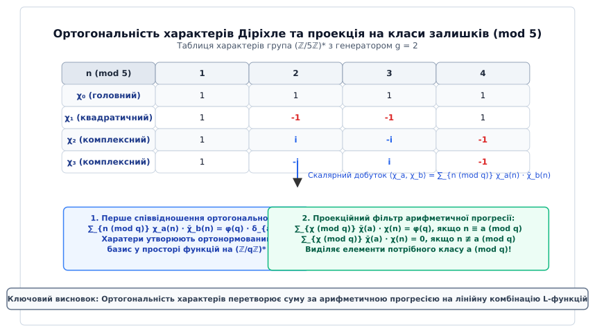
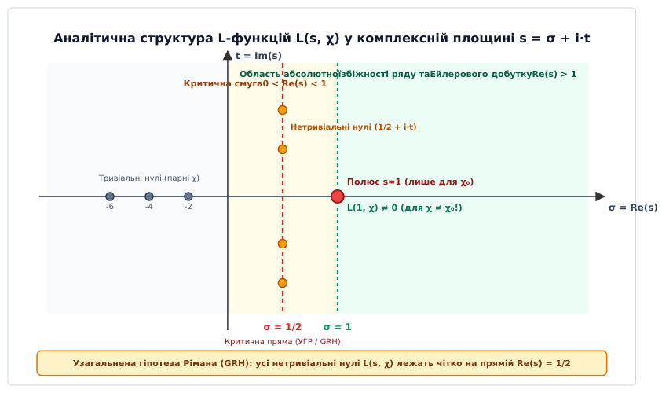
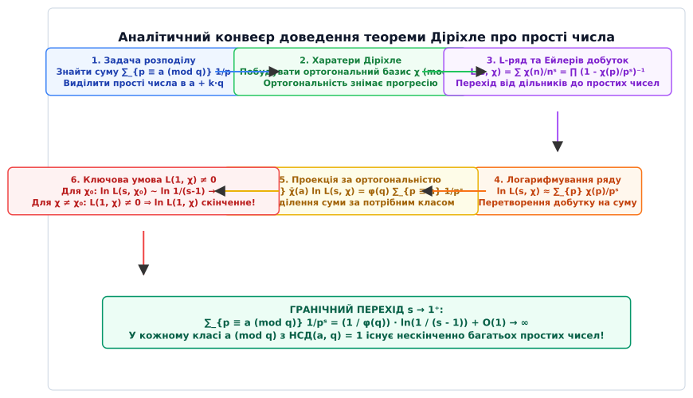

# L-функції Діріхле

<preknowlist>
- [Основна теорема арифметики](book:math/fundamental-theorem-arithmetic) — унікальність розкладу натуральних чисел на прості множники.
- [Формула добутку Ейлера](book:math/euler-product-formula) — розклад аналітичних рядів у нескінченний добуток за простими числами.
- [Характери Діріхле](book:math/dirichlet-character) — мультиплікативні ортогональні функції за модулем.
- [Теорема Ферма та функція Ейлера](book:math/euler-totient) — мультиплікативна структура приведеної системи залишків за модулем.
</preknowlist>

> 🔧 **Навіщо це.**
> L-функції Діріхле є головним містком між абстрактною алгеброю (теорією характерів та груп залишків) та аналітичною теорією чисел. Вони дозволяють перетворити складні дискретні задачі про подільність та розподіл простих чисел у рівномірних арифметичних прогресіях `a + k·q` на аналіз аналітичних властивостей комплексних рядів. Без L-функцій неможливо довести теорему Діріхле про нескінченність простих чисел у прогресіях, обчислити число класів квадратичних полів (Dirichlet class number formula), формулювати Узагальнену гіпотезу Рімана (GRH), аналізувати стійкість криптографічних систем на основі дискретного логарифма або оцінювати точність алгоритмів тестування чисел на простоту.

## 1. Проблема ізоляції простих чисел у рівномірних арифметичних прогресіях

Класичне доведення Евкліда опирається на побудову числа `N = p₁ · p₂ · ... · pₖ + 1` з добутку вже відомих простих чисел. Воно строго гарантує, що існує нескінченно багато простих чисел у повній множині натуральних чисел `ℕ`. Однак, як тільки ми звужуємо область пошуку і ставимо фундаментальне питання теорії чисел: *"Чи існує нескінченно багато простих чисел, які при діленні на заданий модуль `q` дають конкретний остаток `a`?"*, елементарна комбінаторна схема Евкліда швидко вичерпує свої можливості.

Для найпростішої арифметичної прогресії `4k + 3` (де модуль `q = 4`, а остаток `a = 3`) елементарний підхід ще дає результат. Якщо припустити, що існує лише скінченна кількість простих чисел вигляду `4k + 3` — позначимо їх `p₁, p₂, ..., pₖ` — і розглянути число:

```
N = 4 · p₁ · p₂ · ... · pₖ - 1
```

то можна помітити дві ключові властивості числа `N`. З одного боку, воно має вигляд `4M - 1 ≡ 3 (mod 4)`. З іншого боку, жодне з вже знайдених простих чисел `p₁, ..., pₖ` не ділить `N`, оскільки остаток від ділення дорівнює `-1`. Оскільки всі дільники числа `N` є непарними, вони можуть мати лише вигляд `4k + 1` або `4k + 3`. Проте добуток довільної кількості чисел вигляду `4k + 1` завжди дає число вигляду `4k + 1`:

```
(4x + 1)(4y + 1) = 16xy + 4x + 4y + 1 = 4(4xy + x + y) + 1 ≡ 1 (mod 4)
```

Отже, аби число `N` мало остаток `3 (mod 4)`, принаймні один його простий дільник повинен мати вигляд `4k + 3`. Цей дільник є новим і не входить до нашого початкового списку `p₁, ..., pₖ`, що одразу дає логічну суперечність.

Проте спроба застосувати цей самий прийом до дзеркального класу залишків `4k + 1` моментально зазнає краху. Якщо побудувати аналогічне число `N = 4 · p₁ · ... · pₖ + 1`, то його остаток дорівнює `1 (mod 4)`. Але добуток двох чисел вигляду `4k + 3` також дає залишок `1 (mod 4)`:

```
(4a + 3)(4b + 3) = 16ab + 12a + 12b + 9 = 4(4ab + 3a + 3b + 2) + 1 ≡ 1 (mod 4)
```

Це означає, що число `N ≡ 1 (mod 4)` цілком може розкладатися на два прості дільники вигляду `4k + 3` (наприклад, `9 = 3 · 3` або `21 = 3 · 7`), і ми не отримуємо жодного нового простого числа вигляду `4k + 1`.

Аналогічна проблема виникає для довільного модуля `q` та класу залишків `a (mod q)` при `gcd(a, q) = 1`. Елементарна алгебра не дозволяє розділити мультиплікативні комбінації дільників.

### Аналітичний підхід Ейлера та його обмеження

У 1737 році Леонард Ейлер здійснив революційний крок, пов'язавши розподіл простих чисел із нескінченними рядами через тотожність:

```
ζ(s) = ∑_{n=1}^∞ 1 / nˢ = ∏_{p ∈ P} (1 - 1 / pˢ)⁻¹
```

При спрямуванні дійсного параметра `s → 1⁺` ліва частина тотожності перетворюється на розбіжний гармонічний ряд `ζ(1) = ∑ (1/n) = ∞`. Логарифмуючи обидві частини Ейлерового добутку, Ейлер отримав:

```
ln ζ(s) = ∑_{p ∈ P} ln(1 - 1/pˢ)⁻¹ = ∑_{p ∈ P} 1/pˢ + ∑_{p ∈ P} ∑_{k=2}^∞ 1 / (k · pᵏˢ)
```

Друга сума (при `k ≥ 2`) мажорується збіжним рядом `∑ 1/p² < ∞` і залишається обмеженою константою `O(1)`. Отже, коли `s → 1⁺`, вираз `ln ζ(s) → +∞`, що прямо доводить розбіжність суми обернених величин усіх простих чисел:

```
∑_{p ∈ P} 1 / p = ∞
```

Це був перший аналітичний доказ нескінченності множини всіх простих чисел. Однак перед математиками постало фундаментальне питання: як із цієї загальної суми `∑ 1/p` виділити лише ті прості числа `p`, які задовольняють порівняння `p ≡ a (mod q)`?

Пряма спроба підставити характеристичну функцію (індикатор належності до класу залишків) `δ(n ≡ a mod q)` у ряд:

```
F(s) = ∑_{n=1}^∞ δ(n ≡ a mod q) / nˢ
```

повністю руйнує аналітичний апарат Ейлера. Причина полягає в тому, що дельта-функція **не є мультиплікативною**:

```
δ(n · m ≡ a mod q) ≠ δ(n ≡ a mod q) · δ(m ≡ a mod q)
```

Наприклад, для `q = 4` та `a = 1`: маємо `δ(3 ≡ 1 mod 4) = 0`, проте для добутку `3 · 3 = 9 ≡ 1 (mod 4)` маємо `δ(9 ≡ 1 mod 4) = 1`. Оскільки індикатор руйнує мультиплікативність коефіцієнтів, ряд `F(s)` **неможливо розкласти у нескінченний добуток за простими числами**. Без Ейлерового добутку ми втрачаємо будь-який зв'язок між значенням ряду та простими дільниками чисел.

Щоб розв'язати цю проблему, необхідно розкласти дельта-функцію `δ(n ≡ a mod q)` за базисом таких функцій, які одночасно задовольняють дві вимоги:
1. Вони є **періодичними** з періодом `q`, що відповідає структурі класів залишків.
2. Вони є **строго мультиплікативними**, що дозволяє зберегти Ейлерів добуток для кожного елемента базису.

Такими функціями виявилися **числові характери Діріхле**.

## 2. Харатери Діріхле: алгебраїчна теорія та ортогональність

Нехай `q ≥ 1` — натуральне число, яке називається модулем. Множина класів залишків, взаємно простих із `q`, утворює приведену систему залишків і позначається як `(ℤ/qℤ)*`. Ця множина є скінченною абелевою групою щодо операції множення за модулем `q`. Порядок цієї групи дорівнює значенню функції Ейлера `φ(q)`.

**Означення.** Числовим характером Діріхле (грец. *charaktēr* — карб, відбиток, ознака) за модулем `q` називається функція `χ: ℤ → ℂ`, яка задовольняє такі чотири аксіоми:

1. **Періодичність за модулем `q`:** `χ(n + q) = χ(n)` для всіх `n ∈ ℤ`.
2. **Повна мультиплікативність:** `χ(m · n) = χ(m) · χ(n)` для всіх `m, n ∈ ℤ`.
3. **Умова підтримки:** `χ(n) ≠ 0` тоді і тільки тоді, коли `gcd(n, q) = 1`. Якщо `gcd(n, q) > 1`, то `χ(n) = 0`.
4. **Нормування одиниці:** `χ(1) = 1`.

З алгебраїчної точки зору характер Діріхле — це гомоморфізм зі скінченної абелевої групи `(ℤ/qℤ)*` у мультиплікативну групу ненульових комплексних чисел `ℂ*`, продовжений нулем на всі цілі числа, не взаємно прості з `q`.

За теоремою Ферма-Ейлера для будь-якого `n`, взаємно простого з `q`, виконується порівняння `n^φ(q) ≡ 1 (mod q)`. Завдяки мультиплікативності характера отримуємо:

```
(χ(n))^φ(q) = χ(n^φ(q)) = χ(1) = 1                    [піднесення значення характера до степеня φ(q)]
```

Отже, для кожного `n` значення `χ(n)` є **комплексним коренем степеня `φ(q)` з одиниці**. Звідси випливають дві фундаментальні арифметичні властивості:
- Модуль кожного ненульового значення дорівнює одиниці: `|χ(n)| = 1`.
- Обернене значення характеру дорівнює його комплексному спряженню: `(χ(n))⁻¹ = \overline{χ(n)} = χ̄(n)`.

### Структура двоїстої групи та класифікація характерів

Множина всіх характерів за однаковим модулем `q` утворює групу щодо точкового множення функцій `(χ₁ · χ₂)(n) = χ₁(n) · χ₂(n)`. Ця група називається **двоїстою групою** і позначається `Ĝ = \widehat{(ℤ/qℤ)*}`. За теоремою про структуру скінченних абелевих груп, двоїста група `Ĝ` є ізоморфною самій групі `(ℤ/qℤ)*`, а отже містить **рівно `φ(q)` різних характерів**.

Харатери класифікують за кількома ключовими ознаками:

1. **Головний характер `χ₀` (або `χ_prin`):** характер, який приймає значення `1` для всіх чисел `n`, взаємно простих з `q`, і `0` для всіх чисел `gcd(n, q) > 1`. Головний характер відіграє роль нейтрального елемента в двоїстій групі `Ĝ`.
2. **Дійсні (квадратичні) характери:** неголовні характери, значення яких є виключно дійсними числами `χ(n) ∈ {-1, 0, 1}`. Вони задовольняють умову `χ = χ̄` і відповідають елементам порядку 2 у двоїстій групі. Прикладом дійсного характера є символ Лежандра `(n/p)` для простого модуля `p`.
3. **Комплексні характери:** характери, які приймають принаймні одне комплексне уявне значення з недоюльовою уявною частиною (`χ ≠ χ̄`). Комплексні характери завжди виникають парованими разом зі своїм комплексно-спряженим характером `χ̄`.
4. **Парність характера:** оскільки `(-1)² = 1`, значення `χ(-1)` може дорівнювати лише `+1` або `-1`. Характер називається **парним**, якщо `χ(-1) = 1`, і **непарним**, якщо `χ(-1) = -1`.

Характер `χ (mod q)` називається **примітивним**, якщо він не утворюється як формальне розширення характера за меншим модулем `d | q` (`d < q`). Найменший модуль `f_χ`, для якого характер є примітивним, називається **провідником** (англ. *conductor*) характера `χ`. Якщо `f_χ = q`, характер є примітивним за модулем `q`. Для непримітивного характера `χ (mod q)`, індукованого примітивним характером `χ* (mod f_χ)`, зв'язок їхніх L-функцій подається через скінченний добуток:

```
L(s, χ) = L(s, χ*) · ∏_{p | q, p ∤ f_χ} ( 1 - χ*(p) / pˢ )  [зв'язок непримітивного характера з примітивним]
```

### Співвідношення ортогональності

Харатери Діріхле задовольняють дві теореми про ортогональність, які є фундаментом гармонічного аналізу на скінченних абелевих групах.

**Перше співвідношення ортогональності (ортогональність за елементами групи):**
Для будь-яких двох характерів `χ_a` та `χ_b` за модулем `q`:

```
∑_{n (mod q)} χ_a(n) · χ̄_b(n)
= φ(q),  якщо χ_a = χ_b                              [скалярний добуток характера із самим собою]
= 0,     якщо χ_a ≠ χ_b                              [ортогональність різних характерів]
```

*Доведення.* Якщо `χ_a = χ_b`, то `χ_a(n) · χ̄_a(n) = |χ_a(n)|² = 1` для всіх `φ(q)` елементів, взаємно простих з `q`, що одразу дає суму `φ(q)`. Якщо `χ_a ≠ χ_b`, позначимо `χ = χ_a · χ̄_b ≠ χ₀`. Оскільки `χ` є неголовним характером, існує такий елемент `y`, взаємно простий з `q`, що `χ(y) ≠ 1`. Оскільки множення на `y` здійснює перестановку елементів групи `(ℤ/qℤ)*`, маємо:
`S = ∑_{n (mod q)} χ(n) = ∑_{n (mod q)} χ(y · n) = χ(y) · ∑_{n (mod q)} χ(n) = χ(y) · S`.
Звідси `S · (1 - χ(y)) = 0`. Оскільки `χ(y) ≠ 1`, сума `S = 0`.

**Друге співвідношення ортогональності (ортогональність за характерами):**
Для будь-яких двох цілих чисел `a` та `n`:

```
∑_{χ (mod q)} χ̄(a) · χ(n)
= φ(q),  якщо n ≡ a (mod q) і gcd(a, q) = 1          [виділення потрібного класу залишків]
= 0,     якщо n ≢ a (mod q)                          [взаємне скасування іншими характерами]
```

Саме друге співвідношення ортогональності розв'язує проблему, поставлену в Розділі 1. Воно дозволяє записати дельта-функцію належності до класу `a (mod q)` як точну лінійну комбінацію всіх `φ(q)` характерів:

```
δ(n ≡ a mod q) = (1 / φ(q)) · ∑_{χ (mod q)} χ̄(a) · χ(n)
```


*Ортогональність характерів Діріхле та проекція на класи залишків.*

### Практичний розрахунок таблиці характерів за модулем q = 5

Розглянемо приклад побудови характерів для модуля `q = 5`. Приведена система залишків `(ℤ/5ℤ)* = {1, 2, 3, 4}` є циклічною групою порядку `φ(5) = 4`. Її генератором (первісним коренем) є число `g = 2`.

Степені генератора за модулем 5 дорівнюють:
`2⁰ ≡ 1`, `2¹ ≡ 2`, `2² ≡ 4`, `2³ ≡ 3 (mod 5)`.

Кожен характер `χ_m` визначається значенням на генераторі `g = 2`, яке має бути 4-м коренем з одиниці: `χ_m(2) = e^(2π · i · m / 4) = iᵐ`, де `m ∈ {0, 1, 2, 3}`.

Таблиця всіх 4 характерів за модулем 5:

```
n (mod 5)       1       2       3       4     Тип характера
--------------------------------------------------------------------------
χ₀ (m = 0)      1       1       1       1     Головний (парний)
χ₁ (m = 1)      1       i      -i      -1     Комплексний (непарний)
χ₂ (m = 2)      1      -1      -1       1     Дійсний / Лежандра (парний)
χ₃ (m = 3)      1      -i       i      -1     Комплексний (непарний)
```

Перевіримо тотожність ортогональності для виділення класу `a = 2 (mod 5)` при підстановці різних чисел `n`:
- Для `n = 2`: `∑_{m=0}³ χ̄_m(2) · χ_m(2) = 1·1 + (-i)·i + (-1)·(-1) + i·(-i) = 1 + 1 + 1 + 1 = 4 = φ(5)`.
- Для `n = 4 ≢ 2 (mod 5)`: `∑_{m=0}³ χ̄_m(2) · χ_m(4) = 1·1 + (-i)·(-1) + (-1)·1 + i·(-1) = 1 + i - 1 - i = 0`.

Формула ортогональності працює безудоганно: вона дає `4` для належних чисел і `0` для всіх інших.

## 3. Аналітичне означення L-функцій та Ейлерів добуток

**Означення.** L-функцією Діріхле, відповідною характеру `χ (mod q)`, називається комплексний ряд Діріхле:

```
L(s, χ) = ∑_{n=1}^∞ χ(n) / nˢ = χ(1)/1ˢ + χ(2)/2ˢ + χ(3)/3ˢ + ...
```

де `s = σ + i·t` — комплексне число.

Оскільки для будь-якого `n` значення характера обмежене за модулем `|χ(n)| ≤ 1`, кожен член ряду мажорується членом звичайного гармонічного степенного ряду:

```
|χ(n) / nˢ| = |χ(n)| / n^σ ≤ 1 / n^σ
```

Звідси за ознакою порівняння Вейєрштрасса випливає, що **у півплощині `Re(s) > 1` ряд `L(s, χ)` збігається абсолютно та рівномірно**.

### Виведення формули добутку Ейлера для L-функцій

Завдяки повній мультиплікативності характера `χ(m · n) = χ(m) · χ(n)` та Основній теоремі арифметики, кожен натуральний індекс `n` єдиним чином розкладається на прості множники `n = p₁ᵃ¹ · p₂ᵃ² · ... · pₖᵃᵏ`.

Це дозволяє розкласти суму ряду в нескінченний добуток за всіма простими числами `p`:

```
L(s, χ)
= ∑_{n=1}^∞ χ(n) / nˢ                                 [початковий ряд Діріхле]
= ∏_{p ∈ P} ( 1 + χ(p)/pˢ + χ(p²)/p²ˢ + χ(p³)/p³ˢ + ... ) [розклад за простими множниками]
```

Кожен дужковий чинник у добутку є нескінченною спадною геометричною прогресією зі першим членом `1` та знаменником `r = χ(p)/pˢ`. Оскільки для `Re(s) > 1` модуль знаменника `|r| = |χ(p)| / p^σ ≤ 1/p^σ < 1`, суму геометричної прогресії можна згорнути за формулою `1 / (1 - r)`:

```
L(s, χ) = ∏_{p ∈ P} ( 1 - χ(p) / pˢ )⁻¹               [Ейлерів добуток L-функції Діріхле]
```

Для простих чисел `p`, які ділять модуль `q` (`p | q`), значення характера дорівнює `χ(p) = 0`. Відповідний множник у добутку приймає вигляд `(1 - 0)⁻¹ = 1` і не впливає на результат. Отже, фактичне множення відбувається лише за простими числами, взаємно простими з `q`.

### Явні приклади сум L(1, χ) для малих модулів

Для унаочнення аналітичної природи L-рядів розглянемо явні обчислення у точці `s = 1`:

1. **Модуль `q = 4` (непарний дійсний характер `χ₄`):**
   Значення характера: `χ₄(1) = 1`, `χ₄(3) = -1`, `χ₄(2) = χ₄(4) = 0`.
   Ряд у точці `s = 1` приймає вигляд відомого ряду Лейбніца для числа `π`:
   ```
   L(1, χ₄) = 1 - 1/3 + 1/5 - 1/7 + 1/9 - 1/11 + ... = π / 4 ≈ 0.785398...
   ```
   Оскільки `π / 4 > 0`, значення `L(1, χ₄) ≠ 0`.

2. **Модуль `q = 3` (непарний дійсний характер `χ₃`):**
   Значення характера: `χ₃(1) = 1`, `χ₃(2) = -1`, `χ₃(3) = 0`.
   Ряд у точці `s = 1`:
   ```
   L(1, χ₃) = 1 - 1/2 + 1/4 - 1/5 + 1/7 - 1/8 + ... = π / (3 √3) ≈ 0.604599...
   ```
   Оскільки `π / (3 √3) > 0`, значення `L(1, χ₃) ≠ 0`.

### Аналітична відмінність між головним та неголовними характерами

Аналітична поведінка та область існування L-функції `L(s, χ)` кардинально різниться залежно від того, чи є характер `χ` головним.

1. **Головний характер `χ₀`:**
   Для головного характера `χ₀(n) = 1` при `gcd(n, q) = 1`. Порівнюючи `L(s, χ₀)` із звичайною Дзета-функцією Ейлера-Рімана `ζ(s)`, маємо:
   ```
   L(s, χ₀)
   = ∏_{p ∤ q} (1 - 1/pˢ)⁻¹                           [добуток за простими, що не ділять q]
   = ∏_{p ∈ P} (1 - 1/pˢ)⁻¹ · ∏_{p | q} (1 - 1/pˢ)     [доповнення до повного добутку ζ(s)]
   = ζ(s) · ∏_{p | q} (1 - 1 / pˢ)                    [зв'язок L-функції головного характера з ζ(s)]
   ```
   Оскільки Дзета-функція `ζ(s)` має у точці `s = 1` простий полюс першого порядку з лишком `1`, **L-функція головного характера `L(s, χ₀)` також має простий полюс першого порядку у точці `s = 1`** з лишком:
   ```
   Res_{s=1} L(s, χ₀) = ∏_{p | q} (1 - 1/p) = φ(q) / q    [лишок L-функції головного характера у s = 1]
   ```

2. **Неголовні характери `χ ≠ χ₀`:**
   Для будь-якого неголовного характера сума його значень за повним періодом дорівнює нулю: `∑_{n=1}^q χ(n) = 0`.
   Завдяки цьому часткові суми `A(x) = ∑_{n ≤ x} χ(n)` є періодичними та рівномірно обмеженими константою: `|A(x)| ≤ φ(q)` для всіх `x ≥ 1`.
   Застосуємо перетворення Абеля (інтегрування частинами) до часткових сум ряду при `Re(s) > 1`:
   ```
   ∑_{n=1}^N χ(n) / nˢ = A(N) / Nˢ + s · ∫₁ᴺ (A(x) / xˢ⁺¹) dx  [формула підсумовування Абеля]
   ```
   Спрямуємо `N → ∞`. Оскільки `A(N)` обмежене, член `A(N)/Nˢ → 0` для `Re(s) > 0`. В результаті отримуємо інтегральне подання:
   ```
   L(s, χ) = s · ∫₁^∞ (A(x) / xˢ⁺¹) dx                 [інтегральне продовження L-функції]
   ```
   Оскільки `|A(x)| ≤ φ(q)`, інтеграл підсумкової формули збігається абсолютно у всій півплощині `Re(s) > 0`.
   Це означає, що **для будь-якого неголовного характера `χ ≠ χ₀` L-функція `L(s, χ)` аналітично продовжується у півплощину `Re(s) > 0` і є голоморфною (зокрема, приймає скінченне значення) в точці `s = 1`**.

## 4. Логарифмування L-рядів та проекційний фільтр

Для переходу від добутку за простими числами до адитивних сум прологарифмуємо Ейлерів добуток L-функції у півплощині `Re(s) > 1`:

```
ln L(s, χ)
= ln ∏_{p} (1 - χ(p) / pˢ)⁻¹                         [логарифм нескінченного добутку]
= - ∑_{p} ln(1 - χ(p) / pˢ)                          [сума логарифмів множників]
= ∑_{p} ∑_{k=1}^∞ χ(pᵏ) / (k · pᵏˢ)                   [розклад логарифма ln(1-x) в ряд Тейлора]
= ∑_{p} χ(p) / pˢ + ∑_{p} ∑_{k=2}^∞ χ(pᵏ) / (k · pᵏˢ)   [виділення головного члена k = 1]
```

Проаналізуємо другу суму (вищі степені простих чисел `k ≥ 2`):

```
|∑_{p} ∑_{k=2}^∞ χ(pᵏ) / (k · pᵏˢ)|
≤ ∑_{p} ∑_{k=2}^∞ 1 / (2 · p^kσ)                      [оцінка модуля через |χ(p)| ≤ 1 та k ≥ 2]
= (1/2) · ∑_{p} 1 / (p^σ · (p^σ - 1))                 [згортка нескінченної геометричної прогресії]
≤ (1/2) · ∑_{n=2}^∞ 1 / (n · (n - 1)) = 1/2            [верхня оцінка через телескопічний ряд]
```

Ця друга сума є абсолютно збіжною для всіх `σ = Re(s) > 1/2` і залишається рівномірно обмеженою константою `O(1)` при наближенні `s → 1⁺`.

Таким чином, маємо фундаментальне асимптотичне подання:

```
ln L(s, χ) = ∑_{p} χ(p) / pˢ + O(1)                   [зв'язок логарифма L-рядів із сумою за простими]
```

### Застосування проекційного фільтра ортогональності

Помножимо вираз для `ln L(s, χ)` на комплексно-спряжене значення `χ̄(a)` і просумуємо за всіма `φ(q)` характерами двоїстої групи:

```
∑_{χ (mod q)} χ̄(a) · ln L(s, χ)
= ∑_{χ (mod q)} χ̄(a) · ( ∑_{p} χ(p) / pˢ + O(1) )     [підстановка розкладу логарифма]
= ∑_{p} (1 / pˢ) · ( ∑_{χ (mod q)} χ̄(a) · χ(p) ) + O(1) [зміна порядку підсумовування]
```

Тепер застосуємо друге співвідношення ортогональності характерів: внутрішня сума `∑_{χ} χ̄(a) χ(p)` дорівнює `φ(q)`, якщо `p ≡ a (mod q)`, і `0` в усіх інших випадках.

У результаті всі прості числа, що не належать до класу `a (mod q)`, повністю анулюються, і ми отримуємо точне співвідношення:

```
∑_{χ (mod q)} χ̄(a) · ln L(s, χ) = φ(q) · ∑_{p ≡ a (mod q)} 1 / pˢ + O(1)  [виділення потрібного класу залишків]
```

Виразимо шукану суму обернених степенів простих чисел для прогресії `a (mod q)`:

```
∑_{p ≡ a (mod q)} 1 / pˢ = (1 / φ(q)) · ∑_{χ (mod q)} χ̄(a) · ln L(s, χ) + O(1)
```

Розділимо суму у правій частині на два окремих доданки: доданок від головного характера `χ₀` та суму від усіх неголовних характерів `χ ≠ χ₀`:

```
∑_{p ≡ a (mod q)} 1 / pˢ
= (1 / φ(q)) · ln L(s, χ₀) + (1 / φ(q)) · ∑_{χ ≠ χ₀} χ̄(a) · ln L(s, χ) + O(1)
```

Розглянемо граничний перехід `s → 1⁺`:

1. **Доданок від головного характера `χ₀`:**
   Оскільки `L(s, χ₀)` має полюс першого порядку у точці `s = 1`, при `s → 1⁺` маємо `L(s, χ₀) ∼ (φ(q)/q) / (s - 1)`. Логарифмуючи цей вираз, отримуємо:
   ```
   lim_{s → 1⁺} ln L(s, χ₀) = lim_{s → 1⁺} ln( 1 / (s - 1) ) = +∞  [прямування до нескінченності від полюса]
   ```
2. **Доданки від неголовних характерів `χ ≠ χ₀`:**
   Для кожного неголовного характера функція `L(s, χ)` є аналітичною та скінченною в точці `s = 1`. Значення логарифма `ln L(1, χ)` буде скінченним комплексним числом **тоді і тільки тоді, коли `L(1, χ) ≠ 0`**!

Якщо для кожного неголовного характера `L(1, χ) ≠ 0`, то сума `∑_{χ ≠ χ₀} χ̄(a) ln L(1, χ)` залишається скінченною константою `K`. Тоді при `s → 1⁺` маємо:

```
∑_{p ≡ a (mod q)} 1 / p = lim_{s → 1⁺} ( (1 / φ(q)) · ln(1 / (s - 1)) + K + O(1) ) = +∞
```

Розбіжність цієї суми доводять, що сума обернених величин простих чисел у класі `a (mod q)` є нескінченною, а отже, **множина простих чисел вигляду `a + k·q` є нескінченною**.

Детальніше про [історичний розвиток цієї ідеї в працях Діріхле 1837 року](book:math/number-theory/dirichlet-l-functions/hist-dirichlet-primes.md).

## 5. Ключовий бар'єр: незвернення в нуль L(1, χ) ≠ 0

З попереднього аналізу випливає, що **єдиною логічною перешкодою** до доведення теореми Діріхле є гіпотетична можливість того, що для якогось неголовного характера `χ` значення `L(1, χ) = 0`.

Якщо б існував такий характер `χ₁`, для якого `L(1, χ₁) = 0`, то при `s → 1⁺` його логарифм прямував би до від'ємної нескінченності: `ln L(s, χ₁) → -∞`. Ця від'ємна нескінченність могла б повністю компенсувати додатну нескінченність від головного характера `ln L(s, χ₀) → +∞`, у результаті чого підсумкова сума `∑_{p ≡ a (mod q)} 1/p` виявилася б скінченним числом, і доведення було б повністю зруйноване.

Тому доведення нерівності **`L(1, χ) ≠ 0` для всіх `χ ≠ χ₀`** є центральним математичним результатом усієї теорії.

### Схема доведення для комплексних та дійсних характерів

Доведення незвернення в нуль розпадається на два класи за типом характера:

1. **Комплексні характери (`χ ≠ χ̄`):**
   Для комплексного характера `χ` його спряжений характер `χ̄` є іншим характер з тієї ж групи (`χ ≠ χ̄`). Зі властивості комплексного спряження ряду маємо `L(1, χ̄) = \overline{L(1, χ)}`. Отже, якщо `L(1, χ) = 0`, то обов'язково і `L(1, χ̄) = 0`.
   Розглянемо добуток усіх L-функцій за модулем `q`: `F(s) = ∏_{χ} L(s, χ)`. Через співвідношення ортогональності доводять, що `F(s) ≥ 1` для всіх дійсних `s > 1`.
   Якщо б `L(1, χ) = 0` і `L(1, χ̄) = 0`, ці два нулі дали б множник `(s - 1)²`. Цей квадрат нульового множника перевищив би простий полюс `1/(s - 1)` від головного характера `L(s, χ₀)`, що дало б `lim_{s → 1⁺} F(s) = 0`. Отримано суперечність із нерівністю `F(s) ≥ 1`.

2. **Дійсні (квадратичні) характери (`χ = χ̄`):**
   Для дійсного характера `χ̄ = χ`, тому пара нулів не виникає, і метод з добутком `F(s)` не дає автоматичної суперечності. Для дійсних характерів використовують аналіз адитивної згортки `f(n) = ∑_{d | n} χ(d)`.
   Діріхле довів, що для дійсного примітивного характера з провідником `D` значення `L(1, χ)` строго пов'язане з числом класів `h(D)` бінарних квадратичних форм `ax² + bxy + cy²` з дискримінантом `D` через **формулу числа класів Діріхле**:
   ```
   L(1, χ) = (2π / (w · √|D|)) · h(D) > 0          [для від'ємних дискримінантів D < 0]
   L(1, χ) = (2 · ln ε / √D) · h(D) > 0            [для додатних дискримінантів D > 0]
   ```
   Оскільки число класів еквівалентності квадратичних форм `h(D) ≥ 1` є натуральним числом, значення `L(1, χ)` завжди строго додатне (`L(1, χ) > 0`) і ніколи не дорівнює нулю.

Повний строгий вивід обох випадків наведено у вставці [повне математичне доведення незвернення L(1, χ) ≠ 0 для комплексних та дійсних характерів](book:math/number-theory/dirichlet-l-functions/math-non-vanishing-l1.md).

## 6. Аналітичне продовження, суми Гаусса та функціональне рівняння

Подібно до Дзета-функції Рімана `ζ(s)`, L-функції Діріхле аналітично продовжуються на всю комплексну площину `ℂ` як мероморфні функції та задовольняють функціональне рівняння, яке пов'язує значення `L(s, χ)` зі значеннями `L(1-s, χ̄)`.

Головним алгебраїчним містком при побудові аналітичного продовження є **сума Гаусса** `G(χ)` (лат. *summa Gaussiana*):

```
G(χ) = ∑_{n=1}^q χ(n) · e^(2π · i · n / q)            [сума Гаусса характера χ за модулем q]
```

Для будь-якого примітивного характера `χ (mod q)` модуль суми Гаусса має точне значення `|G(χ)| = √q`.

### Функціональне рівняння Діріхле-Рімана

Нехай `χ` — примітивний характер за модулем `q`. Позначимо параметр парності `a = 0`, якщо характер парний (`χ(-1) = 1`), і `a = 1`, якщо характер непарний (`χ(-1) = -1`).

Визначимо **завершену L-функцію** (англ. *completed L-function*) `Λ(s, χ)` шляхом додавання відповідного Гамма-фактора:

```
Λ(s, χ) = (q / π)^((s + a) / 2) · Γ((s + a) / 2) · L(s, χ)  [завершена L-функція з Гамма-фактором]
```

де `Γ(z)` — класична Гамма-функція Ейлера.

Тоді має місце **функціональне рівняння**:

```
Λ(s, χ) = ε(χ) · Λ(1 - s, χ̄)                         [симетрія відносно критичної прямої Re(s) = 1/2]
```

де нормалізований множник суми Гаусса дорівнює:

```
ε(χ) = G(χ) / (iᵃ · √q)                              [множник нормування з модулем |ε(χ)| = 1]
```

Це функціональне рівняння встановлює дзеркальну симетрію між значеннями L-функції у точках `s` та `1 - s` відносно критичної прямої `Re(s) = 1/2`.


*Аналітичні властивості L-функцій у комплексній площині, критична смуга та критична пряма.*

### Тривіальні нулі L-функцій

Гамма-функція `Γ(z)` має полюси першого порядку у всіх цілих від'ємних точках `z = 0, -1, -2, -3, ...`. З умови голоморфності завершеної функції `Λ(s, χ)` випливає, що самі L-функції `L(s, χ)` повинні дорівнювати нулю у відповідних точках, щоб компенсувати полюси Гамма-фактора.

Ці нулі називаються **тривіальними нулями** L-функції:

- Для **парних примітивних характерів** (`χ(-1) = 1`, `a = 0`): тривіальні нулі розташовані в точках `s = 0, -2, -4, -6, -8, ...`
- Для **непарних примітивних характерів** (`χ(-1) = -1`, `a = 1`): тривіальні нулі розташовані в точках `s = -1, -3, -5, -7, -9, ...`

## 7. Узагальнена гіпотеза Рімана (GRH) та обчислювальний підсумок

Усі інші нулі L-функції `L(s, χ)` називаються **нетривіальними нулями** і лежать усередині **критичної смуги** `0 < Re(s) < 1`.

**Узагальнена гіпотеза Рімана (GRH, англ. *Generalized Riemann Hypothesis*):**
Усі нетривіальні нулі будь-якої L-функції Діріхле `L(s, χ)` для довільного примітивного характера `χ` лежать чітко на **критичній прямій** `Re(s) = 1/2`.


*Аналітичний конвеєр доведення теореми Діріхле про прості числа в прогресіях.*

### Вплив GRH на розподіл простих чисел

Оцінка остаточного члена у теоремі про розподіл простих чисел для арифметичних прогресій напряму залежить від ширини області, вільної від нулів L-функцій:

Нехай `ψ(x; q, a) = ∑_{n ≤ x, n ≡ a mod q} Λ(n)` — функція Чебишова для прогресії `a (mod q)`.

- **Без урахування GRH (Теорема Зігеля-Вальфіша):**
  Остаточний член має лише субекспоненціальне спадання:
  ```
  ψ(x; q, a) = (x / φ(q)) + O( x · exp(-C · √(ln x)) )  [загальна оцінка остаточного члена]
  ```
- **За умови справедливості GRH:**
  Остаточний член отримує квадратний корінь спадання, що є максимально можливим ступенем точності:
  ```
  ψ(x; q, a) = (x / φ(q)) + O( √x · ln² x )             [оптимальна оцінка з залишком √x]
  ```

Узагальнена гіпотеза Рімана гарантує, що прості числа розподіляються за всіма можливими приведеними класами залишків `a (mod q)` максимально рівномірно.

Практичні аспекти чисельного розрахунку характерів та цінностей L-функцій продемонстровано у статті [чисельний алгоритм генерації характерів та обчислення L-рядів](book:math/number-theory/dirichlet-l-functions/proj-dirichlet-l-calc.md).
