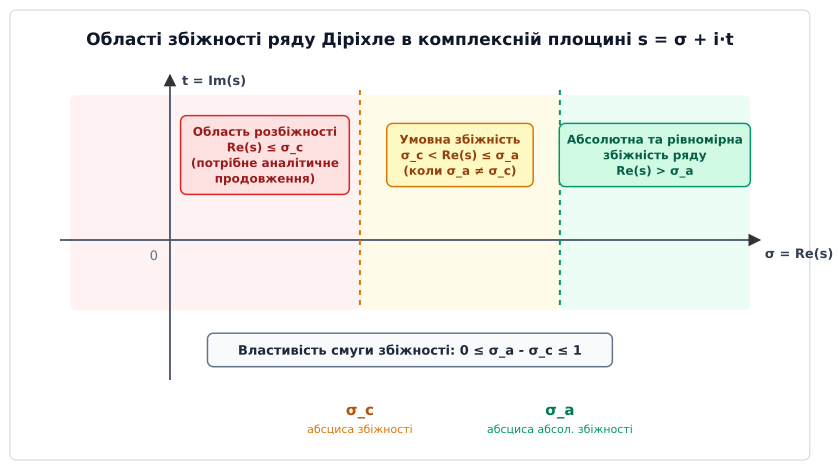
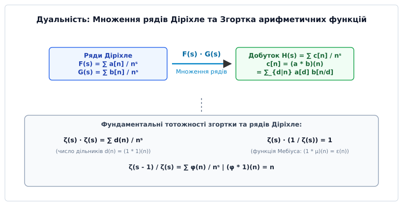
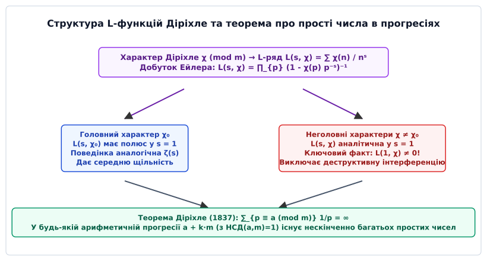

# Ряди Діріхле

<preknowlist>
- [Основна теорема арифметики](book:math/fundamental-theorem-arithmetic) — унікальність розкладу натуральних чисел на прості множники.
- [Формула добутку Ейлера](book:math/euler-product-formula) — розклад Дзета-суми на нескінченний добуток за простими числами.
- [Функція Ейлера](book:math/euler-totient) — аналіз мультиплікативних арифметичних функцій та їхніх властивостей.
</preknowlist>

> 🔧 **Навіщо це.**
> Ряди Діріхле є головним аналітичним містком між дискретною теорією чисел та неперервним комплексним аналізом. Вони перетворюють складні комбінаторні та арифметичні зв'язки подільності (згортку дільників, факторизацію, оцінку кількості простих чисел) у звичайне алгебраїчне множення аналітичних функцій. Без рядів Діріхле неможливо довести теорему про нескінченність простих чисел у довільних арифметичних прогресіях, побудувати алгоритми факторизації великих чисел (General Number Field Sieve), аналізувати стійкість криптографічних систем RSA чи опис спектрів у квантовій фізиці.

## 1. Від адитивних генераторних функцій до мультиплікативних рядів

Коли ми аналізуємо комбінаторні або адитивні задачі теорії чисел (наприклад, кількість способів розкласти ціле число `n` у суму декількох доданків чи задачу про монети Фробеніуса), основним інструментом є звичайні степеневі ряди вигляду `A(x) = ∑_{n=1}^∞ a[n] xⁿ`. Головна зручність степеневого ряду полягає у тому, що при множенні двох таких рядів показники степенів базового числа `x` додаються:

```
xⁿ · xᵐ = xⁿ⁺ᵐ
```

Завдяки цій властивості добуток двох рядів `A(x) · B(x)` утворює новий степеневий ряд, коефіцієнт якого при `xᵏ` дорівнює адитивній згортці `∑_{i+j=k} a[i] b[j]`. Адитивна згортка ідеально відповідає операції додавання індексів і дозволяє легко рахувати кількість комбінаторних комбінацій.

Проте фундаментальна структура подільності та канонічного розкладу цілих чисел на прості множники є принципово **мультиплікативною**, а не адитивною. Головна операція в теорії чисел — це не додавання, а знаходження додатних дільників числа `n = d · m`.

Якщо спробувати застосувати степеневі ряди до арифметичних функцій (таких як число дільників `d(n)`, функція Ейлера `φ(n)` чи функція Мебіуса `μ(n)`), додавання показників степенів `n + m` повністю руйнує інформацію про подільність та взаємну простоту коефіцієнтів. Степеневий ряд невмотивовано поєднує доданки `a[3] x³` та `a[4] x⁴` у коефіцієнт `x⁷`, хоча числа 3 і 4 не мають жодного адитивного відношення до розкладу числа 7 на прості множники.

З точки зору функціонального аналізу, для мультиплікативних структур потрібне перетворення, яке переводить множення цілих чисел у додавання показників. Розглянемо число `n = 6 = 2 · 3`. Нам потрібна така базова функція `f(n)`, щоб виконувалася рівність `f(6) = f(2) · f(3)`.

У 1837 році Петер Густав Лежен Діріхле запропонував обрати як базову функцію знаменника степені натурального індексу `n⁻ˢ = 1 / nˢ`, де `s` — комплексне число. З точки зору сучасного функціонального аналізу, ряд Діріхле являє собою дискретне **перетворення Мелліна** (англ. *Mellin transform*). Якщо перетворення Фур'є пов'язане з адитивною групою дійсних чисел, то перетворення Мелліна та ряди Діріхле пов'язані з мультиплікативною групою.

Ключова властивість нової основи полягає в тому, що множення двох показників перетворює множення індексів у додавання показників степеня:

```
n⁻ˢ · m⁻ˢ = (n · m)⁻ˢ
```

Ряд вигляду:

```
F(s) = ∑_{n=1}^∞ a[n] / nˢ = a[1]/1ˢ + a[2]/2ˢ + a[3]/3ˢ + a[4]/4ˢ + ...
```

називається **рядом Діріхле** (лат. *series Dirichletiana*). Вибір такої бази забезпечує узгодження додавання коефіцієнтів ряду з Основною теоремою арифметики і дає змогу побудувати цілісну аналітичну теорію чисел.

## 2. Аналітична анатомія та області збіжності

Нехай `s = σ + i·t` — комплексне число, де `σ = Re(s)` є дійсною частиною (абсцисою), а `t = Im(s)` — уявною частиною.

Розкриємо кожен член ряду Діріхле через показникову та тригонометричні функції:

```
n⁻ˢ = n⁻⁽σ ⁺ ⁱᵗ⁾                                      [підстановка s = σ + i·t]
    = n⁻σ · n⁻ⁱᵗ                                      [властивість степеня: nᵃ⁺ᵇ = nᵃ · nᵇ]
    = n⁻σ · e⁻ⁱᵗ ˡⁿ ⁿ                                 [показникова форма: n⁻ⁱᵗ = e⁻ⁱᵗ ˡⁿ ⁿ]
    = n⁻σ · ( cos(t · ln n) - i · sin(t · ln n) )     [формула Ейлера: e⁻ⁱθ = cos θ - i sin θ]
```

Модуль окремого члена ряду дорівнює `|a[n] / nˢ| = |a[n]| / n^σ`. Звідси випливає фундаментальний факт: **абсолютна збіжність ряду Діріхле визначається виключно дійсною частиною `σ = Re(s)`** і абсолютно не залежить від уявного параметра `t`.

На відміну від звичайних степеневих рядів, де областю збіжності є круг у комплексній площині `|z| < R`, для рядів Діріхле областю збіжності є **праві півплощини**.


*Області абсолютної та умовної збіжності ряду Діріхле в комплексній площині s = σ + i·t, розділені абсцисами σ_c та σ_a.*

Для кожного ряду Діріхле існують дві критичні дійсні межі, які називаються **абсцисами збіжності**:

1. **Абсциса абсолютної збіжності `σ_a`:** Рряд `∑ a[n] / nˢ` збігається абсолютно у півплощині `Re(s) > σ_a` і розбігається абсолютно при `Re(s) < σ_a`.
2. **Абсциса збіжності `σ_c`:** Рряд збігається (можливо умовно) у півплощині `Re(s) > σ_c` і розбігається при `Re(s) < σ_c`.

Теорема Ежена Каена (1894) стверджує, що якщо ряд `∑ a[n] / nˢ` збігається у точці `s₀ = σ₀ + i·t₀`, то він збігається для будь-якого `s` з `Re(s) > σ₀`.

Доведення теореми Каена спирається на інтегрування за частинами (сумування Абеля). Позначимо часткові суми `A(x) = ∑_{n ≤ x} a[n] n⁻ˢ⁰`. Тоді для будь-якого `N` часткову суму можна переписати як:

```
∑_{n=1}^N a[n] n⁻ˢ = ∑_{n=1}^N (a[n] n⁻ˢ⁰) n⁻⁽ˢ ⁻ ˢ⁰⁾
```

Застосувавши дискретне перетворення Абеля, ми виражаємо суму через інтеграл:

```
∑_{n=1}^N a[n] n⁻ˢ = A(N) N⁻⁽ˢ ⁻ ˢ⁰⁾ + (s - s₀) ∫_1^N A(x) x⁻⁽ˢ ⁻ ˢ⁰ ⁺ ¹⁾ dx
```

Оскільки сума `A(x)` є обмеженою у точці збіжності `s₀`, перша частина прямує до нуля при `Re(s) > Re(s₀)`, а інтеграл збігається абсолютно. Це доводить, що область збіжності обов'язково є правою півплощиною.

Обчислення абсциси збіжності `σ_c` виконується за формулою Каена через часткові суми коефіцієнтів `A(x) = ∑_{n ≤ x} a[n]`:

```
σ_c = lim sup_{x → ∞} ( ln |A(x)| / ln x )   [якщо сума A(x) розбігається]
```

Якщо ж часткові суми `A(x)` є обмеженими (наприклад, для альтернованого ряду Діріхле Ета-функції `η(s) = ∑ (-1)ⁿ⁻¹ / nˢ`), то абсциса збіжності дорівнює `σ_c = 0`, тоді як абсциса абсолютної збіжності дорівнює `σ_a = 1`.

Між абсцисою збіжності та абсцисою абсолютної збіжності існує фундаментальне обмеження на ширину смуги умовної збіжності:

```
0 ≤ σ_a - σ_c ≤ 1
```

Ширина смуги умовної збіжності `σ_c < Re(s) ≤ σ_a` ніколи не перевищує 1. Якщо коефіцієнти `a[n] ≥ 0` є невід'ємними дійсними числами, то абсциса умовної та абсолютної збіжності збігаються: `σ_a = σ_c` (теорема Ландау).

Розглянемо основні крайові випадки визначення абсцис збіжності:

- **Скінченні багаточлени Діріхле:** Якщо `a[n] = 0` для всіх `n > N`, ряд містить лише скінченне число доданків. Такий ряд збігається в усій комплексній площині, тому `σ_c = σ_a = -∞`.
- **Швидко зростаючі коефіцієнти:** Якщо коефіцієнти зростають занадто швидко (наприклад, `a[n] = n!`), ряд розбігається для будь-якого комплексної точки `s`, тому `σ_c = σ_a = +∞`.
- **Умовна смуга збіжності:** Для Ета-функції Рімана `η(s) = ∑_{n=1}^∞ (-1)ⁿ⁻¹ / nˢ` при `t = 0` маємо альтернований ряд `1 - 1/2ˢ + 1/3ˢ - 1/4ˢ + ...`. За ознакою Лейбніца цей ряд збігається для будь-якого дійсного `s > 0` (отже `σ_c = 0`), однак ряд із модулів `∑ 1/nˢ` є гармонічним і збігається лише при `s > 1` (отже `σ_a = 1`). Смуга `0 < Re(s) ≤ 1` є смугою умовної збіжності шириною в 1.

Всередині півплощини збіжності `Re(s) > σ_c` ряд Діріхле визначає голоморфну (аналітичну) функцію від комплексної змінної `s`, а його похідна обчислюється почленним диференціюванням:

```
F'(s) = - ∑_{n=1}^∞ (a[n] · ln n) / nˢ               [диференціювання d/ds (n⁻ˢ) = -ln(n) n⁻ˢ]
```

Для аналітичного дослідження за межами півплощини збіжності застосовують метод аналітичного продовження.

## 3. Алгебра згортки та мультиплікативна дуальність

Розглянемо множення двох рядів Діріхле `F(s) = ∑ a[n] / nˢ` та `G(s) = ∑ b[n] / nˢ`. У півплощині абсолютної збіжності ми маємо право перемножити ряди член за членом:

```
F(s) · G(s)
= ( ∑_{n=1}^∞ a[n] / nˢ ) · ( ∑_{m=1}^∞ b[m] / mˢ )   [розгортання виразів за визначенням]
= ∑_{n=1}^∞ ∑_{m=1}^∞ (a[n] · b[m]) / (n · m)ˢ        [почленне множення та групування]
= ∑_{k=1}^∞ [ ∑_{d|k} a[d] · b[k/d] ] / kˢ            [заміна k = n · m та d = n]
= ∑_{k=1}^∞ (a * b)(k) / kˢ                           [за визначенням згортки Діріхле]
```

Сума у квадратних дужках називається **згорткою Діріхле** (або арифметичною згорткою) коефіцієнтів `a` та `b`, що позначається як `(a * b)(k)`. Детальний строгий виведення та алгебраїчні властивості цієї операції містяться у вставці [Алгебра згортки Діріхле](book:math/dirichlet-series/math-dirichlet-convolution.md).


*Дуальність між множенням рядів Діріхле та згорткою коефіцієнтів на прикладах Дзета-функції, функції Мебіуса та функції Ейлера.*

Цей алгебраїчний зв'язок створює дуальність між операціями над рядами та арифметичними властивостями чисел:

### 1. Дзета-функція Рімана `ζ(s)`
Найпростіший ряд Діріхле має коефіцієнти `a[n] = 1` для всіх `n ∈ ℕ`:

```
ζ(s) = ∑_{n=1}^∞ 1 / nˢ = 1/1ˢ + 1/2ˢ + 1/3ˢ + 1/4ˢ + ...
```

Цей ряд абсолютно збігається при `Re(s) > 1`.

### 2. Квадрат Дзета-функції та число дільників `d(n)`
Множення `ζ(s)` на саму себе дає ряд, коефіцієнти якого є згорткою `(1 * 1)(n) = ∑_{d|n} 1 = d(n)` (число дільників):

```
ζ(s)² = ∑_{n=1}^∞ d(n) / nˢ = 1/1ˢ + 2/2ˢ + 2/3ˢ + 3/4ˢ + 2/5ˢ + 4/6ˢ + ...
```

### 3. Обернений ряд та функція Мебіуса `μ(n)`
Знайдемо ряд, який є алгебраїчно оберненим до `ζ(s)`, тобто `ζ(s) · F(s) = 1`. З умови `(1 * a)(n) = ε(n)` випливає, що коефіцієнтами `a[n]` є саме **функція Мебіуса** `μ(n)`:

```
1 / ζ(s) = ∑_{n=1}^∞ μ(n) / nˢ = 1/1ˢ - 1/2ˢ - 1/3ˢ + 0/4ˢ - 1/5ˢ + 1/6ˢ - ...
```

### 4. Відношення Дзета-функцій та функція Ейлера `φ(n)`
Оскільки за теоремою Гаусса `∑_{d|n} φ(d) = n`, згортка функцій `φ * 1 = N` (де `N(n) = n`) перетворюється у множення рядів `(∑ φ(n) / nˢ) · ζ(s) = ζ(s - 1)`. Звідси отримуємо класичну формулу:

```
ζ(s - 1) / ζ(s) = ∑_{n=1}^∞ φ(n) / nˢ
```

### 5. Сума степенів дільників `σ_a(n)`
Загальна сума `a`-х степенів дільників `σ_a(n) = ∑_{d|n} dᵃ` задається як згортка `Nᵃ * 1`. Відповідно, її ряд Діріхле розкладається у добуток двох Дзета-функцій:

```
∑_{n=1}^∞ σ_a(n) / nˢ = ζ(s) · ζ(s - a)
```

### 6. Логарифмічна похідна Дзета-функції та функція Мангольдта `Λ(n)`
В аналітичній теорії чисел ключову роль відіграє логарифмічна похідна Дзета-функції `- ζ'(s) / ζ(s)`.

Розглянемо виведення цього рядку. Взявши логарифм від Ейлерового добутку `ln ζ(s) = - ∑_{p} ln(1 - p⁻ˢ)`, розкладемо логарифм у ряд Тейлора `ln(1 - x) = - ∑_{k=1}^∞ xᵏ / k`:

```
ln ζ(s) = ∑_{p ∈ ℙ} ∑_{k=1}^∞ 1 / (k · pᵏˢ)
```

Продиференціюємо цей вираз за зміною `s` (пам'ятаючи, що `d/ds (p⁻ᵏˢ) = - k ln(p) p⁻ᵏˢ`):

```
- ζ'(s) / ζ(s) = - d/ds (ln ζ(s)) = ∑_{p ∈ ℙ} ∑_{k=1}^∞ (ln p) / pᵏˢ
```

Згрупувавши доданки за натуральним індексом `n = pᵏ`, ми отримуємо ряд Діріхле:

```
- ζ'(s) / ζ(s) = ∑_{n=1}^∞ Λ(n) / nˢ
```

де `Λ(n)` — **функція Мангольдта** (нім. *von Mangoldt-Funktion*), яка дорівнює `ln p`, якщо `n = pᵏ` є степенем простого числа, і `0` в інших випадках. Ряд для `- ζ'(s) / ζ(s)` є головним інструментом доведення Теореми про розподіл простих чисел.

## 4. Добуток Ейлера для загальних рядів Діріхле

Арифметична функція `a(n)` називається **мультиплікативною**, якщо для будь-якої пари взаємно простих чисел `n` та `m` (тобто `НСД(n, m) = 1`) виконується умова:

```
a(n · m) = a(n) · a(m)
```

Якщо ця рівність виконується для абсолютно всіх натуральних чисел `n` та `m` (навіть не взаємно простих), функція називається **цілком мультиплікативною**.

Завдяки Основній теоремі арифметики кожне натуральне число `n > 1` однозначно розкладається у добуток простих множників `n = p₁ᵃ¹ · p₂ᵃ² ... pₖᵃᵏ`.

Якщо функція `a(n)` є мультиплікативною, значення `a(n)` повністю визначається її значеннями на степенях простих чисел:

```
a(n) = a(p₁ᵃ¹) · a(p₂ᵃ²) ... a(pₖᵃᵏ)
```

Підставимо це розкладання у ряд Діріхле `F(s) = ∑_{n=1}^∞ a[n] / nˢ`:

```
F(s) = ∑_{n=1}^∞ a(p₁ᵃ¹ · p₂ᵃ² ... pₖᵃᵏ) / (p₁ᵃ¹ · p₂ᵃ² ... pₖᵃᵏ)ˢ        [канонічний розклад n на прості]
     = ∑_{n=1}^∞ [ a(p₁ᵃ¹) / p₁ᵃ¹ˢ ] · [ a(p₂ᵃ²) / p₂ᵃ²ˢ ] ...            [мультиплікативність функції a(n)]
```

Розкриваючи дужки у нескінченному добутку за всіма простими числами `p ∈ ℙ`, ми отримуємо **загальну формулу добутку Ейлера**:

```
F(s) = ∏_{p ∈ ℙ} ( 1 + a(p)/pˢ + a(p²)/p²ˢ + a(p³)/p³ˢ + ... )
```

Для **цілком мультиплікативної** функції виконується `a(pᵏ) = (a(p))ᵏ`. У цьому випадку кожна дужка є нескінченною спадною геометричною прогресією зі знаменником `q = a(p) / pˢ`:

```
1 + a(p)/pˢ + (a(p)/pˢ)² + (a(p)/pˢ)³ + ... = 1 / ( 1 - a(p) / pˢ )   [сума геометричної прогресії 1/(1-q)]
```

Звідси отримуємо елегантний канонічний розклад Ейлера для цілком мультиплікативних функцій:

```
F(s) = ∏_{p ∈ ℙ} 1 / ( 1 - a(p) / pˢ )   [Re(s) > σ_a]
```

Ця формула зводить аналіз нескінченної суми за всіма натуральними числами до аналізу незалежних співмножників для кожного простого числа `p`.

## 5. L-функції Діріхле та прості числа в прогресіях

Головним тріумфом застосування рядів Діріхле в історії математики стало доведення теореми про нескінченність простих чисел у кожній допустимій арифметичній прогресії. Детальний історичний шлях та контекст відкриття описані у вставці [Історія виникнення рядів Діріхле](book:math/dirichlet-series/hist-peter-dirichlet.md).

Нехай `m ≥ 2` — фіксований модуль. **Характером Діріхле** за модулем `m` (англ. *Dirichlet character*) називається цілком мультиплікативна функція `χ: ℤ → ℂ`, яка задовольняє три умови:

1. `χ(n) = χ(n mod m)` (періодичність з періодом `m`);
2. `χ(n) ≠ 0` тоді й лише тоді, коли `НСД(n, m) = 1`;
3. `χ(a · b) = χ(a) · χ(b)` для всіх `a, b ∈ ℤ`.

Рряд Діріхле, побудований на коефіцієнтах `a[n] = χ(n)`, називається **L-функцією Діріхле**:

```
L(s, χ) = ∑_{n=1}^∞ χ(n) / nˢ = ∏_{p ∈ ℙ} 1 / ( 1 - χ(p) / pˢ )
```

Завдяки періодичності та ортогональності характерів сума `∑_{n=1}^m χ(n)` дорівнює нулю для всіх неголовних характерів (`χ ≠ χ₀`).


*Структура L-функцій Діріхле, розгалуження поведінки головного та неголовних характерів та підсумкова теорема Діріхле.*

Властивість ортогональності дозволяє тотожно виділити прості числа конкретного класу остач `a (mod m)`:

```
∑_{p ≡ a (mod m)} 1 / pˢ = (1 / φ(m)) · ∑_{χ} χ̄(a) · ln L(s, χ) + O(1)   [при s → 1+]
```

Ключові кроки аналітичного доведення Діріхле:

1. **Головний характер `χ₀`:** `L(s, χ₀)` поводиться як `ζ(s)` і має полюс першого порядку в точці `s = 1`. Її логарифм `ln L(s, χ₀)` прямує до `+∞` при `s → 1+`.
2. **Неголовні характери `χ ≠ χ₀`:** Сума коефіцієнтів на періоді дорівнює нулю, тому ряд `L(s, χ)` збігається в точці `s = 1` і визначає скінченне значення `L(1, χ)`.
3. **Ненульове значення `L(1, χ) ≠ 0`:** Діріхле довів, що для жодного неголовного характеру `L(1, χ)` не може дорівнювати нулю! Це гарантує, що додатки `ln L(s, χ)` залишаються обмеженими і не можуть знешкодити нескінченність `+∞` від головного характеру.

У результаті сума `∑_{p ≡ a (mod m)} 1 / p` розбігається, що доводить наявність нескінченної кількості простих чисел у будь-якій допустимій арифметичній прогресії `a + k · m`.

Функціональне рівняння для L-функцій пов'язує значення `L(s, χ)` та `L(1 - s, χ̄)`, що дозволяє продовжувати L-функції на всю комплексну площину і вивчати розподіл їхніх нулів.

## 6. Інтегральне обернення Перона та обчислювальні алгоритми

Ряди Діріхле дозволяють не лише доводити якісні теореми, а й точно обчислювати асимптотичні суми арифметичних функцій `A(x) = ∑_{n ≤ x} a[n]`.

Основноним інструментом зв'язку між сумою коефіцієнтів та інверсним комплексним інтегруванням є **формула Перона** (фр. *formule de Perron*, 1908 рік).

**Теорема (формула Перона):** Нехай `F(s) = ∑_{n=1}^∞ a[n] / nˢ` — ряд Діріхле з абсцисою абсолютної збіжності `σ_a`. Тоді для будь-якого `c > max(0, σ_a)` та дійсно дійсного нецілого `x > 0`:

```
∑_{n ≤ x} a[n] = (1 / (2π · i)) · ∫_{c - i∞}^{c + i∞} F(s) · (xˢ / s) ds
```

Доведення формули Перона спирається на розривний інтеграл Коші:

```
(1 / (2π · i)) · ∫_{c - i∞}^{c + i∞} (yˢ / s) ds = 1   [якщо y > 1]
(1 / (2π · i)) · ∫_{c - i∞}^{c + i∞} (yˢ / s) ds = 0   [якщо 0 < y < 1]
```

Підставивши `y = x / n`, ми бачимо, що інтеграл дорівнює 1 для всіх `n < x` і 0 для всіх `n > x`. Це перетворює комплексний контурний інтеграл у точну точкову індикаторну функцію відбору доданків `n ≤ x`.

За допомогою формули Перона обчислення дивергентних чи асимптотичних сум зводиться до аналізу особливих точок (полюсів та розрізів) функції `F(s)` у комплексній площині за допомогою теореми про лишки (Cauchy residue theorem). Зсуваючи контур інтегрування вліво через особливості функції `F(s)`, ми отримуємо головні асимптотичні члени зростання та оцінку залишку.

Наприклад, якщо розглянути `F(s) = ζ(s)`, формула Перона зв'язує точну кількість цілих чисел `[x]` з інтегралом від `ζ(s) xˢ / s`. Застосування формули Перона до логарифмічної похідної `- ζ'(s) / ζ(s)` дає точні формули Рімана–Мангольдта для функції розподілу простих чисел `π(x)`.

У комп'ютерній математиці та алгоритмах теорії чисел чисельне оцінювання рядів Діріхле та згортка коефіцієнтів виконуються за допомогою швидких алгоритмів на основі сита. Алгоритмічна реалізація та обчислювальні приклади на мовах C та C++ наведені у вставці [Обчислення та згортка рядів Діріхле](book:math/dirichlet-series/proj-dirichlet-series-sim.md).

Ряди Діріхле залишаються невід'ємною частиною математичного апарату інформатики, аналізу алгоритмів факторизації та сучасної аналітичної теорії чисел.
