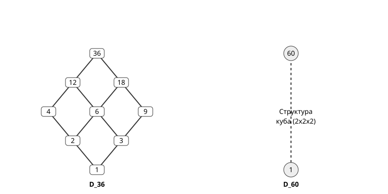

# Решітка дільників

<preknowlist>
- [Найбільший спільний дільник (НСД)](book:math/gcd-euclidean) — infimum.
- [Найменше спільне кратне (НСК)](book:math/lcm) — supremum.
- [Основна теорема арифметики](book:math/fundamental-theorem-arithmetic) — розклад на прості множники.
</preknowlist>

Коли ми дивимося на множину всіх дільників певного натурального числа n, ми можемо помітити, що вони не просто розкидані хаотично, як камінці на дорозі. Уявіть, що кожен дільник — це деталь у великому конструкторі, з якого будується наше число. Деякі дільники є невід'ємними частинами інших дільників, і таким чином вони утворюють складну, багаторівневу ієрархію, яка має свої строгі закони та архітектуру.

Ця ієрархія не є звичайною прямою лінією, до якої ми звикли. Наприклад, якщо ми візьмемо число 6, його повним набором дільників є множина {1, 2, 3, 6}. Ми чудово знаємо зі звичайної арифметики, що 2 є меншим за 3. Але чи ділиться 3 на 2 без остачі? Звісно, ні. Тобто, з точки зору світу подільності, 2 і 3 є абсолютно "незалежними" або "непорівнянними" елементами. Жоден з них не підпорядковується іншому в сенсі ділення. Ця розгалужена, деревоподібна система зв'язків утворює те, що в математиці та інформатиці називається *частково впорядкованою множиною*, а в нашому конкретному випадку — ми отримаємо так звану **решітку дільників**.

> 🔧 **Навіщо це потрібно.**
> У програмуванні, криптографії та комп'ютерних науках загалом решітка дільників дозволяє глибоко зрозуміти внутрішню будову підгруп мультиплікативної групи за модулем n. Це ідеальний, наочний і дуже практичний приклад для вивчення булевих алгебр, операцій над множинами та загальної теорії решіток. Багато алгоритмів факторизації та оптимізованого пошуку, які працюють з дільниками (наприклад, у задачах криптоаналізу або розподілу ресурсів), використовують цю приховану геометричну структуру для того, щоб не перебирати всі можливі варіанти, а відкидати цілі гілки, які гарантовано не відповідають шуканим умовам.

## 1. Частковий порядок подільності: нові правила гри у світі чисел

Давайте на мить забудемо про те, що одне число просто більше або менше за інше. Забудьмо про звичайну шкільну лінійку, де числа йдуть одне за одним: 1 < 2 < 3 < 4 < 5. У світі решіток дільників ми свідомо запроваджуємо нове, суворе правило порівняння. Ми будемо казати, що певне число a "менше або дорівнює" числу b (і позначатимемо це звичним символом a ≤ b, але з новим змістом), тільки і виключно тоді, коли число a ділить число b без остачі. Математично це позначається вертикальною рискою: a | b.

Чому ми взагалі маємо право називати ділення "порядком"? Тому що це відношення подільності a | b поводиться дуже схоже на звичайне поняття "менше або дорівнює", підкоряючись трьом фундаментальним законам логіки. Уявіть, що ви будуєте строге ієрархічне суспільство, де вираз "особа a підпорядковується особі b" означає, що a є дільником b. Щоб ця система мала сенс і не перетворилася на хаос, вона повинна мати певні базові гарантії. Давайте розглянемо їх детальніше, використовуючи метод Фейнмана для деконструкції складного.

1. **Рефлексивність (Кожен є частиною самого себе).** 
   Будь-яке натуральне число завжди ділить саме себе без остачі. Тобто завжди виконується a | a. Наприклад, 5 ділиться на 5 (результат 1). 100 ділиться на 100. Це означає, що в нашій ієрархії кожен елемент може бути замінений самим собою. Немає числа, яке було б "більшим" за себе в цьому нашому новому сенсі. Це базове правило самоузгодженості.

2. **Антисиметричність (Жодного замкненого кола підлеглих).** 
   Припустімо, що число a ділить число b (a | b), і водночас, так сталося, що число b ділить число a (b | a). Який висновок ми можемо зробити, якщо ми працюємо лише з додатними натуральними числами? Єдиний можливий висновок — це те, що a і b є одним і тим самим числом, тобто a = b. Ви не можете мати ситуацію, коли керівник підпорядковується своєму власному підлеглому, якщо тільки це не одна і та сама особа в різних ролях. Наприклад, якщо a ділить 4, і 4 ділить a, то a гарантовано дорівнює 4. Жодних парадоксів замкненого кола не існує.

3. **Транзитивність (Ланцюгова реакція подільності).** 
   Якщо число a ділить число b (a | b), а число b, у свою чергу, ділить число c (b | c), то a обов'язково, без винятків, ділить c (a | c). Наприклад, якщо 2 ділить 4, а 4 ділить 12, то логічно, що 2 автоматично ділить 12. Це правило дозволяє нам будувати довгі, надійні ланцюги спадковості. Якщо ви є цеглинкою для стіни (2 для 4), а стіна є частиною будинку (4 для 12), то ви, безсумнівно, є цеглинкою для всього будинку (2 для 12).

Саме ці три властивості — рефлексивність, антисиметричність і транзитивність — формально перетворюють множину всіх дільників конкретного числа на **частково впорядковану множину** (в англомовній літературі часто використовується термін *poset*, утворений від partially ordered set). 

Слово "частково" тут є найважливішим. У звичайному житті, працюючи зі звичайним відношенням ≤, будь-які два числа можна порівняти. Ви берете будь-які два камінці, і один з них завжди буде не більшим за інший. Наприклад, візьмемо 5 і 7. Ми точно знаємо, що 5 < 7. Цей порядок називається повним або лінійним. 

Але в нашому світі подільності все інакше. Візьмемо ті ж 5 і 7. Чи 5 ділить 7 без остачі? Ні. Чи 7 ділить 5? Ні. Вони є непорівнянними. Жодне не стоїть вище за інше в нашій ієрархії. Саме ця фундаментальна неможливість порівняти будь-які два випадкові елементи робить загальну структуру не нудною простою лінією, а дуже розгалуженим деревом або багатовимірною сіткою. Деякі гілки ростуть паралельно і ніколи не перетинаються безпосередньо.

## 2. Діаграми Хассе: малюємо точну карту нашого світу

Якщо ми маємо таку складну багаторівневу структуру з розгалуженнями, як нам її візуалізувати? Як намалювати карту, на якій з першого погляду буде видно, хто кому підпорядковується, а хто розвивається незалежно? Для цього математики винайшли геніально простий і елегантний графічний інструмент — **діаграми Хассе** (названі на честь Гельмута Хассе).

Припустимо, ми хочемо детально дослідити множину дільників числа 12. Позначимо цю множину як D_12. 
Повний набір дільників 12 — це множина {1, 2, 3, 4, 6, 12}. 
Як намалювати цю ієрархію так, щоб не заплутатися в лініях?

Правила побудови діаграми Хассе надзвичайно суворі, але дуже логічні:
1. Кожне число з нашої множини зображується як окрема точка (або вузол) на папері.
2. Якщо a ділить b (a | b), ми завжди малюємо точку b фізично вище за точку a на аркуші. Це візуально показує, що b є "більшим" або "вищим" у нашому частковому порядку.
3. Ми малюємо суцільну лінію, що з'єднує a і b, **тільки і виключно тоді**, коли a ділить b, і між ними **немає жодного іншого посередника**. Тобто не існує такого числа c в нашій множині, щоб одночасно a | c і c | b. Це правило називається математичним терміном *транзитивна редукція*. Воно робить наше креслення неймовірно чистим, прибираючи зайвий візуальний шум. Наприклад, ми знаємо, що 2 ділить 12. Але між ними лежить число 4 (оскільки 2|4 і 4|12) та число 6 (оскільки 2|6 і 6|12). Тому ми категорично НЕ малюємо пряму лінію від 2 відразу до 12. Ми дозволяємо нашому шляху йти природно через 4 або через 6.

Давайте покроково уявимо і побудуємо діаграму для D_12:
- На самому фундаментальному дні нашої діаграми завжди, для будь-якого n, знаходиться число 1. Чому? Бо одиниця ділить абсолютно всі цілі числа. Вона є основою всього.
- Від 1 ми малюємо дві лінії вгору, які розходяться як гілки: до числа 2 і до числа 3. Ми робимо так, бо 1 ділить і 2, і 3, і між 1 і 2 (або 1 і 3) немає жодних інших цілих чисел.
- Тепер дивимося на число 2. Воно ділить 4 і 6. Отже, від двійки лінії йдуть ще вище — до 4 і до 6.
- Дивимося на число 3. З усіх дільників, що залишилися, воно ділить лише 6 безпосередньо (4 на 3 не ділиться). Отже, від трійки лінія йде вгору до 6, приєднуючись до тієї лінії, що прийшла від двійки.
- Нарешті, на самій вершині нас чекає число 12. Хто його безпосередні підлеглі? Це 4 і 6. Отже, від 4 і від 6 лінії сходяться в одній верхній точці — числі 12.

Якщо ви намалюєте це на папері, у вас вийде чудова симетрична фігура. Вона буде схожа на ромб (утворений числами 1, 2, 3, 6), до верхньої лівої вершини якого (числа 2) прикріплено додатковий ланцюжок до 4, а потім 4 і 6 з'єднуються у 12. Рухаючись цими лініями строго знизу вгору, ми можемо безпомилково прослідкувати абсолютно всі ланцюги подільності. Головне правило читання діаграми Хассе: якщо ви можете "доїхати" від числа a до числа b, рухаючись лише вгору по вже намальованих з'єднаних лініях, то число a гарантовано ділить число b. Якщо шляху немає, подільності немає.

Слід розуміти, що кожне число n генерує свою власну, унікальну архітектуру діаграми. Наприклад, діаграма для будь-якого простого числа p (скажімо, 7 або 13) — це найнудніша фігура: просто вертикальний відрізок з числом 1 внизу і самим числом p вгорі. Діаграма для квадрата простого числа p^2 (наприклад, 4 або 9 або 25) — це прямий вертикальний ланцюжок з трьох точок: 1, потім p, потім p^2. Чим більше абсолютно різних простих дільників має наше число n, тим більш розгалуженою, широкою і багатовимірною стає його діаграма Хассе. 

## 3. Решітка: коли існує надійний фундамент і спільний дах

Ми вже з'ясували, що множина дільників D_n є частково впорядкованою множиною. Але чому ми з такою впевненістю називаємо її саме **решіткою** (від англійського математичного терміну lattice)? 

В абстрактній алгебрі частково впорядкована множина отримує значне підвищення у статусі і гордо стає "решіткою", якщо вона виконує одну дуже сувору, але красиву вимогу. Ця вимога звучить так: для **будь-яких двох** випадково обраних елементів (назвемо їх a та b) в цій множині повинні гарантовано існувати два особливих об'єкти:
1. Найменша спільна верхня межа (математичною мовою це називається supremum, або точна верхня грань).
2. Найбільша спільна нижня межа (це називається infimum, або точна нижня грань).

Звучить дещо абстрактно? Давайте розберемо це на прості деталі, використовуючи метод Фейнмана. Уявіть, що a і b — це дві випадкові гілки на нашому величезному дереві дільників. Вони можуть знаходитися де завгодно.

Що таке взагалі **верхня межа** для a і b? Це будь-яке число c в нашій конкретній множині D_n, яке є "більшим" за обидва ці числа. У нашому світі подільності це означає, що число c повинно ділитися і на a, і на b одночасно (тобто a | c і b | c). Таких чисел може бути багато. Але решітка вимагає наявності **найменшої** спільної верхньої межі. Тобто ми шукаємо найменше можливе число, яке все ще ділиться на обидва наші числа a і b. 
Замисліться на секунду. Найменше число, яке ділиться на a і на b... Де ми це вже чули? Звичайно! Це ж старе добре **Найменше спільне кратне (НСК)**! 
Отже, в решітці дільників supremum будь-яких двох елементів a і b — це не якась абстрактна концепція, це просто їхнє НСК. 
Математично це записується дуже коротко: sup(a, b) = lcm(a, b). 

Тепер подивимось у зворотному напрямку, вниз. Що таке **нижня межа** для тих самих a і b? Це будь-яке число d, яке є "меншим" за них обох. У світі подільності це означає, що число d повинно одночасно ділити і a, і b без остачі (тобто d | a і d | b). Знову ж таки, таких спільних дільників може бути декілька, особливо якщо числа великі. Наприклад, для чисел 12 і 18 спільними дільниками є 1, 2, 3 і 6. Усі вони є "нижніми межами". Але решітка суворо вимагає наявності **найбільшої** спільної нижньої межі. Яке найбільше число ділить і a, і b одночасно? Відповідь очевидна: це **Найбільший спільний дільник (НСД)**!
Отже, infimum двох елементів a і b — це просто їхнє НСД.
Математично це виглядає так: inf(a, b) = gcd(a, b).

Оскільки для абсолютно будь-яких двох натуральних чисел a і b ми завжди, за будь-яких умов, можемо знайти і їхній НСД, і їхній НСК, і оскільки для будь-яких двох дільників числа n їхні НСД та НСК також гарантовано будуть дільниками того самого числа n (вони ніколи не "вискочать" несподівано за межі нашої замкненої множини D_n), ми можемо зробити тріумфальний і остаточний висновок: **множина дільників D_n утворює повноцінну, ідеальну математичну решітку**. 

Ця решітка має абсолютно чіткі, непорушні межі. На самому низу, як абсолютний, непохитний infimum всієї системи, лежить число 1 (тому що gcd всіх існуючих дільників завжди дорівнює 1). На самій вершині, як абсолютний supremum, що накриває все собою, гордо височіє саме початкове число n (тому що lcm всіх його дільників очевидно дорівнює n). Кожен ваш рух вгору по лініях Хассе — це математичний перехід до кратного. Кожен ваш рух вниз — це перехід до дільника.

## 4. Геометрична інтерпретація та багатовимірна координатна сітка

Тепер, коли ми зрозуміли алгебраїчну суть, давайте зробимо крок назад і подивимось на всю цю приголомшливу структуру з висоти пташиного польоту. Як ми можемо миттєво зрозуміти форму і вигляд решітки D_n, навіть не малюючи її на папері? Тут на велику сцену виходить **Основна теорема арифметики**, яка дарує нам справжній геометричний зір.

Згідно з цією фундаментальною теоремою, абсолютно будь-яке число n можна унікально розкласти на прості множники:
n = p_1^a_1 · p_2^a_2 · ... · p_k^a_k
де p_i — це різні прості числа (наприклад, 2, 3, 5, 7), а a_i — це їхні ступені (які показують, скільки разів кожне просте число входить у загальний розклад).

Кожен дільник d нашого числа n теж обов'язково складається з цих самих простих чисел (іншим просто нізвідки взятися), але, можливо, з меншими або нульовими ступенями:
d = p_1^b_1 · p_2^b_2 · ... · p_k^b_k
де показники b_i можуть приймати будь-які цілі значення від 0 до a_i (тобто виконується умова 0 ≤ b_i ≤ a_i для кожного індексу i).

Це просте спостереження відкриває нам фантастичну, глибоку геометричну метафору. Давайте уявимо на мить, що кожне унікальне просте число p_i — це окремий вимір (просторова вісь) у нашому уявному багатовимірному просторі. 
- Вісь X нехай відповідає за ступені двійки (скільки двійок є в розкладі).
- Вісь Y нехай відповідає за ступені трійки.
- Вісь Z нехай відповідає за ступені п'ятірки, і так далі для кожного нового простого числа.

Тоді кожен конкретний дільник d — це просто фіксована точка в цьому математичному багатовимірному просторі! А її точні координати визначаються саме ступенями (b_1, b_2, ..., b_k). 

Що в такій моделі означає фраза "число d_1 ділить число d_2"? Геометрично це означає надзвичайно просту і наочну річ: кожна окрема координата першої точки є меншою або дорівнює відповідній координаті другої точки. Тобто b_1,i ≤ b_2,i для кожного окремого виміру i. Якщо ви знаходитесь лівіше, нижче і ближче до початку координат, ніж інша точка, значить ви є її дільником.

У цій парадигмі решітка D_n перестає бути просто абстрактним графом і стає буквально **багатовимірною прямокутною сіткою точок** (математики називають це гіперпрямокутником). 

Давайте розберемо це на живому прикладі. Нехай наше число n = 72. Його канонічний розклад виглядає так: 72 = 2^3 · 3^2. 
Ми маємо лише два різні прості множники (2 і 3), отже, наш геометричний світ для числа 72 є ідеально двовимірним (це звичайна площина). 
- По горизонтальній осі двійок ми можемо зробити від 0 до 3 кроків. Це утворює лінійний ланцюг довжиною в 4 точки.
- По вертикальній осі трійок ми можемо зробити від 0 до 2 кроків. Це утворює ланцюг довжиною в 3 точки.
Таким чином, загальна решітка D_72 — це просто прямокутна сітка розміром 4 на 3 точки. Всього вона містить 12 точок (що відповідає 12 унікальним дільникам числа 72). 
Якщо ви намалюєте діаграму Хассе для цього числа, вона буде виглядати точно як нахилена шахова дошка 4х3, де ви можете рухатися лише дозволеними шляхами: вгору і вправо по лініях сітки.

А що, якщо n = 30? Розклад: 30 = 2^1 · 3^1 · 5^1. Тут ми маємо вже три виміри, але по кожному з них можна зробити лише один-єдиний крок (від 0 до 1). Це означає, що решітка D_30 візуально формує ідеальний тривимірний куб, який має розміри 2x2x2 і містить рівно 8 вершин (дільників).

Ця чудова ізоморфність (повна структурна ідентичність) прямому добутку звичайних лінійних ланцюгів означає одну неймовірну річ: загальна складність і форма решітки залежать **виключно** від того, які саме ступені a_i стоять при простих множниках. Самі прості числа (чи це 2, чи це величезне просте число на кшталт 101 або 1000003) не мають абсолютно жодного впливу на форму решітки! Геометрична решітка для числа n = 2^3 · 3^2 буде абсолютно такою ж за своєю формою, структурою зв'язків і кількістю елементів, як і решітка для числа n = 5^3 · 11^2. Вони обидві будуть виглядати як ідентичні прямокутні сітки 4х3, незважаючи на те, що самі числа і їхні дільники кардинально відрізняються за величиною. Форма править усім.

## 5. Вільні від квадратів числа та магія булевих алгебр 2^k

Серед усього безмежного моря натуральних чисел існує дуже цікавий і важливий окремий випадок, який варто розглянути детальніше. Що буде, якщо канонічний розклад числа n на прості множники взагалі не містить ступенів, вищих за 1? 

Візьмемо, наприклад, наше знайоме число n = 2 · 3 · 5 = 30, або інший приклад, n = 7 · 11 · 13 = 1001. Такі числа в теорії чисел називаються **вільними від квадратів** (англійською square-free). Ця назва дуже влучна, адже такі числа дійсно не діляться на жоден повний квадрат будь-якого цілого числа, більшого за одиницю.

Для таких специфічних чисел координати в нашому вигаданому багатовимірному просторі стають вкрай бідними на варіанти: кожна вісь дозволяє лише два можливі значення: 0 або 1. Третього не дано. Це означає, що кожне унікальне просте число або повністю присутнє в розкладі конкретного дільника (і тоді його координата 1), або повністю відсутнє (і тоді його координата 0). 

Ця бінарна природа приводить нас до однієї з найважливіших і найглибших структур у всій вищій математиці та теоретичній інформатиці. Кожен дільник d тепер можна абсолютно однозначно і безпомилково асоціювати з **підмножиною** початкової множини всіх простих дільників числа n. 

Давайте розпишемо це детально для нашого прикладу n = 30, де базовими "будівельними блоками" (множиною простих факторів) є {2, 3, 5}:
- Самий перший дільник 1 (який можна записати як 2^0 · 3^0 · 5^0) ідеально відповідає порожній множині, оскільки не містить жодного простого числа. Порожня множина позначається як {}.
- Дільник 2 (записується як 2^1 · 3^0 · 5^0) відповідає множині, що містить лише один елемент: {2}.
- Дільник 6 (записується як 2^1 · 3^1 · 5^0) відповідає множині з двох елементів: {2, 3}.
- Нарешті, саме число 30 відповідає повній множині всіх доступних блоків: {2, 3, 5}.

У цій унікальній ситуації базове відношення подільності (a | b) миттєво перетворюється на знайоме з теорії множин відношення включення множин (A ⊆ B). Число a є дільником числа b тоді і тільки тоді, коли множина простих факторів, з яких складається a, є повноцінною підмножиною простих факторів, з яких складається b. 

Ця трансформація йде ще далі, захоплюючи наші операції:
- НСД двох дільників (наш infimum в решітці) стає ідеально еквівалентним операції перетину множин (A ∩ B). Ви просто берете ті прості числа, які є спільними для обох множин.
- НСК двох дільників (наш supremum в решітці) стає еквівалентним операції об'єднання множин (A ∪ B). Ви просто збираєте всі прості числа з обох множин разом, без дублікатів.

Коли математична решітка побудована саме таким чином (де всі максимальні ступені жорстко дорівнюють 1), вона утворює фундаментальну структуру, що носить горду назву **булева алгебра**. 

Геометрично це виглядає приголомшливо. Діаграма Хассе для будь-якого вільного від квадратів числа, що має рівно k простих факторів, завжди, без жодних винятків, виглядає як ідеальний k-вимірний гіперкуб. 
- Для числа з 2 факторами (наприклад, 6 = 2 · 3) решітка — це звичайний плоский квадрат.
- Для числа з 3 факторами (наприклад, 30) решітка — це ідеальний тривимірний куб.
- Для числа з 4 факторами (наприклад, 210 = 2 · 3 · 5 · 7) решітка стає загадковим 4-вимірним гіперкубом (тессерактом). 

Кількість елементів (вузлів) у такій решітці завжди точно дорівнює 2^k, що повністю збігається з кількістю всіх можливих підмножин множини з k елементів (що в математиці позначається як булеан 2^k).

Це неймовірно глибокий і потужний зв'язок. Він буквально означає, що фундаментальні закони формальної логіки (на кшталт І, АБО, НЕ), якими ми щодня користуємося для обчислення істинності та хибності виразів у програмуванні (де змінні приймають значення 0 або 1), є структурно, геометрично і алгебраїчно абсолютно ідентичними до законів подільності для вільних від квадратів чисел! 

## 6. Дистрибутивність: ідеальна гармонія операцій НСД та НСК

Насамкінець, давайте торкнемося ще однієї красивої алгебраїчної властивості. Коли ми працюємо зі звичайними числами та звичними арифметичними операціями, додавання і множення мають одну надзвичайно приємну і корисну властивість, яку ми вивчаємо ще в молодших класах школи. Ця властивість називається дистрибутивністю, або розподільним законом. Ми всі добре знаємо і пам'ятаємо, що a · (b + c) завжди дорівнює (a · b) + (a · c). Кажуть, що множення "дистрибутується" або "розподіляється" по доданках всередині дужок, розкриваючи їх.

Чи існує щось подібне, якась схожа гармонія в нашому новому світі решіток дільників? Адже у нас тут немає звичайного множення і тим більше немає додавання. Але замість них у нас є наші вірні операції взяття точної верхньої та нижньої граней: НСД (який ми для зручності позначимо логічним символом ∧) та НСК (який позначимо перевернутим символом ∨). 

Виникає природне питання: чи є решітка дільників дистрибутивною? Відповідь: рішуче Так! Решітка дільників D_n є класичним, хрестоматійним прикладом **дистрибутивної решітки**. 

Це означає, що наші операції НСД і НСК розподіляються одна щодо одної, дуже подібно до того, як множення розподіляється щодо додавання. Але є один нюанс, який робить цю ситуацію ще кращою: вони роблять це абсолютно симетрично!

Давайте подивимося на ці закони:

**Закон 1: НСД ідеально дистрибутивний щодо НСК**
Запишемо це символічно: a ∧ (b ∨ c) = (a ∧ b) ∨ (a ∧ c)
Звичайною, людською мовою це звучить так: Найбільший спільний дільник числа a та (найменшого спільного кратного чисел b і c) завжди точно дорівнює найменшому спільному кратному двох окремих НСД: (НСД чисел a і b) та (НСД чисел a і c).
Запишемо це через звичні функції: gcd(a, lcm(b, c)) = lcm(gcd(a, b), gcd(a, c)).

**Закон 2: НСК ідеально дистрибутивний щодо НСД (Симетрія!)**
Запишемо символічно: a ∨ (b ∧ c) = (a ∨ b) ∧ (a ∨ c)
Через функції: lcm(a, gcd(b, c)) = gcd(lcm(a, b), lcm(a, c)).

Зверніть особливу увагу на цей другий закон. Звичайні арифметичні додавання і множення не мають такої розкішної подвійної симетрії! Вираз a + (b · c) категорично не дорівнює виразу (a + b) · (a + c) у загальному випадку. А от НСД і НСК працюють в ідеальній взаємній гармонії, дозволяючи розкривати дужки в будь-якому напрямку.

Чому ж ця дистрибутивність працює так бездоганно саме в решітці дільників? Щоб зрозуміти це на інтуїтивному рівні, знову згадайте нашу геометричну метафору з координатами — ступенями простих чисел.
Ми вже знаємо, що коли ми шукаємо НСД двох чисел, для кожного простого множника в розкладі ми просто беремо **мінімум** з його ступенів.
І коли ми шукаємо НСК, ми робимо зворотну операцію: беремо **максимум** з його ступенів.

Отже, фундаментальне питання про дистрибутивність загальних операцій НСД і НСК елегантно зводиться до набагато простішого питання про дистрибутивність звичайних функцій мінімуму і максимуму для звичайних чисел. Чи правда, що:
min(x, max(y, z)) = max(min(x, y), min(x, z)) ?
Якщо ви трохи подумаєте над цим рівнянням і просто переберете кілька тестових значень у голові, ви швидко побачите, що це дійсно завжди, за будь-яких умов ідеально працює. Наприклад, нехай x=3, y=1, z=5. 
Знайдемо ліву частину: min(3, max(1, 5)) = min(3, 5) = 3.
Знайдемо праву частину: max(min(3, 1), min(3, 5)) = max(1, 3) = 3. 
Все ідеально збігається! Результат однаковий.

Оскільки математичний мінімум і максимум є дистрибутивними на найнижчому рівні — на рівні окремих координат (ступенів простих чисел), ця дистрибутивність природно і неминуче переноситься на весь наш великий багатовимірний гіперпрямокутник, роблячи решітку D_n повністю дистрибутивною структурою. 

## 7. Підсумок і погляд у майбутнє

Решітка дільників — це далеко не просто сухий список чисел, які здатні ділити n. Це надзвичайно глибока, витончена алгебраїчна і геометрична структура, яка приховує в собі справжню красу математики. 

Розуміння цієї прихованої структури дозволяє нам бачити багатовимірні кристали, сховані всередині, здавалося б, звичайних, одновимірних натуральних чисел. Відтепер, коли ви дивитесь на число і думаєте про всі його можливі дільники, ви більше не повинні бачити невпорядковану купу або хаотичний набір камінців. Ви повинні бачити чітку, строго орієнтовану в просторі математичну решітку, вузли якої міцно з'єднані непохитними законами подільності. 

Ви повинні уявляти елегантні діаграми Хассе, що нагадують складні молекулярні чи кристалічні ґратки. Ви повинні бачити булеві багатовимірні гіперкуби, що виникають з вільних від квадратів чисел, пов'язуючи теорію чисел з основами логіки. Ви повинні розуміти дистрибутивні властивості, що керують потоками НСД і НСК, дозволяючи вільно маніпулювати ними як алгебраїчними об'єктами. 

Цей глибокий структурний підхід є не просто красивою теорією. Він є абсолютно необхідним для розвитку сучасної криптографії, безпеки даних та передової теорії алгоритмів. У цих галузях швидкість виконання обчислень і безпека цілих систем часто залежать від здатності програміста чи математика зрозуміти і використати ці приховані геометричні ландшафти чисел. Тільки бачачи повну картину решітки, можна знаходити справді оптимальні шляхи і рішення.
