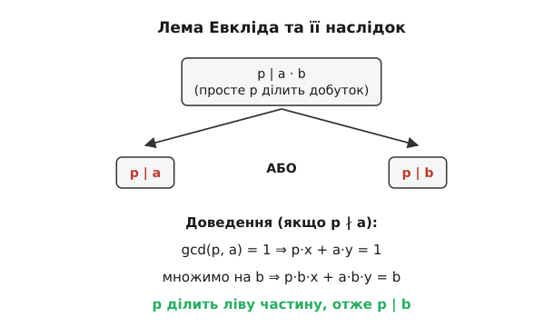

<preknowlist>
- [Що таке просте число?](../prime-numbers/prime-numbers-d.html)
- [Алгоритм Евкліда та найбільший спільний дільник (НСД)](../gcd-euclidean/gcd-euclidean-d.html)
- [Взаємно прості числа](../gcd-euclidean/coprime-d.html)
</preknowlist>

# Лема Евкліда

Уявіть, що ви зібрали велику конструкцію з лего, використовуючи деталі різних кольорів. Якщо ви точно знаєте, що в готовій конструкції є червона деталь, це означає, що ви взяли її з якоїсь конкретної коробки. Червона деталь не могла утворитися сама собою з поєднання синіх або жовтих деталей. У світі чисел прості числа є саме такими неподільними кольоровими деталями. Вони не можуть виникнути з нізвідки. Якщо просте число є частиною великого добутку, воно обов'язково має бути частиною хоча б одного з множників, з яких цей добуток складено. Саме цю глибоку, інтуїтивну, але водночас фундаментальну ідею формалізує лема Евкліда.

> 🔧 **Навіщо це.** Лема Евкліда — це міст між звичайним діленням і унікальним розкладом на прості множники. Без цієї леми математики не змогли б гарантувати, що кожне число можна розкласти на прості множники тільки одним способом. Якщо ви коли-небудь цікавилися, чому криптографія (наприклад, алгоритм RSA) працює надійно, або чому розклад на прості числа вважається унікальним "ДНК" кожного числа, відповідь завжди криється в лемі Евкліда.

## 1. Суть леми: неможливість поділу неподільного

Почнемо з найпростішого формулювання. Лема Евкліда стверджує:

**Якщо просте число p ділить добуток двох цілих чисел a та b (тобто p | a·b), то це просте число p обов'язково ділить або число a (p | a), або число b (p | b), або обидва.**

Зверніть увагу на символ "|". У теорії чисел запис "x | y" читається як "x ділить y", що означає: y ділиться на x без остачі (тобто існує таке ціле число k, що y = k·x). Відповідно, символ "∤" означає "не ділить".

Давайте перевіримо це на конкретних числах. Візьмемо просте число p = 7. Нехай a = 12 і b = 35. Їхній добуток a·b = 12 · 35 = 420. Чи ділиться 420 на 7? Так, 420 / 7 = 60. Оскільки 7 — просте число, лема Евкліда гарантує, що 7 має ділити або 12, або 35. Перевіряємо: 12 на 7 не ділиться (залишається остача 5). А ось 35 ділиться на 7 без остачі (35 / 7 = 5). Лема спрацювала ідеально.

А тепер подивимось, що станеться, якщо ми візьмемо не просте, а складене число. Нехай p = 6 (яке дорівнює 2 · 3). Візьмемо a = 4 і b = 9. Їхній добуток a·b = 36. Чи ділиться 36 на 6? Так, 36 / 6 = 6. Чи ділить 6 хоча б одне з чисел 4 або 9? Ні! Число 4 на 6 не ділиться, і число 9 на 6 не ділиться. 

Чому так вийшло? Чому лема "зламалася" для числа 6? Тому що 6 — це складене число. Воно складається з двох простіших частинок: 2 і 3. Коли ми перемножували 4 (яке містить двійки) і 9 (яке містить трійки), ці "частинки" об'єдналися утворивши 6. Складене число може "збиратися" зі шматочків, розкиданих по різних множниках. Але просте число — це моноліт. Його неможливо зібрати по шматочках. Якщо воно є в результаті, воно повинно було прийти цілком із якогось одного множника. 

## 2. Від інтуїції до суворої математики

Хоча метафора з деталями лего чудово пояснює суть, математикам потрібне строге логічне доведення. Щоб довести лему Евкліда, нам не потрібно винаходити нову математику; достатньо використати інший геніальний інструмент — **Тотожність Безу** (названу на честь французького математика Етьєна Безу, хоча алгоритм був відомий ще Евкліду).

### Тотожність Безу як ключ до розгадки

Тотожність Безу стверджує дуже цікаву властивість найбільшого спільного дільника. Якщо ми маємо два цілих числа, скажімо m та n, і їхній найбільший спільний дільник дорівнює d, то завжди існують такі цілі числа x та y (вони можуть бути від'ємними), що виконується рівняння:

m·x + n·y = d

Це означає, що найбільший спільний дільник завжди можна подати як лінійну комбінацію самих чисел.

Нас найбільше цікавить випадок, коли два числа є **взаємно простими**. Два числа називаються взаємно простими, якщо вони не мають жодних спільних дільників, крім одиниці (тобто їхній НСД дорівнює 1). Для взаємно простих чисел m та n тотожність Безу набуває надзвичайно елегантного вигляду:

m·x + n·y = 1

### Крок за кроком: Доведення леми Евкліда

Тепер ми повністю готові суворо довести лему Евкліда.

**Дано:** 
1. Просте число p.
2. Цілі числа a та b.
3. Відомо, що p ділить добуток a·b (тобто a·b = p·k для деякого цілого числа k).

**Треба довести:** 
Що p ділить a (p | a) або p ділить b (p | b).

**Доведення:**
Розглянемо число a. У нас є два можливі сценарії щодо його стосунків із простим числом p.

**Сценарій 1:** Просте число p ділить число a. Якщо це так, то ми вже закінчили! Лема доведена, адже ми виконали умову "p | a або p | b".

**Сценарій 2:** Просте число p НЕ ділить число a (тобто p ∤ a). 
Ось тут починається справжня магія. Оскільки p — просте число, його єдиними дільниками є 1 та воно саме (p). Якщо воно не ділить a, це означає, що числа p та a не мають жодних спільних дільників, крім одиниці. Отже, їхній найбільший спільний дільник дорівнює 1:
gcd(p, a) = 1

Оскільки p та a є взаємно простими, ми можемо застосувати до них Тотожність Безу. Існують такі цілі числа x та y, що:
p·x + a·y = 1

Нам потрібно щось дізнатися про число b. Тому давайте помножимо обидві частини нашого рівняння Безу на число b:
(p·x + a·y) · b = 1 · b
p·b·x + a·b·y = b

Давайте уважно подивимося на ліву частину отриманого рівняння: p·b·x + a·b·y. Вона складається з двох доданків.

Перший доданок: **p·b·x**. Чи ділиться він на p? Очевидно, що так, адже в ньому прямо фігурує множник p. Його можна записати як p·(b·x).

Другий доданок: **a·b·y**. З умови ми знаємо, що добуток a·b ділиться на p (тобто a·b = p·k). Підставимо це: a·b·y = (p·k)·y = p·(k·y). Отже, другий доданок також ділиться на p!

Якщо і перший, і другий доданки діляться на p, то їхня сума також обов'язково ділиться на p. Запишемо це формально, винісши p за дужки:
b = p·b·x + p·k·y
b = p · (b·x + k·y)

Оскільки числа b, x, k, y є цілими, вираз у дужках (b·x + k·y) також є цілим числом. А це означає, що b є числом p, помноженим на якесь ціле число. 

Отже, p ділить b (p | b)! Що й треба було довести. 

Цей доказ є шедевром математичної логіки. Він показує, як відсутність спільного дільника між p та a (що призводить до появи одиниці через тотожність Безу) неминуче "перекидає" відповідальність за подільність на друге число b.

## 3. Узагальнена лема Евкліда (для взаємно простих чисел)

Доведення, яке ми щойно розібрали, приховує в собі ще один неймовірно потужний результат. Зверніть увагу: ми використали те, що p — просте число, ТІЛЬКИ для того, щоб гарантувати, що gcd(p, a) = 1. Сама по собі "простота" числа p більше ніде в доведенні не використовувалася!

Це означає, що ми можемо розширити дію леми Евкліда на будь-які числа, за умови, що вони є взаємно простими.

**Узагальнена лема Евкліда:**
**Якщо ціле число n ділить добуток a·b (n | a·b), і при цьому число n є взаємно простим із числом a (тобто gcd(n, a) = 1), то число n обов'язково ділить число b (n | b).**

Це набагато ширше і корисніше формулювання. Давайте перевіримо його на прикладі зі складеними числами.
Нехай n = 10, a = 21, b = 30.
Добуток a·b = 21 · 30 = 630.
Чи ділить 10 число 630? Так, 630 / 10 = 63.
Тепер перевіримо, чи є n та a взаємно простими. n = 10 (ділиться на 1, 2, 5, 10). a = 21 (ділиться на 1, 3, 7, 21). Спільних дільників, крім 1, немає. Отже, gcd(10, 21) = 1.
Згідно з узагальненою лемою, оскільки 10 ділить добуток, але взаємно просте з 21, воно зобов'язане ділити число b (тобто 30). І справді, 30 чудово ділиться на 10.

Ця узагальнена форма леми постійно використовується під час розв'язування діофантових рівнянь та в модулярній арифметиці, де нам часто потрібно "скорочувати" рівняння на множник, який є взаємно простим з модулем.

## 4. Наслідки: від кількох чисел до нескінченності

Лему Евкліда дуже легко поширити не лише на два множники, а на будь-яку їхню кількість. Припустимо, що просте число p ділить великий добуток кількох чисел: a₁·a₂·a₃·...·aₖ. 

За лемою Евкліда ми можемо розбити цей добуток на дві частини: число a₁ та добуток усіх інших (a₂·a₃·...·aₖ). Тоді p має ділити або a₁, або залишок добутку. Якщо p ділить a₁, ми знайшли наш множник. Якщо ні, то p має ділити залишок (a₂·...·aₖ). Ми знову застосовуємо лему до цього залишку, відщеплюючи a₂, і так далі, поки не дійдемо до кінця.

У результаті ми отримуємо глобальний наслідок: **якщо просте число ділить добуток будь-якої кількості множників, воно обов'язково ділить хоча б один із цих множників.**

### Основна теорема арифметики

Саме цей глобальний наслідок дозволяє нам зробити фінальний крок у доведенні того, що лежить в основі всієї нашої системи чисел — Основної теореми арифметики. Ця теорема стверджує, що кожне ціле число, більше за 1, можна подати як добуток простих чисел, і причому лише одним єдиним способом (з точністю до порядку множників).

Чому без леми Евкліда це було б неможливо довести? Уявіть, що якесь число N можна розкласти на прості множники двома різними способами:
N = p₁·p₂·p₃ = q₁·q₂

Ми беремо просте число p₁. Воно очевидно ділить N. А отже, воно ділить добуток q₁·q₂. За лемою Евкліда, просте число p₁ повинно ділити або q₁, або q₂. Але ж q₁ та q₂ — теж прості числа! Єдині дільники простого числа — це 1 та воно саме. Отже, p₁ має повністю збігатися з одним із чисел q. 

Таким чином, використовуючи лему Евкліда крок за кроком, ми можемо довести, що набір простих чисел зліва повністю ідентичний набору простих чисел справа. Ніяких "альтернативних" розкладів бути не може. Лема Евкліда виступає в ролі математичного вартового, який не дозволяє простим числам химерно переплітатися, утворюючи одне й те саме складене число різними шляхами.

## 5. Лема Евкліда в інших світах

Математика не обмежується лише цілими числами. Ми можемо множити і ділити многочлени (поліноми), комплексні цілі числа Гауса та багато інших абстрактних об'єктів. Дивовижно, але в багатьох з цих систем лема Евкліда продовжує працювати!

Наприклад, у світі многочленів з дійсними коефіцієнтами роль "простих чисел" відіграють незвідні многочлени (ті, які не можна розкласти на множники меншого степеня). Лема Евкліда для многочленів звучить так: якщо незвідний многочлен P(x) ділить добуток двох многочленів A(x)·B(x), то він обов'язково ділить або A(x), або B(x). Це дозволяє нам довести унікальність розкладу многочленів на множники.

Однак існують і математичні світи (так звані кільця), де лема Евкліда ламається. Класичний приклад — числова система, що складається з чисел вигляду a + b·√(-5), де a і b — цілі числа. У цьому дивному світі число 6 можна розкласти двома абсолютно різними способами:
6 = 2 · 3
6 = (1 + √(-5)) · (1 - √(-5))

Числа 2, 3, (1 + √(-5)) та (1 - √(-5)) у цій системі є "простими" (їх неможливо розкласти далі). Проте лема Евкліда тут не працює! Наприклад, число 2 ділить добуток (1 + √(-5)) · (1 - √(-5)), який дорівнює 6, але число 2 не ділить жоден із цих множників окремо. Саме через порушення леми Евкліда в цьому світі зникає унікальність розкладу на множники!

Цей приклад ще яскравіше підкреслює фундаментальну роль леми Евкліда. Вона не є простою тривіальністю; це структурна опора, на якій тримається порядок і передбачуваність нашої звичної арифметики. Розуміння того, як прості числа поводяться в добутках, відкриває двері до вивчення модулярної арифметики, криптографічних протоколів та найглибших таємниць теорії чисел. 

Коли наступного разу ви побачите велике число і його розклад на прості множники, згадайте про лему Евкліда — невидимий закон природи чисел, який гарантує, що цей розклад є справді унікальним і неповторним.
