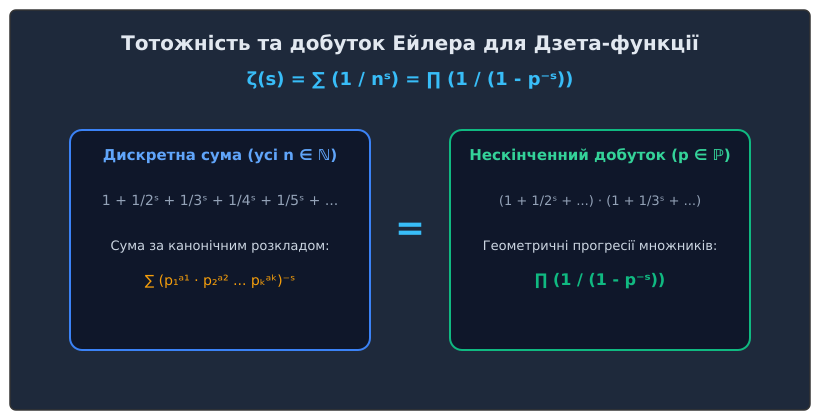

<preknowlist>
- **[Основна теорема арифметики](book:math/fundamental-theorem-arithmetic):** Єдиність розкладу будь-якого натурального числа на прості множники.
- **[Розподіл простих чисел](book:math/prime-distribution):** Поняття Дзета-функції Ейлера та інтегрального логарифма Li(x).
- **[Геометрична прогресія](book:math/binary-period-length):** Сума нескінченно спадної геометричної прогресії 1 / (1 - q).
- **[Теорема Евкліда–Ейлера](book:math/euclid-euler-theorem):** Застосування Ейлерового аналізу до досконалих чисел.
</preknowlist>

> 🔧 **Навіщо це.**
> Тотожність Ейлера для Дзета-функції ζ(s) = ∑ (1 / nˢ) = ∏ (1 / (1 - p⁻ˢ)) є один із найвеличніших мостів в історії науки. Вона об'єднує два протилежні математичні світи: дискретний світ простих чисел (де елементи згенеровані атомною структурою подільності) та аналітичний світ неперервного підсумовування ряду. В інженерії та комп'ютерній науці добуток Ейлера є підґрунтям для криптографічних генераторів псевдовипадкових чисел, аналізу випадкових матриць у квантових обчисленнях та алгоритмів факторизації великих чисел (Quadratic Sieve, General Number Field Sieve).

## 1. Алгебраїчне відкриття 1737 року

У 1737 році Леонард Ейлер сформулював і довів тотожність, яка назавжди змінила теорію чисел. Замість того, щоб досліджувати прості числа як ізольовану послідовність {2, 3, 5, 7, 11, ...}, Ейлер розглянув нескінченний ряд:

ζ(s) = 1 + 1/2ˢ + 1/3ˢ + 1/4ˢ + 1/5ˢ + ... = ∑_{n=1}^∞ 1 / nˢ.

Ейлер довів, що для будь-якого дійсного s > 1 ця нескінченна сума за всіма натуральними числами n тотожно дорівнює нескінченному добутку по всіх простих числах p:

∑_{n=1}^∞ 1 / nˢ = ∏_{p ∈ ℙ} 1 / (1 - p⁻ˢ).

Ліва частина тотожності — це сума за всіма цілими числами, а права частина — це добуток співмножників, кожен з яких відповідає тільки одному простому числу p.

## 2. Конструктивне доведення через решето Ератосфена

Доведення Ейлера є геометричним та алгебраїчним втіленням решета Ератосфена. 

Розглянемо початкову Дзета-суму для s > 1:
(1)  ζ(s) = 1 + 1/2ˢ + 1/3ˢ + 1/4ˢ + 1/5ˢ + 1/6ˢ + 1/7ˢ + ...

### Крок 1: Викреслення кратностей числа 2
Помножимо обидві частини рівняння (1) на 1/2ˢ:
(1/2ˢ) · ζ(s) = 1/2ˢ + 1/4ˢ + 1/6ˢ + 1/8ˢ + 1/10ˢ + ...

Тепер віднімемо це нове рівняння від початкового рівняння (1). Усі додатки, парні знаменники яких є кратними 2, повністю викреслюються:
(1 - 1/2ˢ) · ζ(s) = 1 + 1/3ˢ + 1/5ˢ + 1/7ˢ + 1/9ˢ + 1/11ˢ + ...

Зверніть увагу: у правій частині залишилися тільки ті числа, які не діляться на 2.

### Крок 2: Викреслення кратностей числа 3
Наступним неізольованим елементом у правій частині є 1/3ˢ (де 3 — це наступне просте число). Помножимо отримане рівняння на 1/3ˢ:
(1/3ˢ) · (1 - 1/2ˢ) · ζ(s) = 1/3ˢ + 1/9ˢ + 1/15ˢ + 1/21ˢ + ...

Віднімаючи це від попереднього виразу, ми викреслюємо всі доданки, знаменники яких кратні 3:
(1 - 1/3ˢ) · (1 - 1/2ˢ) · ζ(s) = 1 + 1/5ˢ + 1/7ˢ + 1/11ˢ + 1/13ˢ + 1/17ˢ + ...

Тепер у правій частині залишилися тільки доданки, знаменники яких не діляться ні на 2, ни на 3.

### Крок N: Рекурсивне викреслення всіх простих чисел
Продовжуючи цей процес послідовно для кожного простого числа p_k (5, 7, 11, 13, 17, ...):

[ ∏_{p ≤ p_k} (1 - p⁻ˢ) ] · ζ(s) = 1 + ∑_{n'} 1 / (n')ˢ,

де у правій частині n' пробігає лише ті натуральні числа, які не мають простих дільників, менших або рівних p_k.

Коли ми спрямовуємо p_k → ∞, усі доданки у правій частині, крім першого числа 1, прагнуть до 0 (оскільки найменший залишившись знаменник прагне до нескінченності).

У границі отримаємо:
[ ∏_{p ∈ ℙ} (1 - p⁻ˢ) ] · ζ(s) = 1.

Ділячи обидві частини на нескінченний добуток, ми отримуємо формулу Ейлера:
ζ(s) = ∏_{p ∈ ℙ} 1 / (1 - p⁻ˢ).

## 3. Зв'язок з геометричною прогресією та Основною теоремою арифметики

Існує другий, не менш красивий спосіб зрозуміти тотожність Ейлера — через нескінченні геометричні прогресії.

Для кожного простого числа p вираз (1 - p⁻ˢ)⁻¹ можна розкласти в нескінченну геометричну прогресію зі знаменником q = p⁻ˢ < 1:

1 / (1 - p⁻ˢ) = 1 + p⁻ˢ + p⁻²ˢ + p⁻³ˢ + p⁻⁴ˢ + ...

Тепер запишемо добуток усіх таких геометричних прогресій для кожного простого числа 2, 3, 5, 7, ...:

∏_{p ∈ ℙ} 1 / (1 - p⁻ˢ) = (1 + 2⁻ˢ + 2⁻²ˢ + ...) · (1 + 3⁻ˢ + 3⁻²ˢ + ...) · (1 + 5⁻ˢ + 5⁻²ˢ + ...) · ...

Якщо ми розкриємо дужки у цьому нескінченному добутку, кожен окремий доданок матиме вигляд:
(2^{a₁} · 3^{a₂} · 5^{a₃} · ... )⁻ˢ = (n)⁻ˢ,   де n = 2^{a₁} · 3^{a₂} · 5^{a₃} ...

Згідно з [Основною теоремою арифметики](book:math/fundamental-theorem-arithmetic), кожне натуральне число n > 0 має єдиний канонічний розклад на прості множники. Це означає, що кожен терм 1 / nˢ з'явиться у розкритті дужок **точно один раз**.

Отже, розкритий добуток дає суму 1/1ˢ + 1/2ˢ + 1/3ˢ + 1/4ˢ + ..., що і є Дзета-функцією ζ(s).

## 4. Нове доведення нескінченності простих чисел за Ейлером

До відкриття Ейлера єдиним відомим доведенням нескінченності кількості простих чисел було класичне доведення Евкліда від супротилежного. Ейлер дав перше в історії аналітичне доведення.

Розглянемо тотожність Ейлера при s = 1:
ζ(1) = ∑_{n=1}^∞ 1 / n = ∏_{p ∈ ℙ} 1 / (1 - 1/p).

З математичного аналізу відомо, що ліва частина при s = 1 є гармонічним рядом:
1 + 1/2 + 1/3 + 1/4 + 1/5 + ... = ∞.

Гармонічний ряд розбігається до нескінченності.

Якби множина простих чисел ℙ була скінченною (наприклад, складалася б лише з K простих чисел), то права частина добутку ∏_{k=1}^K 1 / (1 - 1/p_k) була б скінченним добутком K дійсних чисел, а отже мала б скінченне значення.

Однак скінченне число не може дорівнювати нескінченності ∞. Ця суперечність доводить, що кількість простих чисел обов'язково є нескінченною.

Більше того, прологарифмувавши обидві частини, Ейлер довів ще сильніший результат: **сума обернених величин простих чисел розбігається:**
∑_{p ∈ ℙ} 1 / p = ∞.

Це показує, що простих чисел набагато "більше" (вони менш розріджені), ніж, наприклад, точних квадратів (для яких сума ∑ 1/n² = π²/6 є скінченною).

## 5. Обчислення парних значення Дзета-функції через числа Бернуллі

Ейлер не зупинився на формальному доведенні тотожності. У 1735–1748 роках він розв'язав знамениту Базельську задачу про суму квадратів обернених чисел, довівши, що:

ζ(2) = ∑_{n=1}^∞ 1 / n² = π² / 6 ≈ 1.644934.

Використовуючи добуток Ейлера для s = 2, ми отримуємо дивовижне співвідношення між числом π та простими числами:
∏_{p ∈ ℙ} 1 / (1 - 1/p²) = π² / 6.

Перевертаючи обидві частини, ми можемо записати ймовірність того, що два довільно вибрані натуральні числа є взаємно простими:
P(gcd(a, b) = 1) = 1 / ζ(2) = 6 / π² ≈ 0.607927 (приблизно 60.79%).

Загальна формула Ейлера для парних степенів s = 2k виражається через числа Бернуллі B_{2k}:
ζ(2k) = ((-1)^{k+1} · (2π)^{2k} · B_{2k}) / (2 · (2k)!).

Наприклад:
ζ(4) = π⁴ / 90,
ζ(6) = π⁶ / 945,
ζ(8) = π⁸ / 9450.

## 6. Застосування та продовження у сучасній математиці

### А. Мультиплікативні арифметичні функції
Добуток Ейлера можна узагальнити на довільні повністю мультиплікативні функції f(n) (для яких f(a · b) = f(a) · f(b)):
∑_{n=1}^∞ f(n) / nˢ = ∏_{p ∈ ℙ} 1 / (1 - f(p) · p⁻ˢ).

Це є основою для вивчення L-функцій Діріхле, які використовуються у доведенні теореми про прості числа в арифметичних прогресіях.

### Б. Гіпотеза Рімана
У 1859 році Бернгард Ріман розширив s від дійсних чисел до комплексних чисел s = σ + i·t. Наявність нулів Дзета-функції ζ(s) в критичній смузі 0 < Re(s) < 1 повністю визначає коливання та точний розподіл простих чисел.

### В. Квантовий хаос та випадкові матриці
У сучасній математичній фізиці виявлено глибокий зв'язок між розподілом нулів добутку Ейлера та розподілом власних значень випадкових унітарних матрицій (ансамбль GUE), що описує енергетичні рівні важких атомних ядер у квантовій механіці.

## 7. Логарифм Дзета-функції та функція Мангольдта

Якщо взяти натуральний логарифм від обох частин добутку Ейлера для s > 1:

ln ζ(s) = ln( ∏_{p ∈ ℙ} (1 - p⁻ˢ)⁻¹ ) = ∑_{p ∈ ℙ} -ln(1 - p⁻ˢ).

Використовуючи Тейлорівський розклад логарифма -ln(1 - x) = ∑_{k=1}^∞ x^k / k, отримуємо двовимірну суму:

ln ζ(s) = ∑_{p ∈ ℙ} ∑_{k=1}^∞ 1 / (k · p^{k·s}) = ∑_{p ∈ ℙ} p⁻ˢ + 1/2 ∑_{p ∈ ℙ} p⁻²ˢ + 1/3 ∑_{p ∈ ℙ} p⁻³ˢ + ...

Перший доданок ∑_{p} p⁻ˢ задає головну асимптотичну частину, а решта доданків швидко збігаються для s > 1/2. Це дає змогу виразити суму логарифмів простих чисел через Дзета-функцію і лежить в основі аналітичної теорії чисел.

## 8. Дзета-функції алгебраїчних числових полів (Дзета-функція Дедекінда)

У вищій алгебрі та теорії числових полів добуток Ейлера розширюється з раціональних цілих чисел Z на кільця цілих алгебраїчних чисел O_K скінченного розширення полів K/Q.

Дзета-функція Дедекінда ζ_K(s) визначається як сума за всіма цілими ідеалами a ⊆ O_K:

ζ_K(s) = ∑_{a ⊆ O_K} 1 / N(a)ˢ = ∏_{P ⊂ O_K} 1 / (1 - N(P)⁻ˢ),

де N(a) — абсолютна норма ідеалу a, а добуток береться по всіх простих ідеалах P кільця O_K.

Цей узагальнений добуток Ейлера кодує арифметика числового поля K, зокрема кількість класів ідеалів, регулятор поля та кількість коренів з одиниці (через аналітичну формулу для числа класів).

## 9. Функціональне рівняння та нетривіальні нулі

Німецький математик Бернгард Ріман показав, що аналітичне продовження ζ(s) задовольняє симетричне функціональне рівняння:
ζ(s) = 2^s · π^{s-1} · sin(π·s / 2) · Γ(1 - s) · ζ(1 - s).

З цього рівняння негайно випливає існування так званих "тривіальних нулів" Дзета-функції у від'ємних парних точках s = -2, -4, -6, -8, ... завдяки множнику sin(π·s / 2).

Усі інші нулі (нетривіальні) лежать у критичній смузі 0 < Re(s) < 1. Гіпотеза Рімана стверджує, що всі вони лежать точно на критичній прямій Re(s) = 1/2. Розподіл цих нулів визначає локальні відхилення функції π(x) від значення інтегрального логарифма Li(x).

## 10. Арифметика криптографії та факторизаційні алгоритми

Добуток Ейлера відіграє фундаментальну роль у сучасних алгоритмах факторизації великих чисел (таких як алгоритм квадратичного решета QS та аналітичне решето числового поля GNFS).

При факторизації модуля RSA N = p · q алгоритми шукають так звану "базу гладких чисел" (Factor Base), яка складається з усіх простих чисел p ≤ B. Асимптотична щільність B-гладких чисел в інтервалі [1, X] розраховується через функцію Дікамана-Де Брейна ρ(u), яка виводиться безпосередньо з логарифма добутку Ейлера. Знання цього розподілу дає можливість точно оцінити кількість необхідних рівнянь для зламу RSA-ключів.

## 11. Арифметика функція Мьобіуса та обернена Дзета-функція

Якщо розставити обернене значення 1 / ζ(s) через добуток Ейлера:

1 / ζ(s) = ∏_{p ∈ ℙ} (1 - p⁻ˢ) = (1 - 2⁻ˢ) · (1 - 3⁻ˢ) · (1 - 5⁻ˢ) · ...

Розкриваючи дужки, ми отримуємо ряд Діріхле для функції Мьобіуса μ(n):

1 / ζ(s) = ∑_{n=1}^∞ μ(n) / nˢ,

де μ(n) дорівнює 1 для n = 1, (-1)^k для бесквадратного числа n з k простими множниками, і 0 якщо n ділиться на квадрат будь-якого простого числа.

Цей алгебраїчний зв'язок показує, що Дзета-функція Ейлера є не просто поодиноким рядочком, а універсальною твірною функцією (generating function) для всієї теорії мультиплікативних функцій.
