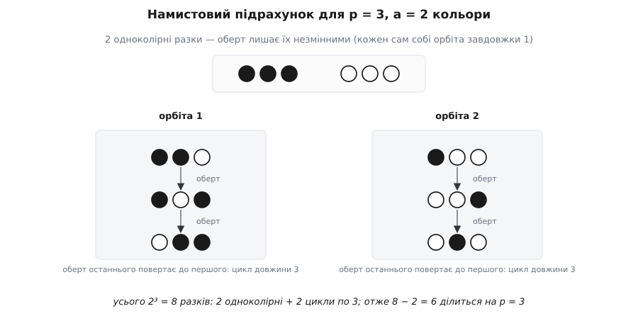
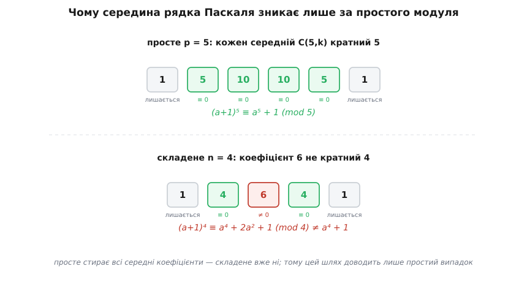

# 📿 Намисто й біном: ще два доведення малої теореми Ферма

Рівність aᵖ ≡ a (mod p) для простого p можна здобути кількома незалежними шляхами; перестановкове доведення — не єдине. Тут зібрано два інші: комбінаторний підрахунок кольорових намистин на разку та індукцію за a через розкриття бінома (a+1)ᵖ. Обидва варті не лише як ще одна доводка — обидва **ламаються на складеному модулі**, і саме те, ЯК вони ламаються, пояснює, чому загальне узагальнення (теорема Ейлера) виросло не з них, а з перестановки.

## Намисто: те саме число, полічене двічі

Хитрість усіх комбінаторних доведень одна: узяти набір, чий розмір очевидно дорівнює aᵖ, і полічити той самий набір удруге — так, щоб множник p випав сам собою.

Візьмімо **разок** — рядок із p намистин, кожну з яких фарбуємо в один із a кольорів. Скільки таких рядків? На кожну з p позицій — a незалежних виборів, отже рівно

```
aᵖ
```

Це перший, прямий підрахунок. Тепер полічимо ті самі рядки інакше — згрупувавши їх за **обертом**. Замкнімо разок у кільце й крутімо його: оберт зсуває всі намистини на одну позицію по колу (остання стає першою). Два рядки вважаємо ріднею, якщо один переходить в інший якимось обертом; уся така рідня — це **орбіта**. Оберт не створює й не знищує рядків, лише розкладає всі aᵖ по орбітах — тож досить порахувати, які орбіти бувають і завбільшки вони які.

Орбіти бувають рівно двох ґатунків, і ось тут вступає простота.

**Одноколірні разки.** Якщо всі p намистин одного кольору, оберт нічого не міняє — рядок сам собі орбіта завдовжки один. Таких разків стільки, скільки кольорів: рівно a.

**Усі інші — мішані.** Стверджую: кожен мішаний разок має **рівно p** різних обертів, тобто лежить в орбіті завдовжки точно p. Чому саме p, а не менше? Якби якийсь ненульовий оберт повернув разок сам у себе, візерунок повторювався б із періодом, коротшим за p, — а цей період мусив би ділити p націло (проверни повне коло за кілька однакових кроків — кількість кроків ділить довжину). У простого числа дільники лише два: 1 і саме p. Період p означає «повторення немає, усі p обертів різні»; період 1 означає «всі намистини однакові» — а це вже одноколірний разок, який ми відклали. Отже для мішаного лишається єдина можливість: усі p обертів різні.

Ось і весь підрахунок. Усі aᵖ рядків розпадаються так: a одноколірних сидять поодинці, а решта — aᵖ − a мішаних — укладаються у цілі блоки завдовжки p кожен. Кількість намистин, що ділиться на p без залишку:

```
aᵖ − a = p · (кількість мішаних орбіт)   ⟹   aᵖ ≡ a (mod p)
```

Просте число p ділить aᵖ − a просто тому, що зайві разки шикуються у шеренги рівно по p — коротших шеренг простота не допускає.

**Перевірмо на p = 3, a = 2.** Разків із трьох намистин у два кольори — 2³ = 8. Одноколірних два, ●●● і ○○○: оберт їх не чіпає. Решта шість розпадаються на дві трійки:

```
●●○ → ●○● → ○●●     (оберт циклює ці три)
●○○ → ○○● → ○●○     (і ці три)
```

Дві орбіти рівно по три намистові разки. Отже 8 − 2 = 6 = 2·3, і 2³ = 8 ≡ 2 (mod 3). Збіглося.



*Оберт розкладає всі 2³ разків на орбіти. Одноколірні нерухомі, мішані ходять циклами точно по p = 3 — і саме тому надлишок 8 − 2 накривається цілими трійками.*

Цей підрахунок у формі циклічних перестановок опублікував данський математик Юліус Петерсен ще 1872 року; звичний образ намистин, що обертаються на разку, додав до нього Соломон Ґоломб 1956-го. (Мовою груп це підрахунок орбіт дії [циклічної групи обертів](topic:math/group-theory), де розмір орбіти ділить розмір групи, — але тут усе видно й без неї.)

> 🔧 **Навіщо це.** Намистове доведення нічого не знає про остачі, обернені елементи чи скорочення — воно суто лічить предмети. Тому воно перше, що згадують, коли хочуть показати: подільність aᵖ − a на p — не арифметичний фокус, а факт про те, що симетричні об'єкти простого розміру не мають дрібніших повторів. Ту саму ідею «розкласти на орбіти однакового розміру» використовують від підрахунку хімічних ізомерів до перелічування станів у фізиці.

**Де ламається простота.** Візьмімо складене n = 4 і два кольори. Тепер мішаний разок може мати проміжний період: ●○●○ повторюється через дві намистини, його оберт дає лише ●○●○ → ○●○● → ●○●○ — орбіта завдовжки **два**, ні один, ні чотири. Такий проміжний період можливий саме тому, що 4 має власний дільник 2. Порахуймо: усього 2⁴ = 16 разків, два одноколірні, ще два (●○●○ і ○●○●) в орбіті завдовжки 2, решта дванадцять — у трьох орбітах по чотири. Надлишок 16 − 2 = 14 уже не ділиться на 4: заважає та стороння орбіта завдовжки 2. І справді 2⁴ = 16 ≡ 0 ≢ 2 (mod 4). Дихотомія «1 або p», на якій усе трималося, розсипалася разом із простотою.

## Біном: одна сходинка індукції

Другий шлях не крутить намисто, а лічить степінь напряму — але сходинками, [індукцією](topic:math/mathematical-induction) за a: доводимо рівність для a = 0, а тоді показуємо, що з кожного a вона переходить на a + 1. Уся сила — в одному кроці: як пов'язані (a+1)ᵖ і aᵖ.

Розкриймо (a+1)ᵖ біномом Ньютона:

```
(a+1)ᵖ = aᵖ + C(p,1)·aᵖ⁻¹ + C(p,2)·aᵖ⁻² + … + C(p,p−1)·a + 1
```

де C(p,k) — [число способів вибрати k позицій із p](topic:math/combinations), біноміальний коефіцієнт. Крайні члени — aᵖ (при k = 0) і 1 (при k = p) — це якраз те, що ми хочемо лишити. Уся справа в середніх: якщо кожен C(p,k) для 0 < k < p ділиться на p, то за модулем p всі середні члени зникають.

І вони справді діляться — знову через простоту. Скористаймося тотожністю

```
k · C(p,k) = p · C(p−1, k−1)
```

(обидві частини лічать одне: скількома способами з p кандидатів вибрати комітет із k осіб і призначити в ньому голову). Права частина явно кратна p, отже й ліва: p ділить добуток k·C(p,k). Тепер [ключова властивість простого](topic:math/prime-numbers): якщо просте p ділить добуток, воно ділить хоча б один множник. Множник k лежить між 1 і p−1, він на p не кратний — отже p змушене ділити другий множник, C(p,k). Простота тут вирішальна: вона не дає числу p «сховатися» у добутку k·(p−k)·…, розклавшись на дрібніші частини.

Отже за модулем p середина щезає, і лишається чиста рівність — та сама, яку жартома звуть **мрією першокурсника**: хибне взагалі (x+y)ⁿ = xⁿ + yⁿ стає точним, щойно показник дорівнює простому p, а рахунок ведуть за модулем p:

```
(a+1)ᵖ ≡ aᵖ + 1 (mod p)
```

Тепер сама індукція займає два рядки. **База** a = 0: 0ᵖ = 0 ≡ 0, правда. **Крок**: припустимо aᵖ ≡ a; тоді

```
(a+1)ᵖ ≡ aᵖ + 1 ≡ a + 1 (mod p)
```

— рівність перейшла на a+1. Отже aᵖ ≡ a для кожного натурального a, а через періодичність остач за модулем p — і для будь-якого цілого. Мала теорема Ферма зібралася з однієї тотожності про біноміальні коефіцієнти й одного кроку індукції.

**Перевірмо на p = 5.** Рядок коефіцієнтів — 1, 5, 10, 10, 5, 1. Крайні одиниці лишаються, а всі чотири середні (5, 10, 10, 5) кратні п'яти:

```
(a+1)⁵ = a⁵ + 5a⁴ + 10a³ + 10a² + 5a + 1 ≡ a⁵ + 1 (mod 5)
```



*За простого модуля вся середина рядка Паскаля обертається на нуль — лишаються тільки крайні aᵖ та 1. За складеного серед коефіцієнтів знаходиться «недільний» (для n = 4 це 6), і мрія першокурсника не справджується.*

**Де ламається простота.** Для складеного n = 4 середній коефіцієнт C(4,2) = 6 не ділиться на 4 (6 = 4·1 + 2). Тому крок індукції обертається на

```
(a+1)⁴ = a⁴ + 4a³ + 6a² + 4a + 1 ≡ a⁴ + 2a² + 1 (mod 4)
```

— замість чистого a⁴ + 1 лишається зайвий доданок 2a², і рівність (a+1)⁴ ≡ a⁴ + 1 хибна (візьміть a = 1: ліворуч 2⁴ = 16 ≡ 0, праворуч 1 + 1 = 2). Сходинка обвалюється, індукція не стартує. Причина та сама, що й у намиста: складене число ховає всередині дільник, і чиста дихотомія — тут «дільно чи ні» — розпадається на проміжний випадок.

## Чому обидва шляхи впираються в простоту — і що з неї росте

Придивімося, на чому насправді трималися обидва доведення. Намисто спиралося на «період мішаного разка ділить p, а в простого дільники лише 1 і p» — тож орбіта або одна, або аж p, без нічого поміж. Біном спирався на «p ділить кожен середній C(p,k)» — тож жоден середній член не виживає. У серці кожного — **чиста дихотомія, яку вимагає простота**: або-або, без третього. Складене число дає рівно те третє: орбіту проміжної довжини, коефіцієнт із проміжною подільністю. Обидва шляхи впираються в цей проміжний випадок і глухнуть — жодної рятівної версії aⁿ ≡ a для складеного n вони не дають.

А перестановкове доведення трималося на чомусь іншому. Йому байдуже до дихотомій — воно каже лише, що множення на a **перетасовує** ненульові остачі, нічого не додаючи й не гублячи. А для перетасування досить однієї речі: щоб на a можна було скоротити, тобто щоб a було оборотним. Оборотність же залежить не від простоти n, а від взаємної простоти a та n — і цю властивість складене число цілком собі має. Досить викинути ті остачі, що з n не взаємно прості, лишити самі взаємно прості — а їх рівно φ(n), [функція Ейлера](topic:math/euler-totient), — і той самий аргумент перетасування дає

```
aᶠ⁽ⁿ⁾ ≡ 1 (mod n),   якщо a взаємно просте з n
```

Це теорема Ейлера, пряме узагальнення малої теореми Ферма на будь-який модуль. І тепер видно, **чому воно виросло саме з перестановки**: з трьох доведень лише перестановкове спиралося на властивість (оборотність), яку складені числа зберігають. Намисто й біном ішли крізь простоту так тісно, що поза нею їм нема куди ступити.

Це не робить їх гіршими — вони купують те, чого перестановка не показує. Намисто перетворює подільність aᵖ − a на p на просте лічення однакових кілець. Біном оголює приховану лінійність: відображення a ↦ aᵖ за модулем простого p **зберігає додавання** ((a+b)ᵖ ≡ aᵖ + bᵖ), а це вже зерно цілої алгебри над простими полями. Але тільки-но захочеш вийти за межі простих чисел — береш ту дорогу, що ніколи від них і не залежала.
