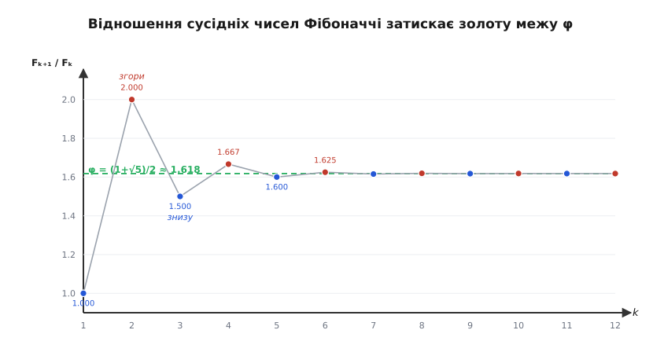
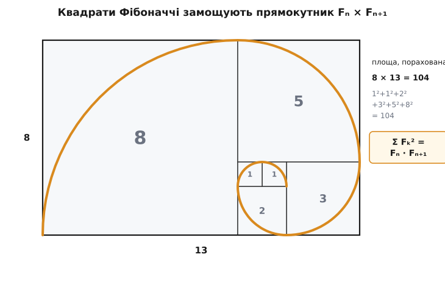
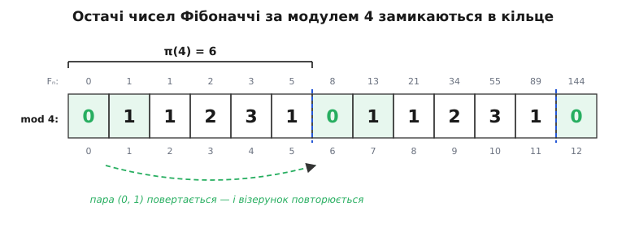

# Числа Фібоначчі

<preknowlist>
- [Математична індукція](topic:math/mathematical-induction) — доведення тверджень про всі натуральні числа через крок «від n до n+1»; на ній тримається більшість тотожностей нижче.
- [Ірраціональні числа](topic:math/irrational-numbers) — числа на кшталт √5, що не є відношенням цілих; на них стоїть замкнена формула.
- [Модульна арифметика](topic:math/modular-arithmetic) — лишки за модулем m, запис a ≡ b (mod m) і те, що за модулем вільно додавати й множити; потрібне для періодів Пізано.
- [НСД і алгоритм Евкліда](topic:math/gcd-euclidean) — найбільший спільний дільник двох чисел і як його знаходять послідовним відніманням; на ньому тримається закон подільности цих чисел.
- [Матриці як дії](topic:math/matrices-as-operations) — множення матриць як складання перетворень; на ньому стоїть точний і швидкий спосіб обчислення.
</preknowlist>

Правило простіше нікуди: кожне наступне число — сума двох попередніх. Почавши з 0 і 1, розкручуємо:

```
0, 1, 1, 2, 3, 5, 8, 13, 21, 34, 55, 89, 144, 233, 377, 610, 987, …
```

Одне додавання на крок — і більше ніякого закону. З цього дитячого правила виростає стільки арифметичної краси, що їй присвячено окремий математичний журнал. Але вся ця краса ховається за одним прямим запитанням, і саме воно поведе нас углиб: **яке за розміром мільйонне число цієї вервечки — і чи можна дізнатися його, не проходячи мільйон кроків підряд?**

Здавалося б, вибору немає: щоб дійти до Fₙ, треба знати два попередні, а щоб знати їх — ще два, і так до самого початку. Один крок — одне додавання; мільйонний член — мільйон додавань, кожне над числами в сотні тисяч цифр. Ця стаття показує, що обхід є: у правилі, де кожен член дивиться лише на двох сусідів, захована жорстка лінійна будова, і саме вона дозволяє **перестрибнути** відразу до потрібного члена, а заразом відкриває, що ці числа підкоряються законам подільности не менш суворим, ніж самі прості числа.

Позначмо члени `Fₙ`, рахуючи від нуля: F₀ = 0, F₁ = 1, і для будь-якого n ≥ 2

```
Fₙ = Fₙ₋₁ + Fₙ₋₂
```

Такий запис — де величина визначає себе через свої ж попередні значення — називають **рекурентним** (лат. *recurrere* — «пробігати назад»). Класична картинка, з якою ці числа увійшли в європейську математику, — розплід кролів: пара за місяць дорослішає, доросла пара щомісяця дає нову пару, і кількість пар місяць за місяцем іде тією самою вервечкою. Але кролі — лише зручна оболонка; [насправді послідовність знали за півтисячоліття до Пізи](topic:math/fibonacci-numbers/hist-fibonacci.md), і зовсім з іншого приводу. Нам важлива не легенда, а те, що правило «кожне — сума двох попередніх» — найпростіше нетривіальне, яке взагалі можна написати, і подивитися, як далеко воно заведе.

## Як швидко вони ростуть: відношення сусідів завмирає

Перше, що впадає в око, — числа розганяються дедалі шаленіше: різниця між сусідами сама росте як вервечка. Щоб схопити темп росту, дивімося не на різниці, а на **відношення** сусідніх членів — у скільки разів кожне більше за попереднє:

```
1/1   = 1.0000
2/1   = 2.0000
3/2   = 1.5000
5/3   = 1.6667
8/5   = 1.6000
13/8  = 1.6250
21/13 = 1.6154
34/21 = 1.6190
55/34 = 1.6176
89/55 = 1.6182
```

Відношення не розбігається й не завмирає на круглому числі — воно стрибає то вище, то нижче й дедалі тісніше тулиться до якогось значення близько 1.618. Чому саме туди? Дамо цьому статися на очах. Нехай відношення сусідів прямує до якогось числа x. Візьмімо основне правило Fₙ = Fₙ₋₁ + Fₙ₋₂ і поділімо все на Fₙ₋₁:

```
 Fₙ       Fₙ₋₂
─────  =  1 + ─────
Fₙ₋₁      Fₙ₋₁
```

Ліворуч — відношення сусідів, воно прямує до x. А `Fₙ₋₂/Fₙ₋₁` — це відношення сусідів «догори ногами», тобто прямує до 1/x. У границі рівність перетворюється на

```
x = 1 + 1/x     ⟹     x² = x + 1
```

Ось звідки береться межа: це просто число, яке на одиницю більше за свій обернений. Розв'язавши квадратне рівняння x² − x − 1 = 0, дістаємо додатний корінь

```
       1 + √5
φ  =  ────────  ≈  1.6180339887…
          2
```

Це знамените [золоте число φ (фі)](topic:math/golden-ratio) — те саме відношення, у якому ціле так відноситься до більшої частини, як більша до меншої. Воно не впало з неба разом із кролями: воно **неминуче** сидить у правилі додавання, бо єдине число, здатне бути стійким відношенням сусідів у послідовності «сума двох попередніх», мусить справджувати x² = x + 1. Отже, числа Фібоначчі ростуть, як степені φ, — по-геометричному, множачись приблизно на 1.618 щокроку. Мільйонний член має близько 1000000·log₁₀φ ≈ 209000 цифр; жодне «трохи більше за лінійне» тут ні до чого — це справжня експонента.


*Відношення Fₙ₊₁/Fₙ по черзі перескакує золоту межу згори і знизу, і розмах перескоку швидко тане — послідовність затискає φ у лещата.*

> 🔧 **Навіщо це.** Геометричний ріст — не абстракція, а пастка, у яку регулярно потрапляють програмісти. Якщо обчислювати Fₙ «в лоб» рекурсією, де fib(n) викликає fib(n−1) і fib(n−2), то кількість викликів сама росте як число Фібоначчі — тобто як φⁿ. Обчислення F₅₀ таким наївним способом — це вже понад мільярд викликів; F₁₀₀ не дочекається ніхто. Саме числа Фібоначчі — канонічний приклад того, як [нехитра рекурсія](topic:algorithms/recursion) породжує експоненційну роботу, і чому її доводиться приборкувати.

## Замкнена формула: перестрибнути одразу до n-го члена

Границя відношень підказує головне: якщо члени поводяться як φⁿ, то, може, вони і є комбінацією степенів? Перевірмо цю здогадку чесно. Правило Fₙ = Fₙ₋₁ + Fₙ₋₂ **лінійне** — члени входять у нього лише в першому степені, без квадратів і добутків. Для таких правил є регулярний прийом: пошукати розв'язок вигляду Fₙ = xⁿ і подивитися, який x підійде. Підставмо:

```
xⁿ = xⁿ⁻¹ + xⁿ⁻²
```

Поділивши на xⁿ⁻², дістаємо те саме рівняння, що й для границі відношень:

```
x² = x + 1
```

Це не збіг: рівняння x² = x + 1 — **характеристичне** для нашого правила, у ньому вся його суть. Воно має два корені —

```
       1 + √5                    1 − √5
φ  =  ────────  ≈ 1.618      ψ = ────────  ≈ −0.618
          2                          2
```

обидва степені φⁿ і ψⁿ поодинці задовольняють рекурентне правило. А оскільки правило лінійне, будь-яка їхня сума A·φⁿ + B·ψⁿ теж йому підкоряється: додавши два розв'язки, знову дістанемо розв'язок (це загальна властивість [лінійних рекурентних співвідношень](topic:math/linear-recurrence), і золоте число — лише найпростіший її вияв). Лишилося підібрати коефіцієнти A і B так, щоб збіглися два перші члени. З F₀ = 0 маємо A + B = 0, тобто B = −A. З F₁ = 1 маємо A·φ + B·ψ = 1, звідки A(φ − ψ) = 1. Різниця коренів φ − ψ = √5, тож A = 1/√5, B = −1/√5. Складаємо все докупи:

```
       φⁿ − ψⁿ           1 ⎛⎛ 1 + √5 ⎞ⁿ   ⎛ 1 − √5 ⎞ⁿ⎞
Fₙ  =  ────────  =  ──── ⎜⎜────────⎟  − ⎜────────⎟ ⎟
          √5          √5 ⎝⎝    2   ⎠     ⎝    2   ⎠ ⎠
```

Це і є замкнена формула — вона видає n-е число **без жодного попереднього члена**, самими лише степенями. Її прийнято називати формулою Біне, хоча [вивів її на століття раніше Абрахам де Муавр](topic:math/fibonacci-numbers/hist-fibonacci.md). Найдивовижніше в ній — те, що права частина, зіткана з ірраціонального √5, при кожному n дає рівно ціле число. Причина проста: у сумі φⁿ − ψⁿ усі доданки з √5 у непарних степенях додаються, а решта скорочується, і √5 у знаменнику точно все прибирає.

Формула ще й дарує спосіб рахувати член наближено-миттєво. Другий корінь ψ ≈ −0.618 за модулем менший від одиниці, тож ψⁿ із ростом n стрімко тане до нуля (|ψ¹⁰| ≈ 0.008). Отже, для будь-якого n ≥ 0

```
Fₙ = найближче ціле до  φⁿ / √5
```

**Знайти F₁₀ через формулу Біне.** Порахуймо, вже не виписуючи попередніх членів:

```
φ¹⁰    ≈ 122.9918
φ¹⁰/√5 ≈ 122.9918 / 2.2360679 ≈ 55.0036
округлення                     →  55
```

Вервечка 0,1,1,2,3,5,8,13,21,34,**55** — і справді на десятому місці (рахуючи від нуля) стоїть 55. Ми дістали його, ні разу не додавши двох сусідів.

> 🔧 **Навіщо це.** Формула Біне безцінна для теорії — вона миттю каже, що ріст саме експоненційний, і дає точний показник φ. Але для **точного** обчислення великих членів на практиці її не беруть: щойно n переростає кілька десятків, φⁿ доводиться тримати з такою кількістю знаків після коми, що ірраціональна арифметика стає дорожчою й крихкішою за звичайне додавання цілих. Точний F₁₀₀ через дійсні числа з подвійною точністю вже промахнеться. Тому там, де потрібне саме ціле, ідуть іншим шляхом — цілочисловим і водночас швидким.

Побіжно формула висвітлює і споріднену вервечку. Якщо в тій самій парі степенів узяти **суму** замість різниці, φⁿ + ψⁿ, дістанемо іншу цілочислову послідовність — [числа Люка](topic:math/lucas-numbers) 2, 1, 3, 4, 7, 11, 18, … з тим самим правилом додавання, але іншим стартом. Вони йдуть із Фібоначчі пліч-о-пліч і не раз стають у пригоді, коли одні тотожності зручніше довести через інші.

## Матрична подоба: точно і за логарифм кроків

Замкнена формула перестрибує до n-го члена, та платить за це ірраціональними числами. Чи можна перестрибнути, лишаючись у цілих? Можна — і ключ у тому, щоб поглянути на крок вервечки як на **дію над парою**. Один крок бере пару сусідів (Fₙ, Fₙ₋₁) і робить із неї наступну пару (Fₙ₊₁, Fₙ) = (Fₙ + Fₙ₋₁, Fₙ). Це перетворення пари в пару лінійне, а отже — [множення на матрицю](topic:math/matrices-as-operations):

```
⎛ Fₙ₊₁ ⎞   ⎛ 1  1 ⎞ ⎛ Fₙ   ⎞
⎜      ⎟ = ⎜      ⎟ ⎜      ⎟
⎝ Fₙ   ⎠   ⎝ 1  0 ⎠ ⎝ Fₙ₋₁ ⎠
```

Назвімо цю матрицю Q. Один крок — одне множення на Q. Отже, n кроків — це Q, помножена сама на себе n разів. Розкрутивши від початкової пари (F₁, F₀) = (1, 0), дістаємо стисле й точне серце всієї послідовности:

```
        ⎛ 1  1 ⎞ⁿ   ⎛ Fₙ₊₁  Fₙ   ⎞
Qⁿ  =   ⎜      ⎟  = ⎜            ⎟
        ⎝ 1  0 ⎠     ⎝ Fₙ    Fₙ₋₁ ⎠
```

Уся вервечка — це степені однієї матриці. І тут відкривається обхід мільйона кроків. Щоб піднести число (чи матрицю) до степеня n, не треба n множень: степінь **подвоюють**. Знаючи Q⁸, дістаємо Q¹⁶ одним множенням Q⁸·Q⁸, а не вісьмома. Тому, розкладаючи n на двійкові розряди, до Qⁿ доходять приблизно за log₂n множень: до мільйонного члена — не мільйон кроків, а близько двадцяти. Ця ідея — піднесення до степеня через подвоєння — і дає [швидкий та точний спосіб обчислити Fₙ](topic:math/fibonacci-numbers/proj-fast-fibonacci.md), який на практиці замінює і наївну рекурсію, і формулу Біне.

Матрична подоба корисна не лише швидкістю — вона майже задарма видає першу глибоку тотожність. Визначник Q дорівнює 1·0 − 1·1 = −1. Визначник добутку — добуток визначників, тож визначник Qⁿ дорівнює (−1)ⁿ. Але визначник тієї самої Qⁿ, розписаної через члени Фібоначчі, — це

```
Fₙ₊₁·Fₙ₋₁ − Fₙ²  =  (−1)ⁿ
```

Ця рівність — тотожність Кассіні (Джованні Кассіні, 1680): добуток сусідів через одного завжди відрізняється від квадрата середнього рівно на одиницю, то в один бік, то в інший. Спробуйте на F₅ = 5: F₆·F₄ − F₅² = 8·3 − 25 = −1, і показник n = 5 непарний. Ми не доводили її окремо — вона **випала** з того, що крок вервечки є множенням на матрицю з визначником −1.

І ще один місток замикає коло. Характеристичне рівняння матриці Q — те саме λ² = λ + 1, а його корені φ і ψ є [власними значеннями](topic:math/eigenvalues) цієї матриці. Тому й вигулькує золоте число одразу з двох боків: як границя відношень і як власне число матриці кроку. Замкнена формула Біне — це не що інше, як та сама Qⁿ, розкладена по власних напрямках; матриця й корінь φ — дві мови про одне.

## Прихована арифметика: закони подільности

Досі йшлося про ріст. Та справжня несподіванка в тому, що ці числа підпорядковані подільності так само строго, як прості. Почнімо з найпростішого спостереження, яке легко вивести з тотожности Кассіні: **сусідні числа Фібоначчі взаємно прості**. Справді, будь-який спільний дільник Fₙ і Fₙ₊₁ мусив би ділити й комбінацію Fₙ₊₁Fₙ₋₁ − Fₙ², тобто ділити (−1)ⁿ = ±1 — а таким дільником є лише одиниця. Отже, gcd(Fₙ, Fₙ₊₁) = 1 при кожному n; уся вервечка йде так, що жодні два сусіди не мають спільного множника.

Далі глибше. Придивімося, які члени на що діляться:

```
F₃ = 2    ділить  F₆=8, F₉=34, F₁₂=144, …   (кожен третій — парний)
F₄ = 3    ділить  F₈=21, F₁₂=144, …          (кожен четвертий кратний 3)
F₅ = 5    ділить  F₁₀=55, F₁₅=610, …         (кожен п'ятий кратний 5)
```

Проступає разючий закон: **Fₘ ділить Fₙ тоді й лише тоді, коли m ділить n**. Місця, де сидять кратні даного числа, самі стоять через рівні проміжки. Це вже не випадковість, а тінь чогось стрункого. І справді, за цим стоїть вершинна тотожність усієї теорії:

```
gcd(Fₘ, Fₙ)  =  F_gcd(m, n)
```

Найбільший спільний дільник двох чисел Фібоначчі — це число Фібоначчі, і то саме з тим номером, що дорівнює НСД їхніх номерів. Послідовності з такою властивістю називають *строгими послідовностями подільности*, і Фібоначчі — найвідоміша з них. Перевіримо на F₁₂ = 144 і F₈ = 21: їхній НСД дорівнює gcd(144, 21) = 3, а gcd(12, 8) = 4, і справді F₄ = 3. Номери «спілкуються» через свій НСД, а тіла чисел лише повторюють цю розмову.

Чому так? Корінь — в **основній тотожності додавання**, яку дає та сама матрична подоба (Qᵐ⁺ⁿ = Qᵐ·Qⁿ, розписане покомпонентно):

```
Fₘ₊ₙ = Fₘ·Fₙ₊₁ + Fₘ₋₁·Fₙ
```

З неї видно, що коли n кратне m, то Fₙ ділиться на Fₘ (розбиваючи індекс на однакові шматки по m, щоразу виносимо Fₘ). А далі номери можна «евклідити» точно так, як [сам алгоритм Евкліда](topic:math/gcd-euclidean) зводить пару чисел до їхнього НСД: заміна пари (m, n) на (m, n − m) у номерах віддзеркалюється відповідною заміною в самих числах Фібоначчі, і спуск номерів до gcd(m, n) тягне за собою спуск чисел до F_gcd(m,n). [Повне виведення цих тотожностей — від Кассіні до закону НСД](topic:math/fibonacci-numbers/math-identities.md) варте окремого розгляду; тут важливо, що вся подільність Фібоначчі — прямий відбиток подільности їхніх **номерів**.

І ось де ця дзеркальність дає найгостріший наслідок — місток до самих простих чисел. Якщо номер n складений, тобто має дільник a у проміжку 3 ≤ a < n, то Fₐ ділить Fₙ, і цей дільник більший за одиницю та менший за саме Fₙ, — отже, Fₙ теж складене. Обернімо думку: **щоб число Фібоначчі було простим, його номер мусить бути простим**. Виняток єдиний — F₄ = 3: для n = 4 єдиний нетривіальний розклад 4 = 2·2 дає дільник F₂ = 1, а одиниця на простоту не впливає. Зворотне ж хибне, і це важливо не переплутати: простий номер простого числа не гарантує — F₁₉ = 4181 = 37·113, хоч 19 просте. Тож прості Фібоначчі трапляються лише на простих місцях, та далеко не на всіх; а чи є їх нескінченно багато — задача, не розв'язана й досі.

Дрібка тієї самої структури проступає й у простих сумах. Додаймо всі числа до Fₙ включно — і сума знову виявляється числом Фібоначчі, лише зсунутим:

```
F₁ + F₂ + … + Fₙ  =  Fₙ₊₂ − 1
```

(перевірте: 1+1+2+3+5 = 12 = F₇ − 1 = 13 − 1). А складемо не самі члени, а їхні **квадрати** — і дістанемо добуток двох сусідів:

```
F₁² + F₂² + … + Fₙ²  =  Fₙ · Fₙ₊₁
```

Ця друга рівність має чудовий безсловесний доказ: квадрати зі сторонами 1, 1, 2, 3, 5, 8 можна щільно, без зазорів і накладок, скласти в один прямокутник зі сторонами Fₙ і Fₙ₊₁. Площа прямокутника — добуток сторін; вона ж — сума площ квадратиків. Дві лічби однієї площі і дають тотожність.


*Квадрати послідовних розмірів вкладаються в прямокутник Fₙ×Fₙ₊₁ без залишку: площа прямокутника, порахована двічі, і є тотожністю Σ Fₖ² = Fₙ·Fₙ₊₁. Дуги в квадратах складаються у знайому спіраль.*

## Числа Фібоначчі за модулем: періоди Пізано

Останнє вікно — у світ лишків. Що станеться, якщо всю вервечку взяти за якимось модулем m, тобто лишати від кожного члена тільки остачу від ділення на m? Візьмімо m = 4 і випишімо остачі:

```
n :  0 1 2 3 4 5 | 6 7 8 9 …
Fₙ:  0 1 1 2 3 5   8 …
mod4 0 1 1 2 3 1 | 0 1 1 2 3 1 | 0 …
```

Остачі не розповзаються навмання — вони **зациклюються**: після шести кроків знову йдуть 0, 1, 1, 2, 3, 1, і так без кінця. Чому це неминуче? Уся вервечка за модулем m визначається однією-єдиною **парою** сусідніх остач: знаєш пару — знаєш і всі наступні (додаєш за модулем), і всі попередні (віднімаєш). Але різних пар остач за модулем m є лише скінченне число — не більше за m². Тому рано чи пізно якась пара мусить повторитися; а щойно повторилася пара, повторюється й усе, що з неї виростає. Ба більше: оскільки крок оборотний, першою повернутися зобов'язана саме стартова пара (0, 1) — послідовність замикається в чисте кільце без «хвоста».


*Остачі за модулем 4 утворюють кільце завдовжки 6: щойно знову випадає стартова пара (0, 1), уся картина повторюється. Скінченність можливих пар робить таке зациклення неминучим.*

Довжину цього кільця називають **періодом Пізано** π(m) — на честь Леонардо Пізанського. Для четвірки π(4) = 6. А найвідоміший приклад — останні цифри: остачі за модулем 10 повторюються з періодом π(10) = 60, тож остання цифра числа Фібоначчі йде по колу з шістдесяти значень, скільки б членів ми не брали.

> 🔧 **Навіщо це.** Період Пізано — не курйоз, а робочий інструмент. Коли треба знайти Fₙ mod m для астрономічно великого n (таке буває в теоретико-числових алгоритмах і хешуванні), не рахують гігантський член: спершу зводять сам номер за модулем періоду, n mod π(m), а вже тоді обчислюють невеличкий член. Скінченність світу лишків обертає нескінченну вервечку на короткий цикл, яким і користуються.

Скінченність тут — того самого кореня, що й нескінченний ріст у формулі Біне. Над цілими числами матриця Q має власні значення φ і ψ, і її степені розлітаються експоненційно; над лишками за модулем m тих самих степенів лише скінченно багато, тож вони змушені ходити по колу. Одне лінійне правило, дві протилежні долі — вибух і цикл, — і обидві ростуть з однієї матриці кроку.

## Одне правило — цілий світ

Варто ще згадати про несподіваний бік цих чисел — вони творять власну систему числення. [Кожне натуральне число єдиним способом розкладається в суму несусідніх чисел Фібоначчі](topic:math/fibonacci-numbers/math-zeckendorf.md) (теорема Цекендорфа): 100 = 89 + 8 + 3, і жодні два доданки не стоять у вервечці поряд. Це перетворює Фібоначчі на основу для запису чисел, стійку до дрібних збоїв, — ще одне діофантове обличчя тієї самої послідовности.

Усе, що ми пройшли, тримається на одному спостереженні. Правило «кожне — сума двох попередніх» лінійне, а отже, має лінійно-алгебраїчну душу: матрицю кроку Q з власними числами φ і ψ. Із цього єдиного факту випливає все інше. Власне число φ дає експоненційний ріст і замкнену формулу. Скінченність станів за модулем дає періоди Пізано. Тотожність визначників дає Кассіні, а тотожність додавання Qᵐ⁺ⁿ = Qᵐ·Qⁿ — увесь закон подільности через НСД номерів. Найпростіше нетривіальне рекурентне правило виявляється не бідним, а навпаки — крізь одну матрицю воно поєднує ріст, арифметику й геометрію, і кожне з облич є лише іншим поглядом на ті самі степені φ.
