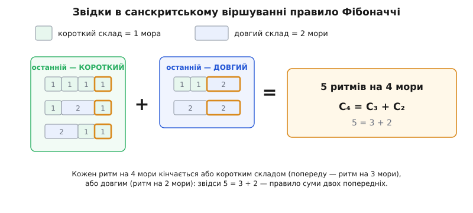

# 📜 Числа, яких Фібоначчі не відкривав

Вервечка носить ім'я Леонардо Пізанського — а майже все в ній не його: ні перше відкриття правила, ні знаменита замкнена формула, яку звуть «формулою Біне», ні найглибша тотожність, ні навіть саме слово «Фібоначчі». Це історія про те, як одне купецьке прізвисько налипло на чужу багатовікову працю, і чому в математиці ім'я на об'єкті рідко означає «той, хто був перший».

Щоб не заплутатися, розділімо від початку п'ять різних заслуг, які легко злити в одну: **хто подав ідею**, **хто сформулював правило**, **хто його систематизував**, **хто вперше надрукував** — і **хто зрештою дістав ім'я**. Далі побачимо, що для цієї вервечки всі п'ять дісталися різним людям, розкиданим на дві тисячі років і три континенти.

## Санскритські поети рахували ритми

Народилася послідовність не з кролів і не в Європі, а в індійській науці про віршовий розмір — і то за півтисячоліття (а коренем і більше) до Пізи. Щоб зрозуміти, звідки взялося правило, треба уявити задачу, яку розв'язували давні знавці просодії.

У санскритському віршуванні склад буває двох тривалостей: короткий (*laghu*, «легкий») звучить одну частку — **мору** (санскр. *mātrā* — «міра»), а довгий (*guru*, «важкий») — дві. Рядок певного розміру має вкластися в задану кількість мор. Природне запитання поета: **скількома різними ритмами можна заповнити рядок завдовжки n мор?**

Дамо відповіді скластися на очах. Візьмімо будь-який дозволений ритм на n мор і подивімося на його **останній склад**. Він або короткий — тоді все, що перед ним, є якимось ритмом на n−1 мор; або довгий — тоді перед ним стоїть ритм на n−2 мори. Іншого не дано. Отже, число ритмів на n мор дорівнює числу ритмів на n−1 плюс число ритмів на n−2. Правило суми двох попередніх тут не вигадане й не накинуте — воно **випадає** з єдиного факту, що остання доля має рівно дві можливі довжини.

*Кожен ритм рядка на 4 мори кінчається або коротким складом (спереду лишається ритм на 3 мори), або довгим (ритм на 2 мори). П'ять розкладів — це три плюс два: правило Фібоначчі, знайдене заради вірша.*

Хто пройшов цей шлях? Основу заклав **Пінгала** (санскр. *Piṅgala*, приблизно III–II ст. до н.е.) у трактаті «Чхандах-шастра» — він розробив саму механіку переліку коротких і довгих складів, з якої й виростає лічба. Явне ж правило «наступне число — сума двох попередніх» для кількості віршових розмірів уперше чітко сформулював **Віраганка** (*Virahāṅka*, десь між VI і VIII ст.) у «Вріттаджатісамуччаї». Далі його підхопив **Гопала** (близько 1135 р.) у коментарі, а стисло й на весь учений загал виклав джайнський мудрець **Хемачандра** (*Hemacandra*, близько 1150 р.) у «Чхандонушасані»: число варіантів наступного розміру — сума двох останніх. Усе це — заради санскритського вірша, а не заради кролів; тому індійські історики математики й досі не раз звуть послідовність числами Хемачандри. Датування Віраганки хитається на два століття, але сам ланцюжок Пінгала → Віраганка → Хемачандра в історії математики засвідчений твердо.

## Кролі Леонардо Пізанського

Європа дізналася про вервечку від італійця, якого сучасники «Фібоначчі» не називали. **Леонардо Боначчі** (близько 1170 — близько 1240–50), купецький син із Пізанської республіки, змолоду навчався рахунку в північноафриканській Беджаї, де перейняв індо-арабські цифри. Його книга **«Liber Abaci»** («Книга обрахунку», 1202) мала одну велику мету — принести в Європу позиційний запис числа з десятьма знаками 0–9 замість незграбних римських літер.

Кролі були лише однією задачкою серед сотень. Умова така: пара кролів за місяць дорослішає, доросла пара щомісяця дає нову пару, кролі не гинуть — скільки пар буде через рік? Місяць за місяцем кількість пар іде 1, 2, 3, 5, 8, 13… Леонардо виписав ці числа як відповідь на вправу — і не досліджував їх далі, не претендував на відкриття, не бачив у них ні золотого числа, ні законів подільності.

І ось гостра іронія: за життя його ніхто не звав «Фібоначчі». Це прізвисько — стягнене *filius Bonacci*, «син Боначчі» — уперше з'являється в новому тексті аж 1838 року, у праці франко-італійського математика Ґульєльмо Лібрі. А назву «**числа Фібоначчі**» самій вервечці дав француз Едуар Люка десь у 1870-х: саме він повернув Леонардові першість (після того, як послідовність устигли пов'язати з іншими іменами) і закріпив термін. Виходить, ім'я, яке ми щодня вимовляємо, — двічі позаживне: і людина під ним звалася інакше, і сама назва причепилася через шістсот років по її смерті.

## Замкнена формула: не Біне і не вперше

Формулу, що видає n-е число самими степенями золотого числа, повсюдно звуть **формулою Біне** — за працею Жака Філіппа Марі Біне 1843 року. Та на 1843-й формула була вже столітньою.

Першим її вивів **Абрахам де Муавр** (1667–1754) — гугенот, який після скасування релігійних свобод у Франції втік до Лондона. Він розробив метод «рекурентних рядів» — ранній різновид того, що згодом назвуть твірними функціями, — і застосував його до цієї вервечки близько 1718 року, а повністю виклав у «Miscellanea Analytica» (1730). Незалежно надрукував формулу **Даниїл Бернуллі** 1728 року; знав її й **Леонард Ейлер**. Внесок Біне був справжній, але пізній — його стаття виявилася найчитанішою, і ім'я прилипло до неї. Щоб віддати належне попередникам, формулу часом звуть Ейлеровою або де-Муаврівською. Різниця, яку тут важливо втримати: де Муавр мав і метод, і результат — Біне дістав назву.

## Тотожність Кассіні і здогад Кеплера

Та сама плутанина з першістю тягнеться й до найтоншого спостереження про ці числа — рівності, за якою добуток двох сусідів через одного відрізняється від квадрата середнього рівно на одиницю. Її звуть **тотожністю Кассіні** — за іменем **Джованні Доменіко Кассіні** (1625–1712), астронома, що народився в Перінальдо (тоді — графство Ніцца), перебрався до Франції й багато років очолював Паризьку обсерваторію (його ж ім'я носить щілина Кассіні в кільцях Сатурна). Кассіні виписав цю рівність 1680 року.

Але й тут він, схоже, не був перший. **Йоганн Кеплер** майже напевно володів цією тотожністю ще на початку XVII століття — її пов'язують із його листом 1608 року, хоч прямого запису й не збереглося. Що документовано твердо, то це інше Кеплерове відкриття: саме він першим зауважив, що відношення сусідніх членів вервечки прямує до [золотої пропорції](book:math/golden-ratio) — «як 5 до 8, так, майже, 8 до 13», — і пов'язав це з «божественною пропорцією». Пізніше, 1753 року, ту саму тотожність незалежно перевідкрив шотландець Роберт Сімсон. Розкладімо й тут заслуги: Кеплер побачив відношення й, імовірно, тотожність; Кассіні її надрукував; ім'я дісталося Кассіні.

## Хто що зробив

Складімо тепер увесь родовід докупи — не задля переліку, а щоб побачити закон, за яким мандрує визнання. Ідею лічби й саме правило дали індійські просодисти: механіку — Пінгала, явне формулювання — Віраганка, розголос — Хемачандра. Європейський приклад із кролями подав Леонардо Пізанський. Ім'я «Фібоначчі» причепили Лібрі й Люка через століття. Замкнену формулу вивів де Муавр, а звуть її Біневою. Тотожність побачив Кеплер, а носить вона ім'я Кассіні. Навіть «період Пізано» вішає назву Леонардового міста на поведінку чисел за модулем, якої той ніколи не торкався.

Проступає одне: ім'я на математичному об'єкті майже ніколи не фіксує, **хто був перший** — воно фіксує, **кого прочитали**. І що простіше саме правило, то дужче ця розбіжність: «кожне — сума двох попередніх» — найпростіше нетривіальне правило, яке взагалі можна написати, тож до нього неминуче й незалежно доходили різні люди, культури й століття. Кожен шар імен на цій вервечці розповідає не так про те, хто дійшов до неї першим, як про те, чий текст ліг на потрібну полицю в потрібний час.
