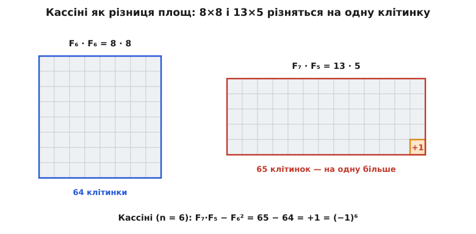
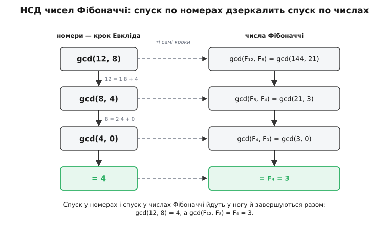

# 🧮 Тотожності Фібоначчі: від Кассіні до закону НСД

Ця вставка доводить — крок за кроком, без жодного пропуску — ту жменю рівностей, на якій тримається вся арифметика чисел Фібоначчі, і показує головне: майже всі вони випливають з одного факту — крок послідовности є [множенням на матрицю](topic:math/matrices-as-operations). Варто це побачити, і тотожності перестають бути набором окремих фокусів: кожна стає прямим наслідком одного рівняння.

Домовмося про позначення: F₀ = 0, F₁ = 1, і Fₙ = Fₙ₋₁ + Fₙ₋₂. Індекс можна вільно продовжити й уліво — з того самого правила у формі Fₙ₋₂ = Fₙ − Fₙ₋₁ виходить F₋₁ = 1, F₋₂ = −1, і взагалі F₋ₙ = (−1)ⁿ⁺¹·Fₙ. Це продовження знадобиться, щоб тотожності-добутки нижче (Кассіні, Каталан, д'Оканя) лишалися правдиві для будь-яких цілих номерів, а не лише додатних.

## Фундамент: степінь матриці — це самі числа

Усе подальше стоїть на одній матриці й одній рівності. Візьмімо матрицю кроку

```
    ⎛ 1  1 ⎞
Q = ⎜      ⎟
    ⎝ 1  0 ⎠
```

Стверджуємо, що її n-й степінь виражається просто через числа Фібоначчі:

```
      ⎛ Fₙ₊₁  Fₙ   ⎞
Qⁿ =  ⎜            ⎟
      ⎝ Fₙ    Fₙ₋₁ ⎠
```

Доведімо це [індукцією](topic:math/mathematical-induction) за n — бо саме ця рівність далі працюватиме двигуном для всіх тотожностей.

**База, n = 1.** Q¹ — сама Q, а праворуч стоїть

```
⎛ F₂  F₁ ⎞   ⎛ 1  1 ⎞
⎜        ⎟ = ⎜      ⎟ ,   бо F₂ = 1, F₁ = 1, F₀ = 0.
⎝ F₁  F₀ ⎠   ⎝ 1  0 ⎠
```

**Крок.** Нехай формула правдива для n. Помножмо на Q ще раз, Qⁿ⁺¹ = Qⁿ·Q:

```
⎛ Fₙ₊₁  Fₙ   ⎞ ⎛ 1  1 ⎞   ⎛ Fₙ₊₁+Fₙ   Fₙ₊₁ ⎞   ⎛ Fₙ₊₂  Fₙ₊₁ ⎞
⎜            ⎟ ⎜      ⎟ = ⎜               ⎟ = ⎜            ⎟
⎝ Fₙ    Fₙ₋₁ ⎠ ⎝ 1  0 ⎠   ⎝ Fₙ+Fₙ₋₁   Fₙ   ⎠   ⎝ Fₙ₊₁  Fₙ   ⎠
```

бо Fₙ₊₁ + Fₙ = Fₙ₊₂ і Fₙ + Fₙ₋₁ = Fₙ₊₁ — саме правило додавання. Права матриця — це та сама формула з номером n+1. Індукцію завершено; далі ми лише читатимемо наслідки з цієї рівности.

## Кассіні: тотожність, яка випадає з визначника

Першу тотожність не доводять — її **зчитують**. У [визначника](topic:math/matrix-determinant) є золота властивість: визначник добутку дорівнює добутку визначників, det(AB) = det A · det B. Застосуймо її до Qⁿ = Q·Q·…·Q:

```
det(Qⁿ) = (det Q)ⁿ
```

Визначник самої Q рахується миттю: det Q = 1·0 − 1·1 = −1. Отже det(Qⁿ) = (−1)ⁿ. Але той самий визначник можна порахувати й з іншого боку — прямо з клітинок Qⁿ, розписаних через числа Фібоначчі:

```
det(Qⁿ) = Fₙ₊₁·Fₙ₋₁ − Fₙ·Fₙ = Fₙ₊₁·Fₙ₋₁ − Fₙ²
```

Дві лічби одного визначника мусять збігтися, і ми маємо **тотожність Кассіні**:

```
Fₙ₊₁·Fₙ₋₁ − Fₙ²  =  (−1)ⁿ
```

Її 1680 року записав Джованні Доменіко Кассіні, тодішній директор Паризької обсерваторії; незалежне доведення дав Роберт Сімсон (1753). Зміст простий: добуток сусідів «через одного» завжди відрізняється від квадрата середнього рівно на одиницю — то в один бік, то в інший, залежно від парности n.

**Перевірка при n = 6.**

```
F₇·F₅ − F₆²  =  13·5 − 8²  =  65 − 64  =  1  =  (−1)⁶
```

Ця одиниця має наочне обличчя. Прямокутник Fₙ₊₁ × Fₙ₋₁ і квадрат Fₙ × Fₙ відрізняються площею рівно на одну клітинку — і саме на цій розбіжності побудований славетний «парадокс зниклого квадрата»: квадрат 8×8 (площа 64) нібито перекладають у прямокутник 5×13 (площа 65), а зайва клітинка береться «нізвідки». Головоломку надрукував ще Вільям Гупер (1774), а популяризував Сем Лойд; уся її магія — це Кассіні при n = 6, тобто (−1)⁶ = +1.


*Fₙ² та Fₙ₊₁·Fₙ₋₁ — це площі квадрата Fₙ×Fₙ і прямокутника Fₙ₊₁×Fₙ₋₁; при n = 6 вони різняться на одну клітинку. Ця клітинка й є (−1)ⁿ у Кассіні, і вона ж — «зниклий квадрат» у головоломці.*

## Тотожність додавання: з Qᵐ⁺ⁿ = Qᵐ·Qⁿ

Кассіні прийшла з визначника; наступна, найкорисніша тотожність приходить з іще очевиднішого — з того, що степені додаються: Qᵐ⁺ⁿ = Qᵐ·Qⁿ. Ліворуч і праворуч стоять матриці з чисел Фібоначчі; лишається перемножити праву пару й прирівняти клітинки. Множимо:

```
⎛ Fₘ₊₁  Fₘ   ⎞ ⎛ Fₙ₊₁  Fₙ   ⎞
⎜            ⎟ ⎜            ⎟
⎝ Fₘ    Fₘ₋₁ ⎠ ⎝ Fₙ    Fₙ₋₁ ⎠
```

а ліворуч, за фундаментальною формулою, стоїть Qᵐ⁺ⁿ з клітинками Fₘ₊ₙ₊₁, Fₘ₊ₙ, Fₘ₊ₙ₋₁. Прирівнюємо покомпонентно:

```
верх-ліво:  Fₘ₊₁·Fₙ₊₁ + Fₘ·Fₙ    =  Fₘ₊ₙ₊₁
низ-ліво:   Fₘ·Fₙ₊₁  + Fₘ₋₁·Fₙ   =  Fₘ₊ₙ
низ-право:  Fₘ·Fₙ    + Fₘ₋₁·Fₙ₋₁  =  Fₘ₊ₙ₋₁
```

Середній рядок і є **тотожність додавання** — вона склеює два далекі номери в один:

```
Fₘ₊ₙ  =  Fₘ·Fₙ₊₁ + Fₘ₋₁·Fₙ
```

**Перевірка при m = 6, n = 5.**

```
F₁₁  =  89
F₆·F₆ + F₅·F₅  =  8·8 + 5·5  =  64 + 25  =  89
```

Поклавши m = n, дістаємо як подарунок формули **подвоєння** — вони вдвічі скорочують номер за один крок. З середнього рядка при m = n: F₂ₙ = Fₙ·Fₙ₊₁ + Fₙ₋₁·Fₙ = Fₙ·(Fₙ₊₁ + Fₙ₋₁), а оскільки Fₙ₊₁ + Fₙ₋₁ = Fₙ₊₁ + (Fₙ₊₁ − Fₙ) = 2Fₙ₊₁ − Fₙ, то

```
F₂ₙ    =  Fₙ·(2·Fₙ₊₁ − Fₙ)
F₂ₙ₊₁  =  Fₙ₊₁² + Fₙ²
```

(другий рядок — це верхній-лівий елемент при m = n). Ці дві рівності й дозволяють діставатися n-го члена не за n кроків, а за логарифм від n: щоразу індекс падає удвічі.

## Ширші тотожності: Каталан і д'Оканя

Кассіні — лише найтонший зріз загальнішої картини. Розсунемо два множники симетрично на r кроків від середини: замість «сусідів через одного» візьмімо Fₙ₊ᵣ і Fₙ₋ᵣ. Виходить **тотожність Каталана** (Ежен Каталан):

```
Fₙ² − Fₙ₊ᵣ·Fₙ₋ᵣ  =  (−1)ⁿ⁻ʳ·Fᵣ²
```

Найпряміший доказ тут дає не матриця, а замкнена формула. Нагадаємо: Fₖ = (φᵏ − ψᵏ)/√5, де φ і ψ — корені рівняння x² = x + 1, для яких φ + ψ = 1, **φ·ψ = −1** і φ − ψ = √5. Підставмо й розкриймо дужки, тримаючи в голові, що (φψ)ᵏ = (−1)ᵏ:

```
Fₙ₊ᵣ·Fₙ₋ᵣ − Fₙ²
 = (1/5)[ (φⁿ⁺ʳ − ψⁿ⁺ʳ)(φⁿ⁻ʳ − ψⁿ⁻ʳ) − (φⁿ − ψⁿ)² ]
 = (1/5)[ (φ²ⁿ + ψ²ⁿ − φⁿ⁺ʳψⁿ⁻ʳ − φⁿ⁻ʳψⁿ⁺ʳ) − (φ²ⁿ + ψ²ⁿ − 2φⁿψⁿ) ]
 = (1/5)[ 2(φψ)ⁿ − (φψ)ⁿ⁻ʳ·(φ²ʳ + ψ²ʳ) ]
 = (1/5)·(φψ)ⁿ⁻ʳ·[ 2(φψ)ʳ − (φ²ʳ + ψ²ʳ) ]
 = (1/5)·(φψ)ⁿ⁻ʳ·( −(φʳ − ψʳ)² )
```

Тепер (φψ)ⁿ⁻ʳ = (−1)ⁿ⁻ʳ, а (φʳ − ψʳ)² = (√5·Fᵣ)² = 5·Fᵣ². Підставляємо:

```
Fₙ₊ᵣ·Fₙ₋ᵣ − Fₙ²  =  (1/5)·(−1)ⁿ⁻ʳ·(−5·Fᵣ²)  =  −(−1)ⁿ⁻ʳ·Fᵣ²
```

а це, з переставленими знаками, і є тотожність Каталана. Кассіні — її окремий випадок r = 1: тоді Fᵣ² = F₁² = 1, і Fₙ² − Fₙ₊₁·Fₙ₋₁ = (−1)ⁿ⁻¹, тобто рівно Fₙ₊₁·Fₙ₋₁ − Fₙ² = (−1)ⁿ. Коло замкнулося.

**Перевірка Каталана при n = 7, r = 3.**

```
F₇² − F₁₀·F₄  =  169 − 55·3  =  169 − 165  =  4
(−1)⁷⁻³·F₃²   =  (+1)·2²    =  4
```

А якщо два множники розсунути **несиметрично**, з номерами m і n, дістанемо **тотожність д'Оканя** (Моріс д'Оканя):

```
Fₘ·Fₙ₊₁ − Fₘ₊₁·Fₙ  =  (−1)ⁿ·Fₘ₋ₙ
```

Її зручно вивести вже наявним інструментом — тотожністю додавання. Розпишемо Fₘ і Fₘ₊₁ навколо номера n, поклавши в додаванні перший індекс m−n, другий n:

```
Fₘ    =  F_{m−n}·Fₙ₊₁ + F_{m−n−1}·Fₙ
Fₘ₊₁  =  F_{m−n}·Fₙ₊₂ + F_{m−n−1}·Fₙ₊₁
```

Підставмо в ліву частину д'Оканя й зберімо доданки за спільними множниками Fₘ₋ₙ та Fₘ₋ₙ₋₁:

```
Fₘ·Fₙ₊₁ − Fₘ₊₁·Fₙ
 = F_{m−n}·(Fₙ₊₁² − Fₙ₊₂·Fₙ) + F_{m−n−1}·(Fₙ·Fₙ₊₁ − Fₙ₊₁·Fₙ)
 = F_{m−n}·(Fₙ₊₁² − Fₙ₊₂·Fₙ) + 0
```

Другий доданок згас сам — у дужці стоїть Fₙ·Fₙ₊₁ − Fₙ₊₁·Fₙ = 0. А перша дужка — це знову Кассіні, лише зі зсувом: Fₙ₊₁² − Fₙ₊₂·Fₙ = −(Fₙ₊₂·Fₙ − Fₙ₊₁²) = −(−1)ⁿ⁺¹ = (−1)ⁿ. Отже вся ліва частина дорівнює Fₘ₋ₙ·(−1)ⁿ, що й треба було.

**Перевірка д'Оканя при m = 7, n = 4.**

```
F₇·F₅ − F₈·F₄  =  13·5 − 21·3  =  65 − 63  =  2
(−1)⁴·F₃       =  (+1)·2       =  2
```

## Закон подільности: Fₘ ділить Fₙ ⟺ m ділить n

Тепер — від росту до арифметики. Спершу простіший бік: **якщо m ділить n, то Fₘ ділить Fₙ**. Нехай n = m·k; ведімо індукцію за k, спираючись на тотожність додавання. Перепишемо номер наступного кратного як суму, Fₘₖ₊ₘ, і розгорнемо додаванням (перший індекс mk, другий m):

```
F_{m(k+1)}  =  F_{mk+m}  =  F_{mk}·Fₘ₊₁ + F_{mk−1}·Fₘ
```

**База, k = 1:** при k = 1 кратне дорівнює Fₘ, яке ділить сам себе. **Крок:** нехай Fₘ ділить Fₘₖ. У правій частині перший доданок кратний Fₘₖ (отже й Fₘ), а другий містить множник Fₘ явно. Сума двох кратних Fₘ сама кратна Fₘ, тому Fₘ ділить і наступне кратне Fₘₖ₊ₘ. Індукція доводить напрям «m | n ⟹ Fₘ | Fₙ» цілком.

Обернений бік — Fₘ | Fₙ ⟹ m | n — доведеться діставати з важчої артилерії. Її ми якраз зараз і викуємо.

## Вершина: gcd(Fₘ, Fₙ) = F_gcd(m, n)

Це найглибша тотожність усієї теорії: найбільший спільний дільник двох чисел Фібоначчі — знову число Фібоначчі, і то з номером, що дорівнює НСД їхніх номерів. Доказ спирається на дві заготовки.

**Заготовка 1: сусідні числа Фібоначчі взаємно прості, gcd(Fₙ, Fₙ₊₁) = 1.** Нехай спільний дільник d ділить і Fₙ, і Fₙ₊₁. Тоді d ділить їхню різницю Fₙ₋₁ = Fₙ₊₁ − Fₙ, а отже й комбінацію Fₙ₊₁·Fₙ₋₁ − Fₙ². Але за Кассіні ця комбінація дорівнює (−1)ⁿ, тобто ±1. Дільник одиниці — лише одиниця, тому d = 1.

**Заготовка 2: НСД не змінюється, коли від одного номера відняти другий, gcd(Fₘ₊ₙ, Fₙ) = gcd(Fₘ, Fₙ).** Візьмімо тотожність додавання Fₘ₊ₙ = Fₘ·Fₙ₊₁ + Fₘ₋₁·Fₙ. Другий доданок кратний Fₙ, тому за модулем Fₙ маємо Fₘ₊ₙ ≡ Fₘ·Fₙ₊₁, і

```
gcd(Fₘ₊ₙ, Fₙ)  =  gcd(Fₘ·Fₙ₊₁, Fₙ)
```

За заготовкою 1 множник Fₙ₊₁ взаємно простий із Fₙ, а взаємно простий множник на НСД не впливає, тож gcd(Fₘ·Fₙ₊₁, Fₙ) = gcd(Fₘ, Fₙ). Заготовку доведено.

А тепер головне спостереження: заготовка 2 — це буквально крок [алгоритму Евкліда](topic:math/gcd-euclidean), тільки записаний у **номерах**. Віднімання більшого номера від меншого (а повторене віднімання — це взяття остачі) веде пару індексів тим самим спуском, яким Евклід зводить (m, n) до gcd(m, n). Кожному кроку внизу, у номерах, відповідає такий самий крок угорі, у самих числах Фібоначчі:

```
gcd(Fₐ, F_b)  =  gcd(F_b, F_{a mod b})
```

Спуск неминуче доходить до номера-нуля: gcd(m, n) досягається тоді, коли менший номер стає нулем. А F₀ = 0, і gcd(F_d, F₀) = gcd(F_d, 0) = F_d. Отже, поставивши d = gcd(m, n), маємо остаточно:

```
gcd(Fₘ, Fₙ)  =  F_gcd(m, n)
```

**Перевірка при m = 12, n = 8.** Спуск у номерах: gcd(12, 8) → gcd(8, 4) → gcd(4, 0) = 4. Дзеркальний спуск у числах:

```
gcd(F₁₂, F₈)  =  gcd(144, 21)  =  gcd(F₈, F₄)  =  gcd(21, 3)  =  gcd(F₄, F₀)  =  gcd(3, 0)  =  3  =  F₄
```

І справді F_gcd(12,8) = F₄ = 3.


*Ліворуч — алгоритм Евкліда на номерах, праворуч — той самий спуск у числах Фібоначчі за правилом, що скорочує номери так само, як Евклід. Обидва завершуються одночасно: номери на gcd(12, 8) = 4, числа — на F₄ = 3.*

І звідси нарешті випадає обіцяний обернений бік подільности. Нехай Fₘ ділить Fₙ, причому m ≥ 3 (тоді Fₘ ≥ 2). Ділимість означає gcd(Fₘ, Fₙ) = Fₘ; але щойно доведено, що цей НСД дорівнює F_gcd(m,n). Отже F_gcd(m,n) = Fₘ. Числа Фібоначчі з номерами від 2 і далі строго зростають (1, 2, 3, 5, 8, …), тож рівність значень змушує рівність номерів: gcd(m, n) = m, а це і є m | n. (Виродок — лише F₁ = F₂ = 1, що ділять геть усе; тому строгий зміст закону — при m ≥ 3.) Обидва боки з'єднано:

```
Fₘ ділить Fₙ   ⟺   m ділить n        (m ≥ 3)
```

## Дві суми: телескоп і площа

Насамкінець — дві суми, що теж згортаються в одне число Фібоначчі. Обидві доводяться прийомом **телескопа**: доданок записують як різницю сусідніх значень однієї величини, і в сумі все всередині взаємно гаситься.

**Сума самих членів.** Перепишемо кожен член як різницю, скориставшись правилом у формі Fₖ = Fₖ₊₂ − Fₖ₊₁:

```
Σ (k=1..n) Fₖ  =  Σ (Fₖ₊₂ − Fₖ₊₁)  =  Fₙ₊₂ − F₂  =  Fₙ₊₂ − 1
```

Уся середина стягнулася: лишився найбільший член Fₙ₊₂ і найменший F₂ = 1.

**Перевірка при n = 5.**

```
F₁+F₂+F₃+F₄+F₅  =  1+1+2+3+5  =  12  =  F₇ − 1  =  13 − 1
```

**Сума квадратів.** Тут потрібен хитріший запис доданка. Помітимо, що Fₖ = Fₖ₊₁ − Fₖ₋₁, тому

```
Fₖ²  =  Fₖ·(Fₖ₊₁ − Fₖ₋₁)  =  Fₖ·Fₖ₊₁ − Fₖ₋₁·Fₖ
```

Праворуч — різниця двох сусідніх значень величини Gₖ = Fₖ₋₁·Fₖ (бо Fₖ·Fₖ₊₁ = Gₖ₊₁). Отже Fₖ² = Gₖ₊₁ − Gₖ, і сума знову телескопує:

```
Σ (k=1..n) Fₖ²  =  Σ (Gₖ₊₁ − Gₖ)  =  Gₙ₊₁ − G₁  =  Fₙ·Fₙ₊₁ − F₀·F₁  =  Fₙ·Fₙ₊₁
```

бо G₁ = F₀·F₁ = 0.

**Перевірка при n = 5.**

```
F₁²+…+F₅²  =  1+1+4+9+25  =  40  =  F₅·F₆  =  5·8
```

У цієї другої рівности є й доказ без жодної алгебри: квадрати зі сторонами F₁, F₂, …, Fₙ щільно, без зазорів і накладок, замощують прямокутник зі сторонами Fₙ і Fₙ₊₁. Площа прямокутника — добуток сторін Fₙ·Fₙ₊₁; вона ж — сума площ квадратиків Σ Fₖ². Одна площа, порахована двічі, і дає тотожність — той самий телескоп, тільки викладений плитками.

Кожна з цих рівностей прийшла тим самим способом: не рахунком, а зчитуванням готової структури — то визначника, то добутку матриць, то різниці, що згортається. Одне лінійне правило «сума двох попередніх» несе всю цю алгебру всередині матриці Q, і тотожності — просто різні її прочитання.
