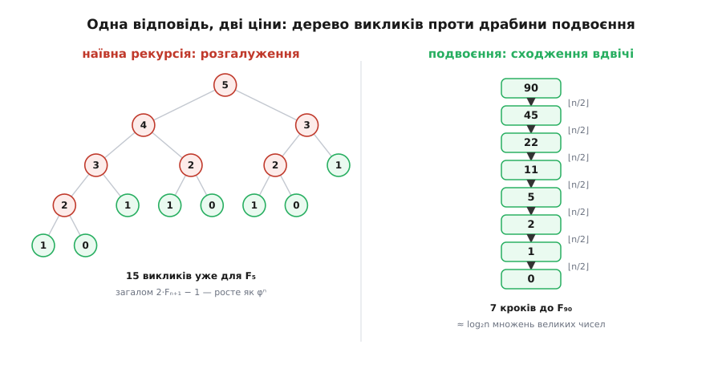

# ⚙️ Точний Fₙ швидко: від пастки рекурсії до логарифма кроків

Завдання звучить невинно: обчислити **точне** n-те число Фібоначчі — не оцінку, а всі його цифри — і зробити це швидко навіть для великого n. Означення Fₙ = Fₙ₋₁ + Fₙ₋₂ — це готовий рецепт, але перекладений у код найпрямішим способом він обертається на один із найвідоміших провалів продуктивності в усьому програмуванні. А правильний шлях зводить прогулянку в мільйон кроків до приблизно двадцяти множень. Перед нами чотири щаблі, і кожен — інша угода між тим, що каже математика, і тим, що бере за роботу машина.

## Наївна рекурсія: канонічна пастка

Означення читається як «кожне — сума двох попередніх», тож найочевидніший код кличе сам себе двічі:

```cpp
#include <cstdint>

std::uint64_t fib_naive(int n) {
    if (n < 2) return n;                 // база: F₀ = 0, F₁ = 1
    return fib_naive(n - 1) + fib_naive(n - 2);
}
```

Код правильний — і це катастрофа. Полічимо виклики. Нехай T(n) — скільки разів функція викликається, щоб порахувати fib(n). Тоді T(0) = T(1) = 1, а T(n) = 1 + T(n−1) + T(n−2). Але це те саме правило Фібоначчі, лише зсунуте, — і воно розв'язується точно:

```
кількість викликів = 2·Fₙ₊₁ − 1
```

Праця, потрібна щоб дістати n-те число Фібоначчі, сама росте як число Фібоначчі — тобто як φⁿ, справжня експонента. Заміряймо на одному ядрі:

```
fib(30):          2 692 537 викликів      7 мс
fib(40):        331 160 281 виклик       800 мс
fib(50):  ≈ 40 700 000 000 викликів    ≈ 100 с   (екстраполяція)
fib(60):        ≈ 5·10¹² викликів       ≈ кілька годин
```

Корінь марнотратства — забудькуватість. Гілка, що рахує fib(k), не знає, що сусідня гілка вже порахувала те саме; одне й те саме піддерево обчислюється знову і знову, стільки разів, скільки воно трапляється в дереві. Це підручниковий приклад того, як проста [рекурсія](topic:algorithms/recursion) перетворює однорядкове правило на експоненційну роботу.

## Ітерація: один прохід замість дерева

Дерево марнує все, бо нічого не запам'ятовує. Полагодити це просто: тримаймо лише два останні числа й ідімо вперед — жодного повтору:

```cpp
#include <cstdint>

std::uint64_t fib_iter(int n) {
    std::uint64_t a = 0, b = 1;          // a = F₀, b = F₁
    for (int i = 0; i < n; ++i) {
        std::uint64_t t = a + b;         // наступний член
        a = b;
        b = t;
    }
    return a;                            // a = Fₙ
}
```

Одне додавання на крок, n кроків: O(n) додавань. Це вже різниця між «ніколи не дорахує» і «миттєво» — для n у сотнях відповідь з'являється відразу. Та придивімося до чесної ціни, коли n **велике**. Fₙ має близько n·log₁₀φ ≈ 0.209·n цифр, тобто давно переросло будь-яке машинне слово. Отже додавання тут — додавання довгих чисел, і k-те з них працює над числом завдовжки ~0.7·k біт. У сумі це O(n²) бітових операцій — квадрат, а не лінія, щойно рахувати цифри, а не кроки. Але одне додавання на крок — це найдешевше, чим крок узагалі може коштувати. Мемоізована рекурсія купує ту саму O(n), проте платить стеком і таблицею; цикл — її чесна форма.

## Стрибок: піднести матрицю кроку подвоєнням

O(n) — добре, але саме n буває величезним. Чи можна перестрибнути? Можна, якщо поглянути на один крок як на [дію матриці](topic:math/matrices-as-operations) над парою сусідів (матрицю з одиниць назвімо Q):

```
⎛ Fₙ₊₁ ⎞   ⎛ 1  1 ⎞ ⎛ Fₙ   ⎞
⎜      ⎟ = ⎜      ⎟ ⎜      ⎟
⎝ Fₙ   ⎠   ⎝ 1  0 ⎠ ⎝ Fₙ₋₁ ⎠
```

n кроків — це Qⁿ. А степінь не потребує n множень: степінь **подвоюють**. З Q дістаємо Q², з нього Q⁴, Q⁸, … — і, читаючи двійкові розряди n, збираємо Qⁿ приблизно за log₂n множень:

```cpp
#include <cstdint>

struct Mat { std::uint64_t a, b, c, d; };        // [[a b],[c d]]

Mat mul(const Mat& x, const Mat& y) {
    return { x.a*y.a + x.b*y.c,  x.a*y.b + x.b*y.d,
             x.c*y.a + x.d*y.c,  x.c*y.b + x.d*y.d };
}

std::uint64_t fib_matrix(int n) {
    Mat r{1, 0, 0, 1};                           // одинична матриця
    Mat q{1, 1, 1, 0};                           // матриця кроку Q
    while (n > 0) {
        if (n & 1) r = mul(r, q);                // накопичуємо Q у потрібних розрядах
        q = mul(q, q);                           // Q, Q², Q⁴, Q⁸, …
        n >>= 1;
    }
    return r.b;                                   // верхній-правий елемент Qⁿ — це Fₙ
}
```

До мільйонного члена — не мільйон кроків, а близько двадцяти множень матриць. Кожне множення 2×2 — це жменя множень чисел, тож усе разом коштує O(log n) множень.

## Fast doubling: та сама ідея без матриці

Матриця несе зайве. Вона симетрична, а Fₙ₋₁ = Fₙ₊₁ − Fₙ, тож із чотирьох її клітинок незалежних лише дві. Виженемо надлишок — і крок подвоєння перетвориться на дві рівності над звичайними числами. Джерело їх найпряміше: подвоїти індекс — це **піднести матрицю до квадрата**, Q²ᵏ = (Qᵏ)². Розпишімо Qᵏ через члени Фібоначчі:

```
        ⎛ Fₖ₊₁  Fₖ   ⎞
Qᵏ  =   ⎜            ⎟
        ⎝ Fₖ    Fₖ₋₁ ⎠
```

Верхній-правий елемент квадрата (Qᵏ)² за побудовою дорівнює F₂ₖ, а верхній-лівий — F₂ₖ₊₁. Перемножмо матрицю саму на себе, прочитаймо ці дві клітинки й спростімо, підставивши Fₖ₋₁ = Fₖ₊₁ − Fₖ:

```
F(2k)   = Fₖ₊₁·Fₖ + Fₖ·Fₖ₋₁ = Fₖ·(Fₖ₊₁ + Fₖ₋₁) = Fₖ·(2·Fₖ₊₁ − Fₖ)
F(2k+1) = Fₖ₊₁·Fₖ₊₁ + Fₖ·Fₖ = Fₖ₊₁² + Fₖ²
```

Ось і все подвоєння. Маючи пару (Fₖ, Fₖ₊₁) на **половинному** індексі, ці дві формули дають (F₂ₖ, F₂ₖ₊₁) трьома множеннями й без жодної матричної бухгалтерії. Лишається пройти розряди n від старшого до молодшого: на кожному подвоюємо індекс, а де розряд одиничний — додатково робимо один звичайний крок уперед.

:::tabs
```cpp
#include <cstdint>
#include <bit>            // std::countl_zero — C++20
#include <utility>        // std::pair

// повертає пару (Fₙ, Fₙ₊₁); коректно для n ≤ 93, далі uint64 переповнюється
std::pair<std::uint64_t, std::uint64_t> fib_fast(std::uint64_t n) {
    std::uint64_t a = 0, b = 1;                  // (F₀, F₁)
    for (int i = 63 - std::countl_zero(n | 1); i >= 0; --i) {
        std::uint64_t c = a * (2 * b - a);       // F(2k)   = Fₖ·(2Fₖ₊₁ − Fₖ)
        std::uint64_t d = a * a + b * b;         // F(2k+1) = Fₖ₊₁² + Fₖ²
        if ((n >> i) & 1) { a = d; b = c + d; }  // розряд = 1: ще крок уперед
        else              { a = c; b = d;     }  // розряд = 0
    }
    return {a, b};
}
```
```py
def fib_fast(n: int) -> tuple[int, int]:
    """повертає (F(n), F(n+1)); цілі Python ростуть без стелі — відповідь точна"""
    if n == 0:
        return (0, 1)
    a, b = fib_fast(n >> 1)                       # (F(k), F(k+1)), де k = ⌊n/2⌋
    c = a * (2 * b - a)                           # F(2k)   = F(k)·(2F(k+1) − F(k))
    d = a * a + b * b                             # F(2k+1) = F(k+1)² + F(k)²
    return (d, c + d) if (n & 1) else (c, d)

# fib_fast(1_000_000)[0]  →  точні 208 988 цифр за кілька мілісекунд.
# Глибина рекурсії тут лише log₂n ≈ 20 — межі стека й близько немає.
```
:::

Ця стисла пара формул — саме та, яку Дейкстра виписав у нотатці EWD654 «In honour of Fibonacci» (1978); за нею і тягнуться реалізації в бібліотеках. Дві мови поруч показують головний вибір. C++ рахує в машинному `uint64_t` — блискавично, але тільки поки число влазить; Python має вбудовані довгі цілі, тож ті самі три рядки видають точний мільйонний член. Різниця між ними — і є половина всіх пасток нижче.


*Та сама відповідь, дві ціни. Наївна рекурсія на кожному вузлі роздвоюється — 15 викликів уже для F₅, а загалом 2Fₙ₊₁−1, тобто φⁿ. Подвоєння натомість щокроку ділить n навпіл: до F₉₀ — сім сходинок, кожна ціною трьох множень.*

Заміряймо на точних довгих числах, одне ядро:

```
n =   100 000:   ітерація     58 мс   |   подвоєння   0.5 мс
n = 1 000 000:   ітерація   5110 мс   |   подвоєння   6.3 мс      (×813)
                 (1 000 000 додавань)      (60 множень)
```

Двадцять поділів навпіл, три множення на кожному — шістдесят множень довгих чисел проти мільйона додавань. Ось звідки вісімсоткратна перевага.

## Складність і пастки

Тепер дрібний шрифт, бо саме «O(log n)» ховає окрему пастку.

**«O(log n)» — це число МНОЖЕНЬ, а не бітових операцій.** Кроків подвоєння справді ~log₂n, але операнди на них не однакові: останнє множення бере два числа майже повної ширини ~0.7·n біт. Якщо перемножувати їх «стовпчиком», одне таке множення коштує O(n²) бітових операцій — і воно домінує над усією рештою, тож повна вартість подвоєння теж O(n²), той самий порядок, що й в ітерації! Виграє подвоєння з двох причин. Перша: шістдесят операцій б'ють мільйон навіть коли ці шістдесят великі. Друга, важливіша: справжні бібліотеки [довгих (arbitrary-precision) цілих](topic:programming/arbitrary-precision) множать не «стовпчиком», а субквадратично — Карацуба, далі методи на основі швидкого перетворення, — і повна вартість падає до ~O(n¹·⁵⁸⁵) й нижче. Виміряні ×813 — це і є субквадратичне множення у дії; заміни його на шкільне — і перевага стане лише сталим множником.

> 🔧 **Навіщо це.** Асимптотика тут бреше в обидва боки, тому вірять виміру, а не формулі. «Логарифм кроків» звучить так, ніби подвоєння завжди й скрізь незрівнянно швидше, — а на коротких числах, що влазять у регістр, трирядковий цикл із додаванням його наздожене, бо там немає жодного дорогого множення. І навпаки: на дуже довгих числах перевага подвоєння більша за будь-яку обіцяну логарифмом, бо разів у нього мало, зате кожен користає всю міць субквадратичного множника. Правильне питання — не «яка складність», а «якого розміру числа й скільки їх».

**Переповнення фіксованих типів.** Точна межа машинного слова — не абстракція, її видно на конкретному члені:

```
INT64_MAX  = 9 223 372 036 854 775 807     F₉₂ = 7 540 113 804 746 346 429   ← ще влазить
                                            F₉₃ = 12 200 160 415 121 876 738  ← вже ні (int64)
UINT64_MAX = 18 446 744 073 709 551 615     F₉₃ = 12 200 160 415 121 876 738  ← ще влазить
                                            F₉₄ = 19 740 274 219 868 223 167  ← вже ні (uint64)
```

Знаковий `int64` тримає Фібоначчі до F₉₂, беззнаковий `uint64` — до F₉₃. На F₉₄ показаний вище C++-код не кидає помилки — він **тихо загортається** й повертає Fₙ mod 2⁶⁴, правильне на вигляд, хибне по суті число. Щоб дістати точний великий Fₙ, доводиться підмінити `uint64_t` на тип довгої арифметики; Python-варіант робить це задарма, бо його `int` уже такий. Це не хиба того чи того алгоритму — це та сама тріщина між скінченним словом машини й безмежним цілим математики.

**Формула Біне на `double` промахується вже під сотнею.** Замкнена формула Fₙ = round(φⁿ/√5) спокушає обіцянкою O(1) — жодного циклу, одразу відповідь. Але `double` несе лише ~52 біти мантиси, тобто 15–16 значущих цифр, а щоб округлення влучило, похибка мусить лишатися меншою за 0.5. У φⁿ вона накопичується, і терпець уривається дуже рано:

```
n = 71:  F₇₁ точне       = 308 061 521 170 129
         round(φ⁷¹/√5)   = 308 061 521 170 130      ← +1, перший промах
```

Далі розрив тільки росте (на n = 78 це вже +24). Ще не діставшись сотні, «миттєва формула» бреше — і жодне [збільшення точности](topic:programming/floating-point) не рятує надовго, бо число цифр у Fₙ росте лінійно, а мантиса стала. Там, де потрібне точне ціле, інструмент — подвоєння, а не Біне.

**Коли потрібне лише Fₙ mod m.** Якщо кінцева мета — остача (а так буває в теоретико-числових алгоритмах і хешуванні), зведіть c і d за модулем m на кожному кроці. Числа тоді ніколи не переростають m, кожне множення — одна машинна операція, і O(log n) стає буквальним часом роботи: жодних довгих чисел, лише десятки [модульних](topic:math/modular-arithmetic) множень навіть для астрономічного n.

Один рядок правила — і чотири угоди з машиною. Наївна рекурсія лише виглядає дешевою, а насправді це пастка на φⁿ. Цикл чесний, та в бітах усе одно квадратичний. Матричне подвоєння купує логарифм — але множень, не бітових операцій. Fast doubling дає той самий логарифм, скинувши матрицю як зайву вагу. Спільне в них одне: кожне справжнє прискорення живе на шві, де скінченні слово й час машини зустрічаються з безмежним цілим математики.
