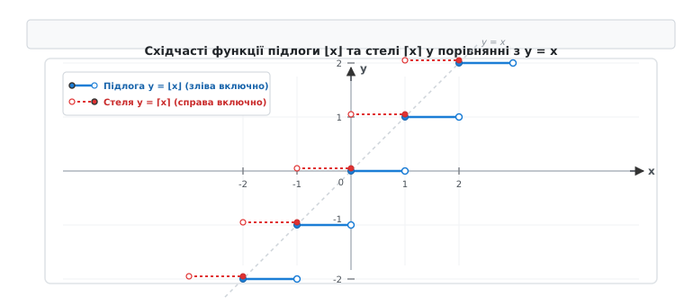
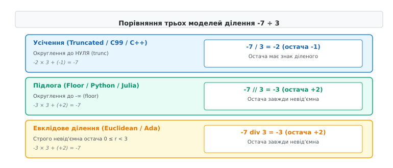
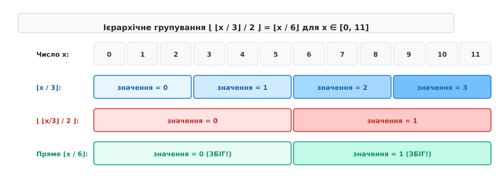
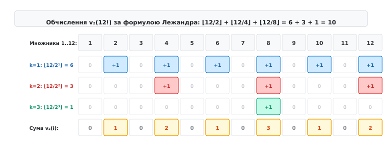

# Цілочислове ділення й підлога

<preknowlist>
- [Алгоритм Евкліда та найбільший спільний дільник](book:math/gcd-euclidean)
- [Модульна арифметика та класи лишків](book:math/modular-arithmetic)
</preknowlist>

При розробці геоінформаційної системи з квадратними тайлами розміром 256×256 пікселів координати об'єкта на карті `(x, y)` переводяться у номер тайла виразом `x / 256` та `y / 256`. Якщо об'єкт знаходиться у додатній напівплощині `x = 512`, він потрапляє у тайл `512 / 256 = 2`. Однак при переході від'ємної осі для точки `x = -1` стандартна цілочислова арифметика мови C99 повертає `0`, оскільки округлення відбувається вбік нуля (`truncation toward zero`). В результаті нульовий тайл розширюється і охоплює проміжок від `-255` до `255` пікселів — удвічі більший за всі інші тайли сітки! Це призводить до накладання 3D-моделей на межі півкуль, розриву текстур ландшафту та виходу за межі масиву пам'яті.

Причиною цієї інженерної аномалії є принципова відмінність між двома моделями цілочислового ділення: **усіченим діленням** (англ. *truncated division*), яке використовують мови C, C++, Rust та Java, і **діленням за підлогою** (англ. *floored division*), зафіксованим у мові Python та класичній теорії чисел.

---

## 1. Математичне означення та фундаментальні властивості підлоги і стелі

Операції округлення дійсних чисел до цілих були систематизовані Карлом Фрідріхом Ґауссом у 1808 році під час доведення квадратичного закону взаємності (де детальніше розглянуто в історичному контексті: [📜 Історія позначень та стандартизації ділення: від Гаусса до Айверсона](book:math/number-theory/floor-division/hist-gauss-floor.md)). Сучасні математичні позначення `⌊x⌋` та `⌈x⌉` запропонував Кеннет Айверсон у 1962 році під час створення мови APL.


*Функції підлоги ⌊x⌋ та стелі ⌈x⌉ утворюють ступінчасті графіки зі стрибками одиничної висоти в кожній цілій точці x ∈ ℤ.*

### Функція підлоги (Floor)
**Функцією підлоги** (або цілою частиною, англ. *floor function*) називається відображення `⌊·⌋: ℝ → ℤ`, яке зіставляє кожному дійсному числу `x` найбільше ціле число, що не перевищує `x`:

```
⌊x⌋ = max { n ∈ ℤ | n ≤ x }
```

Виходячи з цього означення, будь-яке дійсне число `x` однозначно задовольняє подвійну нерівність `⌊x⌋ ≤ x < ⌊x⌋ + 1`.

Функція підлоги є монотонно неспадною, кусково-сталою та правонеперервною функцією. У кожній цілій точці `x = n ∈ ℤ` функція має розрив першого роду зі стрибком одиничної висоти.

### Функція стелі (Ceiling)
**Функцією стелі** (англ. *ceiling function*) називається відображення `⌈·⌋: ℝ → ℤ`, яке зіставляє кожному дійсному числу `x` найменше ціле число, що не менше за `x`:

```
⌈x⌉ = min { n ∈ ℤ | n ≥ x }
```

Подвійна нерівність для функції стелі має вигляд `⌈x⌉ - 1 < x ≤ ⌈x⌉`. На відміну від підлоги, функція стелі є лівонеперервною.

### Дробова частина (Fractional Part)
Дійсне число `x` завжди можна розкласти на суму цілої та дробової частини (англ. *fractional part*), яка позначається як `{x}`:

```
x = ⌊x⌋ + {x},   де 0 ≤ {x} < 1
```

Дробова частина `{x} = x - ⌊x⌋` є пилоподібною періодичною функцією з основным періодом 1. Вона відіграє ключову роль у теорії динамічних систем, стохастичних процесах, комп'ютерній графіці при обчисленні текстурних координат та в аналітичній теорії чисел.

### Базові алгебраїчні тотожності підлоги та стелі
1. **Зсув на цілий доданок**: Для будь-якого дійсною числа `x ∈ ℝ` та цілого числа `k ∈ ℤ` цілу частину можна винести за дужки округлення:
   ```
   ⌊x + k⌋ = ⌊x⌋ + k,   ⌈x + k⌉ = ⌈x⌉ + k
   ```
2. **Симетрія відносно знака**: Зміна знака аргументу перетворює функцію підлоги на функцію стелі з протилежним знаком:
   ```
   ⌈x⌉ = -⌊-x⌋,   ⌊x⌋ = -⌈-x⌉
   ```
3. **Округлення цілих чисел**: Якщо число `n ∈ ℤ` є цілим, то `⌊n⌋ = ⌈n⌉ = n`. Якщо ж число `x ∉ ℤ` не є цілим, різниця між стелею та підлогою завжди дорівнює одиниці: `⌈x⌉ - ⌊x⌋ = 1`.
4. **Монотонність**: Якщо `x ≤ y`, то `⌊x⌋ ≤ ⌊y⌋` та `⌈x⌉ ≤ ⌈y⌉`.

---

## 2. Моделі цілочислового ділення зі остачею

При діленні цілого числа `a` (ділене) на ціле число `b ≠ 0` (дільник) теорема про ділення зі остачею стверджує існування єдиної пари цілих чисел `q` (частка, англ. *quotient*) та `r` (остача, англ. *remainder*), що задовольняють фундаментальне співвідношення розкладу:

```
a = q · b + r
```

Оскільки для дійсного відношення `a / b` існує нескінченно багато цілих `q`, вибір конкретної пари `(q, r)` визначається **моделлю округлення частки**.


*Геометричний розподіл часток і остач для від'ємних чисел у трьох модельних системах цілочислового ділення.*

У сучасній інформатиці та прикладної математиці застосовуються три ключові моделі ділення:

### 1. Усічене ділення (Truncated Division)
У цій моделі частка округлюється у напрямку до нуля: `q = trunc(a / b)`.
- Формула остачі: `r = a - q · b`.
- Властивість остачі: Знак остачі `r` завжди збігається зі знаком діленого `a` (або дорівнює нулю).
- Стандартизація: Стандарт **ISO/IEC C99** та **C++11** фіксують оператор `/` як усічене ділення. Для операндів `-7` та `3` маємо: `-7 / 3 == -2`, `-7 % 3 == -1`.

Головна перевага усіченого ділення полягає у симетрії відносно нуля: `(-a) / b == -(a / b)`. Однак ця симетрія ламає неперервність остачі при переході через нуль, створюючи аномальні нульові інтервали подвійної тривалості.

### 2. Ділення за підлогою (Floored Division)
У цій моделі частка округлюється у напрямку до мінус нескінченності: `q = ⌊a / b⌋`.
- Формула остачі: `r = a - ⌊a / b⌋ · b`.
- Властивість остачі: Знак остачі `r` завжди збігається зі знаком дільника `b` (або дорівнює нулю).
- Мови програмування: Мова **Python** (оператори `//` та `%`) та мова **Julia** використовують ділення за підлогою. Для операндів `-7` та `3` маємо: `-7 // 3 == -3`, `-7 % 3 == 2`.

Головною перевагою ділення за підлогою є строга циклічна періодичність остачі. Наприклад, вираз `x % 3` для послідовних цілих чисел `x` дає строго періодичну послідовність `..., 0, 1, 2, 0, 1, 2, ...` вздовж всієї числової осі без жодних розривів у нулі.

### 3. Евклідове ділення (Euclidean Division)
В евклідовому діленні вимоги до остачі висуваються математично строго: остача повинна бути завжди строго невід'ємною `0 ≤ r < |b|` для будь-яких знаків операндів.
- Обчислення частки: `q = ⌊a / b⌋`, якщо `b > 0`, і `q = ⌈a / b⌉`, якщо `b < 0`.
- Застосування: Криптографія, алгебраїчна теорія чисел, теорія кодування та абстрактна алгебра (кільця лишків `ℤ / nℤ`).

Деталізовані порівняльні специфікації 12 мов програмування та 5 процесорних архітектур наведено у довіднику: [📋 Порівняльний довідник моделей цілочислового ділення у мовах програмування та архітектурах систем](book:math/number-theory/floor-division/api-language-division-table.md).

---

## 3. Тотожність вкладених підлог та неперервність ділення

У системному програмуванні та теорії алгоритмів часто зустрічається послідовне ділення на декілька дільників. Наприклад, обчислення індексу елемента у тривимірній сітці вимагає виконання операції `⌊ ⌊x / b₁⌋ / b₂ ⌋`.

### Теорема про вкладену підлогу (Nested Floor Theorem)
Для будь-якого дійсного числа `x ∈ ℝ` та будь-якого натурального числа `n ∈ ℕ` виконується тотожність:

```
⌊ ⌊x⌋ / n ⌋ = ⌊ x / n ⌋
```

Звідси випливає фундаментальний наслідок для послідовного цілочислового ділення. Якщо `a, b, c ∈ ℤ` і `b > 0, c > 0`, то:

```
⌊ ⌊a / b⌋ / c ⌋ = ⌊ a / (b · c) ⌋
```

Це означає, що каскад з двох послідовних цілочислових ділень за підлогою на `b` та `c` еквівалентний єдиному діленню на їхній добуток `b · c`.


*Геометричне покриття дискретної ґратки: групування блоків розміром b×c під дією тотожності вкладених підлог.*

Доведення базується на розкладі `⌊x⌋ = q · n + r`, де `0 ≤ r ≤ n - 1`. Поділивши на `n`, маємо `⌊x⌋ / n = q + r / n`. Оскільки `0 ≤ r / n < 1`, застосування зовнішньої підлоги дає `⌊ ⌊x⌋ / n ⌋ = q`. З іншого боку, `x = q · n + r + {x}`. Оскільки `r + {x} < n`, ділення `x / n = q + (r + {x}) / n` при взятті підлоги також дає `q`, що й доводить рівність.

Строгі математичні доведення тотожності вкладених підлог та тотожності Ерміта детально розібрані в аналітичному блоці: [🧮 Доведення тотожностей Ерміта, вкладених підлог та формули Лежандра](book:math/number-theory/floor-division/math-hermite-legendre.md).

---

## 4. Тотожність Ерміта та її дискретний аналіз

Французький математик Шарль Ерміт у 1868 році довів фундаментальне співвідношення, яке розкладає підлогу кратних аргументів у суму підлог зі зсувами.

### Тотожність Ерміта (Hermite's Identity)
Для будь-якого дійсного числа `x ∈ ℝ` та будь-якого натурального числа `n ∈ ℕ` справджується рівність:

```
⌊n · x⌋ = ⌊x⌋ + ⌊x + 1/n⌋ + ⌊x + 2/n⌋ + … + ⌊x + (n - 1)/n⌋ = ∑_{k=0}^{n-1} ⌊x + k/n⌋
```

### Застосування у комп'ютерній графіці (Алгоритм Брезенгема)
Тотожність Ерміта пояснює математичний механізм растеризації відрізків та кривих на дискретній піксельній сітці. Під час дискретизації похилої лінії з коефіцієнтом нахилу `k = dy / dx` сума зсунутих підлог точно визначає пікселі, крізь які проходить геометричний промінь, виключаючи необхідність обчислень у дійсному форматі FPU.

---

## 5. Формула Лежандра для факторіалів та теорія чисел

У теорії чисел та комбінаториці важливим завданням є обчислення показника степеня `v_p(n!)`, з яким просте число `p` входить у розклад факторіала `n!` на прості множники:

```
n! = ∏_{p ≤ n} p^{v_p(n!)}
```

### Формула Лежандра (Legendre's Formula)
Адрієн-Марі Лежандр у 1808 році довів, що показник степеня `v_p(n!)` точно обчислюється як скінченна сума підлог ділення `n` на послідовні степені простого числа `p`:

```
v_p(n!) = ⌊n / p⌋ + ⌊n / p²⌋ + ⌊n / p³⌋ + … = ∑_{k=1}^{∞} ⌊n / p^k⌋
```

Оскільки для `p^k > n` значення підлоги `⌊n / p^k⌋ = 0`, сума містить лише `⌊log_p n⌋` ненульових доданків.


*Геометрична підрахункова ґратка формули Лежандра: кратність ділення чисел від 1 до n на степені простого числа p.*

### Приклад обчислення нулів факторіала
Знайдемо кількість нулів, якими закінчується десятковий запис числа `100!`. Кількість нулів дорівнює показникові степеня `v_5(100!)`, оскільки множників `2` у розкладі завідомо більше ніж `5`:

1. `⌊100 / 5⌋ = 20`
2. `⌊100 / 25⌋ = 4`
3. `⌊100 / 125⌋ = 0`

Отже, `v_5(100!) = 20 + 4 = 24`. Число `100!` закінчується строго 24 нулями.

---

## 6. Підлога у розв'язанні лінійних діофантових рівнянь

Лінійне діофантове рівняння з двома невідомими має вигляд `a · x + b · y = c`, де `a, b, c ∈ ℤ`. За теоремою Безу це рівняння має розв'язки у цілих числах тоді й лише тоді, коли `gcd(a, b)` ділить `c`.

### Алгоритмічний пошук розв'язку через підлогове ділення
При застосуванні розширеного алгоритму Евкліда (детально описаного у [Алгоритм Евкліда та найбільший спільний дільник](book:math/gcd-euclidean)) на кожному кроці виконується цілочислове ділення з підлогою `q_k = ⌊r_{k-1} / r_k⌋`.

Загальний розв'язок діофантового рівняння виражається через параметр `t ∈ ℤ`:

```
x = x₀ + t · (b / gcd(a, b)),   y = y₀ - t · (a / gcd(a, b))
```

Якщо на розв'язки накладається умова невід'ємності `x ≥ 0` та `y ≥ 0`, межі для параметра `t` прямо виражаються через підлогове ділення межі систем нерівностей:

```
t_min = ⌈ -x₀ · gcd(a, b) / b ⌉,   t_max = ⌊ y₀ · gcd(a, b) / a ⌋
```

Підлогове ділення забезпечує дискретний відбір цілочислових точок всередині опуклих багатокутників, що лежить в основі теореми Піка для обчислення площі сіткових многокутників `S = I + B / 2 - 1`.

---

## 7. Розподіл дробових частин і теорема Вейля про рівномірний розподіл

У математичному аналізі та теорії чисел дробова частина `{x} = x - ⌊x⌋` є основою для аналізу рівномірного розподілу послідовностей на інтервалі `[0, 1)`.

### Теорема Гекке — Вейля (Equidistribution Theorem)
Якщо `α` є ірраціональним числом, то послідовність дробових частин `{n · α}` для `n = 1, 2, 3, …` є **рівномірно розподіленою** на інтервалі `[0, 1)`. Це означає, що для будь-якого підінтервалу `[a, b) ⊆ [0, 1)` частка елементів послідовності, які потрапляють у `[a, b)`, прямує до довжини цього інтервалу `b - a`:

```
lim_{N → ∞} (1 / N) · #{ 1 ≤ n ≤ N | {n · α} ∈ [a, b) } = b - a
```

Цей результат використовується в генераторах псевдовипадкових чисел (метод лінійних конгруентних датчиків), чисельному інтегруванні Монте-Карло, аналізі рівномірного заповнення кеш-пам'яті процесора та алгоритмах швидкого хешування.

---

## 8. Підлога в аналізі складності алгоритмів та структур даних

Операція підлоги є базовим інструментом при точному обчисленні часової та просторової складності алгоритмів.

### Висота двоподібних дерев та бінарна купа (Binary Heap)
1. **Бітова довжина цілого числа**: Для будь-якого натурального числа `N ∈ ℕ` кількість бітів у його двійковому представленні точно дорівнює `b = ⌊log₂ N⌋ + 1`.
2. **Висота збалансованого двійкового дерева**: Дерево пошуку з `N` вузлами має глибину `h = ⌊log₂ N⌋`.
3. **Індексація бінарної купи у масиві**: У двоподібній купі (HeapSort), розміщеній у суцільному масиві з 0-індексацією, для елемента з індексом `i` координати батьківського та дочірніх вузлів обчислюються за допомогою ділення за підлогою:
   - Батьківський вузол (Parent): `parent(i) = ⌊(i - 1) / 2⌋`
   - Лівий дочірній вузол (Left child): `left(i) = 2 · i + 1`
   - Правий дочірній вузол (Right child): `right(i) = 2 · i + 2`

---

## 9. Практична реалізація та обчислювальна складність

Під час розробки системного програмного забезпечення на мовах C та C++ необхідно дотримуватися суворих правил обчислення цілочислового ділення для запобігання переповненням та невизначеній поведінці (англ. *undefined behavior*).

### Правило безпечного ділення за стелею (Ceiling Division)
Для обчислення `⌈a / b⌉` без ризику цілочислового переповнення суми `a + b - 1` використовується тотожність:

```
⌈a / b⌉ = 1 + ⌊(a - 1) / b⌋   (для a > 0, b > 0)
```

Детальні реалізації алгоритмів безпечного ділення, конвертації моделей та бітових зсувів з тестами C та C++ наведено у практичному модулі: [⚙️ Практичні алгоритми цілочислового ділення, захист від переповнення та оптимізація зсувами](book:math/number-theory/floor-division/proj-division-implementations.md).

### Компіляторні оптимізації ділення на константу
Оскільки апаратна інструкція цілочислового ділення `IDIV` на процесорах x86-64 виконується за 12–42 тактові цикли, сучасні компілятори замінюють ділення на константу `D` множенням на 64-бітний **магічний множник** `M = ⌈2^S / D⌉` з наступним арифметичним зсувом `>> S`. Це прискорює виконання операції ділення у 15–30 разів.
