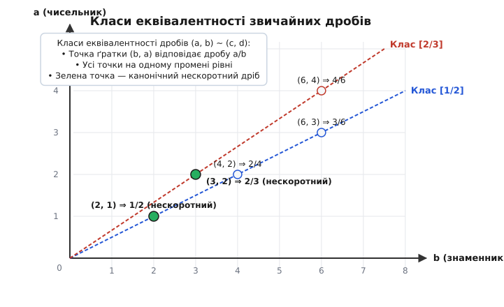
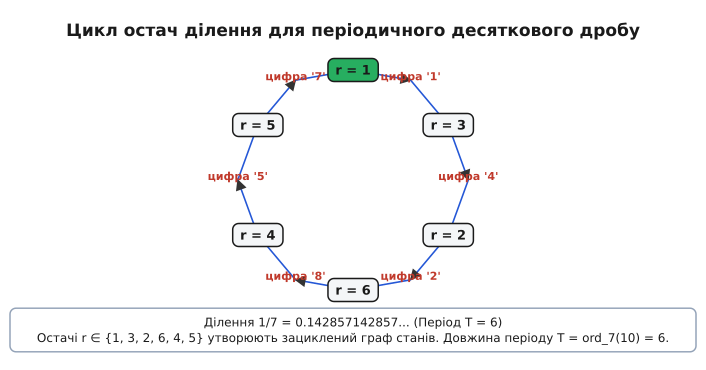
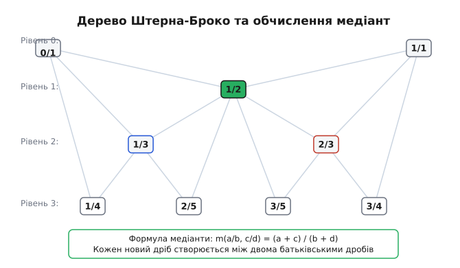

# Звичайні дроби

<preknowlist>
- [Найбільший спільний дільник (НСД)](topic:math/gcd-euclidean) — алгоритм Евкліда, властивості подільності та ділення з остачею.
- [Основна теорема арифметики](topic:math/fundamental-theorem-arithmetic) — єдиність розкладу цілих чисел на прості множники.
- [Функція Ейлера та модульна арифметика](topic:math/euler-totient) — порівняння за модулем, мультиплікативний порядок та теорема Ейлера.
- [Діофантові рівняння](topic:math/diophantine-equations) — лінійні рівняння у цілих числах та тотожність Безу.
</preknowlist>

> 🔧 **Навіщо це.**
> Звичайні дроби є фундаментальним алгебраїчним інструментом, що усуває обчислювальну обмеженість цілих чисел відносно операції ділення. У теорії чисел та абстрактній алгебрі вони створюють поле раціональних чисел Q — найменше числове поле, у якому можливе точне ділення на будь-який ненульовий елемент. В інженерії, обчислювальній геометрії, комп'ютерній алгебрі (CAS) та фінансових системах звичайні дроби забезпечують точну арифметику без накопичення помилок округлення, притаманних представленням із плаваючою крапкою (IEEE 754), а також слугують основою для найкращих раціональних наближень через неперервні дроби та послідовності Фарея.

## 1. Алгебраїчна незамкненість цілих чисел та виникнення дробів

Кільце цілих чисел `Z` є алгебраїчно досконалим відносно трьох базових арифметичних операцій: додавання, віднімання та множення. Для будь-яких двох цілих чисел `a` та `b` їхня сума `a + b`, різниця `a - b` та добуток `a · b` завжди є цілими числами, тобто належать `Z`. Це означає, що алгебраїчна структура `(Z, +, ·)` утворює двоопераційне алгебраїчне кільце з одиницею. 

Проте відносно множення кільце цілих чисел є лише комутативним монофонічним напівгруповим утворенням (областю цілісності), у якому мультиплікативні обернені елементи існують лише для чисельних одиниць `+1` та `-1`.

Операція ділення `a / b` виходить за межі цілих чисел у більшості практичних та теоретичних випадків. Лінійне діофантове рівняння першого степеня:
```
b · x = a                          [рівняння ділення у цілих числах]
```
має цілий розв'язок `x ∈ Z` лише тоді і тільки тоді, коли `b` є дільником `a` (що математично позначається як `b | a`). У разі, коли `b` не ділить `a` без остачі (наприклад, для рівняння `3 · x = 7`), в рамках алгебраїчної системи цілих чисел `Z` не існує жодного числа чи елемента, який міг би слугувати точним розв'язком цього рівняння.

Спроба виміряти неперервні фізичні величини (довжину відрізка, масу тіла, площу ділянки, інтервали часу) або поділити дискретний обмежений ресурс між декількома суб'єктами неминуче призводить до необхідності введення дробових часток цілого. Інтуїтивно звичайний дріб `a/b` сприймається як результат поділу одиничного цілого на `b` рівних частин та взяття `a` таких частин. Число `a` називається **чисельником** (лат. *numerator* — той, що лічить), а число `b` — **знаменником** (лат. *denominator* — той, що називає міру).

Перші спроби оперувати частками цілого зіштовхнулися з винятковою громіздкістю арифметичних записів — від єгипетських аліквотних сумувань вида `1/n` до вавилонських шістдесяткових розрядів. Повний огляд історичного шляху від папірусу Ахмеса до формування сучасної риски дробу викладено у [Історія виникнення концепції дробу](topic:math/fractions/hist-fraction-concept.md).

З формальної алгебраїчної точки зору дріб являє собою впорядковану пару цілих чисел `(a, b)`, де `b ≠ 0`. Проте на цьому шляху виникає фундаментальна проблему неєдиності запису: пари `(1, 2)`, `(2, 4)`, `(3, 6)` та `(-5, -10)` описують одну й ту саму математичну величину. Це вимагає строгого формального визначення раціонального числа через класи еквівалентності на декартовому добутку цілих чисел.

## 2. Формальна алгебраїчна побудова Поля Часток (Q)

Щоб усунути неоднозначність запису дробів, розглянемо множину впорядкованих пар цілих чисел `S = Z × (Z \ {0})`, у якій перший елемент `a ∈ Z` представляє потенційний чисельник, а другий елемент `b ∈ Z \ {0}` — ненульовий знаменник.

На множині `S` вводиться бінарне відношення еквівалентності `~` (тильда), визначене пропорційністю хрестових добутків:
```
(a, b) ~ (c, d)  [за визначенням]
⇔ a · d = b · c  [рівність хрестових добутків]
```

Це відношення розбиває множину пар `S` на множину неперетинних класів еквівалентності `Q = S / ~`. Кожен клас еквівалентності `[(a, b)]` називається **раціональним числом** (лат. *rationalis* — розумний, відносний, від *ratio* — відношення).


*Геометричне представлення класів еквівалентності дробів (a, b) на двовимірній цілочисельній ґратці. Усі точки (b, a), що лежать на одному промені, який проходить через початок координат, належать до одного класу еквівалентності та задають те саме раціональне число.*

На множині класів еквівалентності `Q` визначаються дві алгебраїчні операції:

1. **Додавання класів:**
```
[(a, b)] + [(c, d)] = [(a · d + b · c, b · d)]   [визначення додавання дробів]
```

2. **Множення класів:**
```
[(a, b)] · [(c, d)] = [(a · c, b · d)]           [визначення множення дробів]
```

Коректність цих операцій полягає у тому, що результат не залежить від вибору конкретних представників `(a, b)` та `(c, d)` у своїх классах еквівалентності. Якщо підставити інші еквівалентні пари `(a', b') ~ (a, b)` та `(c', d') ~ (c, d)`, результуюча пара буде еквівалентна початковій.

Алгебраїчна структура `(Q, +, ·)` задовольняє всі 9 аксіом алгебраїчного поля:
- Вона утворює абелеву групу за додаванням із нейтральним елементом `[(0, 1)]` та протилежним елементом `[(-a, b)]`;
- Ненульові елементи `Q \ {[(0, 1)]}` утворюють абелеву групу за множенням із нейтральним елементом `[(1, 1)]` та оберненим елементом `[(b, a)]` для будь-якого `a ≠ 0`;
- Множення є дистрибутивним відносно додавання.

Детальний формальний доказ кожної з 9 аксіом поля та перевірку незалежності операцій від вибору представника класу наведено у [Формальний алгебраїчний доказ побудови поля часток](topic:math/fractions/math-field-construction.md).

Кільце цілих чисел `Z` ізоморфно вкладається у поле раціональних чисел `Q` через мономорфний ін'єкційний гомоморфізм `n ↦ [(n, 1)]`. Поле `Q` є мінімальним полем часток (англ. *field of fractions*), що містить `Z` як підкільце, і це поле є найпростішим прикладом алгебраїчного поля характеристики 0.

## 3. Нескоротні дроби та канонічне представлення

Хоча раціональне число за визначенням є нескінченним класом еквівалентних пар `(a, b)`, для практичних обчислень, алгоритмів та теорії чисел необхідний єдиний канонічний представник класу.

### Теорема про існування та єдиність нескоротного дробу

Для будь-якого раціонального числа `q ∈ Q` існує єдина пара цілих чисел `(p, r)`, така що `q = p / r`, для якої виконуються дві умови:
1. `r > 0` (знаменник є строго додатним натуральним числом),
2. `gcd(p, r) = 1` (чисельник i знаменник є взаємно простими числами).

Дріб `p/r`, що задовольняє ці умови, називається **нескоротним дробом** (або канонічним дробом).

### Алгебраїчний доказ єдиності нескоротного дробу

Припустимо від супротивного, що для одного й того самого раціонального числа `q` існують дві різні канонічні пари `(p_1, r_1)` та `(p_2, r_2)`, де `r_1 > 0`, `r_2 > 0`, `gcd(p_1, r_1) = 1` та `gcd(p_2, r_2) = 1`.

З рівності раціональних чисел випливає:
```
p_1 / r_1 = p_2 / r_2             [умова рівності двох дробів]
⇒ p_1 · r_2 = p_2 · r_1           [перехресне множення]
```

Оскільки `gcd(p_1, r_1) = 1`, число `r_1` не має спільних простих дільників з `p_1`. З рівності `p_1 · r_2 = p_2 · r_1` випливає, що `r_1` ділить добуток `p_1 · r_2`. За лемою Евкліда, якщо `r_1` ділить `p_1 · r_2` i `gcd(p_1, r_1) = 1`, то `r_1` мусить ділити `r_2` (тобто `r_1 | r_2`).

Аналогічно, оскільки `gcd(p_2, r_2) = 1`, з тієї самої рівності випливає, що `r_2` ділить `r_1` (тобто `r_2 | r_1`).

Оскільки `r_1 > 0` та `r_2 > 0` є додатними цілими числами, умови `r_1 | r_2` та `r_2 | r_1` можливі лише за умови `r_1 = r_2`.

Підставляючи `r_1 = r_2` у рівність `p_1 · r_2 = p_2 · r_1`, отримуємо `p_1 · r_1 = p_2 · r_1`. Оскільки `r_1 > 0`, скорочення дає `p_1 = p_2`. Єдиність канонічного представлення доведено.

### Покроковий алгоритм скорочення дробу через НСД

Для зведення довільного дробу `a/b` (де `b ≠ 0`) до канонічного нескоротного дробу `p/r` застосовується наступний алгоритм:

1. **Нормалізація знаку:** Якщо `b < 0`, то чисельник і знаменник множаться на -1:
   `a' = -a`, `b' = -b`. Якщо `b > 0`, то `a' = a`, `b' = b`.
2. **Обчислення НСД:** За допомогою алгоритму Евкліда обчислюється `g = gcd(|a'|, b')`.
3. **Скорочення:**
   `p = a' / g`,
   `r = b' / g`.

```
Початковий дріб:  -42 / -70
[Крок 1: нормалізація знаку, b = -70 < 0]
a' = 42,  b' = 70

[Крок 2: пошук НСД за алгоритмом Евкліда]
gcd(42, 70):
70 = 1 · 42 + 28
42 = 1 · 28 + 14
28 = 2 · 14 + 0
g = 14

[Крок 3: ділення на g = 14]
p = 42 / 14 = 3
r = 70 / 14 = 5

Канонічний нескоротний дріб: 3 / 5
```

### Тотожність Безу для нескоротного дробу

Якщо дріб `p/r` є нескоротним, тобто `gcd(p, r) = 1`, то за тотожністю Безу існують такі цілі числа `x` та `y` (коефіцієнти Безу), що:
```
p · x + r · y = 1                 [тотожність Безу для взаємно простих p та r]
(p / r) · x + y = 1 / r           [ділення тотожності Безу на r]
```

Це співвідношення показує, що число `x` є мультиплікативним оберненим до чисельника `p` за модулем знаменника `r` (тобто `p · x ≡ 1 mod r`). Можливість обчислення коефіцієнтів Безу через розширений алгоритм Евкліда утворює мост між арифметикою звичайних дробів та модульною криптографією.

## 4. Точна арифметика та Найменший Спільний Знаменник (НСЗ)

При додаванні та відніманні двох звичайних дробів `a/b` та `c/d` їх неможливо скласти безпосередньо через додавання чисельників, оскільки знаменники `b` та `d` задають різні масштабні одиниці поділу. Щоб виконати арифметичну операцію, обидва дроби необхідно звести до **спільного знаменника** `M`, який ділиться як на `b`, так і на `d`.

Хоча будь-який добуток `b · d` є спільним знаменником, використання `b · d` є обчислювально недоцільним через надмірне зростання чисел. Найменшим можливим спільним знаменником є **найменше спільне кратне (НСК)** знаменників:
```
M = lcm(b, d)                     [визначення НСК]
= (b · d) / gcd(b, d)             [обчислення через НСД]
```

### Загальний алгоритм додавання звичайних дробів

Для додавання двох нескоротних дробів `a/b` та `c/d`:
1. Обчислюється `g = gcd(b, d)`.
2. Обчислюються додаткові множники для чисельників:
   `u = d / g`,
   `v = b / g`.
3. Спільний знаменник дорівнює `M = b · u = d · v = lcm(b, d)`.
4. Результуючий чисельник дорівнює `N = a · u + c · v`.
5. Отриманий дріб `N / M` скорочується на `g_res = gcd(N, M)`, отримуючи канонічну відповідь.

### Покроковий приклад додавання: 7/12 + 5/18

```
Додаємо дроби:  7 / 12  +  5 / 18

[Крок 1: обчислення НСД знаменників b = 12, d = 18]
gcd(12, 18) = 6

[Крок 2: додаткові множники u та v]
u = 18 / 6 = 3
v = 12 / 6 = 2

[Крок 3: найменший спільний знаменник M = lcm(12, 18)]
M = 12 · 3 = 36

[Крок 4: результуючий чисельник N]
N = 7 · 3 + 5 · 2 = 21 + 10 = 31

[Крок 5: перевірка нескоротності gcd(N, M)]
gcd(31, 36) = 1

Канонічний результат: 31 / 36
```

### Покроковий приклад віднімання: 11/28 - 5/42

```
Віднімаємо дроби:  11 / 28  -  5 / 42

[Крок 1: НСД знаменників b = 28, d = 42]
gcd(28, 42) = 14

[Крок 2: додаткові множники u та v]
u = 42 / 14 = 3
v = 28 / 14 = 2

[Крок 3: найменший спільний знаменник M = lcm(28, 42)]
M = 28 · 3 = 84

[Крок 4: чисельник різниці N]
N = 11 · 3 - 5 · 2 = 33 - 10 = 23

[Крок 5: перевірка нескоротності gcd(23, 84)]
gcd(23, 84) = 1

Канонічний результат: 23 / 84
```

При множенні та діленні звичайних дробів зведення до спільного знаменника не потрібне. Множення виконується покомпонентно: `(a/b) · (c/d) = (a · c) / (b · d)`. Проте для запобігання переповненню перед обчисленням добутків виконується попереднє скорочення "навхрест": скорочуються `gcd(a, d)` та `gcd(c, b)`.

При послідовних обчисленнях у комп'ютерних програмах чисельники та знаменники дробів швидко зростають у бітовій довжині. Якщо не виконувати скорочення на кожному кроці, додавання десятка дробів може призвести до переповнення стандартних 64-бітних цілих типів. Повний код класу раціональної арифметики з автоматичним скороченням мовами C та C++ наведено у [Реалізація класу точної арифметики звичайних дробів](topic:math/fractions/proj-rational-arithmetic.md).

## 5. Періодичні десяткові дроби та теорія чисел

Будь-який звичайний дріб `p/q` можна перетворити у десятковий дріб шляхом ділення чисельника `p` на знаменник `q` куточком (послідовним обчисленням цілих часток та остач).

Нехай на `k`-му кроці ділення отримано остачу `r_k`. Оскільки при діленні на `q` можливі лише `q` різних остач `r ∈ {0, 1, 2, ..., q - 1}`, послідовність остач за принципом Діріхле неминуче почне повторюватися не пізніше ніж через `q` кроків. Це доводить фундаментальну теорему: **будь-який звичайний дріб розкладається у скінченний або нескінченний періодичний десятковий дріб**.


*Граф переходу остач при діленні 1/7. Оскільки 10 mod 7 = 3, остачі утворюють замкнений цикл довжиною T = 6, що генерує повторюваний період 142857.*

### Класифікація розкладів за канонічним розкладом знаменника

Нехай `p/q` — нескоротний дріб (`gcd(p, q) = 1`). Характер десяткового розкладу повністю визначається простими дільниками знаменника `q`:

1. **Скінченний десятковий дріб:**
   Знаменник `q` не має інших простих дільників, крім 2 та 5:
   `q = 2^a · 5^b`, де `a, b ≥ 0`.
   Кількість знаків після коми дорівнює `max(a, b)`. Наприклад, `3/40 = 3 / (2³ · 5¹) = 0.075` (3 знаки після коми).

2. **Чисто періодичний десятковий дріб:**
   Знаменник `q` є взаємно простим із числом 10 (тобто `gcd(q, 10) = 1`).
   Період починається одразу після десяткової коми. Наприклад, `1/7 = 0.(142857)`.

3. **Змішаний періодичний десятковий дріб:**
   Знаменник містить як дільники 2 або 5, так і інші прості дільники:
   `q = 2^a · 5^b · q_0`, де `gcd(q_0, 10) = 1` та `q_0 > 1`.
   Довжина передперіоду дорівнює `max(a, b)`, після чого починається повторюваний період. Наприклад, `7/12 = 7 / (2² · 3) = 0.58(3)` (предперіод 58 довжиною 2, період 3 довжиною 1).

### Теоретико-числовий закон довжини періоду

Для чисто періодичного дробу `1/q` з `gcd(q, 10) = 1` довжина періоду `T` є мінімальним натуральним числом `T`, для якого `10^T - 1` ділиться на `q`. Тобто виконується порівняння:
```
10^T ≡ 1 (mod q)                  [умова періодичності десяткового розкладу]
T = ord_q(10)                     [мультиплікативний порядок числа 10 за модулем q]
```

З теореми Ейлера випливає, що `10^(φ(q)) ≡ 1 (mod q)`, де `φ(q)` — функція Ейлера. Звідси випливає фундаментальне обмеження теорії чисел: **довжина періоду `T` завжди є дільником `φ(q)`**, i зокрема `T ≤ q - 1`.

```
Приклад 1: Обчислення періоду для q = 7 (просте число, φ(7) = 6)
10^1 = 10 ≡ 3 (mod 7)
10^2 = 100 ≡ 2 (mod 7)
10^3 = 1000 ≡ 6 (mod 7)
10^4 = 10000 ≡ 4 (mod 7)
10^5 = 100000 ≡ 5 (mod 7)
10^6 = 1000000 ≡ 1 (mod 7)

Мультиплікативний порядок ord_7(10) = 6.
Період 1/7 = 0.(142857) має максимально можливу довжину T = 6 = q - 1.

Приклад 2: Обчислення періоду для q = 13 (просте число, φ(13) = 12)
10^1 ≡ 10 ≡ -3 (mod 13)
10^2 ≡ 9 (mod 13)
10^3 ≡ 12 ≡ -1 (mod 13)
10^6 ≡ (-1)² ≡ 1 (mod 13)

Мультиплікативний порядок ord_13(10) = 6.
Число 6 є дільником φ(13) = 12. Період 1/13 = 0.(076923) має довжину T = 6.
```

## 6. Послідовності Фарея та Дерево Штерна — Броко

У теорії чисел та комбінаториці виникає задача впорядкування та системного переліку всіх нескоротних дробів без повторів та пропусків.

### Послідовність Фарея (Fn)

Послідовність Фарея порядку `n` (позначається `F_n`) — це зростаюча послідовність усіх нескоротних звичайних дробів із відрізка `[0, 1]`, знаменники яких не перевищують `n`.

Перші п'ять послідовностей Фарея мають вигляд:
```
F_1 = [0/1, 1/1]
F_2 = [0/1, 1/2, 1/1]
F_3 = [0/1, 1/3, 1/2, 2/3, 1/1]
F_4 = [0/1, 1/4, 1/3, 1/2, 2/3, 3/4, 1/1]
F_5 = [0/1, 1/5, 1/4, 1/3, 2/5, 1/2, 3/5, 2/3, 3/4, 4/5, 1/1]
```

### Основні математичні властивості послідовності Фарея:

1. **Властивість суміжних дробів (Тотожність Фарея):**
   Якщо `a/b` та `c/d` є двома послідовними дробами у послідовності `F_n` (при чому `a/b < c/d`), то виконується рівність:
```
b · c - a · d = 1                 [тотожність Фарея для сусідніх дробів]
```

2. **Медіанта Фарея:**
   Для двох сусідніх дробів `a/b` та `c/d` дріб із найменшим знаменником, що лежить у інтервалі `(a/b, c/d)`, дорівнює їхній **медіанті**:
```
m(a/b, c/d) = (a + c) / (b + d)   [визначення медіанти]
```
   При переході від послідовності `F_n` до `F_{n+1}` нові дроби з'являються саме як медіанти тих сусідніх пар у `F_n`, для яких сума знаменників `b + d` дорівнює `n + 1`.

### Дерево Штерна — Броко

Дерево Штерна — Броко — це нескінченне двовимірне бінарне дерево, у якому кожне додатне раціональне число `Q^+` з'являється рівно один раз у вигляді канонічного нескоротного дробу.


*Конструкція дерева Штерна — Броко. Починаючи з меж 0/1 та 1/0 (нескінченність), кожен новий вузол обчислюється як медіанта лівої та правої межі.*

Дерево будується ітеративно за наступними правилами:
- Початкові межі: `L = 0/1` (нуль) та `R = 1/0` (символічна нескінченність).
- Корінь дерева: медіанта `m(0/1, 1/0) = (0+1)/(1+0) = 1/1`.
- Для будь-якого вузла `p/q` з лівою межею `a/b` та правою межею `c/d`:
  - Лівий нащадок є медіантою `m(a/b, p/q) = (a+p)/(b+q)`;
  - Правий нащадок є медіантою `m(p/q, c/d) = (p+c)/(q+d)`.

Завдяки властивостям медіанти, дерево Штерна — Броко забезпечує логарифмічний двоічний пошук для знаходження найкращих раціональних наближень будь-якого дійсного числа, а також використовується для двійкового кодування дробів у комп'ютерній графіці та алгоритмах стиснення даних.

## 7. Неперервні (ланцюгові) дроби та найкращі раціональні наближення

Звичайні дроби тісно пов'язані з розкладом чисел у **неперервні (ланцюгові) дроби**.

Будь-який нескоротний звичайний дріб `p/q` (де `q > 0`) можна єдиним чином розкласти у скінченний неперервний дріб виду:
```
p / q = a_0 + 1 / (a_1 + 1 / (a_2 + ... + 1 / a_n))   [розклад у ланцюговий дріб]
```

що коротко записується як канонічний вектор `[a_0; a_1, a_2, ..., a_n]`, де `a_0 ∈ Z` є цілою частиною, а `a_i ∈ N` (для `i ≥ 1`) є **неповними частками**.

Коефіцієнти `a_i` є послідовними частками алгоритму Евкліда при пошуку НСД `gcd(p, q)`:

```
p = a_0 · q + r_1,        0 < r_1 < q
q = a_1 · r_1 + r_2,      0 < r_2 < r_1
r_1 = a_2 · r_2 + r_3,    0 < r_3 < r_2
...
r_{n-1} = a_n · r_n + 0.
```

### Обчислювальний приклад розкладу 45 / 16

```
[Покроковий алгоритм Евкліда для 45 та 16]
45 = 2 · 16 + 13   ⇒  a_0 = 2,  r_1 = 13
16 = 1 · 13 + 3    ⇒  a_1 = 1,  r_2 = 3
13 = 4 · 3 + 1     ⇒  a_2 = 4,  r_3 = 1
3  = 3 · 1 + 0     ⇒  a_3 = 3,  r_4 = 0

Неповні частки: [2; 1, 4, 3]

Ланцюговий дріб:
45 / 16 = 2 + 1 / (1 + 1 / (4 + 1 / 3))
```

### Підхідні дроби (P_k / Q_k)

Якщо обрізати неперервний дріб на `k`-му кроці (де `k ≤ n`), отримуємо `k`-й **підхідний дріб**:
```
P_k / Q_k = [a_0; a_1, ..., a_k]   [визначення k-го підхідного дробу]
```

Чисельники `P_k` та знаменники `Q_k` обчислюються за фундаментальними рекурентними співвідношеннями:
```
P_0 = a_0,               Q_0 = 1                      [початкові умови]
P_1 = a_1 · a_0 + 1,     Q_1 = a_1                    [перший підхідний дріб]
P_k = a_k · P_{k-1} + P_{k-2}                          [рекурентна формула чисельника]
Q_k = a_k · Q_{k-1} + Q_{k-2}                          [рекурентна формула знаменника]
```

### Інваріант підхідних дробів

Визначник матриці послідовних підхідних дробів задовольняє знакозмінну тотожність:
```
P_k · Q_{k-1} - P_{k-1} · Q_k = (-1)^(k-1)             [інваріант визначника підхідних дробів]
```

З цього інваріанта негайно випливає, що кожен підхідний дріб `P_k / Q_k` є автоматично **нескоротним** (оскільки `gcd(P_k, Q_k) = 1`).

За теоремою Лагранжа про найкращі раціональні наближення, підхідні дроби `P_k / Q_k` надають **найкраще раціональне наближення** вихідного числа серед усіх дробів із знаменником, що не перевищує `Q_k`:
```
|p/q - P_k/Q_k| < |p/q - a/b|                         [умова найкращого наближення Лагранжа]
```
для будь-якого `a/b` з `1 ≤ b ≤ Q_k`.

Саме ця властивість робить звичайні та неперервні дроби незамінним інструментом в обчислювальній математиці, астрономії (обчислення точних календарних циклів та орбітальних резонансів), теорії сигналів (синтез точних частотних коефіцієнтів) та комп'ютерній алгебрі.
