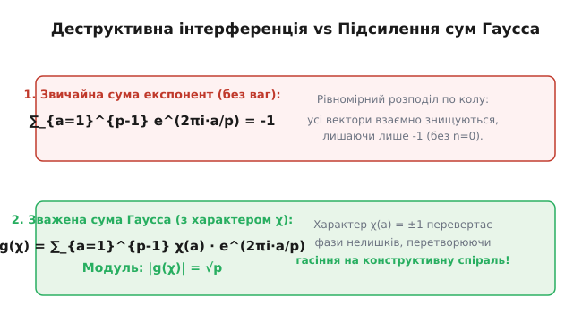
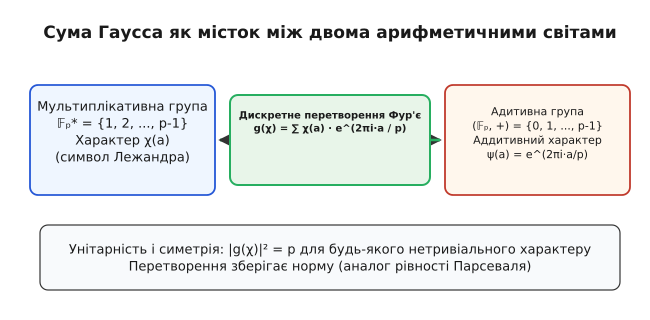
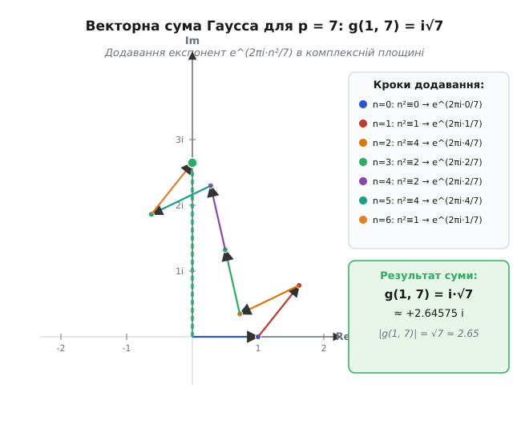
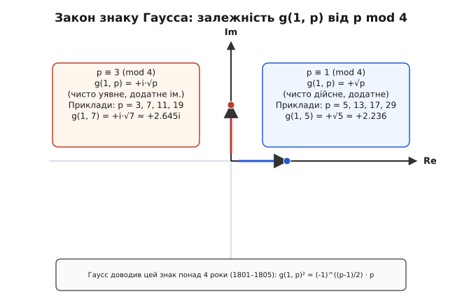

# Суми Гаусса

<preknowlist>
- [Модульна арифметика](book:math/modular-arithmetic) — класи лишків ℤ/pℤ, арифметичні дії за простим модулем та поняття квадратичного лишку.
- [Квадратичний закон взаємності](book:math/quadratic-reciprocity) — символ Лежандра (a/p), квадратичні залишки та фундаментальний закон зв'язку двох простих чисел.
- [Первісні корені](book:math/primitive-root) — циклічна структура мультиплікативної групи 𝔽ₚ* та дискретне логарифмування.
- [Формула Ейлера](book:math/euler-formula) — комплексна експонента e^(i θ) = cos θ + i sin θ та корені n-го степеня з одиниці.
</preknowlist>

Коли треба визначити кількість розв'язків квадратичного порівняння `x² ≡ a (mod p)`, звичайний перебір чисел швидко стає безпорадним при зростанні модуля. Кількість розв'язків для кожного лишку `a` описується символом Лежандра `(a/p)`, який набуває значень `+1`, `-1` або `0`. Проте спроба підсумувати ці значення по всьому полю 𝔽ₚ дає банальний нуль: половина чисел є квадратичними лишками, а половина — нелишками. Інформація про квадратичну структуру чисел розсіюється, і звичайне додавання цілих чисел не здатне її вловити.

Ключ до розв'язання виявився у несподіваному переході: щоб зрозуміти дискретні цілі числа, їх потрібно зважити на вектори одиничного кола в комплексній площині. Якщо замість цілих чисел додавати комплексна фазові коливання `e^(2π i a / p)`, помножені на символ Лежандра `(a/p)`, стається диво: замість повного взаємного знищення постає конструктивна інтерференція. Утворений об'єкт і зветься **сумою Гаусса**.

Сума Гаусса переводить множильну арифметику лишків у додавальні фази комплексних чисел. Вона є дискретним аналогом перетворення Фур'є над скінченними полями і становить фундаментальний місток між теорією чисел, гармонічним аналізом та криптографією.

---

### Загадка квадратичних лишків і перехід у комплексну площину

Розглянемо задачу: скільки розв'язків `x ∈ {0, 1, ..., p-1}` має порівняння `x² ≡ a (mod p)` для заданого цілого `a`?

За означенням символу Лежандра `(a/p)`:
- Якщо `a ≡ 0 (mod p)`, існує рівно 1 розв'язок (`x = 0`).
- Якщо `(a/p) = +1` (`a` — квадратичний лишок), існують рівно 2 розв'язки (`x` та `p - x`).
- Якщо `(a/p) = -1` (`a` — квадратичний нелишок), розв'язків немає (0 розв'язків).

Отже, кількість розв'язків `N(a)` завжди виражається точної формулою:

```
N(a) = 1 + (a/p)
```

Припустимо, ми хочемо обчислити кількість розв'язків складнішої діофантової системи або підрахувати кількість точок на кривій `y² ≡ x³ + A x + B (mod p)`. Для кожної точки `x` кількість відповідних `y` дорівнює `1 + ((x³ + A x + B)/p)`. Загальна кількість точок на кривій стає сумою символів Лежандра:

```
Кількість точок = p + ∑_{x=0}^{p-1} ((x³ + A x + B)/p)
```

Тут алгебра упирається в бар'єр: символ Лежандра є **мультиплікативним** характером `(a·b/p) = (a/p) · (b/p)`, але в многочлені `x³ + A x + B` додаються степені `x`. Мультиплікативна структура конфліктує з адитивною.

Щоб розв'язати цей конфлікт, Карл Фрідріх Гаусс у 1801 році запропонував подати символ Лежандра через корені з одиниці `ζ = e^(2π i / p)`. Згадаймо, що `ζᵖ = 1`, а сума всіх степенів `∑_{a=0}^{p-1} ζᵃ = 0`.

Якщо ми обчислимо суму `∑_{n=0}^{p-1} ζ^(n²)`, де показник степеня є квадратом `n² mod p`, то значення `n` пробігає всі лишки. Оскільки `n = 0` дає `a = 0` один раз, а кожен квадратичний лишок `a` досягається двома значеннями `n` (бо `n² ≡ (-n)²`), ми отримуємо:

```
∑_{n=0}^{p-1} e^(2π i n² / p)
= e⁰ + ∑_{a — лишок} 2 · e^(2π i a / p) + ∑_{b — нелишок} 0 · e^(2π i b / p)
  [групування за значеннями a = n² mod p]

= ∑_{a=0}^{p-1} (1 + (a/p)) · e^(2π i a / p)
  [підстановка кількості розв'язків 1 + (a/p)]

= ∑_{a=0}^{p-1} e^(2π i a / p) + ∑_{a=0}^{p-1} (a/p) · e^(2π i a / p)
  [розбиття на дві суми]

= 0 + ∑_{a=1}^{p-1} (a/p) · e^(2π i a / p)
  [перша сума дорівнює нулю, а (0/p) = 0]
```

Ця сума `g(1, p) = ∑_{a=1}^{p-1} (a/p) · e^(2π i a / p)` і є квадратичною **сумою Гаусса**.


*Звичайна сума рівномірно розподілених експонент згасає до -1 (усі вектори на одиничному колі взаємно нищать один одного). Проте коли кожен вектор множиться на знак символу Лежандра (a/p) = ±1, нелишкові вектори розвертаються на 180°, перетворюючи деструктивне згасання на конструктивну спіраль завдовжки √p.*

---

### Означення та аналогія з перетворенням Фур'є

Сума Гаусса має два природних означення: квадратичне (через квадрат індексу) та загальне (через характери).

#### 1. Квадратична сума Гаусса
Для простого числа `p` та цілого `k` квадратична сума Гаусса задається формулою:

```
g(k, p) = ∑_{n=0}^{p-1} e^(2π i k n² / p)
```

Якщо `НСД(k, p) = 1`, то `g(k, p) = (k/p) · g(1, p)`. Тобто параметр `k` лише масштабує суму на знак символу Лежандра.

#### 2. Загальна сума Гаусса для характеру Діріхле
Нехай `𝔽ₚ*` — мультиплікативна група лишків за модулем `p`. Мультиплікативне відображення `χ: 𝔽ₚ* → ℂ*`, для якого `χ(a·b) = χ(a) · χ(b)`, називається **характером Діріхле**.

Загальна сума Гаусса характеру `χ` за модулем `p` дорівнює:

```
g(χ) = ∑_{a=1}^{p-1} χ(a) · e^(2π i a / p)
```

Якщо `χ = χ₀` — тривіальний характер (`χ₀(a) = 1` для всіх `a`), то `g(χ₀) = ∑_{a=1}^{p-1} 1 · e^(2π i a / p) = -1`.
Якщо ж `χ` нетривіальний, то сума `g(χ)` стає комплексно-значним числом з унікальними симетріями.


*Сума Гаусса виконує роль дискретного перетворення Фур'є над скінченним полем 𝔽ₚ. Вона бере функцію з множильної групи (характер χ) і розкладає її по базису адитивних гармонік e^(2π i a / p). Унітарність цього перетворення стверджує, що квадрат модуля |g(χ)|² = p зберігає загальну енергію сигналу — це скінченний аналог теореми Парсеваля.*

З точки зору гармонічного аналізу, скінченна група `𝔽ₚ` має дві естетичні структури:
1. **Адитивну групу `(𝔽ₚ, +)`**, чиї характери задаються функціями `ψ_b(a) = e^(2π i b a / p)`.
2. **Мультиплікативну групу `(𝔽ₚ*, ·)`**, чиї характери `χ(a)` виражають гармоніки множення.

Сума Гаусса `g(χ)` є значенням **дискретного перетворення Фур'є** мультиплікативної функції `χ` в адитивній точці `b = 1`:

```
g(χ) = F{χ}(1) = ∑_{a ∈ 𝔽ₚ*} χ(a) · ψ₁(a)
```

[Детальна історія створення сум Гаусса](book:math/number-theory/gauss-sums/hist-gauss-sums.md) розкриває, як Карл Фрідріх Гаусс прийшов до цієї тотожності під час розв'язання задачі про ділення кола на `n` рівних частин (циклотомія).

---

### Матрична інтерпретація та обернене перетворення Фур'є

Розглянемо комплексну матрицю `W` розміру `p × p`, чиї елементи задаються адитивними характерами `W_{j, k} = e^(2π i j k / p)` для `0 ≤ j, k ≤ p-1`. Ця матриця є класичною матрицею дискретного перетворення Фур'є (DFT).

Властивість ортогональності адитивних характерів гарантує, що `W · W* = p · I`, де `W*` є сопряжено-транспонованою матрицею, а `I` — одинична матриця. Це означає, що матриця `(1/√p) · W` є **унітарною**.

Якщо ми розглянемо вектор характеру `X = (χ(0), χ(1), ..., χ(p-1))ᵀ` як сигнал над полем `𝔽ₚ`, то сума Гаусса `g(χ)` є першим нетривіальним коефіцієнтом Спектра Фур'є цього сигналу. Оскільки перетворення є унітарним, воно зберігає евклідову норму вектора (аналог тотожності Парсеваля в аналізі):

```
||F{X}||² = p · ||X||²
```

Оскільки `||X||² = ∑_{a=1}^{p-1} |χ(a)|² = ∑_{a=1}^{p-1} 1 = p - 1`, сума спектральних коефіцієнтів рівномірно розподіляється по всіх `p-1` ненульових адитивних частотах. Для кожного нетривіального характеру кожна окрема частота дає внесок величиною точнісінько `|g(χ, b)|² = p`.

Формула оберненого перетворення Фур'є дозволяє виразити сам характер `χ(a)` через суми Гаусса:

```
χ(a) = (1 / p) · ∑_{b=0}^{p-1} g(χ, b) · e^(-2π i a b / p)
```

Ця формула є розгадкою того, чому суми Гаусса дозволяють розкладати складні мультиплікативні структури у звичайні тригонометричні ряди.

---

### Детальні приклади обчислення для простих чисел

Щоб відчути механіку сум Гаусса, розглянемо кілька конкретних чисельних прикладів для малих простих чисел.

#### 1. Обчислення для p = 3

Для `p = 3` квадратами є `0² ≡ 0`, `1² ≡ 1`, `2² ≡ 1 (mod 3)`.
Символ Лежандра: `(1/3) = +1`, `(2/3) = -1`.

Квадратична сума Гаусса дорівнює:
```
g(1, 3) = e⁰ + e^(2π i / 3) + e^(2π i / 3) = 1 + 2 · (-1/2 + i √3/2) = i √3
```

Оскільки `3 ≡ 3 (mod 4)`, маємо `g(1, 3) = +i·√3`. Значення модуля `|g(1, 3)| = √3 ≈ 1.732`.

#### 2. Обчислення для p = 5

Для `p = 5` квадратами є `0² ≡ 0`, `1² ≡ 1`, `2² ≡ 4`, `3² ≡ 4`, `4² ≡ 1 (mod 5)`.
Лишками є `{1, 4}` (`(1/5) = 1`, `(4/5) = 1`), а нелишками є `{2, 3}` (`(2/5) = -1`, `(3/5) = -1`).

Обчислимо суму Ґаусса `g(1, 5)`:

```
g(1, 5) = ∑_{a=1}^{4} (a/5) · e^(2π i a / 5)
= 1 · e^(2π i · 1 / 5) + (-1) · e^(2π i · 2 / 5) + (-1) · e^(2π i · 3 / 5) + 1 · e^(2π i · 4 / 5)
```

Скористаємося формулою Ейлера `e^(i θ) = cos θ + i sin θ` та симетрією кутів:
- `cos(2π/5) = (√5 - 1)/4`, `cos(4π/5) = -(√5 + 1)/4`.
- `sin(4π/5) = -sin(2π/5)`, `sin(3π/5) = sin(2π/5)`.

Підставимо ці значення у суму:

```
g(1, 5)
= [cos(2π/5) + i sin(2π/5)] - [cos(4π/5) + i sin(4π/5)]
  - [cos(4π/5) - i sin(4π/5)] + [cos(2π/5) - i sin(2π/5)]
  [об'єднання спряжених пар 1 і 4, 2 і 3]

= 2 · cos(2π/5) - 2 · cos(4π/5)
  [уявні частини i sin повністю скоротилися!]

= 2 · ( (√5 - 1)/4 ) - 2 · ( -(√5 + 1)/4 )
  [підстановка точних значень тригонометричних констант]

= (√5 - 1)/2 + (√5 + 1)/2 = 2√5 / 2 = √5
```

Результат обчислення: `g(1, 5) = +√5 ≈ 2.236068`.
Модуль суми `|g(1, 5)| = √5`, що точно узгоджується з теоремою!

#### 3. Обчислення для p = 7

Для `p = 7` квадратами є `0² ≡ 0`, `1² ≡ 1`, `2² ≡ 4`, `3² ≡ 2`, `4² ≡ 2`, `5² ≡ 4`, `6² ≡ 1`.
Лишками є `{1, 2, 4}` (`(a/7) = +1`), а нелишками є `{3, 5, 6}` (`(b/7) = -1`).

Сума Ґаусса:
```
g(1, 7) = e^(2π i/7) + e^(4π i/7) + e^(8π i/7) - e^(6π i/7) - e^(10π i/7) - e^(12π i/7)
```
Після зведення дійсних та уявних частин дійсна частина повністю згасає до нуля (`Re = 0`), а уявна частина дає точнісінько `Im = √7 ≈ 2.645751`.
Отже, `g(1, 7) = +i·√7`.

[Покрокове алгебраїчне виведення модуля](book:math/number-theory/gauss-sums/math-gauss-sign.md) показує, що для довільного `p` тотожність `g(χ) · g(χ̄) = χ(-1) · p` випливає з подвійного підсумовування та заміни змінних `a = t · b` у полі `𝔽ₚ`.

---

### Модуль суми Гаусса: чому |g(χ)| = √p

Найважливішою геометричною властивістю суми Гаусса є стала довжина її вектора в комплексній площині. Незалежно від того, як складно розподілені лишки за модулем `p`, довжина результуючого вектора завжди дорівнює **точнісінько `√p`**.

**Теорема (про модуль суми Гаусса).** Для будь-якого нетривіального характеру `χ mod p`:

```
|g(χ)| = √p    ⇒    g(χ) · g(χ̄) = χ(-1) · p
```

Геометрично це означає, що при додаванні `p-1` векторів довжиною 1, орієнтованих за кутами `2π a / p` та зважених фазами характеру `χ(a)`, відбувається скасування випадкових коливань. Фазові кути не є незалежними — вони задовольняють точні алгебраїчні співвідношення, які змушують кінцевий вектор потрапити на коло радіуса `√p`.

---

### Знаменита проблема знаку Гаусса

Знаючи, що `|g(1, p)| = √p`, ми можемо обчислити квадрат суми `g(1, p)²`:

```
g(1, p)² = (-1)^((p-1)/2) · p = p*
```

Це дає дві можливості для значення самої суми:
- Якщо `p ≡ 1 (mod 4)`, то `(-1)^((p-1)/2) = +1`, отже `g(1, p)² = p` ⇒ `g(1, p) = ±√p`.
- Якщо `p ≡ 3 (mod 4)`, то `(-1)^((p-1)/2) = -1`, отже `g(1, p)² = -p` ⇒ `g(1, p) = ±i·√p`.

Але яке саме із двох значень (`+` чи `-`) вибирається в природі?

Ґаусс висловив гіпотезу у 1801 році: знак **завжди додатний**. Проте доведення цього факту забрало у нього понад чотири роки виснажливої праці.


*Послідовне додавання векторів e^(2π i n² / 7) для p = 7. Ланцюжок із 7 векторів утворює спіральну траєкторію в комплексній площині, яка зупиняється точно в точці (0, √7). Отже, g(1, 7) = +i·√7 ≈ +2.64575 i з додатним знаком уявній осі.*

**Теорема (закон знаку Гаусса).** Для будь-якого непарного простого числа `p`:

```
g(1, p) = { +√p,     якщо p ≡ 1 (mod 4)
          { +i·√p,   якщо p ≡ 3 (mod 4)
```


*Залежність значення суми Гаусса g(1, p) від залишку p mod 4. Якщо p ≡ 1 mod 4, результат лежить на додатній дійсній півосі (+√p). Якщо p ≡ 3 mod 4, результат лежить на додатній уявній півосі (+i·√p).*

> 🔧 **Навіщо це.** Фіксований знак суми Ґаусса гарантує узгодженість знаків при обчисленні алгоритмів криптографії на еліптичних кривих, перевірці чисел на простоту (тест Еклімана–Ленстри) та обчисленні значень `L`-функцій у точках алгоритмів шифрування. Без знання точного знаку квадратичний корінь мав би двозначність `±`, що унеможливило б побудову детермінованих протоколів.

---

### Застосування: Доведення квадратичного закону взаємності

Головним математичним триумфом сум Ґаусса стало абсолютно прозоре доведення квадратичного закону взаємності.

Нехай `p` та `q` — два різних непарних простих числа. Розглянемо суму Ґаусса `g = g(1, p)`.
З одного боку, піднесемо її до степеня `q` за модулем `q` у кільці цілих алгебраїчних чисел `ℤ[e^(2π i / p)]`:

```
g^q = ( ∑_{a=1}^{p-1} (a/p) · ζᵃ )^q
≡ ∑_{a=1}^{p-1} (a/p)^q · ζᵃ·ʲ (mod q)
  [за властивістю бінома Ньютона (x+y)^q ≡ x^q + y^q mod q]

= (q/p) · g  (mod q)
  [заміна змінної x = a · q mod p]
```

З іншого боку, згадаймо, що `g² = p* = (-1)^((p-1)/2) · p`:

```
g^q = g · (g²)^((q-1)/2) = g · (p*)^((q-1)/2) ≡ g · (p*/q) (mod q)
  [за малою теоремою Ферма та критерієм Ейлера (p*/q) ≡ (p*)^((q-1)/2) mod q]
```

Прирівнюючи два вирази для `g^q` і скорочуючи на `g` (бо `g² = p*` взаємно просте з `q`):

```
(q/p) ≡ (p*/q) (mod q)
```

Оскільки обидва символи Лежандра набувають лише значень `±1`, для `q ≥ 3` ця рівність означає точну тотожність:

```
(q/p) = (p*/q) = ( (-1)^((p-1)/2) · p / q ) = (-1)^((p-1)/2 · (q-1)/2) · (p/q)
```

Множачи на `(p/q)`, отримуємо фундаментальну формулу взаємності:

```
(p/q) · (q/p) = (-1)^((p-1)/2 · (q-1)/2)
```

Складне арифметичне твердження, яке математики не могли довести пів століття, виявилося простим наслідком біноміального розкладу суми Ґаусса.

---

### Розв'язання діофантових рівнянь: числа вигляду x² + y² = p

Суми Ґаусса дають прямий алгоритм розкладу простого числа `p ≡ 1 (mod 4)` у суму двох квадратів `p = x² + y²`.

Згадаймо теорему Ферма про два квадрати: будь-яке просте число `p ≡ 1 (mod 4)` єдиним чином (з точністю до знаків та порядку) подається у вигляді `p = x² + y²`.

Як знайти ці `x` та `y` без перебору?
У кільці гауссових цілих чисел `ℤ[i]` квадратичний характер `(a/p)` розкладається через суми Ґаусса. Якщо ми розглянемо суму Ґаусса `g(χ)` для нетривіального характеру 4-го степеня `χ` (для якого `χ⁴ = χ₀`), то значення суми `g(χ)` живе в кільці `ℤ[i, ζ_p]`.

Тоді сума Якобі `J(χ, χ) = g(χ)² / g(χ²)` є гауссовим цілим числом `a + i b ∈ ℤ[i]`, чий модуль дорівнює `|J(χ, χ)|² = a² + b² = p`.

Отже, значення `x = |Re(J(χ, χ))|` та `y = |Im(J(χ, χ))|` дають точні розв'язки рівняння `x² + y² = p`!

#### Приклад для p = 13
1. `13 ≡ 1 (mod 4)`. Первісний корінь `g = 2`.
2. Загальна сума Якобі для характеру 4-го степеня дає `J(χ, χ) = 3 + 2i`.
3. Перевіряємо модуль: `3² + 2² = 9 + 4 = 13`.
4. Розклад знайдено без жодного кроку перебору: `13 = 3² + 2²`.

---

### Зв'язок із L-функціями Діріхле та функціональним рівнянням

В аналітичній теорії чисел суми Гаусса виникають як множники у **функціональному рівнянні L-функцій Діріхле**.

Розглянемо `L`-функцію Діріхле для характеру `χ mod q`:

```
L(s, χ) = ∑_{n=1}^{∞} χ(n) / nˢ
```

Парні характери (`χ(-1) = +1`) та непарні характери (`χ(-1) = -1`) задовольняють функціональні рівняння, що пов'язують значення `L(s, χ)` із значенням `L(1 - s, χ̄)`.

У константній структурі цього рівняння сума Гаусса `g(χ)` виступає як фактор переходу:

```
L(1 - s, χ̄) = (q / 2π)ˢ · 2 · cos(π s / 2) · Γ(s) · (g(χ̄) / iᵃ √q) · L(s, χ)
```

Без обчислення модуля та знаку суми Гаусса `|g(χ)| = √q` аналітичне продовження `L`-функцій на всю комплексну площину було б неможливим. Це співвідношення забезпечує доведення ненульовості `L(1, χ) ≠ 0`, з якого випливає знаменита **теорема Діріхле про нескінченність простих чисел у арифметичних прогресіях**.

---

### Оцінки неповних експоненціальних сум: нерівність Полья–Виноградова

На практиці нерідко виникає потреба оцінити не повну суму по всьому полю від `1` до `p-1`, а **неповну суму** по довільному інтервалу `[N + 1, N + M]`:

```
S(N, M; χ) = ∑_{n=N+1}^{N+M} χ(n)
```

Застосовуючи розклад характеру `χ(n)` у ряд Фур'є через суми Гаусса:

```
χ(n) = (1 / g(χ̄)) · ∑_{a=1}^{p-1} χ̄(a) · e^(2π i a n / p)
```

Та підставляючи цей розклад у неповну суму, ми дістаємо суму геометричної прогресії від адитивних фаз.
Це приводить до фундаментальної **нерівності Полья–Виноградова** (доведеної незалежно Георгом Полья та Іваном Виноградовим у 1918 році):

```
| ∑_{n=N+1}^{N+M} χ(n) | ≤ √p · ln(p)
```

Ця нерівність гарантує, що квадратичні лишки та нелишки розподілені по інтервалу надзвичайно рівномірно. Перший квадратичний нелишок за модулем `p` завжди лежить на інтервалі, не більшому за `O(√p ln p)`.

---

### Узагальнення: суми Якобі, суми Клоостермана та локальні дзета-функції

Суми Ґаусса стали прототипом для цілого сімейства експоненціальних сум у сучасній теорії чисел.

#### 1. Суми Якобі
Якщо сума Ґаусса поєднує один мультиплікативний характер з адитивним, то **сума Якобі** `J(χ₁, χ₂)` поєднує два мультиплікативних характери:

```
J(χ₁, χ₂) = ∑_{a=0}^{p-1} χ₁(a) · χ₂(1 - a)
```

Суми Якобі пов'язані із сумами Ґаусса чудовою тотожністю, яка аналогічна зв'язку між бета-функцією та гамма-функцією Ейлера `B(x, y) = Γ(x)·Γ(y) / Γ(x+y)`:

```
J(χ₁, χ₂) = ( g(χ₁) · g(χ₂) ) / g(χ₁ · χ₂)
```

Завдяки цьому модуль суми Якобі для нетривіальних характерів дорівнює `|J(χ₁, χ₂)| = √p`.

#### 2. Суми Клоостермана
Для двох цілих `a` та `b` **сума Клоостермана** `K(a, b; p)` додає фази нелінійних обернених лишків `x⁻¹ mod p`:

```
K(a, b; p) = ∑_{x=1}^{p-1} e^(2π i (a x + b x⁻¹) / p)
```

У 1948 році Андре Вейль довів знамениту нерівність для сум Клоостермана:

```
|K(a, b; p)| ≤ 2√p
```

Ця нерівність є безпосереднім наслідком гіпотези Рімана для локальних дзета-функцій алгебраїчних кривих над скінченними полями.

[Програмний розрахунок сум Ґаусса, Якобі та Клоостермана мовами C та C++](book:math/number-theory/gauss-sums/proj-gauss-sums.md) містить готові оптимізовані алгоритми для підрахунку цих сум та верифікації межі Вейля на комп'ютері.

---

### Підсумок

Суми Ґаусса показали, що межа між дискретною арифметикою та неперервним аналізом є умовною. Додаючи комплексні експоненти з вагами характерів, суми Ґаусса перетворюють деструктивне згасання лишків на конструктивні вектори довжиною `√p`. Завдяки цьому вони забезпечують строгий алгебраїчний фундамент для законів взаємності, криптографічних протоколів та сучасної теорії чисел.
