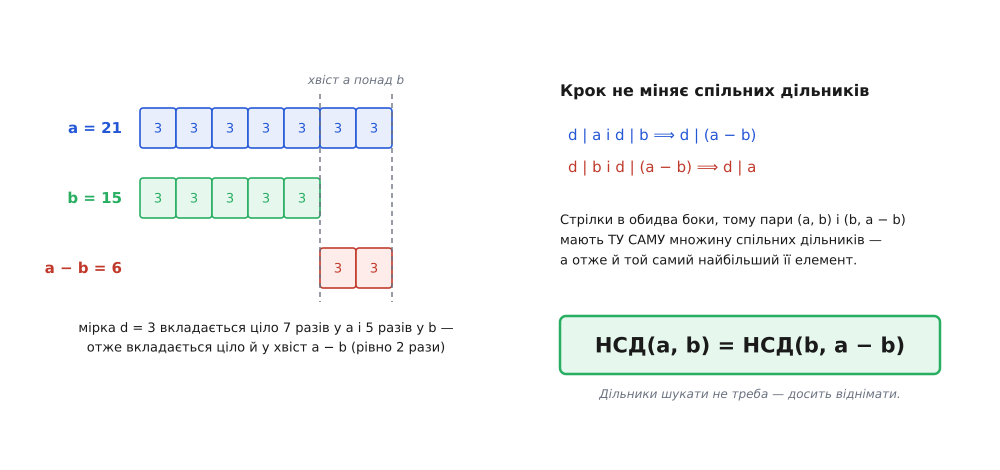
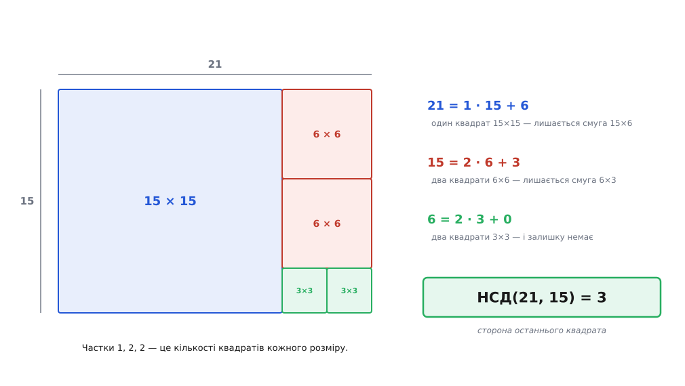
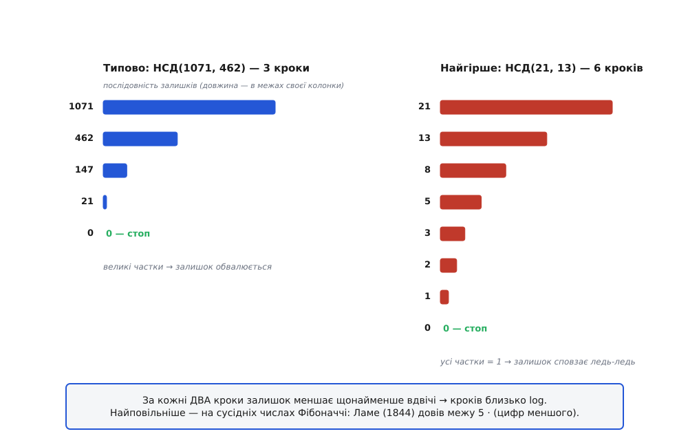

# НСД і алгоритм Евкліда

<preknowlist>
- [Модульна арифметика](book:math/modular-arithmetic) — що таке залишок від ділення й що означає запис `a mod m`.
- [Прості числа й основна теорема арифметики](book:math/prime-numbers) — кожне ціле число єдиним способом розкладається в добуток простих множників.
</preknowlist>

Уявіть прямокутну ділянку 21 на 15 метрів, яку треба вимостити однаковими квадратними плитками — без жодного підрізання. Плитка 1×1 підійде, звісно, але класти триста дрібних квадратиків нікому не хочеться. Питання цілком практичне: **яка найбільша плитка ще ляже рівно?**

Умова «ляже рівно» одразу перекладається на арифметику. Якщо сторона плитки — *d*, то вздовж довгої сторони має вміститися ціле число плиток, тобто *d* мусить ділити 21 націло; вздовж короткої — так само ділити 15. Отже *d* — **спільний дільник** обох чисел. Дільники 21: 1, 3, 7, 21. Дільники 15: 1, 3, 5, 15. Спільні лише 1 і 3, найбільший — **3**.

Це число й називають **найбільшим спільним дільником** (НСД). Евклід казав інакше й точніше — «найбільша спільна міра» (гр. μέγιστον κοινὸν μέτρον): найдовша мірка, якою можна відміряти обидві величини без залишку. Це не поетичний зворот, а буквальний опис задачі: у «Началах» числа були відрізками, а НСД — відрізком, що вкладається ціло і в один, і в другий.

### Очевидний спосіб — і чому він глухий кут

Раз НСД зібраний зі спільних дільників, знайти його, здавалося б, просто: розкласти обидва числа на прості множники й забрати спільне.

**Скоротити дріб 1071/462.**
```
1071 = 3 · 3 · 7 · 17  =  3² · 7 · 17
 462 = 2 · 3 · 7 · 11

спільні прості:  3  (у меншому зі степенів: 3¹)
                 7  (у меншому зі степенів: 7¹)

НСД(1071, 462) = 3 · 7 = 21
1071 / 21 = 51,   462 / 21 = 22   →   1071/462 = 51/22
```

Цей спосіб не просто працює — він пояснює, **чому НСД узагалі існує й чому він один**. Кожне число має єдиний розклад на прості. Спільний дільник — це той, чиї прості всі знайшлися в обох розкладах і не частіше, ніж вони там стоять. Отже найбільший з них — добуток спільних простих, кожен у меншому зі степенів. Свободи вибору немає: відповідь визначена однозначно.

Біда деінде. Уся ця процедура спирається на розклад на прості — а розкладати ми **не вміємо швидко**. Для 1071 вистачає поділити на 2, 3, 5, 7 і за кілька спроб дійти до кінця. Для числа на дві сотні цифр перебір дільників — це більше кроків, ніж атомів у видимому Всесвіті, і жодного суттєво кращого методу людство досі не знає. На цій самій складності, до речі, тримається [криптографія з відкритим ключем](book:communications/public-key-crypto): відкритий ключ RSA — це добуток двох великих простих, і вся стійкість тримається на тому, що назад його розкласти ніхто не встигне.

Виходить парадоксальне питання: **чи можна знайти найбільший спільний дільник, не знайшовши жодного дільника взагалі?** Звучить як безглуздя. Але саме це й робить алгоритм Евкліда.

### Крок, що нічого не псує

Візьмімо пару (*a*, *b*), де a > b. Дивитися будемо не на самі числа, а на **множину їхніх спільних дільників** — бо саме з неї беруть найбільший елемент.

Нехай *d* ділить і *a*, і *b*. Тоді a = d·k і b = d·m для якихось цілих *k*, *m*. Звідси a − b = d·(k − m) — знову ціле число мірок *d*. Отже **d ділить і різницю** a − b. І навпаки: якщо *d* ділить *b* і ділить (a − b), то він ділить і їхню суму b + (a − b) = a.

Стрілка йде в обидва боки — і це набагато сильніше, ніж здається на перший погляд. Це означає, що пара (a, b) і пара (b, a − b) мають **ту саму множину спільних дільників**, елемент в елемент. А коли множини однакові, то й найбільший елемент у них однаковий:

```
НСД(a, b) = НСД(b, a − b)     для a > b
```


*Ліворуч — та сама думка мовою мірок: якщо d вкладається ціло в a (сім разів) і в b (п'ять разів), то хвіст, що стирчить понад b, теж складається з цілих мірок — рівно з двох. Праворуч — вона ж мовою подільності. Оскільки стрілка йде в обидва боки, множини спільних дільників у пар (a, b) і (b, a − b) збігаються повністю, а не частково. Тому й найбільший їхній елемент той самий.*

Ось у чому фокус: ми **зменшили числа, не втративши відповіді**. Про дільники при цьому не дізналися нічого — ми лише пересунулися до легшої пари з тією самою відповіддю. Лишається повторювати, доки пара не стане такою, що відповідь видно неозброєним оком.

### Від віднімання до ділення

Віднімання правильне, але повільне. Для пари (1000000, 3) довелося б відняти трійку понад триста тисяч разів, перш ніж станеться щось цікаве. Та всі ці віднімання роблять одне й те саме: зрізають з *a* по *b*, доки не лишиться щось менше за *b*. А «скільки разів *b* уміщується в *a* і що лишається» — це рівно **ділення із залишком**:

```
a = q · b + r,    де 0 ≤ r < b
```

Частка *q* — це кількість віднімань, які ми пропустили одним махом; *r* — те, що лишилося б після них усіх. Правило набуває робочої форми:

```
НСД(a, b) = НСД(b, a mod b)
```

Тепер видно й **чому це колись закінчиться**. Залишок за самим означенням строго менший за дільник: 0 ≤ r < b. Отже на кожному кроці друге число пари строго меншає, лишаючись невід'ємним цілим. Спадна послідовність невід'ємних цілих не може тривати вічно — вона мусить упертися в нуль. Саме так доводять зупинку будь-якого циклу: знаходять [варіант циклу](book:algorithms/loop-variant) — величину, що строго меншає й обмежена знизу.

А коли *r* = 0, задача розв'язана без жодних зусиль: *b* ділить *a* націло, тож *b* — спільний дільник, і дільника, більшого за себе, у *b* бути не може. Отже НСД(b, 0) = b. Алгоритм не «збігається наближено» — він **точно попадає у відповідь** і спиняється.

**Знайти НСД(1071, 462).**
```
1071 = 2 · 462 + 147        (1071 mod 462 = 147)
 462 = 3 · 147 +  21        ( 462 mod 147 =  21)
 147 = 7 ·  21 +   0        ( 147 mod  21 =   0)  ← залишок нуль

НСД(1071, 462) = 21         останній ненульовий залишок
```

Три ділення проти розкладу на прості. Але головне не в економії, а в тому, що **в цих трьох рядках ніде не згадано ні 3, ні 7, ні 17**. Алгоритм видав 21, так і не дізнавшись, з чого 21 складається.

А цей самий підрахунок і є задачею про плитку, з якої ми почали.


*Кожен рядок ділення — це «відрізали від прямокутника найбільший квадрат, що туди влазить, стільки разів, скільки він уліз». Частка — кількість квадратів, залишок — прямокутник, який лишився. Коли черговий квадрат лягає без залишку, його сторона й є НСД: 3. Плитка 3×3 замостить і смуги 6×3, і квадрати 6×6, і великий квадрат 15×15 — тобто всю ділянку.*

Тут і видно, чому це працює без згадки про дільники. Плитка, що замостить увесь прямокутник, замостить і будь-який відрізаний від нього квадрат, і те, що лишилося. Тож на кожному кроці ми викидаємо шматок, який гарантовано «сумісний» із будь-якою правильною відповіддю, — і питання щоразу ставимо до меншої фігури.

> 🔧 **Навіщо це.** НСД — не музейний експонат. Кожен раз, коли програма зводить дріб до нескоротного вигляду, вона ділить чисельник і знаменник на їхній НСД: без цього точна арифметика над раціональними числами за десяток дій розпухає до чисел на сотні розрядів. Веб-код зводить 1920×1080 до «16:9» тим самим діленням на НСД = 120. Пересемплювання звуку з 44100 на 48000 Гц вимагає відношення в нескоротному вигляді — 147:160 (обидва поділені на НСД = 300), і саме ці числа задають довжину фільтра. Скрізь тут розкласти числа на прості було б і повільніше, і зайве.

### Чому кроків так мало

Зупинку ми довели. Але «зупиниться колись» і «зупиниться швидко» — різні обіцянки. Виявляється, кроків до смішного мало, і причина цілком елементарна.

Позначмо послідовність залишків r₀ = a, r₁ = b, r₂, r₃, … Твердження: **за кожні два кроки залишок меншає щонайменше вдвічі**, тобто r₍ₖ₊₂₎ < rₖ / 2. Випадків усього два, третього немає:

```
Якщо r₍ₖ₊₁₎ ≤ rₖ/2:   r₍ₖ₊₂₎ < r₍ₖ₊₁₎ ≤ rₖ/2
                       (залишок завжди менший за те, на що ділили)

Якщо r₍ₖ₊₁₎ > rₖ/2:   r₍ₖ₊₁₎ уміщується в rₖ рівно один раз, тому
                       r₍ₖ₊₂₎ = rₖ − r₍ₖ₊₁₎ < rₖ − rₖ/2 = rₖ/2
```

Обидві дороги ведуть в одне місце. А величина, що ділиться навпіл кожні два кроки, доходить від *b* до нуля десь за 2·log₂ b кроків. Для 462 це щонайбільше двадцять кроків — а насправді вистачило трьох. Для числа на тисячу двійкових розрядів — пара тисяч ділень, тобто мікросекунди роботи процесора.

Найповільніший випадок ховається просто в цьому доведенні. Алгоритм гальмує тоді, коли **всі частки дорівнюють одиниці**: кожен крок зрізає рівно одне *b*, менше зрізати неможливо. Але умова rₖ = r₍ₖ₊₁₎ + r₍ₖ₊₂₎ — це рівно правило, за яким будують [числа Фібоначчі](book:math/fibonacci-numbers), де кожне наступне дорівнює сумі двох попередніх. Отже найгірша пара для алгоритму Евкліда — це пара **сусідніх чисел Фібоначчі**.

**Найгірший випадок: НСД(21, 13).**
```
21 = 1 · 13 + 8
13 = 1 ·  8 + 5
 8 = 1 ·  5 + 3
 5 = 1 ·  3 + 2
 3 = 1 ·  2 + 1
 2 = 2 ·  1 + 0

НСД(21, 13) = 1  —  шість кроків на числах, менших за сотню
```


*Ліворуч частки великі (2, 3, 7) — залишок падає стрибками: 462 → 147 → 21 → 0. Праворуч усі частки дорівнюють одиниці, тож кожен наступний залишок лише трохи менший за попередній — числа в десятки разів менші, а кроків удвічі більше. Це і є найгірший вхід: на сусідніх числах Фібоначчі алгоритм зрізає мінімум із можливого.*

1844 року француз Габріель Ламе (Gabriel Lamé, 1795–1870) перетворив це спостереження на точну межу: **кроків ніколи не більше, ніж п'ять разів по кількості десяткових цифр меншого числа**. Для 13 — дві цифри, межа десять, вийшло шість. Звідки взялася саме п'ятірка, теж видно з Фібоначчі: сусідні числа Фібоначчі відносяться приблизно як золотий перетин φ ≈ 1.618, тобто кожен крок зменшує число в φ разів, а один десятковий розряд «з'їдається» за log_φ 10 ≈ 4.785 кроки. Округливши вгору, маємо п'ять.

Роботу Ламе часто називають першим строгим аналізом швидкодії алгоритму — тобто самим початком того, що згодом стало теорією складності. Суть оцінки проста: **кількість кроків росте не з розміром чисел, а з кількістю їхніх цифр**. Саме тому процедура, записана за три століття до нашої ери, і досі стоїть у гарячих місцях сучасного коду без жодних поправок.

### У коді

Записати алгоритм — три рядки: уся змістовна робота вже зроблена. Лишилося крутити пару, доки друге число не стане нулем, і повернути перше.

:::tabs
```cpp
#include <cstdint>
#include <numeric>   // std::gcd — від C++17

std::int64_t gcd(std::int64_t a, std::int64_t b) {
    while (b != 0) {
        std::int64_t r = a % b;
        a = b;
        b = r;
    }
    return a < 0 ? -a : a;      // НСД завжди невід'ємний
}

// gcd(1071, 462) → 21
// У бойовому коді пишуть просто std::gcd(1071, 462).
```
```py
def gcd(a: int, b: int) -> int:
    """НСД за алгоритмом Евкліда."""
    while b:
        a, b = b, a % b
    return abs(a)

# gcd(1071, 462) → 21
# У бойовому коді: math.gcd(1071, 462).
# Python рахує в довгій арифметиці — той самий код бере числа на тисячу цифр.
```
```ts
function gcd(a: number, b: number): number {
  a = Math.abs(a);
  b = Math.abs(b);
  while (b !== 0) {
    [a, b] = [b, a % b];
  }
  return a;
}

// Класика фронтенду — звести співвідношення сторін до нескоротного:
const g = gcd(1920, 1080);          // 120
const ratio = `${1920 / g}:${1080 / g}`;   // "16:9"
```
:::

Цикл усюди той самий — різниця лише в тому, що мова вважає цілим числом. C++ обмежений розрядністю типу й мовчки переповниться. Python рахує в довгій арифметиці, тож стелі не має. JavaScript тримає числа як float64: понад 2⁵³ вони перестають бути точними цілими, і там потрібен `BigInt`. Ці й інші практичні деталі — рекурсивна форма, двійковий НСД, що обходиться зсувами замість ділень, НСД масиву чисел, пастка переповнення в НСК — розібрані окремо в [НСД у коді](book:math/gcd-euclidean/proj-gcd-code.md).

### Що з цього виростає

**Взаємно прості числа.** Коли НСД(a, b) = 1, спільних дільників, крім одиниці, немає зовсім — такі числа звуть **взаємно простими**. Простими самі по собі вони бути не мусять: 21 і 22 взаємно прості, хоч обидва складені. Приклад із Фібоначчі це вже показав — 21 і 13 дали НСД 1. Взаємна простота — умова, від якої залежать цілі теореми: [китайська теорема про залишки](book:math/chinese-remainder-theorem) склеює залишки за кількома модулями в один, лише коли ті модулі попарно взаємно прості, а [функція Ейлера](book:math/euler-totient) якраз і лічить, скільки чисел від 1 до *n* взаємно прості з *n*.

**Найменше спільне кратне.** НСД має дзеркального двійника — [НСК](book:math/lcm), найменше число, що ділиться на обидва. Зв'язок між ними прямий:

```
НСД(a, b) · НСК(a, b) = a · b
```

Причину видно з розкладу на прості: НСД бере кожен простий у **меншому** зі степенів, НСК — у **більшому**, а менший плюс більший — це просто сума обох степенів, тобто добуток a·b. Тому НСК рахують через НСД, але ділити треба **до** множення — `a / НСД(a,b) * b`, — інакше проміжний добуток a·b може переповнити тип раніше, ніж дійде до ділення.

**Тотожність Безу.** Алгоритм дає більше, ніж у нього просили. Якщо не викидати частки, а пройти ланцюжок ділень назад, кожен залишок вдається виразити через початкові числа:

```
147 = 1071 − 2 · 462
 21 = 462 − 3 · 147
    = 462 − 3 · (1071 − 2 · 462)
    = 1071 · (−3) + 462 · 7

перевірка:  −3213 + 3234 = 21 ✓
```

І це не збіг: НСД **завжди** подається у вигляді a·x + b·y з цілими *x*, *y* — ба більше, це найменше додатне число, яке взагалі можна зібрати з *a* і *b* самими додаваннями та відніманнями. Твердження знають як тотожність Безу, хоч ім'я тут, як часто буває, приліпилося не до того, хто її довів. Систематичний спосіб добути ці коефіцієнти дорогою вниз, а не назад, зветься розширеним алгоритмом Евкліда; його виведення, формули для коефіцієнтів і те, як з них дістають обернене за модулем, — у вставці [Розширений алгоритм і тотожність Безу](book:math/gcd-euclidean/math-bezout.md).

> 🔧 **Навіщо це.** Саме тотожність Безу робить НСД інструментом криптографії. Якщо НСД(a, m) = 1, то знайдуться такі *x*, *y*, що a·x + m·y = 1. Візьміть це за модулем *m*: доданок m·y зникає, лишається a·x ≡ 1 (mod m) — тобто *x* є **оберненим до a за модулем m**. Обернення за модулем — не екзотика, а щоденна дія: у RSA секретний показник обчислюють як обернений до відкритого за модулем φ(n), і рахують його саме розширеним Евклідом. Мільярди рукостискань TLS щодня проходять через процедуру з «Начал».

**Діофантові рівняння.** Той самий факт відповідає, коли рівняння a·x + b·y = c має розв'язок у цілих числах. Оскільки будь-яка комбінація a·x + b·y кратна НСД(a, b), а сам НСД досяжний, розв'язок є **тоді й лише тоді, коли c ділиться на НСД(a, b)**. Тобто питання про цілі розв'язки цілого класу рівнянь — [лінійних діофантових](book:math/linear-diophantine) — упирається в одне число, яке алгоритм Евкліда видає за кілька ділень.

### Звідки це взялося

Алгоритм записаний у «Началах» Евкліда (близько 300 р. до н. е.) — твердження 1 і 2 сьомої книги, а для відрізків несумірної довжини ще й у десятій. Але Евклід його радше **зібрав, ніж винайшов**: греки називали цю процедуру ἀνθυφαίρεσις (*anthyphairesis* — «взаємне відбирання»), слово трапляється вже в Аристотеля, а історики математики зводять метод до Евдокса Кнідського (бл. 375 р. до н. е.), до Теетета або й до піфагорійської школи. Певності тут немає — це обґрунтовані припущення фахівців, а не встановлений факт, і чесніше сказати прямо: автор невідомий.

Дорога від грецьких відрізків до сучасного запису вийшла довгою й повчальною — з незалежним перевідкриттям у Франції XVII століття, з ім'ям, що дісталося не тому математикові, і з китайським трактатом, у якому вбачають варіант, що сьогодні знову в моді на процесорах. Ця історія — у вставці [Народження алгоритму: Евклід, Безу, Ламе](book:math/gcd-euclidean/hist-euclid-algorithm.md).

Алгоритмові дві з половиною тисячі років, і по суті його не поліпшили — лише переписали з мови відрізків на мову залишків. Причина живучості там, звідки ми починали: він **не шукає дільників**. Він раз за разом обмінює пару чисел на меншу пару з тією самою відповіддю — доки відповідь не проступить сама. Питання, безнадійне в лоб, піддається тому, хто знайшов дію, що спрощує умову, нічого в ній не зруйнувавши.
