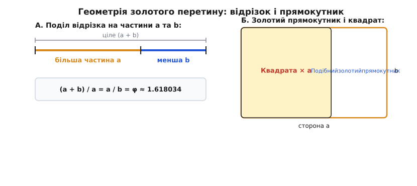
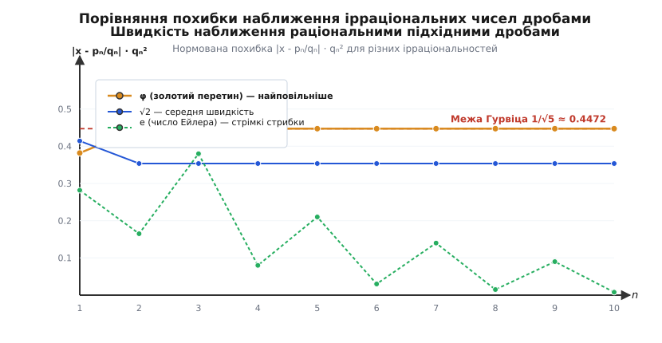
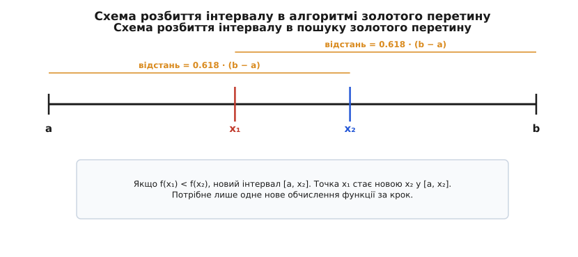

# Золотий перетин

<preknowlist>
- [Ірраціональні числа](book:math/irrational-numbers) — числа, які не можна подати у вигляді відношення двох цілих чисел m/n; на цьому тримається алгебраїчна природа φ.
- [Числа Фібоначчі](book:math/fibonacci-numbers) — рекурентна послідовність Fₙ = Fₙ⋁₁ + Fₙ⋁₂, чиє відношення сусідніх членів прямує до золотого перетину.
- [Ланцюгові дроби](book:math/continued-fractions) — покрокове подання чисел у вигляді нескінченних поверхів дробів, що показує якість їх раціонального наближення.
</preknowlist>

При розробці чисельних алгоритмів оптимізації та систем дискретного семплювання вибір довільного пропорційного розбиття чи звичайного кута повороту спричиняє суттєвий збій: в алгоритмах пошуку мінімуму раніше обчислені значення точки випадають з нових підінтервалів, що змушує робити по два нових дороговартісних виклики функції на кожному кроці й подвоює ресурсомісткість. Водночас у просторовому пакуванні та динамічних системах будь-яке звичайне ірраціональне число легко наближається раціональними дробами `p/q`, викликаючи періодичні резонанси, групування точок у смуги та утворення порожніх лакун. Без використання єдиного співвідношення, яке гарантує збереження пропорції та чинить найсильніший опір раціональному наближенню, чисельні алгоритми втрачають оптимізовану ефективність, а дискретні фізичні та біологічні системи руйнуються через періодичну синхронізацію.

Уявімо простий відрізок, який потрібно поділити на дві нерівні частини — більшу `a` та меншу `b`. Існує безліч способів зробити такий поділ, але єдине співвідношення створює унікальний геометричний баланс та усуває вищезгадані збої: відношення цілого відрізка `(a + b)` до більшої частини `a` мусить дорівнювати відношенню більшої частини `a` до меншої частини `b`. Якщо позначити шукану пропорцію `x = a / b`, це правило перетворюється на алгебраїчне рівняння `1 + 1/x = x`, чий єдиний додатний корінь задає число `φ = (1 + √5)/2 ≈ 1.6180339887…`. Золотий перетин становить алгебраїчну основу чисельного аналізу, теорії чисел та геометричного мозаїкування.

Це число — **золотий перетин** (або золота пропорція) — виявляється набагато глибшим, ніж естетичний канон античної геометрії. Саме завдяки властивості бути «найгірше раціонально наближуваним» числом воно сидить у самому серці теорії чисел, визначає граничну швидкість зростання послідовностей, задає частоту оптимізаційного розбиття в обчислювальних алгоритмах і виступає найбільш упертою ірраціональністю в усій дійсно числовій прямій. Покроковий аналіз цього числа відкриває, чому фундаментальні закони алгебри, геометрії та алгоритмів неминуче сходяться до однієї константи.

## Геометрична рівновага та алгебраїчне рівняння

Запишемо умову пропорційності Евкліда у вигляді строгої алгебраїчної рівності:

```
a + b     a
────── = ───
  a       b
```

Розділивши чисельник лівого дробу подетально на `a`, дістаємо:

```
    b     a
1 + ── = ───
    a     b
```

Позначимо відношення більшої частини до меншої як `x = a / b`. Оскільки `a > b > 0`, це число мусить бути строго більшим за одиницю (`x > 1`). Обернене відношення `b / a` становить `1 / x`. Рівняння набуває вигляду:

```
1 + ── = x
    x
```

Домноживши обидва боки на `x` та перенісши всі доданки у лівий бік, ми отримуємо канонічне квадратне рівняння золотого перетину:

```
x² − x − 1 = 0
```

Це рівняння має два дійсних корені, які обчислюються за стандартною формулою дискримінанта `D = (-1)² - 4·1·(-1) = 5`:

```
       1 + √5                             1 − √5
φ  =  ────────  ≈  1.6180339887…     ψ  =  ────────  ≈  −0.6180339887…
          2                                  2
```

Додатний корінь позначають грецькою літерою `φ` (фі) на честь давньогрецького скульптора Фідія. Від'ємний корінь `ψ` (псі) пов'язаний із `φ` простим співвідношенням: `ψ = 1 − φ = −1 / φ`.

За теоремою Вієта сума та добуток коренів рівняння `x² − x − 1 = 0` справджують рівності:

```
φ + ψ = 1
φ · ψ = −1
φ − ψ = √5
```


*А. Поділ відрізка цілої довжини (a + b) на частини a та b створює рівність відношень (a+b)/a = a/b = φ. Б. Відсікання квадрата a × a від золотого прямокутника залишає подібний золотий прямокутник b × (a-b).*

З квадратного рівняння `φ² − φ − 1 = 0` випливають дві фундаментальні алгебраїчні властивості, які роблять `φ` унікальним серед усіх дійсних чисел:

```
φ² = φ + 1       [квадрат числа дорівнює самому числу плюс одиниця]
1/φ = φ − 1      [обернене число дорівнює самому числу мінус одиниця]
```

Жодне інше додатне число у математиці не має властивості перетворюватися на свій власний квадрат шляхом додавання одиниці та на свій обернений елемент шляхом віднімання одиниці.

Для будь-якого цілого `k` сума `k`-х степенів коренів `L_k = φᵏ + ψᵏ` дає `k`-те число Люка, утворюючи пару з числами Фібоначчі.

### Строга побудова відрізка циркулем і лінійкою

Антична геометрія розробила точний метод точного поділу відрізка `AB` у золотому відношенні без чисельних вимірювань:

1. Нехай дано відрізок `AB` довжиною `1`. У точці `B` відновлюємо перпендикуляр `BC` довжиною `1/2`.
2. З'єднуємо точки `A` та `C`. За теоремою Піфагора гіпотенуза `AC` дорівнює:
   ```
   AC = √(1² + (1/2)²) = √(5/4) = √5 / 2
   ```
3. Проводимо дугу кола з центром у точці `C` радіусом `CB = 1/2`, яка перетинає гіпотенузу `AC` у точці `D`. Довжина відрізка `AD` становить:
   ```
   AD = AC − CD = (√5 / 2) − (1 / 2) = (√5 − 1) / 2 = 1/φ ≈ 0.618
   ```
4. Проводимо дугу кола з центром у точці `A` радіусом `AD`, яка перетинає вихідний відрізок `AB` у точці `P`. Точка `P` ділить відрізок `AB` строго у золотому відношенні: `AP = 1/φ`, `PB = 1 − 1/φ = 1/φ²`, причому `AB / AP = AP / PB = φ`.

### Повнота математичної індукції для степенів φ

Завдяки рівності `φ² = φ + 1` будь-який цілий степінь `φⁿ` можна лінійно понизити до виразу вигляду `A · φ + B`, де `A` та `B` — цілі числа. Доведемо строгим математичним методом індукції, що для всіх `n ∈ ℕ` виконується тотожність `φⁿ = Fₙ · φ + Fₙ⋁₁`.

**База індукції:**
- Для `n = 1`: `φ¹ = 1 · φ + 0 = F₁ · φ + F₀` (правильно, бо `F₁ = 1`, `F₀ = 0`).
- Для `n = 2`: `φ² = 1 · φ + 1 = F₂ · φ + F₁` (правильно, бо `F₂ = 1`, `F₁ = 1`).

**Крок індукції:** Припустимо, що тотожність виконується для `n = k`, тобто `φᵏ = F☿ · φ + F☿⋁₁`. Доведемо її для `n = k + 1`:

```
φᵏ⁺¹ = φ · φᵏ = φ (F☿ · φ + F☿⋁₁)            [підставляємо індуктивну гіпотезу]
     = F☿ · φ² + F☿⋁₁ · φ                      [розкриваємо дужки при множенні на φ]
     = F☿ (φ + 1) + F☿⋁₁ · φ                  [замінюємо φ² на (φ + 1)]
     = F☿ · φ + F☿ + F☿⋁₁ · φ                  [розкриваємо дужки F☿(φ + 1)]
     = (F☿ + F☿⋁₁) · φ + F☿                    [згруповуємо коефіцієнти при φ]
     = F☿₊₁ · φ + F☿                          [за рекурентним означенням F☿₊₁ = F☿ + F☿⋁₁]
```

Індуктивний крок доведено для всіх `n ∈ ℕ`.

Для від'ємних степенів тотожність залишається правильною, якщо поширити числа Фібоначчі на від'ємні індекси за формулою `F⋋ₙ = (-1)ⁿ⁺¹ Fₙ`. Перевіримо для `n = -1`:

```
φ⁻¹ = F⋋₁ · φ + F₀ = 1 · φ + 0 = φ − 1
```

що повністю збігається з вихідним співвідношенням `1/φ = φ − 1`.

Геометричним втіленням цього співвідношення є **золотий прямокутник** зі сторонами `a` та `b`, де `a / b = φ`. Якщо від такого прямокутника відсікти квадрат зі стороною `b × b`, то залишок буде прямокутником зі сторонами `b` та `(a − b)`. Оскільки `a / b = φ`, то для залишку відношення сторін становить:

```
  b        1         1
───── = ─────── = ─────── = φ
a − b   a/b − 1   φ − 1
```

Залишковий прямокутник виявляється **строго подібним** вихідному. Цю процедуру відсікання квадратів можна продовжувати нескінченно, отримуючи дедалі менші золоті прямокутники, закручені у рекурсивну прямокутну спіраль.

Окрім прямокутника, у тригонометрії існує **золотий трикутник** — рівнобедрений трикутник з кутами `72°`, `72°` та `36°`. Бісектриса кута при основі ділить протилежну бічну сторону в золотому відношенні й утворює два нові трикутники, один з яких знову є золотим трикутником, а інший — рівнобедреним трикутником з кутами `36°`, `36°` та `108°`. Звідси прямо виводяться точні значення тригонометричних функцій кутів `36°` та `72°`:

```
          φ     1 + √5
cos(36°) = ─ = ────────
          2       4

          φ − 1     √5 − 1
cos(72°) = ───── = ────────
            2         4
```

### Логарифмічна золота спіраль

Золота прямокутна мозаїка вкриває плоскопаралельну рівнокутную **золоту спіраль**. У полярних координатах `(r, θ)` рівняння логарифмічної спіралі має вигляд:

```
r(θ) = a · e^(b · θ)
```

Для золотої спіралі коефіцієнт зростання радіуса `b` обирається таким чином, щоб при кожному повороті на чверть кола `θ = π/2` (90 градусів) радіус збільшувався строго у `φ` разів:

```
r(θ + π/2) = r(θ) · φ   ⟹   a · e^(b(θ + π/2)) = a · e^(b θ) · φ
```

Скоротивши спільні множники `a · e^(b θ)`, отримуємо точну рівність `e^(b · π/2) = φ`. Прологарифмувавши обидва боки за натуральною основою `e`, знаходимо показник кутового зростання:

```
b · (π/2) = ln(φ)   ⟹   b = (2 / π) · ln(φ) ≈ (2 / 3.14159265) · 0.4812118 ≈ 0.3063489
```

Завдяки тому, що кут між дотичною до спіралі та радіус-вектором є постійним (`cot(α) = b ≈ 0.30635`, що відповідає постійному куту `α ≈ 72.97°`), золота спіраль зберігає свою геометричну форму при будь-яких масштабних перетвореннях.

### Нескінченні вкладені радикали Рамануджана

Альтернативним аналітичним способом подання `φ` є нескінченно вкладений квадратний корінь:

```
φ = √(1 + √(1 + √(1 + √(1 + ...))))
```

Задамо послідовність `x₀ = 1`, `xₙ₊₁ = √(1 + xₙ)`.
Перейдемо до границі `L = lim_{n→∞} xₙ`:

```
L = √(1 + L)   ⟹   L² = 1 + L   ⟹   L² − L − 1 = 0
```

Оскільки всі члени послідовності додатні, границя єдиним чином дорівнює додатному кореню `L = φ`.

### Границя коренів n-го степеня з чисел Фібоначчі

Аналітичною властивістю асимптотики чисел Фібоначчі є корінь `n`-го степеня:

```
lim_{n→∞} (Fₙ)^(1/n) = φ
```

Доведення випливає з формули Біне: `Fₙ = (φⁿ − ψⁿ)/√5 = (φⁿ / √5) · (1 − (ψ/φ)ⁿ)`. Взявши корінь `1/n` і перейшовши до границі при `n → ∞`, ми отримуємо `φ`.

### Нескінченний добуток чисел Фібоначчі

Число `φ` також чудово подається у вигляді нескінченного добутку співвідношень чисел Фібоначчі:

```
    ∞      (−1)ᵏ⁺¹         3   8   14   35   88
φ = ∏  (1 + ───────)  =  ─ · ─ · ── · ── · ── · ...
   k=1      F☿₊₁ F☿        2   9   15   36   89
```

Кожен частковий добуток цього ряду на збіжність збігається з підхідними дробами `Fₙ₊₁ / Fₙ`, що створює міст між теорією нескінченних добутків та раціональним наближенням.

### Металеві пропорції як алгебраїчна родина

Золотий перетин є першим і найважливішим членом нескінченного сімейства ірраціональних чисел, які називають **металевими пропорціями** (*metallic means*). Вони задаються як додатні корені квадратних рівнянь:

```
x² − k·x − 1 = 0,      де k ∈ ℕ
```

Загальна формула для `k`-ї металевої пропорції має вигляд:

```
       k + √(k² + 4)
M☿  =  ─────────────
             2
```

- Для `k = 1`: **Золота пропорція** `M₁ = φ = (1 + √5)/2 ≈ 1.6180339887…`
- Для `k = 2`: **Срібна пропорція** `M₂ = δ_S = 1 + √2 ≈ 2.4142135623…` (корінь `x² − 2x − 1 = 0`)
- Для `k = 3`: **Бронзова пропорція** `M₃ = (3 + √13)/2 ≈ 3.3027756377…` (корінь `x² − 3x − 1 = 0`)

Усі металеві пропорції розкладаються у періодичні ланцюгові дроби вигляду `M☿ = [k; k, k, k, ...]`. Оскільки для золотого перетину `k = 1`, його неповні частки є найменшими серед усіх металевих пропорцій, що робить `φ` найповільніше збіжним і найскладнішим для раціонального наближення серед усього сімейства.

Детальний розвиток цієї ідеї — від перших доведень Евкліда у Книзі VI «Начал» через трактат Луки Пачолі *De divina proportione* до введення терміна Мартіном Оммом у 1835 році — розгорнуто в [історії золотої пропорції](book:math/golden-ratio/hist-golden-ratio.md).

## Зв'язок із числами Фібоначчі та алгебра Люка

Найвідомішим теоретико-числовим виявом золотого перетину є його зв'язок із послідовністю чисел Фібоначчі, яка задається рекурентним правилом `F₀ = 0`, `F₁ = 1`, `Fₙ = Fₙ⋁₁ + Fₙ⋁₂`.

Простежимо відношення двох сусідніх членів `Fₙ₊₁ / Fₙ` при зростанні `n`:

```
F₂ / F₁   = 1 / 1   = 1.000000
F₃ / F₂   = 2 / 1   = 2.000000
F₄ / F₃   = 3 / 2   = 1.500000
F₅ / F₄   = 5 / 3   ≈ 1.666667
F₆ / F₅   = 8 / 5   = 1.600000
F₇ / F₆   = 13 / 8  = 1.625000
F∯ / F₇   = 21 / 13 ≈ 1.615385
F₉ / F   = 34 / 21 ≈ 1.619048
```

Значення відношень по черзі перескакують то вище, то нижче числа `φ`, звужуючи амплітуду з кожним кроком. Доведемо строго, що границя цієї послідовності дорівнює `φ`.

Поділимо рекурентне співвідношення `Fₙ₊₁ = Fₙ + Fₙ⋁₁` на `Fₙ`:

```
 Fₙ₊₁           Fₙ⋁₁
────── = 1 + ───────
  Fₙ            Fₙ
```

Позначимо границю відношення `lim_{n→∞} (Fₙ₊₁ / Fₙ) = L`. Припустивши існування границі `L`, запишемо:

```
L = 1 + ───     ⟹     L² − L − 1 = 0
         L
```

Оскільки всі члени послідовності додатні, границя дорівнює саме додатному кореню `L = φ`.

Зокрема, швидкість наближення відношення `Fₙ₊₁ / Fₙ` до `φ` описується точним співвідношенням:

```
 Fₙ₊₁          (−1)ⁿ
────── − φ  = ───────
  Fₙ          Fₙ · φⁿ
```

Звідси видно, що похибка змінює знак на кожному кроці й спадає зі швидкістю геометричної прогресії `1 / φ²ⁿ`.

Цей зв'язок дозволяє записати будь-яке число Фібоначчі в замкненій формі без послідовного обчислення попередніх доданків. Це **формула Біне**:

```
       φⁿ − ψⁿ       1 ⎛⎛ 1 + √5 ⎞ⁿ   ⎛ 1 − √5 ⎞ⁿ⎞
Fₙ  =  ───────  =  ──── ⎜⎜ ──────── ⎟   − ⎜ ──────── ⎟ ⎟
        φ − ψ       √5 ⎝⎝    2    ⎠     ⎝    2    ⎠ ⎠
```

Розглянемо виведення формули Біне через метод характеристичного рівняння. Оскільки рекурентне правило `Fₙ − Fₙ⋁₁ − Fₙ⋁₂ = 0` є лінійним зі сталими коефіцієнтами, його загальний розв'язок шукають у вигляді `Fₙ = C₁ φⁿ + C₂ ψⁿ`.

З початкових умов `F₀ = 0` та `F₁ = 1` отримуємо систему лінійних рівнянь для коефіцієнтів `C₁` та `C₂`:

```
C₁ + C₂ = 0                    ⟹   C₂ = −C₁
C₁ φ + C₂ ψ = 1                ⟹   C₁(φ − ψ) = 1
```

Оскільки `φ − ψ = √5`, знаходимо:

```
C₁ = ─── ,      C₂ = − ───
     √5                √5
```

Підставивши значення `C₁` та `C₂` у загальну формулу, отримуємо точний вираз Біне.

Простежимо чисельну точність формули Біне у наведеній таблиці обчислень:

```
n    φⁿ / √5             ψⁿ / √5             Різниця (Fₙ)   Округлення ⌊φⁿ/√5 + 1/2⌋
-------------------------------------------------------------------------------------
1    0.7236067977       -0.2763932023        1.0000000000   1
2    1.1708203932        0.1708203932        1.0000000000   1
3    1.8944271910       -0.1055728090        2.0000000000   2
4    3.0652475842        0.0652475842        3.0000000000   3
5    4.9596747752       -0.0403252248        5.0000000000   5
6    8.0249223595        0.0249223595        8.0000000000   8
7   12.9845971347       -0.0154028653       13.0000000000  13
8   21.0095194942        0.0095194942       21.0000000000  21
```

Оскільки `|ψ| = |(1 − √5)/2| ≈ 0.618 < 1`, другий доданок `ψⁿ / √5` з ростом `n` стрімко прямує до нуля. Вже для `n ≥ 1` цей доданок за модулем менший за `0.5`, тому `Fₙ` є найближчим цілим числом до `φⁿ / √5`:

```
Fₙ = ⌊ ─── + ─ ⌋
       √5    2
```

Поряд із числами Фібоначчі існує парна послідовність — **числа Люка** `Lₙ`, які задаються тим самим рекурентним правилом `Lₙ = Lₙ⋁₁ + Lₙ⋁₂`, але починаються з `L₀ = 2`, `L₁ = 1`. Перші члени: `2, 1, 3, 4, 7, 11, 18, 29, 47, 76…`

Явна формула для чисел Люка виражається як сума степенів коренів:

```
Lₙ = φⁿ + ψⁿ
```

Числа Фібоначчі та Люка пов'язані низкою фундаментальних тотожностей:

```
Lₙ = Fₙ⋁₁ + Fₙ₊₁
F₂♙ = F♙ · L♙
L♙² − 5 F♙² = 4 (−1)ⁿ
        L♙ + F♙ √5
φⁿ  =  ────────────
            2
```

Співвідношення `L♙² − 5 F♙² = 4 (−1)ⁿ` виявляється діофантовим рівнянням типу Пелля `x² − 5 y² = ±4`. Звідси випливає важливий критерій теорії чисел: натуральне число `N` є числом Фібоначчі тоді й лише тоді, коли хоча б один із виразів `5 N² + 4` або `5 N² − 4` є точним квадратом цілого числа.

### Теорема Цекендорфа та кодування Фібоначчі

У комбінаториці та теорії стиснення інформації фундаментальну роль відіграє **теорема Цекендорфа (1972)**:
> Будь-яке натуральне число `N ∈ ℕ` можна єдиним чином подати у вигляді суми несусідніх чисел Фібоначчі:
>
> ```
> N = ∑ c☿ · F☿,      де c☿ ∈ {0, 1}  і  c☿ · c☿₊₁ = 0
> ```

Наприклад, `N = 100 = 89 + 8 + 3 = F₁₁ + F₆ + F₄`.
Оскільки у двійковому поданні Цекендорфа две одиниці підряд `11` ніколи не зустрічаються всередині коду числа, комбінація `11` слугує природним та безпечним маркером кінця кодового слова. Це утворює **кодування Фібоначчі** (*Fibonacci Coding*) — самосинхронізовний код змінної довжини, який виключно стійкий до пошкодження або зсуву бітів у мережевих потоках.

### Золотий перетин у фракталах Мандельброта та квантовій фізиці

У комплексному аналізі та фрактальній динаміці число `φ` задає частоту резонансних виткань у множині Мандельброта `zₙ₊₁ = zₙ² + c`. Головна кардіоїда має нескінченно багато кругових пелюсток (*bulbs*). Пелюстка, яка відповідає обертанню з внутрішньою частотою `ω = 1/φ`, виявляється найбільшою аперіодичною пелюсткою, а на її межі виникають самоподібні фрактальні структури із геометрією золотого перетину.

У квантовій фізиці у 2010 році вчені експериментально виявили золотий перетин у квантовому стані одновимірного феромагнетика кобальту ніобату (`CoNb₂O₆`). При прикладанні поперечного магнітного поля відношення мас перших двох квантових збуджень (квазічастинок) виявилося строго рівним `φ ≈ 1.618`, що було передбачено теорією симетрії 8-вимірної групи Лі `E₈`.

### Золотий перетин у матричній алгебра та спектральному радіусі

Матричний зміст цієї системи розкривається через оператор зсуву / матрицю переходу `M`:

```
    ⎛ 1  1 ⎞
M = ⎜      ⎟
    ⎝ 1  0 ⎠
```

Вона діє на вектор стану `[Fₙ, Fₙ⋁₁]ᵀ`, переводячи його у наступний стан `[Fₙ₊₁, Fₙ]ᵀ`:

```
⎛ 1  1 ⎞ ⎛ F♙   ⎞   ⎛ F♙ + F♙⋁₁ ⎞   ⎛ F♙₊₁ ⎞
⎜      ⎟ ⎜      ⎟ = ⎜           ⎟ = ⎜      ⎟
⎝ 1  0 ⎠ ⎝ F♙⋁₁ ⎠   ⎝ F♙        ⎠   ⎝ F♙   ⎠
```

Характеристичний многочлен матриці `M` задається обчисленням визначника:

```
P(λ) = det(M − λI) = det ⎛ 1−λ   1  ⎞ = (1 − λ)(−λ) − 1 = λ² − λ − 1
                         ⎝  1   −λ  ⎠
```

Власними значеннями матриці `M` є корені `λ₁ = φ` та `λ₂ = ψ`. Оскільки `|λ₁| = φ ≈ 1.618 > |λ₂| = |ψ| ≈ 0.618`, домінуючим власним значенням (спектральним радіусом `ρ(M)`) є саме золотий перетин `φ`.

Знайдемо власний вектор `v₁`, який відповідає домінуючому власному значенню `λ₁ = φ`:

```
(M − φI) v₁ = 0   ⟹   ⎛ 1−φ   1  ⎞ ⎛ x ⎞ = ⎛ 0 ⎞   ⟹   (1 − φ)x + y = 0
                       ⎝  1   −φ ⎠ ⎝ y ⎠   ⎝ 0 ⎠
```

Оскільки `1 − φ = −1/φ`, отримуємо `y = x / φ`. Отже, домінуючий власний вектор дорівнює:

```
v₁ = ⎛ φ ⎞
     ⎝ 1 ⎠
```

Згідно з методом степеневих ітерацій (*power iteration method*), повторне множення будь-якого початкового ненульового вектора `x₀` на матрицю `Mⁿ` повертає вектор, кут якого прямує до напрямку власного вектора `v₁ = [φ, 1]ᵀ`. Саме тому відношення компонентів вектора `Fₙ₊₁ / Fₙ` неминуче прямує до `φ` зі швидкістю, визначеною відношенням власного спектра `|λ₂ / λ₁|ⁿ = (1 / φ²)ⁿ ≈ (0.381966)ⁿ`.

Степінь матриці `Mⁿ` прямо виражається через числа Фібоначчі:

```
     ⎛ Fₙ₊₁   F♙  ⎞
Mⁿ = ⎜            ⎟
     ⎝  F♙   F♙⋁₁ ⎠
```

Завдяки асоціативності множення матриць `Mⁿ⁺ᵐ = Mⁿ · Mᵐ` ми негайно отримуємо теорему додавання для чисел Фібоначчі:

```
Fₙ₊☿ = Fₙ₊₁ F☿ + F♙ F☿⋁₁
```

Враховуючи, що `det(M) = −1`, взявши визначник від обох боків рівняння `Mⁿ`, ми доводимо тотожність Кассіні у один рядок:

```
det(Mⁿ) = (det M)ⁿ     ⟹     Fₙ₊₁ · Fₙ⋁₁ − F♙² = (−1)ⁿ
```

## Алгебраїчні структури: розширення полів та кільце ℤ[φ]

З погляду сучасної абстрактної алгебри, число `φ` породжує квадратне розширення поля раціональних чисел `ℚ(√5)`. Ступінь цього розширення дорівнює `[ℚ(√5) : ℚ] = 2`, оскільки мінімальним многочленом `φ` над полем `ℚ` є зведений квадратний тричлен `x² − x − 1`.

Група автоморфізмів Галуа `Gal(ℚ(√5) / ℚ)` складається з двох елементів: тотожного перетворення та автоморфізму спряження `σ: √5 ↦ −√5`, який переставляє корені `φ` та `ψ`:

```
σ(φ) = σ( (1 + √5)/2 ) = (1 − √5)/2 = ψ
```

Множина цілих елементів поля `ℚ(√5)` (тобто коренів зведених многочленів із цілими коефіцієнтами) утворює кільце `𝒪_{ℚ(√5)}`. Воно збігається з кільцем `ℤ[φ]`, що складається з усіх елементів вигляду `u + v φ`, де `u, v ∈ ℤ`.

Оскільки `φ² = φ + 1`, додавання та множення в кільці `ℤ[φ]` виконуються строго за алгебраїчними правилами:

```
(u₁ + v₁ φ) + (u₂ + v₂ φ) = (u₁ + u₂) + (v₁ + v₂) φ
(u₁ + v₁ φ) · (u₂ + v₂ φ) = (u₁ u₂ + v₁ v₂) + (u₁ v₂ + v₁ u₂ + v₁ v₂) φ
```

Норма елемента `α = u + v φ ∈ ℤ[φ]` задається як добуток елемента на його спряжений `σ(α)`:

```
N(u + v φ) = (u + v φ)(u + v ψ) = u² + u v − v²
```

Норма є мультиплікативною: `N(α · β) = N(α) · N(β)`. Елемент `α` є оборотним (одиницею кільця) тоді й лише тоді, коли його норма дорівнює `±1`. Група оборотних елементів кільця `ℤ[φ]` є нескінченною і породжується степенями `φⁿ`:

```
N(φⁿ) = (N(φ))ⁿ = (−1)ⁿ
```

Кільце `ℤ[φ]` є кільцем головних ідеалів і факторіальним кільцем (факторизація на прості множники є єдиною з точністю до оборотних елементів). Прості цілі числа `p ∈ ℤ` поводяться у `ℤ[φ]` трьома різними способами залежно від порівняння за модулем 5:

1. **Розгалуження:** Число 5 розгалужується: `5 = (2φ − 1)² = (√5)²`.
2. **Розклад:** Прості числа `p ≡ ±1 (mod 5)` (наприклад, 11, 19, 29, 31, 41) розкладаються на добуток двох сопряжених простих елементів у `ℤ[φ]`.
3. **Інертність:** Прості числа `p ≡ ±2 (mod 5)` (наприклад, 2, 3, 7, 13, 17) залишаються простими елементами в кільці `ℤ[φ]`.

## Найірраціональніше число: ланцюгові дроби та теорема Гурвіца

У чисельному аналізі та теорії діофантових наближень ірраціональні числа оцінюють за тим, наскільки добре їх можна наблизити звичайними раціональними дробами `p / q`. Чим більший знаменник `q`, тим точнішим має бути наближення.

Загальна теорема Діріхле гарантує, що для будь-якого ірраціонального числа `α` існує нескінченно багато дробів `p / q` таких, що `|α − p/q| < 1 / q²`. Проте швидкість збіжності суттєво залежить від розкладу числа у нескінченний ланцюговий дріб `α = [a₀; a₁, a₂, ...]`.

Якщо розкласти золотий перетин у ланцюговий дріб через вираз `φ = 1 + 1/φ`, ми отримуємо нескінченну вежу:

```
φ = 1 + ────────────────1────────────────
        1 + ────────────1────────────
            1 + ────────1────────
                1 + ────1────
                    1 + ...
```

Усі неповні частки дорівнюють одиниці: `φ = [1; 1, 1, 1, ...]`.


*Нормована похибка |x - pₙ/qₙ| · qₙ² для золотого перетину φ утримується біля найвищої теоретичної межі 1/√5 ≈ 0.447, тоді як для √2 та e похибка падає значно швидше.*

Оскільки похибка наближення `n`-м підхідним дробом виражається формулою:

```
│      pₙ │           1
│ α − ────│  =  ─────────────────
│      qₙ │     q♙ (a♙₊₁ q♙ + q♙⋁₁)
```

наявність великих неповних часток `aₙ₊₁` (як число `292` у розкладі `π`) дає раптові надточні раціональні наближення. Проте у золотого перетину всі `aₙ₊₁ = 1` — це найменші можливі натуральні числа. Знаменник зростає найповільніше з усіх можливих випадків.

Нормована похибка `qₙ² |φ − pₙ/qₙ|` для `φ` прямує до границі:

```
         1               1             1
lim ───────────── = ─────────── = ─────────── = ─── ≈ 0.44721359…
n→∞  aₙ₊₁ + q♙⋁₁/q♙   1 + 1/φ       1 + φ − 1   √5
```

Це фундаментальний результат, підсумований у **теоремі Гурвіца (1891)**: для будь-якого ірраціонального `α` існує нескінченно багато дробів `p/q` таких, що `|α − p/q| < 1 / (√5 q²)`. Константа `√5` є гранично точною, і саме `φ` є екстремальною межею, для якої цю константу неможливо збільшити.

Через це у теорії діофантових наближень золотий перетин називають **найшляхетнішим** або **найбільш ірраціональним числом**. Докладний математичний виведення теореми Гурвіца, концепцію спектра Маркова–Лагранжа та арифметику кільця цілих чисел `ℤ[φ]` винесено в [математичний аналіз шляхетних ірраціональностей](book:math/golden-ratio/math-noble-irrational.md).

## Золотий кут, філотаксис та динамічні системи

Властивість `φ` бути «найгіршим» числом для раціонального наближення створює несподіваний ефект у біології та математичній фізиці: вона забезпечує **максимальну відсутність динамічних резонансів**.

Розділимо повне коло `360°` у золотому відношенні. Знайдемо менший із двох дугових кутів:

```
                       360°     360°
θ = 360° · (1 − 1/φ) = ──── = ───────── ≈ 137.507764°
                        φ²     1.618²
```

Цей кут називають **золотим кутом**.

У ботаніці явища розташування листя на стеблі, лусочок у шишках та насіння у суцвітті соняшника називають **філотаксисом**. У точці росту (меристемі) нові зародиші органів (примордії) виникають послідовно через однакові проміжки часу. Щоб нові листки чи насінини не затіняли попередні та пакувалися з максимальною щільністю, кожен наступний орган має повертатися відносно попереднього на певний кут `α`.

```
Для кута α = 1/2 · 360° = 180°: органи стають у 2 прямі лінії (спиці).
Для кута α = 1/3 · 360° = 120°: органи стають у 3 прямі лінії.
Для будь-якого раціонального кута α = (p/q) · 360°: через q кроків органи почнуть ставати чітко один над одним, утворюючи q радіальних спиць і залишаючи величезні порожнини між ними.
```

Якщо кут є ірраціональним, але добре наближається раціональними дробами (наприклад, `√2` або `π`), органи утворюють спіральні рукави з виразними геометричними прогалинами.

Проте якщо кут повороту дорівнює **золотому куту** `137.507764°`, структура ніколи не утворює періодичних спиць. Завдяки тому, що `φ` найгірше наближається дробами, кожна нова насінина лягає точно в найбільшу з наявних порожнин.

Фундаментальне математичне доведення цієї властивості спирається на **теорему про три довжини Штейнгауза (Three Gap Theorem)**:
> Для будь-якого ірраціонального числа `α` та будь-якого натурального `N` точки `{α}, {2α}, {3α}, ..., {N α}` (де `{x}` означає дробову частину) ділять одиничне коло `[0, 1)` на інтервали, довжини яких набувають **щонайбільше трьох різних значень**.

При `α = φ` відношення сусідніх довжин інтервалів завжди дорівнює `φ` або `φ²`. Це означає, що при будь-якому `N` точки `{n φ}` розподіляються по колу максимально рівномірно з усіх можливих ірраціональних чисел, без будь-якого первинного або вторинного скупчення (кластерингу).

Математична модель пакування насіння Фогеля (*Vogel's model*) визначає полярні координати `n`-ї насінини:

```
rₙ = c · √n
θₙ = n · 137.507764°
```

При такому пакуванні людське око бачить две системи пересічних спіралей (парастих). Кількість спіралей, що закручені за годинниковою та проти годинникової стрілки, **завжди дорівнює двом сусіднім числам Фібоначчі** (наприклад, 34 та 55, або 55 та 89 у великих соняшниках). Це не біологічна містика, а прямий геометричний наслідок того, що підхідні дроби `Fₙ₊₁ / Fₙ` дають найкращі з можливих (хоч і повільно збіжні) раціональні оцінки золотого кута.

Той самий механізм працює у гамільтоновій механіці та теорії хаосу. Згідно з **теоремою КАМ (Колмогорова–Арнольда–Мозера)**, інваріантні тори у фазовому просторі нелінійних динамічних систем руйнуються при збуреннях залежно від числової природи їхнього числа обертання `ω`. Тори з раціональним `ω` руйнуються першими через виникнення небезпечних нелінійних резонансів. Инваріантний тор, чиє число обертання дорівнює золотому перетину `ω = φ`, виявляється **найбільш стійким проти хаосу** і руйнується останнім при збільшенні сили збурення.

## Оптимізація та одномірний пошук

У чисельних методах властивість золотого перетину ділити відрізки в самоподібному відношенні використовується в **методі золотого перетину** (*Golden Section Search*) для знаходження мінімуму одномірної унімодальної функції `f(x)` на відрізку `[a, b]`.


*При розбитті інтервалу [a, b] точками x₁ та x₂ у відношенні 1/φ новий інтервал [a, x₂] зберігає точку x₁ точно на позиції нової правой внутрішньої точки, вимагаючи лише одного нового обчислення функції.*

Щоб звузити інтервал локалізації мінімуму `[a, b]`, слід обчислити значення функції у двох внутрішніх точках `x₁` та `x₂`:

```
x₁ = b − (b − a) / φ  ≈  a + 0.381966 · (b − a)
x₂ = a + (b − a) / φ  ≈  a + 0.618034 · (b − a)
```

Порівнявши значення `f(x₁)` та `f(x₂)`:
- Якщо `f(x₁) < f(x₂)`, мінімум лежить в інтервалі `[a, x₂]`. Новою правою межею стає `x₂`.
- Якщо `f(x₁) ≥ f(x₂)`, мінімум лежить в інтервалі `[x₁, b]`. Новою лівою межею стає `x₁`.

Звичайний метод дихотомії вимагає обчислення **двох** нових значень функції на кожній ітерації. Проте для золотого перетину завдяки тотожності `1/φ² = 1 − 1/φ` одна з нових внутрішніх точок у зрізаному інтервалі **збігається зі старою точкою**, де значення функції вже обчислено.

Отже, на кожному кроці алгоритм звужує інтервал у `φ ≈ 1.618` раза, виконуючи лише **одне нове обчислення цільової функції**. Робочий код алгоритму мовами C та C++ з аналізом накопичення похибок винесено у [практичну вставку пошуку золотого перетину](book:math/golden-ratio/proj-golden-search.md).

## Квазікристали Пенроуза та платонові тіла

У класичній евклідовій геометрії правильний п'ятикутник є єдиною базовою фігурою, яка **не здатна замощувати площину без зазорів та перекриттів**. Відношення діагоналі правильного п'ятикутника до його сторони дорівнює `φ`.

У 1974 році британський фізик і математик Роджер Пенроуз відкрив аперіодичні замощення (мозаїки Пенроуза). Площина заповнюється без пропусків плитами двох типів (наприклад, «товстими» та «тонкими» ромбами з кутами `72°`, `108°` та `36°`, `144°`). Ці мозаїки мають дві унікальні властивості:
1. Вони **не мають трансляційної симетрії** (візерунок ніколи точно не повторюється при паралельному зсуві).
2. Відношення кількості «товстих» ромбів до «тонких» у нескінченній мозаїці **строго дорівнює золотому перетину `φ`**.

Математично мозаїку Пенроуза можна отримати методом зрізу та проекції (*cut-and-project method*) із 5-вимірного кубічного ґратчастого простору `ℤ⁵` на 2-вимірну площину, розташовану під ірраціональним нахилом, визначеним числом `φ`.

У тривимірному просторі 12 вершин правильного ікосаедра утворюють три взаємно перпендикулярні золоті прямокутники. Координати цих вершин задаються витонченими виразами:

```
(0, ±1, ±φ),    (±1, ±φ, 0),    (±φ, 0, ±1)
```

Обчислимо об'єм `V` та радіус описаної сфери `R` для правильного ікосаедра зі стороною `a`:
- Радіус описаної сфери: `R = (a / 4) · √(10 + 2√5) = (a / 2) · √(1 + φ²)`
- Об'єм ікосаедра: `V = (5 / 12) · (3 + √5) · a³ = (5 / 6) · φ² · a³`

Для подвійного йому платонового тіла — правильного додекаедра зі стороною `a` — 20 вершин утворюють вершини куба та 8 додаткових зовнішніх точок. Об'єм додекаедра дорівнює:
- Об'єм додекаедра: `V = (15 + 7√5) / 4 · a³ = 5/2 · φ³ / √(5 − 2√5) · a³`

У чотиривимірному евклідовому просторі геометрія золотого перетину породжує унікальні 4-вимірні правильні многогранники (політопи): **120-комірник (120-cell)** та **600-комірник (600-cell)**, які мають групу симетрії гіпер-ікосаедра `H₄`. Координати їхніх вершин визначаються парними перестановками елементів `(±φ, ±1, ±1/φ, 0)`.

У 1984 році Дан Шехтман виявив у металевих сплавах алюмінію та марганцю атомні структури з ікосаедричною симетрією 5-го порядку, які назвали **квазікристалами** (за що у 2011 році він отримав Нобелівську премію з хімії). Дифракційні картини квазікристалів показують чіткі піки, відстані між якими співвідносяться як степені `φ`.

### Алгоритмічні застосування в інформатиці

Окрім геометрії та оптимізації, `φ` задає ефективність низки фундаментальних структур даних:

1. **Хешування Фібоначчі (Fibonacci Hashing):** У хеш-таблицях з адресацією за методом множення ключ `k` помножується на константу `A = 2⁶⁴ / φ ≈ 11400714819323198485`. Оскільки дробова частина `{k · φ}` за теоремою про три довжини Штейнгауза розбиває коло на найменш згруповані інтервали, цей спосіб гарантує відсутність колізійних кластерів навіть для послідовних цілих ключів `k, k+1, k+2...`
2. **Пошук Фібоначчі (Fibonacci Search):** При пошуку у впорядкованому масиві замість ділення навпіл (як у бінарному пошуці) інтервал ділиться на частини, рівні числам Фібоначчі `Fₙ⋁₁` та `Fₙ⋁₂`. Головна перевага полягає у тому, що обчислення індексів вимагає лише операцій додавання та віднімання без використання операції ділення, що є критичним для мікроконтролерів без апаратного дільника.
3. **Купи Фібоначчі (Fibonacci Heaps):** У цій структурі даних амортизований час виконання операції `decrease-key` становить `O(1)`. Доведення логарифмічного обмеження на максимальний степінь вузла спирається на те, що розмір піддерева вузла степеня `k` є не меншим за `F☿₊₂ ≥ φᵏ`.

> 🔧 **Навіщо це.**
> Золотий перетин та пов'язані з ним структури широко застосовуються у програмуванні та алгоритмах:
> - **Мультиплікативне хешування (Fibonacci Hashing):** При виборі хеш-множника `A = 2⁶⁴ / φ ≈ 11400714819323198485` у хеш-таблицях послідовні цілі ключі `k` відображаються у розрядну сітку як `(k · A) >> (64 − p)`. Дробові частини `{k · φ}` розподіляють елементи по комірках із максимальною можливою рівномірністю (згідно з теоремою про три довжини Штейнгауза), що повністю усуває первинний кластеринг ключів.
> - **Періодичні обчислення та Квазі-Монте-Карло:** Послідовності низької розбіжності (Low-discrepancy sequences) на основі сіток Фібоначчі `(i / Fₙ, {i · Fₙ⋁₁ / Fₙ})` дають оптимально рівномірне семплювання у комп'ютерній графіці (трасування променів та anti-aliasing) і дозволяють обчислювати двовимірні інтеграли з похибкою `O(log Fₙ / Fₙ)`.
> - **Купи Фібоначчі (Fibonacci Heaps):** Структура даних із логарифмічно-амортизованим часом `O(1)` для операції `decrease-key` спирається на те, що максимальний степінь вершини у дереві з `n` вузлами не перевищує `⌊log_φ(n)⌋`.
