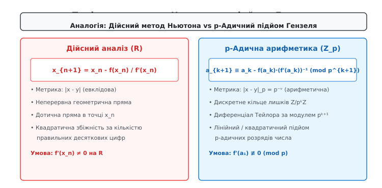
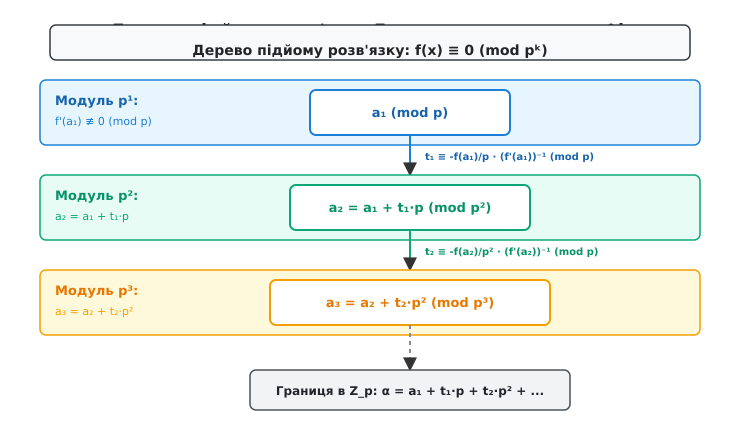
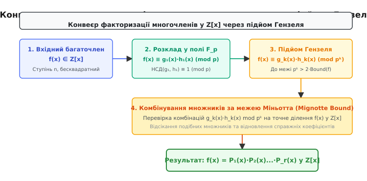

# Лема Гензеля

<preknowlist>
- [Модульна арифметика](book:math/modular-arithmetic) — порівняння за модулем, кільця лишків Z/nZ.
- [Мультиплікативний обернений елемент](book:math/modular-inverse) — обчислення v ≡ (f'(a))⁻¹ (mod p).
- [Тотожність Безу](book:math/bezout-identity) — лінійні комбінації та взаємно прості числа.
- [Китайська теорема про остачі](book:math/chinese-remainder-theorem) — об'єднання розв'язків за різними простими модулями.
- [Кільця](book:math/rings) — алгебраїчні структури Z_p та Z/pᵏZ.
</preknowlist>

> 🔧 **Навіщо це.**
> Спроба знайти корені поліноміального рівняння за великим модулем `pᵏ` безпосереднім перебором або прямолінійним розв'язанням зупиняється перед обчислювальним глухим кутом: кількість кандидатів `pᵏ` зростає експоненціально, що робить задачу нездійсненною вже для помірних степенів (наприклад, `2²⁵⁶` кандидатів у криптографії). З іншого боку, розв'язання того ж рівняння за першим степенем модуля `p` над скінченним полем `F_p` виконується за частки мілісекунди ефективними поліноміальними алгоритмами. Лема Гензеля вирішує цю фундаментальну проблему: за аналогією з методом Ньютона в математичному аналізі (де початкове наближення уточнюється за допомогою похідної) вона дає алгебраїчний механізм для «підйому» (lifting) відомого кореня `a₁ (mod p)` до точного розв'язку `a_k (mod pᵏ)` або p-адичного цілого числа в `Z_p` за `k` швидких детермінованих кроків замість `pᵏ` перевірок. Це уможливлює факторизацію багаточленів (алгоритм Берлекампа — Цассенгауза), добування квадратних коренів у криптосистемах RSA та Рабіна, аналіз еліптичних кривих і розв'язання діофантових рівнянь.

Потреба в лемі Гензеля виникає через те, що прямий перебір розв'язків порівняння `f(x) ≡ 0 (mod pᵏ)` потребує експоненціальної кількості перевірок `O(pᵏ)`, що стає обчислювально нездійсненним при великих `k`, тоді як лема Гензеля дає змогу розв'язати рівняння за простим модулем `p` (всього `p` перевірок) і ефективно підняти розв'язок до `mod pᵏ` за лінійну кількість кроків аналогічно методу Ньютона.

## 1. Проблема підйому розв'язків у модульний арифметиці

Розглянемо задачу знаходження цілочисельних розв'язків поліноміального порівняння:

```
f(x) ≡ 0 (mod M)
```

де `f(x) = c_n·xⁿ + c_{n-1}·xⁿ⁻¹ + ... + c₁·x + c₀` — многочлен із цілими коефіцієнтами `c_i ∈ Z`, а модуль `M` є цілим позитивним числом.

За канонічним розкладом Основної теореми арифметики будь-який модуль `M` розкладається на добуток степенів простих чисел `M = p₁^{k₁} · p₂^{k₂} ... p_r^{k_r}`. Завдяки [Китайській теоремі про остачі](book:math/chinese-remainder-theorem) загальна задача розв'язання порівняння за модулем `M` повністю зводиться до розв'язання системи незалежних порівнянь за модулями степенів простих чисел:

```
f(x) ≡ 0 (mod p_i^{k_i}),   i = 1, 2, ..., r
```

Якщо розв'язки знайдено для кожного `p_i^{k_i}`, підсумковий розв'язок за модулем `M` однозначно відновлюється за формулою китайської теореми про остачі. Проте тут виникає ключова обчислювальна перепона: прямолінійний перебір або безпосередній пошук кореня за модулем `pᵏ` вимагає перевірки `pᵏ` кандидатів. Для криптографічних застосувань або алгебраїчних обчислень, де `p = 2` та `k = 256`, множина кандидатів `2²⁵⁶` перевищує кількість атомів у спостережуваному Всесвіті, тому безпосереднє розв'язання за складеним степенем `pᵏ` є абсолютно неможливим.

З іншого боку, розв'язання порівняння за першим степенем простого модуля `p`:

```
f(x) ≡ 0 (mod p)
```

здійснюється над скінченним полем `F_p`. Для цього існують ефективні поліноміальні алгоритми (наприклад, алгоритм Берлекампа або метод Кантора — Цассенгауза), які знаходять корені за час, пропорційний степеню многочлена та логарифму модуля `p`.

Постає фундаментальне запитання: чи можна використати легко знайдений розв'язок `a₁` за малим модулем `p` для того, щоб сконструювати розв'язок `a₂` за модулем `p²`, далі `a₃` за модулем `p³`, і так далі до `a_k (mod pᵏ)`, не виконуючи повторного перебору серед `pᵏ` елементів?

Ідея леми Гензеля полягає у послідовному уточненні розв'язку аналогічно методу дотичних Ньютона в дійсному аналізі. Шуканий розв'язок `a_k (mod pᵏ)` подається у вигляді p-адичного позиційного розкладу за степенями `p`:

```
a_k = c₀ + c₁·p + c₂·p² + ... + c_{k-1}·p^{k-1}
```

де кожна «цифра» `c_i` береться з множини лишків `{0, 1, ..., p - 1}`.

Знаходження першого розв'язку `a₁` дає першу цифру `c₀ = a₁`. Механізм Гензеля показує, що для некратного кореня (де похідна `f'(a₁) ≢ 0 (mod p)`) кожна наступна цифра `c₁, c₂, ...` визначається розкладом Тейлора першого порядку за допомогою похідної `f'(a_k)` і обчислюється за один детермінований крок. Завдяки цьому складність пошуку розв'язку кардинально змінюється: замість експоненціальної кількості перевірок `O(pᵏ)` ми отримуємо ефективний процес підйому складності `O(k · deg(f))`.

## 2. Аналогія з методом Ньютона та p-адична геометрична інтуїція

Щоб зрозуміти внутрішню механіку леми Гензеля, корисно провести паралель із класичним методом Ньютона — Рафсона з математичного аналізу.

У дійсному аналізі для обчислення кореня гладкої функції `f(x) = 0` ми починаємо з початкового наближення `x₀`. Знаючи значення функції `f(x₀)` та її похідної `f'(x₀)`, ми будуємо дотичну пряму в точці `x₀` та знаходимо точку її перетину з віссю абсцис:

```
x₁ = x₀ - f(x₀) / f'(x₀)
```

Ітераційне повторення цієї формули `x_{n+1} = x_n - f(x_n)/f'(x_n)` створює послідовність дійсних чисел, яка квадратично збігається до точного кореня `x*`.


*Аналогія між геометричним методом дотичних Ньютона у реальному аналізі та модульним підйомом Гензеля в p-адичній арифметиці.*

У теорії чисел роль відстані між числами виконує не евклідова метрика `|x - y|`, а p-адична метрика `|x - y|_p`. У цій метриці два числа вважаються «близькими», якщо їхня різниця ділиться на високу степінь простого числа `p`. Норма задається як `|x|_p = p^{-v_p(x)}`, де `v_p(x)` — найбільший степінь `p`, що ділить `x`. Число `pᵏ` є нескінченно малим порядку `k`.

Тому порівняння `f(a_k) ≡ 0 (mod pᵏ)` означає, що `a_k` є наближеним розв'язком рівняння `f(x) = 0` з точністю до `k` p-адичних розрядів.

Детальний математичний доказ збіжності цієї метрики та властивостей p-адичних полів наведено у вставці [📜 Історія леми Гензеля та відкриття p-адичних чисел](book:math/number-theory/hensel-lemma/hist-hensel-p-adic.md).

## 3. Точне формулювання та алгебраїчний вивід

Нехай `f(x) ∈ Z[x]` — багаточлен із цілими коефіцієнтами, а `p` — просте число. Припустимо, що існує ціле число `a₁ ∈ Z`, таке що виконуються дві умови:

1. `f(a₁) ≡ 0 (mod p)` (значення `a₁` є коренем за модулем `p`);
2. `f'(a₁) ≢ 0 (mod p)` (похідна `f'(a₁)` не ділиться на `p`, тобто корінь є простим / некратним).

> **Лема Гензеля (простий корінь):** За дотримання наведених умов для кожного цілого `k ≥ 1` існує **єдине** ціле число `a_k` за модулем `pᵏ`, таке що:
> 1. `f(a_k) ≡ 0 (mod pᵏ)`
> 2. `a_k ≡ a₁ (mod p)`

Більше того, перехід від `a_k` до `a_{k+1}` здійснюється за рекурентною формулою підйому:

```
a_{k+1} = a_k + t_k · pᵏ (mod p^{k+1})
```

де коефіцієнт `t_k ∈ {0, 1, ..., p - 1}` є єдиним розв'язком лінійного порівняння:

```
t_k · f'(a_k) ≡ - (f(a_k) / pᵏ) (mod p)
```

### Покрокове алгебраїчне виведення

Припустимо, що ми вже знайшли розв'язок `a_k` за модулем `pᵏ`, тобто `f(a_k) = q · pᵏ` для деякого цілого `q`.

Шукаємо наступне наближення у вигляді `a_{k+1} = a_k + t · pᵏ`, де `t` — невідомий цілочисельний коефіцієнт.

Застосуємо розклад Тейлора для многочлена `f(x)` в околі точки `a_k`:

```
f(a_k + t·pᵏ) = f(a_k) + f'(a_k) · (t·pᵏ) + (f''(a_k) / 2!) · (t·pᵏ)² + ... + (f⁽ᵐ⁾(a_k) / m!) · (t·pᵏ)ᵐ
```

Згадаймо важливий алгебраїчний факт: для будь-якого багаточлена з цілими коефіцієнтами `f(x) ∈ Z[x]` значення `f⁽ᵐ⁾(x) / m!` при всіх `m ≥ 1` є багаточленом з **цілими коефіцієнтами**. Це легко перевіряється на довільному мономі `c · xᵐ`: його `k`-та похідна ділена на `k!` дає `c · C(m, k) · xᵐ⁻ᵏ`, де `C(m, k)` — цілочисельний біноміальний коефіцієнт.

Розглянемо вираз за модулем `p^{k+1}`. Оскільки `k ≥ 1`, другого степеня `(pᵏ)² = p²ᵏ` маємо `2k ≥ k + 1`. Отже, всі доданки з вищими степенями `p²ᵏ, p³ᵏ, ...` дорівнюють нулю за модулем `p^{k+1}`:

```
f(a_k + t·pᵏ) ≡ f(a_k) + f'(a_k) · t · pᵏ (mod p^{k+1})
```

Ми вимагаємо, щоб `f(a_{k+1}) ≡ 0 (mod p^{k+1})`. Підставляємо розклад:

```
f(a_k) + f'(a_k) · t · pᵏ ≡ 0 (mod p^{k+1})
```

Оскільки за припущенням `f(a_k)` ділиться на `pᵏ`, розділимо обидві частини рівняння на `pᵏ`:

```
(f(a_k) / pᵏ) + f'(a_k) · t ≡ 0 (mod p)
```

Перенесемо вільний член у праву частину:

```
f'(a_k) · t ≡ - (f(a_k) / pᵏ) (mod p)
```

Оскільки `a_k ≡ a₁ (mod p)`, маємо `f'(a_k) ≡ f'(a₁) (mod p)`. За умовою леми `f'(a₁) ≢ 0 (mod p)`, що означає взаємну простоту `gcd(f'(a_k), p) = 1`.

Отже, за теоремою про [Мультиплікативний обернений елемент](book:math/modular-inverse), існує єдине число `v ∈ {1, ..., p - 1}`, таке що:

```
v · f'(a_k) ≡ 1 (mod p)
```

Помноживши обидві частини порівняння на `v`, отримуємо явний вираз для `t`:

```
t ≡ - (f(a_k) / pᵏ) · v (mod p)
```

Знайдене значення `t` є єдиним за модулем `p`, що гарантує єдиність підйому `a_{k+1} = a_k + t · pᵏ` за модулем `p^{k+1}`.


*Дерево унікальних розв'язків рівняння за зростаючими ступенями p, де на кожному рівні додається один p-адичний розряд.*

Строгі докази для багатовимірних систем рівнянь та підйому факторизації многочленів винесено у вставку [🧮 Строгий доказ леми Гензеля, багатовимірний випадок та факторизація](book:math/number-theory/hensel-lemma/math-hensel-multivariate.md).

## 4. Практичні числові приклади та кроки підйому

### Приклад 1: Обчислення кореня з 7 за модулем 3⁵

Проілюструємо роботу лінійного підйому Гензеля на конкретному числовому прикладі. Поставимо задачу знайти розв'язок порівняння:

```
x² ≡ 7 (mod 3⁵)
```

Тобто ми шукаємо корінь многочлена `f(x) = x² - 7` за модулем `3⁵ = 243`. Обчислимо похідну многочлена: `f'(x) = 2x`.

#### Крок 1: Базовий розв'язок за модулем p = 3

Розв'язуємо `x² - 7 ≡ 0 (mod 3)`, що еквівалентно `x² ≡ 1 (mod 3)`.

Множина коренів за модулем 3 складається з двох елементів: `a₁ = 1` та `a₁' = 2 ≡ -1 (mod 3)`.

Перевіримо умову некратності для `a₁ = 1`:

```
f'(1) = 2 · 1 = 2 ≢ 0 (mod 3)
```

Умова леми Гензеля виконується. Знайдемо обернений елемент до похідної: `v ≡ 2⁻¹ ≡ 2 (mod 3)`, бо `2 · 2 = 4 ≡ 1 (mod 3)`.

#### Крок 2: Підйом від mod 3 до mod 3² = 9

Маємо `a₁ = 1`, `p = 3`, `k = 1`.

1. Обчислюємо значення багаточлена: `f(a₁) = 1² - 7 = -6`.
2. Обчислюємо частку: `q₁ = f(a₁) / p¹ = -6 / 3 = -2`.
3. За модулем 3 маємо `q₁ ≡ -2 ≡ 1 (mod 3)`.
4. Знаходимо поправку `t₁`:
```
t₁ ≡ - q₁ · v ≡ - 1 · 2 = -2 ≡ 1 (mod 3)
```
5. Формуємо новий корінь `a₂`:
```
a₂ = a₁ + t₁ · 3¹ = 1 + 1 · 3 = 4
```

Перевірка за модулем 9: `f(4) = 4² - 7 = 16 - 7 = 9 ≡ 0 (mod 9)`. Розв'язок знайдено вірно!

#### Крок 3: Підйом від mod 9 до mod 3³ = 27

Маємо `a₂ = 4`, `p = 3`, `k = 2`, `p² = 9`.

1. Обчислюємо значення: `f(a₂) = 4² - 7 = 9`.
2. Обчислюємо частку: `q₂ = f(a₂) / p² = 9 / 9 = 1`.
3. Знаходимо поправку `t₂`:
```
t₂ ≡ - q₂ · v ≡ - 1 · 2 = -2 ≡ 1 (mod 3)
```
4. Формуємо новий корінь `a₃`:
```
a₃ = a₂ + t₂ · 3² = 4 + 1 · 9 = 13
```

Перевірка за модулем 27: `f(13) = 13² - 7 = 169 - 7 = 162 = 6 · 27 ≡ 0 (mod 27)`.

#### Крок 4: Підйом від mod 27 до mod 3⁴ = 81

Маємо `a₃ = 13`, `p = 3`, `k = 3`, `p³ = 27`.

1. `f(13) = 162`.
2. `q₃ = 162 / 27 = 6 ≡ 0 (mod 3)`.
3. `t₃ ≡ - 0 · 2 ≡ 0 (mod 3)`.
4. `a₄ = a₃ + t₃ · 27 = 13 + 0 · 27 = 13`.

Перевірка за модулем 81: `f(13) = 162 = 2 · 81 ≡ 0 (mod 81)`.

#### Крок 5: Підйом від mod 81 до mod 3⁵ = 243

Маємо `a₄ = 13`, `p = 3`, `k = 4`, `p⁴ = 81`.

1. `f(13) = 162`.
2. `q₄ = 162 / 81 = 2`.
3. `t₄ ≡ - 2 · 2 = -4 ≡ 2 (mod 3)`.
4. `a₅ = a₄ + t₄ · 81 = 13 + 2 · 81 = 13 + 162 = 175`.

Перевірка за модулем 243: `f(175) = 175² - 7 = 30625 - 7 = 30618 = 126 · 243 ≡ 0 (mod 243)`.

Отже, єдиним підйомом кореня `a₁ = 1` за модулем `243` є число `175`. Другий корінь отримується підйомом `a₁' = 2` і дорівнює `243 - 175 = 68`.

### Приклад 2: Кубічне рівняння за модулем 5³ = 125

Розглянемо багаточлен `f(x) = x³ + 2x + 3` за простоим модулем `p = 5`.

Знайдемо корінь за модулем 5:
- `f(0) = 3 ≡ 3`
- `f(1) = 1 + 2 + 3 = 6 ≡ 1`
- `f(2) = 8 + 4 + 3 = 15 ≡ 0 (mod 5)`

Отже, `a₁ = 2` є коренем за модулем 5.

Обчислимо похідну: `f'(x) = 3x² + 2`.
Перевіримо похідну при `a₁ = 2`:
```
f'(2) = 3·(2²) + 2 = 12 + 2 = 14 ≡ 4 ≢ 0 (mod 5)
```
Умова виконується. Знаходимо обернений елемент до 4 за модулем 5:
```
v ≡ 4⁻¹ ≡ 4 (mod 5),  бо 4 · 4 = 16 ≡ 1 (mod 5)
```

#### Підйом до модуля 25:
1. `f(2) = 2³ + 2·2 + 3 = 8 + 4 + 3 = 15`.
2. `q₁ = 15 / 5 = 3`.
3. `t₁ ≡ - 3 · 4 = -12 ≡ 3 (mod 5)`.
4. `a₂ = 2 + 3 · 5 = 17`.

Перевірка mod 25: `f(17) = 17³ + 2·17 + 3 = 4913 + 34 + 3 = 4950 = 198 · 25 ≡ 0 (mod 25)`.

#### Підйом до модуля 125:
1. `f(17) = 4950`.
2. `q₂ = 4950 / 25 = 198 ≡ 3 (mod 5)`.
3. `t₂ ≡ - 3 · 4 = -12 ≡ 3 (mod 5)`.
4. `a₃ = 17 + 3 · 25 = 92`.

Перевірка mod 125: `f(92) = 92³ + 2·92 + 3 = 778688 + 184 + 3 = 778875 = 6231 · 125 ≡ 0 (mod 125)`.

Таким чином, корінь `a₁ = 2` піднімається до `a₃ = 92 (mod 125)`.

### Порівняння лінійного та квадратичного підйомів

Існує дві модифікації алгоритму Гензеля:

1. **Лінійний підйом (`p → p² → p³ ...`):** На кожному кроці степінь збільшується на 1. Алгоритм потребує `k - 1` ітерацій. Плюсом є те, що обернений елемент `v = (f'(a₁))⁻¹ (mod p)` обчислюється лише один раз на початку.
2. **Квадратичний підйом (`p → p² → p⁴ → p⁸ ...`):** На кожному кроці степінь подвоюється за формулою Ньютона `a_{2k} ≡ a_k - f(a_k) · (f'(a_k))⁻¹ (mod p²ᵏ)`. Кількість ітерацій становить `O(log k)`, але на кожному кроці потрібно обчислювати обернений елемент за вищим модулем `p²ᵏ`.

## 5. Особлені випадки: Коли похідна кратна p

Що відбувається, якщо умова `f'(a₁) ≢ 0 (mod p)` порушується, тобто похідна ділиться на `p` (`f'(a₁) ≡ 0 (mod p)`)?

У цьому випадку вираз `f'(a_k) · t ≡ - (f(a_k) / pᵏ) (mod p)` набуває вигляду:

```
0 · t ≡ - (f(a_k) / pᵏ) (mod p)
```

Тут виникає два кардинально різних сценарії:

### Сценарій А: Несумісність (0 розв'язків)

Якщо значення `f(a_k)` не ділиться на `p^{k+1}` (тобто `f(a_k) / pᵏ ≢ 0 (mod p)`), то рівняння `0 · t ≡ q (mod p)` при `q ≢ 0` **не має жодного розв'язку**.

Це означає, що корінь `a_k` є тупиковим і **не піднімається** на вищий модуль `p^{k+1}`.

### Сценарій Б: Розгалуження (p розв'язків)

Якщо значення `f(a_k)` ділиться на `p^{k+1}` (тобто `f(a_k) / pᵏ ≡ 0 (mod p)`), то рівняння `0 · t ≡ 0 (mod p)` стає тотожністю.

У цьому випадку **будь-який** коефіцієнт `t ∈ {0, 1, ..., p - 1}` задовольняє порівняння. Корінь `a_k` розгалужується точно на `p` різних розв'язків за модулем `p^{k+1}`:

```
a_{k+1} = a_k + t · pᵏ,   t = 0, 1, ..., p - 1
```

### Класичний приклад: розгалуження коренів за модулем 2ᵏ

Розглянемо многочлен `f(x) = x² - 1` при `p = 2`.

Його похідна `f'(x) = 2x` ділиться на `2` для всіх цілих `x`, тому `f'(x) ≡ 0 (mod 2)`.

- За модулем `p = 2`: `x² ≡ 1 (mod 2)` має один корінь `a₁ = 1`.
- За модулем `p² = 4`: `f(1) = 0`, що ділиться на 4. Отже, виникає розгалуження при `t ∈ {0, 1}`:
  - `a₂ = 1 + 0·2 = 1`
  - `a₂' = 1 + 1·2 = 3`
  Обидва числа є коренями: `1² ≡ 1 (mod 4)` та `3² = 9 ≡ 1 (mod 4)`.
- За модулем `p³ = 8`: Кожен із двох коренів розгалужується ще на 2, утворюючи 4 розв'язки: `{1, 3, 5, 7}`.

Узагальнена лема Гензеля враховує показник `e = v_p(f'(a))`: якщо `v_p(f(a)) > 2e`, корінь існує і піднімається однозначно за модулем `p^{e+1}`.

## 6. Застосування: Факторизація багаточленів, еліптичні криві та криптографія

Лема Гензеля є не просто теоретичною теоремою, а робочим конем обчислювальної алгебри.

### 1. Алгоритми факторизації багаточленів у Z[x]

Шукати розклад многочлена `f(x)` на незвідні множники безпосередньо в `Z[x]` надзвичайно важко через можливі великі коефіцієнти. Сучасні системи комп'ютерної алгебри (Maple, Mathematica, SageMath, PARI/GP) використовують триетапну схему:

1. **Факторизація в `F_p[x]`:** Многочлен `f(x)` зводиться за невеликим простим модулем `p` та розкладається на множники `f(x) ≡ g₁(x) · h₁(x) (mod p)` за допомогою алгоритму Берлекампа.
2. **Підйом Гензеля для многочленів:** Розклад піднімається до `f(x) ≡ g_k(x) · h_k(x) (mod pᵏ)` за допомогою багатовимірного варіанту леми Гензеля, поки модуль `pᵏ` не перевищить теоретичну межу коефіцієнтів шуканих множників (межу Міньотта).
3. **Комбінування та відновлення в `Z[x]`:** Зі знайдених модульних множників комбінуються справжні множники в `Z[x]`.


*Етапи алгоритму розкладу многочленів: факторизація в скінченному полі, підйом Гензеля за модулем pᵏ та комбінування множників за межею Міньотта.*

### 2. Квадратичні лишки та криптосистеми

У криптографічних алгоритмах (зокрема RSA та схемах криптографічного підпису Рабіна) виникає потреба знаходження квадратних коренів за модулем `N = p · q`. За допомогою леми Гензеля корінь спочатку шукається за модулями `p` та `q` (через символ Лежандра), потім піднімається за модулями `pᵏ` та `qᵐ`, після чого об'єднується через Китайську теорему про остачі.

### 3. Аналіз еліптичних кривих (Алгоритм SEA)

У сучасній криптографії на еліптичних кривих для знаходження кількості точок на еліптичній кривій над скінченним полем `F_p` застосовується алгоритм Шуфа — Елкіса — Аткіна (SEA). Для обчислення власних значень ендоморфізмів Фробеніуса використовується p-адичний підйом Гензеля для точок кривої над кільцем `Z/pᵏZ`.

Програмну реалізацію лінійного та квадратичного підйому на мовах C та C++ з детальною обробкою крайових випадків наведено у вставці [⚙️ Реалізація підйому Гензеля: корені та факторизація](book:math/number-theory/hensel-lemma/proj-hensel-lifting.md).
