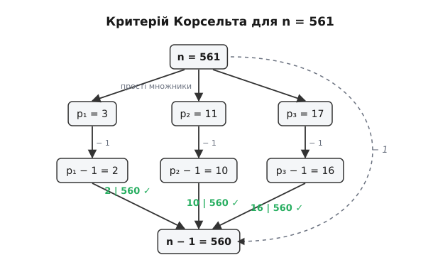

# Критерій Корсельта для чисел Кармайкла

<preknowlist>
- [Мала теорема Ферма](/book/math/number-theory/fermats-little-theorem/)
- [Модульна арифметика та конгруенції](/book/math/number-theory/modular-arithmetic/)
- [Прості числа та факторизація](/book/math/number-theory/prime-numbers/)
- [Взаємно прості числа](/book/math/number-theory/coprime/)
</preknowlist>

> 🔧 **Навіщо це.** Критерій Корсельта — це елегантний і надзвичайно потужний математичний інструмент, який дає змогу повністю описати структуру та властивості так званих чисел Кармайкла (псевдопростих чисел Ферма). Коли ми тестуємо числа на простоту у сучасній криптографії, спираючись на Малу теорему Ферма, числа Кармайкла стають «каменем спотикання», оскільки вони успішно проходять цей тест, попри те, що є складеними. Критерій Корсельта пояснює, чому саме ці числа поводяться так дивно, і показує, як їх генерувати та розпізнавати без необхідності перевіряти кожну можливу основу. Розуміння цього критерію є фундаментальним для розробки більш надійних тестів на простоту, таких як тест Міллера-Рабіна, що лежать в основі безпеки всього сучасного інтернету.

## Вступ: Велика ілюзія Малої теореми Ферма

Мала теорема Ферма — це один із найвідоміших і найважливіших результатів у теорії чисел. Вона стверджує дуже просту річ: якщо ми маємо просте число p і будь-яке ціле число a, яке не ділиться на p (тобто a та p є взаємно простими), то якщо ми піднесемо a до степеня p-1 і поділимо на p, остача від ділення завжди дорівнюватиме 1. Мовою конгруенцій це записується так:

```text
a^(p - 1) ≡ 1 (mod p)
```

Ця властивість настільки надійна і характерна для простих чисел, що математики та інформатики почали використовувати її як своєрідний "детектор простоти". Якщо ми беремо якесь величезне невідоме число n і хочемо дізнатися, просте воно чи складене, ми можемо взяти якесь випадкове число a (наприклад, a = 2), піднести його до степеня n-1 і подивитися на остачу від ділення на n. Якщо остача не дорівнює 1, то ми зі стовідсотковою впевненістю можемо заявити: число n є складеним. Мала теорема Ферма працює безжально і ніколи не помиляється в цьому напрямку.

Але виникає зворотне запитання: якщо для числа n виконується умова a^(n-1) ≡ 1 (mod n), чи означає це, що n обов'язково є простим? Відповідь, на жаль, — ні. Існують складені числа, які вміють ідеально "маскуватися" під прості. Для деяких складених чисел n умова a^(n-1) ≡ 1 (mod n) виконується для якогось конкретного a (наприклад, для a = 2). Такі числа називають псевдопростими за основою a.

Однак існує ще більш хитра та підступна категорія чисел. Це такі складені числа n, для яких умова a^(n-1) ≡ 1 (mod n) виконується для **абсолютно всіх** можливих значень a, які є взаємно простими з n. Тобто, яку б основу ви не взяли, тест Ферма скаже вам: "Це число виглядає як просте!". Такі числа називаються **числами Кармайкла**. 

Як же математикам впоратися з цими майстрами маскування? Як зрозуміти їхню природу? Саме тут на сцену виходить німецький математик Альвін Корсельт.

## Відкриття Альвіна Корсельта (1899 рік)

У 1899 році, за кілька років до того, як Роберт Кармайкл фактично знайшов перше таке число і дослідив їх детальніше (через що вони і отримали його ім'я), Альвін Корсельт зробив блискуче теоретичне відкриття. Він сформулював критерій — точні структурні умови, яким має відповідати складене число, щоб бути ось таким "абсолютним псевдопростим". 

Корсельт довів, що складене число n задовольняє умову a^(n-1) ≡ 1 (mod n) для всіх a, взаємно простих з n (тобто є числом Кармайкла), тоді і тільки тоді, коли виконуються дві суворі вимоги:

1. **Число n не містить квадратів простих множників (square-free).** Це означає, що у розкладі числа n на прості множники жодне просте число не повторюється. Якщо n ділиться на p, то воно не може ділитися на p². Тобто розклад має вигляд n = p₁ · p₂ · ... · pₖ, де всі pᵢ — різні прості числа.
2. **Для кожного простого дільника p числа n, число (p - 1) ділить без остачі число (n - 1).** Це можна записати як (p - 1) | (n - 1). 

Ці дві умови і є **Критерієм Корсельта**. Це неймовірно потужне твердження. Воно перетворює абстрактну властивість "бути псевдопростим для всіх основ" на дуже конкретну арифметичну задачу, пов'язану з простими дільниками числа.

Давайте розберемо цей критерій з перших принципів (методом Фейнмана), щоб зрозуміти, звідки беруться ці дві умови і чому вони працюють саме так.

## Метод Фейнмана: Деконструкція Критерію Корсельта

Щоб по-справжньому зрозуміти Критерій Корсельта, нам потрібно зануритися в механіку модульної арифметики. Наша мета — знайти складене число n, для якого виконується:

```text
a^(n - 1) ≡ 1 (mod n)
```

для всіх a, де найбільший спільний дільник НСД(a, n) = 1.

### Чому число має бути вільним від квадратів? (Умова 1)

Припустимо, що число n має квадратний множник. Тобто існує якесь просте число p, таке що p² ділить n. Запишемо n = p² · m, де m — якась інша частина числа n.

Ми хочемо, щоб для всіх a, взаємно простих з n, виконувалося a^(n-1) ≡ 1 (mod n). 
Згадаймо важливу властивість конгруенцій: якщо a ≡ b (mod n), і число k є дільником n, то обов'язково a ≡ b (mod k). 
Оскільки p² ділить n, то наша вимога a^(n-1) ≡ 1 (mod n) автоматично означає, що має виконуватися:

```text
a^(n - 1) ≡ 1 (mod p²)
```

Це має працювати для всіх a, взаємно простих з n (а отже, і з p).
Давайте подивимося на структуру чисел за модулем p². Розглянемо число a = 1 + p. Воно явно не ділиться на p, отже воно взаємно просте з n (якщо ми підберемо його так, щоб воно не ділилося на інші множники n, що за китайською теоремою про остачі завжди можливо).

Що буде, якщо ми піднесемо (1 + p) до якогось степеня k і подивимося на результат за модулем p²?
За формулою бінома Ньютона:
(1 + p)^k = 1 + k·p + (k(k-1)/2)·p² + ... 

Оскільки ми працюємо за модулем p², всі доданки, що містять p² і вищі степені p, дорівнюють нулю. Тому залишається:
(1 + p)^k ≡ 1 + k·p (mod p²)

Нам потрібно, щоб (1 + p)^(n-1) ≡ 1 (mod p²).
Підставляємо k = n - 1:
1 + (n - 1)·p ≡ 1 (mod p²)
(n - 1)·p ≡ 0 (mod p²)

Це означає, що число (n - 1)·p має ділитися на p². Щоб це було правдою, саме число (n - 1) повинно ділитися на p. Тобто (n - 1) кратне p.
Але зачекайте! З самого початку ми сказали, що p є дільником числа n. Тобто n кратне p.
Чи можуть два послідовних числа, n та (n - 1), одночасно ділитися на p (де p — просте число, більше за 1)? Звичайно, ні! Якщо n ділиться на p, то остача від ділення (n - 1) на p буде p - 1, а не 0.

Отже, ми прийшли до суперечності. Це означає, що наше припущення було хибним. Число n, яке є псевдопростим для всіх основ, **не може містити квадратів простих множників**. Воно повинно розкладатися на унікальні, неповторювані прості числа. Умова 1 доведена і є абсолютно логічною необхідністю.

### Чому (p - 1) має ділити (n - 1)? (Умова 2)

Тепер ми знаємо, що n = p₁ · p₂ · ... · pₖ, де всі pᵢ різні. 
Ми хочемо, щоб a^(n - 1) ≡ 1 (mod n) для всіх взаємно простих a.

Завдяки Китайській теоремі про остачі, якщо твердження a^(n - 1) ≡ 1 виконується за модулем складеного числа n (яке є добутком різних простих), то воно повинно виконуватися окремо за модулем кожного з його простих дільників. Тобто, для кожного pᵢ, яке ділить n, має виконуватися:

```text
a^(n - 1) ≡ 1 (mod pᵢ)
```

А тепер згадаймо Малу теорему Ферма для самого простого числа pᵢ. Вона каже нам, що:

```text
a^(pᵢ - 1) ≡ 1 (mod pᵢ)
```

Це означає, що коли ми підносимо число a до степеня і дивимося на результат за модулем pᵢ, послідовність остач зациклюється. Довжина цього циклу є дільником числа (pᵢ - 1). 
Щоб гарантувати, що в результаті піднесення до степеня (n - 1) ми завжди будемо потрапляти в "одиницю" (початок циклу), степінь (n - 1) повинен бути кратним довжині повного циклу (pᵢ - 1). 

Уявіть собі годинник з (pᵢ - 1) поділками. Кожне множення на a — це крок на одну поділку. За (pᵢ - 1) кроків ви завжди повертаєтесь на старт (в одиницю). Щоб після (n - 1) кроків ви також гарантовано опинилися на старті, незалежно від того, яким великим чи малим був ваш крок, загальна кількість кроків (n - 1) має бути цілим числом повних обертів. А отже, (n - 1) має ділитися без остачі на (pᵢ - 1).

Це має виконуватися для кожного простого дільника числа n. Звідси випливає друга умова Корсельта: **∀ p | n ⇒ (p - 1) | (n - 1)**.

Ця умова працює і у зворотному напрямку (достатність). Якщо обидві умови виконуються, то за Малою теоремою Ферма і властивостями конгруенцій a^(n-1) завжди даватиме остачу 1 за кожним простим модулем pᵢ, а отже, і за їхнім добутком n. 



## Конструювання найменшого числа Кармайкла: Звідки береться 561?

Знаючи критерій Корсельта, ми можемо перетворити його на інструмент для пошуку або конструювання чисел Кармайкла. Спробуємо знайти найменше можливе таке число.

Ми знаємо, що n має бути складеним і не містити квадратів.
Чи може число Кармайкла складатися лише з двох простих множників? Перевіримо це.
Припустимо, n = p · q, де p та q — прості числа, і для визначеності нехай p < q.
За критерієм Корсельта, (q - 1) має бути дільником числа (n - 1).
Запишемо (n - 1):
n - 1 = p·q - 1 = p·q - p + p - 1 = p(q - 1) + (p - 1).

Ми знаємо, що (n - 1) ділиться на (q - 1). Очевидно, що перша частина виразу, p(q - 1), ділиться на (q - 1). Отже, щоб усе число (n - 1) ділилося на (q - 1), потрібно, щоб залишок, тобто (p - 1), також ділився на (q - 1).
Тобто (q - 1) має бути дільником (p - 1).
Але ми припустили, що p < q. Якщо p менше за q, то (p - 1) менше за (q - 1). Більше число не може бути дільником меншого додатного числа.
Висновок: **число Кармайкла не може мати рівно два простих множники.** Воно повинно мати щонайменше три простих множники.

Отже, найпростіша структура для числа Кармайкла — це добуток трьох різних простих чисел: n = p · q · r.
Припустимо, що p < q < r.

Знайдемо найменше можливе значення. Оскільки n має бути непарним (якщо n парне, то p=2. Тоді n-1 непарне. Але для будь-якого іншого непарного дільника q, q-1 буде парним. Парне число не може ділити непарне n-1. Тому чисел Кармайкла парних не існує), найменше можливе просте p = 3.

Якщо p = 3, то за критерієм Корсельта: (3 - 1) | (n - 1), тобто 2 | (n - 1). Це просто підтверджує, що n - 1 має бути парним, що логічно, бо n непарне.

Тепер ми знаємо, що p = 3. Шукаємо q та r.
n = 3 · q · r
Ми знаємо, що (q - 1) | (3qr - 1) і (r - 1) | (3qr - 1).

Запишемо 3qr - 1 через q-1:
3qr - 1 = 3r(q - 1) + 3r - 1.
Оскільки (q - 1) має ділити (3qr - 1), то (q - 1) повинно також ділити залишок (3r - 1). Отже:
(3r - 1) ≡ 0 (mod q - 1)

Аналогічно, переписавши через r-1:
3qr - 1 = 3q(r - 1) + 3q - 1.
Тоді (r - 1) повинно ділити (3q - 1):
(3q - 1) ≡ 0 (mod r - 1)

Оскільки p=3, наступне можливе непарне просте число — це q = 5. Перевіримо його.
Якщо q = 5, то q - 1 = 4.
Тоді (3r - 1) має ділитися на 4.
3r - 1 ≡ 0 (mod 4)
3r ≡ 1 (mod 4)
-r ≡ 1 (mod 4)  (бо 3 ≡ -1 mod 4)
r ≡ -1 ≡ 3 (mod 4).

Отже, r має бути простим числом виду 4k + 3. Наприклад, r = 7, 11, 19...
Крім того, друга умова: (r - 1) має ділити (3q - 1).
Оскільки q = 5, то 3q - 1 = 15 - 1 = 14.
Отже, (r - 1) має бути дільником 14.
Дільники 14: 1, 2, 7, 14.
Тоді r - 1 = 1 ⇒ r = 2 (але ми шукаємо непарне r > 5).
r - 1 = 2 ⇒ r = 3 (не підходить).
r - 1 = 7 ⇒ r = 8 (не просте).
r - 1 = 14 ⇒ r = 15 (не просте).
Отже, варіант з q = 5 не працює. Не існує такого простого r, яке б задовольняло умови.

Спробуємо наступне непарне просте число: q = 7.
Якщо q = 7, q - 1 = 6.
(3r - 1) має ділитися на 6. Але 3r - 1 ніколи не ділиться на 3, а отже і на 6. Варіант q = 7 відпадає миттєво.

Спробуємо наступне: q = 11.
Якщо q = 11, q - 1 = 10.
(3r - 1) має ділитися на 10.
Це означає, що 3r закінчується на 1. Оскільки r - просте число, воно має закінчуватися на 7. Можливі значення r: 17, 37, 47, 67...

Перевіримо другу умову: (r - 1) має ділити (3q - 1).
3q - 1 = 3(11) - 1 = 33 - 1 = 32.
Отже, (r - 1) має бути дільником 32.
Дільники 32: 1, 2, 4, 8, 16, 32.
З нашого списку можливих r (17, 37, 47...), перевіримо r = 17.
Якщо r = 17, то r - 1 = 16.
Чи є 16 дільником 32? Так! 32 / 16 = 2. Це ідеальний збіг!

Отже, ми знайшли нашу трійку простих чисел: p = 3, q = 11, r = 17.
Обчислимо n:
n = 3 · 11 · 17 = 33 · 17 = 561.

Число 561 — це перше і найменше число Кармайкла. Саме його відкрив Роберт Кармайкл у 1910 році, хоча Корсельт вивів свій критерій ще 11 років до того, не знайшовши жодного прикладу (що цікаво, математик Вацлав Серпінський пізніше довів, що чисел Кармайкла існує нескінченно багато).

## Детальна перевірка числа 561

Давайте застосуємо критерій Корсельта до числа 561 крок за кроком, щоб на власні очі переконатися, як ідеально сходяться всі математичні шестірні.

**Крок 1. Перевірка на відсутність квадратів (square-free).**
Ми вже знаємо, що 561 = 3 · 11 · 17.
Всі прості множники (3, 11, 17) унікальні і зустрічаються лише в першому степені. Перша умова критерію виконана.

**Крок 2. Перевірка умови подільності (p - 1) | (n - 1).**
Обчислимо (n - 1):
561 - 1 = 560.

Тепер перевіримо кожного простого дільника p:
- Для p = 3: (p - 1) = 2. Чи ділить 2 число 560? Так, 560 = 2 · 280.
- Для p = 11: (p - 1) = 10. Чи ділить 10 число 560? Так, 560 = 10 · 56.
- Для p = 17: (p - 1) = 16. Чи ділить 16 число 560? Перевіримо: 560 / 16 = 35. Так, ділиться без остачі.

Всі три прості дільники задовольняють умову. Це означає, що за критерієм Корсельта число 561 дійсно є псевдопростим для будь-якої основи a, взаємно простої з 561.

Давайте подивимося, як це виглядає з точки зору конгруенцій. Нехай a — будь-яке число, взаємно просте з 561 (тобто не ділиться ні на 3, ні на 11, ні на 17).
За Малою теоремою Ферма для кожного дільника ми маємо:
1) a² ≡ 1 (mod 3)
2) a¹⁰ ≡ 1 (mod 11)
3) a¹⁶ ≡ 1 (mod 17)

Ми хочемо дізнатися значення a⁵⁶⁰ за кожним модулем. Ми можемо отримати степінь 560, піднісши наші базові конгруенції до відповідного степеня:
1) (a²)²⁸⁰ ≡ 1²⁸⁰ (mod 3)  ⇒  a⁵⁶⁰ ≡ 1 (mod 3)
2) (a¹⁰)⁵⁶ ≡ 1⁵⁶ (mod 11)   ⇒  a⁵⁶⁰ ≡ 1 (mod 11)
3) (a¹⁶)³⁵ ≡ 1³⁵ (mod 17)   ⇒  a⁵⁶⁰ ≡ 1 (mod 17)

Оскільки a⁵⁶⁰ дає остачу 1 при діленні на 3, на 11 і на 17, а ці числа є взаємно простими попарно, то за Китайською теоремою про остачі a⁵⁶⁰ повинно давати остачу 1 і при діленні на їхній добуток (3 · 11 · 17 = 561).
Таким чином, ми довели, що:

```text
a⁵⁶⁰ ≡ 1 (mod 561)
```

Це досконалий приклад того, як критерій Корсельта діє на практиці.

## Висновки та значення Критерію Корсельта

Критерій Корсельта — це більше, ніж просто теорема. Це рентгенівський знімок, який виявляє приховану анатомію найскладніших псевдопростих чисел. Він показує, що числа Кармайкла — це не випадкові аномалії, а числа зі строго визначеною, надзвичайно специфічною симетрією. Вони повинні мати багато дільників (мінімум три), і ці дільники мають бути "синхронізовані" таким чином, щоб їхні цикли (p-1) ідеально вкладалися в загальний цикл числа (n-1).

Знання цього критерію стало визначальним для розвитку сучасної криптографії. Оскільки числа Кармайкла проходять тест Ферма, алгоритми перевірки на простоту, такі як алгоритм RSA, не могли б безпечно працювати, якби ми не вміли відсіювати ці числа. Завдяки розумінню їхньої структури (а саме того факту, що вони повинні мати кілька простих множників і жодного квадратного), математики розробили сильніші тести, такі як тест Міллера-Рабіна, який використовує властивість нетривіальних квадратних коренів з одиниці за складеним модулем — властивість, якій навіть хитромудрі числа Кармайкла не можуть протистояти. 

Сьогодні Критерій Корсельта залишається одним із найпрекрасніших і найповчальніших результатів у елементарній теорії чисел, нагадуючи нам, що в математиці навіть найоманливіші явища підкоряються строгим і красивим законам.
