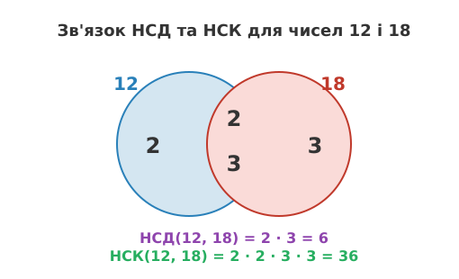

# НСК (Найменше спільне кратне): Глибока теорія

<preknowlist>
- [НСД (Найбільший спільний дільник)](/book/math/number-theory/gcd/)
- [Прості числа та основна теорема арифметики](/book/math/number-theory/primes/)
- [Подільність і остачі](/book/math/number-theory/divisibility/)
</preknowlist>

> 🔧 **Навіщо це.** Найменше спільне кратне (НСК) — це фундаментальний концепт для роботи з періодичними процесами, синхронізацією систем та дробовою арифметикою. Якщо ви маєте набір незалежних подій із різними частотами, НСК математично визначає точний момент, коли всі ці події відбудуться одночасно. У дискретній математиці, теорії чисел та криптографії розуміння алгебраїчних властивостей НСК та його зв'язку з простими числами відіграє критичну роль у побудові складних систем, від планувальників задач у ядрі ОС до алгоритмів шифрування.

Найменше спільне кратне (НСК, в англійській традиції Least Common Multiple — LCM) — це одне з тих понять, які здаються тривіальними на перший погляд, але приховують у собі глибоку алгебраїчну структуру. У школі нам казали просто "знайдіть спільний знаменник", щоб додати два дроби, і ми інтуїтивно шукали найменше число, що ділиться на обидва знаменники без остачі. Однак, коли ми переходимо від шкільних прикладів до серйозної математики, інтуїції стає недостатньо. 

Що робить НСК таким особливим? Чому саме "найменше", а не просто "спільне"? Яким чином структура цього числа пов'язана із самою тканиною простих чисел, з яких зітканий увесь всесвіт цілих чисел? У цій розлогій статті ми відкинемо поверхневі пояснення і зануримося у фундаментальну сутність НСК. Ми дослідимо його анатомію через призму Основної теореми арифметики, виведемо його нерозривний зв'язок з Найбільшим спільним дільником (НСД) та розглянемо строгі математичні доведення, що лежать в основі цих концепцій. Цей матеріал вимагає зосередженості, адже ми будуватимемо розуміння з найпростіших аксіом до рівня професійної теорії чисел.

## 1. Фундаментальне визначення та множина кратностей

Давайте почнемо з найсуворішого фундаменту. Розглянемо два цілих числа a та b (де a не дорівнює нулю і b не дорівнює нулю). Що таке кратне? Число k називається кратним числа a, якщо існує таке ціле число m, що k = a · m. Або, інакше кажучи, k ділиться на a без остачі (позначається a | k, тобто "a ділить k").

Якщо ми випишемо множину всіх додатних кратностей числа a, ми отримаємо нескінченну прогресію:
A = {a, 2a, 3a, 4a, 5a, ...}

Аналогічно, для числа b множина додатних кратностей виглядатиме так:
B = {b, 2b, 3b, 4b, 5b, ...}

Множина спільних кратностей (Common Multiples) цих двох чисел — це просто математичний перетин цих двох множин (A ∩ B). Тобто, це всі ті числа, які діляться одночасно і на a, і на b. 
Наприклад, для a = 4 та b = 6:
A = {4, 8, 12, 16, 20, 24, 28, 32, 36, ...}
B = {6, 12, 18, 24, 30, 36, ...}
A ∩ B = {12, 24, 36, 48, ...}

Очевидно, що множина спільних кратностей ніколи не буває порожньою. Як мінімум, добуток чисел |a · b| завжди буде знаходитися в цьому перетині, оскільки воно очевидно ділиться і на a, і на b. А оскільки множина додатних цілих чисел завжди містить найменший елемент (згідно з принципом цілком впорядкованості натуральних чисел, Well-Ordering Principle), ця множина перетину обов'язково повинна мати найменший елемент.

Саме цей найменший елемент перетину множин кратностей і називається **Найменшим спільним кратним (НСК)** чисел a та b. Воно позначається як lcm(a, b). 
За визначенням, це число M таке, що:
1. a | M та b | M (тобто M є спільним кратним).
2. Для будь-якого іншого числа X, якщо a | X та b | X, то M ≤ X.

Важливо зауважити одну виняткову деталь, яка відрізняє "найменше" від "найкращого". Будь-яке інше спільне кратне чисел a та b гарантовано ділиться на їхнє НСК без остачі. Тобто, якщо X — будь-яке спільне кратне a та b, то lcm(a, b) | X. У нашому прикладі НСК(4, 6) = 12, і всі інші спільні кратні {24, 36, 48} ідеально діляться на 12. Це ключова властивість, яка робить НСК "генератором" усіх інших спільних кратностей.

## 2. Анатомія числа: Розклад на прості множники

Тепер, коли ми маємо строге визначення, ми можемо заглянути всередину чисел. Відповідно до Основної теореми арифметики, кожне натуральне число, більше за 1, можна унікально подати як добуток простих чисел (з точністю до порядку множників). Це ніби унікальний ДНК-код числа.

Нехай ми маємо два числа a та b. Ми можемо розкласти їх на прості множники:
a = p₁^{a₁} · p₂^{a₂} · ... · pₖ^{aₖ}
b = p₁^{b₁} · p₂^{b₂} · ... · pₖ^{bₖ}

Тут p₁, p₂... — це прості числа (2, 3, 5, 7, 11 і так далі), а aᵢ та bᵢ — їхні невід'ємні цілі степені. Навіть якщо певного простого числа немає в розкладі одного з чисел, ми все одно включаємо його до формули зі степенем 0 (оскільки будь-яке число в нульовому степені дорівнює 1). 

Що означає, що число M є кратним числа a? З точки зору простих множників, це означає, що M повинно містити принаймні стільки ж кожного простого множника, скільки містить число a. Тобто, якщо розклад M має вигляд p₁^{m₁} · p₂^{m₂} · ... · pₖ^{mₖ}, то для того, щоб M ділилося на a, повинна виконуватися умова: mᵢ ≥ aᵢ для всіх i.
Одночасно, щоб M ділилося на b, повинна виконуватися умова: mᵢ ≥ bᵢ для всіх i.

Оскільки M має бути *найменшим* спільним кратним, його показники степенів mᵢ повинні бути найменшими можливими, але при цьому задовольняти обидві умови. Математично, найменше ціле число mᵢ, яке більше або дорівнює і aᵢ, і bᵢ — це просто їхній максимум!
mᵢ = max(aᵢ, bᵢ)

Отже, ми отримуємо дивовижно красиву формулу для НСК через прості множники:
**lcm(a, b) = p₁^{max(a₁, b₁)} · p₂^{max(a₂, b₂)} · ... · pₖ^{max(aₖ, bₖ)}**

### Детальний розбір на прикладі

Візьмемо числа 120 і 84.
Розкладемо їх на прості множники:
120 = 8 · 3 · 5 = 2³ · 3¹ · 5¹ · 7⁰
84 = 4 · 3 · 7 = 2² · 3¹ · 5⁰ · 7¹

Зверніть увагу, що ми додали 7⁰ до розкладу 120 і 5⁰ до розкладу 84, щоб обидва числа мали однакову структуру простих баз, що спрощує подальше порівняння.

Тепер застосовуємо формулу, вибираючи максимуми для кожного степеня:
- Для бази 2: max(3, 2) = 3. Беремо 2³.
- Для бази 3: max(1, 1) = 1. Беремо 3¹.
- Для бази 5: max(1, 0) = 1. Беремо 5¹.
- Для бази 7: max(0, 1) = 1. Беремо 7¹.

Збираємо все разом:
lcm(120, 84) = 2³ · 3¹ · 5¹ · 7¹ = 8 · 3 · 5 · 7 = 840.
Число 840 є найменшим числом, яке без остачі ділиться і на 120, і на 84. Воно зібрало у собі достатньо "матеріалу" від обох чисел, щоб обидва могли в ньому повністю розчинитися, але не взяло жодного зайвого атома.

## 3. Симетрія з НСД: Велика Теорема Зв'язку

Цей метод через розклад на прості множники неперевершений для глибокого розуміння природи НСК. Проте він має один катастрофічний недолік у практичному застосуванні. Щоб знайти НСК таким шляхом, потрібно спочатку факторизувати (розкласти на прості множники) обидва числа. Проблема полягає в тому, що факторизація великих чисел — це надзвичайно складна обчислювальна задача (саме на цій складності базується безпека всього сучасного інтернету, зокрема криптографія RSA). 

Тому математики знайшли інший, набагато елегантніший шлях. Він пролягає через розуміння симетрії між Найменшим спільним кратним та його двійником — Найбільшим спільним дільником (НСД).

Згадаймо, як визначається НСД через прості множники. Якщо НСК — це "найменше спільне накриття", яке вимагає максимуму, то НСД — це "найбільший спільний фундамент", який вимагає мінімуму.
gcd(a, b) = p₁^{min(a₁, b₁)} · p₂^{min(a₂, b₂)} · ... · pₖ^{min(aₖ, bₖ)}

Що станеться, якщо ми помножимо НСД на НСК? Спробуємо перемножити їхні подання через прості множники.
gcd(a, b) · lcm(a, b) = 
= (p₁^{min(a₁, b₁)} · ... ) · (p₁^{max(a₁, b₁)} · ... )
= p₁^{min(a₁, b₁) + max(a₁, b₁)} · p₂^{min(a₂, b₂) + max(a₂, b₂)} · ...

Тут ми натрапляємо на просту, але потужну властивість будь-яких двох дійсних чисел x та y. Сума їхнього мінімуму та їхнього максимуму завжди дорівнює просто сумі цих чисел. 
min(x, y) + max(x, y) = x + y
Якщо x = 5 і y = 8, то min(5, 8) + max(5, 8) = 5 + 8 = 13.

Застосуємо цю властивість до наших показників степенів:
= p₁^{a₁ + b₁} · p₂^{a₂ + b₂} · ... · pₖ^{aₖ + bₖ}
= (p₁^{a₁} · p₂^{a₂} · ...) · (p₁^{b₁} · p₂^{b₂} · ...)
= a · b

Це фундаментальне відкриття! Ми щойно строго довели центральну теорему взаємозв'язку:
**Для будь-яких двох додатних цілих чисел a та b, добуток їхнього НСД та НСК дорівнює добутку самих цих чисел.**
gcd(a, b) · lcm(a, b) = a · b

(Якщо ми допускаємо від'ємні числа a та b, формула набуває вигляду gcd(a, b) · lcm(a, b) = |a · b|, оскільки НСД та НСК завжди визначаються як додатні величині).

Ця теорема має колосальне практичне значення. Вона дозволяє нам знайти НСК взагалі без розкладу на прості множники! Ми можемо просто ізолювати НСК у цій рівності:
**lcm(a, b) = (a · b) / gcd(a, b)**

Оскільки НСД можна обчислити надзвичайно швидко і ефективно за допомогою Алгоритму Евкліда (який не вимагає факторизації і працює лише через ділення з остачею), ми отримуємо можливість рахувати НСК для гігантських чисел за лічені мікросекунди. 

Але зверніть увагу на одну деталь. З математичної точки зору, порядок операцій не має значення. Але у світі програмування, де обсяг пам'яті обмежений певними типами даних, множення (a · b) може викликати переповнення. Оскільки ми знаємо, що a ділиться на gcd(a, b) без остачі, ми завжди можемо (і повинні) змінити порядок на такий:
lcm(a, b) = (a / gcd(a, b)) · b. Це математично еквівалентно, але значно безпечніше.

## 4. Розширення на множини чисел

Ми вивчили, як шукати НСК для двох чисел. Але в реальних задачах ми часто стикаємося з необхідністю синхронізувати три, чотири або більше періодичних процесів. Як знайти НСК(a, b, c)?

Ось тут на допомогу приходить властивість асоціативності. НСК поводиться подібно до додавання чи множення. Ви можете групувати числа у будь-якому порядку, і фінальний результат від цього не зміниться.
lcm(a, b, c) = lcm(lcm(a, b), c) = lcm(a, lcm(b, c))

Це означає, що для знаходження НСК будь-якого масиву чисел, ми можемо обчислювати їх попарно, накопичуючи результат.
Наприклад, знайдемо НСК(12, 15, 20):
Крок 1: Знайдемо НСК перших двох чисел. lcm(12, 15).
gcd(12, 15) = 3.
lcm(12, 15) = (12 / 3) · 15 = 4 · 15 = 60.

Крок 2: Візьмемо отриманий результат і застосуємо функцію до третього числа. lcm(60, 20).
gcd(60, 20) = 20.
lcm(60, 20) = (60 / 20) · 20 = 3 · 20 = 60.

Отже, НСК(12, 15, 20) = 60. Це найменше число, яке ділиться на 12, 15 і 20 одночасно. 

Цей ітеративний підхід гарантує, що ми завжди працюємо лише з двома числами одночасно, застосовуючи до них наш швидкий алгоритм через НСД, і поступово "втягуємо" до спільного кратного всі нові й нові числа. Якщо хоча б одне число у масиві дорівнює нулю, НСК всього масиву стає нулем, адже нуль "поглинає" всі інші вимоги до кратності.

## 5. НСК і взаємна простота

Особливий інтерес викликає ситуація, коли числа a та b не мають жодних спільних простих множників, окрім одиниці. Такі числа називаються взаємно простими (Coprime). У цьому випадку їхній Найбільший спільний дільник gcd(a, b) дорівнює 1.

Подивимося, що станеться з нашою головною формулою:
lcm(a, b) = (a · b) / gcd(a, b)
Якщо gcd(a, b) = 1, то:
lcm(a, b) = (a · b) / 1 = a · b

Отже, якщо числа взаємно прості, їхнє Найменше спільне кратне — це просто їхній добуток. Це найбільш "поганий" випадок з точки зору мінімізації кратного, адже числам немає на чому "зекономити", і їм доводиться перемножувати свої значення повністю, щоб знайти точку зустрічі.

Наприклад, числа 8 і 15.
8 = 2³. 15 = 3 · 5. 
Спільних множників немає. НСД(8, 15) = 1.
Тому НСК(8, 15) = 8 · 15 = 120.

Ця властивість інтенсивно використовується в механіці та інженерії. Якщо ви проектуєте систему з кількох шестерень і хочете, щоб вони зношувалися рівномірно (тобто щоб одні й ті самі зубці зустрічалися якомога рідше), вам потрібно підібрати кількості зубців так, щоб вони були взаємно простими числами. Тоді період до їхньої повторної зустрічі буде максимальним — він дорівнюватиме повному добутку кількості зубців, що гарантує ідеальний розподіл навантаження на весь механізм. 

Розуміння НСК розкриває перед нами витончену симетрію математичного світу. Воно показує, що пошук спільних знаменників — це не просто механічна операція з дробами, а глибока взаємодія простих множників, керована строгими законами максимуму та мінімуму. Озброєні зв'язком із НСД та алгоритмом Евкліда, ми здатні приборкувати процеси з будь-якими частотами, обчислюючи їхні глобальні цикли легко та елегантно.
