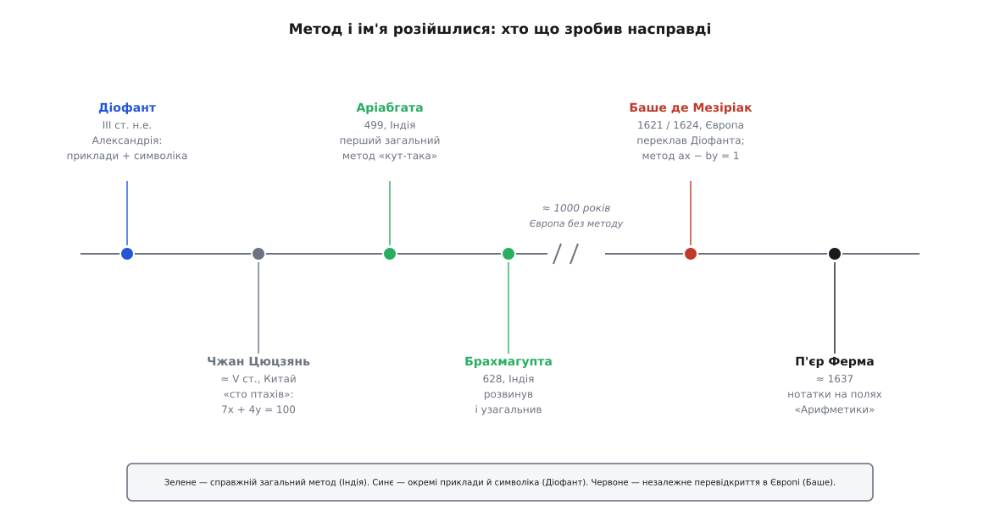

# 📜 Діофант, «Арифметика» й індійський «подрібнювач»

Рівняння a·x + b·y = c носить ім'я александрійського грека, а систематичний спосіб розв'язувати його в цілих числах дала зовсім інша школа — індійська, і дала на тисячу років раніше, ніж Європа цей спосіб перевідкрила. Тут розплутано, хто що зробив насправді: чиє ім'я на рівнянні, чий метод усередині — і чому це різні люди з різних кінців світу.

## Діофант і доля «Арифметики»

Про самого Діофанта Александрійського (гр. Διόφαντος) відомо ганебно мало — навіть коли він жив, кажуть лише приблизно: десь III століття нашої ери, з дат-орієнтирів у пізніших джерелах виходить проміжок між 200 і 284 роком. Працював в Александрії — тогочасному осередку елліністичної науки в римському Єгипті; ким був за походженням, джерела не кажуть, тож «грек» тут означає мову й наукову традицію, а не встановлений родовід.

Його головна праця — «Арифметика» (гр. Ἀριθμητικά), збірка з тринадцяти книг, з яких до нас дійшло шість у грецькому оригіналі й ще чотири — в арабському перекладі Кости ібн Луки, знайденому аж 1968 року в бібліотеці іранського Мешхеда. Це не підручник із загальними правилами, а разок хитромудрих задач: кожна розв'язується власним дотепним підстановленням, а не спільним алгоритмом. Діофант шукав розв'язки в додатних раціональних числах — від'ємні й ірраціональні він за відповіді не визнавав, — а найбільше кохався в задачах, де розв'язків багато, а рівнянь замало, щоб їх притиснути до одного. Саме такі рівняння, «невизначені», згодом і назвуть діофантовими.

Одне його нововведення справді велике: скорочений запис. Замість виписувати умову словами, Діофант увів позначки для невідомого та його степенів — перший відомий нам крок від суцільної прози до символів. Історики звуть це «синкопованою» алгеброю: вже не риторика, ще не наша формула. За це його часто величають «батьком алгебри» — титул, який він, утім, ділить із пізнішим аль-Хорезмі й який, як більшість таких титулів, радше церемоніальний, ніж точний. Бо головного для нашої історії в «Арифметиці» немає: немає загального рецепта, який будь-яке рівняння a·x + b·y = c у цілих зводить до кількох ділень. Є блискучі окремі приклади — немає методу.

## Індійський «подрібнювач»

Метод народився деінде. Перший, хто його дав, — Аріабгата (санскр. Āryabhaṭa, 476 — бл. 550), який 499 року, двадцятитрирічним, уклав віршований трактат «Аріабгатія». Виклад умисне стислий: два вірші (32–33) розділу «Ґанітапада», зашифровані так щільно, що самотужки їх майже не прочитати. Розкрив і пояснив метод наступник — Бгаскара I (санскр. Bhāskara I, бл. 600 — бл. 680) у коментарі 629 року; він же дав методові назву **кут-така** (санскр. kuṭṭaka — «подрібнювач», те, що товче на порох). Назва точна до буквальності: алгоритм раз за разом дробить великі коефіцієнти на дедалі менші, доки не лишиться крихта, з якої відповідь збирається назад. За тих самих років Брахмагупта (санскр. Brahmagupta, 598–668) у трактаті 628 року метод розвинув і поширив на складніші рівняння.

А тепер суть, задля якої це все. Кут-така подрібнює a і b тим самим ходом, що й [алгоритм Евкліда](topic:math/gcd-euclidean): ділиш більше на менше, береш остачу, повторюєш із меншим числом і остачею — і так, доки остача не обнулиться. Індійці лише вели цей ланцюг ділень «назад», щоб із найбільшого спільного дільника відновити самі коефіцієнти x та y. Іншими словами, кут-така — це те, що сьогодні звуть розширеним алгоритмом Евкліда, за тисячу з гаком років до того, як його так назвали в Європі. Не натяк і не окремий приклад, а повний, робочий, загальний рецепт для a·x + b·y = c.

> 🔧 **Навіщо це знати.** Історія кут-таки — щеплення проти двох поширених хиб: «як зветься, той і винайшов» та «Європа все придумала сама». Той самий алгоритм незалежно виринув в Індії, жеврів у Китаї на прикладах і вдруге народився в Європі — бо він не примха культури, а неминучий наслідок ділення з остачею. Коли натрапляєте на «формулу імені такого-то», варто питати окремо: хто мав ідею, хто її довів, хто побудував загальний метод і хто дав назву. Це майже завжди різні люди.

## «Сто птахів» Чжан Цюцзяня

Що метод був потрібен не тільки індійцям, видно з Китаю. У «Математичному трактаті Чжан Цюцзяня» (кит. 張邱建算經, V ст.) стоїть головоломка, яка пережила півтори тисячі років і розійшлася потім по всьому світу, — «сто птахів за сто монет». Півень коштує 5 монет, курка — 3, а курчата йдуть по троє за монету; купити треба рівно сто птахів рівно за сто монет. Скільки яких?

Тут три невідомі — півні x, курки y, курчата z — і дві умови:

```
 x +  y + z   = 100      (птахів — сто)
5x + 3y + z/3 = 100      (монет — сто)
```

Дріб заважає, тож помножмо друге рівняння на 3 й віднімімо від нього перше:

```
15x + 9y + z = 300       ← друге ×3
−(  x +  y + z = 100 )   ← мінус перше
──────────────────────
14x + 8y = 200      →      7x + 4y = 100
```

Три невідомі згорнулися в одне лінійне рівняння з двома — рівно той тип, що його розв'язує кут-така. Невід'ємних розв'язків тут кілька; Чжан Цюцзянь наводить три, де присутні всі три породи птаха:

```
x = 4,   y = 18,   z = 78
x = 8,   y = 11,   z = 81
x = 12,  y = 4,    z = 84
```

Формально годиться й четвертий — нуль півнів, 25 курок, 75 курчат, — та півень у господі був бажаний, тож його зазвичай не рахують. Джерело методу тут інше, а рівняння — те саме: різні культури наштовхувалися на один клас задач, і кожна шукала свій ключ.

## Баше повертає метод у Європу

У Європі метод з'явився заново — і теж не з Індії, а з тієї ж «Арифметики». 1621 року французький математик Клод-Гаспар Баше де Мезіріак (фр. Claude-Gaspard Bachet de Méziriac, 1581–1638) видав Діофанта латиною — грецький текст із власними коментарями. Це видання зробило «Арифметику» настільною книжкою європейських числолюбів.

А в другому виданні своєї збірки цікавих задач «Problèmes plaisants et délectables» (1624) Баше вмістив те, чого в Діофанта якраз і бракувало, — загальний розв'язок рівняння a·x − b·y = 1 для взаємно простих a і b (його «Твердження XVIII»). Спосіб він вивів через [ланцюгові дроби](topic:math/continued-fractions) — а ланцюговий дріб числа a/b є не що інше, як записаний стовпчиком алгоритм Евкліда. Тобто Баше, працюючи від задач Діофанта, самостійно дійшов рівно до того подрібнювача, що його Індія знала ще від Аріабгати, — не знаючи ні про кут-таку, ні про те, що відтворює найдавніший алгоритм у всій математиці. Одну й ту саму дорогу проклали двічі, за тисячу років і десять тисяч кілометрів одне від одного.

## Ферма на полях — і як прижилося ім'я

Лишалося дати всьому імена. Свій примірник Діофанта в перекладі Баше читав П'єр де Ферма (фр. Pierre de Fermat, пом. 1665), і читав з пером: на берегах «Арифметики» він занотовував власні здогади. Одна з них, коло восьмої задачі другої книги, стала найзнаменитішою нотаткою в історії математики — твердження, що рівняння xⁿ + yⁿ = zⁿ не має цілих розв'язків при n ≥ 3, «для якого я знайшов воістину чудовий доказ, та поля затісні, щоб його вмістити». Ферма зробив цей запис близько 1637 року; оприлюднив нотатки його син 1670-го, перевидавши Баше вже з батьковими примітками. Твердження назвуть Великою теоремою Ферма, і доведуть його аж наприкінці XX століття (Ендрю Вайлз, 1994) — через понад три з половиною сторіччя.

Ось так ім'я й прижилося. Європейські математики XVII століття вчилися теорії чисел за Діофантом у виданні Баше; коли Ферма, а за ним Ейлер бралися за рівняння «знайти цілі розв'язки», вони звали їх діофантовими — за книжкою, з якої починали, а не за тим, хто дав метод. Назва — це вказівник на текст, а не патент на винахід.

## Хто що зробив: чесний підсумок

Розкладімо заслуги, не змішуючи їх:

- **Діофант** (III ст.) дав окремі хитромудрі приклади й перший символ для невідомого — але не загальний метод для a·x + b·y = c, та й шукав розв'язки в раціональних числах, а не в цілих.
- **Індійська школа** — Аріабгата (499), названо й пояснено Бгаскарою I, розвинено Брахмагуптою (628) — дала справжній загальний алгоритм, кут-таку, тобто розширений Евклід за тисячу років до Європи.
- **Чжан Цюцзянь** (V ст.) показав, що той самий клас задач незалежно зринав і в Китаї.
- **Баше** (1621 / 1624) перевідкрив метод у Європі, від Діофанта, не знаючи індійців.
- **Ферма** нотатками на берегах Баше зробив «Арифметику» відправною точкою нової теорії чисел — і закріпив за рівняннями ім'я, яке дісталося не тому, хто знайшов ключ.


*Ім'я стоїть на початку осі, метод — усередині, а розрив показує тисячолітню прогалину, доки Європа не мала цього способу. Синє — окремі приклади й перший символ (Діофант). Зелене — справжній загальний алгоритм, кут-така (Аріабгата → Брахмагупта). Червоне — незалежне перевідкриття від того ж таки Діофанта (Баше). Ферма нотатками на полях Баше закріпив за рівняннями ім'я, яке належить не тому, хто винайшов метод.*

Тож коли рівняння зветься «діофантовим», це данина книжці, що навчила Європу ставити питання про цілі розв'язки, — а не свідоцтво про те, чиїми руками складено ключ. Метод старший за своє ім'я і належить щонайменше двом культурам, які дійшли до нього нарізно.
