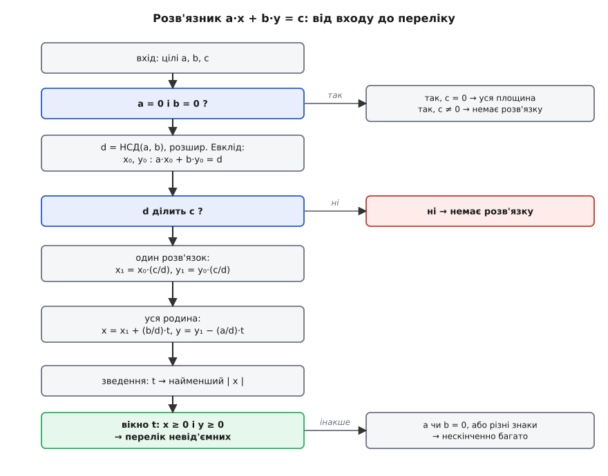

# ⚙️ Діофантове рівняння в коді

<preknowlist>
- [НСД і розширений алгоритм Евкліда](topic:math/gcd-euclidean) — як за кілька ділень знайти d = НСД(a, b) і як розширена версія дорогою повертає пару x₀, y₀ з рівності a·x₀ + b·y₀ = d (тотожність Безу).
- [Модульна арифметика](topic:math/modular-arithmetic) — ділення із залишком `a = q·b + r`, подільність `d | c` та оператор остачі `%`, знак якого залежить від мови.
</preknowlist>

Уся теорія рівняння a·x + b·y = c — критерій розв'язності, перший розв'язок, ціла родина, вікно невід'ємних — уміщається в один невеликий розв'язник: подаєте три цілі числа, дістаєте вирок «є / немає», один охайний розв'язок, формулу всієї родини й, коли треба, готовий перелік пар з x ≥ 0, y ≥ 0. Тут зберемо цей розв'язник по цеглині робочим кодом на C++ і Python — разом із пастками, що чигають саме на реалізацію, а не на теорію.

## Що має вміти розв'язник

Задача — дати чотири відповіді на трійку цілих (a, b, c):

- **Чи існує розв'язок?** Одне ділення: d = НСД(a, b) мусить ділити c.
- **Один розв'язок** — пара (x₁, y₁), бажано найменша за модулем, а не та монструозна, що падає з масштабування коефіцієнтів.
- **Уся родина** — крок (b/d, −a/d) і вільний цілий параметр t.
- **Перелік невід'ємних** — усі пари з x ≥ 0 і y ≥ 0, коли предмети не можна «повертати».

І код не має падати на вироджених входах: a = 0, b = 0 чи обидва нулі. Ось control-flow, який зараз наповнимо кодом:


*Дорога від трьох чисел до відповіді. Гілки праворуч — це три виходи «немає розв'язку» (критерій провалено або вироджений вхід суперечливий); центральна колона — щасливий шлях: розширений Евклід дає перший розв'язок, масштабування дотягує його до c, зведення робить його охайним, а вікно параметра t відсіює невід'ємні пари.*

## Скелет: розширений Евклід

Серце розв'язника — [розширений алгоритм Евкліда](topic:math/gcd-euclidean/math-bezout.md): він не лише знаходить d = НСД(a, b), а й дорогою повертає пару x₀, y₀, для якої a·x₀ + b·y₀ = d. Це та єдина цеглина, з якої виросте все інше; сам він — три паралельні рекурентні стовпчики, що йдуть в ногу з діленнями Евкліда.

:::tabs
```cpp
#include <vector>
#include <algorithm>
using ll = long long;

// a·x + b·y = НСД(a, b); повертає сам НСД, пише x, y
ll ext_gcd(ll a, ll b, ll &x, ll &y) {
    ll r0 = a, r1 = b, s0 = 1, s1 = 0, t0 = 0, t1 = 1;
    while (r1 != 0) {
        ll q = r0 / r1;
        ll r = r0 - q * r1; r0 = r1; r1 = r;   // остача Евкліда
        ll s = s0 - q * s1; s0 = s1; s1 = s;   // коефіцієнт при a
        ll t = t0 - q * t1; t0 = t1; t1 = t;   // коефіцієнт при b
    }
    x = s0; y = t0;
    return r0;                                 // a·s0 + b·t0 == r0 == НСД
}
```
```python
def ext_gcd(a, b):
    old_r, r = a, b
    old_s, s = 1, 0                 # коефіцієнт при a
    old_t, t = 0, 1                 # коефіцієнт при b
    while r != 0:
        q = old_r // r
        old_r, r = r, old_r - q * r
        old_s, s = s, old_s - q * s
        old_t, t = t, old_t - q * t
    return old_r, old_s, old_t       # a·old_s + b·old_t == old_r == НСД
```
:::

Одна тонкість, з якої починаються всі подальші халепи зі знаками: цей НСД **не завжди додатний**. Для від'ємних входів `r0` наприкінці успадкує їхній знак — тож перш ніж рахувати щось далі, НСД доведеться нормувати.

## Повний розв'язок

Тепер збираємо `solve`. Порядок дій буквально повторює блок-схему: спершу вироджений вихід a = b = 0, потім НСД і його нормування, потім критерій d | c, масштабування першого розв'язку й, нарешті, зведення його до найменшого за модулем зсувом параметра t.

:::tabs
```cpp
struct Sol { int kind; ll x, y, sx, sy, d; };   // kind: 0 нема · 1 уся площина · 2 родина

Sol solve(ll a, ll b, ll c) {
    if (a == 0 && b == 0)                        // ліва частина завжди 0
        return { c == 0 ? 1 : 0, 0, 0, 0, 0, 0 };
    ll x0, y0, g = ext_gcd(a, b, x0, y0);
    if (g < 0) { g = -g; x0 = -x0; y0 = -y0; }   // НСД → додатний, знак на коефіцієнти
    if (c % g != 0)                              // критерій: d мусить ділити c
        return { 0, 0, 0, 0, 0, 0 };
    ll k = c / g;
    ll x1 = x0 * k, y1 = y0 * k;                 // ⚠ можливе переповнення (див. пастки)
    ll sx = b / g, sy = -(a / g);                // крок родини (b/d, −a/d)
    if (sx != 0) {                               // звести перший розв'язок до найменшого |x|
        ll m = sx < 0 ? -sx : sx;
        ll xr = ((x1 % m) + m) % m;              // C++ % буває від'ємним — нормуємо в [0, m)
        ll t = (xr - x1) / sx; x1 = xr; y1 += sy * t;
    } else {                                     // b = 0: x зафіксований, зводимо y
        ll m = sy < 0 ? -sy : sy;
        ll yr = ((y1 % m) + m) % m;
        ll t = (yr - y1) / sy; y1 = yr; x1 += sx * t;
    }
    return { 2, x1, y1, sx, sy, g };
}
```
```python
def solve(a, b, c):
    if a == 0 and b == 0:                        # ліва частина завжди 0
        return ("all", None) if c == 0 else ("none", None)
    g, x0, y0 = ext_gcd(a, b)
    if g < 0:                                    # НСД тримаємо додатним
        g, x0, y0 = -g, -x0, -y0
    if c % g != 0:                               # критерій: d мусить ділити c
        return ("none", None)
    k = c // g
    x1, y1 = x0 * k, y0 * k                       # один розв'язок (може бути величезний)
    sx, sy = b // g, -(a // g)                    # крок родини (b/d, −a/d)
    if sx != 0:                                   # звести перший розв'язок до найменшого |x|
        m = abs(sx); t = (x1 % m - x1) // sx
    else:                                         # b = 0: x зафіксований, зводимо y
        m = abs(sy); t = (y1 % m - y1) // sy
    return ("family", (x1 + sx * t, y1 + sy * t, sx, sy, g))
```
:::

Три рядки тут — не декор, а рівно ті переходи, без яких розв'язник брехатиме.

**Критерій `c % g`.** Якщо d не ділить c, виходимо одразу, ще до `c / g`. Порядок важливий: спокуслива ідея «порахувати c/d і перевірити» ламається на цілочисельному діленні, яке мовчки округлить — і код видасть пару, що рівнянню не задовольняє. Спершу остача, потім усе решта.

**Масштабування.** Безу дає a·x₀ + b·y₀ = d; множимо всю рівність на k = c/d і дістаємо a·(x₀k) + b·(y₀k) = c. Це вже розв'язок — але часто жахливий на вигляд.

**Зведення.** Візьмімо марки по 5 і по 8 копійок на 43 копійки. Розширений Евклід дає 5·(−3) + 8·2 = 1; масштабування на 43 роздуває це у (−129, 86) — формально вірно, а по суті нікчемно. Крок родини тут (b/d, −a/d) = (8, −5), тож x пробігає …, −129, −121, …, −1, **7**, 15, … з періодом 8. Один рядок `t = (x1 % m - x1) // sx` вибирає t так, щоб x упав рівно у вікно [0, 8), тобто в 7, і тягне за собою y = 1. Замість монстра — охайне (7, 1):

**Зведення (−129, 86) → найменший за модулем розв'язок.**
```
крок (b/d, −a/d) = (8, −5),   m = |8| = 8
x1 % m = (−129) mod 8         # у Python одразу 7; у C++ через ((x%m)+m)%m
t = (7 − (−129)) / 8 = 17
x = −129 + 8·17 = 7           y = 86 − 5·17 = 1
перевірка:  5·7 + 8·1 = 43    ✓
```

Один виклик `solve(5, 8, 43)` повертає `(7, 1, 8, −5, 1)` — розв'язок, крок і НСД, з яких дальший код відновить будь-яку іншу пару.

## Перелік невід'ємних

Родина x = x₁ + (b/d)·t, y = y₁ − (a/d)·t тягнеться в обидва боки нескінченно. Умова x ≥ 0, y ≥ 0 відрізає від неї скінченний шматок — і весь фокус у тім, щоб знайти вікно допустимих t, не перебираючи пряму навмання. Кожна нерівність — це coef·t + base ≥ 0, а вона рівносильна одній межі на t: додатний coef дає межу знизу, від'ємний — згори.

:::tabs
```cpp
ll floordiv(ll a, ll b) { ll q = a / b; if (a % b && a < 0) q--; return q; }  // b>0
ll ceildiv (ll a, ll b) { ll q = a / b; if (a % b && a > 0) q++; return q; }  // b>0

// -1 → нескінченно багато; 0 → жодного (або a=b=0); >0 → перелік у out
int nonneg(ll a, ll b, ll c, std::vector<std::pair<ll,ll>> &out) {
    Sol s = solve(a, b, c);
    if (s.kind != 2) return 0;
    bool haveLo = false, haveHi = false; ll lo = 0, hi = 0;
    ll co[2] = { s.sx, s.sy }, ba[2] = { s.x, s.y };
    for (int i = 0; i < 2; i++) {
        ll coef = co[i], base = ba[i];
        if (coef == 0) { if (base < 0) return 0; continue; }   // координата фіксована й від'ємна
        if (coef > 0) { ll v = ceildiv(-base, coef);           // t ≥ ⌈−base/coef⌉
                        lo = haveLo ? std::max(lo, v) : v; haveLo = true; }
        else          { ll v = floordiv(base, -coef);          // t ≤ ⌊base/(−coef)⌋
                        hi = haveHi ? std::min(hi, v) : v; haveHi = true; }
    }
    if (!haveLo || !haveHi) return -1;                         // вікно відкрите з одного боку
    for (ll t = lo; t <= hi; t++)
        out.push_back({ s.x + s.sx * t, s.y + s.sy * t });
    return (int)out.size();
}
```
```python
def nonneg(a, b, c):
    kind, data = solve(a, b, c)
    if kind != "family":
        return kind, []                          # "none" або "all"
    x1, y1, sx, sy, g = data
    lo = hi = None                               # межі на t: lo ≤ t ≤ hi
    for coef, base in ((sx, x1), (sy, y1)):
        if coef == 0:                            # координата зафіксована
            if base < 0:
                return "none", []                # …і вона від'ємна — розв'язків немає
            continue
        if coef > 0:                             # t ≥ ⌈−base/coef⌉
            v = -(base // coef)
            lo = v if lo is None else max(lo, v)
        else:                                    # t ≤ ⌊base/(−coef)⌋
            v = base // -coef
            hi = v if hi is None else min(hi, v)
    if lo is None or hi is None:                 # вікно відкрите з одного боку
        return "infinite", []
    return "list", [(x1 + sx * t, y1 + sy * t) for t in range(lo, hi + 1)]
```
:::

Дві нерівності стягують t у відрізок [lo, hi]; лишається пробігти по ньому цілими. Зберімо, скажімо, 100 одиниць порціями по 5 і по 3:

**Усі невід'ємні розв'язки 5·x + 3·y = 100.**
```
solve → перший розв'язок (2, 30),  крок (3, −5)
x = 2 + 3t ≥ 0  →  t ≥ ⌈−2/3⌉ = 0
y = 30 − 5t ≥ 0 →  t ≤ ⌊30/5⌋ = 6
t = 0 … 6  →  (2,30) (5,25) (8,20) (11,15) (14,10) (17,5) (20,0)
```

Сім способів — рівно стільки вузлів пряма кладе в перший квадрант. Якщо ж потрібен лише **підрахунок**, скільки їх, а не сам перелік, його дає без жодного циклу довжина відрізка: hi − lo + 1 цілих t (тут 6 − 0 + 1 = 7).

## Складність

Уся вартість — у пошуку НСД. Розширений Евклід робить O(log min(|a|, |b|)) ділень; найгірший вхід — сусідні числа Фібоначчі, на яких частки завжди рівні одиниці й залишок спадає якнайповільніше (докладніше — [алгоритм Евкліда](topic:math/gcd-euclidean)). Масштабування й зведення — це кілька арифметичних дій, O(1). Перелік невід'ємних додає O(N), де N — кількість пар у вікні; коли їх багато, домінує вже сам вивід, а не обчислення. Разом: **O(log min(a, b))** на всю відповідь «є / немає / один розв'язок / родина» плюс лінійний час на друк переліку.

## Пастки, що коштують годин

Теорія тут проста, а порізатися легше, ніж здається — і майже завжди на цілих числах, а не на математиці.

**Знак НСД і остача в C++.** Розширений Евклід на від'ємних входах повертає від'ємний d; лишити його таким — і критерій `c % g`, і крок (b/d, −a/d) попливуть. Тому одразу нормуємо d до додатного, переносячи знак на x₀, y₀. Друга половина тієї ж пастки — оператор `%`: у C++ його результат успадковує знак **діленого**, тож `x1 % m` буває від'ємним, і зведення у вікно [0, m) вимагає `((x1 % m) + m) % m`. Python повертає остачу знаку **дільника** (для додатного m — завжди невід'ємну), тож там формула коротша, але та сама подвійна нормалізація безпечна й тут.

**Вироджені входи.** Три випадки, на яких наївний код або ділить на нуль, або зациклюється:

- **a = b = 0.** Ліва частина тотожно нульова: якщо c = 0 — розв'язок будь-яка пара (уся площина), якщо c ≠ 0 — жодного. Крок (b/d, −a/d) тут не визначений (d = 0), тому цей випадок перехоплюємо найпершим рядком, до всякого ділення.
- **Рівно один нуль**, скажімо b = 0. Змінна y зникає з рівняння, x фіксований у c/a, а y вільний — крок стає (0, ±1). Невід'ємних розв'язків або нескінченно (усі y ≥ 0), або жодного (якщо c/a < 0). Код мусить це впіймати, а не крутити нескінченний `for`.
- **a і b різного знаку.** Пряма має додатний нахил і йде в перший квадрант без стелі — знову нескінченно багато невід'ємних пар.

Спільна ознака двох останніх у коді одна: вікно t виходить **відкритим з одного боку** — бракує або нижньої, або верхньої межі (`haveLo`/`haveHi`). Саме тому `nonneg` повертає окремий код «нескінченно», а не список: інакше цикл `for t` не має де спинитися.

**Переповнення — найтихіша міна.** Масштабування x₀·(c/d) руйнівне непомітно. Коефіцієнт Безу x₀ буває за модулем близький до b/d, а множник c/d — величезний; їхній добуток легко перестрибує 2⁶³. У Python число просто росте — довга арифметика без стелі; у C++ `long long` мовчки переповнюється, і весь дальший розв'язок стає сміттям без жодного попередження. Саме тому обидві вкладки тут не косметика: одна й та сама логіка на одному стеку абсолютно надійна, на іншому — крихка. Два способи закритися в C++: рахувати проміжок у `__int128` з перевіркою діапазону, або — надійніше — звести x у вікно [0, |b/d|) **ще до множення**, а другу координату дістати прямо з рівняння:

```
y = (c − a·x) / b        # ділення точне: (x, y) лежить на прямій
```

Тоді жодного гігантського проміжного добутку не виникає взагалі — x уже малий, а y відновлюється одним діленням.

**Монструозний перший розв'язок.** Насамкінець — те, що злютовує все докупи. Масштабування дає формально правильну, але часто безглузду пару на кшталт (−129, 86). Не піддавайтеся спокусі повернути її «як є»: рядок зведення коштує одну операцію взяття остачі, а перетворює −129 на 7. Розв'язник, що друкує −129 там, де існує 7, технічно правий і практично непридатний.
