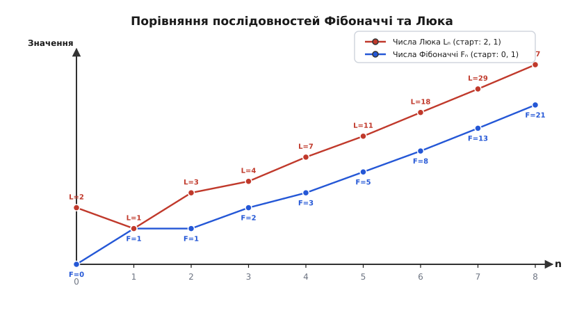
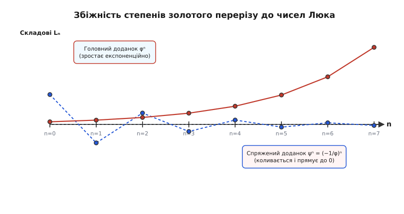
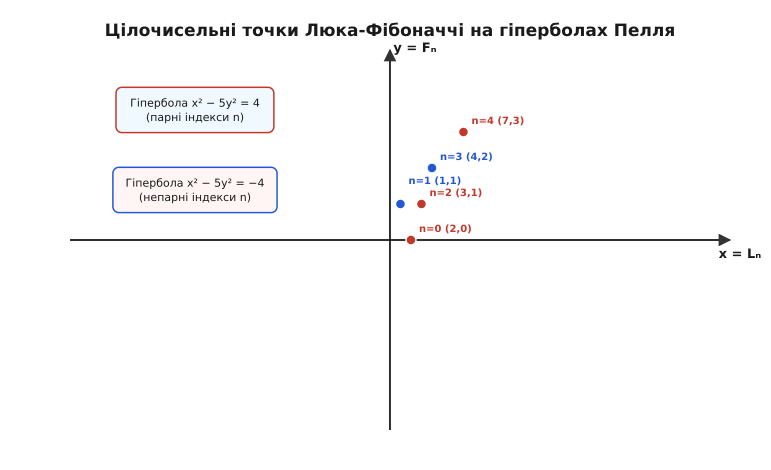
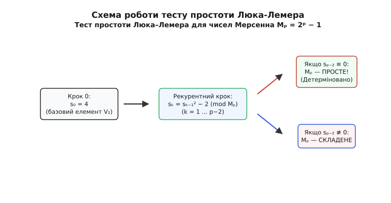

# Числа Люка

<preknowlist>
- [Числа Фібоначчі](book:math/fibonacci-numbers) — послідовність із тим самим рекурентним правилом, але іншими початковими умовами (0 і 1); сестра чисел Люка.
- [Золотий переріз](book:math/golden-ratio) — ірраціональне число φ = (1 + √5)/2, корінь характеристичного рівняння, степені якого визначають зростання послідовностей Фібоначчі та Люка.
- [Рівняння Пелля](book:math/pell-equation) — квадратичне діофантове рівняння x² − D·y² = 1, пов'язане з тотожністю Люка–Пелля та характеристичними формами.
- [Математична індукція](book:math/mathematical-induction) — метод доведення тверджень для всіх натуральних чисел через крок від n до n+1.
- [Модульна арифметика](book:math/modular-arithmetic) — обчислення лишків за модулем m, запис a ≡ b (mod m) та їхні властивості.
- [НСД і алгоритм Евкліда](book:math/gcd-euclidean) — найбільший спільний дільник двох чисел та його обчислення послідовним діленням.
- [Матриці як дії](book:math/matrices-as-operations) — множення матриць і піднесення до степеня для швидкого обчислення рекурентних послідовностей.
</preknowlist>

Кожне наступне число дорівнює сумі двох попередніх — це правило знайоме з послідовності Фібоначчі. Але якщо замість звичного початку з 0 і 1 стартувати з чисел 2 і 1, розгортається зовсім інший числовий ряд:

```
2, 1, 3, 4, 7, 11, 18, 29, 47, 76, 123, 199, 322, 521, 843, 1364, 2207, 3571, 5778, …
```

Здавалося б, перед нами просто довільна варіація на ту саму тему: змінили перші дві цифри, а закон додавання залишили без змін. Проте вибір саме пари (2, 1) не є випадковою примхою. У ньому закладена алгебраїчна симетрія, яка робить ці числа — **числа Люка** (фр. *Lucas*, на честь французького математика Едуарда Люка, François Édouard Anatole Lucas) — незамінним дзеркальним партнером чисел Фібоначчі.

Чому саме старт із 2 і 1 створює унікальну математичну структуру, як ці числа пов'язують золотий переріз із цілочисельними квадратичними формами, і чому без них неможливо перевірити на простоту найбільші відомі числа у світовій обчислювальній практиці?


*Послідовності Фібоначчі Fₙ та Люка Lₙ ростуть за однаковим рекурентним законом, але зсув початкових умов робить числа Люка сумою сусідніх членів Фібоначчі.*

## Початкові умови як слід золотого перерізу

Позначмо n-й член послідовності Люка через `Lₙ`. Рекурентна формула за визначенням повторює фібоначчієву:

```
L₀ = 2
L₁ = 1
Lₙ = Lₙ₋₁ + Lₙ₋₂   для n ≥ 2
```

Аби зрозуміти глибоку внутрішню причину вибору L₀ = 2 та L₁ = 1, згадаємо, що характеристичне рівняння для рекурентного правила `xₙ = xₙ₋₁ + xₙ₋₂` має вигляд:

```
λ² − λ − 1 = 0
```

Його коренями є два ірраціональні числа: додатний золотий переріз `φ` (грец. *phi*) та його алгебраїчно спряжене число `ψ` (грец. *psi*):

```
φ = (1 + √5) / 2 ≈  1.6180339887...
ψ = (1 − √5) / 2 ≈ −0.6180339887...
```

Загальний розв'язок будь-якої послідовності такого типу є лінійною комбінацією степенів цих двох коренів: `c₁·φⁿ + c₂·ψⁿ`. Коефіцієнти `c₁` та `c₂` повністю визначаються першими двома членами послідовності.

Подивимося, що станеться, якщо ми шукаємо найпростішу можливу симетричну суму степенів — чисто парну алгебраїчну форму без жодних додаткових множників чи знаменників у вигляді `√5`:

```
Sₙ = φⁿ + ψⁿ
```

Обчислимо перші два члени цієї теоретичної послідовності `Sₙ`, спираючись на базові властивості коренів `φ` та `ψ`:

```
S₀ = φ⁰ + ψ⁰ = 1 + 1 = 2
S₁ = φ¹ + ψ¹ = (1 + √5)/2 + (1 − √5)/2 = (1 + √5 + 1 − √5)/2 = 2/2 = 1
```

Ось де ховається головна алгебраїчна таємниця. Початкові значення L₀ = 2 та L₁ = 1 — це не випадковий вибір із стелі, а **прямий наслідок суми нульового та першого степенів коренів золотого перерізу**.

Для чисел Фібоначчі точна формула Біне вимагає ділення на `√5`, оскільки в ній береться не симетрична сума, а непарна різниця степенів:

```
Fₙ = (φⁿ − ψⁿ) / √5
```

Для чисел Люка точна формула не містить жодних ірраціональностей у знаменнику і береться безпосередньо у вигляді чистої суми двох алгебраїчних спряжених величин:

```
Lₙ = φⁿ + ψⁿ
```

Оскільки `ψ = −1/φ ≈ −0.618`, із зростанням індексу n величина `ψⁿ` швидко згасає і прямує до нуля, адже `|ψ| < 1`. Для парних n доданок `ψⁿ` завжди додатний, для непарних n — від'ємний. Проте в обох випадках абсолютна величина `|ψⁿ| < 0.5` виконується для всіх `n ≥ 2`.

Це дає разючий практичний висновок: n-не число Люка дорівнює найближчому цілому числу до n-го степеня золотого перерізу:

```
Lₙ = round(φⁿ)   для всіх n ≥ 2
```


*Степінь φⁿ прямує до нескінченності, а спряжений доданок ψⁿ згасає та коливається навколо нуля. Їхня сума утворює точні цілі числа Люка Lₙ.*

Простежимо цю збіжність на конкретних обчисленнях для перших індексів:

```
φ² ≈ 2.61803  ⟹  round(2.61803) = 3  = L₂
φ³ ≈ 4.23606  ⟹  round(4.23606) = 4  = L₃
φ⁴ ≈ 6.85410  ⟹  round(6.85410) = 7  = L₄
φ⁵ ≈ 11.09017 ⟹  round(11.09017) = 11 = L₅
φ⁶ ≈ 17.94427 ⟹  round(17.94427) = 18 = L₆
```

Аналогічно до чисел Фібоначчі, відношення двох сусідніх чисел Люка при прямуванні індексу n до нескінченності прямує до значення золотого перерізу:

```
lim (n → ∞) [ Lₙ₊₁ / Lₙ ] = φ
```

Однак алгебраїчний зв'язок між `Lₙ` та `Fₙ` виходить далеко за межі спільної границі відношень.

## Алгебраїчна структура поля ℚ(√5) та від'ємні індекси

Аби повністю осягнути природу чисел Люка, корисно подивитися на них через призму теорії алгебраїчних чисел. Розглянемо числове поле `ℚ(√5)`, що складається з усіх чисел вида `a + b·√5`, де `a` та `b` — раціональні числа.

У цьому полі степінь золотого перерізу `φⁿ` завжди можна розкласти за базисом `{1, √5}`. Використовуючи формули Біне для чисел Фібоначчі та Люка, дістаємо дивовижне тотожне розкладання для будь-якого цілого n:

```
φⁿ = (Lₙ + Fₙ·√5) / 2
ψⁿ = (Lₙ − Fₙ·√5) / 2
```

Це означає, що число Люка `Lₙ` є алгебраїчним **слідом** (*trace*) елемента `φⁿ` у числовому розширенні `ℚ(√5)/ℚ`:

```
Tr(φⁿ) = φⁿ + ψⁿ = Lₙ
```

А відношення `Fₙ` виступає в ролі коефіцієнта при ірраціональній частині `√5`. Таким чином, числа Люка та Фібоначчі утворюють координати степеня золотого перерізу у двовимірному векторному просторі над раціональними числами.

### Від'ємні індекси та розширення на від'ємну вісь

Рекурентне правило `Lₙ = Lₙ₋₁ + Lₙ₋₂` можна розвернути у зворотний бік, виразивши попередній член через два наступні:

```
Lₙ₋₂ = Lₙ − Lₙ₋₁
```

Почавши від L₀ = 2 та L₁ = 1 і рухаючись у бік від'ємних індексів, отримуємо від'ємну частину послідовності Люка:

```
L₋₁ = L₁ − L₀ = 1 − 2 = −1
L₋₂ = L₀ − L₋₁ = 2 − (−1) = 3
L₋₃ = L₋₁ − L₋₂ = −1 − 3 = −4
L₋₄ = L₋₂ − L₋₃ = 3 − (−4) = 7
L₋₅ = L₋₃ − L₋₄ = −4 − 7 = −11
```

Порівнявши значення `L₋ₙ` із `Lₙ`, ми бачимо сувору законованість парності:

```
L₋ₙ = (−1)ⁿ · Lₙ
```

Дзеркально для чисел Фібоначчі відповідна формула має вигляд `F₋ₙ = (−1)ⁿ⁺¹ · Fₙ`. Ця відмінність у знаку пояснюється тим, що числа Люка відповідають симетричній парній сумі степенів, а числа Фібоначчі — непарній різниці.

## Фундаментальні тотожності між числами Фібоначчі та Люка

Послідовності Фібоначчі та Люка утворюють єдину взаємопов'язану систему: будь-яке співвідношення для однієї з них має дзеркальне відображення для іншої.

### 1. Зв'язок через сусідні члени Фібоначчі

Будь-яке число Люка можна подати як суму двох членів Фібоначчі, що охоплюють його індекс з обох боків:

```
Lₙ = Fₙ₋₁ + Fₙ₊₁   для всіх цілих n
```

Перевіримо цю тотожність алгебраїчним доведенням через явні формули Біне:

```
Fₙ₋₁ + Fₙ₊₁
= [ (φⁿ⁻¹ − ψⁿ⁻¹) / √5 ] + [ (φⁿ⁺¹ − ψⁿ⁺¹) / √5 ]      [заміна Fₙ₋₁ та Fₙ₊₁ на формули Біне]
= [ φⁿ⁻¹·(1 + φ²) − ψⁿ⁻¹·(1 + ψ²) ] / √5                [винесення спільних множників]
```

Оскільки `φ` та `ψ` за визначенням є коренями рівняння `x² = x + 1`, то підстановка дає `1 + φ² = 1 + (φ + 1) = 2 + φ`. Згадаймо точне значення `φ = (1 + √5)/2`:

```
2 + φ = 2 + (1 + √5)/2 = (4 + 1 + √5)/2 = (5 + √5)/2 = √5 · (1 + √5)/2 = √5 · φ
```

Аналогічно для спряженого кореня `ψ = (1 − √5)/2` маємо `1 + ψ² = −√5 · ψ`. Підставивши ці значення назад у чисельник, отримуємо:

```
[ φⁿ⁻¹ · (√5 · φ) − ψⁿ⁻¹ · (−√5 · ψ) ] / √5
= [ √5 · φⁿ + √5 · ψⁿ ] / √5                            [розкриття дужок]
= φⁿ + ψⁿ = Lₙ                                          [скорочення на √5]
```

Навпаки, члени Фібоначчі виражаються через суму сусідніх членів Люка з коефіцієнтом `1/5`:

```
5 · Fₙ = Lₙ₋₁ + Lₙ₊₁
```

### 2. Формули додавання та віднімання аргументів

Для чисел Люка справджуються формули додавання індексів, аналогічні тригонометричним формулам косинуса суми:

```
Lₘ₊ₙ = (Lₘ·Lₙ + 5·Fₘ·Fₙ) / 2
Lₘ₋ₙ = (−1)ⁿ · (Lₘ·Lₙ − 5·Fₘ·Fₙ) / 2
```

Додавши та віднявши ці дві рівності, отримуємо змішані добуткові тотожності:

```
Lₘ₊ₙ + (−1)ⁿ · Lₘ₋ₙ = Lₘ · Lₙ
Lₘ₊ₙ − (−1)ⁿ · L☘₋ₙ = 5 · F☘ · Fₙ
```

Ці формули дозволяють згортати й розгортати добутки членів послідовностей без прямого обчислення великих степенів.

### 3. Формула подвоєння аргументу

Один із найважливіших алгоритмічних зв'язків між послідовностями — це формула множення парного індексу Фібоначчі:

```
F₂ₙ = Fₙ · Lₙ
```

Доведення випливає безпосередньо з різниці квадратів для формул Біне:

```
Fₙ · Lₙ
= [ (φⁿ − ψⁿ) / √5 ] · [ φⁿ + ψⁿ ]      [заміна Fₙ та Lₙ їхніми формулами]
= [ (φⁿ)² − (ψⁿ)² ] / √5                [застосування різниці квадратів]
= [ φ²ⁿ − ψ²ⁿ ] / √5                    [властивість степенів (aⁿ)² = a²ⁿ]
= F₂ₙ                                   [за означенням F₂ₙ]
```

Ця формула грає роль, аналогічну тригонометричному синусу подвійного кута `sin(2x) = 2·sin(x)·cos(x)`. У цій аналогії числа Фібоначчі поводяться як дискретний аналог синуса, а числа Люка — як дискретний аналог косинуса.

Для самого числа Люка формула подвоєння має вигляд:

```
L₂ₙ = Lₙ² − 2·(−1)ⁿ
```

### 4. Тотожність Люка–Пелля

Поєднуючи квадрати членів обох послідовностей, ми отримуємо фундаментальне рівняння, яке пов'язує їх із гіперболічною геометрією та рівнянням Пелля:

```
Lₙ² − 5·Fₙ² = 4·(−1)ⁿ
```

Підставивши явні вирази через `φⁿ` та `ψⁿ`, переконаємося у справедливості цієї рівності:

```
Lₙ² − 5·Fₙ²
= (φⁿ + ψⁿ)² − 5 · [ (φⁿ − ψⁿ) / √5 ]²                  [заміна Lₙ та Fₙ]
= (φ²ⁿ + 2φⁿψⁿ + ψ²ⁿ) − (φ²ⁿ − 2φⁿψⁿ + ψ²ⁿ)             [піднесення до квадрата]
= 4·φⁿψⁿ                                                [зведення подібних доданків]
```

Оскільки `φ · ψ = ((1+√5)/2) · ((1−√5)/2) = (1 − 5)/4 = −1`, маємо `φⁿψⁿ = (φψ)ⁿ = (−1)ⁿ`. Отже:

```
4·φⁿψⁿ = 4·(−1)ⁿ
```


*Точки з координатами (Lₙ, Fₙ) лежать на парах гіпербол x² − 5y² = ±4. Це надає критерій перевірки, чи є довільне число числом Фібоначчі або Люка.*

Ця тотожність має вирішальне значення в теорії чисел: вона дає точний арифметичний тест на те, чи є задане натуральне число числом Фібоначчі або Люка. Докладне виведення цього критерію та геометричні наслідки розібрано в [вставці про тотожність Люка–Пелля](book:math/number-theory/lucas-numbers/math-pell-identity-proof.md).

## Твірні функції та сумування рядів

Алгебраїчні властивості послідовності Люка яскраво проявляються через метод твірних функцій.

### Звичайна твірна функція

Розглянемо степеневий ряд, коефіцієнтами якого є числа Люка:

```
g(x) = ∑ₙ₌₀⁰⁰ Lₙ·xⁿ = L₀ + L₁·x + L₂·x² + L₃·x³ + …
```

Застосуємо рекурентне правило `Lₙ = Lₙ₋₁ + Lₙ₋₂` для згортання ряду в раціональний дріб:

```
g(x)          = L₀ + L₁·x + L₂·x² + L₃·x³ + …
x·g(x)        =      L₀·x + L₁·x² + L₂·x³ + …
x²·g(x)       =             L₀·x² + L₁·x³ + …
```

Віднімаючи від першого рядка два наступні, маємо:

```
g(x) − x·g(x) − x²·g(x)
= L₀ + (L₁ − L₀)·x + ∑ₙ₌₂⁰⁰ (Lₙ − Lₙ₋₁ − Lₙ₋₂)·xⁿ      [поелементне віднімання двох нижніх рядків]
= 2 + (1 − 2)·x + 0                                     [підстановка L₀ = 2, L₁ = 1 та Lₙ − Lₙ₋₁ − Lₙ₋₂ = 0]
= 2 − x                                                 [спрощення коефіцієнтів чисельника]
```

Отже, звичайна твірна функція чисел Люка дорівнює:

```
g(x) = (2 − x) / (1 − x − x²)
```

Порівняємо це із твірною функцією чисел Фібоначчі `f(x) = x / (1 − x − x²)`. Спільний знаменник `1 − x − x²` відповідає характеристичному многочлену, а чисельники `2 − x` та `x` повністю кодують початкові умови кожної послідовності.

### Показникова твірна функція

Застосувавши формулу Біне `Lₙ = φⁿ + ψⁿ` до показниковій твірній функції, маємо:

```
E(x)
= ∑ₙ₌₀⁰⁰ Lₙ · (xⁿ / n!)                                  [означення показниковій твірній функції]
= ∑ₙ₌₀⁰⁰ (φⁿ + ψⁿ) · (xⁿ / n!)                          [підстановка формули Біне Lₙ = φⁿ + ψⁿ]
= ∑ₙ₌₀⁰⁰ (φx)ⁿ / n! + ∑ₙ₌₀⁰⁰ (ψx)ⁿ / n!                  [розбиття на суму двох окремих рядів]
= e^(φx) + e^(ψx)                                       [ряд Тейлора для експоненціальної функції]
```

Використовуючи значення `φ = 1/2 + √5/2` та `ψ = 1/2 − √5/2`, вираз розкладається через гіперболічний косинус:

```
E(x) = e^(x/2) · [ e^(x√5/2) + e^(−x√5/2) ] = 2 · e^(x/2) · cosh(x·√5 / 2)
```

### Формули сумування

З твірних функцій та рекурентних співвідношень випливають зручні формули для скінченних сум чисел Люка:

1. **Сума перших n членів:**
```
∑ₖ₌₀ⁿ Lₖ = Lₙ₊₂ − 1
```

2. **Сума членів з парними індексами:**
```
∑ₖ₌₀ⁿ L₂ₖ = L₂ₙ₊₁ + 1
```

3. **Сума членів з непарними індексами:**
```
∑ₖ₌₁ⁿ L₂ₖ₋₁ = L₂ₙ − 2
```

4. **Знакозмінна сума:**
```
∑ₖ₌₀ⁿ (−1)ᵏ·Lₖ = (−1)ⁿ·Lₙ₋₁ + 3
```

5. **Сума квадратів:**
```
∑ₖ₌₀ⁿ Lₖ² = Lₙ·Lₙ₊₁ + 2
```

## Подільність та модульні властивості

Арифметика чисел Люка за модулем натуральних чисел `m` виявляє суворі періодичні та дільникові структури.

### Подільність за простим модулем

Оскільки `Lₚ = φᵖ + ψᵖ`, застосуємо теорему Ньютона для біноміального розкладу:

```
Lₚ = [ (1 + √5)ᵖ + (1 − √5)ᵖ ] / 2ᵖ
```

Якщо `p` — просте число, то всі біноміальні коефіцієнти `C(p, k)` для `1 ≤ k ≤ p−1` діляться на `p`. За малою теоремою Ферма `2ᵖ ≡ 2 (mod p)`. Якщо розкрити дужки, всі доданки з непарними степенями `√5` взаємно знищуються, а доданки з парними степенями залишаються цілими числами. 

Звідси випливає важливе порівняння за модулем `p`:

```
Lₚ ≡ 1 (mod p)   для будь-якого простого p
```

Перевіримо це для перших простих чисел:

```
p = 2 ⟹ L₂ = 3   ≡ 1 (mod 2)
p = 3 ⟹ L₃ = 4   ≡ 1 (mod 3)
p = 5 ⟹ L₅ = 11  ≡ 1 (mod 5)
p = 7 ⟹ L₇ = 29  ≡ 1 (mod 7)
p = 11 ⟹ L₁₁ = 199 ≡ 1 (mod 11)   [бо 199 = 11 · 18 + 1]
```

Ця властивість робить числа Люка ефективним інструментом для імовірнісних тестів на простоту (псевдопрості числа Люка).

### Закон появи та взаємної подільності

На відміну від чисел Фібоначчі, де `Fₙ` завжди ділить `Fₘ`, якщо `n` ділить `m`, для чисел Люка закон подільності є більш вибірковим:

1. `Lₙ` ділить `Lₘ` тоді й лише тоді, коли `m` є **непарним кратним** `n` (тобто `m = (2k + 1)·n`).
2. `Lₙ` ділить `Fₘ` тоді й лише тоді, коли `m` є **парним кратним** `n` (тобто `m = 2k·n`).

Найбільший спільний дільник двох чисел Люка підкоряється правилу:

```
НСД(Lₘ, Lₙ) = L_НСД(m,n),  якщо m/НСД(m,n) та n/НСД(m,n) обидва непарні
НСД(Lₘ, Lₙ) = 1 або 2,     в усіх інших випадках
```

### Прості числа Люка

Числа з послідовності Люка, які самі є простими числами, називаються **простими числами Люка** (*Lucas primes*):

```
3, 7, 11, 29, 47, 199, 521, 2207, 3571, 9349, 3010349, 54018521, …
```

Вони відповідають індексам `n = 2, 4, 5, 7, 8, 11, 13, 17, 19, 31, 37, 41, 47, …`. За винятком `n = 0` (`L₀ = 2`) та `n = 4` (`L₄ = 7`), якщо `Lₙ` є простим числом, то і його індекс `n` має бути або простим числом, або степенем двійки.

### Квадрати серед чисел Люка

Цікаве діофантове питання: які числа Люка є точними точними квадратами цілих чисел (`Lₙ = k²`)?

У 1964 році математик Дж. Г. Е. Кон (*J. H. E. Cohn*) довів теорему, яка повністю закриває це питання:

> Єдиними числами Люка, що є точними квадратами, є **L₁ = 1** та **L₃ = 4**.

Ніякі інші члени нескінченної послідовності Люка не можуть бути квадратами цілих чисел.

## Загальні послідовності Люка та тест простоти Люка–Лемера

У 1878 році Едуард Люк узагальнив послідовності `Fₙ` та `Lₙ`, ввівши фундаментальні квадратичні послідовності `Uₙ(P, Q)` та `Vₙ(P, Q)` для довільних цілих параметрів `P` та `Q`.

Вони задаються рекурентними співвідношеннями:

```
U₀ = 0,   U₁ = 1,   Uₙ = P·Uₙ₋₁ − Q·Uₙ₋₂
V₀ = 2,   V₁ = P,   Vₙ = P·Vₙ₋₁ − Q·Vₙ₋₂
```

При `P = 1` та `Q = −1` ми отримуємо класичні послідовності: `Uₙ(1, −1) = Fₙ` та `Vₙ(1, −1) = Lₙ`.


*Послідовність Vₙ(P,Q) лежить в основі тесту Люка-Лемера, що дозволяє детерміновано перевіряти числа Мерсенна Mₚ = 2ᵖ − 1 на простоту.*

Головним практичним застосуванням цієї теорії став **тест Люка–Лемера** (*Lucas–Lehmer primality test*) для чисел Мерсенна вида `Mₚ = 2ᵖ − 1`.

Алгоритм будує рекурентну послідовність `sₖ`:

```
s₀ = 4
sₖ = sₖ₋₁² − 2   (mod Mₚ)
```

Число Мерсенна `Mₚ` є простим тоді й лише тоді, коли `sₚ₋₂ ≡ 0 (mod Mₚ)`.

Ця послідовність `sₖ` насправді є не чим іншим, як вибіркою членів узагальненої послідовності Люка `V₂ᵏ(4, 1)` за модулем `Mₚ`! Завдяки цьому тесту математики та обчислювальні мережі (такі як GIMPS) відкрили найбільші відомі прості числа у історії людства. Детальніше про життєвий шлях Едуарда Люка та його відкриття числових велетнів читайте в [історичній вставці про дослідження Едуарда Люка](book:math/number-theory/lucas-numbers/hist-lucas-sequences.md).

## Алгоритм швидкого обчислення

Оскільки числа Люка зростають експоненційно (`Lₙ ≈ φⁿ`), для великих `n` пряме послідовне додавання вимагає `O(n)` операцій.

Використовуючи матричне представлення, можна скоротити час обчислення до `O(log n)` кроків:

```
┌          ┐     ┌      ┐ⁿ   ┌    ┐
│ Lₙ₊₁     │  =  │ 1  1 │  · │ 1  │
│ Lₙ       │     │ 1  0 │    │ 2  │
└          ┘     └      ┘    └    ┘
```

Завдяки формулам подвоєння ми можемо обчислювати пару `(Lₙ, Lₙ₊₁)` або `(Fₙ, Lₙ)` без матричного множення, використовуючи лише кілька арифметичних дій на кожен біт числа `n`:

```
L₂ₙ = Lₙ² − 2·(−1)ⁿ
L₂ₙ₊₁ = Lₙ·Lₙ₊₁ − (−1)ⁿ
```

Детальну реалізацію алгоритму швидкого обчислення з паралельним розбором бітів та прикладами коду мовами C і C++ наведено у [алгоритмічній вставці з кодом](book:math/number-theory/lucas-numbers/proj-fast-lucas-computation.md).

> 🔧 **Навіщо це.**
> Числа Люка — це не просто теоретична краса теорії чисел. Вони лежать у фундаменті сучасної криптографії та обчислювальної математики:
> - **Детерміновані тести простоти:** Без узагальнених послідовностей Люка неможливо було б детерміновано перевіряти на простоту числа Мерсенна та криптографічні модулі в розумні строки.
> - **Криптографічні криві й криптосистеми Люка (LUC):** У криптографії з відкритим ключем аналогом RSA є система LUC, де замість піднесення до степеня за модулем використовуються послідовності `Vₙ(P, 1) mod N`. Вона стійка до деяких видів атак, які загрожують стандартній RSA.
> - **Тестування апаратного забезпечення:** Оскільки `Lₙ = round(φⁿ)`, порівняння матричного обчислення `Lₙ` із використанням плаваючої коми та цілочисельної арифметики високої точності є стандартом перевірки коректності ALU процесорів.

Повний зведення таблиць, модальних структур та порівняльних характеристик чисел Фібоначчі й Люка зібрано в [довідниковій вставці з таблицями властивостей](book:math/number-theory/lucas-numbers/api-lucas-sequence.md).
