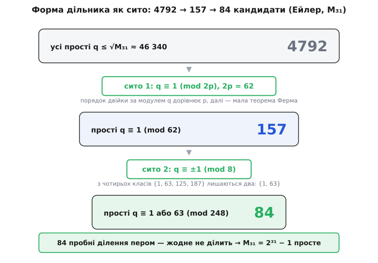

# 🧮 Форма дільника числа Мерсенна

Просте `q`, що ділить `Mₚ = 2ᵖ − 1` (усюди далі `p` — непарне просте), не буває яким завгодно: воно змушене лежати одразу у двох тісних класах лишків, і саме ця вимушеність робить величезні числа Мерсенна перевірними вручну.

<preknowlist>
- [Модульна арифметика](topic:math/modular-arithmetic) — запис `a ≡ b (mod m)`, ділення з остачею `n = d·k + r` при `0 ≤ r < d`, вільне додавання й множення лишків.
- [Прості числа](topic:math/prime-numbers) — просте число, розклад на прості й те, що будь-яке складене число має простий дільник.
- [Мультиплікативний порядок](topic:math/multiplicative-order) — найменший `d > 0` з `aᵈ ≡ 1 (mod m)`; існує, коли `a` оборотне за модулем.
- [Мала теорема Ферма](topic:math/fermat-little-theorem) — `a^(q−1) ≡ 1 (mod q)` для простого `q`, що не ділить `a`.
- [Квадратичні лишки](topic:math/quadratic-residues) — коли `a` є квадратом за модулем `q`; символ Лежандра `(a|q)`, критерій Ейлера, лема Гаусса.
</preknowlist>

Твердження таке: якщо просте `q` ділить `Mₚ = 2ᵖ − 1`, то одразу

```
q ≡ 1  (mod 2p)        і        q ≡ ±1  (mod 8)
```

Це не спостереження, а теорема, і кожна її половина зрізає більшість чисел як кандидатів у дільники. Разом вони перетворюють перевірку `Mₚ` на простоту з безнадійного перебору на короткий рахунок пером — саме так Ейлер `1772` року довів руками, що `M₃₁ = 2 147 483 647` просте. Обидві умови випливають з елементарних причин — перша з порядку двійки, друга з її квадратичного характеру; розберімо їх по черзі, а тоді пустимо в діло.

Одразу зауважмо очевидне, що знадобиться повсюди: `Mₚ` непарне (степінь двійки, зменшений на один), тож жоден його дільник не дорівнює `2`. Отже `q` — непарне просте, `q ≥ 3`, і двійка за модулем `q` оборотна.

## Перша умова: q ≡ 1 (mod 2p)

`q` ділить `2ᵖ − 1`, тобто

```
2ᵖ ≡ 1  (mod q)
```

Погляньмо на найменший додатний показник, при якому двійка дає одиницю за модулем `q`, — на її [мультиплікативний порядок](topic:math/multiplicative-order) `d`. У порядку є одна властивість, з якої тут випливає все: **якщо `2ⁿ ≡ 1 (mod q)`, то `d` ділить `n`.** Причина — звичайне ділення з остачею. Запишімо `n = d·k + r` з `0 ≤ r < d`; тоді

```
1 ≡ 2ⁿ = (2ᵈ)ᵏ · 2ʳ ≡ 1ᵏ · 2ʳ = 2ʳ   (mod q)
```

Отже `2ʳ ≡ 1` при `0 ≤ r < d`. Але `d` — найменший **додатний** показник із такою рівністю; єдиний вихід — `r = 0`, тобто `d | n`.

Тепер застосуймо цю властивість двічі. По-перше, з `2ᵖ ≡ 1` маємо `d | p`. Число `p` просте, тож `d` дорівнює або `1`, або `p`. Випадок `d = 1` означав би `2¹ ≡ 1 (mod q)`, тобто `q` ділить `1` — для простого `q` неможливо. Лишається

```
d = p
```

По-друге, за [малою теоремою Ферма](topic:math/fermat-little-theorem) `2^(q−1) ≡ 1 (mod q)` (двійка не ділиться на просте `q`). За тією ж властивістю порядку `d | (q − 1)`, а `d = p`, тому

```
p | (q − 1)
```

Лишився один крок — від `p` до `2p`. Число `q − 1` ділиться на `p`; воно ділиться й на `2`, бо `q` непарне. А `p` — непарне просте, тож `p` і `2` взаємно прості, і число, кратне обом одночасно, кратне їхньому добутку:

```
p | (q − 1)   і   2 | (q − 1),   gcd(2, p) = 1   ⟹   2p | (q − 1)
```

тобто `q ≡ 1 (mod 2p)`. Першу умову доведено. Побічний наслідок вартий уваги: `q ≡ 1 (mod 2p)` тягне `q ≥ 2p + 1`, тож навіть найменший можливий дільник уже досить великий — це перша економія в переборі.

## Друга умова: q ≡ ±1 (mod 8)

Ця половина тонша: вона випливає не з того, який у двійки порядок, а з того, чи є двійка **квадратом** за модулем `q`.

Тут непарність `p` спрацьовує напряму. Оскільки `p` непарне, `p + 1` парне, і показник `(p+1)/2` цілий. Помножмо `2ᵖ ≡ 1` на `2`:

```
2 ≡ 2 · 2ᵖ = 2^(p+1) = (2^((p+1)/2))²   (mod q)
```

Права частина — точний квадрат. Отже двійка має квадратний корінь за модулем `q`, і то навіть явний, `2^((p+1)/2)`. Мовою [символа Лежандра](topic:math/quadratic-residues) — він дорівнює `+1`, коли число є ненульовим квадратом за модулем `q`, і `−1`, коли ні, — це записують `(2|q) = +1`.

Лишилося перекласти «`(2|q) = +1`» на клас `q` за модулем `8`. Цей переклад робить **друге доповнення до квадратичного закону взаємності**:

```
(2|q) = +1   ⟺   q ≡ ±1 (mod 8)
```

Доведімо його рахунком — [лема Гаусса](topic:math/quadratic-residues) дає найкоротший шлях. Лема каже: `(a|q) = (−1)^μ`, де `μ` — це скільки серед чисел `a·1, a·2, …, a·(q−1)/2` мають найменший додатний лишок понад `q/2`. Візьмімо `a = 2`. Числа `2·1, 2·2, …, 2·(q−1)/2` — це `2, 4, …, q−1`: усі парні й усі менші за `q`, тож кожне вже дорівнює своєму лишку. Понад `q/2` серед них ті, де `2k > q/2`, тобто `k > q/4`. Значить,

```
μ = (q−1)/2 − ⌊q/4⌋
```

Порахуймо парність `μ`, розписавши `q = 8m + r` по чотирьох можливих непарних лишках `r`:

```
q = 8m+1:  μ = 4m   − 2m       = 2m      парне    →  (2|q) = +1
q = 8m+3:  μ = 4m+1 − 2m       = 2m+1    непарне  →  (2|q) = −1
q = 8m+5:  μ = 4m+2 − (2m+1)   = 2m+1    непарне  →  (2|q) = −1
q = 8m+7:  μ = 4m+3 − (2m+1)   = 2m+2    парне    →  (2|q) = +1
```

Двійка виявляється лишком рівно при `q ≡ 1` і `q ≡ 7 ≡ −1 (mod 8)` — тобто при `q ≡ ±1 (mod 8)`. (Те саме коротко пакується у формулу `(2|q) = (−1)^((q²−1)/8)`, парність якої і дає цей самий поділ.)

Ми вже довели, що для нашого `q` виконано `(2|q) = +1`; за щойно встановленою рівносильністю звідси `q ≡ ±1 (mod 8)`. Другу умову доведено.

> 🔧 **Навіщо це.** Кожна умова — окреме сито. Перша, `q ≡ 1 (mod 2p)`, лишає одну частку `1/φ(2p)` усіх простих; друга, `q ≡ ±1 (mod 8)`, вирізає ще половину з того, що вціліло. Дільник, приречений на такий вузький клас, знайти (або впевнено виключити) незрівнянно легше, ніж дільник довільного числа тієї ж величини. Уся практична сила чисел Мерсенна в пробному діленні тримається на цих двох конгруенціях.

## Приклад: 2047 = 23 · 89

Найменше складене число Мерсенна з простим показником (`p = 11`) — зручний полігон: обидва його прості множники мусять сидіти у формі, і сидять.

```
p = 11,   2p = 22
23 = 1·22 + 1  →  23 ≡ 1 (mod 22)      23 = 2·8 + 7   →  23 ≡ −1 (mod 8)
89 = 4·22 + 1  →  89 ≡ 1 (mod 22)      89 = 11·8 + 1  →  89 ≡  1 (mod 8)
```

Перевірмо і явний корінь двійки з доведення. Тут `(p+1)/2 = 6`, тож коренем має бути `2⁶ = 64`:

```
64 ≡ 18 (mod 23),   18² = 324 = 14·23 + 2    →   18² ≡ 2 (mod 23)
64² = 4096 = 46·89 + 2                        →   64² ≡ 2 (mod 89)
```

Двійка справді квадрат за обома модулями. Нарешті — порядок двійки, серце першої умови. Оскільки `2¹¹ = 2048 = 23·89 + 1`:

```
2¹¹ = 2047 + 1 ≡ 1  (mod 23)  і  (mod 89)
```

а менших показників, крім `1`, у дільниках `11` немає — тому порядок двійки за кожним із `23` і `89` дорівнює рівно `11 = p`, як і має бути.

## Обидві умови разом: два класи за модулем 8p

Порізно кожна умова корисна, але справжня сила в їхньому поєднанні. Умова `q ≡ 1 (mod 2p)` фіксує `q` за модулем `2p`, умова `q ≡ ±1 (mod 8)` додає інформацію за модулем `8`. Оскільки `p` непарне, найменше спільне кратне `lcm(2p, 8) = 8p`, тож пара умов приколює `q` до класів за модулем `8p`.

Скільки цих класів? Лишків `r` за модулем `8p`, що дають `r ≡ 1 (mod 2p)`, рівно чотири (бо `8p / 2p = 4`):

```
r = 1,   2p + 1,   4p + 1,   6p + 1   (mod 8p)
```

Тепер накладімо друге сито — лишити ті `r`, що `≡ ±1 (mod 8)`. Оскільки `p` непарне, `4p ≡ 4 (mod 8)`, а `{2p, 6p}` за модулем `8` дають `{2, 6}` у якомусь порядку; тому четвірка лишків за модулем `8` — це завжди `{1, 3, 5, 7}`. З них `±1` — рівно два, `1` і `7`. Отже **з чотирьох класів завжди виживають рівно два**: клас `≡ 1` і той із `2p+1`, `6p+1`, який дає `≡ 7 (mod 8)`.

Для `M₃₁` (тут `p = 31`, `8p = 248`) це виглядає так:

```
чотири класи ≡ 1 (mod 62):    1,   63,   125,   187   (mod 248)
кожен за модулем 8:           1,    7,     5,     3
лишаються (≡ ±1 mod 8):       1,   63
```

Отже простий дільник `M₃₁` зобов'язаний бути `≡ 1` або `≡ 63 (mod 248)` — і більше ніяким.



*Дві конгруенції на дільник послідовно зрізають перебір: перша лишає прості одного класу за модулем `2p`, друга — половину з них; для `M₃₁` від 4792 кандидатів лишається 84.*

## Як Ейлер довів M₃₁ вручну

Тепер віддача. `M₃₁ = 2³¹ − 1 = 2 147 483 647`. Якби воно було складене, то мало б простий дільник не більший за корінь: `√M₃₁ ≈ 46 340.95`, тобто `q ≤ 46 340`. А кожен простий дільник, як щойно доведено, `≡ 1` або `≡ 63 (mod 248)`.

Порахуймо, скільки лишається кандидатів. Простих чисел до `46 340` усього `4792` — стільки ділень вимагав би сліпий перебір. Умова `≡ 1 (mod 62)` (це перша, `2p = 62`) лишає з них `157`. Додаток `≡ ±1 (mod 8)` зрізає майже вдвічі — до `84` простих у класах `1` і `63` за модулем `248`:

```
311,  1303,  1489,  2543,  2729,  2791,  4217,  5023,  …   (усього 84)
```

Досить перебрати саме ці прості: якби `M₃₁` ділило складене число потрібної форми, його простий дільник теж ділив би `M₃₁` і теж мав би цю форму — тобто вже стояв би у списку. Ейлер розділив `M₃₁` на кожного з `84` кандидатів; жоден не розділив націло — отже, `M₃₁` просте.

Історія тут точна й задокументована. Форму дільника `≡ 1 (mod 2p)` помітив ще Ферма (близько `1640` року, у ту саму пору, що й свою малу теорему). Додаткову умову `≡ ±1 (mod 8)` — квадратичний характер двійки — додав саме Ейлер, і, озброївшись обома, він `1772` року довів простоту `M₃₁`, повідомивши це в листі до Даніеля Бернуллі; його оптимізоване пробне ділення обходилося щонайбільше `372` діленнями на числа потрібної форми, а справді необхідних — на прості цієї форми — лишалося тільки `84`. Це `M₃₁` протрималося найбільшим відомим простим числом `95` років, аж до `1867`-го — рекорд, здобутий пером на самій лише формі дільника.
