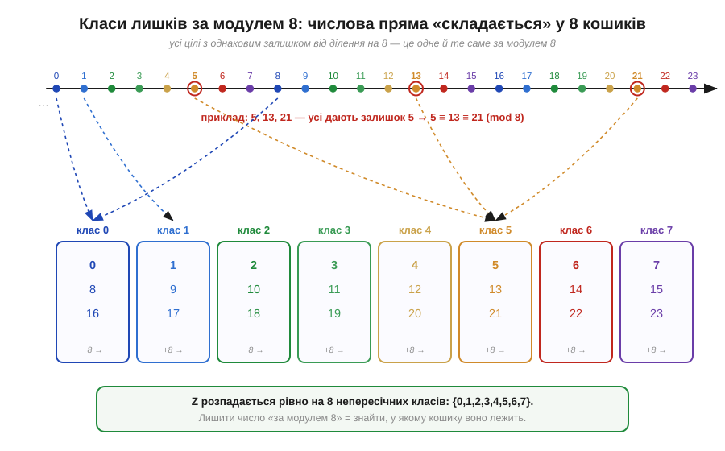
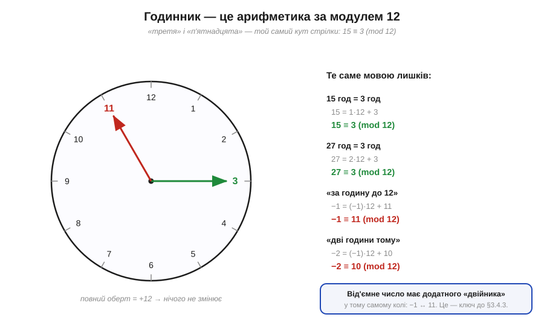
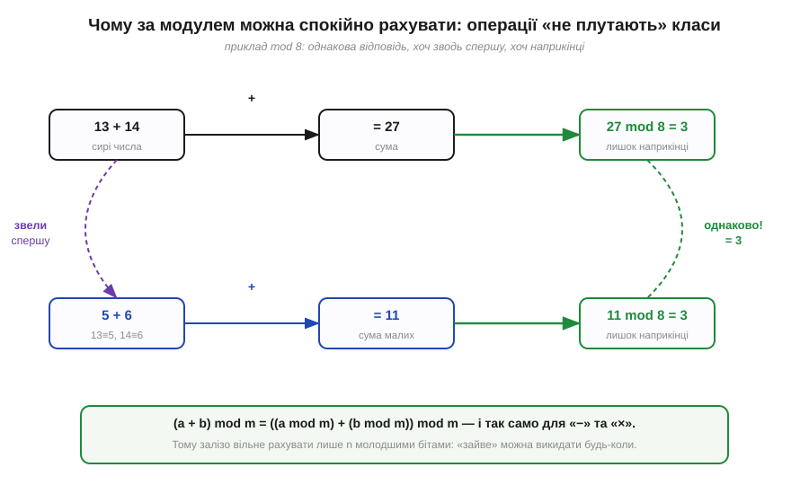
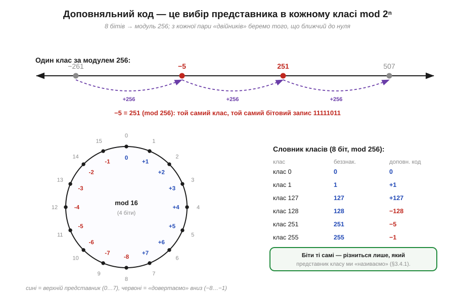

# 🧮 Арифметика за модулем: доповняльний код — це лишки mod 2ⁿ

У [доповняльному коді](book:math/twos-complement) числа кладуть **на коло** й домовляються читати його верхню половину як від'ємні — і саме завдяки колу віднімання обертається на додавання. Але «коло» там — образ, інтуїція. Тут під нього підведено точну математику. Виявляється, що те коло — не метафора, а цілком строге поняття: **арифметика за модулем**. А доповняльний код — рівно її застосування з модулем 2ⁿ. За словами «викинути перенос за байт = звести за модулем 256» стоїть теорема, а не аналогія.

### Означення: лишки, конгруенції та один знак ≡

Почнімо з того самого циферблата, що й історія цього поняття ([§3.4.3i](book:math/twos-complement/hist-modular-arithmetic.md)), але строго. Зафіксуймо ціле число *m* > 0 — назвемо його **модулем** (*modulus*, *m*). Два цілих числа *a* і *b* називають **конгруентними за модулем m**, якщо їхня різниця ділиться на *m* націло. Записують це знаком, який 1801 року ввів Гаусс, — потроєною рискою рівності:

```
a ≡ b (mod m)    ⇔    m ділить (a − b)
```

Читається «*a* конгруентне *b* за модулем *m*». Найпростіший спосіб це уявити: *a* і *b* дають **однаковий залишок** від ділення на *m*. Так, 13 ≡ 5 (mod 8), бо обидва лишають 5; а 15 ≡ 3 (mod 12), бо «п'ятнадцята година» — це третя.

Конгруентність розбиває всі цілі числа на **класи лишків** (*residue classes*): у кожному класі лежать ті, що дають один і той самий залишок. За модулем 8 таких класів рівно вісім — від «класу 0» до «класу 7», — і кожне ціле число потрапляє точно в один із них.


*Рис. Нескінченна числова пряма «складається» у 8 кошиків. Усі числа з однаковим залишком від ділення на 8 (наприклад, 5, 13, 21) опиняються в одному класі й вважаються рівними за модулем 8: 5 ≡ 13 ≡ 21. «Лишити число за модулем 8» означає просто визначити, у якому з восьми кошиків воно лежить. Саме ці класи й будуть значеннями, які вміщає 3-бітна сітка.*

### Інтуїція: чому це і є «коло» доповняльного коду

Класи лишків — це і є те **коло** з [доповняльного коду](book:math/twos-complement), тільки названо строго. Якщо викласти представників 0, 1, …, *m*−1 по колу й рухатися додаванням одиниці, то після *m*−1 ми повертаємося в 0: лічба замикається. Найзнайоміше таке коло — звичайний годинник із модулем 12.


*Рис. Циферблат — це наочна арифметика mod 12. «Третя» і «п'ятнадцята» — той самий кут стрілки, тому 15 ≡ 3. Найважливіше для нас праворуч унизу: рух **назад** теж лишається на колі. «За годину до дванадцятої» — це 11, тобто −1 ≡ 11 (mod 12). Від'ємне число має додатного двійника в тому самому колі — і це прямий місток до того, як доповняльний код кодує мінус.*

Звідси й береться головна ідея [доповняльного коду](book:math/twos-complement). Повний оберт по колу — додавання *m* — нічого не змінює: *a* + *m* ≡ *a*. Тому **рух назад на N** дає те саме, що рух **уперед на m − N**. Інакше кажучи, у світі лишків

```
−N ≡ m − N   (mod m)
```

Від'ємне число — не окрема сутність зі «знаком», а просто **інша назва** для свого додатного двійника на колі. Це рівність −N ≡ m−N і є математичним серцем доповняльного коду; усе інше — її застосування до *m* = 2ⁿ.

### Формальний апарат: чому за модулем можна спокійно рахувати

Щоб користуватися лишками як арифметикою, потрібна одна властивість — і саме її Гаусс довів, зробивши ≡ повноцінною «рівністю». Конгруенції за **спільним** модулем можна почленно **додавати, віднімати й перемножувати**:

```
якщо  a ≡ a′  і  b ≡ b′  (mod m),  то
      a + b ≡ a′ + b′      (mod m)
      a − b ≡ a′ − b′      (mod m)
      a · b ≡ a′ · b′      (mod m)
```

Практичний наслідок звучить просто, але він — ключ до всього: **зводити за модулем можна будь-коли** — хоч до операції, хоч після неї, результат той самий. Не обов'язково тягати великі числа: можна спершу взяти залишки, а тоді додати.


*Рис. Дві стежки до одної відповіді (mod 8). Верхня: додати сирі числа 13 + 14 = 27, тоді взяти залишок → 3. Нижня: спершу звести (13 ≡ 5, 14 ≡ 6), додати малі 5 + 6 = 11, тоді залишок → 3. Результат збігається: (a + b) mod m = ((a mod m) + (b mod m)) mod m. Саме тому залізо вільне рахувати лише кількома молодшими бітами й викидати «зайве» коли завгодно.*

Тепер — головна підстановка цієї вставки. Візьмемо модулем **m = 2ⁿ** — рівно стільки значень, скільки вміщає сітка з *n* бітів (256 для байта). Регістр на *n* бітів за самою конструкцією рахує за цим модулем: дійшовши до 2ⁿ−1, він на наступному кроці перевалює в нуль, а старші біти результату фізично нікуди не вміщаються й відкидаються. Але «відкинути біти, старші за *n*-й» — це арифметично те саме, що **взяти залишок від ділення на 2ⁿ**. Отже, будь-яка операція в *n*-бітному регістрі автоматично виконується за модулем 2ⁿ. А значить, до неї застосовна щойно доведена властивість — і, зокрема, тотожність −N ≡ 2ⁿ−N. Доповняльний код просто бере цю тотожність буквально: код від'ємного −N — це представник 2ⁿ−N того ж класу.


*Рис. Міст до доповняльного коду. Числа −5 і 251 лежать в одному класі за модулем 256 (їхня різниця −256 ділиться на 256), тому мають однаковий бітовий запис 11111011: −5 ≡ 251 (mod 256). У кожному класі доповняльний код обирає одного «представника»: для верхньої половини кола — додатного (0…127), для нижньої — від'ємного (−128…−1). Біти ті самі — різниться лише, який представник класу ми домовилися називати (це і є [вибір тлумачення](book:math/twos-complement)).*

### Де це працює в курсі

Звідси видно, що три факти про [доповняльний код](book:math/twos-complement), які зазвичай подають як інтуїцію, — це наслідки однієї теореми про лишки. **Перше:** «коло чисел» — це класи лишків за модулем 2ⁿ, а −5 = 251 у байті — це конгруенція −5 ≡ 251 (mod 256). **Друге:** «викинути дев'ятий біт переносу» — це звести результат за модулем 2ⁿ, цілком законна операція, бо зводити можна будь-коли. **Третє, найважливіше:** віднімання обертається на додавання саме тому, що −B ≡ 2ⁿ−B, тож A − B ≡ A + (2ⁿ−B) (mod 2ⁿ) — і той самий суматор із [комбінаційних схем](book:electronics/combinational-circuits) обслуговує обидві дії. А [переповнення](book:programming/overflow-wraparound) — це момент, коли «правильна» сума випадає за обраний діапазон представників, хоч за модулем 2ⁿ відповідь і лишається коректною: коло замкнулося, і додатне раптом «перевалило» у від'ємну половину.

Та сама арифметика лишків працює не лише з мінусом. Будь-яке цілочислове додавання й множення в МК — це обчислення за модулем 2ⁿ, і знати про це корисно й поза знаковими числами: лічильник таймера, що сам обнуляється, перейшовши через свій максимум; індекс кільцевого буфера, який беруть `i mod N`, щоб «загорнути» його назад на початок; проста контрольна сума, що накопичує байти за модулем 256. Усе це — той самий циферблат Гаусса, тільки з 2ⁿ поділками.

> 🔧 **Навіщо це.** Винесіть одну думку: **n-бітна арифметика — це арифметика за модулем 2ⁿ**, і доповняльний код — лише її прочитання, де частину класів ми називаємо від'ємними (−N ≡ 2ⁿ−N). Звідси практичне чуття. Перенос, що «випав» за розрядну сітку, — не помилка заліза, а законне зведення за модулем 2ⁿ; результат у бітах правильний, питання лише в тому, [як ми його тлумачимо](book:math/twos-complement). Те саме чуття попереджає про пастку [переповнення](book:programming/overflow-wraparound): за модулем відповідь завжди «правильна», але якщо вона вийшла за діапазон обраних представників (−128…+127 для знакового байта), число мовчки перевалить у протилежний знак. Тому, працюючи з лічильниками, кільцевими буферами й контрольними сумами на МК, корисно одразу думати «за модулем 2ⁿ» — тоді «загортання» через нуль перестає бути сюрпризом і стає інструментом.
