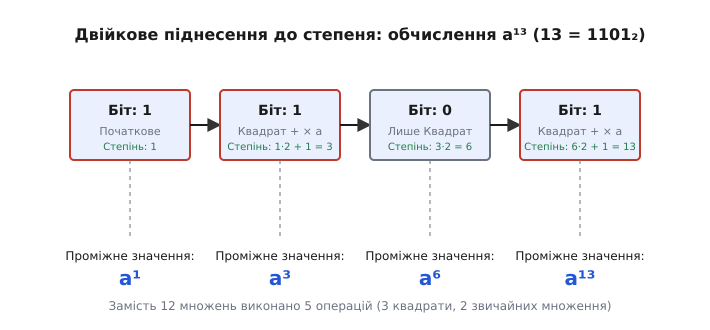

<preknowlist>
- [Модульна арифметика: Вступ](math/number-theory/modular-arithmetic)
- [Основи двійкової системи числення](math/number-theory/positional-systems)
</preknowlist>

# Модульне піднесення до степеня: Швидкий алгоритм для велетенських чисел

> 🔧 **Навіщо це.** У сучасній криптографії (RSA, протокол Діффі-Геллмана) та алгоритмах перевірки на простоту постійно виникає потреба підносити дуже великі числа до дуже великих степенів (наприклад, число з 300 десяткових цифр до степеня з 300 цифр). Якби ми робили це «в лоб» прямим множенням, то навіть найшвидшому суперкомп'ютеру не вистачило б часу існування Всесвіту, щоб виконати цю задачу. Більш того, сам результат не помістився б у пам'ять усіх комп'ютерів Землі. Модульне піднесення до степеня вирішує цю проблему, дозволяючи отримувати точний залишок від ділення aᵇ на m за мікросекунди без обчислення самого гігантського числа aᵇ.

Коли ми вперше стикаємося з операцією піднесення до степеня, ми сприймаємо її як багаторазове множення. Запис aᵇ означає, що число a потрібно помножити саме на себе b разів. Наприклад, 3⁴ = 3 · 3 · 3 · 3 = 81. Якщо ми хочемо знайти залишок від ділення цього результату на якесь число m, наприклад m = 7, ми спочатку обчислюємо 81, а потім знаходимо 81 mod 7 = 4, оскільки 81 = 7 · 11 + 4.

З невеликими числами цей наївний підхід працює чудово. Але що станеться, якщо ми спробуємо обчислити 3¹⁰⁰ mod 7? Щоб отримати результат таким способом, нам довелося б спочатку обчислити 3¹⁰⁰. Це число має 48 десяткових цифр і виглядає як 515377520732011331036461129765621272702107522001. Воно не поміщається у стандартні 64-бітні типи даних комп'ютера, що означає необхідність використання повільної довгої арифметики.

А що як нам потрібно обчислити aᵇ mod m, де b — це число розміром 2048 бітів? Таке число b приблизно дорівнює 10⁶¹⁶. Щоб виконати b множень, нам знадобиться зробити 10⁶¹⁶ кроків. Для порівняння, у видимому Всесвіті є приблизно 10⁸⁰ атомів. Навіть якби кожен атом був комп'ютером, що виконує мільярди операцій на секунду з моменту Великого Вибуху, ми не виконали б і незначної частки від потрібної кількості операцій. Ми стикаємося з двома фундаментальними стінами: стіною пам'яті (число aᵇ занадто велике, щоб його зберігати) та стіною часу (зробити b операцій неможливо).

Цю проблему блискуче вирішує швидке модульне піднесення до степеня. Алгоритм, який часто називають Binary Exponentiation (двійкове піднесення до степеня) або [Square-and-Multiply](book:math/square-and-multiply) (квадрат і множення), долає обидві стіни.

## Подолання стіни пам'яті: Властивість модульного множення

Перша проблема — це розмір самого числа aᵇ. Щоб її обійти, ми повинні скористатися головною властивістю модульної арифметики: залишок добутку дорівнює добутку залишків. Математично це записується так:

(x · y) mod m = ( (x mod m) · (y mod m) ) mod m

Це означає, що нам не потрібно чекати закінчення всіх множень, щоб взяти залишок. Ми можемо (і повинні) застосовувати операцію «mod m» після кожного кроку множення. 

Повернемося до нашого прикладу: 3⁴ mod 7.
Замість:
1 крок: 3
2 крок: 3 · 3 = 9
3 крок: 9 · 3 = 27
4 крок: 27 · 3 = 81
Кінцевий крок: 81 mod 7 = 4

Ми робимо так:
1 крок: 3 mod 7 = 3
2 крок: (3 · 3) = 9. Беремо залишок: 9 mod 7 = 2.
3 крок: Беремо попередній результат 2 і множимо на 3: (2 · 3) = 6. Беремо залишок: 6 mod 7 = 6.
4 крок: Беремо 6 і множимо на 3: (6 · 3) = 18. Беремо залишок: 18 mod 7 = 4.
Результат: 4.

Ми отримали той самий результат 4. Але подивіться на проміжні числа, з якими ми працювали: 3, 9, 2, 6, 18, 4. Найбільше число, яке виникло в процесі обчислень, дорівнювало 18. У першому (наївному) методі ми дійшли до 81. 

Головний принцип: якщо на кожному кроці ми виконуємо операцію c = (a · b) mod m, то наші проміжні числа ніколи не перевищуватимуть m². Якщо m є 64-бітним числом, то m² буде максимум 128-бітним. Таким чином, незалежно від того, наскільки великим є показник степеня b, проміжні результати завжди залишатимуться невеликими і легко помістяться в оперативній пам'яті (або в регістрах процесора, якщо використовувати типи на кшталт __int128). Ми щойно зруйнували стіну пам'яті.

## Подолання стіни часу: Двійкове подання степеня

Тепер ми можемо обчислювати 3¹⁰⁰ mod 7 без переповнення пам'яті. Але нам все ще потрібно зробити 100 кроків множення. Якщо b дорівнює 10⁶¹⁶, нам знадобиться 10⁶¹⁶ кроків, що неприпустимо. 

Щоб різко скоротити кількість множень, ми змінимо сам підхід до накопичення степеня. Згадаємо, що будь-яке число можна записати як суму ступенів двійки (це основа двійкової системи числення). Наприклад, розглянемо показник степеня b = 13.
В десятковій системі 13. В двійковій системі це 1101₂, оскільки 13 = 8 + 4 + 0 + 1 = 2³ + 2² + 2⁰.

За правилами математики, a¹³ = a⁸⁺⁴⁺¹ = a⁸ · a⁴ · a¹.

Зверніть увагу: нам не потрібно обчислювати всі проміжні степені (a², a³, a⁵, a⁶, a⁷ тощо). Достатньо мати лише ті степені, які є ступенями двійки (a¹, a², a⁴, a⁸, a¹⁶...), і перемножити ті з них, які відповідають одиницям у двійковому поданні числа b.

Але як швидко отримати послідовність a¹, a², a⁴, a⁸? Дуже просто — постійно підносячи попередній результат до квадрата:
- a¹ = a
- a² = (a¹)² = a · a
- a⁴ = (a²)²
- a⁸ = (a⁴)²
- a¹⁶ = (a⁸)²

Кожне нове значення отримується лише за одне множення (квадрат попереднього значення). Щоб дійти до a⁸, ми зробили лише 3 операції піднесення до квадрата замість 7 звичайних множень.

## Алгоритм Right-to-Left (Справа наліво)

Давайте поєднаємо ці дві ідеї (модульне множення на кожному кроці та двійковий розклад степеня) у конкретний алгоритм. Найпопулярнішим є метод «справа наліво», оскільки він ідеально лягає на логіку роботи комп'ютера з бітами.

Суть алгоритму:
1. Ми створюємо змінну «Результат» і спочатку встановлюємо її рівною 1 (оскільки a⁰ = 1).
2. Ми створюємо змінну «Поточна основа» і встановлюємо її рівною a.
3. Ми переглядаємо біти показника степеня b, починаючи з наймолодшого (правого) біта і рухаючись до старшого (лівого). 
4. На кожному кроці, якщо поточний біт b дорівнює 1, ми множимо наш «Результат» на «Поточну основу» і беремо mod m.
5. Незалежно від того, чому дорівнює біт, ми завжди зводимо «Поточну основу» в квадрат (множимо саму на себе) і беремо mod m. Це готує основу для наступного біта.
6. Переходимо до наступного біта (зсуваємо b вправо на 1 розряд), поки b не стане рівним 0.

Продемонструємо цей алгоритм по кроках для нашого прикладу: 3¹³ mod 7.
- Основа a = 3
- Степінь b = 13 (в двійковій 1101₂)
- Модуль m = 7

Початковий стан:
Результат = 1
Поточна основа = 3 mod 7 = 3
Поточний степінь = 13 (біти з кінця: 1, 0, 1, 1)

Ітерація 1 (молодший біт числа 13 — це 1):
- Оскільки біт = 1, оновлюємо Результат: Результат = (Результат · Основа) mod 7 = (1 · 3) mod 7 = 3.
- Готуємо Основу до наступного кроку (квадрат): Основа = (Основа · Основа) mod 7 = (3 · 3) mod 7 = 9 mod 7 = 2.
- Зменшуємо степінь (зсув вправо, 13 / 2 = 6). Тепер степінь = 6 (двійкове 110₂).

Ітерація 2 (молодший біт числа 6 — це 0):
- Оскільки біт = 0, Результат не міняємо (залишається 3).
- Готуємо Основу до наступного кроку (квадрат): Основа = (Основа · Основа) mod 7 = (2 · 2) mod 7 = 4.
- Зменшуємо степінь (6 / 2 = 3). Тепер степінь = 3 (двійкове 11₂).

Ітерація 3 (молодший біт числа 3 — це 1):
- Оскільки біт = 1, оновлюємо Результат: Результат = (Результат · Основа) mod 7 = (3 · 4) mod 7 = 12 mod 7 = 5.
- Готуємо Основу (квадрат): Основа = (Основа · Основа) mod 7 = (4 · 4) mod 7 = 16 mod 7 = 2.
- Зменшуємо степінь (3 / 2 = 1). Тепер степінь = 1 (двійкове 1₂).

Ітерація 4 (молодший біт числа 1 — це 1):
- Оскільки біт = 1, оновлюємо Результат: Результат = (Результат · Основа) mod 7 = (5 · 2) mod 7 = 10 mod 7 = 3.
- Готуємо Основу (квадрат): Основа = (Основа · Основа) mod 7 = (2 · 2) mod 7 = 4.
- Зменшуємо степінь (1 / 2 = 0). Степінь = 0.

Кінець циклу. Результат: 3.
Дійсно, 3¹³ = 1594323. І 1594323 = 7 · 227760 + 3, тобто 1594323 mod 7 = 3.

Зверніть увагу на геніальну ефективність цього алгоритму. Ми зробили всього 4 ітерації циклу (кількість бітів числа 13). На кожній ітерації ми робили максимум дві операції: одне піднесення до квадрата і одне (можливе) множення на результат. Загалом ми виконали O(log b) операцій, де log b — це кількість бітів у числі b.

Якщо показник степеня b — це число з 2048 бітів, алгоритм завершиться за 2048 ітерацій. Це потребуватиме приблизно 2048 піднесень до квадрата і в середньому 1024 множень (оскільки одиниць і нулів у випадковому ключі приблизно порівну). Зробити 3072 математичні операції для сучасного комп'ютера — це справа часток мілісекунди! Стіна часу повністю зруйнована.

## Алгоритм Left-to-Right (Зліва направо)

Існує також альтернативний підхід — сканування бітів зліва направо (від найстаршого до наймолодшого). Метод зліва направо часто використовується, коли біти степеня відомі заздалегідь і зберігаються у вигляді масиву або рядка. 

Ідея полягає в наступному. Ми починаємо з Результату = 1. Потім ми йдемо по бітах числа b від старшого (найлівішого) до молодшого (найправішого).
На кожному кроці ми ЗАВЖДИ зводимо Результат у квадрат: Результат = (Результат · Результат) mod m.
Якщо поточний біт дорівнює 1, ми додатково множимо Результат на початкову основу a: Результат = (Результат · a) mod m.

Пояснення простору: кожен зсув вліво у двійковій системі — це множення на 2 (що еквівалентно піднесенню поточного степеня до квадрата). Додавання 1 у молодший розряд — це множення результату на a¹.

Візьмемо той самий приклад: 3¹³ mod 7. Біти 13 зліва направо: 1, 1, 0, 1.
Початково Результат = 1. Основа a = 3.

Крок 1 (біт 1):
- Квадрат: Результат = (1 · 1) mod 7 = 1.
- Оскільки біт 1, множимо на a: Результат = (1 · 3) mod 7 = 3.

Крок 2 (біт 1):
- Квадрат: Результат = (3 · 3) mod 7 = 9 mod 7 = 2.
- Оскільки біт 1, множимо на a: Результат = (2 · 3) mod 7 = 6.

Крок 3 (біт 0):
- Квадрат: Результат = (6 · 6) mod 7 = 36 mod 7 = 1.
- Оскільки біт 0, на a не множимо.

Крок 4 (біт 1):
- Квадрат: Результат = (1 · 1) mod 7 = 1.
- Оскільки біт 1, множимо на a: Результат = (1 · 3) mod 7 = 3.

Результат знову дорівнює 3. Як бачимо, кількість кроків така ж сама, а логіка дещо інша. Обидва методи (і зліва направо, і справа наліво) мають асимптотичну складність O(log b) операцій, що робить їх неймовірно швидкими.

## Проблема переповнення типу (Integer Overflow)

Незважаючи на те, що ми беремо залишок після кожного множення, сама операція множення може бути проблематичною. Розглянемо крок, де ми робимо множення c = (x · y) mod m. 
Якщо m — це 64-бітне число (максимум біля 1.8 · 10¹⁹), то x та y також можуть бути близькими до m. Коли ми множимо x на y, комп'ютер спочатку має обчислити x · y, і лише потім знайти залишок від ділення на m.

Якщо x і y мають розмір 64 біти, їхній добуток матиме розмір до 128 бітів! Якщо ми використовуємо стандартний тип даних (наприклад `uint64_t` у мові C++), число не поміститься у відведений об'єм пам'яті, і відбудеться так зване переповнення типу (overflow). Старші біти будуть відкинуті, і ми отримаємо абсолютно неправильний результат ще до того, як застосуємо операцію mod m.

Для вирішення цієї проблеми існує кілька підходів:
1. Використання спеціальних вбудованих типів. Деякі компілятори (GCC, Clang) підтримують розширені типи, такі як `__int128`, що дозволяє безпечно зберігати проміжний 128-бітний добуток. Це найпростіший і найефективніший сучасний спосіб для 64-бітних платформ.
2. Алгоритм Шраге (Schrage's method), який дозволяє виконувати модульне множення без переповнення за умови певних обмежень на a, b і m.
3. Російське селянське множення (Russian Peasant Multiplication) — це той самий алгоритм [Square-and-Multiply](book:math/square-and-multiply), але застосований до множення, а не до степеня! Ми розкладаємо множення (x · y) на додавання зсувом, де проміжні суми беруться за модулем m. Цей метод дозволяє множити два 64-бітних числа за модулем m без використання 128-бітного типу, але він є повільнішим, оскільки вимагає O(log m) кроків на кожне множення.

## Застосування алгоритму у сучасному світі

Завдяки цьому надшвидкому алгоритму людство отримало можливість працювати з неймовірно великими числами, що стало фундаментом для всієї сучасної цифрової безпеки.

У системі шифрування RSA публічні та приватні ключі є великими числами (часто розміром 2048 бітів і більше). Щоб зашифрувати повідомлення M, ми обчислюємо C = Mᵉ mod n, де e — публічна експонента. Щоб розшифрувати, ми обчислюємо M = Cᵈ mod n, де d — секретний ключ. Обидві ці операції спираються виключно на швидке модульне піднесення до степеня.

Протокол Діффі-Геллмана (який дозволяє двом сторонам створити спільний секретний ключ через відкритий канал зв'язку) базується на обчисленні aˣ mod m та aʸ mod m. Навіть найпростіша HTTPS-з'єднання з вашим банком у перші ж мілісекунди використовує модульне піднесення до степеня для обміну ключами.

Ще одна важлива сфера — це тести на простоту. Алгоритм Ферма або [Тест Міллера — Рабіна](book:math/miller-rabin-test), які визначають, чи є величезне число простим, перевіряють виконання спеціальних конгруенцій, які теж вимагають піднесення до степеня aᵐ⁻¹ mod m. Швидке створення простих чисел для генерації тих же RSA ключів було б неможливим без O(log b) складності.

Модульне піднесення до степеня — це яскравий приклад того, як абстрактна математична ідея про двійковий розклад, поєднана з модульною арифметикою, перетворилася на технологію, що щосекунди захищає трильйони байтів даних по всій планеті.
