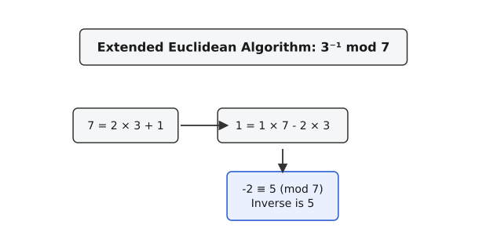

<preknowlist>
- Поняття остачі від ділення (модуль) та конгруенції (≡).
- Найбільший спільний дільник (НСД, gcd) та взаємно прості числа.
- Базовий алгоритм Евкліда для знаходження НСД.
</preknowlist>

# Обернене за модулем: ділення у світі без дробів

> 🔧 **Навіщо це.** У модульній арифметиці, де існують лише цілі числа, немає звичного поняття дробів чи ділення. Щоб "поділити" рівняння на певне число, ми замість цього множимо його на "обернене за модулем". Це ключова операція для розв'язання лінійних конгруенцій та фундамент сучасної криптографії: обчислення приватного ключа в алгоритмі RSA чи операції над точками еліптичних кривих (ECC) неможливі без знаходження модульного оберненого.

## Що означає "поділити" у світі цілих чисел?

У звичайній шкільній алгебрі рівняння на кшталт 3 · x = 5 розв'язується дуже просто: ми ділимо обидві частини на 3 і отримуємо x = 5 / 3. З погляду математики, ми насправді домножили обидві частини рівняння на число (1/3), яке є *мультиплікативним оберненим* до числа 3. Обернене число — це таке число, яке при множенні на вихідне дає одиницю: 3 · (1/3) = 1. Тому 3 · x · (1/3) = x, і залишається лише x = 5 · (1/3).

Але що робити, якщо ми знаходимося в системі модульної арифметики (наприклад, за модулем 7), де існують виключно цілі числа від 0 до 6, і жодних дробів там немає?

Уявімо, що нам потрібно розв'язати схоже рівняння:
3 · x ≡ 5 (mod 7)

Ми не можемо просто написати x = 5 / 3, бо дробу 5/3 не існує в нашій системі. Натомість нам потрібно знайти "замінник" дробу 1/3 — таке ціле число з нашого набору {0, 1, ..., 6}, яке при множенні на 3 дасть результат 1 за модулем 7. Це число називається **оберненим до 3 за модулем 7** і позначається як 3⁻¹ mod 7.

Знайдемо його перебором. Множимо 3 на всі можливі залишки від ділення на 7:
3 · 0 = 0 ≡ 0 (mod 7)
3 · 1 = 3 ≡ 3 (mod 7)
3 · 2 = 6 ≡ 6 (mod 7)
3 · 3 = 9 ≡ 2 (mod 7) (бо 9 = 7 · 1 + 2)
3 · 4 = 12 ≡ 5 (mod 7) (бо 12 = 7 · 1 + 5)
3 · 5 = 15 ≡ 1 (mod 7) (бо 15 = 7 · 2 + 1)
3 · 6 = 18 ≡ 4 (mod 7)

Ось воно! Ми бачимо, що 3 · 5 ≡ 1 (mod 7). Отже, у світі за модулем 7 число 5 виконує роль "дробу 1/3". Вони взаємно обернені: 3⁻¹ ≡ 5 (mod 7), а 5⁻¹ ≡ 3 (mod 7).

Тепер ми можемо розв'язати наше рівняння 3 · x ≡ 5 (mod 7). Замість "ділення на 3" ми множимо обидві частини на обернене число, тобто на 5:
(5 · 3) · x ≡ 5 · 5 (mod 7)
1 · x ≡ 25 (mod 7)
x ≡ 4 (mod 7) (бо 25 = 7 · 3 + 4).

Перевіримо: 3 · 4 = 12, а 12 ≡ 5 (mod 7). Все сходиться. Ми навчилися "ділити" у світі, де існують лише цілі числа, завдяки знаходженню оберненого елемента.

## Коли обернене число існує, а коли — ні?

У звичайній арифметиці єдине число, яке не має оберненого (на яке не можна ділити) — це нуль. У модульній арифметиці обмежень трохи більше. Спробуємо знайти обернене до 2 за модулем 6, тобто розв'язати 2 · x ≡ 1 (mod 6).
Перебираємо:
2 · 0 ≡ 0 (mod 6)
2 · 1 ≡ 2 (mod 6)
2 · 2 ≡ 4 (mod 6)
2 · 3 = 6 ≡ 0 (mod 6)
2 · 4 = 8 ≡ 2 (mod 6)
2 · 5 = 10 ≡ 4 (mod 6)

Результати зациклюються: 0, 2, 4, 0, 2, 4... Одиниця ніколи не з'являється! Чому так відбувається?

Подивіться на природу чисел 2 і 6. Обидва числа є парними, тобто мають спільний дільник — число 2. Будь-яке число, яке ми помножимо на 2, буде парним. Модуль 6 теж парний. Операція взяття модуля означає, що ми віднімаємо або додаємо число 6 певну кількість разів. Якщо ми беремо парне число (2 · x) і віднімаємо від нього парне число (6 · y), результат неминуче залишиться парним! А ми шукаємо одиницю — непарне число. Парне число ніколи не дорівнюватиме одиниці, хай що ми з ним робимо в межах парного модуля.

Це фундаментальне правило: **число a має обернене за модулем m тоді й тільки тоді, коли a та m не мають спільних дільників, крім одиниці.** Іншими словами, вони мають бути *взаємно простими*, або їхній найбільший спільний дільник (НСД, або gcd) повинен дорівнювати 1:
gcd(a, m) = 1.

Якщо gcd(a, m) > 1, то оберненого не існує. Якщо модуль m є простим числом (наприклад, 7, 11, 13), то будь-яке число від 1 до m-1 буде взаємно простим із m, а отже, гарантовано матиме обернене. Але якщо модуль складений (як 6), то частина чисел (2, 3, 4) не матиме оберненого, утворюючи "діри" в нашій здатності ділити.

## Як знайти обернене? Спосіб 1: Розширений алгоритм Евкліда

Перебір усіх чисел працює чудово, коли модуль дорівнює 7. Але в криптографії модулі мають сотні цифр, і перебір займе час, довший за вік Всесвіту. Нам потрібен ефективний алгоритм.

Повернімося до визначення. Ми шукаємо таке x, що:
a · x ≡ 1 (mod m)

Що означає ця конгруенція в термінах звичайних рівнянь? Вона означає, що число (a · x) при діленні на m дає остачу 1. Тобто (a · x) на одиницю більше за якесь кратне числа m. Ми можемо записати це як точну рівність:
a · x = m · y + 1
де y — це якась невідома ціла кількість разів, скільки модуль m поміщається в a · x.

Перенесемо m · y ліворуч (або замінимо y на -y, адже це просто коефіцієнт):
a · x + m · y = 1

Це лінійне діофантове рівняння (рівняння з двома невідомими, де ми шукаємо лише цілі розв'язки). З теорії ми знаємо, що воно має розв'язок тоді й тільки тоді, коли gcd(a, m) ділить праву частину (тобто 1). А це можливо лише тоді, коли gcd(a, m) = 1. Це збігається з нашою умовою існування оберненого.

Завдання зводиться до того, щоб знайти такі коефіцієнти x та y, які в лінійній комбінації чисел a та m дадуть їхній найбільший спільний дільник (одиницю). І саме це вміє робити **розширений алгоритм Евкліда**.

Звичайний алгоритм Евкліда знаходить НСД через послідовне ділення з остачею. Розширений алгоритм робить те саме, але паралельно відстежує, як кожна нова остача виражається через початкові числа a та m. Коли він доходить до остачі 1, ми отримуємо готове рівняння a · x + m · y = 1, з якого одразу беремо коефіцієнт x. Оскільки m · y завжди ділиться на m націло і зникає при взятті модуля, залишається a · x ≡ 1 (mod m).



### Приклад виконання розширеного алгоритму

Знайдемо обернене до 17 за модулем 43. Тобто шукаємо x, для якого 17 · x ≡ 1 (mod 43).
Ми хочемо розв'язати 17x + 43y = 1.

Крок 1. Застосуємо базовий алгоритм Евкліда для чисел 43 і 17. Ми завжди ділимо більше на менше, знаходимо частку і остачу.
43 = 17 · 2 + 9    (остача 9)
17 = 9 · 1 + 8     (остача 8)
9 = 8 · 1 + 1      (остача 1)
8 = 1 · 8 + 0      (остача 0, НСД = 1).

Крок 2. Тепер "розкрутимо" ці рівняння у зворотному напрямку, починаючи з рядка, де ми отримали остачу 1. Ми хочемо виразити одиницю через 17 і 43.
З третього рядка:
1 = 9 - 8 · 1

Ми маємо вираз із числами 9 і 8, але наша мета — вираз із числами 17 і 43. Тому ми будемо підставляти остачі з попередніх рядків.
З другого рядка ми знаємо, що 8 = 17 - 9 · 1. Підставимо це замість 8:
1 = 9 - (17 - 9 · 1) · 1
Розкриваємо дужки і зводимо подібні доданки. У нас одне 9, мінус 17, і ще плюс одне 9.
1 = 9 · 2 - 17 · 1

Тепер у нас вираз із числами 9 і 17. Треба позбутися дев'ятки. З першого рядка ми знаємо, що 9 = 43 - 17 · 2. Підставляємо:
1 = (43 - 17 · 2) · 2 - 17 · 1
Розкриваємо дужки:
1 = 43 · 2 - 17 · 4 - 17 · 1
1 = 43 · 2 - 17 · 5

Ми отримали формулу: 43 · (2) + 17 · (-5) = 1.
Перенесемо це у світ модульної арифметики (візьмемо обидві частини за модулем 43). Доданок 43 · 2 перетвориться на нуль. Залишається:
17 · (-5) ≡ 1 (mod 43).

Отже, обернене число — це -5. У модульній арифметиці ми зазвичай хочемо мати додатний результат. Щоб перетворити -5 на додатне число в межах модуля, ми просто додаємо модуль 43 доти, доки число не стане додатним:
-5 + 43 = 38.

Остаточна відповідь: 17⁻¹ ≡ 38 (mod 43).
Перевіримо: 17 · 38 = 646. Ділимо 646 на 43: 646 = 43 · 15 + 1. Справді, остача 1.

Цей метод надзвичайно потужний. Він вимагає логарифмічної кількості кроків відносно значення модуля O(log m) і працює для будь-якого модуля m, головне, щоб gcd(a, m) дорівнював 1.

Цей метод обчислення безпосередньо під час проходу вперед реалізується паралельним веденням двох змінних, які оновлюються на кожному кроці. Детальну реалізацію цього алгоритму наведено в проєктній вставці.

## Спосіб 2: Мала теорема Ферма (лише для простих модулів)

Розширений алгоритм Евкліда — універсальний інструмент. Але коли модуль m є **простим числом**, у нас з'являється альтернативний і дуже елегантний метод. Цей метод спирається на глибинну властивість модульної арифметики простих чисел.

Мала теорема Ферма стверджує: якщо p — просте число, а a — будь-яке число, що не ділиться на p, то піднесення a до степеня p-1 дасть остачу 1:
```
a^(p-1) ≡ 1 (mod p)
```

Це здається магією. Візьмемо p=7 і a=3. Тоді `3^(7-1) = 3⁶ = 729`. Ділимо 729 на 7: 729 = 7 · 104 + 1. Остача справді дорівнює 1.
Ця закономірність тримається непохитно для будь-якого простого модуля і будь-якого взаємно простого з ним числа.

Але як це допомагає знайти обернене? Подивімося на рівняння теореми ближче. Якщо `a^(p-1) ≡ 1`, ми можемо розщепити цей степінь, виділивши з нього один множник "a":
`a^(p-1) = a · a^(p-2)`
Тож ми маємо:
```
a · a^(p-2) ≡ 1 (mod p)
```

Згадаймо наше визначення оберненого числа: ми шукали таке невідоме x, що a · x ≡ 1 (mod p). Дивлячись на рівняння вище, ми одразу бачимо, хто грає роль цього x!
`x = a^(p-2)`

Отже, щоб знайти обернене до числа a за простим модулем p, треба просто **піднести число a до степеня p-2 за модулем p**.
```
a⁻¹ ≡ a^(p-2) (mod p)
```

Перевіримо на нашому прикладі: 3⁻¹ mod 7. Згідно з формулою, це `3^(7-2) = 3⁵`.
Обчислимо 3⁵ за модулем 7.
3¹ = 3
3² = 9 ≡ 2
3³ = 3² · 3 ≡ 2 · 3 = 6
3⁴ = 3³ · 3 ≡ 6 · 3 = 18 ≡ 4
3⁵ = 3⁴ · 3 ≡ 4 · 3 = 12 ≡ 5 (mod 7).
Відповідь — 5. Точно та сама, яку ми знайшли перебором на початку!

Цей підхід зводить пошук оберненого числа до алгоритму швидкого піднесення до степеня (бінарного піднесення до степеня). Сучасні мови програмування зазвичай вже мають вбудовану оптимізовану функцію для цього (наприклад, `pow(a, p-2, p)` у Python). Тож метод Ферма дуже просто написати.

### Порівняння двох підходів

Коли який метод обирати? 
- **Розширений алгоритм Евкліда** — універсальний солдат. Він знайде обернене число незалежно від того, чи є модуль простим, чи складеним. Він є обов'язковим в алгоритмі RSA, де розрахунки ведуться за складеним модулем (добуток двох простих чисел).
- **Метод Малої теореми Ферма** — працює **лише для простих модулів**. Якщо застосувати його до складеного модуля, формула `a^(m-2) ≡ a⁻¹` просто не спрацює і видасть неправильну відповідь. Проте, якщо ми наперед знаємо, що маємо справу з простими модулями (що часто трапляється в спортивному програмуванні та криптографії на еліптичних кривих), цей метод вимагає менше коду, якщо у вас уже є функція піднесення до степеня за модулем.

За швидкістю обидва алгоритми виконуються за O(log m) кроків. Алгоритм Евкліда зазвичай працює трохи швидше на практиці, оскільки операції ділення та множення в ньому простіші, ніж модульні множення під час піднесення до степеня в методі Ферма. Проте різниця рідко буває критичною.

## Від лінійних конгруенцій до криптографії

Здатність знаходити обернене за модулем — це базовий інструмент для будь-якої складної роботи з модульною арифметикою. 

Найпростіше застосування — **лінійні конгруенції**. Якщо ви зустрічаєте рівняння виду 5x ≡ 3 (mod 11), ви більше не мусите підбирати x. Ви знаходите 5⁻¹ mod 11 (це 9, бо 5·9 = 45 ≡ 1), множите обидві частини на 9 і отримуєте:
9 · 5x ≡ 9 · 3 (mod 11)
x ≡ 27 ≡ 5 (mod 11).
Рішення отримано прямолінійною алгеброю.

Більш масштабно це застосовується в **китайській теоремі про остачі** для розв'язання систем таких конгруенцій, що має незліченні застосування від розподілу задач у комп'ютерних кластерах до розрахунку руху шестерень у механізмах.

Але найгучніше застосування оберненого елемента — **криптографія з відкритим ключем**. 
В алгоритмі RSA приватний ключ `d` є оберненим за модулем до відкритого ключа `e`. Цей модуль (так звана функція Ейлера або Кармайкла) не є простим, тому для створення приватного ключа сервери обов'язково запускають розширений алгоритм Евкліда. Без цього алгоритму генерація пар ключів RSA була б неможливою.

У криптографії на **еліптичних кривих (ECC)**, на якій базується більшість сучасних безпечних протоколів Інтернету (від HTTPS до криптовалют), операція додавання двох точок на кривій вимагає знаходження нахилу прямої. Обчислення цього нахилу за модулем простого поля передбачає операцію ділення — і на цьому кроці сотні мільйонів разів на секунду у світі застосовується модульне обернене, дозволяючи нам безпечно передавати дані глобальною мережею.
