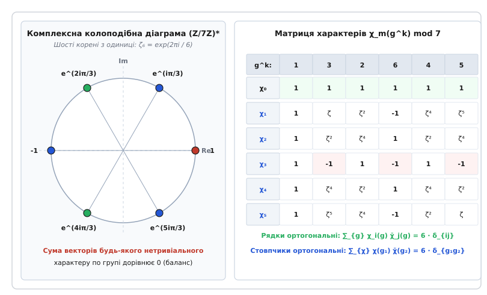
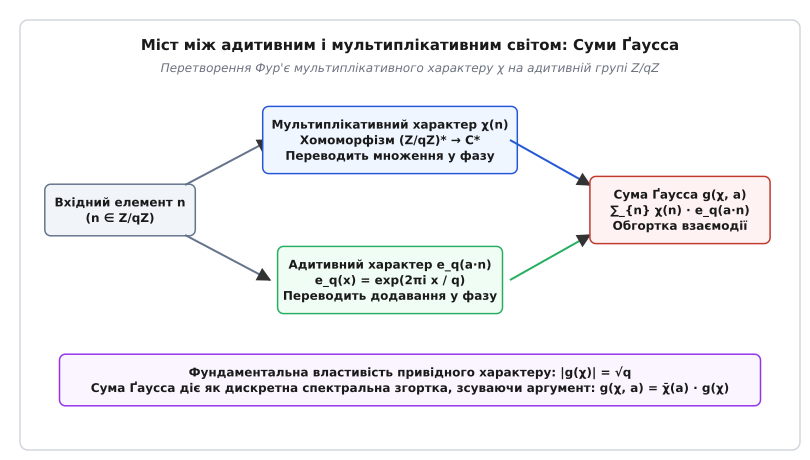
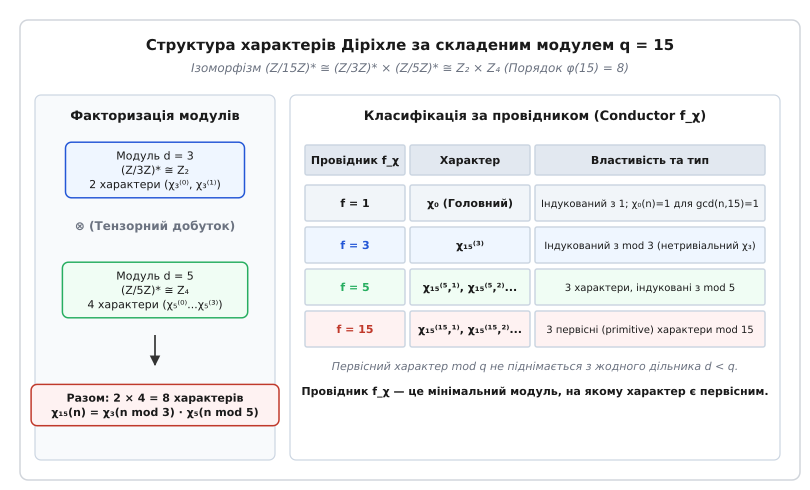

# Мультиплікативні й адитивні характери

<preknowlist>
- [Теорія груп та гомоморфізми](book:math/group-theory) — поняття груп, підгруп, ядра та гомоморфізмів.
- [Група оборотних елементів кільця лишків](book:math/multiplicative-group-zn) — структура `Z/nZ` та `(Z/nZ)*`, функція Ейлера `φ(n)`.
- [Первісні корені](book:math/primitive-root) — генератори циклічної групи `(Z/pZ)*`.
- [Символ Лежандра та квадратичні залишки](book:math/quadratic-residues) — окремий випадок квадратичного мультиплікативного характеру.
- [Комплексні числа та корені з одиниці](book:math/complex-numbers) — формула Ейлера `e^(iθ)` та група коренів з одиниці `U_n`.
</preknowlist>

> 🔧 **Навіщо це.**
> Мультиплікативні й адитивні характери є фундаментальним містком між двома алгебраїчними операціями — додаванням і множенням у скінченних кільцях лишків та полях. Вони дозволяють перетворити розклад чисел та нелінійні цілочисельні рівняння на спектральний аналіз комплексних фаз на одиничному колі. Без характерів неможливо довести теорему Діріхле про нескінченність простих чисел в арифметичних прогресіях, обчислити кількість точок на еліптичних кривих над скінченними полями, побудувати сучасні схеми криптографічного шифрування на основі дискретного перетворення Фур'є або довести закономірності квадратичного закону взаємності.

## 1. Проблема розділення арифметичних сигналів

При обчисленні кількості цілочисельних розв'язків нелінійних діофантових рівнянь над скінченними полями або при дослідженні розподілу простих чисел у конкретній арифметичній прогресії прямий комбінаторний перебір вимагає `O(p²)` обчислень і руйнує мультиплікативні зв'язки. Якщо спробувати виділити прості числа вида `n ≡ a (mod q)` за допомогою звичайної індикаторної функції `f(n) = 1` при `n ≡ a mod q` та `f(n) = 0` в інших випадках, розклад Ейлерового добутку для дзета-функції `ζ(s) = ∏ (1 - p⁻ˢ)⁻¹` миттєво розпадається, оскільки індикаторний фільтр не зберігає множення чисел (`f(m·n) ≠ f(m)·f(n)`).

Щоб зберегти розклад на прості множники і водночас отримати можливість розділяти арифметичні прогресії, виникла потреба в особливому математичному апараті — базисі числових функцій, які одночасно є періодичними та мультиплікативними. Такими функціями і є **характери**.

З алгебраїчної точки зору, нехай `G` — скінченна абелева група (наприклад, адитивна група лишків `(Z/qZ, +)` або мультиплікативна група оборотних лишків `((Z/qZ)*, ·)`). **Характером групи G** називається будь-який гомоморфізм `χ` з групи `G` у мультиплікативну групу ненульових комплексних чисел `C*`:

```
χ: G → C*   такий, що   χ(g₁ · g₂) = χ(g₁) · χ(g₂)
```

Оскільки група `G` є скінченною порядку `N = |G|`, для кожного елемента `g ∈ G` виконується рівність `g^N = e` (де `e` — нейтральний елемент групи). За властивістю гомоморфізму:

```
(χ(g))^N = χ(g^N) = χ(e) = 1
```

Це означає, що значення будь-якого характеру `χ(g)` не можуть бути довільними комплексними числами: вони строго належать множині `N`-их коренів з одиниці і лежать на комплексному одиничному колі `S¹ = {z ∈ C | |z| = 1}`. Зокрема, абсолютна величина значень завжди дорівнює одиниці: `|χ(g)| = 1`, а комплексно-спряжене значення дорівнює оберненому елементу:

```
χ̄(g) = (χ(g))⁻¹ = χ(g⁻¹)
```

Множина всіх характерів групи `G` сама утворює абелеву групу щодо точкового множення функцій `(χ₁ · χ₂)(g) = χ₁(g) · χ₂(g)`. Ця група називається **дуальною групою** (або групою характерів) і позначається `Ĝ = Hom(G, C*)`. Порядок дуальної групи завжди строго дорівнює порядку початкової групи: `|Ĝ| = |G|`.

### Двоїстість Понтрягіна та простори функцій

Для скінченних абелевих груп існує канонічний ізоморфізм між групою `G` та її подвійною дуальною групою `(Ĝ)̂`, який виражається естетичним відображенням `g ↦ (χ ↦ χ(g))`. Це означає, що елементи самої групи `G` діють як характери на дуальній групі `Ĝ`.

Будь-яка комплексна функція `f: G → C`, задана на скінченній абелевій групі, може бути єдиним чином розкладена у ряд Фур'є за ортогональним базисом характерів:

```
f(g) = ∑_{χ ∈ Ĝ} c_χ · χ(g)   де   c_χ = (1 / |G|) · ∑_{g ∈ G} f(g) · χ̄(g)
```

Коефіцієнти `c_χ` являють собою спектральні амплітуди Фур'є функції `f`. Таким чином, характери утворюють універсальний гармонічний базис для спектрального аналізу на алгебраїчних структурах.

## 2. Адитивні характери на кільці лишків Z/qZ

Розглянемо спочатку адитивну групу цілих чисел за модулем `q`: `G = (Z/qZ, +)`. Елементами цієї групи є класи лишків `{0, 1, 2, ..., q - 1}`, а груповою операцією є додавання за модулем `q`.

Умова гомоморфізму для **адитивного характеру** `ψ` вимагає перетворення додавання елементів у множення комплексних фаз:

```
ψ(x + y mod q) = ψ(x) · ψ(y)
```

Оскільки елемент `1` є генератором адитивної групи `(Z/qZ, +)`, значення характеру на будь-якому елементі `x` повністю визначається його значенням на одиниці `ψ(1)`. Позначивши `ψ(1) = exp(2·π·i · k / q)` для деякого цілого індексу `k ∈ {0, 1, ..., q - 1}`, ми отримуємо повну родинну множину з `q` адитивних характерів `ψ_k`:

```
ψ_k(x) = exp( 2·π·i · k · x / q )
```

Канонічним (або базовим) адитивним характером називають характер при `k = 1`:

```
e_q(x) = exp( 2·π·i · x / q )
```

Тоді довільний адитивний характер виражається як `ψ_k(x) = e_q(k · x)`. Якщо `k = 0`, характер `ψ₀(x) = 1` для всіх `x` називається **тривіальним (або головним) адитивним характером**.

### Співвідношення ортогональності адитивних характерів

Адитивні характери утворюють ортонормований базис у просторі комплексних функцій на `Z/qZ`. Сума значень адитивного характеру по усім елементам групи задовольняє суворе співвідношення:

```
∑_{x=0}^{q-1} exp( 2·π·i · k · x / q )
= q  [якщо k ≡ 0 (mod q)]
= 0  [якщо k ≢ 0 (mod q)]
```

З фізичної та інженерної точки зору, адитивні характери `ψ_k(x)` є ні чим іншим, як гармоніками дискретного перетворення Фур'є (DFT — Discrete Fourier Transform) на скінченному інтервалі `Z/qZ`. Індекс `k` відповідає дискретній частоті, а змінна `x` — дискретному часу або просторовій координаті.

## 3. Мультиплікативні характери та характери Діріхле

Тепер розглянемо мультиплікативну групу оборотних лишків за модулем `q`: `G = ((Z/qZ)*, ·)`. Елементами цієї групи є класи лишків `x mod q`, які є взаємно простими з модулем `gcd(x, q) = 1`. Порядок цієї групи дорівнює функції Ейлера `|G| = φ(q)`.

**Мультиплікативним характером за модулем q** називається гомоморфізм з мультиплікативної групи оборотних лишків у комплексну одиничну окружність:

```
χ: (Z/qZ)* → C*   такий, що   χ(a · b mod q) = χ(a) · χ(b)
```

Щоб перетворити такий характер на інструмент аналізу на всій множині цілих чисел `Z`, Петер Ґустав Лежен-Діріхле розширив область визначення характеру з групи `(Z/qZ)*` на всі цілі числа `Z`, створивши поняття **характеру Діріхле**.

### Означення характеру Діріхле

Числова функція `χ: Z → C` називається характером Діріхле за модулем `q`, якщо виконуються три умови:

1. **Періодичність:** `χ(n + q) = χ(n)` для всіх `n ∈ Z`.
2. **Повна мультиплікативність:** `χ(m · n) = χ(m) · χ(n)` для всіх `m, n ∈ Z`.
3. **Арифметична підтримка:** `χ(n) ≠ 0` тоді і тільки тоді, коли `gcd(n, q) = 1`. Якщо `gcd(n, q) > 1`, то за визначенням `χ(n) = 0`.

Характер `χ₀`, який набуває значення `1` для всіх чисел `n`, взаємно простих з `q`, і `0` для чисел `gcd(n, q) > 1`, називається **головним (тривіальним) характером Діріхле**.

### Конструктивна побудова для простого модуля p

Якщо модуль `q = p` є простим числом, група `(Z/pZ)*` є циклічною порядку `p - 1`. Нехай `g` — первісний корінь за модулем `p`. Тоді для кожного `n ≢ 0 (mod p)` існує єдиний дискретний логарифм `k = ind_g(n) ∈ {0, 1, ..., p - 2}` такий, що `n ≡ g^k (mod p)`.

Усі `p - 1` різних характерів Діріхле за модулем `p` конструктивно задаються формулою:

```
χ_m(n) = exp( 2·π·i · m · ind_g(n) / (p - 1) )
```

де `m ∈ {0, 1, ..., p - 2}` — індекс характеру.

- При `m = 0` отримуємо головний характер: `χ₀(n) = exp(0) = 1` (для `n ≢ 0 mod p`).
- При `m = (p - 1) / 2` (для непарного `p`) отримуємо єдиний нетривіальний реальний характер порядку 2 — знаменитий **символ Лежандра**:

```
χ_{ (p-1)/2 } (n) = (n / p)
= +1  [якщо n є квадратичним залишком mod p]
= -1  [якщо n є квадратичним незалишком mod p]
```

### Парність характерів Діріхле

Оскільки `(-1)² = 1 mod q`, значення характеру на мінус одиниці може дорівнювати лише `+1` або `-1`:

```
χ(-1) = ±1
```

- Якщо `χ(-1) = +1`, характер називається **парним** (even character).
- Якщо `χ(-1) = -1`, характер називається **непарним** (odd character).

Детальний аналіз еволюції цього поняття від квадратичних форм до абстрактної алгебри викладено у вставці [📜 Історія виникнення характерів](book:math/multiplicative-characters/hist-character-genesis.md).

## 4. Подвійна ортогональність та аналіз Фур'є на скінченних групах

Фундаментальною властивістю характерів, яка робить їх інструментом спектрального аналізу, є подвійна ортогональність. Вона виражається двома симетричними теоремами.

### Перше співвідношення ортогональності (сума за елементами групи)

Якщо підсумувати значення конкретного характеру `χ` по всіх елементах мультиплікативної групи `(Z/qZ)*`, результат дорівнює порядку групи для головного характеру і строго дорівнює нулю для будь-якого нетривіального характеру:

```
∑_{a ∈ (Z/qZ)*} χ(a)
= φ(q)  [якщо χ = χ₀]
= 0     [якщо χ ≠ χ₀]
```

### Друге співвідношення ортогональності (сума за групою характерів)

Якщо фіксувати елемент групи `a ∈ (Z/qZ)*` і підсумувати значення всіх `φ(q)` характерів на цьому елементі, сума дорівнює порядку групи, якщо `a ≡ 1 (mod q)`, і нулю в протилежному випадку:

```
∑_{χ ∈ Ĝ} χ(a)
= φ(q)  [якщо a ≡ 1 (mod q)]
= 0     [якщо a ≢ 1 (mod q)]
```

### Дельта-функція та індикаторний фільтр лишків

Об'єднуючи перше і друге співвідношення ортогональності, ми отримуємо точну формулу для **індикаторної дельта-функції** конкретного класу лишків `n ≡ a (mod q)`:

```
δ_{a}(n)
= (1 / φ(q)) · ∑_{χ ∈ Ĝ} χ̄(a) · χ(n)
= 1  [якщо n ≡ a (mod q)]
= 0  [якщо n ≢ a (mod q)]
```

Ця формула є серцем аналітичної теорії чисел. Вона дозволяє розкласти розривний індикатор «чи належить число `n` арифметичній прогресії `a + k·q`» у лінійну комбінацію гладких мультиплікативних функцій `χ(n)`.


*Візуалізація матриці характерів за модулем 7 та колоподібної діаграми коренів з одиниці.*

На наведеній вище схемі ліворуч показано корені з одиниці на комплексній площині для `(Z/7Z)*` (порядок `φ(7) = 6`). Векторна сума цих шести точок для будь-якого нетривіального характеру утворює замкнений правильний багатокутник з нульовим центром мас. Праворуч наведено матрицю характерів `6 × 6`, скалярний добуток будь-яких двох різних рядків або стовпчиків якої строго дорівнює нулю.

## 5. Міст між додаванням і множенням: Суми Ґаусса

Адитивні характери `e_q(a·n)` діють на групі `(Z/qZ, +)`, а мультиплікативні характери `χ(n)` діють на групі `((Z/qZ)*, ·)`. Як об'єднати ці два світи у єдину алгебраїчну конструкцію? Відповіддю є **суми Ґаусса**.

**Означення:** Для мультиплікативного характеру `χ` та адитивного індексу `a ∈ Z/qZ` **сумою Ґаусса** `g(χ, a)` називається комплексна згортка:

```
g(χ, a) = ∑_{n ∈ Z/qZ} χ(n) · exp( 2·π·i · a · n / q )
```

Якщо `a = 1`, суму називають базисною сумою Ґаусса і позначають `g(χ)`.


*Операторна схема спектрального поєднання адитивних і мультиплікативних фаз у сумі Ґаусса.*

Сума Ґаусса являє собою **дискретне перетворення Фур'є мультиплікативного характеру `χ` на адитивній групі `Z/qZ`**. Вона вимірює, наскільки мультиплікативна фаза `χ(n)` резонує з адитивною частотою `exp(2·π·i·a·n / q)`.

### Основні властивості сум Ґаусса

1. **Трансформація адитивного зсуву:** Для будь-якого `a` такого, що `gcd(a, q) = 1`, виконується тотожність:

```
g(χ, a) = χ̄(a) · g(χ)
```

2. **Модуль привідної суми Ґаусса:** Для будь-якого привідного (primitive) характеру `χ` за модулем `q` квадрат абсолютного значення суми Ґаусса точно дорівнює модулю `q`:

```
|g(χ)|² = g(χ) · ḡ(χ) = q   ⇒   |g(χ)| = √q
```

3. **Точне значення квадратичної суми Ґаусса:** Для символу Лежандра `χ_leg(n) = (n / p)` сума Ґаусса обчислюється точним алгебраїчним виразом:

```
g(χ_leg) = √p        [якщо p ≡ 1 (mod 4)]
g(χ_leg) = i · √p    [якщо p ≡ 3 (mod 4)]
```

4. **Відображення спряження:** Для непарних та парних характерів спряжена сума задовольняє рівність `g(χ̄) = χ(-1) · ḡ(χ)`.

Строгі математичні доведення цих властивостей, а також теорію сум Якобі `J(χ, ψ)` та їхнє застосування до обчислення точок на кривих наведено у вставці [🧮 Алгебраїчні властивості та виведення сум Ґаусса й Якобі](book:math/multiplicative-characters/math-gauss-jacobi-sums.md).

## 6. Складені модулі, провідник та первісність

Коли модуль `q` є складеним числом `q = p₁^{e₁} · p₂^{e₂} · ... · p_k^{e_k}`, структура мультиплікативної групи за Китайською теоремою про остачі (CRT — Chinese Remainder Theorem) розкладається у прямий добуток груп:

```
(Z/qZ)* ≅ (Z/p₁^{e₁}Z)* × (Z/p₂^{e₂}Z)* × ... × (Z/p_k^{e_k}Z)*
```

Відповідно, група характерів складеного модуля `Ĝ` ізоморфна тензорному добутку груп характерів своїх примарних факторів. Будь-який характер `χ mod q` єдиним чином подається у вигляді добутку фактор-характерів:

```
χ(n) = χ₁(n mod p₁^{e₁}) · χ₂(n mod p₂^{e₂}) · ... · χ_k(n mod p_k^{e_k})
```


*Класифікація характерів за модулем 15 за провідником та їхній зв'язок з факторідеалами.*

### Поняття провідника (Conductor) та первісного характеру

Деякі характери за складеним модулем `q` є «фіктивними»: вони фактично виникають підняттям характерів з меншого модуля `d`, який ділить `q` (`d | q`).

- Характер `χ mod q` називається **індукованим** з модуля `d` (де `d | q` та `d < q`), якщо існує характер `χ' mod d` такий, що `χ(n) = χ'(n)` для всіх `n` з `gcd(n, q) = 1`.
- Характер `χ mod q` називається **первісним (primitive character)**, якщо він не індукується з жодного меншого модуля `d < q`.
- Найменший дільник `f_χ | q`, з якого індукується характер `χ`, називається **провідником характеру (conductor of χ)**.

Якщо характер `χ mod q` не є первісним (тобто його провідник `f_χ < q`), його сума Ґаусса вироджується і її модуль вже не дорівнює `√q`, а містить додаткові арифметичні дільники.

## 7. Застосування у теорії чисел, аналізі та криптографії

Мультиплікативні й адитивні характери є не просто абстрактною алгебраїчною конструкцією, а робочим конем сучасної математики та інформатики.

### 1. L-функції Діріхле та прості числа

Замінивши у дзета-функції Ейлера чисельник на характер Діріхле `χ(n)`, виділяють **L-функцію Діріхле**:

```
L(s, χ) = ∑_{n=1}^∞ χ(n) / n^s = ∏_{p} (1 - χ(p) / p^s)⁻¹
```

Оскільки `L(1, χ) ≠ 0` для всіх нетривіальних характерів, підсумовування по всіх `χ ∈ Ĝ` з використанням індикаторного фільтра `δ_a(n)` дає точне доведення того, що сума `∑_{p ≡ a mod q} 1/p` розбігається як `(1 / φ(q)) · ln(ln X)`. Це доводить нескінченність та рівномірний щільнісний розподіл простих чисел у всіх доступних арифметичних прогресіях.

### 2. Закон квадратичної взаємності

За допомогою квадратичної суми Ґаусса `g(χ_leg)` для символу Лежандра можна дати надзвичайно коротке та прозоре доведення теореми Гаусса про квадратичну взаємність:

```
(p / q) · (q / p) = (-1)^{ ((p-1)/2) · ((q-1)/2) }
```

Обчислення квадрата суми Ґаусса `g(χ_leg)² = (-1)^{(p-1)/2} · p` дозволяє виразити символ Лежандра `(q / p)` через дії в розширенні полів `Z[ζ_p]`, уникаючи складних комбінаторних підрахунків індукції.

### 3. Підрахунок точок на алгебраїчних кривих

За допомогою сум Якобі `J(χ, ψ)` обчислюють точну кількість точок на діагональних гіперповерхнях над скінченними полями `F_q` (криві Ферма `x^n + y^n ≡ 1 mod p`, еліптичні криві `y² ≡ x³ + a·x + b mod p`). Це лежить в основі локальних дзета-функцій Хассе-Вейля та сучасного криптографічного аналізу еліптичних кривих (ECC).

### 4. Алгоритми та програмування

На практиці обчислення характерів, дискретне логарифмування, швидкі суми Ґаусса та перевірка ортогональності реалізуються на мовах низького та високого рівня. Практичну реалізацію цих алгоритмів мовами C та C++ з вихідним кодом та розбором обчислювальних пасток наведено у вставці [⚙️ Обчислення характерів та сум Ґаусса в C та C++](book:math/multiplicative-characters/proj-character-computation.md).
