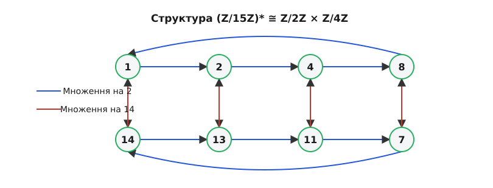

# Група оборотних елементів кільця лишків

<preknowlist>
- [Модульна арифметика та кільце лишків](/book/math/number-theory/modular-arithmetic-z/modular-arithmetic-z-d.html)
- [Функція Ейлера](/book/math/number-theory/euler-totient-function/euler-totient-function-d.html)
- [Основи теорії груп](/book/math/algebra/groups-introduction/groups-introduction-d.html)
</preknowlist>

Коли ми вивчаємо кільце лишків за модулем n, що позначається як Z/nZ (або Zn), ми розглядаємо множину чисел {0, 1, ..., n-1} з операціями додавання та множення за модулем n. Однак не всі елементи цього кільця мають обернені елементи відносно множення. Ті елементи, які можна обернути, утворюють особливу структуру — мультиплікативну групу кільця лишків. 

> 🔧 **Навіщо це.** Мультиплікативні групи є серцем сучасної криптографії з відкритим ключем. Без них не існувало б алгоритму RSA, обміну ключами Діффі-Геллмана та криптосистеми Ель-Гамаля. Вони дозволяють створювати односторонні функції — математичні задачі, які легко обчислити в прямому напрямку (зведення в ступінь), але практично неможливо розв'язати у зворотному (дискретне логарифмування).

Ця стаття детально досліджує множину таких елементів, їхні властивості, внутрішню структуру утвореної ними групи та її практичне застосування.

## Оборотні елементи та умова взаємної простоти

В арифметиці за модулем n елемент a має обернений елемент x, якщо виконується порівняння:
a · x ≡ 1 (mod n)

За допомогою лінійного діофантового рівняння цю умову можна переписати так:
a · x + n · y = 1

Згідно з теоремою Безу, таке рівняння має розв'язки в цілих числах x, y тоді і тільки тоді, коли найбільший спільний дільник (НСД, або англійською gcd) чисел a та n дорівнює 1. 

Тобто, елемент a оборотний за модулем n тоді й лише тоді, коли gcd(a, n) = 1 (числа a і n є взаємно простими).

### Множина (Z/nZ)*

Множина всіх оборотних елементів кільця Z/nZ утворює групу відносно операції множення за модулем n. Цю групу позначають як (Z/nZ)* або U(n) (від слова "units" — оборотні елементи кільця).

Розглянемо приклад для n = 10. Кільце Z/10Z складається з елементів {0, 1, 2, 3, 4, 5, 6, 7, 8, 9}.
Знайдемо gcd кожного елемента з 10:
gcd(0, 10) = 10
gcd(1, 10) = 1
gcd(2, 10) = 2
gcd(3, 10) = 1
gcd(4, 10) = 2
gcd(5, 10) = 5
gcd(6, 10) = 2
gcd(7, 10) = 1
gcd(8, 10) = 2
gcd(9, 10) = 1

Взаємно простими з 10 є елементи {1, 3, 7, 9}. Отже, (Z/10Z)* = {1, 3, 7, 9}.

Перевіримо, чи утворює ця множина групу. Група повинна бути замкненою щодо множення, містити нейтральний елемент (одиницю) і для кожного елемента повинен існувати обернений.
- Замкненість: множення будь-яких двох непарних чисел, що не діляться на 5, дасть число, яке також не ділиться на 2 і 5. Наприклад, 3 · 7 = 21 ≡ 1 (mod 10). Елемент 1 є у множині.
- Одиниця: 1 присутня.
- Обернені: 1 обернене до 1 (1·1=1); 3 обернене до 7 (3·7=21≡1); 9 обернене до 9 (9·9=81≡1).

Як бачимо, усі групові аксіоми виконуються.

## Порядок групи та функція Ейлера

Кількість елементів у групі (Z/nZ)* називається її порядком і позначається як |(Z/nZ)*|. Оскільки група складається з чисел від 1 до n, взаємно простих з n, порядок групи дорівнює значенню функції Ейлера φ(n).

|(Z/nZ)*| = φ(n)

Наприклад:
- Для простого числа p, всі числа від 1 до p-1 взаємно прості з p, тому φ(p) = p - 1. Група (Z/pZ)* містить p-1 елемент.
- Для n = 15 = 3 · 5, φ(15) = φ(3) · φ(5) = 2 · 4 = 8. Група (Z/15Z)* складається з {1, 2, 4, 7, 8, 11, 13, 14}.

Знання порядку групи має вирішальне значення завдяки теоремі Лагранжа, яка стверджує, що для будь-якого елемента a групи G, a в степені |G| дорівнює нейтральному елементу (одиниці).
У нашому контексті це перетворюється на знамениту теорему Ейлера:

Якщо gcd(a, n) = 1, то a^φ(n) ≡ 1 (mod n)

Ця теорема є узагальненням Малої теореми Ферма, яка формулюється для простого модуля p:
a^(p-1) ≡ 1 (mod p)

## Функція Кармайкла та експонента групи

Хоча теорема Ейлера гарантує, що a^φ(n) ≡ 1 (mod n), часто існує ще менший показник степеня, який перетворює всі елементи групи на 1. Цей найменший спільний показник степеня називається експонентою групи і позначається функцією Кармайкла λ(n).

Функція λ(n) визначає мінімальне m > 0 таке, що a^m ≡ 1 (mod n) для всіх a, взаємно простих з n.
- Для p^k (де p - непарне просте, або p=2 і k≤2), λ(p^k) = φ(p^k).
- Для 2^k при k ≥ 3, λ(2^k) = φ(2^k) / 2 = 2^(k-2).
- Для складеного n = p₁^k₁ · p₂^k₂ · ... · p_m^k_m, λ(n) = lcm(λ(p₁^k₁), λ(p₂^k₂), ..., λ(p_m^k_m)), де lcm — найменше спільне кратне.

Наприклад, для n = 15, φ(15) = 8. Але λ(15) = lcm(λ(3), λ(5)) = lcm(2, 4) = 4.
Це означає, що a⁴ ≡ 1 (mod 15) для всіх a ∈ (Z/15Z)*. Тому жоден елемент у цій групі не може мати порядок більший за 4, хоча сама група містить 8 елементів. Саме це доводить, що група не є циклічною, бо для циклічності потрібен елемент порядку 8.

## Структура мультиплікативної групи

Хоча (Z/nZ)* завжди є групою, її внутрішня структура (чи можна її згенерувати одним елементом) залежить від n.

### Циклічні групи та первісні корені

Група називається циклічною, якщо існує такий елемент g (званий генератором або первісним коренем), що будь-який елемент групи можна подати як g^k для деякого цілого k. Тобто ступені g "пробігають" усі елементи групи.

Не кожна група (Z/nZ)* є циклічною. Карл Фрідріх Ґаусс довів, що (Z/nZ)* є циклічною тоді й лише тоді, коли n дорівнює:
- 2,
- 4,
- p^k (де p — непарне просте число, k ≥ 1),
- 2p^k.

Наприклад, для n = 7 (просте число p), φ(7) = 6. Елементи: {1, 2, 3, 4, 5, 6}.
Перевіримо степені числа 3 за модулем 7:
3¹ ≡ 3
3² ≡ 9 ≡ 2
3³ ≡ 2 · 3 ≡ 6
3⁴ ≡ 6 · 3 ≡ 18 ≡ 4
3⁵ ≡ 4 · 3 ≡ 12 ≡ 5
3⁶ ≡ 5 · 3 ≡ 15 ≡ 1

Ми отримали всі 6 елементів групи. Отже, 3 є первісним коренем, і група (Z/7Z)* циклічна. Вона ізоморфна адитивній групі Z/6Z (де замість множення відбувається додавання за модулем 6 показників степеня).

Якщо ж взяти n = 8 (степінь двійки, більший за 4), то φ(8) = 4. Елементи: {1, 3, 5, 7}.
Перевіримо їхні квадрати:
3² = 9 ≡ 1 (mod 8)
5² = 25 ≡ 1 (mod 8)
7² = 49 ≡ 1 (mod 8)
Оскільки кожен елемент у квадраті дає 1, немає жодного елемента, який би генерував усі 4 елементи групи. (Z/8Z)* не циклічна. Вона ізоморфна прямому добутку Z/2Z × Z/2Z.

## Розклад нециклічних груп та Китайська теорема про залишки

Для чисел n, що не підпадають під перелічені вище категорії (наприклад, композитні числа з декількома різними непарними простими дільниками), група (Z/nZ)* не є циклічною, але її можна розкласти на прямий добуток простіших циклічних груп.

Це здійснюється за допомогою Китайської теореми про залишки. Якщо n = p₁^k₁ · p₂^k₂ · ... · p_m^k_m (канонічний розклад n на прості множники), то:
(Z/nZ)* ≅ (Z/p₁^k₁)* × (Z/p₂^k₂)* × ... × (Z/p_m^k_m)*

Наприклад, для n = 15 = 3 · 5:
(Z/15Z)* ≅ (Z/3Z)* × (Z/5Z)*
(Z/3Z)* має φ(3) = 2 елементи і є циклічною групою, ізоморфною Z/2Z.
(Z/5Z)* має φ(5) = 4 елементи і є циклічною групою, ізоморфною Z/4Z.
Отже, (Z/15Z)* ≅ Z/2Z × Z/4Z. Вона не є циклічною, оскільки найбільший можливий порядок елемента дорівнює НСК(2, 4) = 4, тоді як загальний порядок групи φ(15) = 8.

Це означає, що в (Z/15Z)* немає елемента a, такого що a^8 ≡ 1 і жоден менший ступінь не дає 1. Найбільший цикл, який ми можемо згенерувати, матиме довжину 4.
Перевіримо елемент 2:
2¹ ≡ 2
2² ≡ 4
2³ ≡ 8
2⁴ ≡ 16 ≡ 1
Так, максимальний період справді дорівнює 4.

### Глибший приклад: Група (Z/21Z)*

Розглянемо n = 21 = 3 · 7. Група (Z/21Z)* містить φ(21) = φ(3) · φ(7) = 2 · 6 = 12 елементів.
За теоремою: (Z/21Z)* ≅ (Z/3Z)* × (Z/7Z)* ≅ Z/2Z × Z/6Z.
Експонента групи λ(21) = lcm(2, 6) = 6. 
Отже, максимальний порядок елемента тут дорівнює 6, а не 12, і група не циклічна.

Елементи: {1, 2, 4, 5, 8, 10, 11, 13, 16, 17, 19, 20}.
Знайдемо порядок числа 2:
2¹ ≡ 2
2² ≡ 4
2³ ≡ 8
2⁴ ≡ 16
2⁵ ≡ 32 ≡ 11
2⁶ ≡ 22 ≡ 1
Порядок 2 дорівнює 6. Воно генерує підгрупу з 6 елементів: {1, 2, 4, 8, 11, 16}.
Щоб описати всю групу, нам потрібен інший незалежний генератор, який представляє другу компоненту ізоморфізму (Z/2Z). Наприклад, елемент 20 (або -1).
Порядок 20: 20² = 400 = 19 · 21 + 1 ≡ 1. Порядок дорівнює 2.
Будь-який елемент з (Z/21Z)* тепер можна однозначно подати у вигляді (2^x · 20^y) (mod 21), де x ∈ {0..5}, y ∈ {0,1}.
Такий розклад на незалежні генератори є ключовим інструментом у багатьох алгоритмах факторизації та розв'язання рівнянь.

## Генератори та дискретний логарифм

У циклічних групах Z/pZ кожному елементу x можна поставити у відповідність його "показник степеня" відносно фіксованого первісного кореня g. Такий показник k, для якого g^k ≡ x (mod p), називається дискретним логарифмом x за основою g.
Подібно до звичайних логарифмів, дискретний логарифм перетворює множення на додавання:
log_g(a · b) ≡ log_g(a) + log_g(b) (mod p-1)

Ця властивість робить ізоморфізм між мультиплікативною групою (Z/pZ)* та адитивною групою Z/(p-1)Z явним. Однак, обчислити цей логарифм обчислювально надзвичайно складно для великих p. Саме на цій асиметрії — легко піднести до степеня (швидке експоненціювання), але важко знайти показник (дискретне логарифмування) — побудована левова частка сучасної криптографії.

## Застосування в криптографії

Властивості мультиплікативних груп лежать в основі найпоширеніших криптосистем із відкритим ключем.

### Алгоритм RSA

В RSA модуль N = p · q (де p, q — великі прості числа).
Порядок мультиплікативної групи (Z/NZ)* дорівнює φ(N) = (p - 1)(q - 1). (Насправді, для генерації ключів достатньо використовувати експоненту λ(N) = lcm(p-1, q-1), що є ще одним наслідком нашого розуміння структури групи).

Ключовий принцип RSA спирається на теорему Ейлера: m^φ(N) ≡ 1 (mod N) для будь-якого повідомлення m, взаємно простого з N (завдяки Китайській теоремі про залишки це працює для всіх m, навіть не взаємно простих, бо m^(k·φ(N)+1) ≡ m зберігається як по модулю p, так і по модулю q).

Відкритий ключ e (експонента шифрування) обирається так, щоб gcd(e, φ(N)) = 1 (або gcd(e, λ(N)) = 1).
Закритий ключ d (експонента дешифрування) є мультиплікативно оберненим до e за модулем φ(N):
e · d ≡ 1 (mod φ(N))
Це означає, що e · d = k · φ(N) + 1.

Шифрування: c ≡ m^e (mod N)
Дешифрування: c^d ≡ (m^e)^d ≡ m^(e·d) ≡ m^(k·φ(N)+1) ≡ (m^φ(N))^k · m ≡ 1^k · m ≡ m (mod N).
Без знання розкладу N на прості множники неможливо обчислити φ(N), отже неможливо знайти d, що робить шифр стійким. Злам RSA еквівалентний знаходженню порядку мультиплікативної групи (Z/NZ)*.

### Криптосистема Ель-Гамаля та Протокол Діффі-Геллмана

Ці системи спираються на циклічну природу (Z/pZ)* для великого простого p і складність проблеми дискретного логарифму.

Замість того, щоб спиратися на складність факторизації як в RSA, вони використовують генератор g циклічної групи (Z/pZ)*.
Аліса обирає таємне число a і публікує A = g^a (mod p).
Боб обирає таємне число b і публікує B = g^b (mod p).

Обчислити a, знаючи лише A, g і p, є задачею дискретного логарифмування, що дуже складно для великих p (для цього використовуються алгоритми на зразок алгоритму Шенкса baby-step giant-step, або решето числового поля, які вимагають експоненційного або суб-експоненційного часу).

Аліса обчислює B^a = (g^b)^a = g^(ab) (mod p).
Боб обчислює A^b = (g^a)^b = g^(ab) (mod p).
Тепер вони мають спільний таємний ключ g^(ab), не передаючи його відкритим каналом. Цей ключ може бути використаний для симетричного шифрування, або безпосередньо у криптосистемі Ель-Гамаля, де повідомлення m маскується множенням на спільний секрет: c = m · g^(ab) (mod p).
Легкість генерації циклічної групи та складність обертання цієї операції робить цю структуру ідеальною для захищеного зв'язку.

## Висновки

Мультиплікативна група (Z/nZ)* є фундаментальним об'єктом, що пов'язує просту арифметику остач з глибокими концепціями алгебри. Її порядок, обумовлений функцією Ейлера, та її структура (циклічна для простих модулів та складна для композитних) формують теоретичну базу для безпеки наших щоденних цифрових комунікацій. Теореми Ейлера, Лагранжа та Кармайкла, що описують закони взаємодії елементів у цій групі, дозволяють не лише аналізувати математичні властивості чисел, а й створювати стійкі криптографічні системи. Завдяки ізоморфізмам та Китайській теоремі про залишки, найскладніші композитні модулі розкладаються на базові блоки, відкриваючи справжню геометрію чисел.
