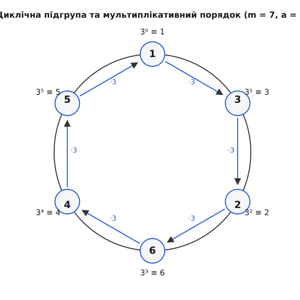

# Мультиплікативний порядок

<preknowlist>
- [Основи модульної арифметики](/math/number-theory/modular-arithmetic)
- [Найбільший спільний дільник (НСД)](/math/number-theory/gcd-euclidean)
- [Функція Ейлера φ(m)](/math/number-theory/euler-totient)
- [Мала теорема Ферма та теорема Ейлера](/math/number-theory/fermat-little-theorem)
</preknowlist>

> 🔧 **Навіщо це.** Мультиплікативний порядок є фундаментальною концепцією, на якій тримається вся сучасна асиметрична криптографія, включно з RSA та алгоритмами на основі еліптичних кривих. Він описує "періодичність" або "довжину циклу" чисел при множенні за модулем. Розуміння порядку дозволяє аналізувати циклічні підгрупи, знаходити генератори псевдовипадкових чисел та розробляти ефективні тести простоти (наприклад, тест Поклінгтона). Без знання про мультиплікативний порядок було б неможливо оцінювати стійкість криптографічних примітивів, що покладаються на проблему дискретного логарифма. Ця концепція з'єднує абстрактні алгебраїчні структури із цілком практичними задачами інформаційної безпеки, перетворюючи теоретичну математику на надійний щит для цифрового світу.

Коли ми розглядаємо додавання чисел за модулем m, усе досить просто. Уявіть собі звичайний циферблат годинника, де числа розташовані по колу. Якщо постійно додавати одиницю (або будь-яке інше число, взаємно просте з m), ми рівномірно пройдемо всі можливі поділки від 0 до m-1 і врешті-решт обов'язково повернемося до нуля. Це класична адитивна циклічна група. Вона є лінійною, повністю передбачуваною, і її структуру дуже легко зрозуміти інтуїтивно. Кожен крок — це просто зсув на фіксовану відстань.

Але що відбувається, якщо замість додавання ми почнемо використовувати множення? Множення — це не просто зсув. Множення — це розтягування простору, яке після досягнення межі модуля "намотується" на коло знову і знову. 

Якщо взяти довільне число a і послідовно множити його саме на себе за модулем m, ми отримаємо послідовність чисел: a¹, a², a³, a⁴, a⁵... (mod m). Чи буде ця послідовність коли-небудь повторюватися? Чи повернеться вона коли-небудь до 1, тобто чи отримаємо ми замкнений цикл? Виявляється, якщо число a та модуль m є взаємно простими, то ця послідовність абсолютно гарантовано зациклиться, і ми обов'язково натрапимо на крок, де aᵏ ≡ 1 (mod m). Питання лише в тому, на якому саме кроці k це вперше станеться. Пошук цього найпершого кроку і є серцевиною поняття мультиплікативного порядку.

## Що таке мультиплікативний порядок? (Метод Фейнмана)

Давайте розберемо це поняття з найперших принципів, не використовуючи складних формул, а просто спостерігаючи за поведінкою чисел. 

Уявімо, що ми знаходимося в модулярній системі за модулем 7. Візьмемо число a = 3. Наша мета — подивитися, куди нас заведе багаторазове множення на 3. Ми стартуємо з 3¹ і на кожному наступному кроці множимо попередній результат на 3, не забуваючи брати остачу від ділення на 7.

Крок 1: 3¹ ≡ 3 (mod 7)
Крок 2: 3² = 9. Оскільки 9 = 7 · 1 + 2, остача дорівнює 2. Отже, 3² ≡ 2 (mod 7).
Крок 3: Щоб знайти 3³, ми не зобов'язані обчислювати 27. Ми можемо просто взяти результат попереднього кроку (2) і помножити його на 3. 2 · 3 = 6. Отже, 3³ ≡ 6 (mod 7).
Крок 4: Беремо попередній результат (6) і множимо на 3. 6 · 3 = 18. Ділимо 18 на 7: 18 = 7 · 2 + 4. Остача 4. Отже, 3⁴ ≡ 4 (mod 7).
Крок 5: Попередній результат (4) множимо на 3. 4 · 3 = 12. 12 = 7 · 1 + 5. Остача 5. Отже, 3⁵ ≡ 5 (mod 7).
Крок 6: Попередній результат (5) множимо на 3. 5 · 3 = 15. 15 = 7 · 2 + 1. Остача 1. Отже, 3⁶ ≡ 1 (mod 7).

Ми дійшли до 1! На шостому кроці наша послідовність повернулася до одиниці. Що це означає глобально? Це означає, що вся система "перезавантажилася". Якщо ми продовжимо далі, ми побачимо, що цикл починається знову. 

Справді, 3⁷ = 3⁶ · 3. Але оскільки ми щойно з'ясували, що 3⁶ ≡ 1, ми можемо просто замінити 3⁶ на 1. Тоді 3⁷ ≡ 1 · 3 = 3 (mod 7). А наступний крок, 3⁸, дорівнюватиме 3⁷ · 3 ≡ 3 · 3 = 9 ≡ 2 (mod 7). Отже, наша нескінченна послідовність степенів повністю повторює попередні результати по колу:
3, 2, 6, 4, 5, 1,   3, 2, 6, 4, 5, 1,   3, 2, 6...

Найменше додатне ціле число k, для якого виконується умова aᵏ ≡ 1 (mod m), називається **мультиплікативним порядком** числа a за модулем m. 

Математично це компактно записується як:
ordₘ(a) = k

У наведеному вище прикладі ми встановили, що ord₇(3) = 6, оскільки найменша ступінь, що перетворює трійку на одиницю в світі за модулем 7, дорівнює 6. 

Важлива фундаментальна деталь, про яку ніколи не слід забувати: мультиплікативний порядок визначений **лише тоді**, коли a та m взаємно прості. Це означає, що їхній найбільший спільний дільник НСД(a, m) = 1. Якщо вони мають хоча б один спільний дільник, більший за одиницю, жоден ступінь a ніколи в принципі не дасть 1 за модулем m. 

Чому так? Давайте поглянемо з першопричин. Нехай m = 10, а a = 4. Їхній спільний дільник — 2. 
4¹ = 4
4² = 16 ≡ 6 (mod 10)
4³ = 24 ≡ 4 (mod 10)
4⁴ = 16 ≡ 6 (mod 10)

Послідовність стрибає між 4 і 6, але ніколи не доходить до 1. Причина лежить глибоко в механіці множення. Будь-який степінь четвірки (4, 16, 64...) завжди буде парним числом. У модульній арифметиці за модулем 10, число 1 означає число вигляду 10 · x + 1. Число 10 · x завжди парне. Якщо до парного додати 1, ми завжди отримаємо непарне число. Отже, ми намагаємося знайти такий ступінь парного числа, який би дорівнював непарному числу. Це неможливо. Парне число ніколи не стане непарним, скільки б разів ви його не множили. Саме тому вимога НСД(a, m) = 1 є абсолютною.

### Чому порядок завжди існує для взаємно простих a та m?

Ми побачили на прикладі, що цикл замикається. Але як довести, що він замикається **завжди** для будь-яких взаємно простих чисел, навіть якщо m дорівнює трильйону?

Для цього ми використаємо один з найпростіших і водночас найпотужніших інструментів логіки — Принцип Діріхле (також відомий як принцип голуб'ятні). Суть його проста: якщо у вас є N голубів, а голуб'ятень лише N-1, то принаймні в одній голуб'ятні неминуче опиниться більше одного голуба.

Застосуємо це до нашої задачі. Скільки взагалі існує можливих остач при діленні на m? Точно скінченна кількість: 0, 1, 2, ..., m-1. Тобто рівно m можливих результатів (це наші "голуб'ятні"). 
А скільки існує степенів числа a? Їх нескінченно багато: a¹, a², a³, a⁴, ..., a¹⁰⁰⁰, ..., aⁿ (це наші "голуби").

Оскільки ми розпихаємо нескінченну кількість голубів-степенів по скінченній кількості голуб'ятень-остач, в якийсь момент якась остача абсолютно неминуче має повторитися. Це залізний математичний факт.

Нехай ця повторювана остача виникла на кроках i та j, де i > j. Це означає, що:
aⁱ ≡ aʲ (mod m)

Ми маємо рівність. Оскільки a та m взаємно прості, число a гарантовано має обернений елемент за модулем m. Наявність оберненого елемента означає, що в цій системі дозволено "ділити" на a. Ми маємо повне право поділити обидві частини нашої конгруенції на aʲ. Ділення на aʲ — це те саме, що множення обох частин на a⁻ʲ.

Поділивши, ми отримаємо:
aⁱ / aʲ ≡ aʲ / aʲ (mod m)
aⁱ⁻ʲ ≡ 1 (mod m)

Оскільки ми спочатку припускали, що i > j, то їхня різниця i - j є строго додатним цілим числом. Давайте назвемо це додатне число k. Отже, ми математично беззаперечно довели, що існує принаймні одне таке додатне число k, для якого aᵏ ≡ 1 (mod m). 

А якщо таке число існує хоча б одне (насправді їх існує нескінченно багато: 2k, 3k, 4k... теж даватимуть 1), то серед цієї множини додатних чисел обов'язково є **найменше**. Це найменше число за визначенням і є нашим мультиплікативним порядком. Доведення завершено: порядок гарантовано існує.

## Зв'язок із функцією Ейлера: глобальна архітектура

Коли ми вивчали модульну арифметику, ми познайомилися з видатним швейцарським математиком Леонардом Ейлером. Він сформулював одну з найважливіших теорем у всій теорії чисел (Теорему Ейлера). Вона встановлює фундаментальний закон: для будь-яких взаємно простих a та m завжди виконується рівність:

a^φ(m) ≡ 1 (mod m)

Тут φ(m) — це функція Ейлера. Вона просто рахує кількість натуральних чисел від 1 до m, що є взаємно простими з m.

Зверніть увагу на разючу схожість. Теорема Ейлера каже, що степінь φ(m) дає одиницю. Наше визначення мультиплікативного порядку каже, що степінь ordₘ(a) — це **найменша** степінь, що дає одиницю. 

Чи означає це, що мультиплікативний порядок ordₘ(a) завжди дорівнює функції Ейлера φ(m)? Ні, не завжди. Мультиплікативний порядок може бути значно меншим за φ(m). Теорема Ейлера дає нам гарантований "великий цикл", але всередині цього великого циклу можуть існувати менші "підцикли".

Проте між порядком та функцією Ейлера існує надзвичайно жорсткий, непорушний алгебраїчний зв'язок:

**Мультиплікативний порядок ordₘ(a) завжди є точним дільником функції Ейлера φ(m).**

Ця фраза означає, що якщо ви поділите число φ(m) на число ordₘ(a), ви гарантовано отримаєте ціле число без жодної остачі. Цей факт має колосальне, просто критичне значення для практичних комп'ютерних обчислень у криптографії. Якщо ми хочемо знайти мультиплікативний порядок числа a за величезним модулем m (наприклад, розміром у 100 цифр), ми фізично не можемо перевіряти всі числа підряд. Наш Всесвіт закінчиться раніше. Але завдяки цьому правилу нам не потрібно "наосліп" перевіряти мільярди чисел. Нам достатньо знайти φ(m) і перевірити **лише його дільники**.

### Детальний розбір прикладу: m = 13, a = 3

Давайте знайдемо порядок числа 3 за модулем 13.
Крок 1. Обчислимо функцію Ейлера φ(13). Оскільки 13 — це просте число, всі числа від 1 до 12 є взаємно простими з ним. Отже, φ(13) = 13 - 1 = 12.
Крок 2. Знайдемо всі дільники числа 12. Це 1, 2, 3, 4, 6 та 12.
Крок 3. Згідно з нашим жорстким правилом, мультиплікативний порядок числа 3 за модулем 13 може бути лише одним із цих шести чисел. Він категорично не може бути 5, 7, 8, 9, 10 або 11. Нам треба зробити максимум 6 перевірок замість 12.

Давайте послідовно перевіримо ці дільники-кандидати, строго починаючи від найменшого:
Перевіряємо 1: 3¹ = 3 ≡ 3 (mod 13). Це не 1. Отже, порядок не 1.
Перевіряємо 2: 3² = 9 ≡ 9 (mod 13). Це не 1. Отже, порядок не 2.
Перевіряємо 3: 3³ = 27. Знайдемо остачу: 27 = 13 · 2 + 1. Остача 1. 27 ≡ 1 (mod 13).

Ура! Ми отримали 1 на показнику степеня 3. Оскільки 3 є найменшим додатним степенем, що дав нам одиницю, ми робимо остаточний висновок: ord₁₃(3) = 3. 

Як бачимо, порядок справді дорівнює 3. А функція Ейлера дорівнювала 12. Число 3 дійсно є ідеальним дільником 12 (12 / 3 = 4). Завдяки знанню про те, що порядок повинен ділити φ(m), ми різко звужуємо простір пошуку. 

Чому це працює? Ця властивість ділимості є глибоким наслідком знаменитої теореми Лагранжа з абстрактної теорії груп. Теорема Лагранжа стверджує, що кількість елементів у будь-якій підгрупі завжди є точним дільником кількості елементів у всій великій групі. Оскільки всі взаємно прості остачі формують велику групу з кількістю елементів φ(m), а степені нашого числа a формують меншу циклічну підгрупу з кількістю елементів ordₘ(a), то друге обов'язково мусить ділити перше. У математиці все пов'язано невидимими, але міцними нитками логіки.

## Циклічні підгрупи та первісні корені (генератори)

Ми вже зрозуміли, що мультиплікативний порядок числа a повністю визначає "довжину кола" або розмір циклічної підгрупи, яку генерує це конкретне число. Множина всіх можливих чисел виду a¹, a², ..., aᵏ (mod m), де k = ordₘ(a), формує замкнену алгебраїчну підмножину. 

Що означає "замкнену"? Це означає, що як би ви не перемножували елементи з цієї підмножини між собою, ви ніколи не вирветеся за її межі. Ви завжди залишатиметеся всередині цієї математичної "бульбашки".

Іноді ця бульбашка буває маленькою (як у випадку з трійкою за модулем 13, де генерувалися лише три числа: 3, 9, 1). Але іноді трапляється диво, і бульбашка виявляється настільки великою, що вона охоплює взагалі всі доступні числа!

Якщо мультиплікативний порядок числа a досягає свого максимально можливого теоретичного значення — тобто він стає рівним самій функції Ейлера φ(m), — то таке видатне число a отримує спеціальну назву: **первісний корінь** (або **генератор**) за модулем m. 

Повернемося до нашого самого першого прикладу: модуль m = 7, база a = 3. 
Ми вручну встановили, що ord₇(3) = 6.
Функція Ейлера для 7 також дорівнює 6 (оскільки 7 просте, φ(7) = 6).
Оскільки ord₇(3) = φ(7), ми робимо урочистий висновок: число 3 є справжнісіньким первісним коренем за модулем 7. Своїми послідовними степенями воно здатне згенерувати абсолютно всі можливі ненульові остачі, що є взаємно простими з 7. Ніщо не сховається від його степенів.

Натомість, у другому прикладі (m = 13, a = 3), порядок дорівнював лише 3. Це значно менше, ніж φ(13) = 12. Тому число 3 категорично НЕ є первісним коренем за модулем 13. Підносячи число 3 до степеня, ми зможемо згенерувати лише маленьку закриту підмножину: {1, 3, 9}. Інші 9 можливих остач назавжди залишаться недосяжними, якщо ми використовуватимемо виключно степені трійки.

### Чому генератори такі критично важливі для кібербезпеки?

У багатьох сучасних криптографічних протоколах (таких як знаменитий алгоритм обміну ключами Діффі-Геллмана, схема цифрового підпису DSA чи криптосистема Ель-Гамаля) вся безпека спирається на одну математичну перепону: складність задачі дискретного логарифма. 

Задача дискретного логарифма полягає в наступному: знаючи публічні числа m, a та результат y = aˣ mod m, дуже важко знайти секретний показник x. 

Але ця задача залишається складною і нездоланною лише за однієї умови: коли множина можливих значень aˣ є дійсно астрономічно величезною. Якщо ми необережно виберемо число a, яке має малий мультиплікативний порядок (як-от 3 за модулем 13, яке генерує всього 3 варіанти), то хакеру доведеться перевірити лише крихітну підмножину можливих відповідей. Він миттєво перебере всі варіанти і зламає систему. 

Тому при проектуванні реальних криптосистем інженери завжди ретельно шукають і обирають таке число a, яке є генератором максимально великої циклічної підгрупи. Воно повинно мати настільки великий мультиплікативний порядок, наскільки це взагалі можливо для даного модуля. Найвищий, параноїдальний рівень безпеки досягається тоді, коли порядок групи сам по собі є великим простим числом. Це повністю унеможливлює розбиття задачі хакерами на менші, легші підзадачі (як це робить відомий алгоритм Поліга-Геллмана).

## Фундаментальні властивості мультиплікативного порядку

Для глибшого розуміння і швидких обчислень математики вивели кілька залізних правил, яким підкоряється мультиплікативний порядок. 

**Властивість 1. Кратність показників**
aⁿ ≡ 1 (mod m) виконується тоді і тільки тоді, коли показник n націло ділиться на ordₘ(a).
Це прямий наслідок нашого розуміння циклів. Уявіть, що порядок — це повний оберт годинникової стрілки (наприклад, 12 годин). Якщо стрілка стоїть на 12 (що символізує 1 в нашій математиці), то вона знову опиниться на 12 лише через 12, 24, 36 годин. Тобто через будь-який час n, який ділиться на 12. Якщо ми маємо якусь невідому степінь n, для якої aⁿ ≡ 1, то n обов'язково мусить бути кратною мультиплікативному порядку. Ми вже бачили це на прикладі Теореми Ейлера: оскільки a^φ(m) ≡ 1, то φ(m) обов'язково є кратним до порядку.

**Властивість 2. Дуальність модульної арифметики**
Якщо aⁱ ≡ aʲ (mod m), то i ≡ j (mod ordₘ(a)).
Прочитайте це уважно ще раз. Це означає, що самі показники степенів "працюють" і підкоряються законам модульної арифметики, але їхнім модулем виступає не число m, а мультиплікативний порядок! Це неймовірно красива і глибока концепція. Вона показує, що існують два паралельні світи. Поки самі бази (числа внизу) множаться і живуть у світі з модулем m, їхні показники (числа нагорі) додаються і живуть у власному світі з модулем, що дорівнює ordₘ(a).

**Властивість 3. Порядок оберненого елемента**
ordₘ(a⁻¹) = ordₘ(a).
Мультиплікативний порядок будь-якого числа завжди абсолютно тотожний порядку його математичного дзеркала — оберненого елемента. Це логічно і випливає з першопричин: якщо a генерує певний цикл крокуючи вперед, то a⁻¹ генерує абсолютно той самий цикл, але крокуючи у зворотному напрямку, від одиниці назад до a. Довжина шляху залишається незмінною. Наприклад, оберненим до 3 за модулем 7 є число 5 (оскільки 3 · 5 = 15 ≡ 1 mod 7). Давайте перевіримо порядок числа 5:
5¹ ≡ 5
5² = 25 ≡ 4
5³ = 125 ≡ 6
5⁴ = 625 ≡ 2
5⁵ ≡ 3
5⁶ ≡ 1
Як бачимо, ord₇(5) = 6, точнісінько так само як і для 3. Вони є частинами одного неподільного 6-крокового циклу, просто рухаються назустріч один одному.

**Властивість 4. Порядок степеня**
ordₘ(aᵏ) = ordₘ(a) / НСД(k, ordₘ(a)).
Ця математична формула дозволяє миттєво обчислити порядок будь-якого степеня числа, якщо ми вже знаємо порядок початкової бази. Вона працює так: якщо ми підносимо базу до степеня k, який є взаємно простим з порядком (НСД = 1), то знаменник стає одиницею. Порядок новоствореного числа не змінюється! Воно теж буде потужним генератором тієї ж підгрупи. Але якщо ступінь k має спільні дільники з порядком, то знаменник стає більшим за 1. Відповідно, цикл стає "коротшим" — ми ніби робимо довші кроки і перестрибуємо через кілька елементів за один раз, і тому швидше добираємося до одиниці.

## Використання в тестах простоти: Тест Поклінгтона

Мультиплікативний порядок — це не лише інструмент для шифрування, це ще й найпотужніший мікроскоп для дослідження самих чисел. Він є ключовим, незамінним компонентом багатьох детермінованих алгоритмів перевірки гігантських чисел на простоту, зокрема відомого тесту Поклінгтона. 

Ви, напевно, знаєте, що Мала теорема Ферма стверджує: якщо p — просте число, то aᵖ⁻¹ ≡ 1 (mod p) для будь-якого числа a від 1 до p-1. Здавалося б, чудово! Давайте використовувати це рівняння для перевірки, чи просте число. Але є підступ. Існують хитромудрі, математично підступні складені числа (їх називають числами Кармайкла), які "прикидаються" простими. Для них рівняння Ферма теж виконується, хоча насправді вони мають дільники. Тому наївно спиратися лише на теорему Ферма небезпечно.

Тест Поклінгтона та інші аналогічні суворі тести йдуть значно глибше. Вони експлуатують нашу теорему про те, що мультиплікативний порядок завжди ділить φ(p). Ми знаємо, що для по-справжньому простого числа p функція φ(p) завжди дорівнює рівно p-1. 

Геніальна ідея тесту Поклінгтона полягає в наступному. Припустімо, ми перевіряємо кандидата p на простоту. Якщо ми зможемо знайти таке магічне число a, для якого одночасно виконуються дві умови:
1. aᵖ⁻¹ ≡ 1 (mod p) (задовольняє теорему Ферма)
2. a^((p-1)/q) ≢ 1 (mod p) для **кожного** простого дільника q числа p-1

Що це означатиме мовою мультиплікативних порядків? 
Перша умова означає, що мультиплікативний порядок числа a обов'язково є дільником числа p-1. 
Але друга умова означає, що цей порядок категорично НЕ є дільником числа (p-1)/q для жодного можливого простого q. 

Якщо ви подумаєте логічно, єдиний можливий дільник числа p-1, який би одночасно НЕ ділив (p-1)/q для жодного простого q — це САМЕ число p-1 цілком! Жодні менші "шматки" не підходять. Отже, ми залізною логікою довели, що мультиплікативний порядок числа a дорівнює рівно p-1. 

Але ми також знаємо непорушне правило: мультиплікативний порядок ніколи не може перевищувати функцію Ейлера φ(p). Якщо порядок дорівнює p-1, то φ(p) просто математично не може бути меншим за p-1. Отже, ми приперли функцію Ейлера до стіни: φ(p) мусить дорівнювати p-1. 
А які числа мають таку властивість, що кількість взаємно простих з ними чисел дорівнює самому числу мінус один? Виключно прості числа.

Ось так, елегантно і безжально, за допомогою знаходження одного правильного мультиплікативного порядку, тест Поклінгтона математично строго доводить, що p — просте число! Цей метод став справжньою революцією, оскільки він дозволяє комп'ютерам доводити простоту криптографічно гігантських чисел, що складаються з тисяч цифр, без абсолютно безглуздого і фізично неможливого повного перебору всіх можливих дільників. Все, що для цього потрібно програмісту — це мати часткову факторизацію числа p-1 і глибоко розуміти природу мультиплікативних порядків.

## Висновки

Мультиплікативний порядок — це своєрідна "довжина хвилі" числа, його внутрішній ритм, що проявляється лише тоді, коли воно багаторазово множиться саме на себе в жорстких межах кільця лишків за певним модулем. Ми побачили, що цей порядок ніколи не може бути нескінченним, він ніколи не перевищує функцію Ейлера φ(m) і, що найважливіше для інженерів, він завжди є її точним, цілим дільником. 

Це, здавалося б, просте арифметичне явище створює періодичні циклічні структури, що стали непохитною основою як для абстрактної математики, так і для високотехнологічної прикладної криптографії, яка щомиті захищає мільярди банківських транзакцій, паролів та конфіденційних повідомлень. Знання порядку дозволяє нам зазирнути за лаштунки нескінченних експонент і керувати ними, перетворюючи хаотичне і на перший погляд заплутане модульне множення на строгу, впорядковану, передбачувану і неймовірно корисну математичну дисципліну. Коли ви дивитесь на "замочок" у вашому браузері поруч з адресою сайту, пам'ятайте: саме циклічні підгрупи та їхній генератор з великим мультиплікативним порядком бережуть ваші таємниці.
