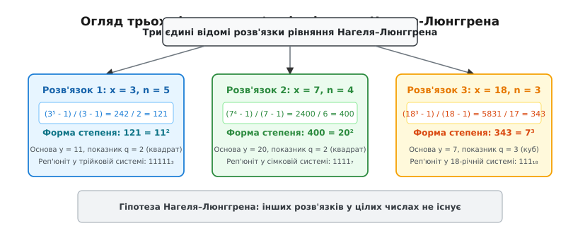
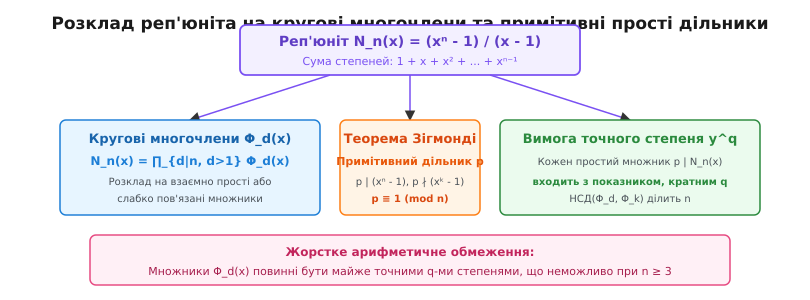
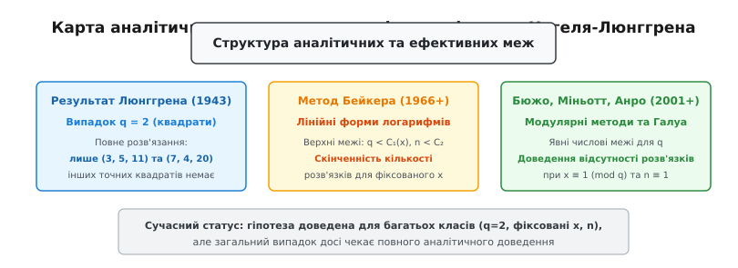

# Межі Нагеля–Люнггрена

<preknowlist>
- [Діофантові рівняння](topic:math/diophantine-equations) — класичні рівняння у цілих числах та методи їх розв'язання.
- [Модулярна арифметика](topic:math/modular-arithmetic) — порівняння за модулем, лишкові класи та мала теорема Ферма.
- [Основна теорема арифметики](topic:math/fundamental-theorem-arithmetic) — однозначність розкладу на прості множники.
- [Тотожність Безу](topic:math/bezout-identity) — найбільший спільний дільник та лінійні комбінації.
</preknowlist>

Уявімо позиційну систему числення з основою `x`. Якщо записати в ній число, що складається виключно з одиниць, ми отримаємо арифметичний об'єкт, який у математиці називають **реп'юнітом** (від англійського *repeated unit* — повторювана одиниця). У звичайній десятковій системі це числа 11, 111, 1111, 11111; у двійковій — `111₂ = 7`, `1111₂ = 15`; у трійковій — `11111₃ = 121`.

Математично реп'юніт довжини `n` у системі з основою `x` задається сумою скінченної геометричної прогресії:

```
N_n(x) = 1 + x + x² + ... + xⁿ⁻¹ = (xⁿ - 1) / (x - 1)
```

Природне і фундаментальне запитання теорії чисел звучить так: **чи може такий реп'юніт довжини `n ≥ 3` бути точним степенем іншого цілого числа `y^q` при `q ≥ 2`?**

У алгебраїчному формулюванні це означає пошук цілочисельних розв'язків діофантового рівняння:

```
(xⁿ - 1) / (x - 1) = y^q
```

для цілочисельних обмежень `x > 1`, `y > 1`, `n > 2` та `q ≥ 2`. Це рівняння отримало в математиці назву **рівняння Нагеля–Люнггрена**.

Незважаючи на оманливу простоту формулювання, дослідження цього рівняння охоплює понад століття розвитку класичної та сучасної теорії чисел. Воно вимагає залучення найпотужніших інструментів — від класичного аналізу полів алгебраїчних чисел та пеллівських одиниць до аналітичних меж Алана Бейкера, p-адичних логарифмів та арифметичної алгебраїчної геометрії.

---

## 1. Анатомія рівняння та межеві умови

Перед тим як переходити до аналізу складних алгебраїчних структур, розберемося з математичним змістом умов на параметри `x`, `n` та `q`.

### Чому вимагається `n ≥ 3`?

Зауважимо, що якщо зняти умову `n ≥ 3` і розглянути випадок `n = 2`, то ліва частина рівняння перетворюється на звичайний двочлен:

```
N₂(x) = (x² - 1) / (x - 1) = x + 1
```

Рівняння `x + 1 = y^q` має тривіальні розв'язки для будь-яких обраних `y` та `q`: достатньо покласти `x = y^q - 1`. Наприклад:
- При `y = 3, q = 2` отримуємо `x = 8`, адже `8 + 1 = 3² = 9`.
- При `y = 2, q = 3` отримуємо `x = 7`, адже `7 + 1 = 2³ = 8`.
- При `y = 5, q = 2` отримуємо `x = 24`, адже `24 + 1 = 5² = 25`.
- При `y = 4, q = 3` отримуємо `x = 63`, адже `63 + 1 = 4³ = 64`.

Оскільки випадок `n = 2` дає нескінченно багато тривіальних розв'язків і не містить жодної глибокої арифметичної таємниці, межева умова `n ≥ 3` є строго обов'язковою: вона гарантує, що реп'юніт складається щонайменше з трьох одиниць `1 + x + x²`, створюючи квадратичний або вищий многочлен від `x`.

### Прості та складені показники `n`

Якщо показник `n` є складеним числом, тобто `n = a · b` для `a > 1` та `b > 1`, то реп'юніт розкладається на добуток менших реп'юнітів:

```
(xⁿ - 1) / (x - 1) = [ ( (xᵃ)ᵇ - 1 ) / (xᵃ - 1) ] · [ (xᵃ - 1) / (x - 1) ] = N_b(xᵃ) · N_a(x)
```

Ця факторизація означає, що дослідження складених довжин `n` великою мірою зводиться до вивчення простих довжин `n = p`. Якщо `N_n(x)` є точним `q`-им степенем, то його множники `N_b(xᵃ)` та `N_a(x)` також мусять бути майже точними `q`-ми степенями, що створює перевизначену систему діофантових обмежень.

### Особливий випадок двійкової основи (`x = 2`)

У двійковій системі числення (`x = 2`) реп'юніти мають вигляд числа Мерсенна:

```
N_n(2) = (2ⁿ - 1) / (2 - 1) = 2ⁿ - 1
```

Рівняння `2ⁿ - 1 = y^q` для `q ≥ 2` вивчалося ще у XIX столітті. З теореми Жероно (Gerono, 1870), яка є окремим випадком відомої теореми Каталана, випливає, що єдиними цілими степенями, які відрізняються на 1 від степеня двійки, є `3² - 2³ = 1`.

Для рівняння `2ⁿ - 1 = y^q` це означає:
- Якщо `q = 2`: `2ⁿ - 1 = y² => 2ⁿ = y² + 1`. Це можливе лише при `n = 1` (`2¹ - 1 = 1 = 1²`), що порушує умову `n ≥ 3`.
- Якщо `q = 3`: `2ⁿ - 1 = y³ => 2ⁿ = y³ + 1 = (y + 1)(y² - y + 1)`, що не має розв'язків для `n ≥ 3`.

Отже, при двійковій основі `x = 2` рівняння Нагеля–Люнггрена **не має жодного розв'язку** для `n ≥ 3`.

---

## 2. Повний аналіз трьох канонічних розв'язків

Якщо провести комп'ютерний пошук розв'язків `(x, n, y, q)` у широких діапазонах основ та показників, ми виявимо дивовижний факт: існує всього **три унікальні цілочисельні розв'язки**. Розглянемо кожен із них у найменших деталях та з погляду кругових багаточленів.

### Розв'язок 1: Квадрат у трійковій системі числення

Покладемо основу системи числення `x = 3` та довжину реп'юніта `n = 5`. Обчислимо значення лівої частини рівняння:

```
N₅(3) = 1 + 3 + 3² + 3³ + 3⁴ = (3⁵ - 1) / (3 - 1) = (243 - 1) / 2 = 242 / 2 = 121
```

Отримане число 121 є точним квадратом цілого числа 11:

```
121 = 11²
```

З точки зору кругових многочленів при `x = 3` маємо:

```
Φ₅(3) = 3⁴ + 3³ + 3² + 3 + 1 = 81 + 27 + 9 + 3 + 1 = 121 = 11²
```

Звернемо увагу на простий дільник 11. За теоремою Зігмонді примітивний простий дільник `p` для `n = 5` мусить задовольняти порівняння `p ≡ 1 (mod 5)`. Число 11 задовольняє це порівняння абсолютно точно: `11 = 2 · 5 + 1 ≡ 1 (mod 5)`.
Таким чином, четвірка `(x = 3, n = 5, y = 11, q = 2)` дає перший канонічний розв'язок. У трійковій системі числення цей реп'юніт записується як `11111₃` і дорівнює точно `11² = 121`.

### Розв'язок 2: Квадрат у сімковій системі числення

Покладемо основу системи числення `x = 7` та довжину реп'юніта `n = 4`. Обчислимо значення лівої частини:

```
N₄(7) = 1 + 7 + 7² + 7³ = (7⁴ - 1) / (7 - 1) = (2401 - 1) / 6 = 2400 / 6 = 400
```

Отримане число 400 є точним квадратом цілого числа 20:

```
400 = 20²
```

З точки зору кругових многочленів при `n = 4` реп'юніт розкладається у добуток:

```
N₄(7) = Φ₂(7) · Φ₄(7) = (7 + 1) · (7² + 1) = 8 · 50 = 400 = 20²
```

Канонічна розкладка числа 400 на прості множники виглядає як `400 = 2⁴ · 5² = (2² · 5)² = 20²`.
Простий дільник 5 є примітивним дільником для `n = 4` і задовольняє порівняння `5 ≡ 1 (mod 4)`.
Отже, четвірка `(x = 7, n = 4, y = 20, q = 2)` утворює другий класичний розв'язок. У сімковій системі запис `1111₇` відповідає точного квадрату `20²`.

### Розв'язок 3: Куб у 18-річній системі числення

Покладемо основу системи числення `x = 18` та довжину реп'юніта `n = 3`. Обчислимо значення лівої частини:

```
N₃(18) = 1 + 18 + 18² = (18³ - 1) / (18 - 1) = (5832 - 1) / 17 = 5831 / 17 = 343
```

Отримане число 343 є точним кубом цілого числа 7:

```
343 = 7³
```

З точки зору кругових многочленів при `n = 3` маємо:

```
Φ₃(18) = 18² + 18 + 1 = 324 + 18 + 1 = 343 = 7³
```

Простий дільник 7 є примітивним дільником для `n = 3` і задовольняє порівняння `7 ≡ 1 (mod 3)` (`7 = 2 · 3 + 1`).
Таким чином, четвірка `(x = 18, n = 3, y = 7, q = 3)` являє собою третій канонічний розв'язок. Це єдиний відомий розв'язок із показником степеня `q = 3` (куб). У вісімнадцятерічній системі числення запис `111₁₈` дорівнює точного кубу `7³`.


*Анатомія трьох єдиних відомих цілочисельних розв'язків рівняння Нагеля–Люнггрена з деталізацією їх основ та степеней.*

---

## 3. Сформульована гіпотеза Нагеля–Люнггрена

На основі фундаментальних праць Трюгве Нагеля (1920–1921) та Вільгельма Люнггрена (1943) у теорії чисел було сформульовано наступне твердження, відоме як **гіпотеза Нагеля–Люнггрена**:

> **Гіпотеза:** Діофантове рівняння `(xⁿ - 1)/(x - 1) = y^q` для цілих чисел `x > 1`, `y > 1`, `n > 2`, `q ≥ 2` має **всього три цілочисельні розв'язки**:
> 1. `(x = 3, n = 5, y = 11, q = 2)` — квадрат 121
> 2. `(x = 7, n = 4, y = 20, q = 2)` — квадрат 400
> 3. `(x = 18, n = 3, y = 7, q = 3)` — куб 343
> Для всіх інших комбінацій параметрів `(x, n, y, q)` рівняння не має жодного розв'язку в цілих числах.

Ця гіпотеза належить до найскладніших проблем діофантового аналізу. Вона тісно пов'язана з Великою теоремою Ферма, гіпотезою Каталана (`xᵖ - y^q = 1`) та гіпотезою Піллаї (`xᵐ - yⁿ = c`). Історичний процес її вивчення, від перших праць норвезької школи до сучасності, детально описано у вставці [Історія рівняння Нагеля–Люнггрена](topic:math/nagell-ljunggren-bounds/hist-nagell-ljunggren-history.md).

---

## 4. Алгебраїчні структури та кругові многочлени

Чому реп'юніт практично ніколи не збігається з точним степенем? Відповідь полягає у жорстких законах розкладу многочленів на кругові множники.

Многочлен `xⁿ - 1` розкладається над полем раціональних чисел у добуток непривідних **кругових многочленів** (циклотомічних поліномів) `Φ_d(x)` для всіх дільників `d` числа `n`:

```
xⁿ - 1 = ∏_{d | n} Φ_d(x)
```

Оскільки `x - 1 = Φ₁(x)`, то викресливши перший множник, ми отримуємо розклад реп'юніта `N_n(x)`:

```
N_n(x) = (xⁿ - 1) / (x - 1) = ∏_{d | n, d > 1} Φ_d(x)
```

### Властивості кругових многочленів

Наведемо явний вигляд перших кругових многочленів:
- `Φ₁(x) = x - 1`
- `Φ₂(x) = x + 1`
- `Φ₃(x) = x² + x + 1`
- `Φ₄(x) = x² + 1`
- `Φ₅(x) = x⁴ + x³ + x² + x + 1`
- `Φ₆(x) = x² - x + 1`

Якщо `n = p` — непарне просте число, то реп'юніт являє собою єдиний круговий многочлен:

```
N_p(x) = Φ_p(x) = xᵖ⁻¹ + xᵖ⁻² + ... + x + 1
```

Якщо ж `n` є складеним, то `N_n(x)` розкладається у добуток кількох многочленів. Наприклад, для `n = 6`:

```
N_₆(x) = Φ₂(x) · Φ₃(x) · Φ₆(x) = (x + 1) · (x² + x + 1) · (x² - x + 1)
```

### Взаємна простота та НСД кругових многочленів

Найважливішою арифметичною властивістю є те, що при різних `a ≠ b` найбільший спільний дільник двох кругових многочленів у цілій точці `x` є надзвичайно малим:

```
НСД( Φ_a(x), Φ_b(x) ) = p  (якщо a/b є степенем простого p),  або  1 (в усіх інших випадках)
```

При цьому простий дільник `p` обов'язково ділить сам показник `n`.

Це означає, що у добутку `N_n(x) = ∏ Φ_d(x)` множники `Φ_d(x)` є **майже взаємно простими**. Якщо весь добуток має бути точним `q`-им степенем `y^q`, то кожен окремий круговий многочлен `Φ_d(x)` повинен майже самостійно дорівнювати точному `q`-му степеню:

```
Φ_d(x) = c_d · (z_d)^q
```

де `c_d` — константа, утворена виключно простими дільниками `n`.

Проте алгебраїчне та геометричне зростання многочленів `Φ_d(x)` унеможливлює одночасне виконання цієї умови для кількох множників при `n ≥ 3`. Повні математичні доведення цих властивостей подано у вставці [Математичні доведення та оцінки Нагеля–Люнггрена](topic:math/nagell-ljunggren-bounds/math-nagell-ljunggren-proofs.md).

### Застосування теореми Зігмонді про примітивні дільники

Потужним інструментом аналізу є теорема К. Зігмонді (1892). Вона стверджує, що вираз `xⁿ - 1` для більшості `n > 1` має принаймні один **примітивний простий дільник** `p` (який не ділить `xᵏ - 1` для жодного `k < n`).

Цей примітивний дільник задовольняє важливе порівняння:

```
p ≡ 1 (mod n)
```

Якщо `N_n(x) = y^q`, то `p` входить у розклад `y^q` з показником, кратним `q`, отже `p^q` ділить `N_n(x)`. Оскільки `p ≥ n + 1`, то `p^q ≥ (n + 1)²`, що створює строгу нижню межу для `y^q`, яка при `n ≥ 3` вступає у суперечність із верхніми оцінками реп'юніта.


*Схема розкладу реп'юніта N_n(x) на кругові многочлени та взаємодія з примітивними простими дільниками Зігмонді.*

---

## 5. Повне розв'язання квадратів: результат Люнггрена (1943)

Для випадку `q = 2` рівняння Нагеля–Люнггрена вимагає, щоб реп'юніт був точним квадратом:

```
(xⁿ - 1) / (x - 1) = y²
```

У 1943 році норвезький математик Вільгельм Люнггрен надав повне розв'язання цього випадку. Його доведення базувалося на арифметиці полів алгебраїчних чисел та аналізі одиниць кілець `ℤ[√D]`.

Люнггрен використав тотожність Якобсталя–Ландау для кругових многочленів:

```
4 · (xᵖ - 1) / (x - 1) = A(x)² - (-1)^( (p-1)/2 ) · p · x · B(x)²
```

Підставивши `(xᵖ - 1)/(x - 1) = y²`, вираз зводиться до діофантової системи типу Пелля:

```
(2y)² - A(x)² = ± p · x · B(x)²
```

Застосувавши теорему Діріхле про одиниці алгебраїчних полів, Люнггрен довів, що фундаментальні одиниці відповідних полів дають цілочисельні розв'язки виключно у двох випадках:
1. `x = 3, n = 5` -> `121 = 11²`
2. `x = 7, n = 4` -> `400 = 20²`

Це повністю закрило випадок `q = 2`: **ніяких інших квадратів серед реп'юнітів не існує**.

---

## 6. Аналітичний метод Бейкера та верхні межі

Для показників `q ≥ 3` класичні алгебраїчні методи не дозволяють обмежити величину `n` та `q`. Наприкінці 1960-х років Алан Бейкер розробив теорію **лінійних форм у логарифмах**, за яку отримав медаль Філдса 1970 року.

### Запис логарифмічної форми

Розглянемо вихідне рівняння `(xⁿ - 1)/(x - 1) = y^q`. Для великих `x` та `n` вираз `xⁿ / (x - 1)` є дуже близьким до `y^q`. Прологарифмувавши це співвідношення, отримуємо:

```
log( (y^q · (x - 1)) / xⁿ ) = log(1 - 1/xⁿ) ≈ - 1/xⁿ
```

Розкриваючи логарифм, будуємо лінійну форму від трьох логарифмів:

```
Λ = q · log y - n · log x + log(x - 1)
```

### Верхня та нижня межі

1. **Зі звичайного аналізу (верхня межа):**
   ```
   |Λ| < 2 / xⁿ
   ```

2. **З фундаментальної теореми Бейкера (нижня межа):**
   ```
   |Λ| > exp( - C · log q · log n )
   ```

Об'єднуючи обидві нерівності та логарифмуючи їх, отримуємо:

```
n · log x < C · log q · log n + log 2
```

Оскільки ліва частина `n` зростає лінійно, а права частина — логарифмічно, ця нерівність не може виконуватися для як завгодно великих `n`.

Звідси випливає фундаментальна теорема Торкеля Тійдемана та Т. Н. Шорі:

> **Теорема (Тійдеман, Шорі):** Для будь-якої фіксованої основи `x > 1` існують суто **обчислювані верхні межі** `N_max(x)` та `Q_max(x)` такі, що будь-який потенційний розв'язок задовольняє `n ≤ N_max(x)` та `q ≤ Q_max(x)`.

Це доводить, що для кожної основи `x` існує лише **скінченна кількість** розв'язків, що зводить задачу до скінченного обчислювального сіювання.

### Сучасні модулярні межі Бюжо–Міньотта–Анро

У 2000-х роках Ян Бюжо, Моріс Міньотт та Гійом Анро об'єднали p-адичний метод Бейкера з модулярними методами алгебраїчної геометрії. Вони довели, що якщо `(x, n, y, q)` є розв'язком із простим `q ≥ 3`, то виконуються жорсткі арифметичні умови:
- `x ≡ 1 (mod q)` або показник `q` ділить число класів ідеалів `h_q` кругового поля `ℚ(ζ_q)`.
- Якщо `x ≡ 1 (mod q)`, то обов'язково `n ≡ 1 (mod q)`.

Ці теореми дозволили повністю підтвердити відсутність інших розв'язків для тисяч конкретних основ `x`.


*Структурна карта теоретичних результатів та методів встановлення меж у дослідженні рівняння Нагеля–Люнггрена.*

---

## 7. Обчислювальний пошук та алгоритмічні фільтри

Для комп'ютерної перевірки відсутності розв'язків у заданому числовому діапазоні розробляються високопродуктивні обчислювальні двигуни.

Пряме піднесення великих чисел до степеня є повільним. Оптимальний алгоритм використовує **трикаскадний фільтр**:
1. **Модулярний фільтр (Modular Sieve):** перевірка `N_n(x) mod p` на належність до `q`-их лишків за набором малих простих модулів `p` (відсіює ~99.6% хибних кандидатів).
2. **Логарифмічна float-оцінка:** перевірка близькості `exp((n-1)/q · log x)` до цілого числа.
3. **Точна перевірка точного степеня:** піднесення у точній арифметиці для решти 0.4% кандидатів.

Повна програма пошуку з реалізацією мовами C та C++ подана у вставці [Алгоритми пошуку та обчисливальної перевірки меж Нагеля–Люнггрена](topic:math/nagell-ljunggren-bounds/proj-nagell-ljunggren-search.md).

---

> 🔧 **Навіщо це.**
> Дослідження меж Нагеля–Люнггрена та властивостей реп'юнітів має безпосереднє застосування у сучасній обчислювальній теорії чисел та криптографії:
> - **Криптографія на реп'юніт-простих числах:** Прості числа вигляду `(xⁿ - 1)/(x - 1)` використовуються для побудови стійких криптографічних груп з легким модулярним відновленням (наприклад, у криптосистемах Elliptic Curve Cryptography та RSA). Знання того, що реп'юніти практично ніколи не є складеними точними степенями, гарантує відсутність дегенерованих алгебраїчних підгруп.
> - **Алгоритми факторизації (метод p - 1 Поларда):** Оцінки подільності кругових многочленів `Φ_d(x)` лежать в основі швидкого розкладу великих чисел на прості множники.
> - **Генератори псевдовипадкових чисел:** Аналіз реп'юнітів та їхніх точних степеней застосовується для перевірки періодичності та лінійної складності послідовностей максимальної довжини (LFSR) у симетричному шифруванні.
