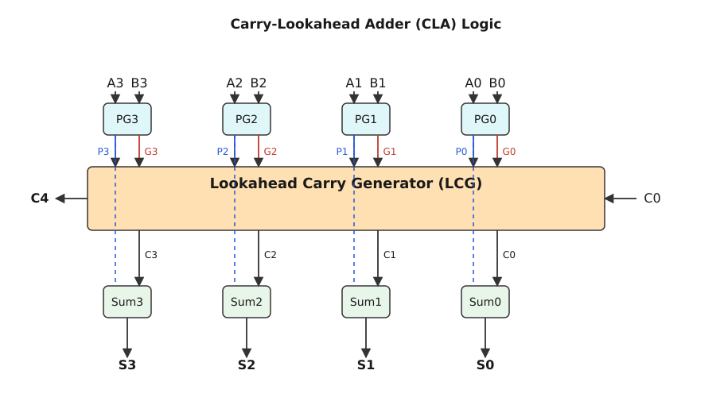

# Прискорені суматори з паралельним переносом (Carry-Lookahead Adder)

<preknowlist>
- [Двійкова арифметика: Додавання та віднімання](topic:math/binary-arithmetic)
- [Логічні вентилі та булева алгебра](topic:math/boolean-algebra)
- [Каскадні суматори (Ripple-Carry Adder) та їх обмеження](topic:math/parallel-prefix-addition)
</preknowlist>

> 🔧 **Навіщо це.**
> Класичний підхід до додавання чисел, який ми використовуємо з початкової школи (додавання у стовпчик), є суворо послідовним процесом. Ми додаємо цифри розряду і, якщо виникає переповнення, переносимо його до наступного розряду. Ця залежність від попереднього результату означає, що ми не можемо обчислити старший розряд, поки не знатимемо перенос від молодшого. В електроніці це створює катастрофічну затримку поширення сигналу. Прискорені суматори розривають цю залежність, дозволяючи обчислювати переноси для всіх розрядів одночасно, використовуючи логічні трюки та математичні парадокси. Це фундамент, який дозволяє сучасним процесорам працювати на частотах у мільярди герц, виконуючи 64-бітне додавання за одну наносекунду.

Коли інженери вперше почали створювати цифрові обчислювальні машини, вони зіткнулися зі складною фізичною проблемою: струму потрібен час, щоб пройти через транзистори. У найпростішій схемі додавання, відомій як Ripple-Carry Adder (каскадний суматор), кожен біт суми залежить від переносу з попереднього біта. Якщо ми додаємо два N-бітні числа, сигнал переносу повинен "просочитися" (ripple) від наймолодшого нульового біта до найстаршого N-1 біта, проходячи через N логічних блоків. Кожен блок вносить свою мікроскопічну затримку. Сумарна затримка становить O(N). Для 8-бітного числа це може бути прийнятним, але для 64-бітного або 128-бітного числа очікування стає настільки великим, що обчислювальна потужність процесора падає до неприпустимих значень.

Щоб вирішити цю проблему, нам потрібно було придумати спосіб дізнатися, чи буде перенос у певну позицію, не чекаючи, поки він туди фізично дійде від молодших розрядів. Нам потрібна здатність "зазирнути наперед" (lookahead). Цей математичний підхід вимагає фундаментального переосмислення того, що таке перенос і як його можна розрахувати алгебраїчно, не використовуючи фізичне поширення сигналу через послідовні каскади.

## Першопричини: Звідки береться перенос?

Щоб зрозуміти ідею паралельного переносу, застосуємо метод Фейнмана: розберемо процес до найпростіших складових, забувши про електроніку, і зосередимося лише на логіці. Ми хочемо ізолювати причину виникнення переносу від наслідків його розповсюдження.

Уявіть, що ви додаєте два числа у двійковій системі. Для кожної позиції i ми маємо два біти операндів: A_i та B_i, а також перенос із попередньої позиції C_i. Результатом є сума S_i та новий перенос C_{i+1}, який піде далі на позицію i+1.

Що змушує позицію i згенерувати перенос C_{i+1} = 1?
Логічний аналіз показує, що існують лише три стани, в яких може перебувати будь-яка позиція під час додавання, і лише два з них стосуються переносу:

1. **Генерація переносу (Generate):** Обидва вхідні біти A_i та B_i дорівнюють 1. У двійковій системі 1 + 1 = 10 (двійкове). Отже, незалежно від того, яким був вхідний перенос C_i, ця позиція гарантовано створить вихідний перенос 1. Цей стан ми називаємо генерацією:
G_i = A_i ∧ B_i
(Тут і далі ∧ означає логічне "І" (AND), ∨ означає "АБО" (OR), ⊕ означає "Виключне АБО" (XOR)).

2. **Поширення переносу (Propagate):** Рівно один із вхідних бітів A_i або B_i дорівнює 1. У цьому випадку сума A_i + B_i дає 1 (без переносу). Самі по собі вони перенос не створюють. АЛЕ, якщо з попереднього розряду прийде перенос (C_i = 1), то сума 1 + 1 дасть 10, і перенос піде далі. Тобто ця позиція діє як провідник: вона пропускає (поширює) перенос крізь себе, якщо він прийшов знизу. Якщо ж переносу знизу немає (C_i = 0), вона його і не згенерує, і не передасть. Цей стан ми називаємо поширенням:
P_i = A_i ⊕ B_i
(В деяких архітектурах замість XOR використовують звичайне OR (A_i ∨ B_i), оскільки випадок, коли обидва біти 1, вже покривається умовою Generate, але XOR є більш класичним і корисним для обчислення остаточної суми S_i = P_i ⊕ C_i).

3. **Блокування переносу (Kill/Absorb):** Обидва вхідні біти A_i та B_i дорівнюють 0. Навіть якщо прийде перенос C_i = 1, сума складе 0 + 0 + 1 = 1. Перенос далі не піде. Ця позиція "вбиває" хвилю переносу. Ми можемо описати це як K_i = ¬A_i ∧ ¬B_i. Але для базових рівнянь CLA нам достатньо знати лише G_i та P_i.

Тепер ми можемо записати точне логічне рівняння для переносу на наступну позицію:
C_{i+1} = G_i ∨ (P_i ∧ C_i)

Це рівняння читається простою мовою: "Перенос на наступний розряд відбудеться, якщо поточний розряд сам згенерує його, АБО якщо поточний розряд здатен поширити перенос І цей перенос насправді прийшов з попереднього розряду". Це фундаментальна аксіома, на якій базується вся теорія паралельних суматорів. У Ripple-Carry суматорі ми фізично реалізуємо це рівняння у вигляді каскаду логічних вентилів, де вихід C_{i+1} одного каскаду підключається до входу C_i наступного.

## Розгортання рекурсії: Погляд наперед (Lookahead)

Вираз C_{i+1} = G_i ∨ (P_i ∧ C_i) є математично рекурсивним. C_1 залежить від C_0, C_2 залежить від C_1, і так далі. Саме ця рекурсія є причиною хвилеподібної лінійної затримки в Ripple-Carry суматорах. Електричний сигнал повинен послідовно пройти кожен логічний вентиль.

Але в математиці та булевій алгебрі ми маємо потужний інструмент: алгебраїчне розкриття рекурсії. Ми можемо підставити вирази один в один, щоб виразити будь-який перенос через початкові умови. Давайте розгорнемо перші чотири біти переносу (від C_1 до C_4), припускаючи, що C_0 є початковим переносом на вхід (він дорівнює 0 при звичайному додаванні, але дорівнює 1 при відніманні в доповнювальному коді).

Почнемо з наймолодшого розряду (i=0):
C_1 = G_0 ∨ (P_0 ∧ C_0)

Для другого розряду (i=1) базова формула:
C_2 = G_1 ∨ (P_1 ∧ C_1)
Тепер підставляємо сюди алгебраїчний вираз для C_1:
C_2 = G_1 ∨ (P_1 ∧ (G_0 ∨ (P_0 ∧ C_0)))
Використовуючи дистрибутивний закон булевої алгебри, розкриваємо дужки (A ∧ (B ∨ C) = (A ∧ B) ∨ (A ∧ C)):
C_2 = G_1 ∨ (P_1 ∧ G_0) ∨ (P_1 ∧ P_0 ∧ C_0)
Цей вираз читається так: Перенос у позицію 2 з'явиться, якщо позиція 1 генерує його (G_1), або якщо позиція 0 генерує його, а позиція 1 поширює (P_1 ∧ G_0), або якщо вхідний перенос C_0 поширюється через обидві позиції (P_1 ∧ P_0 ∧ C_0).

Для третього розряду (i=2) підставляємо C_2:
C_3 = G_2 ∨ (P_2 ∧ C_2)
C_3 = G_2 ∨ (P_2 ∧ (G_1 ∨ (P_1 ∧ G_0) ∨ (P_1 ∧ P_0 ∧ C_0)))
Після дистрибуції:
C_3 = G_2 ∨ (P_2 ∧ G_1) ∨ (P_2 ∧ P_1 ∧ G_0) ∨ (P_2 ∧ P_1 ∧ P_0 ∧ C_0)

Для четвертого розряду (i=3):
C_4 = G_3 ∨ (P_3 ∧ C_3)
C_4 = G_3 ∨ (P_3 ∧ G_2) ∨ (P_3 ∧ P_2 ∧ G_1) ∨ (P_3 ∧ P_2 ∧ P_1 ∧ G_0) ∨ (P_3 ∧ P_2 ∧ P_1 ∧ P_0 ∧ C_0)

Подивіться уважно на останнє рівняння для C_4. Що ви бачите? У правій частині цього розлогого виразу немає ЖОДНОЇ згадки про C_3, C_2 або C_1! Права частина залежить виключно від початкового переносу C_0 та сигналів G і P (які, у свою чергу, залежать лише від вхідних операндів A та B для кожної позиції).

Це фундаментальний теоретичний прорив. Оскільки всі G_i та P_i залежать тільки від A_i та B_i, їх можна обчислити одночасно (паралельно) на самому першому кроці (бо всі біти A та B подаються на вхід суматора одночасно). Маючи на руках усі G та P, ми можемо зібрати гігантську, але дуже плоску логічну схему, яка за один крок (одну затримку вентиля OR та одну затримку вентилів AND) обчислить C_4, не чекаючи, поки послідовно обчисляться C_1, C_2 чи C_3. Усі переноси C_1, C_2, C_3, C_4 розраховуються абсолютно паралельно. 

Ця концепція і називається "Carry-Lookahead" (дослівно — "погляд наперед на перенос"). Вона усуває необхідність каскадного поширення, замінюючи часову затримку на просторову складність логічної схеми.

## Ціна розгортання: Проблема розгалуження та кількості входів (Fan-in / Fan-out)

Здавалося б, ми повністю розв'язали проблему: давайте просто розгорнемо формулу алгебраїчно до 64 розрядів, побудуємо величезну логічну схему, і отримаємо суматор із затримкою всього O(1) (два логічних рівні). Але у реальному фізичному світі електроніки, де панують закони фізики напівпровідників, так не буває.

Якщо ми поглянемо на вираз для C_4, ми побачимо, що останній доданок (P_3 ∧ P_2 ∧ P_1 ∧ P_0 ∧ C_0) вимагає логічного вентиля AND з 5 входами (оскільки всі 5 аргументів треба подати на один вентиль). Відповідно, вираз для C_64 вимагатиме вентиля AND з 65 входами, а також вентиля OR з 65 входами, щоб зібрати всі 65 доданків разом.

Створити транзисторні вентилі з такою кількістю входів (Fan-in) фізично неможливо. Кожен транзистор, доданий послідовно (для реалізації функції AND у технології CMOS), зменшує струм і збільшує падіння напруги. Паразитна ємність таких гігантських структур призвела б до того, що вони перемикалися б повільніше, ніж класичний Ripple-Carry. У реальних сучасних мікросхемах кількість входів логічного вентиля жорстко обмежена 3 або максимум 4 входами.

Крім того, існує проблема навантаження (Fan-out). Погляньте на сигнал P_0 або G_0. У 64-бітному повністю паралельному суматорі цей сигнал мав би бути підключений до десятків різних вентилів AND одночасно. Один транзистор, що генерує сигнал G_0, фізично не здатен зарядити паразитні ємності 64 наступних транзисторів за прийнятний час.

Через ці суворі апаратні обмеження, ідеальний теоретичний CLA в один гігантський крок побудувати неможливо. Замість цього інженери знайшли блискучий компроміс: ієрархічний, або блоковий, Carry-Lookahead (Block Carry-Lookahead, BCLA).

## Ієрархічний підхід: Блоковий CLA

Замість того, щоб намагатися обчислити всі переноси відразу для всього слова, ми розбиваємо велике слово на менші блоки. Найчастіше використовують блоки по 4 біти, оскільки рівняння для 4-х бітів вимагають максимум 5-входових вентилів (які можна легко синтезувати з 2-3 входових без значних втрат).

Кожен 4-бітний блок приймає 4 біти числа A, 4 біти числа B, і свій власний вхідний перенос C_in. Усередині цього блоку ми використовуємо повне розгортання рівнянь (як для C_4 вище). Блок дуже швидко (за кілька тактів вентилів) паралельно генерує внутрішні переноси і видає 4 біти суми.

Але найголовніший математичний трюк полягає в тому, що блок також розглядається як єдина сутність на макро-рівні. Блок обчислює свої власні **групові** сигнали генерації та поширення.

Групове поширення (Group Propagate, P_group) для 4-бітного блоку означає, що перенос гарантовано пройде крізь ВЕСЬ 4-бітний блок, якщо всі його індивідуальні біти є поширювачами:
P_group = P_3 ∧ P_2 ∧ P_1 ∧ P_0
Якщо хоча б один біт не може поширити перенос (P_i = 0), то перенос перерветься всередині блоку, і P_group = 0.

Групова генерація (Group Generate, G_group) означає, що блок сам, незалежно від свого C_in, згенерує перенос на вихід (C_4). Це відбувається, якщо старший біт генерує перенос, АБО передостанній генерує і старший поширює, і так далі. По суті, G_group — це та сама формула для C_4, але БЕЗ останнього доданка (який містить C_0):
G_group = G_3 ∨ (P_3 ∧ G_2) ∨ (P_3 ∧ P_2 ∧ G_1) ∨ (P_3 ∧ P_2 ∧ P_1 ∧ G_0)

Тепер кожен 4-бітний блок виглядає наче один макро-розряд. Якщо ми маємо 16-бітний суматор, ми ставимо чотири такі 4-бітні блоки. Вони віддають свої P_group та G_group на наступний, вищий ієрархічний рівень — глобальний блок Lookahead Carry Generator (LCG). 

Цей глобальний блок сприймає чотири макро-сигнали P_group і G_group від кожного блоку точнісінько так само, як перший рівень сприймав звичайні P і G. За тими ж самими рівняннями (тільки тепер індекси означають номери макро-блоків, а не бітів) LCG миттєво обчислює переноси МІЖ блоками: C_4, C_8 та C_12. Ці переноси потім повертаються назад у відповідні блоки як їхні початкові C_in. 

Для 64-розрядного числа знадобиться трирівнева ієрархія (64 біти = 16 блоків по 4 біти; 16 блоків = 4 супер-блоки по 16 бітів; 4 супер-блоки об'єднуються одним головним LCG). 
Затримка при такій архітектурі зростає логарифмічно, пропорційно кількості рівнів ієрархії O(log N). Це астрономічне покращення порівняно з O(N) у Ripple-Carry.

## Префіксні дерева: Сучасний стандарт архітектури (Kogge-Stone, Brent-Kung)

Ієрархічний CLA з фіксованими блоками по 4 біти був неймовірно популярним у ранніх процесорах та мікроконтролерах. Однак у сучасній мікроелектроніці (процесори Intel Core, AMD Ryzen, ARM Cortex) використовується більш витончена та регулярна математична абстракція, відома як **паралельні префіксні суматори** (Parallel Prefix Adders). 

Префіксні суматори також базуються на фундаментальній логіці P та G, але вони формалізують це через оператор префіксної композиції і організовують обчислення у вигляді графів-дерев з логарифмічною глибиною, не прив'язуючись до жорстких 4-бітних коробок.

Основна ідея префіксного дерева полягає у визначенні спеціального оператора (часто позначається крапкою • або кружечком ∘). Якщо ми маємо блок розрядів від j до i, і сусідній молодший блок розрядів від k до j-1, їхні комбіновані сигнали (Group Generate та Group Propagate) можна обчислити об'єднанням:
(G_{i:j}, P_{i:j}) ∘ (G_{j-1:k}, P_{j-1:k}) = ( G_{i:j} ∨ (P_{i:j} ∧ G_{j-1:k}) , P_{i:j} ∧ P_{j-1:k} )

Оскільки ця операція є математично **асоціативною**, тобто (A ∘ B) ∘ C = A ∘ (B ∘ C), ми можемо розставляти дужки і комбінувати пари бітів у будь-якому порядку. Ця гнучкість породила цілий "зоопарк" архітектур дерев префіксів, кожна з яких пропонує свій компроміс між швидкістю, кількістю вентилів та густиною монтажу:

### 1. Дерево Брента-Кунга (Brent-Kung Adder)
Розроблене Річардом Брентом і Х.Т. Кунгом. Ця топологія створює дуже "рідке" дерево з мінімальною кількістю логічних вентилів і мінімальним навантаженням на дроти (Fan-out). Воно спочатку комбінує сусідні пари, потім четвірки, вісімки, поки не дійде до самого верху, обчислюючи загальний перенос (це фаза "scan", або рух вперед). Потім воно використовує зворотний шлях, щоб роздати проміжні переноси тим вузлам, які їх пропустили (фаза "reverse"). 
Глибина такого дерева дорівнює 2 log₂ N - 2. Воно трохи повільніше за теоретичний мінімум, але є чудовим компромісом між площею кристала кремнію та швидкістю.

### 2. Дерево Коггі-Стоуна (Kogge-Stone Adder)
Винайдене Пітером Коггі та Гарольдом Стоуном, це дерево спрямоване виключно на безкомпромісну максимальну швидкість. Воно радикально перекриває обчислення, постійно комбінуючи вузли з вузлами, що знаходяться на відстані 1, 2, 4, 8, і так далі. Воно обчислює префікси для кожної позиції паралельно, не потребуючи зворотного шляху розповсюдження. 
Його глибина є мінімально можливою: рівно log₂ N. Це найшвидший відомий тип паралельного суматора. Однак він вимагає колосальної кількості дротів та вентилів (складність площі O(N log N)), що створює дуже щільне павутиння міжз'єднань на кристалі. Через високе енергоспоживання і площу, такі суматори ставлять лише у найбільш критичних до швидкості АЛП (наприклад, у конвеєрах обчислення адрес або плаваючій комі).

### 3. Гібридні суматори (Han-Carlson, Knowles)
Оскільки чистий Kogge-Stone часто занадто громіздкий, а Brent-Kung може бути занадто повільним, дослідники створили гібридні топології. Наприклад, дерево Хан-Карлсона (Han-Carlson) використовує логіку Brent-Kung на першому і останньому рівнях, а всередині вбудовує ядро Kogge-Stone. Це дозволяє знайти ідеальну "золоту середину", суттєво зменшуючи кількість дротів, але майже не втрачаючи у швидкодії.

## Розрахунок затримок і продуктивність: Чому це важливо

Щоб оцінити справжню красу математики CLA та паралельних префіксів, давайте порахуємо логічну затримку для додавання двох 64-розрядних чисел. Припустимо, проходження сигналу через один логічний вентиль (AND, OR, XOR) незалежно від складності займає умовний час Δ (дельта, що вимірюється у пікосекундах).

В класичному **Ripple-Carry суматорі**, кожен повний однобітний суматор (Full Adder) має внутрішню затримку 2Δ (від входу переносу C_in до виходу переносу C_out через ворота AND та OR). Для 64-розрядного числа сигнал повинен проповзти через 64 таких блоки:
T_RCA = 64 × 2Δ = 128Δ.
Це означає 128 тактів затримки. Якщо 1Δ дорівнює 10 пікосекундам, додавання триватиме понад наносекунду. Для процесора з частотою 4 ГГц (такт 250 пс) це неприпустимо довго — додавання вимагатиме 5 процесорних тактів.

Тепер розглянемо дворівневий ієрархічний **16-бітний CLA** (класичний блоковий):
- Рівень 1 (Генерація індивідуальних P та G): 1Δ.
- Рівень 2 (Обчислення групових P_group та G_group): 2Δ.
- Рівень 3 (Глобальні переноси C між 4-бітними блоками): 2Δ.
- Рівень 4 (Внутрішні переноси всередині блоків на основі глобальних): 2Δ.
- Рівень 5 (Фінальний XOR для остаточної суми): 1Δ.
Разом: 8Δ для 16 бітів. (Для 64 бітів трирівневий CLA мав би затримку близько 12Δ-14Δ).

Для 64-розрядного паралельного префіксного суматора типу **Коггі-Стоуна** (Kogge-Stone) затримка зростає виключно логарифмічно за основою 2. Ми маємо 6 рівнів дерева (оскільки 2⁶ = 64). Кожен рівень дерева має затримку 2Δ (комбінація P і G через логіку AND-OR), плюс початковий рівень (1Δ) і кінцевий рівень XOR (1Δ):
T_KoggeStone = 1Δ (початкові P,G) + 6 × 2Δ (дерево) + 1Δ (фінальна сума) = 14Δ.

Порівняйте **128Δ** у класичному суматорі з **14Δ** у паралельному префіксному дереві! Завдяки глибокому математичному трюку — розкриттю рекурсії, ізоляції властивостей Generate/Propagate та застосуванню асоціативних властивостей префіксного сканування — обчислювальна потужність зростає майже в 10 разів. Саме ця витончена математика, конвертована в транзисторні топології, дозволила подолати технологічний бар'єр швидкодії і відкрила шлях до сучасних супершвидких комп'ютерів. Без Carry-Lookahead концепції, кожен акт додавання у нашому смартфоні чи сервері був би повільною послідовною агонією.
