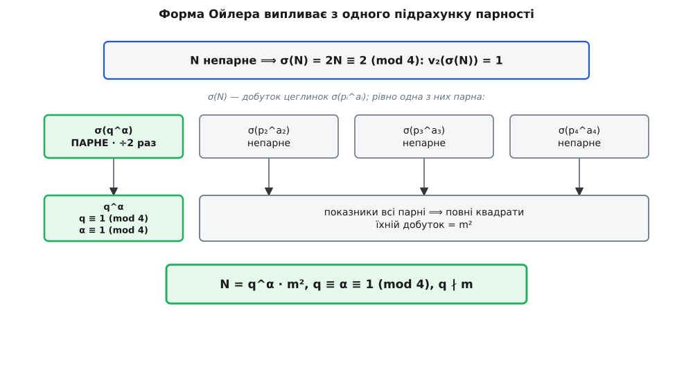

# 🧮 Форма Ойлера: якою мусила б бути непарна досконалість

Якщо непарне досконале число існує, воно не вільне у своїй будові: сама лише парність рівняння σ(N) = 2N затискає його в одну жорстку форму — а століття обчислень обгородило його стінами так тісно, що воно мусило б бути справжнім числом-монстром. Тут — точний вивід цієї форми з одного-єдиного підрахунку двійок, а потім зведення докупи всіх відомих стін довкола можливого монстра. І головне: жодна зі стін не доводить, що монстра нема, — вони лише заганяють його в дедалі вужчий кут.

## Один підрахунок двійок

Нагадаю знаряддя. σ(n) — сума **всіх** дільників числа n, разом із самим n; число зветься досконалим, коли σ(n) = 2n. Функція σ **мультиплікативна**: для взаємно простих a і b маємо σ(a·b) = σ(a)·σ(b), а на простому степені вона рахується прямо, як сума геометричної прогресії:

```
σ(pᵃ) = 1 + p + p² + … + pᵃ
```

Тому, розклавши N на прості [за однозначністю розкладу](book:math/fundamental-theorem-arithmetic), суму дільників зібрано з незалежних цеглинок:

```
N     = p₁^a₁ · p₂^a₂ · … · p_r^a_r
σ(N)  = σ(p₁^a₁) · σ(p₂^a₂) · … · σ(p_r^a_r)
```

Уся розгадка форми ховається в одному: скільки двійок сидить у кожній такій цеглинці.

Нехай N непарне й досконале. Тоді кожне просте pᵢ непарне, а права частина рівняння досконалості —

```
2N = 2 · (непарне число)
```

— ділиться на 2 рівно один раз: за модулем 4 вона дає 2, а не 0. Позначмо через v₂(x) кратність двійки в числі x, тобто скільки разів 2 входить у його розклад. Тоді все рівняння досконалості каже одну коротку річ:

```
v₂(σ(N)) = v₂(2N) = 1
```

Це весь важіль. З одного спостереження — «двійка ділить σ(N) точно один раз» — виллється вся форма Ойлера.

> 🔧 **Навіщо це.** Кратність двійки — груба, майже примітивна мірка, але саме її грубість тут і рятує. Точну величину σ(N) для непарного досконалого числа не знає ніхто (бо й самого числа ніхто не бачив), а от скільки в ній двійок — відомо напевно: рівно одна. З цього однісінького біта інформації випливе вся будова числа.

## Рівно одна парна цеглинка

Кратність двійки в добутку — це просто сума кратностей у множниках. Тому вимога v₂(σ(N)) = 1 розкладається так:

```
v₂(σ(p₁^a₁)) + v₂(σ(p₂^a₂)) + … + v₂(σ(p_r^a_r)) = 1
```

Кожен доданок — ціле число, не менше нуля, а вся сума дорівнює одиниці. Отже, рівно один доданок дорівнює 1, а всі решта — нулю. Словами: **рівно одна цеглинка σ(pᵢ^aᵢ) парна (і то ділиться на 2 точно раз), а всі інші непарні.**

Прочитаймо, що означає «непарна цеглинка». σ(pᵢ^aᵢ) = 1 + pᵢ + … + pᵢ^aᵢ — це сума (aᵢ + 1) доданків, і кожен доданок pᵢ^j непарний, бо степінь непарного числа непарний. Сума кількох непарних чисел успадковує парність їхньої **кількості**: вона непарна тоді й лише тоді, коли доданків непарне число. Виходить чіткий зв'язок:

```
σ(pᵢ^aᵢ) непарна  ⟺  (aᵢ + 1) непарне  ⟺  aᵢ парне
```

Кожна непарна цеглинка означає **парний показник** aᵢ. А непарних цеглинок — усі, крім однієї. Зберімо ці множники з парними показниками разом: pᵢ^aᵢ із парним aᵢ — це повний квадрат, а добуток повних квадратів — знову повний квадрат. Назвімо його m². Лишається єдина цеглинка з парним значенням σ — просте q в показнику α, для якого σ(q^α) парне. Кістяк форми вже проступив:

```
N = q^α · m²        (q не ділить m)
```

Одне-єдине просте q виділене з-поміж усіх — те, чия цеглинка σ(q^α) єдина парна. Його називають **простим Ойлера**. Лишилося з'ясувати, який показник α і який лишок за модулем 4 дозволені цьому виділеному q.

## Чому q ≡ 1 і α ≡ 1 (mod 4)

Обидві умови на виділене q народжуються з тієї самої вимоги v₂(σ(q^α)) = 1 — тільки прочитаної точніше, [за модулем 4](book:math/modular-arithmetic).

Спершу показник. σ(q^α) парне, отже (α + 1) парне, отже **α непарне** — це вже знаємо. Але треба більше: σ(q^α) мусить ділитися на 2 **точно раз**, тобто σ(q^α) ≡ 2 (mod 4), а не ≡ 0. Порахуймо σ(q^α) за модулем 4. Непарне q дає лишок 1 або 3, і два випадки поводяться геть по-різному.

**Випадок q ≡ 1 (mod 4).** Тоді кожен степінь q^j ≡ 1 (mod 4), і сума (α + 1) одиничок дає просто їхню кількість:

```
σ(q^α) ≡ 1 + 1 + … + 1 = α + 1     (mod 4)
```

Щоб це було ≡ 2 (mod 4), потрібне α + 1 ≡ 2, тобто **α ≡ 1 (mod 4)**. Показник не просто непарний — він при діленні на 4 дає одиницю: α ∈ {1, 5, 9, …}.

**Випадок q ≡ 3 (mod 4).** Тоді степені чергуються: q⁰ ≡ 1, q¹ ≡ 3, q² ≡ 1, q³ ≡ 3, … — за модулем 4 виходить 1 на парних j і 3 на непарних. Оскільки α непарне, доданків (α + 1) парне число, порівну одиничок і трійок, по (α + 1)/2 кожних:

```
σ(q^α) ≡ (α+1)/2 · 1 + (α+1)/2 · 3 = (α+1)/2 · 4 ≡ 0     (mod 4)
```

Двійка ділить σ(q^α) щонайменше двічі — а нам дозволено лише раз. Суперечність. Отже, q ≡ 3 (mod 4) неможливе, і виживає єдина можливість **q ≡ 1 (mod 4)**.

Дві умови зійшлися в одну форму:

```
N = q^α · m²,   q — просте,   q ≡ 1 (mod 4),   α ≡ 1 (mod 4),   q ∤ m
```

Це і є **форма Ойлера** непарного досконалого числа. Її довів Леонард Ойлер у XVIII столітті; частковий вигляд — «одне просте в непарному степені, решта у квадраті» — за поширеними джерелами, помітив ще 1657 року Бернар Френікль де Бессі, але без умов за модулем 4. Уся форма висить на одному факті: непарне число, помножене на 2, ділиться двійкою рівно раз.

**Перевірмо парну цеглинку на живих числах.** Непарного досконалого числа нема, зате поведінку окремої цеглинки σ(q^α) видно на будь-яких простих степенях — і вона точно підтверджує правило:

```
q=5  (≡1),  α=1:   σ(5)   = 6     = 2·3        v₂ = 1   ✓   α ≡ 1 (mod 4)
q=5  (≡1),  α=3:   σ(5³)  = 156   = 4·39       v₂ = 2   ✗   α ≡ 3 (mod 4)
q=5  (≡1),  α=5:   σ(5⁵)  = 3906  = 2·1953     v₂ = 1   ✓   α ≡ 1 (mod 4)
q=13 (≡1),  α=1:   σ(13)  = 14    = 2·7        v₂ = 1   ✓
q=3  (≡3),  α=1:   σ(3)   = 4     = 4·1        v₂ = 2   ✗   q ≡ 3 (mod 4)
q=7  (≡3),  α=1:   σ(7)   = 8     = 8·1        v₂ = 3   ✗   q ≡ 3 (mod 4)
```

П'ятірка й тринадцятка (лишок 1) із показником 1 або 5 дають рівно одну двійку — саме те, чого потребує виділене q. Та сама п'ятірка з показником 3 промахується, бо 3 ≢ 1 (mod 4). А трійка й сімка (лишок 3) не годяться в ролі q за жодного показника: у них двійка ділить σ забагато разів.



*Одне рівняння за модулем 4 роздає ролі: одне просте стає виділеним q, усі інші складаються в квадрат m².*

Із форми одразу течуть наслідки. Оскільки q ≡ 1 (mod 4) і m непарне (тож m² ≡ 1 mod 4), маємо **N ≡ 1 (mod 4)**: непарне досконале число, якби існувало, давало б за модулем 4 одиницю. А ще воно **не є повним квадратом** — показник α непарний, тож рівно одне просте стоїть у розкладі N в непарному степені. Непарне досконале число — це «майже квадрат»: повний квадрат m², помножений на одне-єдине виділене просте в непарному степені.

## Стіни навколо монстра

Форма Ойлера — то лише перший, найдешевший поверх огорожі. Далі математики понад століття накладали на уявне непарне досконале число дедалі жорсткіші умови, і кожну доведено строго, у формі «якщо воно існує, то мусить…». Ось найсильніші відомі, усі з рецензованих праць:

- **Воно величезне: N > 10¹⁵⁰⁰.** Паскаль Ошем і Мікаель Рао (2012) розвинули метод Брента–Коена–те Ріле й показали: менших непарних досконалих чисел просто немає.
- **Багато простих множників із кратністю: Ω(N) ≥ 101.** Той самий результат Ошема–Рао. Тут прості дільники рахуються з їхніми показниками (наприклад, 5² додає два) — і всього їх щонайменше сто один.
- **Багато різних простих (не плутати з попереднім): ω(N) ≥ 10.** Пейс Нільсен (2015) довів, що різних простих дільників не менш як десять (його ж 2007 рік давав дев'ять). Разом із попереднім це змушує кратності бути високими: різних простих десяток, а штук із урахуванням степенів — сто один.
- **Великий найбільший простий дільник: понад 10⁸.** Такеші Ґото і Ясуо Оно (2008): найбільший із простих, що входять у N, перевищує сто мільйонів.
- **І другий за величиною чималий: понад 10⁴.** Дуглас Іаннуччі (1999) показав, що другий за величиною простий дільник більший за десять тисяч; він же (2000) — що третій більший за сто.

Кожна умова окремо звужує пошук, а разом вони малюють портрет: непарне число понад півтори тисячі цифр завдовжки, зіткане щонайменше зі ста однієї простої цеглинки, серед яких десяток різних, з одним простим-гігантом за сто мільйонів і другим за десять тисяч, і все це вкладене в форму Ойлера q^α·m² з q ≡ α ≡ 1 (mod 4).


*Кожна стіна відрізає цілий клас чисел — та жодна не каже, що за нею вже нічого немає.*

## Чому кут — не порожнеча

Спокуса думати, що всі ці стіни ось-ось зійдуться й розчавлять монстра. Але вони не сходяться — і в цьому вся суть відкритої задачі.

Придивіться до природи кожної умови: усі вони **умовні**, форми «якщо N існує, то N > 10¹⁵⁰⁰», «то Ω(N) ≥ 101», і так далі. Вони відрізають нижні поверхи — маленькі числа, числа з малою кількістю множників, — але над кожною відрізаною ділянкою лишається нескінченний простір. Стіна на 10¹⁵⁰⁰ не має стелі: за нею тягнуться всі числа до нескінченності, і в жодному з відомих результатів немає суперечності, яка сказала б «отут N бути не може взагалі». Огорожа затісна — та не замкнена.

Порівняйте це з парним випадком, де огорожа замкнена дощенту: теорема Евкліда–Ойлера дає точну відповідність «парне досконале ↔ [просте Мерсенна](book:math/mersenne-primes)», без жодної шпарини. Для непарних такої теореми нема — є лише все вужчий кут. Тому питання «чи існує непарне досконале число?» лишається одним із найстаріших відкритих у математиці: два з половиною тисячоліття по тому, як греки знайшли перші парні досконалі числа, ніхто не побачив жодного непарного — і ніхто не довів, що його нема.
