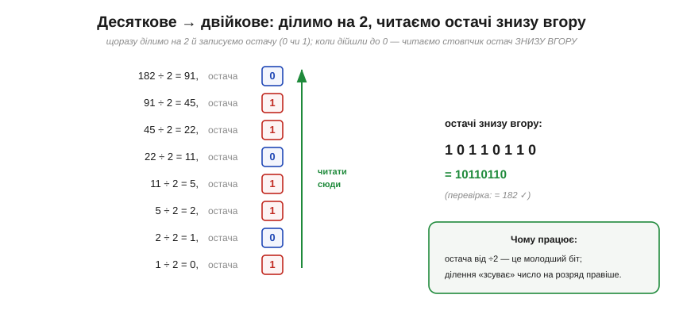
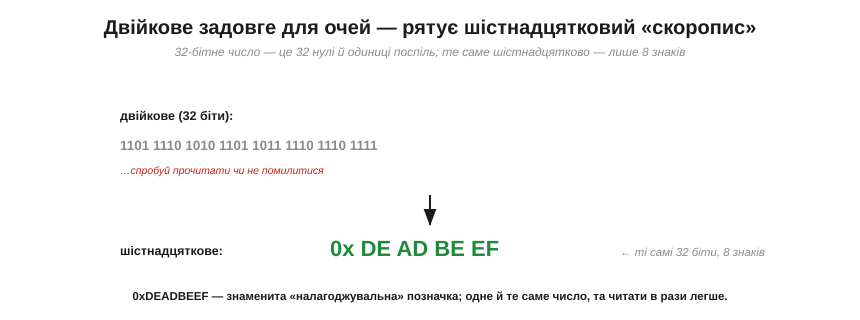

# Позиційні системи: двійкова й шістнадцяткова

Головний винахід будь-якої системи числення — **позиційність**: значення цифри залежить від її **місця**, а кожне місце — це степінь основи. Скористаймося цим практично: навчімося **читати** двійковий запис як число, **переводити** туди й назад, і — найважливіше для щоденної роботи — записувати довгі двійкові числа компактно в **шістнадцятковій** системі, яку люблять усі програмісти. Це суто практичні навички, без яких не обійтися ні з даташитом, ні з кодом.

### Як прочитати двійкове: степені двійки

Двійкове число читають так само, як десяткове, лише степені беруть від **двійки**, а не від десятки. Кожен розряд (справа наліво) — це 2⁰=1, 2¹=2, 2²=4, 2³=8, 2⁴=16…


*Рис. Над кожним бітом — його «вага» (степінь двійки). Щоб дістати десяткове значення, беремо лише розряди, де стоїть **1**, і додаємо їхні ваги. Для 10110110: 128 + 32 + 16 + 4 + 2 = 182. Усе, що для цього треба, — знати степені двійки (1, 2, 4, 8, 16, 32, 64, 128…) і вміти додавати.*

Запам'ятати перші степені двійки (1, 2, 4, 8, 16, 32, 64, 128, 256, 512, 1024…) дуже корисно — вони трапляються всюди в цифровій техніці, від розмірів пам'яті до меж змінних. А читати двійкове стає просто: знайди одиниці, додай їхні ваги.

### Десяткове → двійкове: ділення на 2

Зворотне перетворення — з десяткового в двійкове — теж механічне. Найнадійніший спосіб: раз за разом **ділити на 2** й записувати **остачу** (0 або 1), аж поки не дійдемо до нуля. Тоді стовпчик остач, прочитаний **знизу вгору**, і є двійковий запис.


*Рис. Переведення 182 у двійкове. Ділимо на 2, щоразу занотовуючи остачу: 182÷2=91 (ост. 0), 91÷2=45 (ост. 1)… і так до нуля. Остачі, прочитані **знизу вгору**, дають 10110110. Працює це тому, що остача від ділення на 2 — це молодший біт числа, а саме ділення «зсуває» число на розряд правіше.*

**Приклад (туди й назад).** Переведімо 182 у двійкове й перевіримо зворотним читанням.

```
182 → ділення на 2 → остачі знизу вгору → 10110110
перевірка:  1·128 + 0·64 + 1·32 + 1·16 + 0·8 + 1·4 + 1·2 + 0·1
          = 128 + 32 + 16 + 4 + 2 = 182  ✓
```

(Є й швидший спосіб для тих, хто знає степені двійки: відняти найбільший степінь, що вміщається, поставити там 1, і повторити з рештою. 182 − 128 = 54 → ставимо біт 128; 54 − 32 = 22 → біт 32; 22 − 16 = 6 → біт 16; 6 − 4 = 2 → біт 4; 2 − 2 = 0 → біт 2. Виходить ті самі 10110110.)

### Двійкове задовге для очей → шістнадцятковий скоропис

Тепер — про головну незручність двійкового запису для людини. Він **довгий**. 8-бітне число — це вісім символів, 32-бітне — аж тридцять два нулі й одиниці поспіль. Прочитати такий рядок, не загубившись і не помилившись, майже неможливо.


*Рис. 32-бітне число у двійковому — це стіна з 32 знаків, у якій легко збитися. Те саме число **шістнадцятково** — лише вісім знаків: 0xDEADBEEF (до речі, знаменита «налагоджувальна» позначка в пам'яті). Одне й те саме значення, та читати незрівнянно легше.*

Рішення — записувати двійкові числа в **шістнадцятковій** (*hexadecimal*, base 16) системі. І тут криється елегантність, що робить hex не просто «ще однією системою», а ідеальним **скорописом** саме для двійкового.

### Шістнадцяткова: 16 цифр, кожна — це 4 біти

Шістнадцяткова має **шістнадцять** цифр. Перші десять — звичні 0–9, а для значень 10–15 беруть **літери** A, B, C, D, E, F (A=10, B=11, …, F=15). Чому саме 16? Бо **16 = 2⁴** — і це означає, що одна hex-цифра відповідає **рівно чотирьом бітам**.


*Рис. Усі 16 hex-цифр та їхні 4-бітні відповідники: 0=0000, 1=0001, …, 9=1001, A=1010, …, F=1111. Оскільки 16=2⁴, кожна hex-цифра — це точно **чотири біти** (їх звуть **півбайтом**, *nibble*). Саме ця рівність і робить hex таким зручним.*

Ось у чому суть: hex — це не довільна інша основа (як, скажімо, десяткова, що з двійковою «не дружить»), а саме та, що **точно лягає** на групи по 4 біти. Завдяки цьому переведення між двійковим і шістнадцятковим стає **тривіальним**.

### Двійкове ↔ hex: групуй по чотири

Щоб перевести двійкове в hex, не треба нічого ділити чи рахувати — досить **згрупувати** біти по чотири (справа наліво) і кожну четвірку замінити її hex-цифрою.


*Рис. Байт 10110110 ділимо на дві четвірки: 1011 і 0110. Перша — це 11, тобто **B**; друга — 6. Разом 0xB6 (= 182). У зворотний бік так само: кожну hex-цифру розкладаємо в чотири біти. Один байт — це **рівно дві** hex-цифри. Записують hex із префіксом **0x** (0xB6) або з індексом ₁₆.*

Ця простота — причина, чому hex усюди в роботі інженера й програміста. **Адреси пам'яті**, **значення регістрів** мікроконтролера, **кольори** на вебсторінці (#RRGGBB — по два hex-знаки на червоний, зелений, синій), **байти** в даташитах — усе записують шістнадцятково, бо це і компактно, і миттєво зводиться до бітів. (Колись із тих самих міркувань уживали ще **вісімкову** систему — base 8, по 3 біти на цифру, — та для 8-бітних байтів зручнішою виявилася саме hex, і вона перемогла.)

> 🔧 **Навіщо це.** Ці навички ви застосовуватимете буквально щодня, тільки-но візьметеся за мікроконтролер. Перше: **читати двійкове** (додати ваги одиниць) і **переводити в нього** (ділити на 2) — базова грамотність; знайте степені двійки до 1024 напам'ять. Друге, найпрактичніше: **hex — ваш робочий запис чисел**. Регістр периферії, адреса, маска бітів, колір — усе це ви бачитимете й писатимете в hex (0x...), і вміння миттєво розкласти hex-цифру в чотири біти (F=1111, A=1010, 0=0000) — щоденний інструмент, коли треба, наприклад, виставити чи перевірити окремий біт у регістрі. Третє: **один байт = дві hex-цифри = 8 бітів** — тримайте цю трійцю в голові, і дані в даташитах та налагоджувачі читатимуться легко. Hex — це не «складніша математика», а навпаки, **милиця для очей**, що економить вам помилки на довгих двійкових рядках.

---

Зведімо все докупи. Двійкове число читають **позиційно** — сума ваг (степенів двійки) тих розрядів, де стоїть 1 (10110110 = 128+32+16+4+2 = 182). Назад переводять **діленням на 2** з читанням остач знизу вгору (або відніманням степенів двійки). Двійковий запис **задовгий** для людини, тож на практиці вживають **шістнадцяткову** (0–9, A–F): оскільки 16 = 2⁴, одна hex-цифра — це **рівно 4 біти** (півбайт), тож переведення двійкове↔hex зводиться до **групування по чотири** (10110110 = 0xB6). Один байт = дві hex-цифри. Hex усюди: адреси, регістри, кольори, байти.

Усі ці числа — **додатні**. Машині ж потрібні й **від'ємні**, а окремого знака мінус серед самих лише 0 і 1 немає; як тоді записати «−5» бітами, розв'язує напрочуд хитрий [доповняльний код](book:math/twos-complement).
