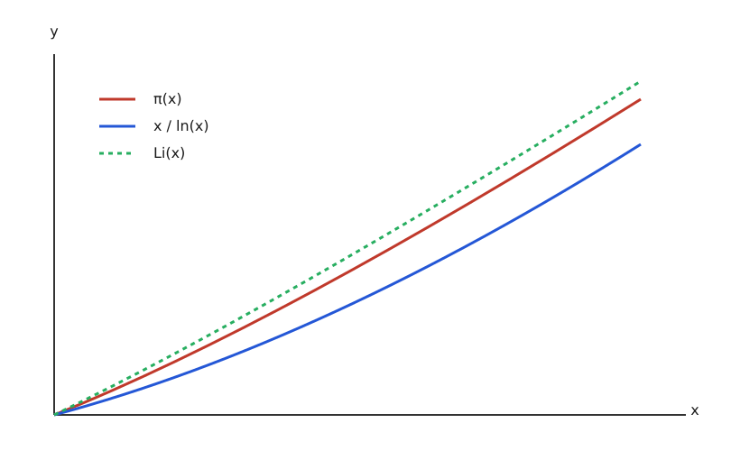

# Розподіл простих чисел

<preknowlist>
- [Прості числа](topic:math/primes) — числа, які діляться лише на 1 та на себе.
- [Логарифм](topic:math/logarithm) — натуральний логарифм `ln(x)`.
- [Ряди](topic:math/series) — нескінченні суми.
</preknowlist>

Коли ми дивимося на прості числа 2, 3, 5, 7, 11, 13, 17, здається, що вони з'являються абсолютно випадково. Не існує простої алгебраїчної формули, яка б гарантовано виводила наступне просте число. Але якщо подивитися на них з великої відстані, виникає вражаючий глобальний порядок. Цей порядок є однією з найглибших таємниць математики. Розподіл простих чисел показує нам, як хаос на мікрорівні перетворюється на ідеальну гармонію на макрорівні.

Почнемо з найперших принципів. Чому прості числа взагалі розподілені нерівномірно і стають рідкісними? Розглянемо аксіоматичне визначення простого числа — це натуральне число, яке має рівно два різних натуральних дільники: 1 і саме себе. Варто відзначити важливий крайовий випадок: число 1 не є простим. Це математична угода (аксіома), що забезпечує єдиність розкладу будь-якого числа на прості множники (Основна теорема арифметики). Якби 1 вважалася простим числом, то число 6 можна було б розкласти як 2 · 3, або 1 · 2 · 3, або 1² · 2 · 3, втрачаючи єдиність факторизації.

Щоб зрозуміти, чому простих чисел стає менше зі збільшенням значень, скористаємося методом Фейнмана: уявіть, що ви йдете вздовж нескінченної числової прямої. Ви зустрічаєте число 2. Воно просте. Але воно "викреслює" (робить складеним) кожне друге число після себе: 4, 6, 8, 10 і так далі. Далі ви зустрічаєте 3. Воно "викреслює" кожне третє число: 6, 9, 12, 15... Число 5 — викреслює кожне п'яте. Цей процес відомий як Решето Ератосфена.

Чим далі ви йдете прямою, тим більше "фільтрів" накладено на неї. Будь-якому дуже великому числу X потрібно "вижити" і не потрапити під дію жодного з попередніх фільтрів (усіх простих чисел, що не перевищують квадратного кореня з X, тобто p ≤ √X). Очевидно, що для величезних чисел шансів "вижити" стає все менше. Більшість чисел "гине" під фільтрами невеликих простих чисел (2, 3, 5, 7 видаляють величезну частку всіх чисел). 

Проте, як довів Евклід ще у Стародавній Греції за допомогою геніального доведення від супротивного, прості числа ніколи не закінчуються. Якщо ми припустимо, що існує скінченна множина всіх простих чисел (p₁, p₂, ..., pₙ), і створимо число N = (p₁ · p₂ · ... · pₙ) + 1, це нове число N не ділитиметься на жодне з простих чисел у нашому списку (завжди залишатиметься остача 1). Отже, N повинно або саме бути простим, або ділитися на якесь нове просте число, якого немає у нашому скінченному списку. У будь-якому разі, існує безмежна кількість простих чисел.

> 🔧 **Навіщо це.** У криптографії (наприклад, алгоритм шифрування RSA) системі потрібно постійно генерувати дуже великі випадкові прості числа (довжиною сотні чи тисячі біт). Знання того, як часто зустрічаються прості числа у певних діапазонах, дозволяє алгоритмам точно оцінити, скільки випадкових чисел їм доведеться перевірити на простоту, перш ніж вони гарантовано натраплять на просте число. Без глибокого розуміння розподілу простих чисел ми не змогли б гарантувати швидку генерацію криптографічних ключів, на яких тримається кібербезпека і конфіденційність всього сучасного інтернету.

## Функція розподілу простих чисел π(x) та її механіка

Щоб надати інтуїтивному спостереженню сувору математичну форму, математики ввели спеціальну лічильну функцію π(x). Функція π(x) жодним чином не пов'язана з геометричним числом π ≈ 3.14 (відношенням довжини кола до діаметра). Вона слугує лише позначенням лічильника кількості простих чисел, які є меншими або дорівнюють заданому дійсному числу x (де x ∈ ℝ, x ≥ 0).

Знайдемо перші опорні значення з перших принципів:
- π(1) = 0 (оскільки 1 не просте)
- π(2) = 1 (єдине просте число — 2)
- π(3) = 2 (прості: 2, 3)
- π(7.5) = 4 (прості до 7.5 — це 2, 3, 5, 7)
- π(10) = 4
- π(100) = 25
- π(1000) = 168
- π(10000) = 1229
- π(100000) = 9592

Давайте заглибимося в математичну механіку цієї функції. Якщо побудувати строгий графік функції π(x), ми побачимо східчасту (кусково-постійну) лінію. Ця лінія стрибає вгору рівно на 1 щоразу, коли координата x проходить через будь-яке просте число p. Для всіх проміжних значень між простими числами (наприклад, на відкритому інтервалі від 7 до 11) функція π(x) залишається незмінною, утворюючи горизонтальну "сходинку" (π(x) = 4 для 7 ≤ x < 11). 

Ця поведінка є квінтесенцією дискретної математики: функція π(x) не є неперервною у класичному сенсі, вона не має повноцінної похідної, її неможливо диференціювати стандартними інструментами Ньютона і Лейбніца. 

Але якщо ми віддалимо масштаб, дивлячись на числа до мільярда чи трильйона, ці мікроскопічні незграбні сходинки зіллються у надзвичайно плавну, макроскопічну криву, яка має цілком чітку геометрію.

Ця крива є строго монотонно зростаючою (оскільки множина простих чисел нескінченна, згідно з Евклідом). Але зверніть увагу на її кривизну: друга похідна цієї макро-кривої є від'ємною — крива опукла вгору (увігнута вниз). Це математичне відображення того факту, що щільність простих чисел постійно, неухильно падає. Серед чисел від 1 до 100 близько 25% є простими. Від 1 до 10 000 — лише 12.3%. Від 1 до 1 000 000 — 7.8%. 

Закономірність цього уповільнення цікавила видатних мислителів. У 1792 році, 15-річний Карл Фрідріх Гаусс, розглядаючи великі таблиці простих чисел, висунув сміливу емпіричну гіпотезу. Він помітив, що локальна щільність простих чисел поблизу великого числа x наближено обернено пропорційна натуральному логарифму цього числа, тобто поводить себе як 1 / ln(x). Наприклад, поблизу числа 1 000 000, ln(1 000 000) ≈ 13.8. Це означає, що навколо мільйона приблизно кожне 14-те число є простим. 

## Теорема про розподіл простих чисел (Prime Number Theorem)

Гіпотеза Гаусса (яку також незалежно сформулював Адрієн-Марі Лежандр у дещо іншій формі) залишалася глибоко інтуїтивним припущенням, яке ніхто не міг довести майже ціле століття. Великий російський математик Пафнутій Чебишов у 1850-х роках зробив гігантський крок вперед: він довів, що якщо відношення π(x) до (x / ln(x)) взагалі має границю, то ця границя обов'язково дорівнює 1. Чебишов навіть довів, що π(x) гарантовано лежить у вузьких межах (між 0.89·x/ln(x) та 1.11·x/ln(x) для великих x).

Але остаточний тріумф настав лише у 1896 році, коли Жак Адамар та Шарль де ла Валле-Пуссен незалежно один від одного навели повні, суворі доведення. Цей фундаментальний результат отримав назву Теорема про розподіл простих чисел.

Суть теореми можна виразити елегантною формулою:
π(x) ~ x / ln(x)

Математичний символ `~` (тильда) означає строгу асимптотичну еквівалентність при прямуванні до нескінченності. Важливо розуміти: це не означає, що абсолютна різниця між функціями зникає. Насправді, абсолютна похибка |π(x) - x / ln(x)| також прямує до нескінченності при x → ∞. Асимптотична еквівалентність означає, що відносне наближення стає ідеальним:

lim [x → ∞] (π(x) / (x / ln(x))) = 1

Чому саме натуральний логарифм ln(x)? Звідки він береться з перших принципів? Логарифм тісно пов'язаний з гармонічним рядом (сумою 1 + 1/2 + 1/3 + 1/4 + ...). Якщо ви намагаєтесь оцінити кількість чисел до x, які не діляться на жодне просте, ви фактично розглядаєте добуток ймовірностей: (1 - 1/2)·(1 - 1/3)·(1 - 1/5)·... Це безпосередньо приводить до оберненого логарифма (наслідок так званої теореми Мертенса).

Ця теорема має колосальне філософське значення для всієї науки. Вона стверджує, що незважаючи на детермінований хаос окремих простих чисел (де немає жодного правила, що забороняє існування величезних "пустель" зі складених чисел, або навпаки, скупчень простих чисел-близнюків), їхня сумарна, інтегральна поведінка підпорядковується чіткому гладкому закону всесвіту. 

Натуральний логарифм базується на числі e ≈ 2.718, константі неперервного росту (бактерій, капіталу в банку, радіоактивного розпаду). Цей зв'язок є глибоким метафізичним мостом між неперервною математикою, що описує плавні фізичні процеси, та теорією чисел — світом ідеальних дискретних структур.

## Інтегральний логарифм Li(x) та асимптотичні розклади

Функція x / ln(x) — дуже потужний інструмент, але з точки зору мінімізації похибки це наближення є досить грубим. Гаусс, застосувавши мислення з перших принципів, запропонував набагато тоншу аналітичну модель.

Розглянемо механіку розподілу як стохастичний (імовірнісний) процес: якщо ймовірність того, що випадкове число t виявиться простим, дорівнює p(t) = 1 / ln(t), то очікувану загальну кількість простих чисел на відрізку [2, x] ми повинні розрахувати, просумувавши ці ймовірності для всіх неперервних значень t. Оскільки ми моделюємо дискретні числа через безперервну щільність, ми маємо замінити дискретну суму (∑) на її неперервний відповідник — інтеграл Рімана (∫). 

Так Гаусс визначив функцію інтегрального логарифма (логарифмічний інтеграл), яка позначається Li(x):

Li(x) = ∫ (від 2 до x) (1 / ln(t)) dt

Геометрично, Li(x) — це просто площа під графіком кривої y = 1 / ln(t) на відрізку від t=2 до t=x. 

Цей перехід до інтегрального числення робить дива з точністю. Давайте порівняємо похибки двох формул для конкретних значень.
Для x = 1 000 000 (мільйон):
- Фактична точна кількість π(x) = 78 498
- Груба оцінка (x / ln(x)) ≈ 72 382 (відхилення 6 116, помилка 7.8%)
- Інтегральна оцінка Гаусса Li(x) ≈ 78 627 (відхилення лише 129, помилка менш ніж 0.16%!)

Чому Li(x) настільки перевершує x / ln(x)? З точки зору матаналізу, ми можемо розкласти інтеграл Li(x) в асимптотичний ряд, застосувавши метод інтегрування частинами:

Li(x) = x / ln(x) + x / (ln(x))² + 2x / (ln(x))³ + 6x / (ln(x))⁴ + ... + k!·x / (ln(x))ᵏ⁺¹

Уважно подивіться на цей розклад. Функція x / ln(x) — це лише перший (найбільший) доданок (член) цього ряду! Коли ми використовуємо x / ln(x), ми просто відкидаємо всі інші члени, які несуть життєво важливу інформацію про тонкі відхилення. Li(x) містить у собі весь нескінченний ряд коригувальних поправок, саме тому він є найдосконалішою "гладкою" моделлю для π(x).

## Тотожність Ейлера як універсальний математичний перекладач

Але яким чином методи математичного аналізу, такі як інтегрування і границі, взагалі отримують доступ до таємниць арифметики? Хто побудував цей портал? Фундамент заклав Леонард Ейлер у 1737 році під час вивчення гармонічних та геометричних рядів.

Ейлер досліджував нескінченну суму обернених степенів усіх без винятку натуральних чисел. Сьогодні ця функція відома як Дзета-функція (позначається грецькою буквою ζ):

ζ(s) = 1/1ˢ + 1/2ˢ + 1/3ˢ + 1/4ˢ + 1/5ˢ + ... = ∑ (1 / nˢ)

Тут індекс n пробігає абсолютно всі натуральні числа від 1 до нескінченності, а параметр s — це дійсне число (суворо більше 1, інакше сума вибухає до нескінченності — розбігається).

Ейлер здійснив геніальну алгебраїчну маніпуляцію, що є математичним еквівалентом Решета Ератосфена. Відтворимо його механіку. Запишемо ряд:
ζ(s) = 1/1ˢ + 1/2ˢ + 1/3ˢ + 1/4ˢ + 1/5ˢ + 1/6ˢ + ...

Помножимо ліву і праву частину на 1/2ˢ:
(1/2ˢ) · ζ(s) = 1/2ˢ + 1/4ˢ + 1/6ˢ + 1/8ˢ + ...

Тепер віднімемо нижнє рівняння від верхнього. Всі доданки зі знаменниками, кратними 2, повністю знищаться!
ζ(s) · (1 - 1/2ˢ) = 1/1ˢ + 1/3ˢ + 1/5ˢ + 1/7ˢ + 1/9ˢ + ...

Наступне найменше вціліле число — це просте число 3. Повторимо процес: помножимо результат на 1/3ˢ і знову віднімемо:
ζ(s) · (1 - 1/2ˢ) · (1 - 1/3ˢ) = 1/1ˢ + 1/5ˢ + 1/7ˢ + 1/11ˢ + ...

Ми щойно "відсіяли" всі числа, кратні 2 та 3. Якщо ми продовжимо цей процес до нескінченності для кожного простого числа p (5, 7, 11...), то в правій частині всі складені числа будуть знищені. Залишиться лише перший доданок, число 1/1ˢ, що дорівнює 1.

Отже, ми отримуємо:
ζ(s) · ∏ (1 - 1/pˢ) = 1

Розділивши обидві частини на добуток ∏, ми отримуємо знамениту Тотожність Ейлера (або Ейлерів добуток):
ζ(s) = ∑ (1 / nˢ) = ∏ [1 / (1 - p⁻ˢ)]

Ліворуч стоїть нескінченна сума (∑), що охоплює ВСІ натуральні числа. Вона є гладкою аналітичною функцією. Праворуч стоїть нескінченний добуток (∏), який перебирає ВИКЛЮЧНО прості числа (p = 2, 3, 5, 7, 11...). 

Ця тотожність є найважливішим "словником" у всій математиці. Вона перекладає аналітичну поведінку неперервної функції ζ(s) на дискретні властивості простих чисел. Це аналітичний вираз Основної теореми арифметики.

## Дзета-функція Рімана, Аналітичне Продовження та Нулі

Справжня революція відбулася у 1859 році, коли німецький математик Бернхард Ріман опублікував свою єдину, але епохальну працю з теорії чисел. Він вивів інструменти Ейлера на новий рівень за допомогою аналітичного продовження.

Ріман запропонував підставляти замість змінної s не просто дійсні числа, а комплексні числа (числа форми s = σ + i·t, де σ — дійсна частина, t — уявна частина, а i — уявна одиниця, i² = -1). Цей крок дозволив обчислити (або "продовжити") функцію ζ(s) на всю комплексну площину. Єдина точка, де функція не існує (сингулярність, полюс) — це s = 1.

Використовуючи комплексний аналіз, Ріман зробив приголомшливе відкриття: геометрія простору точок, де Дзета-функція перетворюється на нуль (ζ(s) = 0), містить у собі повну "генетичну" інформацію про розподіл простих чисел. 

Існує два абсолютно різні класи нулів ζ(s):
1. Тривіальні нулі: вони знаходяться строго на від'ємній частині дійсної осі в точках s = -2, -4, -6... Вони виникають механічно через тригонометричну симетрію (синус) у функціональному рівнянні, що пов'язує ζ(s) та ζ(1-s). Вони передбачувані і не приховують таємниць.
2. Нетривіальні нулі: це нескінченний, хаотичний на перший погляд масив комплексних чисел, які всі скупчені в так званій "критичній смузі" — регіоні, де дійсна координата σ суворо обмежена 0 < σ < 1.

Ріман (і пізніше Гуго фон Мангольдт) розробив точну, явну формулу (Explicit formula), яка ідеально пов'язує дискретні кроки π(x) з цими комплексними нетривіальними нулями. Спрощено структура цієї формули виглядає так:

π(x) = Li(x) - ∑ Li(xᵨ) + інтегральні_поправки

Тут ρ (ро) — це координати нетривіальних нулів у комплексній площині. 
Механіка цієї формули нагадує магію або квантову суперпозицію:
- Li(x) генерує ідеальну, абсолютно гладку криву (головний тренд росту).
- Кожен окремий нетривіальний нуль ρ працює як генератор коливань (хвилі).
- Дійсна частина нуля (σ) визначає амплітуду (розмах) цієї хвилі.
- Уявна частина нуля (t) визначає частоту хвилі. Що вище нуль на уявній осі, то швидше коливається його хвиля.

Коли ми сумуємо ці нескінченні хвилі (∑ Li(xᵨ)), їхні вершини та западини стикаються в просторі. Ця хвильова інтерференція настільки ідеально відкалібрована, що вона "вигризає" ідеальну макро-криву Li(x), згинаючи її в гострі прямі кути. В результаті неперервні хвилі створюють ідеальну дискретну східчасту функцію π(x), яка робить ідеальні стрибки рівно на кожному простому числі! Це абсолютний математичний аналог перетворення Фур'є (або синтезатора звуку), де ми збираємо кутасту меандрову хвилю з нескінченної кількості синусоїд.

## Гіпотеза Рімана і гармонія Всесвіту

Відхилення розподілу простих чисел від ідеальної моделі Li(x) на 100% контролюється розташуванням цих нулів. Чим більша дійсна частина σ у нетривіального нуля (ближче до 1), тим більший хаос і непередбачуваність він генерує у розподілі простих чисел.

І тут Бернхард Ріман формулює гіпотезу, яка стала Святим Граалем усієї сучасної математики:
**Гіпотеза Рімана:** Всі до єдиного нетривіальні нулі Дзета-функції лежать суворо на прямій лінії посередині критичної смуги, де їхня дійсна частина точно дорівнює половині (σ = 1/2). Її називають "критичною лінією".

Що означатиме доведення Гіпотези Рімана з точки зору перших принципів? Якщо всі нулі дійсно обмежені лінією σ = 1/2, це означає, що їхні хвильові амплітуди мінімально можливі. Це доводить, що хаос простих чисел — це ілюзія. Розподіл простих чисел виявиться настільки впорядкованим, гладким, регулярним і "слухняним", наскільки це взагалі дозволяє зробити дискретна природа цілих чисел. 

Доведення Гіпотези Рімана доведе, що похибка (відхилення) між π(x) та Li(x) ніколи в нескінченності не вийде за межі вузького коридору, ширина якого пропорційна √x · ln(x). Це найсильніша можлива форма Теореми про розподіл простих чисел.

Сьогодні Гіпотеза Рімана є однією з семи "Проблем тисячоліття" інституту Клея, за розв'язання якої призначено приз в 1 мільйон доларів. Але її справжня цінність не в грошах. Її доведення автоматично зробить доведеними сотні інших теорем сучасної алгебри і криптографії, які починаються зі слів "Якщо припустити, що Гіпотеза Рімана істинна...".

Зв'язок між фундаментальними неподільними атомами арифметики (простими числами) та найтоншими структурами комплексного аналізу (нулями Дзета-функції) демонструє неймовірну цілісність математики. Розподіл простих чисел — це не випадковий шум. Це найскладніша математична симфонія у Всесвіті, партитура якої записана за допомогою нулів Дзета-функції.
